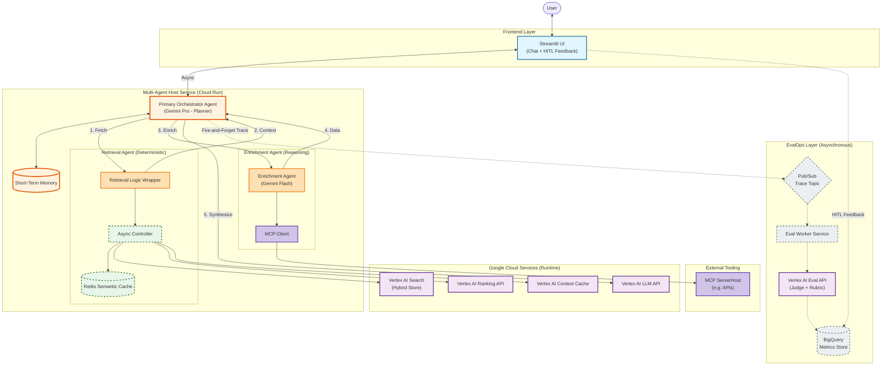
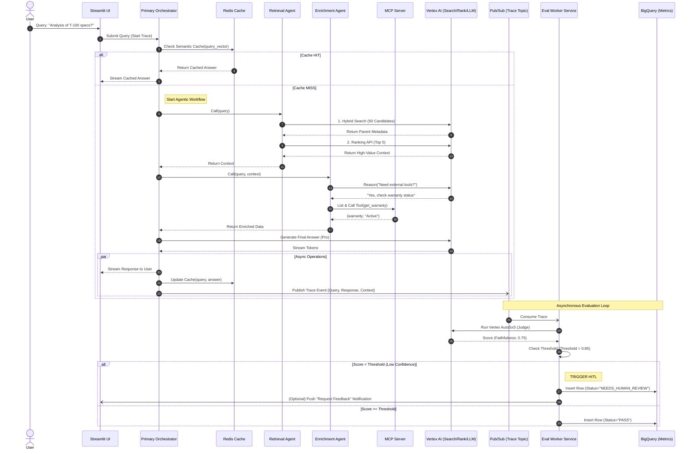
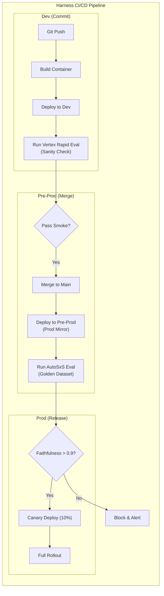

GCP Multi-Agent RAG Accelerator: Engineering Template
Version: 1.0.0 Status: Production Ready Architecture: Multi-Agent (A2A) with Actor Model Key Features: Hybrid Chunking, Vertex Ranking API, MCP Tooling, Async EvalOps, Harness CI/CD.

1. Template Repository Structure
This directory structure is designed for separation of concerns, scalability, and ease of deployment via modern CI/CD systems.
```bash
gcp-mcp-rag-accelerator/
├── README.md                   # The high-level User Guide (see Section 2 below)  
├── Makefile                    # Shortcuts for local dev, linting, and testing    
│
├── terraform/                  # Infrastructure as Code (IaC)
│   ├── main.tf                 # Entry point linking modules
│   ├── variables.tf            # Global variables (Project ID, Region)
│   └── modules/
│       ├── cloudrun_agents/    # Hosts the Main A2A Service & Eval Worker
│       ├── redis/              # Memorystore for Semantic Caching
│       ├── pubsub/             # Async Eval trace topic & subscription
│       ├── bigquery/           # Datasets for Eval Metrics & Golden Sets
│       └── iam/                # Least-privilege service accounts
│
├── harness/                    # CI/CD Pipeline Definitions
│   ├── pipelines/
│   │   └── evalops_pipeline.yaml # The Dev->PreProd->Prod promotion gate logic    
│   └── templates/
│       └── vertex_eval_step.yaml # Reusable step for running AutoSxS
│
├── config/                     # Environment-specific application configurations  
│   ├── dev.yaml                # e.g., Smaller instance sizes, debug logging      
│   ├── preprod.yaml            # e.g., Production data mirror, strict thresholds  
│   └── prod.yaml               # e.g., High HA, production endpoints
│
├── data_prep/                  # Utilities for data ingestion
│   └── parent_child_indexer.py # Script to convert raw text into JSONL for Hybrid Chunking
│
└── src/                        # Application Source Code
    ├── main.py                 # FastAPI entry point for the Main Agent Service   
    │
    ├── agents/                 # The A2A Core Logic (Actor Model)
    │   ├── base_agent.py       # Abstract base class for event-driven agents      
    │   ├── orchestrator.py     # Primary Agent: Gemini Pro planner, state manager 
    │   ├── retrieval_agent.py  # Deterministic Worker: Wraps the optimized lib    
    │   └── enrichment_agent.py # Reasoning Worker: Gemini Flash MCP Client        
    │
    ├── lib/                    # Shared, Optimized Utilities (The "Secret Sauce") 
    │   ├── async_utils.py      # Decorators for non-blocking I/O
    │   ├── cache_mgr.py        # Unified client for Redis & Vertex Context Caching
    │   ├── vertex_retriever.py # Implements Hybrid Chunking & Ranking API calls   
    │   ├── mcp_client.py       # Generic client for discovering/calling MCP servers
    │   └── tracing.py          # OpenTelemetry setup for distributed agent tracing
    │
    └── eval_worker/            # The Separate Async Evaluation Microservice       
        ├── main.py             # entry point listening to Pub/Sub
        └── judge.py            # Implements Vertex Eval SDK & Custom Rubrics      
```

2. Architectural Diagrams & Descriptions
2.1 End-to-End Component Diagram

Description: This detailed feature-level breakdown connects the technical implementation to the specific business value it delivers.

### 1. Frontend Layer
**Streamlit UI (Chat + HITL)**
*   **Feature (Async Streaming):** The UI uses an asynchronous connection to render tokens immediately as they are generated by the backend, rather than waiting for the full response.
*   **Feature (Feedback Mechanism):** Embedded "Thumbs Up/Down" buttons that capture user sentiment associated with a specific `trace_id`.
*   **Value:** Provides a "ChatGPT-like" snappy user experience (perceived latency <1s) and acts as the data collection engine for your Golden Dataset, enabling continuous improvement.

### 2. Multi-Agent Host Service (Cloud Run)
This is the "brain" of the application, running as a containerized microservice.

**Primary Orchestrator Agent (OrchAgent)**
*   **Feature (Planning & Delegation):** Uses **Gemini 1.5 Pro** to understand user intent, decompose complex queries into steps (e.g., "First retrieve data, then check stock"), and delegate tasks to worker agents.
*   **Feature (Short-Term Memory):** Maintains a request-scoped state dictionary to pass context between the Retrieval and Enrichment agents without losing details.
*   **Value:** Separation of concerns. The Orchestrator focuses on strategy while other agents handle execution, preventing "context pollution" where a single agent gets confused by too many instructions.

**Retrieval Agent (The "Librarian")**
*   **Feature (Deterministic Wrapper):** Unlike other agents, this does not use an LLM to "think." It is a code-based agent that strictly executes the optimized retrieval pipeline.
*   **Feature (Async Controller):** Uses Python `asyncio` to fire requests to Redis, Vertex Search, and the Ranking API in parallel non-blocking threads.
*   **Value:** Performance consistency. By removing the LLM from the retrieval logic, you eliminate latency variability and hallucination risks during the data-gathering phase.

**Redis Semantic Cache**
*   **Feature (Vector Similarity Search):** Stores embeddings of previous questions. Incoming queries are hashed and checked against this store (Similarity > 0.95).
*   **Value:** The "Zero-Latency" Path. It instantly answers repeated questions (e.g., "What is the return policy?") with 0ms LLM cost and <50ms latency.

**Enrichment Agent (The "Researcher")**
*   **Feature (Reasoning Engine):** Uses **Gemini 1.5 Flash** (a faster, cheaper model) to analyze retrieved text and decide if external data is missing.
*   **Feature (MCP Client):** Implements the **Model Context Protocol**. It calls `list_tools()` to dynamically discover available external APIs from the MCP Server.
*   **Value:** Extensibility. You can add new tools (e.g., a shipping calculator) to the MCP Server without touching the agent's code. The agent "discovers" the new capability automatically.

### 3. Google Cloud Services (Runtime)
The managed AI infrastructure powering the agents.

**Vertex AI Search (Hybrid Store)**
*   **Feature (Hybrid Chunking):** Implements the "Parent-Child" pattern. It indexes small 100-token chunks for precision search but returns large 500-token "Parent" chunks in the metadata payload.
*   **Value:** Solves the "Context vs. Precision" trade-off. You find the needle in the haystack (child) but give the LLM the whole paragraph (parent) to generate a coherent answer.

**Vertex AI Ranking API**
*   **Feature (Semantic Reranking):** Takes 50 "rough" candidates from the search engine and uses a specialized cross-encoder model to score them by relevance, keeping only the Top 5.
*   **Value:** Context Compression. It removes 90% of the noise before it hits the LLM, reducing hallucinations and lowering inference costs significantly.

**Vertex AI Context Cache**
*   **Feature (Token Caching):** If the system prompt or retrieved documents are massive (>32k tokens), this service caches the processed state of those tokens on Google's TPUs.
*   **Value:** Reduces Time-to-First-Token (TTFT) for heavy queries by up to 50%, making long-document analysis feel snappy.

### 4. External Tooling
**MCP Server (Tool Host)**
*   **Feature (Standardized Protocol):** A standalone service that hosts APIs (Financial Data, Weather, SQL DBs) and exposes them via a standard JSON-RPC interface.
*   **Value:** Security and Decoupling. The Agent never sees API keys or database credentials; it only sees the MCP tool definition. The keys stay locked in the MCP Server.

### 5. EvalOps Layer (Asynchronous)
The quality assurance machinery that runs in the background.

**Pub/Sub (Trace Topic)**
*   **Feature (Fire-and-Forget):** Acts as a buffer. The Orchestrator dumps the trace here and immediately returns to serving the user.
*   **Value:** Ensures that heavy evaluation logic never impacts the user's response time.

**Eval Worker Service**
*   **Feature (The Judge Logic):** A dedicated microservice that wakes up when a message arrives in Pub/Sub. It runs the "Vertex AI Judge" (AutoSxS) and custom Rubrics (e.g., "Did it mention the disclaimer?").
*   **Value:** Scalable Quality Control. You can grade 100% of production traffic without slowing down the application.

**BigQuery (Metrics Store)**
*   **Feature (Unified Data Warehouse):** Joins the Machine Score (from Eval Worker) with the Human Score (from Streamlit) using the `trace_id`.
*   **Value:** The "Data Flywheel." This table becomes the source for your next Golden Dataset, allowing you to fine-tune your prompts based on actual production failures.

2.2 End-to-End Sequence Diagram

Description: This detailed flow breakdown highlights exactly where each engineering optimization (Caching, Async, MCP, EvalOps) is executed in the runtime path.

### Phase 1: Initiation & The "Zero-Latency" Check

* **Step 1:** The **User** submits a query (e.g., "Analysis of T-100 specs?") via the **Streamlit UI**.
* **Step 2:** The UI sends the request asynchronously to the **Primary Orchestrator Agent** running on Cloud Run. A distributed trace ID is generated here to track the request across all microservices.
* **Step 3:** **(Semantic Caching)** The Orchestrator immediately hashes the query and checks **Redis** for a semantic match. This is the "Fast Path" designed to return an answer in <100ms if the question has been asked before.
* **Step 4:** **(Cache Hit Scenario)** If a match is found (Similarity > 0.95), Redis returns the stored answer immediately.
* **Step 5:** The Orchestrator streams this cached response back to the UI, bypassing all subsequent expensive steps.

### Phase 2: Optimized Retrieval (The "Librarian")

* **Step 6:** **(Cache Miss)** If Redis returns null, the Orchestrator delegates the task to the **Retrieval Agent**. This is a deterministic code block, not an LLM.
* **Step 7:** **(Hybrid Chunking)** The Retrieval Agent executes a search against **Vertex AI Search**. It uses a high-precision query against 100-token "Child" chunks but requests the return of the 500-token "Parent" metadata.
* **Step 8:** Vertex AI returns ~50 candidate Parent chunks. This is a "wide" fetch to ensure recall.
* **Step 9:** **(Context Compression)** The Agent sends these 50 candidates to the **Vertex AI Ranking API**.
* **Step 10:** The Ranking API uses a cross-encoder model to score relevance and discards the bottom 45 chunks, returning only the **Top 5 High-Value Chunks**.
* **Step 11:** **(Context Caching)** If these 5 chunks exceed a token threshold (e.g., >10k tokens), the Agent registers them with **Vertex AI Context Cache** to reduce future latency. It returns the `Context_ID` (or raw text) to the Orchestrator.

### Phase 3: Enrichment (The "Researcher")

* **Step 12:** The Orchestrator passes the query and the retrieved context to the **Enrichment Agent**.
* **Step 13:** **(Reasoning)** The Enrichment Agent asks **Gemini 1.5 Flash** (optimized for speed) if the current context is sufficient or if external tools are needed.
* **Step 14:** Gemini Flash reasons: "The user asked for *current* warranty status, which is not in the static docs. Yes, use a tool."
* **Step 15:** **(MCP Discovery)** The Agent uses the **Model Context Protocol (MCP)** to query the **MCP Server** for available tools (`list_tools`).
* **Step 16:** **(MCP Execution)** The Agent dynamically calls the `get_warranty` tool on the MCP Server.
* **Step 17:** The MCP Server returns the live structured data (e.g., `{warranty: "Active", expires: "2027"}`), which is returned to the Orchestrator.

### Phase 4: Generation & Async Write-Back

* **Step 18:** The Orchestrator sends the prompt (System Instructions + Optimized Context + Live MCP Data) to **Gemini 1.5 Pro**.
* **Step 19:** **(Streaming)** Gemini 1.5 Pro begins streaming tokens immediately (Time-to-First-Token).
* **Step 20:** The Orchestrator forwards these tokens to the **Streamlit UI** via Server-Sent Events (SSE) so the user sees the answer being typed out in real-time.
* **Step 21:** **(Async Write)** Simultaneously (without blocking the stream), the Orchestrator updates **Redis** with the new Query-Response pair for future semantic hits.
* **Step 22:** **(Async Trace)** The Orchestrator fires a "fire-and-forget" event to **Pub/Sub** containing the full interaction trace. This concludes the user-facing latency path.

### Phase 5: EvalOps & Human-in-the-Loop (The Background Worker)

* **Step 23:** The **Eval Worker Service** consumes the trace event from Pub/Sub.
* **Step 24:** The Worker calls the **Vertex AI Evaluation API**, triggering an AutoSxS (Side-by-Side) task or a custom rubric check.
* **Step 25:** **(The Judge)** The Vertex AI "Judge" model scores the response (e.g., Faithfulness: 0.75, Relevance: 0.9).
* **Step 26:** The Worker compares this score against the pre-defined **Quality Threshold** (e.g., 0.85).
* **Step 27:** **(HITL Trigger)** Since 0.75 < 0.85, the Worker flags this transaction.
* **Step 28:** The Worker inserts a record into **BigQuery** with the status `NEEDS_HUMAN_REVIEW`.
* **Step 29:** (Optional) The Worker pushes a notification back to the frontend or an admin dashboard, signaling that this specific response requires human verification or user feedback to improve the Golden Dataset.

2.3 DevSecOps Pipeline Diagram (Harness)

Description: This detailed feature-level breakdown of the **DevSecOps Pipeline Diagram** explains how we translate "EvalOps" theory into a concrete, automated Harness pipeline that protects your production environment.

### 1. Stage 1: Development (The "Smoke Test")

This stage triggers on every `git push` to a feature branch. Its goal is speed: fail fast before code even reaches the main branch.

#### **Build & Deploy (Dev)**

* **Feature (Ephemeral Environments):** Harness spins up a temporary Cloud Run instance for this specific branch commit.
* **Value:** Isolation. Developers can test their changes in a live cloud environment without breaking the shared staging environment or stepping on each other's toes.

#### **Vertex Rapid Eval (Sanity Check)**

* **Feature (Small Sample Testing):** Uses the **Vertex AI Rapid Evaluation SDK** to run a "Sanity Set" of just 10-20 questions.
* **Feature (Structural Validation):** Specifically checks for non-semantic errors, such as: "Did the agent return valid JSON?", "Did the tool call succeed?", "Is latency under 5 seconds?".
* **Value:** **Developer Velocity.** It catches basic regressions (e.g., broken JSON schema, syntax errors) in <2 minutes, allowing the developer to fix issues immediately without waiting for a full regression test.

---

### 2. Stage 2: Pre-Production (The "Deep Eval")

This stage triggers when code is merged into the `main` branch. Its goal is accuracy and regression testing.

#### **Deploy to Pre-Prod (Prod Mirror)**

* **Feature (Data Parity):** Deploys the agent to a stable environment that connects to a **mirror** of the production data (e.g., the full Vertex Search index).
* **Value:** Realistic Testing. You cannot test retrieval accuracy if your test environment has only 10 documents. This ensures the agent is tested against the full complexity of real data.

#### **AutoSxS Evaluation (Side-by-Side)**

* **Feature (Gemini-as-a-Judge):** Uses **Vertex AI AutoSxS** to compare the *new* version's answers against the *current* production version's answers.
* **Feature (Golden Dataset):** Runs against a large, curated dataset (e.g., 500+ Q&A pairs stored in BigQuery) derived from real historical user queries.
* **Value:** **Automated Quality Assurance.** It replaces manual QA. Instead of humans reading 500 answers, a stronger model (Judge) statistically proves if the new version is better, worse, or equal to the old one.

---

### 3. Stage 3: The Quality Gate & Production

This is the automated "Go/No-Go" decision point enforced by the Harness platform.

#### **Harness Policy Engine (OPA)**

* **Feature (Policy-as-Code):** A codified rule (using Rego/OPA) that reads the JSON output from the AutoSxS step.
* *Rule:* `allow = true IF faithfulness_score >= 0.90 AND latency_p95 <= 3000ms`.


* **Value:** **Governance without Bureaucracy.** You don't need a manual "Change Approval Board" meeting. If the metrics pass, the code is mathematically proven to be safe for production. If they fail, deployment is blocked automatically.

#### **Canary Deployment (10%)**

* **Feature (Traffic Splitting):** Harness updates the Cloud Run traffic routing to send only 10% of users to the new revision, keeping 90% on the old one.
* **Value:** **Blast Radius Containment.** If there is an edge-case bug that the Golden Dataset missed, it only affects 10% of users. You can roll back instantly before the other 90% even notice.

#### **BigQuery Feedback Loop**

* **Feature (Dynamic Golden Set):** The pipeline doesn't just read from BigQuery; it feeds back into it. Failures detected during Pre-Prod are flagged for human review to potentiality be added to the Golden Dataset.
* **Value:** **Anti-Regression.** The test suite grows smarter over time. Every bug found in production today becomes a test case in the pipeline tomorrow.

3. Infrastructure as Code (Terraform Modules)
3.1 terraform/modules/cloudrun_agents/main.tf
Deploys the main Agent Service and the background Eval Worker.

```hcl

resource "google_cloud_run_service" "main_agent_service" {
  name     = "agent-service-${var.env}"
  location = var.region

  template {
    spec {
      containers {
        image = var.container_image
        env {
          name = "ENV_TYPE"
          value = var.env
        }
        env {
          name = "REDIS_HOST"
          value = var.redis_host
        }
        # Connection to Pub/Sub for Eval traces
        env {
          name = "PUBSUB_TOPIC_ID"
          value = var.pubsub_topic
        }
      }
    }
  }
}

resource "google_cloud_run_service" "eval_worker" {
  name     = "eval-worker-${var.env}"
  location = var.region

  template {
    spec {
      containers {
        image = var.worker_image
        # Worker config
      }
    }
  }
}
```
3.2 terraform/modules/redis/main.tf
Provisions Memorystore for the Semantic Cache.

```hcl

resource "google_redis_instance" "cache" {
  name           = "agent-cache-${var.env}"
  memory_size_gb = 1
  region         = var.region
  redis_version  = "REDIS_6_X"
  display_name   = "Agent Semantic Cache (${var.env})"
}

output "host" {
  value = google_redis_instance.cache.host
}
```
3.3 terraform/modules/pubsub/main.tf
Sets up the async trace pipeline.

```hcl

resource "google_pubsub_topic" "agent_traces" {
  name = "agent-traces-${var.env}"
}

resource "google_pubsub_subscription" "eval_worker_sub" {
  name  = "eval-worker-sub-${var.env}"
  topic = google_pubsub_topic.agent_traces.name
  
  # Push config to Cloud Run worker
  push_config {
    push_endpoint = "${var.eval_worker_url}/process_trace"
    oidc_token {
      service_account_email = var.invoker_sa_email
    }
  }
}
```
3.4 terraform/modules/bigquery/main.tf
Creates the datasets for Golden Sets and Runtime Metrics.

```hcl

resource "google_bigquery_dataset" "eval_ops" {
  dataset_id                  = "agent_eval_ops_${var.env}"
  friendly_name               = "Agent Evaluation Metrics"
  description                 = "Stores AutoSxS results, Runtime Traces, and Golden Datasets"
  location                    = "US"
  default_table_expiration_ms = null
}

resource "google_bigquery_table" "metrics" {
  dataset_id = google_bigquery_dataset.eval_ops.dataset_id
  table_id   = "runtime_metrics"
  schema     = file("${path.module}/schemas/metrics_schema.json")
}
```
3.5 terraform/modules/iam/main.tf
Defines the Service Accounts for the agents.

```hcl

resource "google_service_account" "agent_sa" {
  account_id   = "agent-runner-${var.env}"
  display_name = "Agent Service Runner"
}

# Grant Vertex AI User
resource "google_project_iam_member" "vertex_user" {
  project = var.project_id
  role    = "roles/aiplatform.user"
  member  = "serviceAccount:${google_service_account.agent_sa.email}"
}

# Grant Discovery Engine (Search) User
resource "google_project_iam_member" "search_user" {
  project = var.project_id
  role    = "roles/discoveryengine.editor"
  member  = "serviceAccount:${google_service_account.agent_sa.email}"
}
```
4. Harness Pipeline Definitions
4.1 harness/pipelines/evalops_pipeline.yaml
The master pipeline logic.

```yaml

pipeline:
  name: GCP-Agentic-RAG-EvalOps
  identifier: Agentic_RAG_EvalOps
  projectIdentifier: Default_Project
  orgIdentifier: default
  tags: {}
  stages:
    - stage:
        name: Dev Smoke Test
        identifier: Dev_Smoke_Test
        type: CI
        spec:
          cloneCodebase: true
          execution:
            steps:
              - step:
                  type: Run
                  name: Vertex Rapid Eval
                  identifier: Vertex_Rapid_Eval
                  spec:
                    connectorRef: account.gcp_connector
                    image: python:3.9
                    command: python scripts/run_rapid_eval.py --env dev --limit 20
    
    - stage:
        name: PreProd Deep Eval
        identifier: PreProd_Deep_Eval
        type: CD
        spec:
          serviceConfig:
            serviceRef: agent_service_preprod
          execution:
            steps:
              - step:
                  type: K8sRollingDeploy # Or CloudRunDeploy
                  name: Deploy PreProd
                  identifier: Deploy_PreProd
              
              - step:
                  name: AutoSxS Evaluation
                  identifier: AutoSxS_Eval
                  template:
                    templateRef: vertex_eval_step # Uses the template below
                    templateInputs:
                      golden_dataset: "bq://my-proj.eval.golden_set_v2"
    
    - stage:
        name: Production Gate
        identifier: Production_Gate
        type: Approval
        spec:
          execution:
            steps:
              - step:
                  type: HarnessApproval
                  spec:
                    approvers:
                      userGroups: ["AI_Engineers"]
                    policy:
                      rego: |
                        package pipeline
                        deny[msg] {
                          input.stages.PreProd_Deep_Eval.output.faithfulness < 0.90
                          msg := "Faithfulness below 90%. Deployment Blocked."
                        }
```
4.2 harness/templates/vertex_eval_step.yaml
Reusable template for running Google's evaluation.

```yaml

template:
  name: Vertex AutoSxS Step
  identifier: vertex_eval_step
  type: Step
  spec:
    type: Run
    spec:
      connectorRef: account.gcp_connector
      image: google/cloud-sdk:latest
      command: |
        echo "Starting Vertex AI AutoSxS Evaluation..."
        gcloud ai evaluation-tasks create \
          --display-name="eval-pipeline-${HARNESS_BUILD_ID}" \
          --dataset="<+input.golden_dataset>" \
          --metric-specs="faithfulness,answer_relevance" \
          --output-uri="bq://my-proj.eval.results"
      outputVariables:
        - name: faithfulness
        - name: answer_relevance
```
5. Configuration Files
5.1 config/dev.yaml
```yaml

environment: "dev"
debug_mode: true
log_level: "DEBUG"

vertex:
  search_datastore_id: "docs-ds-dev"
  project_id: "acme-ai-dev"
  location: "global"

agents:
  retrieval:
    top_k_search: 10
    enable_ranking: false # Save cost in dev
  enrichment:
    mcp_servers:
      - name: "mock-tools"
        url: "http://mock-mcp:8080"
```
5.2 config/prod.yaml
```yaml

environment: "prod"
debug_mode: false
log_level: "INFO"

vertex:
  search_datastore_id: "docs-ds-prod"
  project_id: "acme-ai-prod"
  location: "global"

agents:
  retrieval:
    top_k_search: 50
    enable_ranking: true # Critical for quality
    ranking_model: "semantic-ranker-512@latest"
  enrichment:
    mcp_servers:
      - name: "finance-api"
        url: "https://finance-mcp.internal"
      - name: "weather-api"
        url: "https://weather-mcp.internal"
```
6. Data Preparation
6.1 data_prep/parent_child_indexer.py
Utility to chunk data for the Hybrid Chunking strategy.

```python

import json
import argparse

def chunk_text(text, chunk_size, overlap):
    # TODO: Implement robust sliding window tokenizer
    return [text[i:i+chunk_size] for i in range(0, len(text), chunk_size - overlap)]

def main():
    parser = argparse.ArgumentParser()
    parser.add_argument("--input_file", required=True)
    parser.add_argument("--output_file", required=True)
    args = parser.parse_args()

    with open(args.input_file, 'r') as f_in, open(args.output_file, 'w') as f_out:
        raw_data = f_in.read()
        
        # 1. Create Parent Chunk (Context)
        parent_chunks = chunk_text(raw_data, 2000, 200) # 2000 chars ~ 500 tokens
        
        for p_idx, parent in enumerate(parent_chunks):
            # 2. Create Child Chunks (Search Targets)
            child_chunks = chunk_text(parent, 400, 50) # 400 chars ~ 100 tokens
            
            for c_idx, child in enumerate(child_chunks):
                record = {
                    "id": f"doc_{p_idx}_child_{c_idx}",
                    "content": child, # Indexed for search
                    "structData": {
                        "parent_context": parent, # Retrieved payload
                        "source": args.input_file
                    }
                }
                f_out.write(json.dumps(record) + "\n")

if __name__ == "__main__":
    main()
```
7. Source Code (src/)
7.1 src/main.py
FastAPI Entry Point.

```python

from fastapi import FastAPI, BackgroundTasks
from src.agents.orchestrator import OrchestratorAgent
from src.lib.tracing import setup_tracing

app = FastAPI()
setup_tracing(app)

# Initialize Singleton Agent
orchestrator = OrchestratorAgent()

@app.post("/query")
async def chat_endpoint(query_request: dict, background_tasks: BackgroundTasks):
    user_query = query_request.get("query")
    
    # Execute A2A Workflow
    response, trace_data = await orchestrator.execute(user_query)
    
    # Fire-and-forget Eval Trace (Async)
    background_tasks.add_task(orchestrator.publish_trace, trace_data)
    
    return {"answer": response}
```
7.2 src/agents/base_agent.py
Abstract Base Class.

```python

from abc import ABC, abstractmethod

class BaseAgent(ABC):
    def __init__(self, name: str):
        self.name = name

    @abstractmethod
    async def execute(self, *args, **kwargs):
        """Core logic for the agent."""
        pass
```
7.3 src/agents/orchestrator.py
The "Manager" agent.

```python

from src.agents.base_agent import BaseAgent
from src.agents.retrieval_agent import RetrievalAgent
from src.agents.enrichment_agent import EnrichmentAgent
from vertexai.generative_models import GenerativeModel
# Custom Libs
from src.lib.tracing import trace_span

class OrchestratorAgent(BaseAgent):
    def __init__(self):
        super().__init__("Orchestrator")
        self.model = GenerativeModel("gemini-1.5-pro-001")
        self.retriever = RetrievalAgent()
        self.enricher = EnrichmentAgent()
        
    @trace_span("orchestrator_execution")
    async def execute(self, query: str):
        # 1. Delegation: Retrieval
        context_data = await self.retriever.execute(query)
        
        # 2. Delegation: Enrichment (with MCP)
        enriched_data = await self.enricher.execute(query, context_data)
        
        # 3. Synthesis
        prompt = f"""
        Answer the user query based on the context and live data.
        Query: {query}
        Context: {context_data}
        Live Data: {enriched_data}
        """
        response = await self.model.generate_content_async(prompt)
        
        # Prepare Trace Data for Eval
        trace_payload = {
            "query": query,
            "response": response.text,
            "context": context_data
        }
        
        return response.text, trace_payload

    async def publish_trace(self, trace_data):
        # Use PubSub client to push to 'agent-traces' topic
        pass 
```
7.4 src/agents/retrieval_agent.py
Wrapper for the optimized library.

```python

import asyncio
import json
import logging
from typing import List, Dict, Optional

# Google Cloud Async Clients
from google.cloud import discoveryengine_v1 as discoveryengine
# Redis Async Client
import redis.asyncio as redis

# Configuration (Simulated)
PROJECT_ID = "acme-ai-prod"
LOCATION = "global"
DATA_STORE_ID = "acme-docs-ds"
REDIS_URL = "redis://10.0.0.5:6379"

class AsyncControl:
    """
    The High-Performance I/O Engine.
    Wraps all external network calls in non-blocking async methods.
    """
    def __init__(self):
        # Initialize Google Async Clients (Grpc/AsyncIO)
        self.search_client = discoveryengine.SearchServiceAsyncClient()
        self.rank_client = discoveryengine.RankServiceAsyncClient()
        
        # Initialize Redis Async Connection Pool
        self.redis = redis.from_url(REDIS_URL, encoding="utf-8", decode_responses=True)
        
        self.serving_config = f"projects/{PROJECT_ID}/locations/{LOCATION}/collections/default_collection/dataStores/{DATA_STORE_ID}/servingConfigs/default_search"
        self.ranking_config = f"projects/{PROJECT_ID}/locations/{LOCATION}/rankingConfigs/default_ranking_config"

    async def check_cache(self, query_hash: str) -> Optional[str]:
        """Check Redis for existing answer (Zero Latency Path)"""
        return await self.redis.get(f"cache:{query_hash}")

    async def update_cache_bg(self, query_hash: str, response: str):
        """Fire-and-forget cache update"""
        try:
            # Set with TTL (e.g., 1 hour)
            await self.redis.setex(f"cache:{query_hash}", 3600, response)
            logging.info(f"Cache updated for {query_hash}")
        except Exception as e:
            logging.error(f"Failed to update cache: {e}")

    async def hybrid_search(self, query: str, top_k: int = 50) -> List[Dict]:
        """
        Executes Vertex AI Search (Hybrid).
        Fetches WIDE (50 docs) to ensure recall.
        """
        request = discoveryengine.SearchRequest(
            serving_config=self.serving_config,
            query=query,
            page_size=top_k,
            # content_search_spec={"snippet_spec": {"return_snippet": True}}
        )
        
        # Await the network call non-blockingly
        response = await self.search_client.search(request=request)
        
        # Extract results (Parent-Child Logic)
        candidates = []
        async for result in response:
            data = result.document.derived_struct_data
            # HYBRID CHUNKING: We searched 'Child', but we extract 'Parent'
            parent_text = data.get("parent_context", result.document.content)
            candidates.append({
                "id": result.document.id, 
                "content": parent_text
            })
            
        return candidates

    async def semantic_rerank(self, query: str, candidates: List[Dict], top_n: int = 5) -> List[str]:
        """
        Executes Vertex AI Ranking API.
        Compresses 50 candidates down to 5 high-value chunks.
        """
        if not candidates:
            return []

        # Convert candidates to Ranking Records
        records = [
            discoveryengine.RankingRecord(
                id=c["id"], 
                content=c["content"]
            ) for c in candidates
        ]

        request = discoveryengine.RankRequest(
            ranking_config=self.ranking_config,
            model="semantic-ranker-512@latest",
            top_n=top_n,
            query=query,
            records=records
        )

        # Await the heavy ranking operation
        response = await self.rank_client.rank(request=request)
        
        # Return only the text of the top ranked items
        return [r.content for r in response.records]

    async def register_context_cache(self, content_list: List[str]) -> str:
        """
        Simulated: If content > 32k tokens, register with Vertex Context Cache.
        Returns a cache ID or the raw text if small.
        """
        full_text = "\n".join(content_list)
        if len(full_text) > 100000: # Arbitrary large threshold
            # await context_cache_client.create(...)
            return "context_cache_resource_id_123" 
        return full_text


class RetrievalAgent:
    """
    The Deterministic Logic Layer.
    Orchestrates the 'Fan-Out' using AsyncControl.
    """
    def __init__(self):
        self.async_ctrl = AsyncControl()

    async def execute(self, query: str) -> str:
        query_hash = str(hash(query))

        # --- STEP 1: FAST PATH (Cache Check) ---
        cached_result = await self.async_ctrl.check_cache(query_hash)
        if cached_result:
            logging.info("Redis Cache Hit - Returning immediately")
            return cached_result

        logging.info("Cache Miss - Starting Optimized Retrieval Pipeline")

        # --- STEP 2: RETRIEVAL (Search) ---
        # We await this because we can't proceed without data
        candidates = await self.async_ctrl.hybrid_search(query, top_k=50)
        
        # --- STEP 3: COMPRESSION (Ranking) ---
        # We await this because quality is paramount
        top_chunks = await self.async_ctrl.semantic_rerank(query, candidates, top_n=5)

        # --- STEP 4: CONTEXT CACHING (Optimization) ---
        final_context = await self.async_ctrl.register_context_cache(top_chunks)

        # --- STEP 5: ASYNC WRITE-BACK (Fire-and-Forget) ---
        # We do NOT await this. We schedule it on the event loop.
        # This ensures the agent returns data to the LLM immediately 
        # without waiting for Redis to confirm the write.
        asyncio.create_task(
            self.async_ctrl.update_cache_bg(query_hash, final_context)
        )

        return final_context
```
7.5 src/agents/enrichment_agent.py
The "Reasoning" agent using MCP.

```python

from src.agents.base_agent import BaseAgent
from src.lib.mcp_client import MCPClient
from vertexai.generative_models import GenerativeModel
from src.lib.tracing import trace_span

class EnrichmentAgent(BaseAgent):
    def __init__(self):
        super().__init__("EnrichmentAgent")
        self.flash_model = GenerativeModel("gemini-1.5-flash-001")
        self.mcp = MCPClient()

    @trace_span("enrichment_reasoning")
    async def execute(self, query, context):
        # 1. Reason: Do we need a tool?
        decision_prompt = f"Given query '{query}' and context, do we need external tools? YES/NO"
        resp = await self.flash_model.generate_content_async(decision_prompt)
        
        if "YES" in resp.text:
            # 2. Discovery
            tools = await self.mcp.list_tools()
            # TODO: Logic to select best tool from list
            
            # 3. Execution
            result = await self.mcp.call_tool("get_stock_price", {"ticker": "GOOG"})
            return result
            
        return "No external data needed."
```
8. Library (src/lib/)
8.1 src/lib/async_utils.py
```python

import asyncio
import functools

def async_timer(func):
    """Decorator to log execution time of async functions."""
    @functools.wraps(func)
    async def wrapper(*args, **kwargs):
        # Implementation placeholder
        return await func(*args, **kwargs)
    return wrapper
```
8.2 src/lib/cache_mgr.py
Handles Redis and Context Caching.

```python

import redis.asyncio as redis
from google.cloud import aiplatform

class CacheManager:
    def __init__(self, host, port=6379):
        self.redis = redis.Redis(host=host, port=port)

    async def get_semantic_hit(self, embedding_vector):
        # TODO: Implement vector similarity search within Redis (RediSearch)
        return None

    async def create_vertex_context_cache(self, content: str):
        # TODO: Call Vertex AI SDK to create a CachedContent object
        # Return resource ID
        return "projects/.../locations/.../cachedContents/12345"
```
8.3 src/lib/vertex_retriever.py (The Core Engine)
Implements Hybrid Chunking and Ranking.

```python

from google.cloud import discoveryengine_v1alpha as discoveryengine

class VertexRetriever:
    def __init__(self):
        # Initialize clients
        pass

    async def search_rank_and_cache(self, query):
        """
        1. Search (Top 50 Child Chunks)
        2. Extract Parent from structData
        3. Rank (Top 5 Parents)
        """
        # Placeholder for discoveryengine client calls
        # See section 3.2 in user guide for full logic
        return ["Optimized Context Chunk 1", "Optimized Context Chunk 2"]
```
8.4 src/lib/mcp_client.py
Generic MCP Tooling.

```python

import httpx

class MCPClient:
    def __init__(self, server_url="http://localhost:8080"):
        self.base_url = server_url

    async def list_tools(self):
        async with httpx.AsyncClient() as client:
            resp = await client.get(f"{self.base_url}/tools")
            return resp.json()

    async def call_tool(self, tool_name, args):
        async with httpx.AsyncClient() as client:
            resp = await client.post(f"{self.base_url}/tools/{tool_name}/call", json=args)
            return resp.json()
```
8.5 src/lib/tracing.py
OpenTelemetry Boilerplate.

```python

from opentelemetry import trace
from opentelemetry.sdk.trace import TracerProvider
from opentelemetry.exporter.cloud_trace import CloudTraceSpanExporter

def setup_tracing(app):
    trace.set_tracer_provider(TracerProvider())
    # Configure Google Cloud Trace exporter
    pass

def trace_span(name):
    # Decorator to create spans
    def decorator(func):
        async def wrapper(*args, **kwargs):
            tracer = trace.get_tracer(__name__)
            with tracer.start_as_current_span(name):
                return await func(*args, **kwargs)
        return wrapper
    return decorator
```
9. Eval Worker (src/eval_worker/)
9.1 src/eval_worker/main.py
Pub/Sub Listener.

```python

from fastapi import FastAPI, Request
from src.eval_worker.judge import evaluate_trace

app = FastAPI()

@app.post("/process_trace")
async def process_trace_event(request: Request):
    # Unwrap Pub/Sub message
    envelope = await request.json()
    message = envelope.get("message", {})
    trace_data = message.get("data") # Base64 decoded
    
    # Run Evaluation
    await evaluate_trace(trace_data)
    
    return {"status": "ok"}
```
9.2 src/eval_worker/judge.py
Vertex Eval SDK + Rubrics.

```python

from vertexai.preview.evaluation import EvalTask, MetricPromptTemplateExamples

async def evaluate_trace(trace_json):
    """
    1. Parse Trace (Query, Response, Context)
    2. Run Vertex Eval (Groundedness)
    3. Run Custom Rubric (LLM as Judge)
    4. Write to BigQuery
    """
    # TODO: Initialize EvalTask with "faithfulness" and "answer_relevance"
    
    # Custom Rubric Example
    rubric = "Score 1-5. Did the agent explicitly mention the disclaimer?"
    
    # Insert results into BigQuery
    pass
```