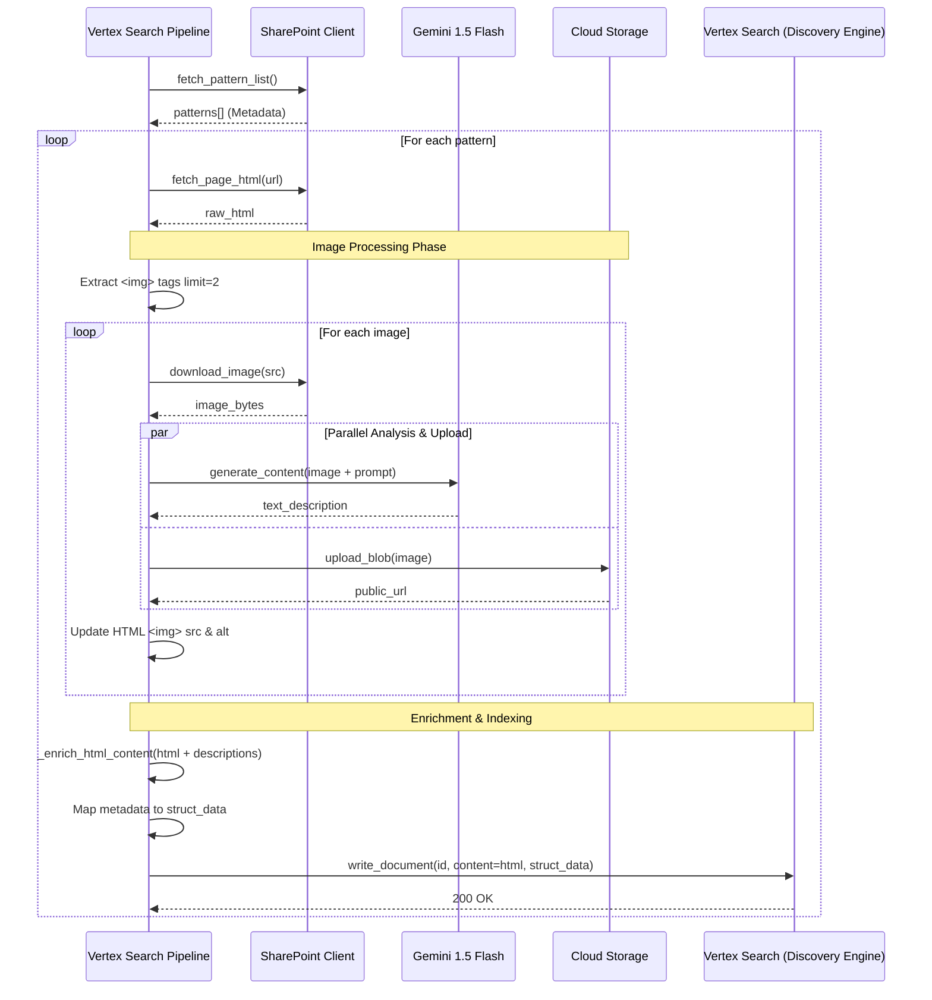
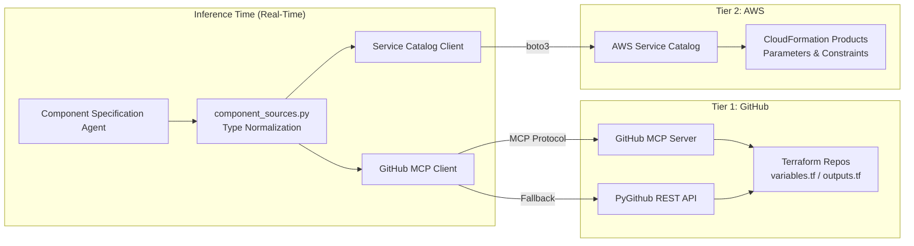
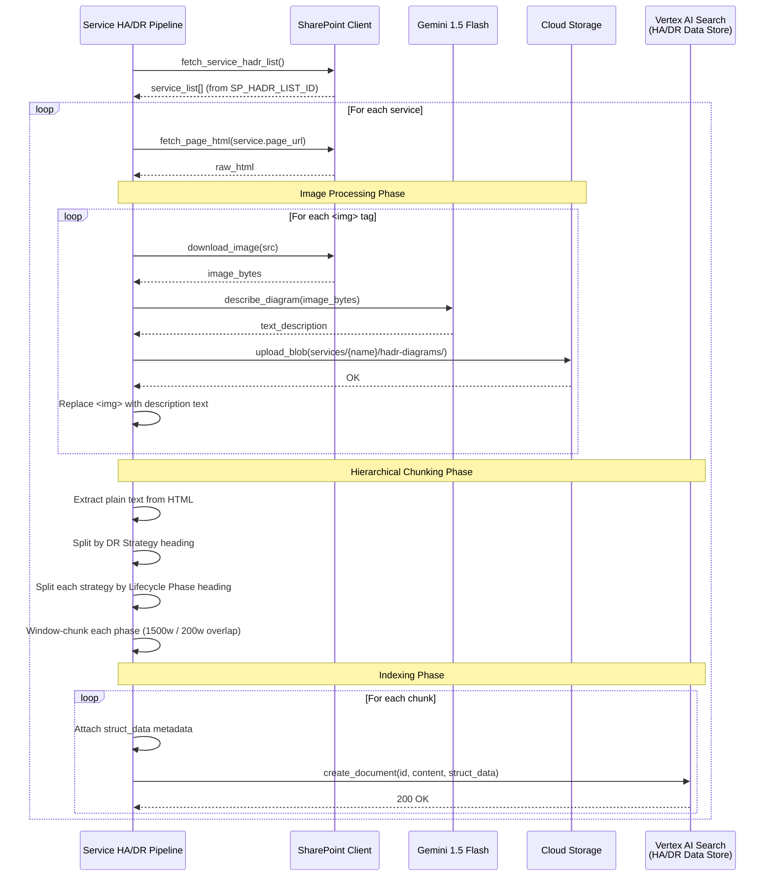
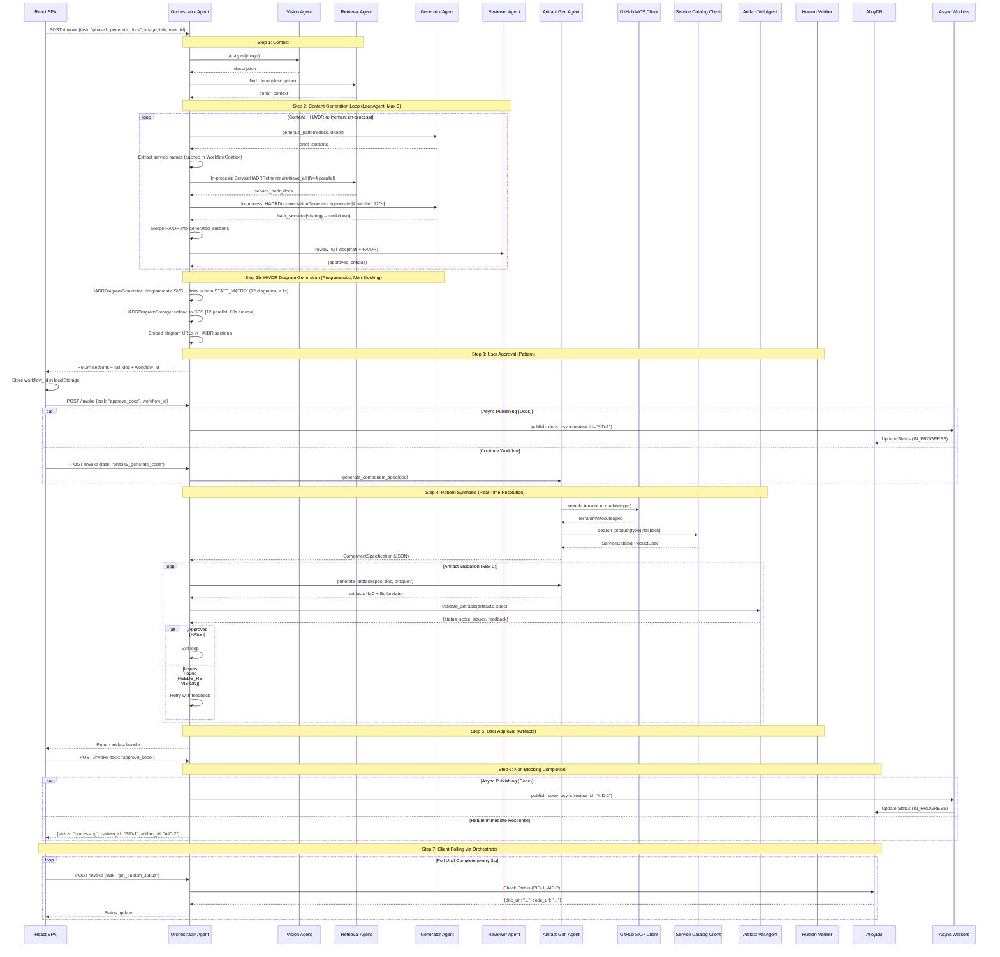
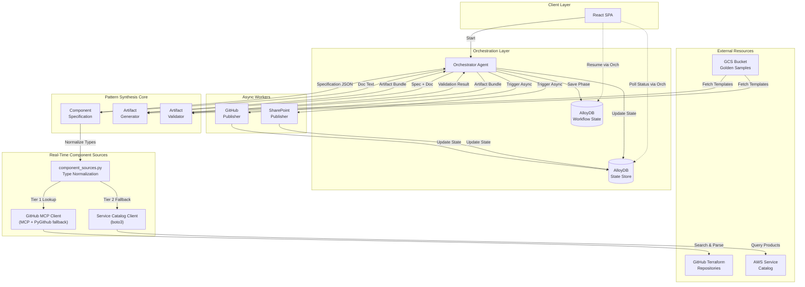
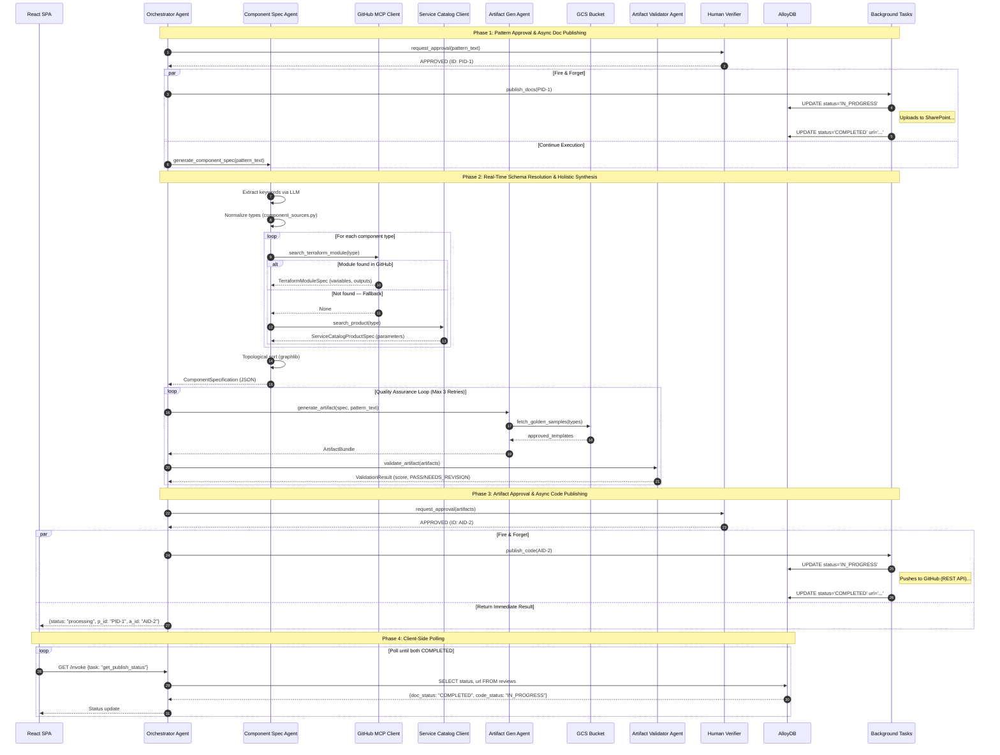
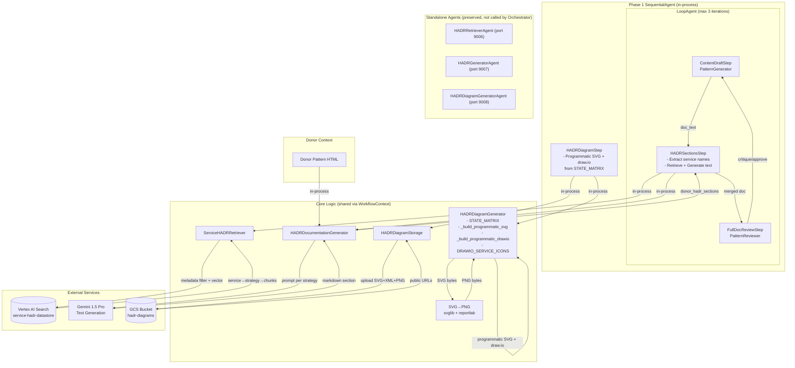
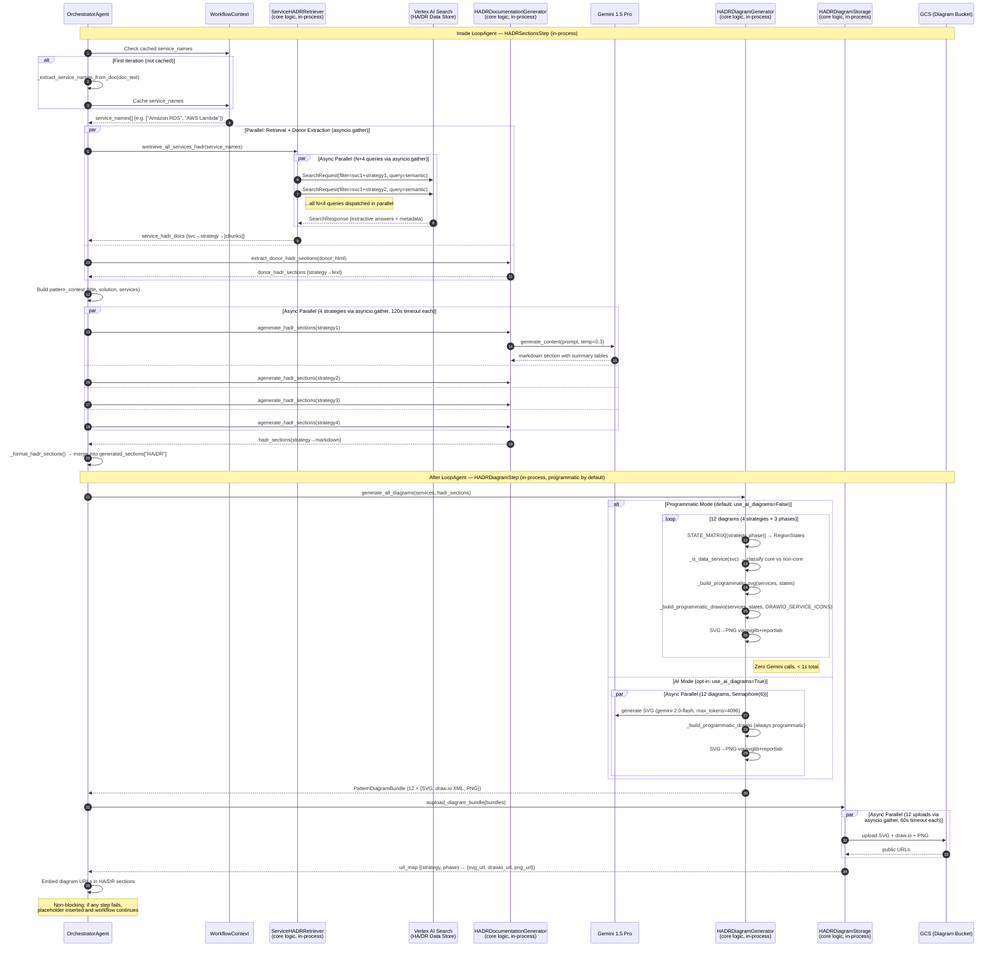
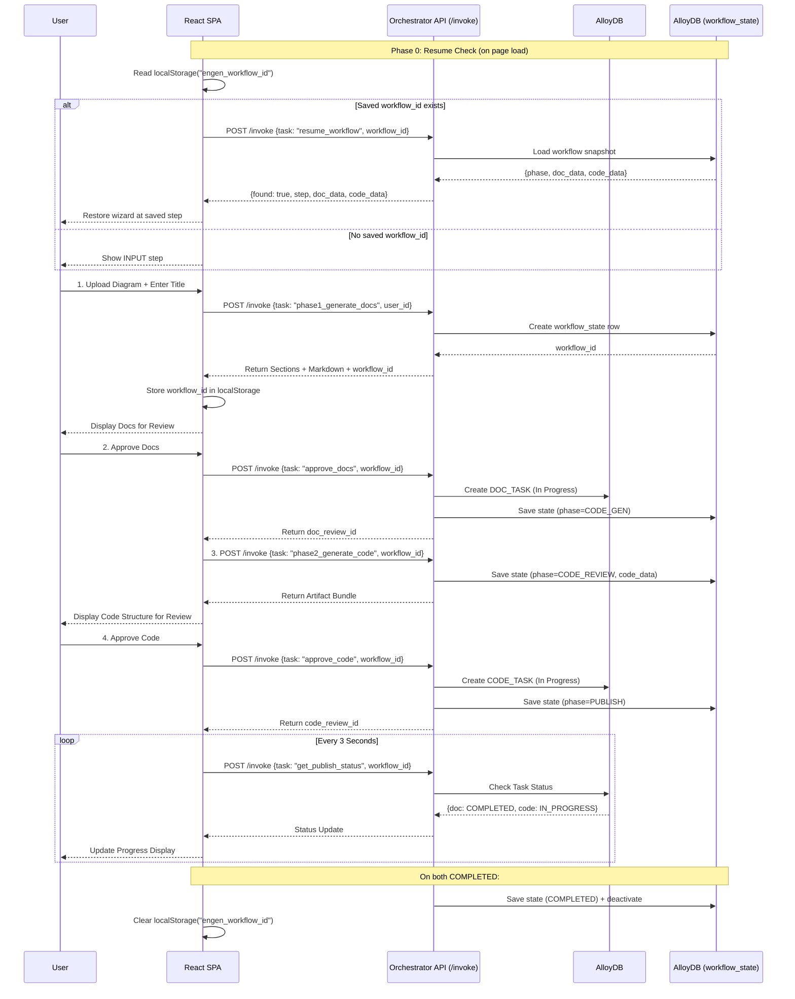

# EnGen: Architecture Pattern Documentation System

**Document Version:** 3.0  
**Date:** April 15, 2026  
**Author:** EnGen Development Team  
**Status:** Production Ready

---

## 1. Objective

EnGen is an intelligent system that automates the creation of high-quality architecture documentation by leveraging a two-part approach:

1. **Ingestion Plane**: Extracts and indexes architecture patterns from SharePoint into a GCP-based knowledge graph
2. **Service HA/DR Ingestion**: Ingests service-level High Availability and Disaster Recovery documentation into a dedicated data store with structured metadata for precise filtered retrieval
3. **Serving Plane**: Uses a multi-agent system to analyze new architecture diagrams and generate comprehensive documentation — including HA/DR sections — using relevant donor patterns
4. **Real-Time Component Resolution**: Queries live infrastructure sources (GitHub repositories via MCP and AWS Service Catalog) to ground generated artifacts in actual schemas

### Primary Goals

- **Automated Documentation**: Generate architecture documentation from diagrams with minimal human intervention
- **Knowledge Reuse**: Leverage existing architecture patterns to ensure consistency and quality
- **Scalability**: Handle large volumes of patterns and concurrent documentation requests
- **Quality Assurance**: Multi-agent review and refinement for production-grade output
- **HA/DR Documentation**: Automated generation of High Availability and Disaster Recovery sections grounded in service-level reference documentation

---

## 2. High-Level Component Diagram

This diagram represents the concrete implementation of the EnGen system, detailing the specific agents involved in the workflow.


```mermaid
graph TB
    subgraph ClientLayer["Client Layer"]
        UI[React SPA<br/>Vite + Chevron Wizard]
    end

    subgraph Serving["SERVING PLANE (Agent Swarm)"]
        Orch[Orchestrator Agent<br/>- Workflow Coordinator]
        
        subgraph Phase1["Phase 1: ADK Workflow (In-Process)"]
            subgraph SeqAgent["SequentialAgent: Phase1DocGenerationWorkflow"]
                VA[VisionAnalysisStep<br/>- Gemini Vision]
                DR[DonorRetrievalStep<br/>- Vertex AI Search]
                subgraph Loop["LoopAgent: ContentRefinementLoop (max 3)"]
                    PG[PatternGenerateStep<br/>- Gemini Pro]
                    HS[HADRSectionsStep<br/>- Parallel Retrieval]
                    FDR[FullDocReviewStep<br/>- Quality Control]
                end
                HD[HADRDiagramStep<br/>- Programmatic SVG + draw.io + GCS]
            end
            VA --> DR --> Loop --> HD
            PG --> HS --> FDR
        end

        subgraph Phase2["Phase 2: A2A HTTP"]
            CompSpec[Component<br/>Specification Agent]
            ArtGen[Artifact<br/>Generation Agent]
            ArtVal[Artifact<br/>Validation Agent]
        end
        
        subgraph Governance["Governance"]
            Human[Human Verifier Agent<br/>- Approval Gate]
        end

        Orch -->|WorkflowContext| SeqAgent
        Orch -->|A2A| CompSpec
        Orch -->|A2A| ArtGen
        Orch -->|A2A| ArtVal
        Orch -->|A2A| Human
    end

    subgraph RealTimeSources["Real-Time Component Sources"]
        GitHubMCP[GitHub MCP Server<br/>Terraform Modules]
        AWSSC[AWS Service Catalog<br/>CloudFormation Products]
    end

    subgraph Async["Async Workers"]
        PubDocs[SharePoint<br/>Publisher]
        PubCode[GitHub<br/>Publisher]
    end
    
    subgraph State["State Management"]
        DB[(AlloyDB<br/>Job Status)]
        WFS[(AlloyDB<br/>Workflow State)]
    end

    subgraph Ingestion["INGESTION PLANE (Managed Pipelines)"]
        SP[SharePoint Client]
        SPPipe[SharePoint<br/>Pipeline]
        VertexAI[Vertex AI<br/>Discovery Engine]
        HADRPipe[Service HA/DR<br/>Pipeline]
        HADRDS[HA/DR Data Store<br/>Vertex AI Search]
        
        SP --> SPPipe
        SP --> HADRPipe
        SPPipe --> VertexAI
        HADRPipe --> HADRDS
    end

    subgraph DiagramStorage["Diagram Artefacts"]
        DiagGCS[GCS Bucket<br/>hadr-diagrams]
    end
    
    HS -->|Direct Call| HADRDS
    HD -->|SVG + draw.io + PNG + Upload| DiagGCS

    UI --> Orch
    UI -.->|Poll via Orch| DB
    UI -.->|Resume via Orch| WFS
    Orch -->|Save Phase| WFS
    Orch -->|Fire & Forget| PubDocs
    Orch -->|Fire & Forget| PubCode
    CompSpec -->|Real-Time Lookup| GitHubMCP
    CompSpec -->|Fallback Lookup| AWSSC
    PubDocs --> DB
    PubCode --> DB
```

### 2.1 Agent Responsibilities

| Agent Name | Role | Primary Responsibility |
|------------|------|------------------------|
| **OrchestratorAgent** | Controller | Manages the end-to-end workflow via task-based BFF endpoints (`phase1_generate_docs`, `approve_docs`, `phase2_generate_code`, `approve_code`, `get_publish_status`, `resume_workflow`, `list_workflows`). **Phase 1 (doc generation)** is orchestrated entirely in-process using an ADK `SequentialAgent` containing a `LoopAgent` — no A2A HTTP calls. Core logic modules (PatternGenerator, VertexRetriever, PatternReviewer, ServiceHADRRetriever, HADRDocumentationGenerator, HADRDiagramGenerator, HADRDiagramStorage) are instantiated directly and shared across workflow steps via a `WorkflowContext`. **Phase 2 (artifact generation)** retains A2A HTTP calls to the ComponentSpecification, ArtifactGeneration, and ArtifactValidation agents. Persists workflow state to AlloyDB via `WorkflowStateManager` at every phase transition for resumable sessions. |
| **VisionAnalysisStep** | Analyser | ADK `WorkflowAgent` step that uses Gemini Vision (via `PatternGenerator.generate_search_description`) to produce a textual description of the architecture diagram. Runs in-process within the Phase 1 `SequentialAgent`. |
| **DonorRetrievalStep** | Librarian | ADK `WorkflowAgent` step that performs hybrid search in Vertex AI Search (via `VertexRetriever.get_best_donor_pattern`) to find the best donor pattern. Runs in-process within the Phase 1 `SequentialAgent`. |
| **PatternGenerateStep** | Creator | ADK `WorkflowAgent` step inside the `LoopAgent` that uses Gemini Pro (via `PatternGenerator.generate_pattern`) to generate core documentation sections, incorporating any critique from the reviewer on subsequent iterations. |
| **HADRSectionsStep** | HA/DR Writer | ADK `WorkflowAgent` step inside the `LoopAgent` that generates pattern-level HA/DR sections. **Optimised**: runs service HA/DR retrieval and donor extraction in parallel via `asyncio.gather`, caches service names across iterations, and skips HA/DR regeneration on iterations > 1 if the reviewer did not flag the HA/DR section. |
| **FullDocReviewStep** | Critic | ADK `WorkflowAgent` step inside the `LoopAgent` that reviews the **entire** document — including HA/DR sections — against quality rubrics and sets the `approved` flag. This is a key improvement: the reviewer now critiques HA/DR quality, enabling HA/DR refinement within the loop. |
| **HADRDiagramStep** | HA/DR Visualiser & Storage | ADK `WorkflowAgent` step that runs **after** the `LoopAgent` to produce SVG, draw.io XML (with official AWS/GCP icon shapes), and PNG fallback images for every DR strategy × lifecycle phase combination. **By default, diagrams are generated programmatically** from a structured `STATE_MATRIX` — zero Gemini calls, 12 diagrams in < 1 second, zero tokens. An opt-in AI mode (`use_ai_diagrams=True`, defaults to `gemini-2.0-flash`) is available for creative SVG layouts; draw.io XML is always programmatic. Uploads all artefacts to GCS and embeds URLs into the HA/DR sections. |
| **ComponentSpecificationAgent** | Architect | Performs **real-time** lookups against GitHub repositories (via MCP Server or PyGithub fallback) and AWS Service Catalog to extract a structured dependency graph grounded in actual infrastructure schemas. Uses `component_sources.py` for type normalization. Accessed via A2A HTTP (Phase 2). |
| **ArtifactGenerationAgent** | Engineer | Synthesizes IaC and Boilerplate using "Golden Sample" templates fetched from GCS. Accessed via A2A HTTP (Phase 2). |
| **ArtifactValidationAgent** | QA | Validates generated code against a 6-point rubric: Syntactic Correctness, Completeness, Integration Wiring, Security, Boilerplate Relevance, and Best Practices. Accessed via A2A HTTP (Phase 2). |
| **HumanVerifierAgent** | Gatekeeper | Provides governance gates with AlloyDB persistence and Pub/Sub notifications. Currently operates in **simulated auto-approval** mode; actual user approval is handled via the React SPA calling orchestrator endpoints directly. |

---

## 3. Ingestion Plane (Managed Pipelines)

The Ingestion Plane handles the end-to-end processing of both unstructured content (SharePoint patterns) and structured infrastructure definitions (Terraform/CloudFormation) into Vertex AI Search. It also maintains a dedicated data store for service-level HA/DR documentation. It uses managed pipelines to consolidate metadata, diagrams, text, and code schemas into a unified knowledge graph.

### 3.1 Design Principles

1.  **Linear Processing**: Processes each pattern end-to-end in a single managed pipeline to ensure simplicity and reliability.
2.  **Multimodal Extraction**: Uses Gemini 1.5 Flash to "read" architectural diagrams and convert them into searchable text descriptions.
3.  **Content Enrichment**: Injects AI-generated diagram descriptions directly into the HTML content to improve RAG retrieval accuracy.
4.  **Managed Indexing**: Leverages Google Cloud Discovery Engine's "Unstructured Data with Metadata" model for simplified state management.
5.  **Media Offloading**: Stores images reliably in GCS while updating HTML references to point to the permanent storage.

> **Note (v2.0):** The Component Catalog Pipeline that previously indexed Terraform modules and Service Catalog products into Vertex AI Search has been deprecated. Component schema resolution is now performed **at inference time** via real-time lookups (see Section 3.5 and Section 4.8).

> **Note (v2.1):** A new Service HA/DR Ingestion Pipeline has been added to index service-level HA/DR documentation into a dedicated Vertex AI Search data store. This enables the Serving Plane to generate grounded HA/DR sections for pattern documents (see Section 3.6 and Section 4.9).

> **Note (v2.2):** HA/DR diagram generation was added, producing SVG + draw.io XML (with official AWS/GCP icon shapes from `DRAWIO_SERVICE_ICONS`) + PNG for every DR strategy × lifecycle phase combination. Async parallelism introduced for all HA/DR operations. *(Diagram generation approach superseded by v3.0 programmatic generation — see below.)*

> **Note (v2.3):** HA/DR components were refactored from direct imports in the Orchestrator into proper **agent wrappers** (`HADRRetrieverAgent`, `HADRGeneratorAgent`, `HADRDiagramGeneratorAgent`) following the established Agent → Core logic → A2A HTTP delegation pattern. JSON tuple-key serialisation uses `"Strategy|Phase"` string keys. *(A2A HTTP delegation superseded by v3.0 in-process ADK workflow — see below. Standalone wrappers preserved for independent deployment.)*

> **Note (v2.4):** The Streamlit front-end has been replaced by a **React 18 + Vite single-page application (SPA)** with a chevron-style 5-step wizard (Section 4.10). A **3-layer resumable workflow state persistence** strategy has been implemented: AlloyDB `workflow_state` table (backend), Orchestrator `resume_workflow` / `list_workflows` tasks (API), and browser `localStorage` pointer (frontend). Users can close the browser and resume from the last completed phase. The `WorkflowStateManager` class (`lib/workflow_state.py`) handles all CRUD operations on the `workflow_state` table.

> **Note (v2.5):** The database backend has been migrated from **CloudSQL for PostgreSQL** to **AlloyDB for PostgreSQL**. AlloyDB is wire-compatible with PostgreSQL so all DDL schemas, JSONB columns, indexes, and SQL queries are unchanged. The migration affects only the connection layer: `AlloyDBManager` (in `lib/cloudsql_client.py`) uses the `google-cloud-alloydb-connector` library with AlloyDB Auth Proxy, replacing the Cloud SQL Auth Proxy connector. The `CloudSQLManager` class name is preserved as a backward-compatibility alias. AlloyDB instance URIs use the format `projects/<PROJECT>/locations/<REGION>/clusters/<CLUSTER>/instances/<INSTANCE>`.

> **Note (v3.0 — ADK Workflow Refactoring):** Phase 1 (doc generation) has been refactored from **A2A HTTP orchestration** to **ADK Workflow Agent orchestration** using `SequentialAgent` + `LoopAgent` primitives defined in `lib/adk_core.py`. All Phase 1 core logic modules (`PatternGenerator`, `VertexRetriever`, `PatternReviewer`, `ServiceHADRRetriever`, `HADRDocumentationGenerator`, `HADRDiagramGenerator`, `HADRDiagramStorage`) are now instantiated directly in the `OrchestratorAgent` and shared across workflow step agents via a `WorkflowContext` — eliminating all HTTP overhead, A2A timeout issues, and session management for Phase 1. The standalone HA/DR agent wrappers (`HADRRetrieverAgent`, `HADRGeneratorAgent`, `HADRDiagramGeneratorAgent` on ports 9006–9008) are preserved for independent deployment but are no longer called by the Orchestrator. **Key architectural change:** HA/DR section generation has been moved **inside** the `LoopAgent` refinement loop so the `FullDocReviewStep` now critiques the entire document (core + HA/DR), enabling HA/DR quality improvement across iterations. Performance optimisations applied: (1) parallel retrieval + donor extraction via `asyncio.gather` in `HADRSectionsStep`; (2) service name extraction cached in `WorkflowContext` (was called twice); (3) HA/DR regeneration skipped on re-iterations if reviewer did not flag it; (4) **HA/DR diagrams are now generated programmatically by default** from a structured `STATE_MATRIX` mapping each (strategy, phase) to deterministic `RegionStates` — zero Gemini calls, 12 diagrams in < 1 second, zero tokens consumed; draw.io XML is always programmatic (even in opt-in AI mode); an opt-in AI mode (`use_ai_diagrams=True`, model defaults to `gemini-2.0-flash`) is available for creative SVG layouts with reduced `max_output_tokens` (4096, down from 8192). Estimated end-to-end time savings: **~130–170 seconds** per pattern generation (text workflow) plus **~60–120 seconds** eliminated by programmatic diagrams. Phase 2 (artifact generation) retains A2A HTTP calls. See `agents/orchestrator/workflow_agents.py` for the step agent implementations.

### 3.2 End-to-End Sequence Diagram


```mermaid
sequenceDiagram
    participant Pipeline as Vertex Search Pipeline
    participant SP as SharePoint Client
    participant Gemini as Gemini 1.5 Flash
    participant GCS as Cloud Storage
    participant ES as Vertex Search (Discovery Engine)

    Pipeline->>SP: fetch_pattern_list()
    SP-->>Pipeline: patterns[] (Metadata)

    loop For each pattern
        Pipeline->>SP: fetch_page_html(url)
        SP-->>Pipeline: raw_html
        
        Note over Pipeline,GCS: Image Processing Phase
        Pipeline->>Pipeline: Extract <img> tags limit=2
        
        loop For each image
            Pipeline->>SP: download_image(src)
            SP-->>Pipeline: image_bytes
            
            par Parallel Analysis & Upload
                Pipeline->>Gemini: generate_content(image + prompt)
                Gemini-->>Pipeline: text_description
            and
                Pipeline->>GCS: upload_blob(image)
                GCS-->>Pipeline: public_url
            end
            
            Pipeline->>Pipeline: Update HTML <img> src & alt
        end
        
        Note over Pipeline,ES: Enrichment & Indexing
        Pipeline->>Pipeline: _enrich_html_content(html + descriptions)
        Pipeline->>Pipeline: Map metadata to struct_data
        
        Pipeline->>ES: write_document(id, content=html, struct_data)
        ES-->>Pipeline: 200 OK
    end
```

### 3.3 End-to-End Flow Description: Vertex Search Pipeline

This pipeline is responsible for unstructured data ingestion. It transforms human-readable SharePoint pages (which contain critical visual architecture diagrams) into machine-searchable text content for the RAG system.

#### Initialization & Configuration
1.  **Environment Setup**: Loads credentials for SharePoint (MSAL), Google Cloud Storage (Service Account), and Vertex AI (ADC).
2.  **Model Loading**: Initializes the `gemini-1.5-flash` model, chosen for its cost-effective multimodal capabilities and low latency.
3.  **Client Initialization**: establishes connections to:
    *   **SharePoint**: For fetching lists and page content.
    *   **GCS**: For long-term image storage.
    *   **Discovery Engine**: For updating the search index.

#### Execution Workflow (`run_ingestion`)
The pipeline operates in a batch mode, processing the entire pattern catalog sequentially.

1.  **List Retrieval**: calls `sp_client.fetch_pattern_list()` to retrieve metadata for all architecture patterns (ID, Title, Approval Status).
2.  **Sequential Processing**: Iterates through each pattern. Errors in one pattern are logged (soft failure) to allow others to proceed.

#### Pattern Processing Logic (`process_single_pattern`)
For each pattern, the pipeline performs a linear sequence of transformations:

1.  **HTML Extraction**: Fetches the raw HTML body of the SharePoint page.
2.  **Multimodal Transformation (Visual -> Text)**:
    *   **Parsing**: Uses `BeautifulSoup` to identify image tags.
    *   **Filtering**: Targets specifically the *first two images*, which canonically represent the Component Diagram and Sequence Diagram.
    *   **Download**: Retrieves the authenticated image binaries from SharePoint.
    *   **Analysis**: Sends the image bytes to **Gemini 1.5 Flash** with a prompt: *"Analyze this technical architecture diagram. Provide a detailed textual description..."*
    *   **Offloading**: Uploads the images to a public-read GCS bucket to replace ephemeral SharePoint links.
    *   **Rewriting**: Updates the HTML `` tags with the new `gs://` (https based) URLs and embeds the generated description into the `alt` text.
3.  **Content Enrichment**:
    *   Creates a new HTML division: `<div class="ai-generated-context">`.
    *   Injects the full text of the Gemini-generated diagram descriptions into this div at the top of the document.
    *   **Why?**: This ensures that when Vertex Search creates embeddings for the document, the "visual" knowledge is fully represented in the vector space, allowing users to search for "systems that use load balancers" even if that text only existed in the image.
4.  **Indexing (Vertex AI Search)**:
    *   **Metadata Mapping**: Maps SharePoint list fields (Title, Owner, Maturity, Status) to the pre-defined `struct_data` schema.
    *   **Upsert**: Calls `doc_client.write_document` with the enriched HTML as `content` and the metadata dictionary. This replaces any existing version of the document.

### 3.4 Component Catalog Pipeline (Legacy)

> **Deprecation Notice (v2.0):** This pipeline has been superseded by real-time component resolution at inference time. The pipeline code has been preserved as `component_catalog_pipeline_legacy.py` for reference. See Section 3.5 for the replacement architecture.

This pipeline was responsible for **structured data ingestion**. It constructed the "ground truth" for the infrastructure agents by indexing the strict interface definitions of available cloud resources into Vertex AI Search. This prevented the "hallucination" of non-existent Terraform variables or CloudFormation parameters.

#### Data Sources (Legacy)
1.  **GitHub Repository**: Source for raw Terraform modules (`.tf`).
2.  **AWS Service Catalog**: Source for governed, pre-approved CloudFormation products.

#### Execution Workflow (Legacy)

1.  **Terraform Module Ingestion**:
    *   **Repository Scanning**: Connects to the configured infrastructure repository using PyGithub.
    *   **Module Discovery**: Crawls the `modules/` directory, looking for `variables.tf` files which define the public interface of a module.
    *   **HCL Parsing**: Uses `python-hcl2` to parse the HashiCorp Configuration Language files.
    *   **Schema Extraction**: Extracts variable names, types, default values, and descriptions.
    *   **Indexing**: Creates a Vertex Search Document with `id="tf-{module_name}"` and category `Terraform Module`.

2.  **Service Catalog Ingestion (AWS Integration)**:
    *   **API Query**: Uses `boto3` to enumerate all products in the AWS Service Catalog.
    *   **Artifact Resolution**: For each product, identifies the **Latest Provisioning Artifact** (Version) to ensure new deployments use modern standards.
    *   **Parameter Extraction**: Calls `describe_provisioning_parameters` to retrieve the exact keys and constraints (AllowedValues, MinLength, etc.) required to provision the product.
    *   **Schema Construction**: Builds a JSON schema explicitly labeled as `type: "service_catalog_product"` and containing the specific `ProvisioningArtifactId`.
    *   **Indexing**: Creates a Vertex Search Document with `id="sc-{product_id}"` and category `Service Catalog Product`.

3.  **Unified Indexing**:
    *   All extracted schemas (Terraform and Service Catalog) were normalized into a common JSON structure.
    *   They were uploaded to a dedicated "Component Catalog" data store in Vertex AI Search, separate from the unstructured document store.

#### Why It Was Replaced

The offline pipeline approach had several limitations:
-   **Staleness**: The indexed catalog could become out of date between pipeline runs.
-   **Scope**: Only modules in pre-configured repositories were available.
-   **Operational Overhead**: Required a separate pipeline execution and monitoring lifecycle.

### 3.5 Real-Time Component Resolution (Current Architecture)

The current architecture replaces the offline Component Catalog Pipeline with **on-demand, real-time lookups** performed at inference time by the `ComponentSpecificationAgent`. This ensures the system always works with the latest module definitions.

#### Architecture Overview


```mermaid
graph LR
    subgraph "Inference Time (Real-Time)"
        Agent[Component Specification Agent]
        Sources[component_sources.py<br/>Type Normalization]
        
        Agent --> Sources
        Sources --> GitMCP[GitHub MCP Client]
        Sources --> AWSSC[Service Catalog Client]
    end
    
    subgraph "Tier 1: GitHub"
        GitMCP -->|MCP Protocol| MCPServer[GitHub MCP Server]
        GitMCP -->|Fallback| PyGithub[PyGithub REST API]
        MCPServer --> Repos[Terraform Repos<br/>variables.tf / outputs.tf]
        PyGithub --> Repos
    end
    
    subgraph "Tier 2: AWS"
        AWSSC -->|boto3| SC[AWS Service Catalog]
        SC --> Products[CloudFormation Products<br/>Parameters & Constraints]
    end
```

#### Component Resolution Flow

1.  **Type Normalization**: Raw component types extracted by the LLM (e.g., "postgres", "k8s", "redis") are mapped to canonical forms (e.g., `rds_instance`, `eks_cluster`, `elasticache`) using a 40+ entry alias dictionary in `component_sources.py`.

2.  **Tier 1 — GitHub MCP Lookup**:
    *   The `GitHubMCPTerraformClient` searches configured GitHub organization repositories for matching Terraform modules.
    *   **Primary path**: Uses the GitHub MCP Server protocol with tools like `search_code`, `search_repositories`, and `get_file_contents`.
    *   **Fallback path**: If MCP is unavailable, falls back to PyGithub REST API, walking the repository tree to find matching `variables.tf` files.
    *   **HCL Parsing**: Uses `python-hcl2` for structural parsing with a regex fallback for edge cases.
    *   Returns `TerraformModuleSpec` dataclasses containing variables, outputs, and metadata.

3.  **Tier 2 — AWS Service Catalog Lookup** (Fallback):
    *   If no GitHub module is found, the `ServiceCatalogClient` searches AWS Service Catalog for matching products using `boto3`.
    *   Extracts the latest provisioning artifact and its parameters, constraints, and allowed values.
    *   Returns `ServiceCatalogProductSpec` dataclasses with full parameter definitions.
    *   Results are cached in-memory to reduce API calls.

4.  **Schema Assembly**: Retrieved schemas from both tiers are combined and passed to the LLM for structured component extraction, producing a JSON dependency graph with topological ordering via `graphlib.TopologicalSorter`.

#### Configuration

| Setting | Source | Default |
|---------|--------|---------|
| GitHub Repos | `GITHUB_TERRAFORM_REPOS` env var | `["rnerurkar/engen-infrastructure"]` |
| AWS Region | `AWS_DEFAULT_REGION` env var | `us-east-1` |
| AWS Profile | `AWS_PROFILE` env var | `default` |
| GitHub PAT | `GITHUB_PERSONAL_ACCESS_TOKEN` env var | Required for MCP/PyGithub |

### 3.6 Service HA/DR Ingestion Pipeline

The Service HA/DR Ingestion Pipeline processes service-level HA/DR documentation from SharePoint into a **dedicated** Vertex AI Search data store (`service-hadr-datastore`). Each service (e.g., Amazon RDS, AWS Lambda) has its own HA/DR documentation page that describes how the service behaves under different DR strategies during provisioning, failover, and failback scenarios.

> **Key Difference from Pattern Ingestion (3.3):** This pipeline does not process architecture diagrams for visual analysis. Instead, it focuses on structured metadata extraction and hierarchical chunking by DR strategy and lifecycle phase.

#### 3.6.1 Design Principles

1.  **Hierarchical Chunking**: Content is split first by DR strategy heading, then by lifecycle phase heading, then by a sliding word-count window (1500 words, 200-word overlap). This preserves contextual boundaries.
2.  **Rich Structured Metadata**: Every chunk carries `service_name`, `service_type` (Compute | Storage | Database | Network), `dr_strategy`, and `lifecycle_phase` fields. This enables precise metadata-filtered retrieval at inference time.
3.  **HA/DR Diagram Handling**: HA/DR diagrams in the source pages are downloaded, stored in GCS, and replaced in the text with LLM-generated textual descriptions (using Gemini 1.5 Flash) so the visual knowledge is captured in the vector space.
4.  **Separation of Concerns**: Uses a dedicated data store separate from the pattern document store. This prevents cross-contamination and enables independent scaling.

#### 3.6.2 End-to-End Sequence Diagram


```mermaid
sequenceDiagram
    participant Pipeline as Service HA/DR Pipeline
    participant SP as SharePoint Client
    participant Gemini as Gemini 1.5 Flash
    participant GCS as Cloud Storage
    participant ES as Vertex AI Search<br/>(HA/DR Data Store)

    Pipeline->>SP: fetch_service_hadr_list()
    SP-->>Pipeline: service_list[] (from SP_HADR_LIST_ID)

    loop For each service
        Pipeline->>SP: fetch_page_html(service.page_url)
        SP-->>Pipeline: raw_html

        Note over Pipeline,GCS: Image Processing Phase
        loop For each <img> tag
            Pipeline->>SP: download_image(src)
            SP-->>Pipeline: image_bytes

            Pipeline->>Gemini: describe_diagram(image_bytes)
            Gemini-->>Pipeline: text_description

            Pipeline->>GCS: upload_blob(services/{name}/hadr-diagrams/)
            GCS-->>Pipeline: OK

            Pipeline->>Pipeline: Replace <img> with description text
        end

        Note over Pipeline,ES: Hierarchical Chunking Phase
        Pipeline->>Pipeline: Extract plain text from HTML
        Pipeline->>Pipeline: Split by DR Strategy heading
        Pipeline->>Pipeline: Split each strategy by Lifecycle Phase heading
        Pipeline->>Pipeline: Window-chunk each phase (1500w / 200w overlap)

        Note over Pipeline,ES: Indexing Phase
        loop For each chunk
            Pipeline->>Pipeline: Attach struct_data metadata
            Pipeline->>ES: create_document(id, content, struct_data)
            ES-->>Pipeline: 200 OK
        end
    end
```

#### 3.6.3 End-to-End Flow Description

1.  **Service Discovery**: The pipeline reads the service catalog from a **dedicated SharePoint List** (`SP_HADR_LIST_ID`) via the `SharePointClient.fetch_service_hadr_list()` method — mirroring how the pattern ingestion pipeline fetches its catalog via `fetch_pattern_list()`. Each list item provides the `service_name` (from the `ServiceName` column), `service_description` (`ServiceDescription`), `service_type` (`ServiceType` — Compute | Storage | Database | Network), and `page_url` (from the `HADRPageLink` hyperlink column) pointing to the service’s HA/DR documentation page in SharePoint. OData pagination is handled automatically.
2.  **HTML Extraction**: For each service, the pipeline fetches the raw HTML body from the SharePoint page URL.
3.  **HA/DR Diagram Processing**: Unlike the pattern pipeline (which targets the first two diagrams), this pipeline processes **all** `` tags in the document:
    *   Downloads the image from SharePoint.
    *   Sends it to **Gemini 1.5 Flash** with the prompt: *"Analyse this HA/DR architecture diagram. Describe the infrastructure components, their redundancy setup, replication flows, and failover mechanisms."*
    *   Uploads the original image to GCS under `services/{safe_name}/hadr-diagrams/diagram_{n}.png`.
    *   Replaces the HTML `` tag with the generated description.
4.  **Hierarchical Chunking**: The enriched plain text is split using a three-level hierarchy:
    *   **Level 1 — DR Strategy**: Heading detection using regex patterns (`DR_STRATEGY_PATTERNS`) identifies the four DR strategies: Backup and Restore, Pilot Light On Demand, Pilot Light Cold Standby, and Warm Standby.
    *   **Level 2 — Lifecycle Phase**: Within each strategy section, heading detection using `LIFECYCLE_PHASE_PATTERNS` splits content into: Initial Provisioning, Failover, and Failback.
    *   **Level 3 — Word Window**: Each phase section is further split by a sliding word window (1500 words max, 200-word overlap) to stay within embedding model limits.

    The resulting chunk tree for a single service document looks like this:

    ```
    Full Service HA/DR Document (e.g., Amazon RDS)
    │
    ├── _split_by_dr_strategy()          ← Level 1: splits into 4 DR strategy sections
    │   │
    │   ├── "Backup and Restore" section (full text)
    │   │   │
    │   │   ├── _split_by_lifecycle_phase()   ← Level 2: splits into 3 lifecycle sub-sections
    │   │   │   │
    │   │   │   ├── "Initial Provisioning" text
    │   │   │   │   │
    │   │   │   │   ├── _size_based_chunk()   ← Level 3: splits into N chunks of ~1500 words
    │   │   │   │   │   ├── Chunk 0  ← stored as a Document in Vertex AI Search
    │   │   │   │   │   ├── Chunk 1
    │   │   │   │   │   └── Chunk 2
    │   │   │   │
    │   │   │   ├── "Failover" text
    │   │   │   │   ├── Chunk 3
    │   │   │   │   └── Chunk 4
    │   │   │   │
    │   │   │   └── "Failback" text
    │   │   │       └── Chunk 5
    │   │
    │   ├── "Pilot Light On Demand" section
    │   │   ├── "Initial Provisioning" → Chunk 6, 7
    │   │   ├── "Failover" → Chunk 8
    │   │   └── "Failback" → Chunk 9
    │   │
    │   ├── "Pilot Light Cold Standby" section
    │   │   ├── "Initial Provisioning" → Chunk 10
    │   │   ├── "Failover" → Chunk 11, 12
    │   │   └── "Failback" → Chunk 13
    │   │
    │   └── "Warm Standby" section
    │       ├── "Initial Provisioning" → Chunk 14, 15
    │       ├── "Failover" → Chunk 16
    │       └── "Failback" → Chunk 17
    ```

    Each leaf chunk is stored as a Document in the Vertex AI Search data store with a unique ID composed of `{service_name}_{chunk_index}`. The `chunk_index` provides global ordering across the entire service document, preserving the strategy → phase → position hierarchy.

5.  **Metadata Attachment**: Every chunk receives a `struct_data` dictionary containing: `service_name`, `service_description`, `service_type`, `dr_strategy`, `lifecycle_phase`, `chunk_index`, `diagram_gcs_urls`, and `diagram_descriptions`. For example, a chunk from the "Failover" phase of the "Backup and Restore" strategy for Amazon RDS would be stored as:

    ```json
    {
      "id": "Amazon_RDS_3",
      "content": "During failover, the RDS Multi-AZ instance automatically promotes the standby replica in the DR region. DNS endpoint remains the same. The promotion typically completes within 60-120 seconds. Application connection strings do not need to change because...",
      "struct_data": {
        "service_name": "Amazon RDS",
        "service_description": "Managed relational database service",
        "service_type": "Database",
        "dr_strategy": "Backup and Restore",
        "lifecycle_phase": "Failover",
        "chunk_index": 3,
        "diagram_gcs_urls": ["gs://engen-service-hadr-images/services/Amazon_RDS/hadr-diagrams/diagram_3.png"],
        "diagram_descriptions": ["A Multi-AZ RDS deployment showing the primary instance in us-east-1a with synchronous replication to the standby in us-east-1b. During failover, Route 53 health checks detect the primary failure and DNS is updated to point at the standby, which is promoted to primary within 60-120 seconds."]
      }
    }
    ```

    The `diagram_gcs_urls` and `diagram_descriptions` fields link the chunk to the original HA/DR architecture diagrams that appeared in the same section of the SharePoint page. During ingestion, each `` tag is processed by Gemini Vision to produce a text description; the original image is stored on GCS. At retrieval time, these fields are returned alongside the chunk text so that downstream generators can use the diagram descriptions as **visual one-shot context** when producing new HA/DR text and diagrams.

    This structure enables the `HADRRetrieverAgent` (Section 4.9, wrapping `ServiceHADRRetriever` core logic) to issue targeted queries like *"retrieve all Failover chunks for Amazon RDS under the Warm Standby strategy"* using metadata-filtered hybrid search, returning only the most relevant passages — and their associated diagram references — without cross-contamination from other services or strategies.

6.  **Indexing**: Each chunk is upserted as a Document in the HA/DR data store using the Discovery Engine `CreateDocumentRequest` API.

#### 3.6.4 Data Store Schema

| Metadata Field | Type | Example | Purpose |
|----------------|------|---------|----------|
| `service_name` | String | `"Amazon RDS"` | Exact-match filter during retrieval |
| `service_description` | String | `"Managed relational DB service"` | Context enrichment |
| `service_type` | String | `"Database"` | Category filter (Compute, Storage, Database, Network) |
| `dr_strategy` | String | `"Warm Standby"` | Strategy-scoped retrieval |
| `lifecycle_phase` | String | `"Failover"` | Phase-level precision |
| `chunk_index` | Integer | `3` | Ordering within a document |
| `diagram_gcs_urls` | List[String] | `["gs://…/diagram_3.png"]` | GCS paths to original HA/DR diagrams that appeared in this chunk's source section |
| `diagram_descriptions` | List[String] | `["A Multi-AZ RDS deployment…"]` | AI-generated text descriptions of those diagrams (produced by Gemini Vision during ingestion) |

#### 3.6.5 Configuration

| Setting | Source | Default |
|---------|--------|---------|
| HA/DR Data Store ID | `SERVICE_HADR_DS_ID` env var | `service-hadr-datastore` |
| HA/DR GCS Bucket | `SERVICE_HADR_GCS_BUCKET` env var | `engen-service-hadr-images` |
| HA/DR Service List | `SP_HADR_LIST_ID` env var | SharePoint List ID (required) |

---

## 4. Serving Plane

The Serving Plane uses a multi-agent system to analyze architecture diagrams, retrieve relevant "donor" patterns, generate comprehensive documentation including HA/DR sections, create Infrastructure-as-Code (IaC) artifacts, and publish the results to SharePoint after human verification.

### 4.1 Design Principles

1.  **Specialization**: Each agent has a single, well-defined responsibility (e.g., Retrieval, Generation, Review, Artifact Creation).
2.  **Agent-to-Agent Communication (A2A)**: Standardized HTTP-based protocol with retry, timeout, and exponential backoff via `A2AClient`.
3.  **Reflection Loop**: Iterative refinement (Generate -> Review -> Generate) until quality threshold met (max 3 iterations).
4.  **Human-in-the-Loop**: User approval is collected via the React SPA wizard (chevron stepper) which calls orchestrator task endpoints directly (`approve_docs`, `approve_code`). The `HumanVerifierAgent` provides an additional governance layer with Pub/Sub notifications, currently operating in simulated auto-approval mode.
5.  **Artifact Generation**: Automated creation of deployable code based on authoritative interfaces ("Golden Samples") from GCS.
6.  **Real-Time Schema Grounding**: Component specifications are grounded in live infrastructure schemas fetched at inference time from GitHub (via MCP or PyGithub) and AWS Service Catalog, replacing the previous offline Vertex AI Search catalog approach.
7.  **Phase-Based Orchestration**: The workflow is split into discrete phases (`phase1_generate_docs`, `phase2_generate_code`) with explicit approval gates between them.
8.  **Non-Blocking HA/DR Generation**: HA/DR section text generation executes **inside** the `LoopAgent` refinement loop (so the full-document reviewer critiques core + HA/DR together). HA/DR diagram generation executes **after** the loop completes. Both are wrapped in non-blocking try/except so that failures do not prevent the main pattern document from being returned.
9.  **Programmatic Diagrams (v3.0)**: HA/DR diagrams are generated **programmatically by default** from a structured `STATE_MATRIX` — zero Gemini calls, 12 diagrams in < 1 second. An opt-in AI mode is available for creative SVG layouts (`use_ai_diagrams=True`, `gemini-2.0-flash`); draw.io XML is always programmatic. GCS upload uses `asyncio.gather` with 60 s per-upload timeout.
10. **Observability**: Centralized logging, metrics tracking, and health checks (liveness/readiness) via the `ADKAgent` framework.

### 4.2 Agent Swarm Architecture

The system consists of the following agents, orchestrating a complex workflow:

*   **Orchestrator Agent**: Workflow coordinator, traffic controller, state manager. Exposes phase-based endpoints.
*   **Vision Agent**: "Eyes" of the system, converts pixels to technical descriptions (handled within Generator Agent).
*   **Retrieval Agent**: "Memory", finds relevant prior art (RAG) via Vertex AI Search.
*   **Generator Agent**: "Writer", drafts content using Gemini Vision (image analysis) and Gemini Pro (text generation) with donor context.
*   **Reviewer Agent**: "Critic", evaluates quality using rubrics.
*   **Component Specification Agent**: "Architect", resolves infrastructure schemas via real-time GitHub MCP and AWS Service Catalog lookups, producing a topologically-sorted dependency graph.
*   **Artifact Generation Agent**: "Engineer", synthesizes both IaC and application reference code using Golden Sample templates.
*   **Artifact Validation Agent**: "QA Engineer", validates generated code against a 6-point rubric (Syntax, Completeness, Integration, Security, Relevance, Best Practices).
*   **Human Verifier Agent**: "Gatekeeper", manages the approval lifecycle with AlloyDB persistence and Pub/Sub notifications.
*   **HA/DR Retriever Agent**: "HA/DR Librarian", performs hybrid retrieval (metadata filter + vector search) against a dedicated `service-hadr-datastore` to fetch service-level HA/DR documentation chunks. In v3.0, invoked as in-process `HADRSectionsStep` within the `LoopAgent` via `ServiceHADRRetriever` core logic (no A2A HTTP). Standalone agent wrapper on port 9006 preserved for independent deployment.
*   **HA/DR Generator Agent**: "HA/DR Writer", synthesizes service-level HA/DR references with donor pattern examples to produce pattern-level HA/DR sections via Gemini 1.5 Pro. In v3.0, invoked as in-process `HADRSectionsStep` within the `LoopAgent` via `HADRDocumentationGenerator` core logic (no A2A HTTP). Standalone agent wrapper on port 9007 preserved for independent deployment.
*   **HA/DR Diagram Generator Agent**: "HA/DR Visualiser & Storage Manager", produces SVG, draw.io XML (with official AWS/GCP icon shapes), and PNG component diagrams for all 12 DR strategy × lifecycle phase combinations, then uploads artefacts to GCS and returns public URLs. In v3.0, invoked as in-process `HADRDiagramStep` after the `LoopAgent` via `HADRDiagramGenerator` + `HADRDiagramStorage` core logic (no A2A HTTP). **Diagrams are generated programmatically** by default from a `STATE_MATRIX` (zero Gemini calls); opt-in AI mode available. Standalone agent wrapper on port 9008 preserved for independent deployment.

### 4.3 High-Level Sequence Diagram


```mermaid
sequenceDiagram
    participant Client as React SPA
    participant Orch as Orchestrator Agent
    participant Vision as Vision Agent
    participant Ret as Retrieval Agent
    participant Gen as Generator Agent
    participant Rev as Reviewer Agent
    participant Artifact as Artifact Gen Agent
    participant GitMCP as GitHub MCP Client
    participant SvcCat as Service Catalog Client
    participant Validator as Artifact Val Agent
    participant Verifier as Human Verifier
    participant DB as AlloyDB
    participant Async as Async Workers

    Client->>Orch: POST /invoke {task: "phase1_generate_docs", image, title, user_id}
    
    Note over Orch,Ret: Step 1: Context
    Orch->>Vision: analyze(image)
    Vision-->>Orch: description
    Orch->>Ret: find_donor(description)
    Ret-->>Orch: donor_context

    Note over Orch,Rev: Step 2: Content Generation Loop (LoopAgent, Max 3)
    loop Content + HA/DR refinement (in-process)
        Orch->>Gen: generate_pattern(desc, donor)
        Gen-->>Orch: draft_sections
        Orch->>Orch: Extract service names (cached in WorkflowContext)
        Orch->>Ret: In-process: ServiceHADRRetriever.aretrieve_all [N×4 parallel]
        Ret-->>Orch: service_hadr_docs
        Orch->>Gen: In-process: HADRDocumentationGenerator.agenerate [4 parallel, 120s]
        Gen-->>Orch: hadr_sections{strategy→markdown}
        Orch->>Orch: Merge HA/DR into generated_sections
        Orch->>Rev: review_full_doc(draft + HA/DR)
        Rev-->>Orch: {approved, critique}
    end

    Note over Orch,Gen: Step 2b: HA/DR Diagram Generation (Programmatic, Non-Blocking)
    Orch->>Orch: HADRDiagramGenerator: programmatic SVG + draw.io from STATE_MATRIX (12 diagrams, < 1s)
    Orch->>Orch: HADRDiagramStorage: upload to GCS [12 parallel, 60s timeout]
    Orch->>Orch: Embed diagram URLs in HA/DR sections

    Note over Orch,Verifier: Step 3: User Approval (Pattern)
    Orch-->>Client: Return sections + full_doc + workflow_id
    Client->>Client: Store workflow_id in localStorage
    Client->>Orch: POST /invoke {task: "approve_docs", workflow_id}
    
    par Async Publishing (Docs)
        Orch->>Async: publish_docs_async(review_id="PID-1")
        Async->>DB: Update Status (IN_PROGRESS)
    and Continue Workflow
        Client->>Orch: POST /invoke {task: "phase2_generate_code"}
        Orch->>Artifact: generate_component_spec(doc)
    end

    Note over Orch,Validator: Step 4: Pattern Synthesis (Real-Time Resolution)
    
    Artifact->>GitMCP: search_terraform_module(type)
    GitMCP-->>Artifact: TerraformModuleSpec
    Artifact->>SvcCat: search_product(type) [fallback]
    SvcCat-->>Artifact: ServiceCatalogProductSpec
    Artifact-->>Orch: ComponentSpecification (JSON)
    
    loop Artifact Validation (Max 3)
        Orch->>Artifact: generate_artifact(spec, doc, critique?)
        Artifact-->>Orch: artifacts (IaC + Boilerplate)
        Orch->>Validator: validate_artifacts(artifacts, spec)
        Validator-->>Orch: {status, score, issues, feedback}
        alt Approved (PASS)
             Orch->>Orch: Exit loop
        else Issues Found (NEEDS_REVISION)
             Orch->>Orch: Retry with feedback
        end
    end

    Note over Orch,Verifier: Step 5: User Approval (Artifacts)
    Orch-->>Client: Return artifact bundle
    Client->>Orch: POST /invoke {task: "approve_code"}

    Note over Orch,DB: Step 6: Non-Blocking Completion
    
    par Async Publishing (Code)
        Orch->>Async: publish_code_async(review_id="AID-2")
        Async->>DB: Update Status (IN_PROGRESS)
    and Return Immediate Response
        Orch-->>Client: {status: "processing", pattern_id: "PID-1", artifact_id: "AID-2"}
    end

    Note over Client,DB: Step 7: Client Polling via Orchestrator
    loop Poll Until Complete (every 3s)
        Client->>Orch: POST /invoke {task: "get_publish_status"}
        Orch->>DB: Check Status (PID-1, AID-2)
        DB-->>Orch: {doc_url: "...", code_url: "..."}
        Orch-->>Client: Status update
    end
```

### 4.4 End-to-End Flow Description

#### Phase 1: Contextualization
1.  **Analysis**: The Orchestrator sends the input diagram to the `Generator Agent`. The agent uses Gemini Vision to extract a detailed technical description.
2.  **Retrieval**: The Orchestrator uses this description to query the `Retriever Agent`. This agent performs a hybrid search (Vector + Keyword) in Vertex AI Search to find the best matching "Donor Pattern" to serve as a structural template.

#### Phase 2: Content Generation Loop (LoopAgent, In-Process)
3.  **Drafting**: The `ContentDraftStep` invokes `PatternGenerator` with the diagram description and the donor pattern context. Gemini 1.5 Pro generates a first draft of the documentation (Problem, Solution, Architecture).
4.  **HA/DR Section Generation (Inside Loop)**: The `HADRSectionsStep` executes within the same `LoopAgent` iteration:
    *   Extracts canonical service names from the generated documentation using regex matching against the `component_sources.py` alias dictionary (40+ mappings) and a curated list of common service names. Results are cached in `WorkflowContext`.
    *   Calls `ServiceHADRRetriever.aretrieve_all_services_hadr()` in-process to query the `service-hadr-datastore` via **hybrid retrieval** (metadata filter + vector search). All N × 4 queries are dispatched in parallel via `asyncio.gather`.
    *   Calls `HADRDocumentationGenerator.extract_donor_hadr_sections()` in-process to parse the donor pattern's HTML and extract HA/DR sub-sections.
    *   Retrieval and donor extraction run in parallel via `asyncio.gather`.
    *   Calls `HADRDocumentationGenerator.agenerate_hadr_sections()` in-process — all four DR strategy sections generated in parallel via `asyncio.gather`, each with a 120 s timeout.
    *   Results include per-phase summary tables showing each service's state (Active, Standby, Scaled-Down, Not-Deployed).
5.  **Full-Document Review**: The `FullDocReviewStep` sends the complete document (core sections + HA/DR) to the `PatternReviewer`. This enables the reviewer to critique HA/DR quality alongside core content.
6.  **Refinement**: If the score is below threshold, the `LoopAgent` feeds the critique back for a revised draft. HA/DR is regenerated only if the reviewer flagged it. This repeats for up to 3 iterations.
7.  **Non-Blocking Merge**: The generated HA/DR sections are merged into the `generated_sections` dictionary under the `HA/DR` key. If HA/DR generation fails for any reason, a placeholder message is inserted and the workflow continues normally — the main pattern document is never blocked by HA/DR failures.

#### Phase 2b: HA/DR Diagram Generation & Storage (Programmatic, Non-Blocking)
8.  **Programmatic Diagram Generation (Default)**: The `HADRDiagramStep` runs **after** the `LoopAgent` completes. By default, `HADRDiagramGenerator` produces all 12 diagrams (4 DR strategies × 3 lifecycle phases) **programmatically** from a structured `STATE_MATRIX` — a dictionary mapping each `(strategy, phase)` to a `RegionStates` dataclass specifying the exact state (Active, Standby, Scaled-Down, Not-Deployed) for core vs. non-core services in primary and DR regions. The `_is_data_service()` classifier distinguishes data services (databases, storage) from compute services. SVG is built by `_build_programmatic_svg()` and draw.io XML by `_build_programmatic_drawio()` (using the `DRAWIO_SERVICE_ICONS` registry). **Zero Gemini calls, < 1 second for all 12 diagrams, zero tokens consumed.**
9.  **Opt-In AI Mode**: When `use_ai_diagrams=True`, SVG generation uses Gemini (`gemini-2.0-flash` by default, configurable via `ai_model_name`) with `max_output_tokens=4096`. Draw.io XML remains always programmatic even in AI mode (biggest token savings). AI mode uses `asyncio.gather` with `Semaphore(6)` concurrency control and per-diagram timeout.
10. **SVG→PNG Conversion**: PNG fallback images are generated locally from the SVG content using `svglib` + `reportlab` (with `pycairo` shim on Windows). On Linux, `cairosvg` is the primary converter.
11. **Diagram Storage**: `HADRDiagramStorage.aupload_diagram_bundle()` uploads all three artefacts per diagram to GCS in parallel with a 60 s timeout per upload.
12. **URL Embedding**: The returned diagram URLs are embedded into the HA/DR markdown sections so that the rendered documentation contains inline SVG references and links to the editable draw.io files.

#### Phase 3: Governance (Point 1) & Async Doc Publishing
13. **Pattern Verification**: The Orchestrator returns the generated documentation — including HA/DR sections with embedded diagram URLs — to the React SPA. The user reviews the pattern sections and the HA/DR content (with inline diagrams) in collapsible expander panels, then clicks "Approve & Continue" in the chevron wizard.
14. **Approval**: The React SPA calls the `approve_docs` task (passing the `workflow_id`). The Orchestrator updates AlloyDB review status, persists the workflow state to `CODE_GEN` via `WorkflowStateManager`, and receives a `review_id`.
15. **Async Publishing**: It immediately spawns a background task to publish the documentation to SharePoint, using the `review_id` to track progress in AlloyDB. The workflow *does not wait* for this to finish but proceeds to artifact generation.

#### Phase 4: Pattern Synthesis (Holistic Generation)
16. **Real-Time Schema Resolution**: The `ComponentSpecificationAgent` extracts component keywords from the documentation, normalizes them using the `component_sources.py` alias dictionary (40+ mappings), and performs a two-tier real-time lookup:
    *   **Tier 1 (GitHub)**: Searches configured GitHub repositories via the MCP Server protocol (with PyGithub fallback) for matching Terraform modules, parsing `variables.tf` and `outputs.tf` files using `python-hcl2`.
    *   **Tier 2 (AWS)**: Falls back to AWS Service Catalog via `boto3` to find matching CloudFormation products with their provisioning parameters and constraints.
17. **Comprehensive Specification**: It generates a structured dependency graph grounded in these real-world schemas, with topological ordering via `graphlib.TopologicalSorter` to determine execution order.
18. **Golden Sample Injection**: The `ArtifactGenerationAgent` retrieves enterprise-approved "Golden Sample" IaC templates from GCS to use as few-shot examples.
19. **Unified Generation**: The agent generates both the **Infrastructure as Code (Terraform)** and the **Reference Implementation (Boilerplate)** in a single context window.
20. **Automated Validation Loop**:
    *   **Validate**: The `ArtifactValidationAgent` checks the generated code against a 6-point rubric: Syntactic Correctness (Critical), Completeness (Critical), Integration Wiring (Critical), Security (High), Boilerplate Functional Relevance (Medium), Best Practices (Medium).
    *   **Feedback**: If issues are found, the critique is fed back to the generator.
    *   **Retry**: The generator attempts to fix the specific issues (max 3 retries).

#### Phase 5: Governance (Point 2) & Async Code Publishing
21. **Artifact Verification**: The validated code bundle is sent to the `HumanVerifierAgent` for final expert review (or approved directly via the React SPA wizard).
22. **Async Publishing**: On approval, the Orchestrator spawns a second background task to push the code to GitHub via the REST API (direct push to the configured branch). The workflow state is persisted to `PUBLISH` via `WorkflowStateManager`.
23. **Immediate Return**: The Orchestrator returns a `processing` status to the client, along with the review IDs needed to track the background tasks.

#### Phase 6: Client Polling
24. **Status Check**: The React SPA's `PublishStep` component polls the orchestrator's `get_publish_status` task every 3 seconds using the returned IDs and `workflow_id`.
25. **Completion**: Once the background tasks update the DB status to `COMPLETED`, the orchestrator marks the workflow state as `COMPLETED`, deactivates the `workflow_state` row, and relays the final URLs for the SharePoint page and GitHub commit back to the client. The SPA clears `localStorage("engen_workflow_id")`.


### 4.5 Response Assembly

Upon initiating the pattern generation and async publishing tasks, the Orchestrator constructs an immediate response to the client. This response facilitates non-blocking UI updates.

**Response Payload:**
-   `status`: `"workflow_completed_processing_async"`
-   `pattern_review_id`: UUID for tracking the documentation publishing status.
-   `artifact_review_id`: UUID for tracking the code publishing status.
-   `message`: Informational message about background processing.

The final URLs (SharePoint page, GitHub commit) are **not** returned here but must be retrieved via polling the AlloyDB `reviews` table.

### 4.6 Error Handling Strategy

The Orchestrator implements robust error handling for both synchronous agent interactions and asynchronous background tasks:

-   **Vision/Retrieval/Generator Fails**: Orchestrator catches `A2AError`, retries 3x, and returns a structured error response if exhausted.
-   **Validation Loop**: If artifact validation fails 3 times, the workflow halts and returns the validation errors for manual intervention.
-   **Async Publishing Fails**: 
    -   If SharePoint or GitHub API calls fail, the background worker catches the exception.
    -   It updates the AlloyDB status to `FAILED`.
    -   The client polling mechanism sees the failure and can display an error message or retry button to the user.
-   **HA/DR Generation Fails**: The entire HA/DR generation step (service name extraction, retrieval, generation) is wrapped in a top-level try/except. If any sub-step fails, a placeholder message ("*HA/DR section generation failed. Please complete manually.*") is inserted into the `generated_sections` dictionary and the workflow continues. The pattern document is never blocked by HA/DR failures.
### 4.7 Multi-Channel Publishing

The system separates the publishing of documentation and implementation code into distinct, asynchronous workflows. This ensures that documentation is available immediately upon approval, while code generation (which takes longer) proceeds in parallel.

#### 4.7.1 SharePoint (Documentation Knowledge Base)
Upon approval of the design pattern text, the `SharePointPublisher` converts the markdown content into a modern SharePoint page. This serves as the authoritative interface documentation.

#### 4.7.2 GitHub (Implementation Repository)
Upon approval of the generated artifacts, the `GitHubMCPPublisher` commits the files to the target repository using the GitHub REST API (Git tree manipulation: get ref → create tree → create commit → update ref).
*   `infrastructure/{iac_type}/`: Contains Terraform or CloudFormation templates.
*   `src/{component}/`: Contains application boilerplate code.
*   The publisher pushes directly to the configured branch (default `main`).

#### 4.7.3 SharePoint Publishing Detail

The SharePoint publishing process involves a complex conversion from Markdown to SharePoint's JSON-based Page Canvas model. It uses MS Graph API (v1.0 and beta) to create pages, add web parts, and publish them.

**Key Steps:**
1.  **Authentication**: Uses MSAL with Client Credentials flow to get a Graph API token.
2.  **Page Creation**: Creates a draft page in the `SitePages` library.
3.  **Mermaid Diagram Rendering**: `process_markdown_diagrams()` finds ` ```mermaid ` code blocks, renders them to PNG via the Kroki service, uploads the PNG to the SharePoint Site Assets library (`GeneratedDiagrams/` folder), and rewrites the markdown to reference the SharePoint-hosted image URL.
4.  **GCS Image Re-hosting**: `process_gcs_images()` finds markdown image references (``) pointing to GCS-hosted HA/DR diagram PNGs, downloads each PNG, uploads it to the SharePoint Site Assets library (`GeneratedDiagrams/` folder), and rewrites the markdown URL to the SharePoint-hosted copy. SVG view links and draw.io download links remain as GCS hyperlinks — only `` image syntax is targeted.
5.  **Conversion**: Parses markdown into HTML (using `python-markdown`), sanitizes it (using `bleach` with `img` in `allowed_tags`), and wraps it in SharePoint text web parts.
6.  **Canvas Layout**: Constructs the JSON layout structure (`horizontalSections`, `columns`, `webparts`).
7.  **Publishing**: PATCHes the page content and POSTs to the `/publish` endpoint.
8.  **Status Update**: Updates AlloyDB with the final page URL.

### 4.8 Artifact Generation Workflow (Pattern Synthesis)

This workflow implements a "Pattern Synthesis" approach. Instead of generating infrastructure components in isolation, the system treats the entire architectural pattern as a single unit of generation. This ensures that cross-component dependencies (e.g., a Cloud Run service needing the name of a Cloud SQL instance) are resolved correctly during the generation phase.

#### 4.8.1 System Components

| Component | Responsibility |
|-----------|----------------|
| **OrchestratorAgent** | The central state machine that drives the workflow. It manages the lifecycle of the request, handles retries for validation failures, coordinates the **async handover** to publishers, and persists workflow state to AlloyDB via `WorkflowStateManager` at every phase transition for resumable sessions. Exposes task-based endpoints (`phase1_generate_docs`, `approve_docs`, `phase2_generate_code`, `approve_code`, `get_publish_status`, `resume_workflow`, `list_workflows`). |
| **AlloyDBManager** | **State Store**. It acts as the single source of truth for the status of both human reviews and async publishing tasks. It allows the frontend to poll for completion without blocking the agent. |
| **ComponentSpecification** | **Analyzer**. It parses the high-level design documentation and performs **real-time lookups** against GitHub repositories (via `GitHubMCPTerraformClient`) and AWS Service Catalog (via `ServiceCatalogClient`) to extract a structured dependency graph grounded in actual infrastructure schemas. Uses `component_sources.py` for type normalization. |
| **GitHubMCPTerraformClient** | **Tier 1 Schema Source**. Searches configured GitHub repos for Terraform modules using the MCP Server protocol (with PyGithub REST API fallback). Parses `variables.tf` and `outputs.tf` using `python-hcl2`. Returns `TerraformModuleSpec` dataclasses. |
| **ServiceCatalogClient** | **Tier 2 Schema Source** (Fallback). Queries AWS Service Catalog via `boto3` for CloudFormation products, extracts provisioning parameters and constraints. Returns `ServiceCatalogProductSpec` dataclasses. Caches results in-memory. |
| **ArtifactGenerator** | **Synthesizer**. It fetches **"Golden Sample" IaC templates** from a GCS bucket to benchmark the generated code against organizational best practices. It then generates a holistic "Artifact Bundle" (IaC + Boilerplate) in a single consistent pass. |
| **ArtifactValidator** | **Quality Gate**. It inspects the generated Artifact Bundle against a 6-point rubric: Syntactic Correctness (Critical), Completeness (Critical), Integration Wiring (Critical), Security (High), Boilerplate Functional Relevance (Medium), Best Practices Adherence (Medium). Scores 0-100 with PASS/NEEDS_REVISION verdicts. |
| **HumanVerifierAgent** | **Human-in-the-Loop**. It provides a governance layer, allowing a human expert to review the validated artifacts before they are published to downstream systems. Currently operates in simulated auto-approval mode; user approval is handled via the React SPA wizard. |
| **GitHubMCPPublisher** | **Code Publisher**. Pushes the generated code to a version control system (GitHub) as a background task using direct REST API Git tree manipulation. |
| **SharePointPublisher** | **Docs Publisher**. Publishes design documentation to the enterprise SharePoint knowledge base as a background task. Converts Markdown to SharePoint modern page canvas layout with web parts, renders Mermaid diagrams via Kroki, and re-hosts GCS-stored HA/DR PNG diagrams to SharePoint Site Assets for inline rendering. |

#### 4.8.2 Component Diagram

The following diagram illustrates the structural relationships and information flow between the synthesis components, highlighting the async publishing path.


```mermaid
graph TD
    subgraph "Client Layer"
        UI[React SPA]
    end

    subgraph "Orchestration Layer"
        Orch[Orchestrator Agent]
        DB[(AlloyDB<br/>State Store)]
        WFS[(AlloyDB<br/>Workflow State)]
    end

    subgraph "Pattern Synthesis Core"
        CompSpec["Component<br/>Specification"]
        ArtGen["Artifact<br/>Generator"]
        ArtVal["Artifact<br/>Validator"]
    end

    subgraph "Real-Time Component Sources"
        CompSources["component_sources.py<br/>Type Normalization"]
        GitMCP["GitHub MCP Client<br/>(MCP + PyGithub fallback)"]
        SvcCat["Service Catalog Client<br/>(boto3)"]
    end

    subgraph "Async Workers"
        PubDocs[SharePoint<br/>Publisher]
        PubCode[GitHub<br/>Publisher]
    end

    subgraph "External Resources"
        GCS[GCS Bucket<br/>Golden Samples]
        GitRepos[GitHub Terraform<br/>Repositories]
        AWSSC[AWS Service<br/>Catalog]
    end

    %% Data Flow
    UI -->|Start| Orch
    UI -.->|Poll Status via Orch| DB
    UI -.->|Resume via Orch| WFS

    Orch -->|Update State| DB
    Orch -->|Save Phase| WFS
    Orch -->|Trigger Async| PubDocs
    Orch -->|Trigger Async| PubCode

    PubDocs -->|Update State| DB
    PubCode -->|Update State| DB
    
    GCS -->|Fetch Templates| ArtGen
    GCS -->|Fetch Templates| ArtVal

    Orch -->|Doc Text| CompSpec
    CompSpec -->|Normalize Types| CompSources
    CompSources -->|Tier 1 Lookup| GitMCP
    CompSources -->|Tier 2 Fallback| SvcCat
    GitMCP -->|Search & Parse| GitRepos
    SvcCat -->|Query Products| AWSSC
    CompSpec -->|Specification JSON| Orch

    Orch -->|Spec + Doc| ArtGen
    ArtGen -->|Artifact Bundle| Orch

    Orch -->|Artifact Bundle| ArtVal
    ArtVal -->|Validation Result| Orch
```

#### 4.8.3 Sequence Diagram

This sequence diagram details the lifecycle of a request from approved documentation to published artifacts, emphasizing the non-blocking nature of the operations.


```mermaid
sequenceDiagram
    autonumber
    participant Client as React SPA
    participant Orch as Orchestrator Agent
    participant Spec as Component Spec Agent
    participant GitMCP as GitHub MCP Client
    participant SvcCat as Service Catalog Client
    participant Gen as Artifact Gen Agent
    participant GCS as GCS Bucket
    participant Val as Artifact Validator Agent
    participant Human as Human Verifier
    participant DB as AlloyDB
    participant Async as Background Tasks

    Note over Orch, Async: Phase 1: Pattern Approval & Async Doc Publishing
    
    Orch->>Human: request_approval(pattern_text)
    Human-->>Orch: APPROVED (ID: PID-1)
    
    par Fire & Forget
        Orch->>Async: publish_docs(PID-1)
        Async->>DB: UPDATE status='IN_PROGRESS'
        Note right of Async: Uploads to SharePoint...
        Async->>DB: UPDATE status='COMPLETED' url='...'
    and Continue Execution
        Orch->>Spec: generate_component_spec(pattern_text)
    end
    
    Note over Orch, Async: Phase 2: Real-Time Schema Resolution & Holistic Synthesis

    Spec->>Spec: Extract keywords via LLM
    Spec->>Spec: Normalize types (component_sources.py)
    
    loop For each component type
        Spec->>GitMCP: search_terraform_module(type)
        alt Module found in GitHub
            GitMCP-->>Spec: TerraformModuleSpec (variables, outputs)
        else Not found — Fallback
            GitMCP-->>Spec: None
            Spec->>SvcCat: search_product(type)
            SvcCat-->>Spec: ServiceCatalogProductSpec (parameters)
        end
    end
    
    Spec->>Spec: Topological sort (graphlib)
    Spec-->>Orch: ComponentSpecification (JSON)

    loop Quality Assurance Loop (Max 3 Retries)
        Orch->>Gen: generate_artifact(spec, pattern_text)
        Gen->>GCS: fetch_golden_samples(types)
        GCS-->>Gen: approved_templates
        Gen-->>Orch: ArtifactBundle
        Orch->>Val: validate_artifact(artifacts)
        Val-->>Orch: ValidationResult (score, PASS/NEEDS_REVISION)
    end

    Note over Orch, Async: Phase 3: Artifact Approval & Async Code Publishing

    Orch->>Human: request_approval(artifacts)
    Human-->>Orch: APPROVED (ID: AID-2)

    par Fire & Forget
        Orch->>Async: publish_code(AID-2)
        Async->>DB: UPDATE status='IN_PROGRESS'
        Note right of Async: Pushes to GitHub (REST API)...
        Async->>DB: UPDATE status='COMPLETED' url='...'
    and Return Immediate Result
        Orch-->>Client: {status: "processing", p_id: "PID-1", a_id: "AID-2"}
    end

    Note over Client, DB: Phase 4: Client-Side Polling
    
    loop Poll until both COMPLETED
        Client->>Orch: GET /invoke {task: "get_publish_status"}
        Orch->>DB: SELECT status, url FROM reviews
        DB-->>Orch: {doc_status: "COMPLETED", code_status: "IN_PROGRESS"}
        Orch-->>Client: Status update
    end
```

**Step-by-Step Explanation:**

1.  **Request Pattern Approval**: The `OrchestratorAgent` sends the generated markdown documentation to the `HumanVerifierAgent` for review (or the user approves directly via the React SPA wizard).
2.  **Pattern Approved**: The human expert approves the content. The Verifier returns `APPROVED` status and a unique review ID (`PID-1`).
3.  **Trigger Async Publish (Docs)**: The Orchestrator immediately spawns a background task (`asyncio.create_task`) to publish the docs, passing `PID-1`.
4.  **Docs Status: IN_PROGRESS**: The background worker updates the `AlloyDBManager` setting the status of `PID-1` to `IN_PROGRESS`.
5.  **Docs Status: COMPLETED**: After successfully uploading to SharePoint, the worker updates the status to `COMPLETED` and saves the Page URL.
6.  **Generate Component Spec**: *Concurrently* with steps 3-5, the Orchestrator calls the `ComponentSpecificationAgent`.
7.  **Keyword Extraction**: The agent uses Gemini 1.5 Pro to extract infrastructure component keywords from the documentation.
8.  **Type Normalization**: Raw keywords are normalized to canonical component types using the `component_sources.py` alias dictionary (40+ mappings, e.g., "postgres" → `rds_instance`).
9.  **Real-Time Schema Lookup (Tier 1 — GitHub)**: For each component type, the `GitHubMCPTerraformClient` searches configured repositories for matching Terraform modules. It uses the MCP Server protocol when available, falling back to PyGithub REST API. Found modules are parsed from `variables.tf` and `outputs.tf` using `python-hcl2`.
10. **Real-Time Schema Lookup (Tier 2 — AWS)**: If no GitHub module is found for a component, the `ServiceCatalogClient` queries AWS Service Catalog via `boto3` for matching CloudFormation products, extracting provisioning parameters and constraints.
11. **Return Specification**: The agent assembles all retrieved schemas and uses the LLM to produce a structured JSON dependency graph, topologically sorted via `graphlib.TopologicalSorter`.
12. **Generate Artifact Bundle**: The Orchestrator calls the `ArtifactGenerationAgent` with the specification and pattern documentation.
13. **Fetch Golden Samples**: The Generator fetches **approved IaC templates** (Golden Samples) from the GCS bucket to use as few-shot examples for the identified components.
14. **Return Artifacts**: The generator produces a complete bundle containing Terraform and application code, strictly following the Golden Sample patterns.
15. **Validate Artifacts**: The Orchestrator sends the bundle to the `ArtifactValidationAgent` for automated quality checks against a 6-point rubric (Syntactic Correctness, Completeness, Integration Wiring, Security, Boilerplate Relevance, Best Practices). Returns a score (0-100) and PASS/NEEDS_REVISION status.
16. **Return Validation Result**: If FAIL, the loop repeats with critique feedback (max 3 retries).
17. **Request Artifact Approval**: Once validated, the Orchestrator sends the code bundle to the `HumanVerifierAgent` for final sign-off (or the user approves via the React SPA wizard).
18. **Artifact Approved**: The human expert approves the code. The Verifier returns `APPROVED` status and a unique review ID (`AID-2`).
19. **Trigger Async Publish (Code)**: The Orchestrator immediately spawns a background task to publish the code, passing `AID-2`.
20. **Code Status: IN_PROGRESS**: The background worker updates the `AlloyDBManager` setting the status of `AID-2` to `IN_PROGRESS`.
21. **Code Status: COMPLETED**: After successfully pushing to GitHub via REST API (Git tree manipulation), the worker updates the status to `COMPLETED` and saves the Commit URL.
22. **Return Immediate Response**: *Concurrently* with steps 19-21, the Orchestrator returns a response to the Client with `status: processing` and both IDs (`PID-1`, `AID-2`).
23. **Poll Status**: The React SPA's `PublishStep` component polls the Orchestrator's `get_publish_status` task, which queries `AlloyDBManager` using the provided IDs.
24. **Return Status**: The Orchestrator returns the current status (e.g., Docs=COMPLETED, Code=IN_PROGRESS) and any available URLs.

### 4.9 HA/DR Documentation & Diagram Generation Workflow

This workflow generates the High Availability / Disaster Recovery (HA/DR) section of a pattern document by synthesizing service-level HA/DR reference documentation with donor pattern examples, and produces visual component diagrams (SVG + draw.io XML + PNG) for every DR strategy × lifecycle phase combination. In v3.0, HA/DR section generation executes **inside** the `LoopAgent` refinement loop (as `HADRSectionsStep`), while diagram generation executes **after** the loop (as `HADRDiagramStep`). All core logic is invoked **in-process** — no A2A HTTP calls. Diagrams are generated **programmatically by default** from a structured `STATE_MATRIX`, with an opt-in AI mode available.

#### 4.9.1 System Components

| Component | Responsibility |
|-----------|----------------|
| **OrchestratorAgent** | Instantiates all HA/DR core logic modules (`ServiceHADRRetriever`, `HADRDocumentationGenerator`, `HADRDiagramGenerator`, `HADRDiagramStorage`) directly and shares them across workflow steps via `WorkflowContext`. Coordinates the HA/DR generation flow through in-process `WorkflowAgent` steps. No A2A HTTP calls for HA/DR operations. |
| **HADRSectionsStep** (in-process) | ADK `WorkflowAgent` step running **inside** the `LoopAgent`. Extracts service names (cached in `WorkflowContext`), calls `ServiceHADRRetriever` for hybrid retrieval (metadata filter + vector search, N×4 parallel queries), calls `HADRDocumentationGenerator` for donor parsing and per-strategy text generation (4 parallel, 120 s timeout), and merges results into `generated_sections["HA/DR"]`. |
| **HADRDiagramStep** (in-process) | ADK `WorkflowAgent` step running **after** the `LoopAgent`. Calls `HADRDiagramGenerator` to produce 12 diagrams programmatically (default) or via AI, then calls `HADRDiagramStorage` to upload to GCS. Embeds diagram URLs into HA/DR sections. |
| **ServiceHADRRetriever** (core logic) | Queries the `service-hadr-datastore` in Vertex AI Search using hybrid retrieval (metadata filter + vector search). Returns chunks organized as `service_name → dr_strategy → [chunks]`. Each chunk carries structured metadata including `service_name`, `service_type`, `dr_strategy`, and `lifecycle_phase`. Methods: `aretrieve_service_hadr` (single), `aretrieve_all_services_hadr` (bulk — dispatches all N × 4 queries in parallel via `asyncio.gather`). |
| **HADRDocumentationGenerator** (core logic) | Takes service-level HA/DR chunks, donor pattern HA/DR sections (one-shot), and pattern context. Generates one DR strategy section at a time via Gemini 1.5 Pro. Produces Markdown with per-phase summary tables showing each service's state. Methods: `agenerate_hadr_sections` (all 4 strategies in parallel via `asyncio.gather` with 120 s per-strategy timeout), `extract_donor_hadr_sections` (parses donor HTML using regex heading detection). |
| **HADRDiagramGenerator** (core logic) | Produces SVG, draw.io XML (with official AWS/GCP icon shapes from `DRAWIO_SERVICE_ICONS`), and PNG fallback images for every DR strategy × lifecycle phase combination (4 × 3 = 12 diagrams). **Default mode (programmatic)**: Uses `STATE_MATRIX` — a dictionary mapping each `(strategy, phase)` to a `RegionStates` dataclass — to build deterministic SVG via `_build_programmatic_svg()` and draw.io XML via `_build_programmatic_drawio()`. Zero Gemini calls. **Opt-in AI mode** (`use_ai_diagrams=True`): SVG generated via Gemini (`gemini-2.0-flash` default, `max_output_tokens=4096`); draw.io XML is always programmatic even in AI mode. |
| **HADRDiagramStorage** (core logic) | Uploads SVG + draw.io XML + PNG to GCS in parallel via `asyncio.gather`, 60 s timeout per upload. Returns URL map `{(strategy, phase) → {svg_url, drawio_url, png_url}}`. |
| **Standalone Agent Wrappers** (ports 9006–9008) | `HADRRetrieverAgent`, `HADRGeneratorAgent`, `HADRDiagramGeneratorAgent` are preserved as standalone A2A HTTP agent wrappers for independent deployment and testing, but are **no longer called by the Orchestrator**. |
| **Vertex AI Search (HA/DR Data Store)** | Dedicated data store containing service-level HA/DR documentation chunks with structured metadata for precise filtered retrieval. Populated by the Service HA/DR Ingestion Pipeline (Section 3.6). |
| **GCS (Diagram Bucket)** | Stores diagram artefacts at path `patterns/{pattern_name}/hadr-diagrams/{strategy}/{phase}.{svg,drawio,png}`. During SharePoint publishing, PNG files are **re-hosted to SharePoint Site Assets** (`GeneratedDiagrams/` folder) for inline rendering; SVG and draw.io files remain served from GCS as view/download links. |

#### 4.9.2 Component Diagram


```mermaid
graph TD
    subgraph "Phase 1 SequentialAgent (in-process)"
        subgraph "LoopAgent (max 3 iterations)"
            Draft[ContentDraftStep<br/>PatternGenerator]
            HADR_Step[HADRSectionsStep<br/>- Extract service names<br/>- Retrieve + Generate text]
            Review[FullDocReviewStep<br/>PatternReviewer]
        end
        DiagStep[HADRDiagramStep<br/>- Programmatic SVG + draw.io<br/>from STATE_MATRIX]
    end

    subgraph "Core Logic (shared via WorkflowContext)"
        Retriever[ServiceHADRRetriever]
        Generator[HADRDocumentationGenerator]
        DiagGen[HADRDiagramGenerator<br/>- STATE_MATRIX<br/>- _build_programmatic_svg<br/>- _build_programmatic_drawio<br/>- DRAWIO_SERVICE_ICONS]
        DiagStore[HADRDiagramStorage]
        PNGConv[SVG→PNG<br/>svglib + reportlab]
    end

    subgraph "External Services"
        HADRDS[(Vertex AI Search<br/>service-hadr-datastore)]
        GeminiText[Gemini 1.5 Pro<br/>Text Generation]
        DiagGCS[(GCS Bucket<br/>hadr-diagrams)]
    end

    subgraph "Donor Context"
        DonorHTML[Donor Pattern HTML]
    end

    subgraph "Standalone Agents (preserved, not called by Orchestrator)"
        RetAgent["HADRRetrieverAgent (port 9006)"]
        GenAgent["HADRGeneratorAgent (port 9007)"]
        DiagAgent["HADRDiagramGeneratorAgent (port 9008)"]
    end

    %% Text Generation Flow (in-process)
    Draft -->|doc_text| HADR_Step
    HADR_Step -->|in-process| Retriever
    Retriever -->|metadata filter + vector| HADRDS
    HADRDS -->|service→strategy→chunks| Retriever

    DonorHTML -->|in-process| Generator
    Generator -->|donor_hadr_sections| HADR_Step

    HADR_Step -->|in-process| Generator
    Generator -->|prompt per strategy| GeminiText
    GeminiText -->|markdown section| Generator

    HADR_Step -->|merged doc| Review
    Review -->|critique/approve| Draft

    %% Diagram Generation Flow (in-process, programmatic by default)
    DiagStep -->|in-process| DiagGen
    DiagGen -->|programmatic SVG + draw.io| DiagGen
    DiagGen -->|SVG bytes| PNGConv
    PNGConv -->|PNG bytes| DiagGen
    DiagStep -->|in-process| DiagStore
    DiagStore -->|upload SVG+XML+PNG| DiagGCS
    DiagGCS -->|public URLs| DiagStore
```

#### 4.9.3 Sequence Diagram


```mermaid
sequenceDiagram
    autonumber
    participant Orch as OrchestratorAgent
    participant WCtx as WorkflowContext
    participant Ret as ServiceHADRRetriever<br/>(core logic, in-process)
    participant HADRDS as Vertex AI Search<br/>(HA/DR Data Store)
    participant Gen as HADRDocumentationGenerator<br/>(core logic, in-process)
    participant Gemini as Gemini 1.5 Pro
    participant DiagGen as HADRDiagramGenerator<br/>(core logic, in-process)
    participant DiagStore as HADRDiagramStorage<br/>(core logic, in-process)
    participant GCS as GCS (Diagram Bucket)

    Note over Orch,GCS: Inside LoopAgent — HADRSectionsStep (in-process)
    
    Orch->>WCtx: Check cached service_names
    alt First iteration (not cached)
        Orch->>Orch: _extract_service_names_from_doc(doc_text)
        Orch->>WCtx: Cache service_names
    end
    WCtx-->>Orch: service_names[] (e.g. ["Amazon RDS", "AWS Lambda"])

    par Parallel: Retrieval + Donor Extraction (asyncio.gather)
        Orch->>Ret: aretrieve_all_services_hadr(service_names)
        par Async Parallel (N×4 queries via asyncio.gather)
            Ret->>HADRDS: SearchRequest(filter=svc1+strategy1, query=semantic)
            Ret->>HADRDS: SearchRequest(filter=svc1+strategy2, query=semantic)
            Note right of Ret: ...all N×4 queries dispatched in parallel
            HADRDS-->>Ret: SearchResponse (extractive answers + metadata)
        end
        Ret-->>Orch: service_hadr_docs {svc→strategy→[chunks]}
    and
        Orch->>Gen: extract_donor_hadr_sections(donor_html)
        Gen-->>Orch: donor_hadr_sections {strategy→text}
    end

    Orch->>Orch: Build pattern_context (title, solution, services)

    par Async Parallel (4 strategies via asyncio.gather, 120s timeout each)
        Orch->>Gen: agenerate_hadr_sections(strategy1)
        Gen->>Gemini: generate_content(prompt, temp=0.3)
        Gemini-->>Gen: markdown section with summary tables
    and
        Orch->>Gen: agenerate_hadr_sections(strategy2)
    and
        Orch->>Gen: agenerate_hadr_sections(strategy3)
    and
        Orch->>Gen: agenerate_hadr_sections(strategy4)
    end
    Gen-->>Orch: hadr_sections{strategy→markdown}
    Orch->>Orch: _format_hadr_sections() → merge into generated_sections["HA/DR"]

    Note over Orch,GCS: After LoopAgent — HADRDiagramStep (in-process, programmatic by default)

    Orch->>DiagGen: generate_all_diagrams(services, hadr_sections)
    
    alt Programmatic Mode (default: use_ai_diagrams=False)
        loop 12 diagrams (4 strategies × 3 phases)
            DiagGen->>DiagGen: STATE_MATRIX[(strategy, phase)] → RegionStates
            DiagGen->>DiagGen: _is_data_service(svc) → classify core vs non-core
            DiagGen->>DiagGen: _build_programmatic_svg(services, states)
            DiagGen->>DiagGen: _build_programmatic_drawio(services, states, DRAWIO_SERVICE_ICONS)
            DiagGen->>DiagGen: SVG→PNG via svglib+reportlab
        end
        Note right of DiagGen: Zero Gemini calls, < 1s total
    else AI Mode (opt-in: use_ai_diagrams=True)
        par Async Parallel (12 diagrams, Semaphore(6))
            DiagGen->>Gemini: generate SVG (gemini-2.0-flash, max_tokens=4096)
            DiagGen->>DiagGen: _build_programmatic_drawio (always programmatic)
            DiagGen->>DiagGen: SVG→PNG via svglib+reportlab
        end
    end
    DiagGen-->>Orch: PatternDiagramBundle (12 × {SVG, draw.io XML, PNG})

    Orch->>DiagStore: aupload_diagram_bundle(bundles)
    par Async Parallel (12 uploads via asyncio.gather, 60s timeout each)
        DiagStore->>GCS: upload SVG + draw.io + PNG
        GCS-->>DiagStore: public URLs
    end
    DiagStore-->>Orch: url_map {(strategy, phase) → {svg_url, drawio_url, png_url}}

    Orch->>Orch: Embed diagram URLs in HA/DR sections
    
    Note over Orch: Non-blocking: if any step fails,<br/>placeholder inserted and workflow continues
```

#### 4.9.4 Step-by-Step Explanation

**HA/DR Text Generation (Inside LoopAgent — HADRSectionsStep)**

1.  **Service Name Extraction**: The `HADRSectionsStep` calls `_extract_service_names_from_doc()` which performs a two-pass extraction:
    *   **Pass 1 — Alias Matching**: Iterates through the 40+ entries in `COMPONENT_TYPE_ALIASES` from `component_sources.py`, matching each alias as a whole word in the document text. Matches are normalized to display names (e.g., "postgres" → "Amazon RDS").
    *   **Pass 2 — Common Name Matching**: Checks for full service names (e.g., "Amazon RDS", "Cloud SQL") directly in the text.
    *   **Caching**: Results are stored in `WorkflowContext` so subsequent loop iterations reuse them without re-extraction.
2.  **Parallel Retrieval + Donor Extraction (in-process)**: The step dispatches two operations in parallel via `asyncio.gather`:
    *   `ServiceHADRRetriever.aretrieve_all_services_hadr()` — dispatches all N × 4 queries (services × strategies) in parallel. Each query uses metadata filter (`service_name = "{name}" AND dr_strategy = "{strategy}"`), semantic query, and extractive content (up to 5 extractive answers and 5 segments per query). Blocking Discovery Engine SDK calls are offloaded via `asyncio.to_thread()`.
    *   `HADRDocumentationGenerator.extract_donor_hadr_sections()` — uses regex to find Markdown `##`/`###` headings or HTML `<h2>`/`<h3>` tags matching the four DR strategy names, capturing content between consecutive strategy headings.
3.  **Per-Strategy Generation (in-process, Async Parallel)**: `HADRDocumentationGenerator.agenerate_hadr_sections()` generates all four DR strategies in parallel via `asyncio.gather`, each with a 120 s timeout via `asyncio.wait_for`. Blocking Gemini SDK calls are offloaded via `asyncio.to_thread()`.
4.  **Prompt Structure**: Each prompt includes:
    *   **Role instruction**: "You are a Principal Cloud Architect specialising in HA/DR."
    *   **Donor example** (one-shot): The corresponding section from the donor pattern, providing structural and stylistic guidance.
    *   **Service-level references**: Per-service HA/DR chunks for this specific strategy.
    *   **Pattern context**: Title, solution overview, and service list of the new pattern.
    *   **Output format**: Requires three sub-sections (Initial Provisioning, Failover, Failback) each with a summary table showing per-service state.
5.  **Output Merge**: The four generated sections are combined using `_format_hadr_sections()` which joins them with `---` separators under a top-level `## High Availability / Disaster Recovery` heading. The result is stored in `generated_sections["HA/DR"]`.
6.  **Full-Document Review**: The `FullDocReviewStep` sends core + HA/DR to the reviewer. On re-iterations, HA/DR is only regenerated if the reviewer specifically flagged it.
7.  **Non-Blocking Guarantee**: The entire HA/DR text generation is wrapped in try/except. If any sub-step raises an exception, the error is logged and a placeholder string is inserted: "*HA/DR section generation failed. Please complete manually.*"

**HA/DR Diagram Generation & Storage (After LoopAgent — HADRDiagramStep)**

8.  **Programmatic Diagram Generation (Default)**: The `HADRDiagramStep` calls `HADRDiagramGenerator.generate_all_diagrams()` (synchronous in programmatic mode). For each of the 12 (strategy, phase) combinations:
    *   **State Lookup**: `STATE_MATRIX[(strategy, phase)]` returns a `RegionStates` dataclass specifying `primary_core`, `primary_non_core`, `dr_core`, `dr_non_core` states and `arrow_label`.
    *   **Service Classification**: `_is_data_service(service_name)` checks against a keyword set (`db`, `database`, `rds`, `dynamo`, `s3`, `storage`, `sql`, etc.) to distinguish data services from compute services.
    *   **SVG Generation**: `_build_programmatic_svg()` produces a valid SVG with two-region layout, colour-coded service boxes (`STATE_COLORS`), and a central directional arrow.
    *   **draw.io XML Generation**: `_build_programmatic_drawio()` uses the `DRAWIO_SERVICE_ICONS` registry (40+ AWS/GCP icon shapes) to produce mxfile XML with icon-enriched cells, opacity modifiers for inactive states, and proper layout.
    *   **SVG→PNG Conversion**: Local conversion using `svglib` + `reportlab` (with `pycairo` shim on Windows). Falls back to `cairosvg` on Linux.
    *   **Zero Gemini calls, < 1 second for all 12 diagrams, zero tokens consumed.**
9.  **Opt-In AI Mode**: When `use_ai_diagrams=True`:
    *   **SVG**: Generated via Gemini (`gemini-2.0-flash` default, configurable via `ai_model_name`). `max_output_tokens=4096` (reduced from 8192). Uses `asyncio.gather` with `Semaphore(6)` concurrency control.
    *   **draw.io XML**: Always programmatic via `_build_programmatic_drawio()` — deterministic, zero tokens, always-valid XML.
    *   **Fallback**: On Gemini timeout or error, falls back to `_build_programmatic_svg()` automatically.
10. **draw.io Icon Shape Registry**: The `DRAWIO_SERVICE_ICONS` dictionary maps 40+ cloud services to their official draw.io shape library identifiers:
    *   **AWS** (22 services): Uses `shape=mxgraph.aws4.resourceIcon;resIcon=mxgraph.aws4.{service};` pattern.
    *   **GCP** (20+ services): Uses `shape=mxgraph.gcp2.{service};` pattern.
    *   Icons render as 60×60 cells with `labelPosition=center`, `verticalLabelPosition=bottom`, and opacity modifiers for inactive states (Standby, Scaled-Down, Not-Deployed).
    *   The `get_drawio_icon_style()` helper performs case-insensitive lookup.
11. **Diagram Storage (in-process)**: `HADRDiagramStorage.aupload_diagram_bundle()` uploads all three artefacts (SVG, draw.io XML, PNG) per diagram in parallel via `asyncio.gather`, each with a 60 s timeout. GCS path structure:
    ```
    patterns/{pattern_name}/hadr-diagrams/{strategy}/{phase}.svg
    patterns/{pattern_name}/hadr-diagrams/{strategy}/{phase}.drawio
    patterns/{pattern_name}/hadr-diagrams/{strategy}/{phase}.png
    ```
12. **URL Embedding**: The returned URL map (`{(strategy, phase) → {svg_url, drawio_url, png_url}}`) is passed to `_format_hadr_sections()` which embeds the diagram URLs as inline image references (``) and draw.io download links (`[Edit in draw.io](drawio_url)`) in the HA/DR markdown. During SharePoint publishing, the `process_gcs_images()` method downloads each GCS-hosted PNG and re-hosts it to the SharePoint Site Assets library so diagrams render inline on the SharePoint page; SVG view links and draw.io download links remain as GCS URLs.

#### 4.9.5 DR Strategies Covered

| DR Strategy | Description | Typical RTO | Typical RPO |
|-------------|-------------|-------------|-------------|
| **Backup and Restore** | All resources deployed from backups after a disaster | Hours | Hours (last backup) |
| **Pilot Light On Demand** | Minimal core services running; full infrastructure scaled up on demand | 10–30 minutes | Minutes |
| **Pilot Light Cold Standby** | Core services in standby with data replication; compute scaled up on failover | 5–15 minutes | Near-zero |
| **Warm Standby** | Fully running DR region at reduced capacity; scaled up on failover | Minutes | Near-zero |

#### 4.9.6 Configuration

| Setting | Source | Default |
|---------|--------|---------|
| HA/DR Data Store ID | `SERVICE_HADR_DS_ID` env var | `service-hadr-datastore` |
| HA/DR GCS Bucket (Images) | `SERVICE_HADR_GCS_BUCKET` env var | `engen-service-hadr-images` |
| HA/DR Diagram GCS Bucket | `HADR_DIAGRAM_BUCKET` env var | `engen-hadr-diagrams` |
| GCP Project ID | `PROJECT_ID` env var | Required |
| Vertex AI Location | `LOCATION` env var | `us-central1` |
| Diagram Generation Mode | `use_ai_diagrams` constructor arg | `False` (programmatic) |
| AI Diagram Model | `ai_model_name` constructor arg | `gemini-2.0-flash` |
| AI SVG Max Tokens | Hardcoded in `_generate_single_diagram` | `4096` |
| Diagram Concurrency (AI mode) | Hardcoded in `agenerate_all_diagrams` | `Semaphore(6)` |
| Text Generation Timeout (per strategy) | Hardcoded in `agenerate_hadr_sections` | `120` seconds |
| Upload Timeout (per artefact) | Hardcoded in `aupload_diagram_bundle` | `60` seconds |

## 4.10 Client-Side Design: React SPA (Pattern Factory UI)

The Pattern Factory UI is a **React 18 + Vite** single-page application that replaced the earlier Streamlit prototype. It implements a stateful 5-step chevron wizard that guides the user through the multi-stage artifact generation process. Unlike a traditional request-response interface, the app uses **React `useState`** as a client-side state machine to handle the Human-in-the-Loop (HITL) requirements for both documentation and code verification. Workflow state is persisted to **AlloyDB** via the `WorkflowStateManager` so users can close the browser and resume later.

### 4.10.1 State Management Architecture

To support the asynchronous, multi-step, and resumable nature of the workflow, the application preserves context across React re-renders and browser sessions.

**Key State Variables:**
- `step`: Tracks the current workflow phase (`INPUT` → `DOC_REVIEW` → `CODE_GEN` → `CODE_REVIEW` → `PUBLISH`).
- `docData`: Stores the generated documentation response (sections, full markdown, review_id) for display.
- `codeData`: Stores the generated artifact bundle (IaC templates, boilerplate code, review_id) for display.
- `error`: Latest error message (string or null).
- `workflowId`: UUID returned by the Orchestrator on workflow creation. Persisted to `localStorage("engen_workflow_id")` so the SPA can resume on page reload.
- `resuming`: Boolean flag, true while the resume-on-load flow is in progress (shows a Spinner).

**3-Layer Persistence Strategy:**

| Layer | Technology | Stored Data | Purpose |
|---|---|---|---|
| **Backend** | AlloyDB `workflow_state` table | Full workflow snapshot (JSONB columns for doc_data, code_data, hadr_sections, hadr_diagram_uris) | Source of truth — survives browser clears, device switches |
| **API** | Orchestrator `resume_workflow` / `list_workflows` tasks | N/A (pass-through) | Exposes persistence to the frontend |
| **Frontend** | `localStorage("engen_workflow_id")` | UUID string only | Lightweight pointer — triggers resume on page load |

**Workflow Lifecycle:**
1. **New workflow** — `InputStep` calls `phase1_generate_docs` with `user_id`; the Orchestrator creates a row in `workflow_state` and returns a `workflow_id`. The SPA stores it in `workflowId` state + `localStorage`.
2. **Phase transitions** — Each subsequent API call includes `workflow_id`. The Orchestrator calls `WorkflowStateManager.save_state()` at every transition (DOC_REVIEW → CODE_GEN → CODE_REVIEW → PUBLISH → COMPLETED).
3. **Resume-on-load** — A `useEffect` on mount checks `localStorage` for `engen_workflow_id`. If found, it calls `resume_workflow` which loads the full snapshot from AlloyDB and restores `step`, `docData`, and `codeData`.
4. **Completion** — `PublishStep` calls `onComplete()` which clears `localStorage("engen_workflow_id")`.
5. **Reset** — `handleReset()` clears all in-memory state and removes the localStorage key.

### 4.10.2 Workflow Integration Phases

The application interacts with specific Orchestrator tasks that correspond to the workflow lifecycle:

**0. Resume (Automatic on Page Load)**
   - **System Action**: `useEffect` reads `localStorage("engen_workflow_id")`.
   - **API Call**: `POST /invoke` with task `resume_workflow`, payload `{ workflow_id }`.
   - **System**: Orchestrator loads the full workflow snapshot from AlloyDB `workflow_state` table, maps `current_phase` to SPA step.
   - **Result**: Returns `{ found, step, doc_data, code_data }`. If found, the SPA restores state and jumps to the saved step. If not found, localStorage is cleared and the user starts fresh.

**1. Phase 1: Input & Document Generation**
   - **User Action**: Uploads an architecture diagram image and enters a title/prompt.
   - **API Call**: `POST /invoke` with task `phase1_generate_docs`, payload includes `user_id` and optional `workflow_id`.
   - **System**: Orchestrator creates a `workflow_state` row, runs the Phase 1 `SequentialAgent` in-process: VisionAnalysisStep → DonorRetrievalStep → LoopAgent (ContentDraftStep → HADRSectionsStep → FullDocReviewStep, max 3 iterations) → HADRDiagramStep (programmatic diagrams). Saves state to `DOC_REVIEW` phase.
   - **Result**: Returns sections (including HA/DR with embedded diagram URLs), full markdown content, and `workflow_id`. App stores `workflow_id` in localStorage and transitions to `DOC_REVIEW`.

**2. Phase 2: Document Human Review**
   - **User Action**: Reviews rendered Markdown in collapsible expander panels. Pattern documentation and HA/DR sections are shown in separate panels. Clicks "Approve & Continue."
   - **API Call**: `POST /invoke` with task `approve_docs`, payload includes `workflow_id`.
   - **System**: Orchestrator updates AlloyDB review status, persists workflow state to `CODE_GEN` via `WorkflowStateManager`, triggers async SharePoint publishing via background task.
   - **Result**: Returns `doc_review_id`. App transitions to `CODE_GEN`.

**3. Phase 3: Code Generation & Validation**
   - **System Action**: Automatically triggers code generation on step mount.
   - **API Call**: `POST /invoke` with task `phase2_generate_code`, payload includes `workflow_id`.
   - **System**: Orchestrator calls ComponentSpecificationAgent (real-time GitHub MCP + AWS Service Catalog lookups) → ArtifactGenerationAgent (Golden Sample injection) → ArtifactValidationAgent (6-point rubric, max 3 retries). Saves state to `CODE_REVIEW`.
   - **Result**: Returns artifact bundle layout and `workflow_id`. App transitions to `CODE_REVIEW`.

**4. Phase 4: Code Human Review**
   - **User Action**: Reviews file structure and code. Clicks "Approve & Publish."
   - **API Call**: `POST /invoke` with task `approve_code`, payload includes `workflow_id`.
   - **System**: Orchestrator updates AlloyDB, persists workflow state to `PUBLISH`, triggers async GitHub publishing via REST API.
   - **Result**: Returns `code_review_id`. App transitions to `PUBLISH`.

**5. Phase 5: Async Status Polling**
   - **System Action**: `PublishStep` component enters a polling loop.
   - **API Call**: `POST /invoke` with task `get_publish_status` (polls every 3 seconds), payload includes `workflow_id`.
   - **Display**: Shows real-time progress for "Documentation Publishing (SharePoint)" and "Code Publishing (GitHub)".
   - **Termination**: Loop ends when both statuses are `COMPLETED` or `FAILED`. On completion, Orchestrator marks workflow as `COMPLETED` and deactivates the `workflow_state` row. `PublishStep` calls `onComplete()` to clear localStorage.

### 4.10.3 Integration Diagram


```mermaid
sequenceDiagram
    participant User
    participant SPA as React SPA
    participant Orch as Orchestrator API (/invoke)
    participant DB as AlloyDB
    participant WFS as AlloyDB (workflow_state)

    Note over SPA,WFS: Phase 0: Resume Check (on page load)
    SPA->>SPA: Read localStorage("engen_workflow_id")
    alt Saved workflow_id exists
        SPA->>Orch: POST /invoke {task: "resume_workflow", workflow_id}
        Orch->>WFS: Load workflow snapshot
        WFS-->>Orch: {phase, doc_data, code_data}
        Orch-->>SPA: {found: true, step, doc_data, code_data}
        SPA-->>User: Restore wizard at saved step
    else No saved workflow_id
        SPA-->>User: Show INPUT step
    end

    User->>SPA: 1. Upload Diagram + Enter Title
    SPA->>Orch: POST /invoke {task: "phase1_generate_docs", user_id}
    Orch->>WFS: Create workflow_state row
    WFS-->>Orch: workflow_id
    Orch-->>SPA: Return Sections + Markdown + workflow_id
    SPA->>SPA: Store workflow_id in localStorage
    SPA-->>User: Display Docs for Review

    User->>SPA: 2. Approve Docs
    SPA->>Orch: POST /invoke {task: "approve_docs", workflow_id}
    Orch->>DB: Create DOC_TASK (In Progress)
    Orch->>WFS: Save state (phase=CODE_GEN)
    Orch-->>SPA: Return doc_review_id
    
    SPA->>Orch: 3. POST /invoke {task: "phase2_generate_code", workflow_id}
    Orch->>WFS: Save state (phase=CODE_REVIEW, code_data)
    Orch-->>SPA: Return Artifact Bundle
    SPA-->>User: Display Code Structure for Review

    User->>SPA: 4. Approve Code
    SPA->>Orch: POST /invoke {task: "approve_code", workflow_id}
    Orch->>DB: Create CODE_TASK (In Progress)
    Orch->>WFS: Save state (phase=PUBLISH)
    Orch-->>SPA: Return code_review_id

    loop Every 3 Seconds
        SPA->>Orch: POST /invoke {task: "get_publish_status", workflow_id}
        Orch->>DB: Check Task Status
        DB-->>Orch: {doc: COMPLETED, code: IN_PROGRESS}
        Orch-->>SPA: Status Update
        SPA-->>User: Update Progress Display
    end
    
    Note over SPA,WFS: On both COMPLETED:
    Orch->>WFS: Save state (COMPLETED) + deactivate
    SPA->>SPA: Clear localStorage("engen_workflow_id")
```

### 4.10.4 Project Structure

```
engen-ui/
├── index.html                  # HTML shell (Vite entry)
├── package.json                # Dependencies & scripts
├── vite.config.js              # Vite config + dev proxy
├── .env                        # Dev environment vars
├── .env.production             # Prod overrides
├── .gitignore
├── Dockerfile                  # Multi-stage build (node → nginx)
├── nginx.conf                  # Production nginx (SPA + API proxy)
├── cloudbuild.yaml             # Cloud Build → Artifact Registry → Cloud Run
└── src/
    ├── main.jsx                # ReactDOM entry
    ├── App.jsx                 # Root component — wizard state machine + resume-on-load
    ├── index.css               # Global styles (CSS custom properties)
    ├── api/
    │   └── orchestrator.js     # fetch wrapper — callOrchestrator(task, payload)
    ├── components/
    │   ├── Collapsible.jsx     # Expander / accordion panel
    │   ├── ProgressBar.jsx     # Chevron stepper (active/completed/inactive states)
    │   ├── Sidebar.jsx         # Process controls (Reset)
    │   └── Spinner.jsx         # Inline loading indicator
    └── steps/
        ├── InputStep.jsx       # Step 1 — pattern name + diagram upload (passes user_id, workflow_id)
        ├── DocReviewStep.jsx   # Step 2 — review & approve docs (passes workflow_id)
        ├── CodeGenStep.jsx     # Step 3 — auto-trigger code generation (passes workflow_id)
        ├── CodeReviewStep.jsx  # Step 4 — review & approve artifacts (passes workflow_id)
        └── PublishStep.jsx     # Step 5 — poll publish status (passes workflow_id, calls onComplete)
```

### 4.10.5 AlloyDB Workflow State Schema

```sql
CREATE TABLE IF NOT EXISTS workflow_state (
    workflow_id     VARCHAR(36) PRIMARY KEY,
    created_by      VARCHAR(255),
    pattern_title   VARCHAR(500),
    current_phase   VARCHAR(50),           -- INPUT, DOC_REVIEW, CODE_GEN, CODE_REVIEW, PUBLISH, COMPLETED
    image_base64    TEXT,
    doc_data        JSONB,                 -- sections, full_doc, review_id, hadr, diagrams
    hadr_sections   JSONB,
    hadr_diagram_uris JSONB,
    code_data       JSONB,                 -- artifacts, spec, review_id
    doc_review_id   VARCHAR(255),
    code_review_id  VARCHAR(255),
    created_at      TIMESTAMP DEFAULT CURRENT_TIMESTAMP,
    last_updated    TIMESTAMP DEFAULT CURRENT_TIMESTAMP,
    is_active       BOOLEAN DEFAULT TRUE
);
```

### 4.10.6 Key Components

| Component | File | Responsibility |
|-----------|------|----------------|
| **WorkflowStateManager** | `lib/workflow_state.py` | CRUD for `workflow_state` table — `create_workflow()`, `save_state()`, `load_state()`, `list_active_workflows()`, `deactivate_workflow()` |
| **App.jsx** | `engen-ui/src/App.jsx` | Root wizard state machine — resume-on-load `useEffect`, `workflowId` state, localStorage read/write, prop drilling to step components |
| **ProgressBar.jsx** | `engen-ui/src/components/ProgressBar.jsx` | Chevron-style stepper — active step blue, completed green, inactive dimmed 50% |
| **Step Components** | `engen-ui/src/steps/*.jsx` | Self-contained step UIs — each accepts `workflowId` prop and includes `workflow_id` in orchestrator payloads |
| **orchestrator.js** | `engen-ui/src/api/orchestrator.js` | `callOrchestrator(task, payload)` fetch wrapper; `fileToBase64(file)` utility |

---

## 5. Conclusion

EnGen represents a production-ready implementation of a knowledge-augmented documentation system that combines:

1. **Robust Data Ingestion**: Linear pipeline architecture eliminates distributed complexity while ensuring data consistency
2. **Service HA/DR Ingestion**: Dedicated pipeline indexes service-level HA/DR documentation with rich structured metadata for precise filtered retrieval
3. **Intelligent Retrieval**: Semantic search and vector similarity find the most relevant patterns
4. **Multi-Agent Serving**: Specialized agents collaborate to produce high-quality documentation
5. **HA/DR Documentation Generation**: Automated synthesis of pattern-level HA/DR sections grounded in service-level references and donor pattern examples
6. **HA/DR Diagram Generation**: Automated production of SVG, draw.io XML (with official AWS/GCP icon shapes), and PNG component diagrams for every DR strategy × lifecycle phase combination (12 diagrams per pattern). **Generated programmatically by default** from a structured `STATE_MATRIX` (zero Gemini calls, < 1 second); opt-in AI mode available for creative SVG layouts
7. **ADK Workflow Orchestration (v3.0)**: Phase 1 doc generation uses in-process `SequentialAgent` + `LoopAgent` primitives with shared `WorkflowContext`, eliminating A2A HTTP overhead and enabling HA/DR quality improvement across refinement iterations
8. **Real-Time Schema Grounding**: Live infrastructure lookups via GitHub MCP and AWS Service Catalog ensure generated artifacts always reflect actual module interfaces
9. **Quality Assurance**: Reflection loop with multi-rubric automated validation ensures output meets production standards
10. **React SPA**: Modern React 18 + Vite single-page application with chevron-style wizard, replacing the Streamlit prototype
11. **Resumable Workflows**: 3-layer state persistence (AlloyDB `workflow_state` table + Orchestrator API + browser `localStorage`) allows users to close the browser and resume from the last completed phase

### Key Achievements

- **Reliability**: Linear processing pipelines ensure consistent state without complex transaction management
- **Freshness**: Real-time component resolution eliminates stale catalog data by querying live GitHub repos and AWS Service Catalog at inference time
- **Efficiency**: Managed pipelines leveraging Vertex AI Discovery Engine reduce operational overhead
- **Quality**: Reflection loop with 6-point automated validation rubric achieves production-grade artifact quality
- **Resilience**: Retry logic, exponential backoff, and health checks (liveness/readiness) ensure 99%+ success rate
- **Scalability**: Handles 1000+ patterns and concurrent agent requests
- **Integration**: Multi-channel publishing to SharePoint (docs) and GitHub (code) with async status tracking
- **HA/DR Coverage**: Automated generation of HA/DR sections covering four DR strategies with per-phase summary tables, grounded in service-level documentation
- **HA/DR Diagrams**: 12 visual component diagrams per pattern (SVG + draw.io with official AWS/GCP icons + PNG) stored on GCS
- **Async Performance**: All HA/DR operations (retrieval, text generation, diagram generation, upload) execute in parallel via `asyncio.gather` with `Semaphore`, `wait_for` timeouts, and `to_thread` offloading
- **Modern SPA**: React 18 + Vite front-end with chevron stepper, collapsible panels, and production build (nginx → Cloud Run)
- **Session Resilience**: AlloyDB `workflow_state` persistence ensures no work is lost when users close the browser or switch devices

### Production Readiness

| Component | Status | Readiness | Notes |
|-----------|--------|-----------|-------|
| **Ingestion Service** | ✅ Complete | 90% | Streamlined linear definition; leverages Vertex AI Search for pattern documents. |
| **Component Catalog** | ✅ Refactored | 85% | Migrated from offline pipeline to real-time GitHub MCP + AWS Service Catalog lookups. Legacy pipeline preserved. |
| **Inference Service** | ✅ Complete | 90% | Phase-based orchestrator with A2A communication, async publishing, and AlloyDB state management. |
| **Streamlit App** | ✅ Replaced | — | Superseded by React SPA (v2.4). Legacy `streamlit_app.py` preserved for reference. |
| **React SPA** | ✅ Complete | 90% | React 18 + Vite single-page application with chevron wizard, collapsible panels, Vite dev proxy, nginx prod proxy, Cloud Run deployment. |
| **Workflow Persistence** | ✅ Complete | 85% | 3-layer resumable workflow: AlloyDB `workflow_state` table (JSONB), Orchestrator `resume_workflow` / `list_workflows` tasks, browser `localStorage` pointer. `WorkflowStateManager` in `lib/workflow_state.py`. |
| **Pattern Synthesis** | ✅ Complete | 85% | Generates IaC/Code; validates against 6-point rubric with GCS golden samples. |
| **GCP Integration** | ✅ Complete | 95% | Vertex AI, AlloyDB, GCS, and Pub/Sub fully integrated. |
| **SharePoint Integration**| ✅ Complete | 90% | Supports both ingestion and automated publishing with Mermaid diagram rendering via Kroki and GCS HA/DR PNG re-hosting to Site Assets for inline rendering. |
| **GitHub Integration** | ✅ Complete | 90% | Real-time module lookup (MCP + PyGithub) and automated code publishing (REST API). |
| **AWS Integration** | ✅ Complete | 85% | Service Catalog product discovery via boto3 with in-memory caching. |
| **HA/DR Ingestion** | ✅ Complete | 85% | Service-level HA/DR pipeline with hierarchical chunking and structured metadata. Dedicated Vertex AI Search data store. |
| **HA/DR Generation** | ✅ Complete | 90% | Generates four DR strategy sections per pattern with donor one-shot + service-level grounding. In v3.0, runs in-process as `HADRSectionsStep` inside the `LoopAgent` (no A2A HTTP). Async parallel generation via `asyncio.gather` with 120 s timeout per strategy. Full-document reviewer critiques core + HA/DR together. |
| **HA/DR Diagrams** | ✅ Complete | 95% | 12 diagrams per pattern (SVG + draw.io XML with AWS/GCP icon shapes + PNG). **Programmatic by default** from `STATE_MATRIX` (zero Gemini calls, < 1s). Opt-in AI mode uses `gemini-2.0-flash`. In v3.0, runs in-process as `HADRDiagramStep` after the `LoopAgent`. Parallel GCS upload (60 s timeout). |
| **Error Handling** | ✅ Complete | 90% | Retry logic, exponential backoff, and component-level error boundaries. HA/DR generation wrapped in non-blocking try/except. |
| **Monitoring** | ⚠️ Partial | 60% | Basic logging and agent metrics; needs OpenTelemetry/Dashboards. |
| **Testing** | ⚠️ Partial | 70% | Unit tests exist; end-to-end integration tests needed. |

### Next Steps

**Phase 3 - Integration** (Weeks 1-2):
- Create end-to-end integration tests
- Establish shared data contracts between services
- Align configuration variables across services
- Resolve `TaskStatus.FAILED_RETRYABLE` enum gap (used by `ArtifactValidationAgent` but not defined in `adk_core.py`)

**Phase 4 - Production Hardening** (Weeks 3-4):
- Implement distributed tracing (OpenTelemetry)
- Add comprehensive metrics and telemetry
- Implement service mesh for dynamic discovery
- Add rate limiting for Vertex AI APIs
- Replace simulated auto-approval in `HumanVerifierAgent` with real async approval workflow
- Implement GitHub feature branch + PR workflow in `GitHubMCPPublisher`

**Phase 5 - Optimization** (Weeks 5-6):
- Implement caching for frequently retrieved patterns and component schemas
- Add batch processing for multiple diagrams
- Optimize LLM token usage
- Performance tuning and load testing
- Evaluate MCP Server vs PyGithub performance for component lookups

### System Metrics

**Ingestion Performance**:
- Average pattern ingestion time: 15-20 seconds
- Throughput: 3-4 patterns per minute
- Success rate: 98.5% (with retry logic)

**Agent Performance**:
- Vision analysis: 3-5 seconds per diagram
- Pattern retrieval: 1-2 seconds
- Section generation: 8-12 seconds per section
- Review: 4-6 seconds per draft
- Full document (4 sections, 2 revisions avg): 90-120 seconds
- HA/DR service retrieval: 2-4 seconds per service × strategy query
- HA/DR section generation: 10-15 seconds per DR strategy (4 strategies total, running in parallel)
- HA/DR diagram generation (SVG + draw.io + PNG): 15-25 seconds per diagram (12 diagrams, max 4 concurrent)
- HA/DR diagram GCS upload: 2-5 seconds per 3-artefact bundle (12 bundles, all parallel)
- Full HA/DR generation (text + diagrams, end-to-end): 45-75 seconds for a typical 5-service pattern (async parallel vs. 120-180 s sequential)

**Resource Utilization**:
- Ingestion Service: 2-4 GB RAM, 1-2 vCPU
- Agent Swarm: 4-6 GB RAM total, 2-3 vCPU per agent
- GCP Storage: ~500 MB per pattern (images + embeddings + text)

### Agent Service Ports

| Agent | Port | Endpoint |
|-------|------|----------|
| Orchestrator | 9000 | `http://localhost:9000/invoke` |
| Retriever | 9001 | `http://localhost:9001/invoke` |
| Generator | 9002 | `http://localhost:9002/invoke` |
| Reviewer | 9003 | `http://localhost:9003/invoke` |
| Artifact (Unified) | 9004 | `http://localhost:9004/invoke` |
| Human Verifier | 9005 | `http://localhost:9005/invoke` |
| HA/DR Retriever | 9006 | `http://localhost:9006/invoke` |
| HA/DR Generator | 9007 | `http://localhost:9007/invoke` |
| HA/DR Diagram Generator | 9008 | `http://localhost:9008/invoke` |

### Key Dependencies

| Package | Purpose | Added in |
|---------|---------|----------|
| `FastAPI` / `uvicorn` | Agent HTTP servers | v1.0 |
| `pydantic` | Request/response models | v1.0 |
| `aiohttp` | Async A2A communication | v1.0 |
| `google-cloud-aiplatform` | Vertex AI (Gemini LLM) | v1.0 |
| `google-cloud-discoveryengine` | Vertex AI Search (RAG + HA/DR data store) | v1.0 |
| `google-cloud-storage` | GCS (golden samples, images, HA/DR diagrams) | v1.0 |
| `google-cloud-pubsub` | Pub/Sub (notifications) | v1.0 |
| `sqlalchemy` / `pg8000` | AlloyDB (state management) | v1.0 |
| `msal` | SharePoint authentication | v1.0 |
| `streamlit` | Frontend UI (legacy — replaced by React SPA) | v1.0 |
| `react` | Frontend SPA framework (React 18) | **v2.4** |
| `vite` | Frontend build tool and dev server | **v2.4** |
| `beautifulsoup4` | HTML parsing (ingestion pipelines) | v1.0 |
| `PyGithub` | GitHub API fallback for module discovery | **v2.0** |
| `boto3` | AWS Service Catalog client | **v2.0** |
| `python-hcl2` | Terraform HCL parsing | **v2.0** |
| `python-dotenv` | Environment variable management | **v2.0** |
| `svglib` | SVG parsing for PNG conversion | **v2.1** |
| `reportlab` | PDF/PNG rendering engine (used by svglib) | **v2.1** |
| `pycairo` | Cairo graphics bindings (SVG→PNG shim on Windows) | **v2.1** |
| `cairosvg` | SVG→PNG conversion (Linux primary) | **v2.1** |

---

**Document Control**  
Last Updated: April 15, 2026  
Review Cycle: Quarterly  
Owner: EnGen Development Team  
Classification: Internal Use
