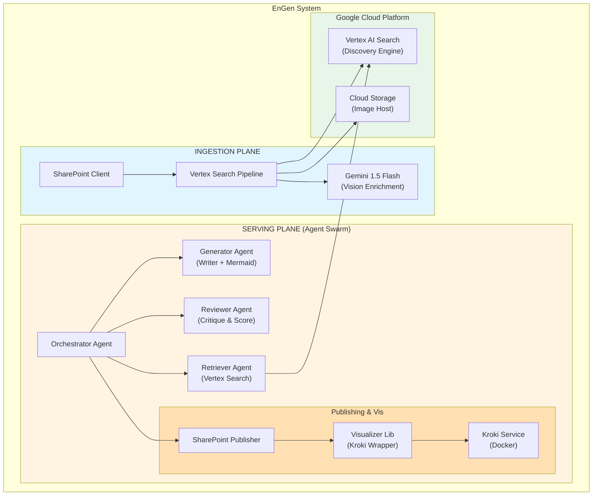
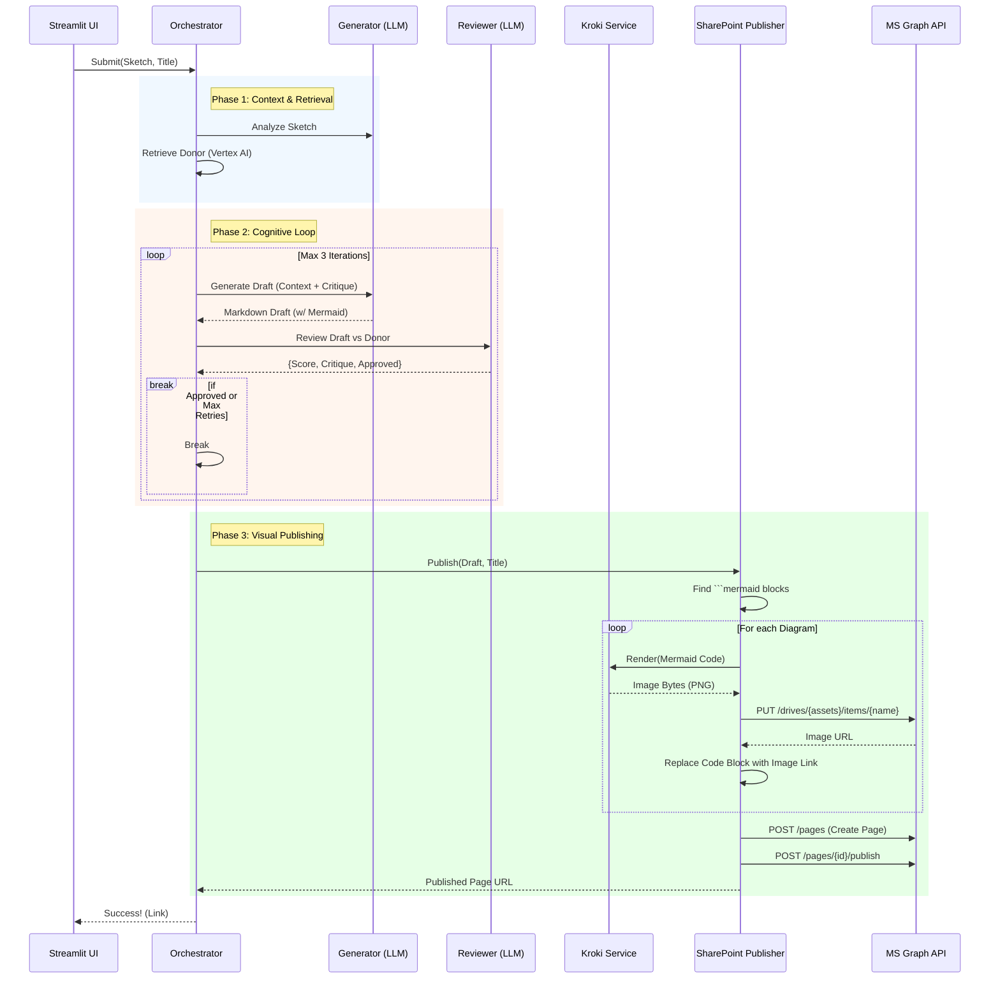

# EnGen: Architecture Pattern Documentation System (Vertex AI Search Implementation)

**Document Version:** 1.2
**Date:** January 19, 2026
**Author:** EnGen Development Team
**Status:** Unified Search & Agentic Loop Implementation

---

## 1. Objective

EnGen is an intelligent system that automates the creation of high-quality architecture documentation. This document details the **Unified Vertex AI Search** implementation, which consists of two main planes:
1.  **Ingestion Plane**: A pipeline that ingests, enriches, and indexes existing SharePoint content into Vertex AI Search.
2.  **Serving Plane** (Inference): A multi-agent swarm that takes a user's rough diagram, retrieves a "Donor Pattern" for style transfer, and iteratively generates and publishes a compliant document with professional diagrams.

### Primary Goals

-   **Simplified Operations**: Single managed index (Vertex AI Search) replacing complex Vector DB/NoSQL setups.
-   **Cognitive Quality Loop**: An iterative Generate-Review-Critique framework to ensure high-quality output.
-   **Visual-First Publishing**: Native support for generating architecture diagrams (Mermaid.js), rendering them to high-res images (Kroki), and embedding them in published pages.
-   **One-Shot Style Transfer**: Leveraging Gemini 1.5 Pro to mimic the structure and tone of existing "Donor Patterns".

---

## 2. High-Level Component Diagram



---

## 3. Ingestion Plane (The Knowledge Base)

The Ingestion Plane creates the "Donor Catalog" by indexing high-quality existing documentation.

### 3.1 Design Principles

1.  **Unified Document Model**: A single JSON schema represents the document, merging HTML content, metadata, and AI-generated image descriptions.
2.  **Visual Enrichment**: Diagrams in SharePoint are not just stored; they are **analyzed**. We download the images, pass them to **Gemini 1.5 Flash** to generate a dense technical textual description, and inject this text into the index. This allows users to search for "Event Driven Architecture" and find documents that *draw* it, even if they don't *say* it.
3.  **Managed Indexing**: We use Vertex AI Search's "keep index" capability to handle embeddings and retrieval logic automatically.

### 3.2 Ingestion Workflow

1.  **Crawler**: `SharePointClient` iterates through the target SharePoint library.
2.  **Extraction**: Downloads full HTML content of pages.
3.  **Visual Processing**:
    *   Identifies `` tags.
    *   Downloads binary image data.
    *   Uploads image to GCS (publicly accessible bucket) for permanent hosting.
    *   Sends image to Gemini 1.5 Flash for "Image-to-Text" description.
    *   Injects description into a hidden metadata field in the HTML key.
4.  **Indexing**: Pushes the enriched object to Vertex AI Search Data Store.

---

## 4. Serving Plane (The Agent Swarm)

The Serving Plane is the runtime engine where the user interacts with the system. It uses an **Orchestrator-driven Cognitive Loop**.

### 4.1 Core Agents

*   **Orchestrator**: The state machine. Manages the workflow, handles the Streamlit UI inputs, and invokes other agents.
*   **Generator**: The "Artist". Uses Gemini 1.5 Pro to write content in the style of a donor. It is also capable of writing **Mermaid.js** code to generate architecture diagrams.
*   **Reviewer**: The "Critic". Uses Gemini 1.5 Pro to read the draft and the donor, scoring the draft on style adherence and technical accuracy. It provides specific actionable feedback.
*   **Retriever**: The "Librarian". Queries Vertex AI Search to find the best matching "Donor Pattern".

### 4.2 The Cognitive Loop (Generate-Critique-Refine)

The system does not just "generate once". It iterates to ensure quality.

1.  **Analysis**: Generator describes the User's input sketch.
2.  **Retrieval**: Retriever finds a Donor Pattern based on that description.
3.  **Drafting**: Generator creates Draft v1 using the Donor as a few-shot example.
4.  **Review Loop**:
    *   Reviewer scores Draft v1.
    *   If score < threshold (e.g., 0.8), Reviewer generates critique.
    *   Orchestrator sends Critique + Draft v1 back to Generator.
    *   Generator produces Draft v2.
    *   (Repeats up to 3 times).

### 4.3 Visual Publishing Pipeline (Mermaid -> Kroki -> SharePoint)

We solved the "Diagram Problem" (embedding dynamic diagrams in static SharePoint pages) using a render-and-host strategy.

#### Process:
1.  **Generation**: The Generator outputs markdown that includes code blocks:
    ```markdown
    ### Architecture
    ```mermaid
    graph TD; Client-->API;
    ```
    ```
2.  **Interception**: The `SharePointPublisher` scans the markdown for these blocks.
3.  **Rendering**:
    *   The `Visualizer` library takes the Mermaid code.
    *   It calls a self-hosted **Kroki** instance (running in Docker/Cloud Run) to render the diagram to a **PNG** image.
    *   *Why Kroki?* It supports C4, Mermaid, PlantUML, and runs entirely within our private VPC if needed, avoiding data leakage to public rendering servers.
4.  **Hosting**:
    *   The `SharePointPublisher` uploads the PNG binary to the specific `Site Assets` library of the destination SharePoint site via Microsoft Graph API.
    *   It retrieves the authenticated `webUrl` of the uploaded image.
5.  **Embedding**:
    *   The code block in the markdown is replaced with a standard markdown image link: ``.
6.  **Publication**:
    *   The transformed markdown is converted to HTML web parts and published as a SharePoint Page.

### 4.4 End-to-End Sequence Diagram


