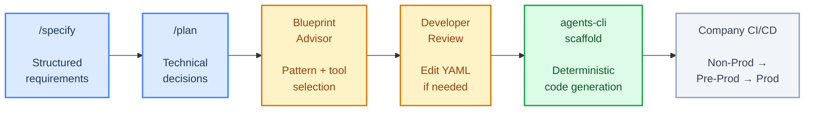
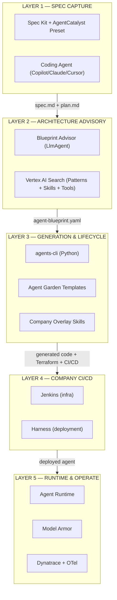
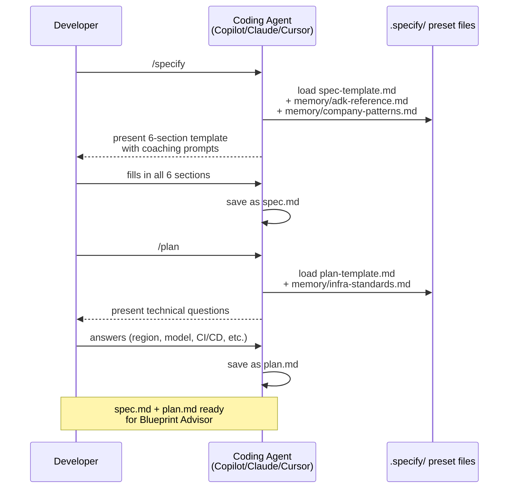
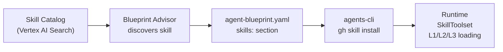
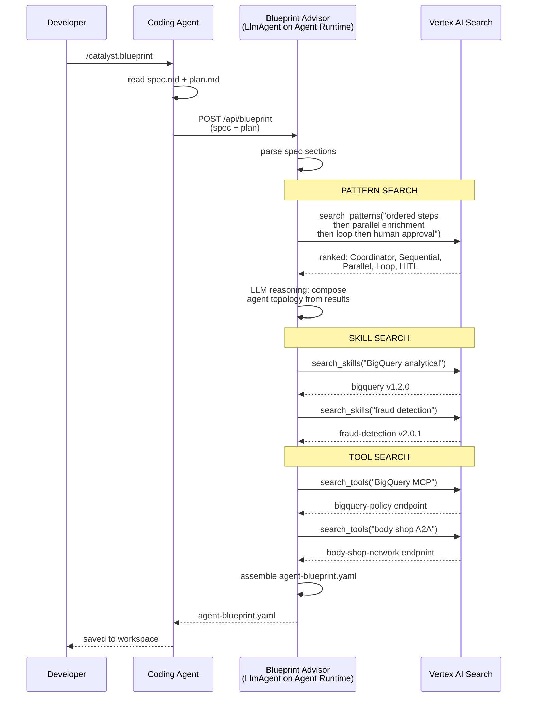
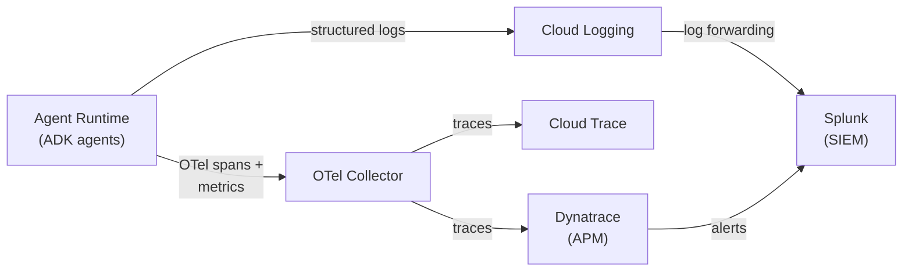
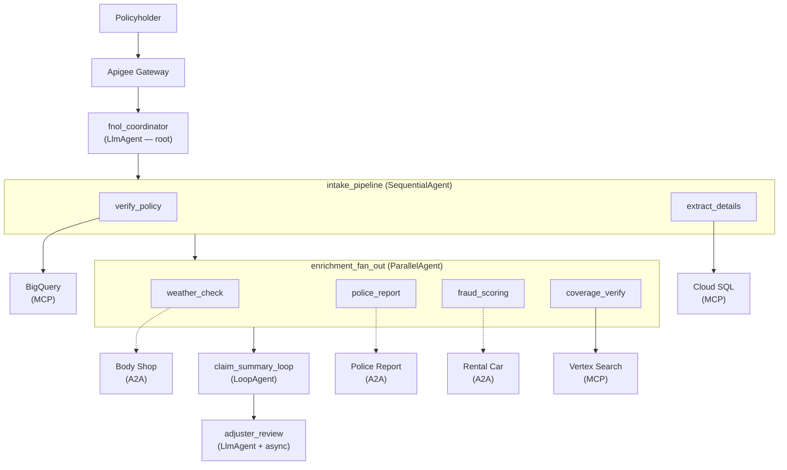

# AgentCatalyst — Standardize. Scaffold. Ship.

*A spec-driven agentic AI development accelerator on Google Cloud Platform*

---

## Executive Summary — For the SLT

### The problem

Enterprise teams building AI agents face three compounding challenges. First, requirements are expressed as vague prompts — "build me an FNOL agent" — that produce inconsistent architectures depending on who writes the prompt and which LLM interprets it. Second, every team hand-rolls its own agent infrastructure, CI/CD, and observability — creating fifty different ways to build agents, none of which follow a consistent standard. Third, the gap from idea to first committed code takes 4–6 weeks, with most of that time spent on boilerplate infrastructure, not business logic.

### The solution: AgentCatalyst

AgentCatalyst is a **spec-driven agentic AI development accelerator** that transforms structured business requirements into production-ready, fully generated agent code — grounded in company enterprise patterns and best practices.

It works in five phases:



### AgentCatalyst at a glance


*The diagram above shows the complete flow: a developer captures requirements via a structured template (Phase 1), the Blueprint Advisor recommends an architecture as a YAML file (Phase 2), agents-cli deterministically scaffolds the entire project using company skills (Phase 3), the company's existing CI/CD deploys it (Phase 4), and the agent runs on GCP with full security and monitoring (Phase 5). The developer's total hands-on time is under 1 hour for the 80% that's auto-generated — the remaining 20% is business logic that requires domain expertise.*

### Key principles

1. **Spec-driven, not prompt-driven.** Requirements are captured in a structured template — not free-form chat. Every developer produces the same quality of input regardless of experience level.
2. **AI-advised, human-decided.** The Blueprint Advisor recommends an architecture; the developer reviews and edits the YAML before scaffolding. The human is always in control.
3. **Skill-guided code generation.** The coding agent uses Google's 7 agents-cli skills + company overlay skills to generate agent code from the YAML blueprint. The skills ensure consistency with ADK best practices and company standards across all teams.
4. **Company-grounded.** Generation & Lifecycle templates embed company best practices — naming conventions, folder structure, security defaults, observability standards. The 50th agent looks like the 1st.
5. **Open tools, no vendor lock-in.** Spec Kit is GitHub open source. ADK is Google open source. agents-cli is Google open source. The YAML is a standard configuration file. Company overlay skills are the only company-specific component. No proprietary platform required.

### The ROI

| Activity | Without AgentCatalyst | With AgentCatalyst | Improvement |
|---|---|---|---|
| Requirements capture | 3–5 days (meetings + documents) | 2–4 hours (/specify template) | 90% faster |
| Architecture design | 1–2 weeks (manual research) | 30 minutes (Blueprint Advisor) | 95% faster |
| Code scaffolding | 1–2 weeks (manual ADK project setup) | 5 minutes (agents-cli scaffold) | 99% faster |
| Infrastructure as code | 3–5 days (manual Terraform) | Automatic (from YAML) | 90% faster |
| CI/CD pipeline config | 1–2 days | Automatic (from YAML) | 95% faster |
| Consistency across teams | Zero — every team is different | 100% — all agents follow company patterns | Structural |
| **Total: idea to generated code** | **4–6 weeks** | **< 1 day** | **90%+ faster** |

### Why not just use Google's tools directly?

Google ships three Agent Garden templates through `agents-cli`:

| Template | What it provides |
|---|---|
| `adk` | Single-agent starter with basic tool calling |
| `adk_a2a` | Multi-agent starter with A2A protocol support |
| `agentic_rag` | RAG agent with Vertex AI Search integration |

These templates are excellent starting points — but they solve a **different problem**. They answer: *"How do I create an ADK project?"* AgentCatalyst answers: *"How do I capture structured requirements, get AI-assisted architecture advice, and scaffold a complete production-ready agent with company infrastructure, security, observability, and CI/CD — in under an hour?"*

Google's templates provide the skeleton. `agents-cli` fills it with company-specific organs — proper Terraform modules, Dynatrace observability, Model Armor screening, Jenkins/Harness pipelines, and naming conventions that pass your company's code review on the first PR.

### Why now

Google Cloud Next '26 (April 2026) shipped the managed primitives AgentCatalyst depends on: Agent Runtime / Agent Engine *(GA)*, Model Armor *(GA)*, `agents-cli` with Agent Garden templates, and the official Agent Skills repository. GitHub shipped Spec Kit (open source, 30+ coding agent integrations) and `gh skill` (GitHub CLI with provenance verification). ADK reached GA stability with `SequentialAgent`, `ParallelAgent`, `LoopAgent`, `LlmAgent`, `MCPToolset`, `AgentTool`, and `SkillToolset` as production-ready classes.

Before these, building a standardized agent development accelerator required hand-rolling every layer — the framework, the runtime, the skills mechanism, the specification workflow, and the scaffolding engine. After them, the primitives exist. AgentCatalyst is the opinionated company layer that makes them work together as a paved road.

---

## Document scope and audience

This document describes the end-to-end architecture of AgentCatalyst — from structured requirements capture through fully generated agent code ready for company CI/CD. It is written for two audiences:

- **Enterprise Architecture / SLT** — Sections "Executive Summary" through "End-to-end thread" provide the strategic view: what AgentCatalyst is, why it matters, what the complete flow looks like, and what GCP services it uses. Start here.
- **Engineering teams** — Sections "Layer deep-dives" through "Worked Example" provide the technical detail: how each layer works, what `agents-cli` generates step by step, and how to build an agent from scratch with the FNOL example. Start at "End-to-end thread" then jump to the layer you're working on.

---

## End-to-end thread (read this first)

Before diving into the five layers, here is the complete flow as a narrative. No jargon, no architecture diagrams — just what happens step by step from the developer's perspective.

A developer is asked to build an AI agent that processes auto insurance claims (FNOL). She opens VSCode with GitHub Copilot and types `/specify`. The AgentCatalyst preset presents a structured template with six sections — Business Problem, Workflow, Data Sources, External Integrations, Internal Capabilities, and Infrastructure Requirements. She fills it in using plain English, describing the step-by-step workflow, the data systems involved, the external partner APIs, and her proprietary models. This takes about 15 minutes. The result is `spec.md` — a structured requirements document saved in her workspace.

She types `/plan` and answers a handful of technical questions — GCP region, LLM model, CI/CD tools, Terraform module source. This takes 5 minutes. The result is `plan.md`.

She types `/catalyst.blueprint`. This custom command packages her `spec.md` and `plan.md` and sends them to the Blueprint Advisor — an AI advisor running on GCP that has access to the company's catalog of 11 agent patterns, reusable skills, and approved tools. The Blueprint Advisor reads her spec, searches the catalogs, and recommends an architecture: a Coordinator root agent with four sub-agents (Sequential intake, Parallel enrichment, Loop summary, HITL adjuster review), connected to BigQuery, Cloud SQL, and Vertex AI Search via MCP servers, with three external A2A agents for body shop, rental car, and police report services. It returns `agent-blueprint.yaml` — a YAML file describing WHAT to build. Not code — just a specification.

She reviews the YAML in her editor. It's a readable file — agent names, types, tool endpoints, infrastructure settings. The Blueprint Advisor assigned Cloud SQL to the wrong agent — she edits the YAML directly, changing `assigned_to: extract_details` to `assigned_to: fnol_coordinator`. She saves.

She types `/catalyst.generate`. Now the coding agent (Copilot, in her case) reads the YAML and starts generating the actual code. But it doesn't guess how to write the code — it has **skills** installed that teach it the right way:

- **Google's `google-agents-cli-adk-code` skill** teaches it how to write correct ADK Python code — the right import paths, the right class constructors, the right way to wire tools to agents. Think of it as a "how to write ADK code" instruction manual that the coding agent reads before writing anything.
- **The company's `company-terraform-patterns` skill** teaches it which Terraform modules to use and how to pin versions — so the generated Terraform references `github.com/company/tf-modules//agent-runtime@v3.1.0`, not some generic Terraform.
- **The company's `company-cicd` skill** teaches it to generate a Jenkinsfile and a Harness pipeline definition — NOT to deploy directly from her laptop. This is important: `agents-cli` has a `deploy` command that pushes code straight to GCP, but the company doesn't allow that. The `company-cicd` skill explicitly tells the coding agent: "Generate pipeline files. Do not deploy directly." The coding agent obeys.
- **The company's `company-observability` skill** teaches it to generate Dynatrace and Splunk configuration, not just the default Cloud Trace.
- **The company's `company-security` skill** teaches it to generate Model Armor callbacks, VPC-SC references, and CMEK configuration.

The result: a complete project in her workspace — 6 agent class files, 3 MCP connections, 3 A2A clients, 3 FunctionTool files with first-draft business logic (generated from business rules authored in the spec, ready for developer review), Model Armor callbacks, complete Terraform, Dynatrace observability config, and Jenkins + Harness pipeline definitions. Every file follows company coding standards because the company skills taught the coding agent those standards.

She opens `app/tools/severity_classifier.py` and reviews the first draft of generated business logic — the IF/THEN conditions she authored in the spec are already implemented as working Python code. This is her starting point, not a black box. She refines the logic, adds edge cases, and writes system prompts for each agent — the "personality" and instructions that make each agent behave correctly for insurance claims. The 80-95% was handled by the coding agent guided by skills. When business rules are authored in the spec, even FunctionTool bodies are generated as a first draft — the developer reviews and makes the code their own.

She commits and opens a PR. Her team reviews it — the generated code looks familiar because every AgentCatalyst project follows the same company patterns. After the PR is merged, Jenkins automatically runs Terraform to provision the infrastructure (Agent Runtime, Cloud SQL, Model Armor, VPC-SC). Then Harness automatically deploys the agent through Non-Prod (testing), Pre-Prod (canary at 10% traffic), and Production (progressive rollout). If anything breaks, Harness rolls back automatically.

She never ran `agents-cli deploy`. She never provisioned a GCP resource from her laptop. She never wrote a Dockerfile or a Cloud Build config. All of that was either generated by the coding agent (Terraform, pipeline definitions) or handled by the company's CI/CD after she committed.

**Total time from "I need an FNOL agent" to generated code committed to GitHub: under 1 hour.** The remaining 2–4 hours are spent writing the 20% — system prompts, FunctionTool business logic, and test data. Without AgentCatalyst, this entire process takes 4–6 weeks.

---

## Technology Stack — Layered Component Reference

AgentCatalyst uses a five-layer architecture. Each layer has a clear responsibility and a defined handoff to the next.



### Component architecture — detailed view


The diagram above shows every component in AgentCatalyst organized by layer. Here is what each component does and how they interact:

**Layer 1 — Spec Capture (blue):**
The developer works in VSCode with their preferred coding agent (Copilot, Claude Code, or Cursor). The coding agent loads the AgentCatalyst preset from the `.specify/` folder — this preset contains the 6-section spec template, the plan template, custom commands (`/catalyst.blueprint`, `/catalyst.generate`), and memory files with company ADK reference material and coding standards. The developer runs `/specify` to fill in the structured template and `/plan` to answer technical questions. The outputs — `spec.md` and `plan.md` — flow to Layer 2.

**Layer 2 — Architecture Advisory (amber):**
The Blueprint Advisor is an LlmAgent running on GCP Agent Runtime. It receives `spec.md` + `plan.md` and uses three RAG tools — `search_patterns()`, `search_skills()`, and `search_tools()` — to query Vertex AI Search. Vertex AI Search hosts three data stores: the Pattern Catalog (11 canonical agentic patterns with HA/DR documentation), the Skill Catalog (reusable agent skills with capability metadata), and the Tool Registry (MCP servers and A2A agents from Apigee API Hub). The Blueprint Advisor performs single-pass semantic search across these catalogs, uses its LLM reasoning (guided by a company-curated system prompt) to select the best patterns, skills, and tools, and assembles `agent-blueprint.yaml` — a deployment specification describing WHAT to build. The developer reviews and edits the YAML before proceeding.

**Layer 3 — Generation & Lifecycle (green):**
`agents-cli` is Google's unified CLI for the ADK agent development lifecycle. It ships with 7 skills that teach coding agents how to scaffold, build, evaluate, deploy, publish, and observe ADK agents. The developer instructs the coding agent to generate the project from `agent-blueprint.yaml`. The coding agent uses `agents-cli scaffold create` for the project structure, then applies `google-agents-cli-adk-code` to generate ADK agent classes, MCP connections (`MCPToolset`), A2A clients (`AgentTool`), and FunctionTool implementations (first-draft business logic from spec rules) from the YAML. Company overlay skills guide the generation of Terraform modules, Dynatrace + OpenTelemetry observability config, Jenkins + Harness CI/CD pipeline definitions, and Model Armor callbacks. Skills are installed via `gh skill install` at pinned versions with provenance verification. When business rules are authored in the spec, FunctionTool implementations contain first-draft business logic (developer reviews ~5-10%); without rules, stubs require ~20% manual implementation. Everything else (80-95%) is generated by the coding agent guided by these skills.

**Layer 4 — Company CI/CD (gray):**
Outside AgentCatalyst's scope. The company's existing Jenkins and Harness pipelines take the generated code through the standard promotion process: PR review → Non-Prod (build, test, eval) → Pre-Prod (canary deploy, SLO checks) → Production (progressive rollout, monitoring). AgentCatalyst generated the pipeline definitions; the company's CI/CD executes them.

**Layer 5 — Runtime & Operate (purple):**
The deployed agent runs on Agent Runtime (GCP Agent Engine) — a managed runtime handling scaling, sessions, memory, and artifact storage. Apigee Runtime Gateway provides API gateway services (OAuth2, rate limiting, request logging). Model Armor screens every prompt before it reaches the LLM and every response before it reaches the user (standard prompt + response interception). Dynatrace provides APM with auto-instrumented traces, custom metrics (latency, error rate, token consumption), and dashboards. OpenTelemetry Collector forwards traces to both Dynatrace and Cloud Trace. Cloud Logging captures structured logs from all agent executions. Splunk (SIEM) aggregates security events, Cloud Audit Logs, and Dynatrace alerts for threat detection and compliance.

**Cross-cutting concerns (right panel):**
Six services span all layers: **Agent Identity** (SPIFFE scope per agent node + least-privilege IAM + DPoP for A2A auth), **VPC-SC Perimeter** (production + pre-prod enclosed, data exfiltration prevention), **CMEK Encryption** (customer-managed keys for all data at rest via Cloud KMS), **Secret Manager** (zero hardcoded credentials, rotation policies), **Cloud Audit Logs** (admin and data access logging, forwarded to Splunk), and **IAM Governance** (per-agent service accounts, least privilege enforced, quarterly review).

### Layer 1 — SPEC CAPTURE

| Component | Owner | Description |
|---|---|---|
| GitHub Spec Kit *(open source)* | GitHub | Structured specification workflow. Developer runs `/specify` and `/plan` in their coding agent. Templates guide the developer to describe their use case in a consistent format. |
| AgentCatalyst Preset | Company | Company-built preset for Spec Kit. Contains the requirements template, plan template, and custom commands (`catalyst.blueprint`, `catalyst.generate`). Installed via `specify preset add agentcatalyst`. |
| Coding Agent | Developer's choice | Any Spec Kit-compatible coding agent — GitHub Copilot, Claude Code, Gemini CLI, Cursor, Windsurf, etc. |

**Layer 1 delivers:** `spec.md` + `plan.md`

### Layer 2 — ARCHITECTURE ADVISORY

| Component | Owner | Description |
|---|---|---|
| Blueprint Advisor | Company | LlmAgent on Agent Runtime. Reads spec + plan, queries pattern/skill/tool catalogs via Vertex AI Search (single-pass semantic retrieval), generates `agent-blueprint.yaml`. Uses system prompt with company ADK best practices + RAG. |
| Pattern Catalog | Company | 11 canonical patterns documented as architectural knowledge artifacts, ingested into Vertex AI Search. |
| Skill Catalog | Company | Reusable agent skills with metadata, ingested into Vertex AI Search. |
| Tool Registry | Company/GCP | MCP servers and A2A agents registered in Apigee API Hub. |
| Vertex AI Search *(GA)* | GCP | Semantic search engine for pattern, skill, and tool discovery. Single-pass hybrid search. |

**Layer 2 delivers:** `agent-blueprint.yaml`

### Layer 3 — GENERATION & LIFECYCLE

| Component | Owner | Description |
|---|---|---|
| `agents-cli` *(Google)* | Google | Unified CLI for the full ADK agent development lifecycle — scaffold, build, eval, deploy, publish, observe. Ships with 7 bundled skills. Installed via `uvx google-agents-cli setup`. |
| 7 agents-cli Skills *(Google)* | Google | Skill documents that teach coding agents ADK patterns, scaffolding, evaluation, deployment, publishing, and observability. Compatible with Copilot, Claude Code, Gemini CLI, Cursor, Codex. |
| Company Overlay Skills | Company | 4 company-authored skills extending Google's 7: `company-terraform-patterns`, `company-observability` (Dynatrace + Splunk), `company-cicd` (Jenkins + Harness), `company-security` (Model Armor + VPC-SC + CMEK). |
| Agent Garden Templates *(GA)* | GCP | Starter templates (`adk`, `adk_a2a`, `agentic_rag`). `agents-cli scaffold create` clones the right template. |
| `gh skill install` *(GA)* | GitHub CLI | Installs agent skills at pinned versions with provenance verification. |

**Layer 3 delivers:** Complete agent codebase — ADK agents + MCP connections + A2A clients + FunctionTool implementations + Terraform + observability + CI/CD pipelines

### Layer 4 — COMPANY CI/CD (outside AgentCatalyst scope)

| Component | Owner | Description |
|---|---|---|
| Jenkins | Company | Infrastructure pipeline — Terraform plan/apply, OPA policy checks. |
| Harness | Company | Deployment pipeline — canary deployment, progressive rollout, rollback. |
| GitHub | Company | Source control — PR review, branch protection, merge policies. |

**Layer 4 delivers:** Deployed agent in Non-Prod → Pre-Prod → Prod

### Layer 5 — RUNTIME & OPERATE

| Component | Owner | Description |
|---|---|---|
| Agent Runtime (Agent Engine) *(GA)* | GCP | Managed runtime for ADK agents — scaling, session management, memory, artifact storage. |
| Apigee Runtime Gateway | GCP | API gateway for agent egress — OAuth2, rate limiting, request/response logging. |
| Model Armor *(GA)* | GCP | Prompt and response screening — injection detection, jailbreak detection, PII/PHI leakage prevention. |
| Dynatrace | Third-party | APM — OneAgent auto-instrumentation, custom metrics, dashboards. |
| OpenTelemetry Collector | Open source | Trace and metric collection, forwarding to Dynatrace + Cloud Trace + Cloud Logging. |
| Splunk | Third-party | SIEM — security event aggregation, threat detection, audit log correlation. |
| Cloud Trace + Cloud Logging | GCP | Native GCP observability. |

### Cross-cutting concerns

These services span all layers and are not specific to any single phase:

| Concern | Service | How it applies |
|---|---|---|
| **Identity** | Agent Identity (SPIFFE) + IAM | Each agent node runs under a dedicated least-privilege service account. SPIFFE provides per-agent identity scope for A2A communication. Agent Identity is provisioned via Terraform in Layer 3, enforced at Layer 5 runtime. |
| **Encryption at rest** | CMEK (Cloud KMS) | All data stores (Cloud SQL, GCS, Firestore) use Customer-Managed Encryption Keys. CMEK key ring is specified in the YAML `infrastructure.security.cmek_key_ring`. Provisioned via Terraform. |
| **Network perimeter** | VPC-SC (VPC Service Controls) | Production and pre-prod environments are enclosed in a VPC-SC perimeter. Prevents data exfiltration by restricting which services can communicate outside the perimeter. Provisioned via Terraform. |
| **Secret management** | Secret Manager | Zero hardcoded credentials in any generated code. All API keys, service account keys, and connection strings stored in Secret Manager and referenced by resource path. `agents-cli` generates Secret Manager references in all MCP connection files and A2A client files. |
| **Audit logging** | Cloud Audit Logs | All admin activity and data access logged. Forwarded to Splunk for correlation and threat detection. |

---

## Layer 1 — SPEC CAPTURE (deep dive)

### The AgentCatalyst preset

When a developer installs the AgentCatalyst preset (`specify preset add agentcatalyst`), the following files are added to their project:

```
.specify/
├── preset.yml                          ← Preset manifest
├── templates/
│   ├── spec-template.md                ← 6-section requirements template
│   ├── plan-template.md                ← Technical decisions template
│   └── tasks-template.md              ← Task breakdown template
├── commands/
│   ├── catalyst.blueprint.md           ← Sends spec+plan to Blueprint Advisor
│   └── catalyst.generate.md            ← Runs agents-cli against YAML
└── memory/
    ├── adk-reference.md                ← ADK class reference (public Google docs)
    ├── company-patterns.md             ← Company coding standards summary
    ├── approved-tools.md               ← Company-approved MCP servers and A2A agents
    └── infra-standards.md              ← Terraform module naming and pinning rules
```

**Note:** The `memory/` folder contains reference material that the coding agent loads into context during `/specify` and `/plan`. This is standard Spec Kit functionality — the memory files provide context so the coding agent can coach the developer as they fill in the template. They are NOT decision frameworks that teach the AI how to reason (that would be a different architecture). They are reference documents — the same information a developer would find in the company wiki.

### The spec template — 6 sections

```markdown
# Agent Specification

## Business Problem
<!-- Describe the business process this agent will automate.
     Who are the users? What value does it provide? -->

## Workflow
<!-- Describe the step-by-step workflow the agent should follow.
     Be specific about ordering: which steps happen first, which 
     can happen in parallel, which need human approval.
     Example: "First, verify... Then, extract... Simultaneously enrich..." -->

## Data Sources
<!-- List every data system the agent needs to access.
     For each, specify: system name, access pattern (read/write), 
     and workload type (analytical/transactional/storage/retrieval).
     Example: "BigQuery — policy data warehouse (read-only, analytical queries)" -->

## External Integrations
<!-- List any partner APIs, third-party services, or external agents
     the agent needs to communicate with.
     Specify who operates each service and how it's accessed. -->

## Internal Capabilities
<!-- List any proprietary models, internal APIs, or company-specific
     business logic the agent needs. Business rules authored in spec generate first-draft implementations
     that engineers implement. -->

## Infrastructure Requirements
<!-- GCP region, LLM model preference, CI/CD tools, security requirements,
     compliance constraints. -->
```

### Layer 1 sequence diagram



---

## Layer 2 — ARCHITECTURE ADVISORY (deep dive)

### Blueprint Advisor — how it works

The Blueprint Advisor is an LlmAgent deployed on Agent Runtime (GCP Agent Engine). It receives `spec.md` + `plan.md` as input and produces `agent-blueprint.yaml` as output.

#### System prompt structure

The Blueprint Advisor's intelligence comes from a well-crafted system prompt — not from separate versionable decision framework documents. The system prompt contains:

```
SYSTEM PROMPT STRUCTURE:

1. ROLE DEFINITION
   "You are the Blueprint Advisor — an AI architecture advisor for agentic 
   AI applications on Google Cloud Platform. You recommend agent architectures
   based on structured specifications."

2. COMPANY ADK BEST PRACTICES
   - Use SequentialAgent for ordered dependency chains
   - Use ParallelAgent for independent concurrent tasks
   - Use LoopAgent for iterative refinement with quality thresholds
   - Use LlmAgent + LongRunningFunctionTool for async human approval
   - Use LlmAgent as root Coordinator for multi-domain workflows
   - [Company-specific patterns: naming conventions, model preferences, etc.]

3. TOOL SELECTION HEURISTICS
   - Analytical data access → search for BigQuery-related tools
   - Transactional data access → search for Cloud SQL-related tools
   - Document retrieval → search for Vertex AI Search tools
   - Partner-operated services → recommend A2A agent connection
   - Proprietary company logic → recommend FunctionTool implementation (first draft from spec rules)

4. OUTPUT FORMAT RULES
   - Output must be valid YAML conforming to the agent-blueprint schema
   - Every agent must have a name, type, and role
   - Every tool must have assigned_to referencing an agent name
   - Infrastructure section must be populated from plan.md

5. RAG TOOL USAGE
   - Use search_patterns() to find relevant patterns from the catalog
   - Use search_skills() to find matching skills
   - Use search_tools() to find MCP servers and A2A agents
   - Always search before recommending — do not hallucinate tool endpoints
```

**What makes this better than a developer asking Gemini directly?** Three things: (1) the system prompt embeds company-specific ADK patterns and tool selection heuristics that a developer would need to research manually; (2) the RAG tools give the Blueprint Advisor access to the company's curated catalogs rather than general internet knowledge; (3) the output is a structured YAML file that `agents-cli` can consume directly, not a prose description the developer must translate into code.

#### RAG tools

The Blueprint Advisor has three FunctionTools connected to Vertex AI Search:

| Tool | Data store | What it returns |
|---|---|---|
| `search_patterns(query)` | Pattern catalog (11 patterns) | Ranked pattern matches with applicability criteria, component descriptions, and composition guidance |
| `search_skills(query)` | Skill catalog | Matching skills with name, source, version, and capability description |
| `search_tools(query)` | Tool registry (Apigee API Hub) | MCP servers and A2A agents with endpoints, auth methods, and descriptions |

All three use single-pass semantic search with hybrid retrieval (embedding match + metadata filters). The Blueprint Advisor issues queries based on the developer's spec, reviews the results, and selects the best matches using its own LLM reasoning.

### The 11 canonical patterns

Each pattern is documented as a comprehensive architectural knowledge artifact with 8 mandatory sections:

#### Pattern documentation standard

| Section | Content |
|---|---|
| **Applicability** | When to use this pattern. Key trigger phrases from specifications. When NOT to use (anti-patterns). |
| **Component Diagram** | Mermaid component diagram showing agent topology, tool connections, data flows, and gateway points. |
| **Sequence Diagram** | Mermaid sequence diagram showing runtime execution flow: agent reasoning, tool calls, interactions. |
| **Security Considerations** | Pattern-specific security posture: identity model, data access boundaries, Model Armor screening points, VPC-SC implications. |
| **Performance & Idempotency** | Latency characteristics, token consumption profile, concurrency model, retry behavior, timeout strategy. |
| **HA/DR Views** | Four DR strategies documented per pattern, each with lifecycle behavior for initial provisioning, component failure (HA), DR failover, and DR failback. |
| **Composition Guidance** | Which patterns this pattern can compose with (parent/child). Nesting constraints. Common compositions. |
| **Search Metadata** | YAML frontmatter for Vertex AI Search ingestion: taxonomy, use_case_signals, adk_classes, complexity. |

#### HA/DR strategy matrix

Each pattern's HA/DR section documents behavior under four DR strategies:

| DR Strategy | Description | RTO | RPO |
|---|---|---|---|
| Backup & Restore | Cold recovery from backups. No standby infrastructure. | Hours | Last backup point |
| Pilot Light / On-Demand | Minimal core infrastructure always running. Scale up on failover. | 10–30 min | Near-zero |
| Pilot Light / Cold Standby | Core infrastructure running. Compute at zero. Start on failover. | 5–15 min | Near-zero |
| Warm Standby | Scaled-down replica always running. Scale up on failover. | 1–5 min | Near-zero |

**Lifecycle behaviors documented per DR strategy per pattern:**
- **Initial Provisioning** — what infrastructure is deployed in primary and DR regions at day 0
- **Component Failure (HA)** — how the pattern self-heals within a single region (auto-scaling, pod restart, session recovery)
- **DR Failover** — step-by-step failover procedure to the DR region
- **DR Failback** — step-by-step procedure to return to the primary region

This produces 4 DR strategies × 4 lifecycle behaviors = **16 HA/DR scenarios per pattern**, and **176 scenarios across all 11 patterns**.

#### Pattern catalog summary

| # | Pattern | ADK Class(es) | When to use |
|---|---|---|---|
| 1 | Sequential Pipeline | SequentialAgent | Ordered steps with dependencies |
| 2 | Parallel Fan-out | ParallelAgent | Independent tasks that can run simultaneously |
| 3 | Generator/Critic (Loop) | LoopAgent | Generate, validate, refine until quality threshold |
| 4 | ReAct (Tool Use) | LlmAgent + FunctionTool | Reasoning with external tool calls |
| 5 | Coordinator/Dispatcher | LlmAgent (root) + sub_agents | Multiple domains requiring specialist routing |
| 6 | Review & Critique | LoopAgent (generator + evaluator) | Output review against rubrics |
| 7 | Iterative Refinement | LoopAgent (programmatic exit) | Self-correction until threshold met |
| 8 | Hierarchical Decomposition | Nested Sequential + Parallel | Complex tasks broken into sub-task trees |
| 9 | Swarm | ParallelAgent (dynamic) | Large dataset processing with sharding |
| 10 | Human-in-the-Loop (HITL) | LlmAgent + LongRunningFunctionTool | Async human approval at high-risk boundaries |
| 11 | Agentic RAG | LlmAgent + Vertex AI Search | Document retrieval + reasoning |

### Skill lifecycle

Skills in AgentCatalyst follow a standard lifecycle from catalog to runtime:



1. **Catalog** — Skills are documented with metadata (name, capability description, version, source repo) and ingested into Vertex AI Search.
2. **Discovery** — Blueprint Advisor searches the catalog by capability match when analyzing the developer's spec. Skills and tools are discovered independently — the Blueprint Advisor recommends both based on the spec's Data Sources and External Integrations sections.
3. **Blueprint** — Selected skills are listed in the `skills:` section of `agent-blueprint.yaml` with source and pinned version.
4. **Installation** — `agents-cli` runs `gh skill install {source} {name}@{version}` for each skill. Provenance SHA is verified.
5. **Runtime** — Skills are loaded progressively at runtime: L1 (frontmatter, ~50 tokens) is always visible; L2 (instructions, ~500-2000 tokens) is loaded on activation; L3 (reference materials) is loaded on-demand via `load_skill_resource` tool.

### Blueprint Advisor sequence diagram



### agent-blueprint.yaml schema

The YAML output follows a fixed schema. `agents-cli` validates against this schema before scaffolding.

```yaml
metadata:
  name: string              # Agent project name (kebab-case)
  version: string           # Semantic version
  garden_template: string   # adk | adk_a2a | agentic_rag
  description: string       # Human-readable description

platform:
  gcp_project: string
  gcp_region: string
  model: string             # gemini-2.0-flash | gemini-2.0-pro
  runtime: string           # agent_engine | cloud_run

agents:                     # Array of agent definitions
  - name: string            # snake_case
    type: string            # LlmAgent | SequentialAgent | ParallelAgent | LoopAgent
    role: string            # Human-readable purpose
    sub_agents: [string]    # Child agent names (optional)
    steps: [string]         # SequentialAgent ordered steps
    branches: [string]      # ParallelAgent parallel branches
    max_iterations: int     # LoopAgent iteration limit
    exit_condition: string  # LoopAgent exit expression
    async_approval: bool    # HITL async review
    tools: [string]         # Tool names assigned to this agent

tools:
  mcp_servers:
    - name: string
      endpoint: string
      transport: string     # sse | stdio
      auth: string          # workload_identity | spiffe | api_key
      assigned_to: string   # Agent name
      purpose: string

  a2a_agents:
    - name: string
      endpoint: string
      auth: string
      assigned_to: string
      purpose: string

  function_tools:
    - name: string
      assigned_to: string
      purpose: string
      implementation: string  # always "engineer_implements"

skills:
  - name: string
    source: string          # GitHub repo path
    version: string         # Pinned version
    assigned_to: string

infrastructure:
  terraform:
    modules:
      - name: string
        source: string
        version: string
  security:
    model_armor: bool
    dlp: bool
    cmek_key_ring: string
    vpc_sc_perimeter: bool
  observability:
    dynatrace: bool
    otel_collector: bool
    cloud_trace: bool
    cloud_logging: bool
  cicd:
    jenkins:
      template: string
      parameters: object
    harness:
      template: string
      parameters: object
```

### Blueprint-generated diagrams

The `agent-blueprint.yaml` includes a `diagrams:` section containing three Mermaid diagrams generated by the Blueprint Advisor. These diagrams are derived from the same reasoning that produced the agents, tools, and skills sections — they are a visual serialization of the architecture, not a separate artifact.

| Diagram | What it shows | Audience |
|---|---|---|
| **Component** | Agent tree with tool assignments — which agent connects to which MCP server, A2A agent, or FunctionTool. Agents as rectangles grouped by parent, MCP servers as cylinders, A2A agents as hexagons, FunctionTools as parallelograms. | Developers during YAML review, EA during architecture review |
| **Sequence** | Runtime message flow — what happens when a user sends a request. Each pattern phase (Sequential, Parallel, Loop, HITL) is annotated with a colored rect block. Tool calls shown as self-messages. Parallel enrichment shown with `par/end` blocks. | Developers understanding runtime behavior, QA writing test cases |
| **Infrastructure** | GCP components inside VPC-SC perimeter, external A2A partners outside the boundary, CI/CD pipeline connections (Jenkins, Harness, Arize). | Platform engineering, security review, ARB |

**Why Mermaid, not PNG/SVG:** The Blueprint Advisor is an LLM — it generates text natively. Mermaid is text-based, version-controllable in git, editable by developers, and rendered natively by VSCode (Mermaid preview extension), GitHub, and GitLab. PNG/SVG are rendered outputs, not source of truth. A CI step can convert Mermaid to PNG/SVG using `mmdc` (Mermaid CLI) for documentation or ARB presentations.

**Generation rules:** The Blueprint Advisor's system prompt ensures diagram consistency — component diagram uses the agent tree and tool assignments from the YAML, sequence diagram follows pattern ordering (Sequential steps in order, Parallel in `par/end`, Loop with `loop/end`, HITL with `alt/else`), infrastructure diagram maps the `infrastructure:` section to GCP service boxes. All diagrams reference agent and tool names exactly as they appear in the YAML.

**Developer workflow:** After `/catalyst.blueprint`, the developer opens the YAML in VSCode. The Mermaid preview extension renders diagrams inline. The developer reviews YAML fields with diagrams visible side-by-side — visual verification catches assignment mistakes that reading YAML alone would miss. In PR review, GitHub/GitLab renders Mermaid natively so the team reviews architecture visually.

### Enhanced spec template — business logic capture

The spec template includes four sections beyond workflow and data sources that enable the coding agent to generate business logic — not just scaffolding. When filled out, the coding agent generates 90-95% of the code including business rules. When omitted, the coding agent generates 80% (scaffolding only) and the developer implements business logic manually (+$5.5K per use case).

**Business Rules section:** Structured conditions (inputs, outputs, if/then rules, edge cases, validation) for each decision point. The Blueprint Advisor converts these into `business_rules:` blocks in the YAML. The coding agent generates working implementations.

**Transformation Rules section:** Field mappings and formulas for each data transformation. Converted to `transformations:` blocks. The coding agent generates data transformation functions.

**Error Handling section:** Timeout behavior, failure fallbacks, partial-data handling, and retry policies for each external dependency. Converted to `error_handling:` blocks. The coding agent generates try/catch blocks with circuit breakers.

**Acceptance Criteria section:** GIVEN/WHEN/THEN assertions for each workflow step. The Blueprint Advisor converts these into starter golden dataset entries and pre-populated evalsets in `tests/evalsets/`. This closes the loop between requirements and testing.

### What `agents-cli` generates vs what engineers implement

| Generated component | What agents-cli generates | Engineer effort |
|---|---|---|
| ADK agent class hierarchy | Root `LlmAgent` + typed sub-agents from `agents:` section with correct imports, class instantiation, model assignment | None — fully generated |
| MCP connections | `MCPToolset` per MCP server with endpoint, transport, auth from `tools.mcp_servers:` | None |
| A2A client connections | `AgentTool` per A2A agent from `tools.a2a_agents:` with endpoint, auth, timeout | None |
| FunctionTool implementations | Function signature + description + first draft of business logic from `business_rules{}` when authored in spec — **stubs only when rules omitted** | **Developer reviews and refines the generated first draft** |
| System prompts | Placeholder `<<< ENGINEER MUST WRITE >>>` in each agent class | **Engineer writes domain-specific prompts** |
| Skills installed | Skill directories installed via `gh skill install` at pinned versions | None |
| Model Armor callbacks | Standard prompt + response screening via Model Armor API | None (standard config) |
| Terraform modules | Company TF module references with populated variables from YAML | None |
| Dynatrace config | OneAgent config, custom metrics, dashboard-as-code JSON | None |
| OTel Collector config | Collector pipeline config forwarding to Dynatrace + Cloud Trace | None |
| CI/CD pipelines | Jenkinsfile + Harness config referencing company skills with parameters | None |
| **Summary** | **80-95% of the codebase is generated** (95% when business rules authored in spec) | **5-20% requires developer review and refinement** |

---

## Layer 3 — GENERATION & LIFECYCLE (deep dive)

### Google's agents-cli — the 7 bundled skills

`agents-cli` is Google's unified CLI for the full ADK agent development lifecycle. It ships with **7 skills** that teach any coding agent (Copilot, Claude Code, Gemini CLI, Cursor, Codex) how to build, evaluate, and deploy ADK agents:

| # | Skill | What it teaches the coding agent |
|---|---|---|
| 1 | `google-agents-cli-workflow` | Full lifecycle (scaffold → build → evaluate → deploy → publish → observe), code preservation rules, model selection guidance, troubleshooting. Always active. |
| 2 | `google-agents-cli-adk-code` | ADK Python API reference — agents, tools, orchestration patterns, callbacks, state management. The coding agent uses this to write correct ADK code. |
| 3 | `google-agents-cli-scaffold` | Project scaffolding commands (`scaffold create`, `scaffold enhance`, `scaffold upgrade`), template options, deployment targets, prototype-first workflow. |
| 4 | `google-agents-cli-eval` | Evaluation methodology — eval metrics, evalset schema, LLM-as-judge, tool trajectory scoring, common failure causes. |
| 5 | `google-agents-cli-deploy` | Deployment workflows — Agent Runtime, Cloud Run, GKE, service accounts, rollback, production infrastructure. |
| 6 | `google-agents-cli-publish` | Gemini Enterprise Agent Platform registration — making agents discoverable via Agent Cards. |
| 7 | `google-agents-cli-observability` | Cloud Trace, prompt-response logging, BigQuery Agent Analytics, third-party integrations (AgentOps, Phoenix, MLflow), troubleshooting. |

**Installation (one-time):**
```bash
uvx google-agents-cli setup
```
This installs the CLI and injects all 7 skills into the coding agent's environment.

### Company overlay skills — extending Google's 7

The 7 Google skills cover ADK best practices and GCP deployment. Company overlay skills extend them with enterprise-specific patterns:

| Company Skill | What it teaches | Extends which Google skill |
|---|---|---|
| `company-terraform-patterns` | How to use company TF modules from `github.com/company/tf-modules` — module naming, version pinning, variable population, backend config. | `google-agents-cli-deploy` |
| `company-observability` | Dynatrace OneAgent config, custom metrics, dashboard-as-code, Splunk threat rules, OTel Collector forwarding pipeline. | `google-agents-cli-observability` |
| `company-cicd` | Jenkins pipeline templates (`agent-infra-plan-apply-v3`), Harness deployment templates (`agent-deploy-canary-v4`), company pipeline standards. | `google-agents-cli-deploy` |
| `company-security` | Model Armor configuration, VPC-SC perimeter setup, CMEK key ring references, Secret Manager patterns, company security standards. | `google-agents-cli-scaffold` |

Company skills are installed alongside Google's skills:
```bash
npx skills add company/agentcatalyst-skills
```

### Skill installation — how skills get onto the developer's machine

Skills are installed via `specify preset add agentcatalyst-enterprise` which downloads the preset (including all skills) from the company's preset catalog on GitHub. The preset's `preset.yml` declares skill dependencies and the `specify` CLI resolves them. Skills can also be installed individually via `npx skills add <repo> --skill <name>`. Company overlay skills are pre-installed in the preset; archetype-specific skills are included per preset variant.


### Skill discovery and activation — how the coding agent knows which skill to use

The lifecycle has three phases: discovery, activation, and execution.

**Phase 1 — Discovery (automatic, every session start):**

When the developer opens a coding agent session, the agent scans all skill directories and loads **only the `name:` and `description:`** from each `SKILL.md` frontmatter into its system prompt. The full instruction body is NOT loaded yet — this is progressive disclosure that keeps the context window lean.

The developer can verify with `/skills list`:

```
> /skills list
  google-agents-cli-workflow       [built-in]  Always active
  google-agents-cli-adk-code       [built-in]  ADK Python API reference
  google-agents-cli-scaffold       [built-in]  Scaffold commands
  google-agents-cli-eval           [built-in]  Evaluation methodology
  google-agents-cli-deploy         [built-in]  Deployment workflows
  google-agents-cli-publish        [built-in]  Gemini Enterprise registration
  google-agents-cli-observability  [built-in]  Cloud Trace, logging
  company-cicd                     [user]      Company CI/CD (Jenkins + Harness)
  company-terraform-patterns       [user]      Company Terraform modules
  company-observability            [user]      Dynatrace + Splunk + OTel
  company-security                 [user]      Model Armor + VPC-SC + CMEK
```

If company skills don't appear, run `gemini skills install github.com/company/agentcatalyst-skills --scope user` and then `/skills reload`.

**Phase 2 — Activation (on-demand, when the task matches):**

When the coding agent receives a task, it matches the task against each skill's `description:` field and activates the most relevant skill. Upon activation:
- The full `SKILL.md` body is loaded into the conversation context
- The skill's directory is added to the agent's allowed file paths (so it can read bundled templates and examples)
- The agent prioritizes the skill's instructions for the current task

The matching works through the `description:` field:

| Developer's instruction | Matches `description:` of | Skill activated |
|---|---|---|
| "Generate ADK agent classes from the YAML" | "ADK Python API reference — agents, tools, orchestration" | `google-agents-cli-adk-code` |
| "Generate Terraform for this agent" | "Company Terraform modules and version pinning" | `company-terraform-patterns` |
| "Set up CI/CD pipelines" | "Company CI/CD standards... DO NOT use agents-cli deploy" | `company-cicd` |
| "Deploy this agent" | Matches both `google-agents-cli-deploy` AND `company-cicd` | **`company-cicd` wins** (see precedence) |

**Phase 3 — Precedence (how company skills override Google skills):**

When multiple skills match the same task, precedence determines which one the coding agent follows:

```
Precedence (highest → lowest):
  1. Workspace skills  (.agents/skills/ in the project repo)
  2. User skills       (~/.agents/skills/)
  3. Built-in skills   (bundled with agents-cli)
```

Company overlay skills (installed at user or workspace level) take precedence over Google's built-in skills. Additionally, the `company-cicd` skill's `description:` explicitly says "DO NOT use agents-cli deploy" — so even if both skills are activated, the coding agent sees the prohibition and follows the company skill.

The `GEMINI.md` file in the project root adds a blanket precedence rule: *"When Google's agents-cli skills conflict with company overlay skills, always follow the company skill."*

### Enterprise lifecycle override — why the coding agent skips `agents-cli deploy`

The company-cicd skill contains an explicit override that tells the coding agent: "Generate Jenkins + Harness pipeline definitions. NEVER deploy directly via `agents-cli deploy`." This is enforced at three layers: the skill instruction, the constitution.md rule, and a `.agentcli-overrides.yaml` file that disables the deploy command. The coding agent generates pipeline files; the company's CI/CD executes them.


### How code generation works

With agents-cli skills + company overlay skills installed, the coding agent generates code by interpreting the `agent-blueprint.yaml` guided by these skills. The flow:

1. **`agents-cli scaffold create`** — creates the bare project structure from the selected Garden template (deterministic)
2. **Coding agent + `google-agents-cli-adk-code` skill** — reads `agent-blueprint.yaml` and generates ADK agent classes, MCP connections, A2A clients, FunctionTool implementations with first-draft business logic (LLM-guided, skill-constrained)
3. **Coding agent + company overlay skills** — generates company-specific Terraform modules, Dynatrace config, Jenkins/Harness pipelines, Model Armor callbacks (LLM-guided, skill-constrained)
4. **`gh skill install`** — installs agent skills at pinned versions with provenance verification (deterministic)
5. **Local pytest sanity tests** — unit tests with mocks (no GCP services required). End-to-end evaluation happens later in the Harness pipeline via Arize.

**The skills constrain the LLM's output.** The coding agent doesn't invent ADK patterns from general knowledge — it follows the specific patterns documented in `google-agents-cli-adk-code`. It doesn't guess at Terraform module paths — it follows `company-terraform-patterns`. The skills act as guardrails that keep the generated code consistent with both Google's ADK standards and company enterprise patterns.

### Company skill governance

| Aspect | How it works |
|---|---|
| **Ownership** | Platform engineering team owns company overlay skills. EA team reviews content. |
| **Version control** | Skills stored in `github.com/company/agentcatalyst-skills` repo. Versioned with semver tags. |
| **Change process** | Skill changes follow standard PR review. Platform eng + EA review. |
| **ADK version updates** | When Google updates their 7 skills for a new ADK version, platform engineering reviews company overlay skills for compatibility and updates if needed. |
| **New technology support** | Adding a new observability platform: create a new company skill document, add to the skills repo. No CLI code changes needed. |
| **Testing** | Company skills include example prompts and expected outputs. CI validates that the coding agent generates code matching company patterns when guided by the skill. |

### FNOL code generation — step by step

When the developer instructs the coding agent to generate the FNOL agent from `agent-blueprint.yaml`, the coding agent uses the installed skills to produce each file:

**Step 1 — Scaffold the project structure** (deterministic):
```bash
agents-cli scaffold create fnol-agent --template adk_a2a
```
Creates the bare project with `pyproject.toml`, `app/__init__.py`, `app/agent.py` (placeholder).

**Step 2 — Generate ADK agent classes** (guided by `google-agents-cli-adk-code` skill):
The coding agent reads `agents:` from the YAML and generates one file per agent:

```python
# app/sub_agents/intake_pipeline.py
from google.adk.agents import SequentialAgent

intake_pipeline = SequentialAgent(
    name="intake_pipeline",
    sub_agents=["verify_policy", "extract_details"],
    description="Ordered intake — verify then extract",
)
```

**Step 3 — Generate MCP connections** (guided by `google-agents-cli-adk-code` skill):
```python
# app/mcp_connections/bigquery_policy.py
from google.adk.tools import MCPToolset

bigquery_policy = MCPToolset(
    name="bigquery-policy",
    connection_params={
        "endpoint": "bigquery.googleapis.com",
        "transport": "sse",
        "auth": "workload_identity",
    },
    description="Query policy data warehouse",
)
```

**Step 4 — Generate A2A clients** (guided by `google-agents-cli-adk-code` skill):
```python
# app/a2a_clients/body_shop_network.py
from google.adk.tools import AgentTool

body_shop_network = AgentTool(
    name="body-shop-network",
    endpoint="https://bodyshop.partner.com/a2a",
    auth="spiffe",
    timeout=30,
    description="Get repair estimates",
)
```

**Step 5 — Generate FunctionTool implementations** (guided by `google-agents-cli-adk-code` skill):
```python
# app/tools/severity_classifier.py — ENGINEER IMPLEMENTS BODY
from google.adk.tools import FunctionTool

def severity_classifier(claim_data: dict) -> dict:
    """Classify claim severity (low/medium/high)."""
    raise NotImplementedError("Engineer must implement")

severity_classifier_tool = FunctionTool(func=severity_classifier)
```

**Step 6 — Install skills** (deterministic via `gh skill install`):
Installs `bigquery@1.2.0` and `fraud-detection@2.0.1` with provenance verification.

**Step 7 — Generate Terraform** (guided by `company-terraform-patterns` skill):
Company TF module references with populated variables from the YAML.

**Step 8 — Generate Dynatrace + OTel config** (guided by `company-observability` skill):
OneAgent config, custom metrics, dashboard-as-code, OTel Collector pipeline.

**Step 9 — Generate CI/CD pipelines** (guided by `company-cicd` skill):
Jenkinsfile + Harness pipeline config referencing company templates.

**Step 10 — Generate Model Armor callbacks** (guided by `company-security` skill):
Standard prompt + response screening configuration.

### What's deterministic vs what's LLM-guided

| Step | Deterministic? | Why |
|---|---|---|
| 1. Scaffold project structure | ✅ Yes | `agents-cli scaffold create` — CLI command |
| 2–5. Generate ADK code | ❌ LLM-guided | Coding agent interprets YAML + skills. Functionally equivalent but not byte-identical across runs. |
| 6. Install skills | ✅ Yes | `gh skill install` — CLI command with SHA verification |
| 7–10. Generate infra + observability + CI/CD | ❌ LLM-guided | Coding agent interprets YAML + company skills |
| 11. Local sanity tests | ✅ Yes | `pytest` — runs unit tests with mocks (no GCP required) |
| 12. Evaluation | ❌ Deferred to CI/CD | Arize evaluation runs in Harness pipeline against deployed non-prod/pre-prod agents |
| 13. Deploy | ❌ Deferred to CI/CD | Jenkins runs Terraform; Harness deploys via canary (NEVER `agents-cli deploy`) |

**The YAML blueprint constrains WHAT is generated. The skills constrain HOW it's expressed. The coding agent fills in the details.** Two runs produce functionally equivalent code — same agent classes, same tool wiring, same infrastructure — but variable names, comments, and code organization may vary. This is by design: it makes AgentCatalyst work with any coding agent that supports skills.

---

## Layer 4 — COMPANY CI/CD (outside AgentCatalyst scope)

AgentCatalyst generates CI/CD pipeline definitions. The company's pipelines execute them.

| Stage | Tool | What happens |
|---|---|---|
| PR Review | GitHub | Team reviews generated code + FunctionTool implementations. Standard branch protection. |
| Non-Prod | Jenkins + Harness | Terraform apply (infra), build, unit tests, integration tests, **Arize evaluation against deployed agent**. |
| Pre-Prod | Harness | Canary deployment (10% traffic), **Arize evaluation against pre-prod**, performance validation, SLO checks. |
| Production | Harness | Progressive rollout, monitoring, automatic rollback if SLOs violated. |

### EvalOps — three-layer evaluation lifecycle (no preview services)

AgentCatalyst implements a multi-layered EvalOps strategy that fuses automated velocity with human judgment. All evaluation runs on GA services — Arize for automated evaluation, AutoSxS for baseline comparison, and human review for edge-case triage. `agents-cli eval`, `agents-cli simulate`, and `agents-cli deploy` are all forbidden by three-layer skill override. Agent Evaluation Service and Agent Simulation Service (both pre-GA preview services) are NOT used.

**Layer 1: Inner Loop (automated velocity — pre-commit)**

Developers get instant feedback in their IDE. The `company-cicd` skill generates a pre-commit evaluation hook (`tests/eval_inner_loop.py`) that runs a lightweight subset of evalsets (5-10 cases) against the local agent using the Vertex AI Evaluation SDK, checking safety, fluency, groundedness, and tool trajectory. Scores are compared against `tests/baseline_scores.json` — if any metric drops more than 10%, the commit is blocked. Completes in under 60 seconds.

**Layer 2: Deep Dive (agent debugging — ADK tracing + Arize Phoenix)**

The `company-observability` skill generates ADK tracing instrumentation and Arize Phoenix integration. Every agent in the topology gets OpenTelemetry spans capturing LLM calls, tool calls, agent-to-agent delegation, and loop iterations. During local development, traces export to Phoenix at `localhost:6006`. In non-prod/pre-prod, traces export to a shared Phoenix instance for team debugging.

**Layer 3: Outer Loop (governance + HITL — 3-phase Harness pipeline)**

The `company-cicd` skill generates a 3-phase Harness pipeline: Phase A runs Arize evaluation with quality gates (pass_rate, latency, hallucination). Phase B runs AutoSxS comparison against the current baseline across the Golden Dataset, flagging edge cases. Phase C routes flagged cases to a human triage queue where reviewers make final approve/reject decisions.

**Golden Dataset lifecycle:** The spec template includes an Acceptance Criteria section. The Blueprint Advisor converts acceptance criteria into starter golden dataset entries. A production feedback pipeline samples failing cases from production, routes them to human annotation, and adds them back to the golden dataset. A quarterly meta-evaluation pipeline audits whether automated evaluation metrics still align with human intent.

**Why this pattern is better than `agents-cli eval`:**

| Concern | `agents-cli eval` (preview) | EvalOps via CI/CD |
|---|---|---|
| Preview API dependency | Yes — fails if disabled | No — Arize is a GA SaaS |
| Locked-down environments | Cannot deploy | Deploys anywhere |
| Pre-commit regression checks | None | Layer 1 inner loop catches regressions in seconds |
| Agent debugging | Limited | Layer 2 Phoenix traces show full reasoning chain |
| Baseline comparison | None | Layer 3 AutoSxS compares against golden dataset |
| Human oversight | None | Layer 3 HITL triage for edge cases |
| Golden dataset management | None | Full lifecycle: creation → curation → production feedback → meta-eval |
| Quality gate enforcement | Manual | Automated in Harness |
| Audit trail | Limited | Centralized in Arize + Splunk |

### A concrete deployment scenario — FNOL agent merge to production

To make the two-plane CI/CD model concrete, here's what actually happens when a developer merges a PR for an FNOL agent change:

```
1. Developer merges PR to main branch
        │
        ▼
2. JENKINS pipeline triggers (agent-infra-plan-apply-v3)
        │
        ├─ Checkout code, including deployment/terraform/
        │
        ├─ Terraform init
        │   └─ Loads state from GCS backend
        │
        ├─ Terraform plan
        │   └─ Generates plan.json showing what will change
        │
        ├─ OPA policy check
        │   ├─ "All Cloud SQL must use CMEK" ✓
        │   ├─ "All buckets must be private" ✓
        │   ├─ "Agent must run in VPC-SC perimeter" ✓
        │   └─ All policies pass
        │
        ├─ Terraform apply
        │   └─ Updates infrastructure (e.g., adds new MCP server config,
        │      updates Vertex AI Search data store, rotates secrets)
        │
        ├─ Infrastructure health check
        │   ├─ Cloud SQL responding ✓
        │   ├─ Vertex AI Search index up to date ✓
        │   ├─ Model Armor config valid ✓
        │   └─ All healthy
        │
        └─ Trigger Harness pipeline
            └─ POST to Harness API with build context
                │
                ▼
3. HARNESS pipeline triggers (agent-deploy-canary-v4)
        │
        ├─ Build container image
        │   ├─ Docker build with new agent code
        │   └─ Push to Artifact Registry as agents/fnol-coordinator:abc123
        │
        ├─ Deploy to Non-Prod
        │   ├─ gcloud agents deploy fnol-coordinator --version abc123 ...
        │   └─ Agent Engine routes 100% non-prod traffic to new version
        │
        ├─ Arize evaluation against Non-Prod
        │   ├─ Run all evalsets in tests/evalsets/
        │   ├─ Pass rate: 97% ✓ (threshold 95%)
        │   ├─ p95 latency: 2.1s ✓ (threshold 3s)
        │   ├─ Hallucination score: 0.08 ✓ (threshold 0.15)
        │   └─ All gates pass — proceed
        │
        ├─ Approval gate (manual)
        │   └─ Tech lead approves promotion to Pre-Prod
        │
        ├─ Deploy to Pre-Prod (canary 10%)
        │   ├─ 10% of pre-prod traffic to new version
        │   ├─ Monitor for 30 minutes
        │   │   ├─ Dynatrace: p95 latency 2.3s ✓
        │   │   ├─ Dynatrace: error rate 0.02% ✓
        │   │   └─ Arize: hallucination drift +0.01 ✓
        │   └─ Promote to 100% pre-prod
        │
        ├─ Arize evaluation against Pre-Prod
        │   └─ All gates pass
        │
        ├─ Deploy to Prod (progressive)
        │   ├─ Canary 10% (30 min monitoring)
        │   ├─ Canary 25% (30 min monitoring)
        │   ├─ Canary 50% (30 min monitoring)
        │   └─ Full rollout 100%
        │
        └─ Deployment complete
            └─ Slack notification + Splunk audit log entry
```

**Failure handling.** If anything fails — Terraform plan rejected by OPA, Arize gates fail, SLOs violated during canary — Harness automatically rolls back to the previous agent version. Jenkins doesn't roll back infrastructure (Terraform state would need careful manual handling), but the failed Terraform apply is visible in Jenkins for platform engineering to address.

### Why the two-plane model matters for AgentCatalyst's value proposition

The reason AgentCatalyst forbids `agents-cli deploy` and forces this two-plane model is governance. Each plane enforces a specific control:

| Governance concern | How it's enforced |
|---|---|
| Infrastructure follows company standards | Jenkins runs OPA policy checks before Terraform apply |
| All changes are traceable | Every deployment has Jenkins run ID + Harness execution ID logged in Splunk |
| Production deployments require approval | Harness manual approval gate before pre-prod promotion |
| Quality gates protect production | Arize evaluation must pass before each environment promotion |
| Bad deployments don't take down production | Canary deployment + automatic SLO-based rollback in Harness |
| No one can bypass the pipeline | `agents-cli deploy` is forbidden by three-layer skill override; CI/CD is the only path |

If a developer ran `agents-cli deploy` from their workstation, none of this happens. The agent goes straight to 100% traffic with no policy checks, no quality gates, no canary, no rollback, no audit trail. That is the failure mode AgentCatalyst is designed to prevent.

### Jenkins vs Harness — purpose summary

| Question | Jenkins | Harness |
|---|---|---|
| What does it deploy? | Infrastructure (cloud resources) | Application (agent code) |
| What tool does it run? | Terraform | Container deployment + traffic shifting |
| How often does it run? | Infrequently (weeks) | Frequently (multiple times per day) |
| Rollback strategy | Re-run Terraform (manual, careful) | Automatic traffic shift to previous version |
| Pipeline ownership | Platform engineering | Application team (with platform-provided template) |
| Unit of change | Terraform plan | Container image |
| Gate types | OPA policy checks | Arize quality gates + SLO validation |

Both are essential. Jenkins ensures the agent's environment is correct. Harness ensures the agent's deployment is safe. Together they form the deployment pipeline that lets AgentCatalyst safely take agents from `git push` to production at enterprise scale.

---

## Layer 5 — RUNTIME & OPERATE (deep dive)

### Observability pipeline



- **Dynatrace** provides APM: auto-instrumented traces from OneAgent, custom metrics (latency_p99, error_rate, token_consumption_per_agent, tool_call_success_rate), and pre-built dashboards per agent.
- **OpenTelemetry Collector** receives spans and metrics from the agent runtime, forwarding to both Dynatrace and Cloud Trace for dual visibility.
- **Cloud Logging** captures structured logs from every agent execution — tool calls, model calls, session events, errors — with consistent JSON format defined by `agents-cli` templates.
- **Splunk** aggregates security events, Cloud Audit Logs, and Dynatrace alerts for threat detection and audit compliance.

### Runtime security

| Layer | Service | What it protects |
|---|---|---|
| **Perimeter** | VPC-SC | Prevents data exfiltration. Agent can only communicate with approved services inside the perimeter. |
| **API Gateway** | Apigee Runtime Gateway | OAuth2 verification on every inbound request. Rate limiting per consumer. Request/response logging. |
| **Content Safety** | Model Armor | Screens every prompt before it reaches the LLM and every response before it reaches the user. Catches injection attacks, jailbreak attempts, and PII/PHI leakage. Standard Google integration — prompt interception + response interception. |
| **Data** | CMEK + Secret Manager | All data encrypted at rest with customer-managed keys. All credentials in Secret Manager, never in code. |
| **Identity** | Agent Identity (SPIFFE) + IAM | Per-agent service accounts with least privilege. SPIFFE identity scope for A2A authentication. |

### Agent Sessions and state management

Agent Runtime (Agent Engine) provides built-in session management:
- **Session persistence** — conversation context survives pod restarts via configurable session backends (in-memory, Cloud Firestore, Cloud Spanner)
- **Memory service** — long-term memory across sessions (Cloud Firestore or custom)
- **Artifact service** — binary artifact storage for agent-generated files (Cloud Storage or custom)

Session backend is configurable in the YAML via `platform.runtime` — when set to `agent_engine`, Agent Runtime handles session management automatically.

---

## Reading the diagrams as one story

Start at **Layer 1** where the developer runs `/specify` and fills in the structured template. The coding agent saves `spec.md`. The developer runs `/plan` and answers technical questions. The coding agent saves `plan.md`.

Flow to **Layer 2** where the developer runs `/catalyst.blueprint`. The coding agent sends `spec.md` + `plan.md` to the Blueprint Advisor on Agent Runtime. The Blueprint Advisor queries Vertex AI Search three times — patterns, skills, tools — and assembles `agent-blueprint.yaml`. The developer reviews and edits the YAML.

Flow to **Layer 3** where the developer instructs the coding agent to generate the project. The coding agent runs `agents-cli scaffold create` for the project structure, then uses Google's `google-agents-cli-adk-code` skill to generate ADK agent classes, MCP connections, A2A clients, and FunctionTool implementations (first-draft business logic from spec rules) from the YAML. Company overlay skills guide the generation of Terraform modules, Dynatrace config, Jenkins/Harness pipelines (with Arize evaluation stages), and Model Armor callbacks. The coding agent NEVER calls `agents-cli eval`, `agents-cli simulate`, or `agents-cli deploy` — preview services and direct deployment are explicitly forbidden.

Flow to **Layer 4** where the developer commits, opens a PR, and the company's Jenkins/Harness pipelines take the code through Non-Prod → Pre-Prod → Prod.

Flow to **Layer 5** where the deployed agent runs on Agent Runtime, screened by Model Armor, monitored by Dynatrace + OTel + Cloud Logging, secured by VPC-SC + CMEK + Agent Identity.

The complete journey — from "I need an FNOL agent" to a deployed, monitored, secured agent in production — follows a **paved road**. Every team takes the same road. Every agent looks the same to the CISO, the platform team, and the operations team.

---

## Worked Example — First Notice of Loss (FNOL) Agent

### FNOL component architecture



### Step-by-step walkthrough

**Step 1:** Developer runs `/specify`, fills in the 6-section template describing the FNOL workflow. Saves as `spec.md`. (~15 min)

**Step 2:** Developer runs `/plan`, answers technical questions. Saves as `plan.md`. (~5 min)

**Step 3:** Developer runs `/catalyst.blueprint`. Blueprint Advisor returns `agent-blueprint.yaml` with: 5 agents (Coordinator + Sequential + Parallel + Loop + HITL), 3 MCP servers, 3 A2A agents, 3 FunctionTool implementations, 2 skills, full infrastructure config. (~30 sec)

**Step 4:** Developer reviews YAML, makes minor edits. (~10 min)

**Step 5:** Developer runs `/catalyst.generate`. `agents-cli` scaffolds the complete project:

```
fnol-agent/
├── app/
│   ├── agent.py                          ← Root LlmAgent
│   ├── sub_agents/
│   │   ├── intake_pipeline.py            ← SequentialAgent
│   │   ├── enrichment_fan_out.py         ← ParallelAgent
│   │   ├── claim_summary_loop.py         ← LoopAgent
│   │   └── adjuster_review.py            ← HITL agent
│   ├── mcp_connections/
│   │   ├── bigquery_policy.py
│   │   ├── cloud_sql_claims.py
│   │   └── vertex_search_policies.py
│   ├── a2a_clients/
│   │   ├── body_shop_network.py
│   │   ├── rental_car_service.py
│   │   └── police_report_service.py
│   ├── tools/
│   │   ├── severity_classifier.py        ← ENGINEER IMPLEMENTS
│   │   ├── coverage_calculator.py        ← ENGINEER IMPLEMENTS
│   │   └── notification_sender.py        ← ENGINEER IMPLEMENTS
│   ├── callbacks/
│   │   └── model_armor.py                ← Standard screening
│   └── skills/
│       ├── bigquery/
│       └── fraud-detection/
├── deployment/terraform/
├── observability/
│   ├── dynatrace/
│   └── otel/
├── ci-cd/
│   ├── Jenkinsfile
│   └── harness-pipeline.yaml
├── pyproject.toml
├── README.md
└── agent-blueprint.yaml
```

**Step 6:** Developer reviews generated FunctionTool logic and writes system prompts. (~2–4 hours)

**Step 7:** Developer commits, opens PR, CI/CD deploys. Standard process.

**Total: ~40 minutes to generated code + 2–4 hours of business logic = under 1 day.**

---

## Production Readiness Checklist

Before rolling out AgentCatalyst to all agent development teams:

| # | Readiness criteria | Owner | Status |
|---|---|---|---|
| 1 | 11 pattern documents authored with all 8 sections + 176 HA/DR scenarios | EA team | |
| 2 | Pattern catalog ingested into Vertex AI Search with validated search quality | Platform eng | |
| 3 | Skill catalog populated with company skills (BigQuery, Cloud SQL, fraud detection, etc.) | EA team | |
| 4 | Tool registry populated in Apigee API Hub (MCP servers + A2A agents) | Platform eng | |
| 5 | Blueprint Advisor deployed on Agent Runtime (dev + staging + prod) | Platform eng | |
| 6 | Blueprint Advisor system prompt reviewed and approved by EA | EA team | |
| 7 | `agents-cli` templates authored, reviewed, and snapshot-tested | Platform eng | |
| 8 | `agents-cli` published to internal PyPI | Platform eng | |
| 9 | AgentCatalyst Spec Kit preset published to internal preset catalog | EA team | |
| 10 | FNOL pilot completed end-to-end (spec → scaffold → deploy) | Pilot team | |
| 11 | Developer documentation and onboarding guide published | EA team | |
| 12 | `agents-cli` template governance process documented and approved | Platform eng + EA | |

---

## Governance Model

### Who owns what

| Component | Owner | Update process |
|---|---|---|
| Pattern catalog (11 patterns) | Enterprise Architecture | EA authors and reviews. Changes via PR to pattern catalog repo. Vertex AI Search re-ingested on merge. |
| Skill catalog | EA + domain teams | Domain teams author skills. EA reviews and approves for catalog inclusion. Skills ingested into Vertex AI Search. |
| Tool registry | Platform engineering | MCP servers and A2A agents registered in Apigee API Hub. Platform eng validates endpoints and auth. |
| Blueprint Advisor system prompt | EA + Platform eng | Joint ownership. System prompt changes reviewed by both EA (for accuracy) and platform eng (for behavior). |
| `agents-cli` templates | Platform engineering | Platform eng maintains templates. Changes via PR with snapshot test validation. EA consulted on pattern changes. |
| AgentCatalyst preset | EA | EA maintains preset files (templates, commands, memory). Published to internal preset catalog. |
| Agent development standards | EA | Published as company coding standards. Referenced in `agents-cli` validation (Step 12). |

### How to request changes

| Request | Process |
|---|---|
| "I need a new pattern in the catalog" | Open a request with EA. EA evaluates, documents the pattern (8 sections), and adds to catalog. |
| "agents-cli doesn't support technology X" | Open a request with platform engineering. They author a new skill-based template + scaffold step + YAML schema field. |
| "The Blueprint Advisor recommends the wrong pattern for my use case" | Report to EA. They review the pattern catalog's applicability criteria and search metadata. May refine the pattern documentation to improve search relevance. |
| "I need a new skill in the catalog" | Author the skill following company skill standards. Submit to EA for review. EA adds to catalog on approval. |

---

## What AgentCatalyst is NOT

| What it IS | What it is NOT |
|---|---|
| A development accelerator — speeds up the path from idea to generated code | A runtime platform — it generates code; the code runs on Agent Engine |
| AI-advised architecture — Blueprint Advisor recommends; developer decides | AI-decided architecture — the developer always has final say |
| Skill-guided code generation — same YAML → same output, every time | LLM-generated code — no AI variability in the scaffold |
| Company-grounded — templates embed company patterns | Generic — every company's templates are different |
| Open tools — Spec Kit + ADK + agents-cli + YAML + company skills | Proprietary platform — no vendor lock-in |
| A spec-driven workflow with structured templates | A conversational workflow — no free-form chat |
| An internal development tool | A marketplace product — this is for internal use only |

---

## Conclusion — The Road Ahead

AgentCatalyst gives every development team a standardized, AI-assisted path from business requirements to production-ready agent code. The developer describes their problem in a structured template. The Blueprint Advisor recommends an architecture. `agents-cli` scaffolds the complete project — grounded in company patterns, ready for the company's CI/CD.

The 50th agent scaffolded by `agents-cli` follows the same company patterns as the 1st. Naming conventions are consistent. Terraform modules are pinned. Observability is pre-configured. CI/CD pipelines use approved templates. The team's code review time drops because every scaffolded project looks familiar.

**Next steps:**
1. Build the 11-pattern knowledge base (8 sections + 176 HA/DR scenarios per pattern) and ingest into Vertex AI Search
2. Deploy the Blueprint Advisor on Agent Runtime with company-curated system prompt
3. Build `agents-cli` with company skill-based scaffold templates
4. Create the AgentCatalyst Spec Kit preset and publish internally
5. Pilot with the FNOL use case end-to-end
6. Establish governance: pattern catalog ownership, template change process, skill approval workflow
7. Roll out to all agent development teams with developer guide and onboarding sessions

---

## Appendix A — AgentCatalyst Preset (Complete Code)

This appendix contains the full source of every file in the AgentCatalyst Spec Kit preset. When a developer runs `specify preset add agentcatalyst`, these files are installed into their project's `.specify/` folder.

### Directory structure

```
.specify/
├── preset.yml
├── templates/
│   ├── spec-template.md
│   ├── plan-template.md
│   ├── tasks-template.md
│   └── gemini-md-template.md         ← Replaces default GEMINI.md with company workflow override
├── commands/
│   ├── catalyst.blueprint.md
│   └── catalyst.generate.md
└── memory/
    ├── adk-reference.md
    ├── company-patterns.md
    ├── approved-tools.md
    └── infra-standards.md
```

---

### preset.yml

```yaml
# AgentCatalyst Preset for GitHub Spec Kit
# Install: specify preset add agentcatalyst
# Source: github.com/[company]/agentcatalyst-preset

name: agentcatalyst
version: "1.0.0"
description: >
  AgentCatalyst enterprise agent development accelerator.
  Structured requirements capture, AI-assisted architecture advice
  via Blueprint Advisor, and skill-guided code generation via agents-cli.

templates:
  spec: templates/spec-template.md
  plan: templates/plan-template.md
  tasks: templates/tasks-template.md

commands:
  - commands/catalyst.blueprint.md
  - commands/catalyst.generate.md

memory:
  - memory/adk-reference.md
  - memory/company-patterns.md
  - memory/approved-tools.md
  - memory/infra-standards.md

settings:
  coding_agents:
    - copilot
    - claude-code
    - gemini-cli
    - cursor
    - windsurf
  output_format: markdown
  save_location: workspace_root
```

---

### templates/spec-template.md

The spec template contains 6 structured sections (Business Problem, Workflow, Data Sources, External Integrations, Internal Capabilities, Infrastructure Requirements) plus 4 business logic sections (Business Rules, Transformation Rules, Error Handling, Acceptance Criteria). Each section includes instructional comments that guide the developer. The full template is maintained in the preset repository.


### templates/plan-template.md

The plan template captures technical decisions: GCP region, LLM model, CI/CD tooling, Terraform module source. The full template is maintained in the preset repository.


### templates/tasks-template.md

The tasks template defines post-generation checklist items (system prompts, eval datasets, business logic review). The full template is maintained in the preset repository.


### commands/catalyst.blueprint.md

Custom command that packages spec.md + plan.md and sends them to the Blueprint Advisor API endpoint. Returns agent-blueprint.yaml. The full command definition is maintained in the preset repository.


### commands/catalyst.generate.md

Custom command that reads agent-blueprint.yaml and triggers skill-guided code generation. Validates blueprint schema, checks skill availability, and generates the complete project. The full command definition is maintained in the preset repository.


### memory/adk-reference.md

ADK framework reference: correct import paths, class constructors, tool wiring patterns. Loaded into coding agent context for framework-specific code generation.


### memory/company-patterns.md

Company architectural patterns: naming conventions, error handling standards, logging patterns, code organization. Loaded into coding agent context for company-specific compliance.


### memory/approved-tools.md

Approved MCP servers, A2A endpoints, and FunctionTool patterns. Loaded into coding agent context for tool selection compliance.


### memory/infra-standards.md

Infrastructure standards: Terraform module versions, Dynatrace config patterns, Jenkins/Harness pipeline templates, VPC-SC requirements. Loaded into coding agent context for infrastructure compliance.

> *Full preset file contents are maintained in the AgentCatalyst preset repository and the AgentCatalyst Developer Guide. This architecture document provides summaries only.*


## Terraform Module Registry

All agent infrastructure MUST use company-approved Terraform modules.
Do NOT write raw Terraform resources — use module references.

| Module | Source | Current Version | Purpose |
|---|---|---|---|
| agent-runtime | github.com/company/tf-modules//agent-runtime | v3.1.0 | Agent Engine provisioning |
| cloud-sql | github.com/company/tf-modules//cloud-sql | v2.4.0 | Cloud SQL instances |
| vpc-sc | github.com/company/tf-modules//vpc-sc | v1.8.0 | VPC Service Controls perimeter |
| cmek | github.com/company/tf-modules//cmek | v1.2.0 | KMS key ring + crypto keys |
| secret-manager | github.com/company/tf-modules//secret-manager | v1.5.0 | Secret storage |
| apigee-proxy | github.com/company/tf-modules//apigee-proxy | v2.1.0 | API gateway proxy |

## Version Pinning Rules

- Always pin to exact version tags (e.g., `v3.1.0`), never `latest` or branch refs
- Version updates require PR approval from Platform Engineering
- Major version bumps require EA review

## CI/CD Templates

| Tool | Template | Version | Purpose |
|---|---|---|---|
| Jenkins | agent-infra-plan-apply-v3 | v3 | Terraform plan + apply with OPA checks |
| Harness | agent-deploy-canary-v4 | v4 | Canary deployment with progressive rollout |

## Security Defaults

- CMEK: required for all production agents
- VPC-SC: required for all production agents
- Model Armor: enabled by default
- DLP: enabled by default for agents handling PII
- Service accounts: one per agent, least privilege, no key export
```

---

## Related Documents

| Document | Audience | What it covers |
|---|---|---|
| **This Architecture Document** | Architects, tech leads | Architectural decisions, layer deep dives, cost model, ROI |
| **AgentCatalyst Developer Guide** (GA or agents-cli variant) | Developers | Step-by-step walkthroughs, full preset file contents, code examples, spec writing, troubleshooting |
| **AgentCatalyst Operations Runbook** | Platform engineering | Wire-level Vertex AI Search APIs, search quality regression suite, acceptance telemetry, catalog quality engineering, tool lifecycle management, failure modes, escalation matrix, EvalOps operations |

*Operational procedures (wire-level APIs, regression testing, telemetry, tool lifecycle, failure modes) have been moved to the Operations Runbook to keep this architecture document focused on architectural decisions.*


---

## Appendix A — FNOL Agentic Application: Complete Preset & Example Files

*This appendix contains all files used in the FNOL (First Notice of Loss) agentic application example referenced throughout this document. These files constitute the AgentCatalyst preset for the agentic archetype.*

### Directory structure

```
.specify/
├── preset.yml                              ← Manifest: archetype, templates, commands, settings
├── templates/
│   ├── spec-template.md                    ← /specify loads this — 10-section structured format
│   ├── plan-template.md                    ← /plan loads this — technical questions
│   └── tasks-template.md                   ← /tasks loads this — generated vs manual work
├── commands/
│   ├── catalyst.blueprint.md               ← Custom command: sends spec+plan to Blueprint Advisor
│   └── catalyst.generate.md                ← Custom command: reads YAML, triggers skill-guided generation
├── memory/
│   ├── adk-reference.md                    ← ADK framework patterns, imports, constructors
│   ├── company-patterns.md                 ← Company coding standards, naming, error handling
│   ├── approved-tools.md                   ← Approved MCP servers, A2A endpoints, FunctionTools
│   └── infra-standards.md                  ← Terraform modules, Dynatrace config, CI/CD templates
└── constitution.md                         ← Non-negotiable rules the coding agent MUST follow
```

---

### A.1 preset.yml

```yaml
# AgentCatalyst Preset for GitHub Spec Kit
# Install: specify preset add agentcatalyst-enterprise
# Source: github.com/[company]/agentcatalyst-preset

name: agentcatalyst
version: "1.0.0"
description: >
  AgentCatalyst enterprise agent development accelerator.
  Structured requirements capture, AI-assisted architecture advice
  via Blueprint Advisor, and skill-guided code generation.

archetype: agentic    # Also available: microservice, pipeline, api

templates:
  spec: templates/spec-template.md
  plan: templates/plan-template.md
  tasks: templates/tasks-template.md

commands:
  - commands/catalyst.blueprint.md
  - commands/catalyst.generate.md

memory:
  - memory/adk-reference.md
  - memory/company-patterns.md
  - memory/approved-tools.md
  - memory/infra-standards.md

skills:
  domain:
    - name: adk-agents
      version: "1.2.0"
      source: github.com/[company]/skills/adk-agents
    - name: adk-tools
      version: "1.1.0"
      source: github.com/[company]/skills/adk-tools
  overlay:
    - name: company-terraform
      version: "2.0.0"
      source: github.com/[company]/skills/company-terraform
    - name: company-observability
      version: "1.3.0"
      source: github.com/[company]/skills/company-observability
    - name: company-cicd
      version: "1.5.0"
      source: github.com/[company]/skills/company-cicd
    - name: company-security
      version: "1.2.0"
      source: github.com/[company]/skills/company-security

settings:
  coding_agents: [copilot, claude-code, gemini-cli, cursor, windsurf]
  output_format: markdown
  save_location: workspace_root
```

---

### A.2 templates/spec-template.md

```markdown
---
template: agentcatalyst-spec
version: "1.0.0"
description: Structured requirements for agentic AI applications
usage: Run /specify to fill in this template
---

# Agent Specification

## Business Problem

<!--
Describe who uses this agent, what it automates, and the business value.
EXAMPLE: "We need an AI agent that handles FNOL for auto insurance.
When a policyholder reports an accident, the agent verifies coverage,
collects details, assesses severity, and routes high-severity to adjusters.
Currently takes 3-5 days. Target: under 1 hour."
-->

[Describe your business problem here]

## Workflow

<!--
Step-by-step workflow using ordering words that guide pattern selection:
- "First... Then... Finally" → Sequential
- "Simultaneously... In parallel" → Parallel
- "Generate... validate... refine until" → Loop
- "If [condition], route to [role]" → HITL
-->

[Describe your workflow here]

## Data Sources

<!--
List every data system with access pattern and workload type:
- "BigQuery policy warehouse (analytical, read-only)" → BigQuery MCP
- "Cloud SQL active claims (transactional, read-write)" → Cloud SQL MCP
- "Policy documents in GCS (retrieval)" → Vertex AI Search
-->

[List your data sources here]

## External Integrations

<!--
Partner services you DON'T operate. Use "they operate their own"
to signal A2A agent connections vs MCP tool connections.
EXAMPLE: "Body shop network — they operate their own scheduling system"
-->

[List external integrations here]

## Internal Capabilities

<!--
Proprietary logic YOUR team owns. These become FunctionTool implementations.
Describe each as structured IF/THEN rules where possible.
EXAMPLE: "Severity classifier — IF vehicle_damage > $10K AND injuries = true
THEN severity = 'high' AND route_to_adjuster = true"
-->

[List internal capabilities here]

## Infrastructure Requirements

<!--
GCP region, compliance, data residency, networking constraints.
Check memory/infra-standards.md for approved Terraform module versions.
-->

[Describe infrastructure requirements here]

## Business Rules

<!--
Structured IF/THEN conditions per decision point. These generate
first-draft FunctionTool implementations that you review and refine.

FORMAT:
Decision Point: [name]
  Inputs: [what data feeds this decision]
  IF [condition] THEN [action]
  IF [condition] THEN [action]
  ELSE [default action]
  Edge cases: [what happens with missing/invalid data]
  Validation: [how to verify correctness]
-->

[Define your business rules here]

## Transformation Rules

<!--
Field mappings and formulas for data transformations.
FORMAT:
Source: [field_name from system_name]
Target: [output_field_name]
Formula: [transformation logic]
-->

[Define your transformation rules here]

## Error Handling

<!--
Per-dependency timeout, failure, and retry behavior.
FORMAT:
Dependency: [system_name]
  Timeout: [duration]
  On failure: [retry N times / fail open / fail closed / use cached]
  On partial data: [proceed with available / block until complete]
-->

[Define your error handling here]

## Acceptance Criteria

<!--
GIVEN/WHEN/THEN assertions per workflow step. These generate
the starter golden dataset for EvalOps evaluation.

FORMAT:
GIVEN [precondition]
WHEN [action/trigger]
THEN [expected outcome]
AND [additional assertion]
-->

[Define your acceptance criteria here]
```

---

### A.3 templates/plan-template.md

```markdown
---
template: agentcatalyst-plan
version: "1.0.0"
description: Technical decisions mapping to blueprint fields
usage: Run /plan to answer these questions
---

# Technical Plan

## Target Platform
- **Runtime:** [cloud_run]
- **GCP Project:** [project-id]
- **GCP Region:** [e.g., us-central1]

## Model Selection
- **Primary model:** [e.g., gemini-2.0-flash]
- **Reasoning model (if different):** [e.g., gemini-2.0-pro for complex steps]

## Infrastructure
- **Terraform module source:** [e.g., github.com/[company]/terraform-modules]
- **Terraform module version:** [e.g., v3.2.1]
- **VPC-SC perimeter:** [yes/no]
- **CMEK encryption:** [yes/no]

## CI/CD
- **Infrastructure pipeline:** [Jenkins]
- **Application pipeline:** [Harness]
- **Deployment strategy:** [canary/blue-green/rolling]
- **Canary percentage:** [e.g., 10%]
- **Observation window:** [e.g., 30 minutes]

## Observability
- **APM:** [Dynatrace]
- **SIEM:** [Splunk]
- **Tracing:** [OpenTelemetry + Arize Phoenix]

## Security
- **Model Armor:** [standard]
- **DLP scanning:** [yes/no]
- **Secret Manager:** [yes/no — for API keys, credentials]

## EvalOps
- **Pre-commit threshold:** [e.g., 10% max regression]
- **Arize pass_rate gate:** [e.g., >= 0.95]
- **Arize p95_latency gate:** [e.g., <= 3s]
- **HITL routing condition:** [e.g., confidence < 0.7 or edge_case = true]
```

---

### A.4 templates/tasks-template.md

```markdown
---
template: agentcatalyst-tasks
version: "1.0.0"
description: Task breakdown — generated vs developer-implemented
usage: Run /tasks after receiving blueprint to see the breakdown
---

# Task Breakdown

## Generated by coding agent (developer reviews)

| Component | Source (YAML section) | Status |
|---|---|---|
| ADK agent class hierarchy | agents: | ⬜ Generated |
| MCP server connections | tools.mcp_servers: | ⬜ Generated |
| A2A client connections | tools.a2a_agents: | ⬜ Generated |
| FunctionTool implementations (first draft from business rules) | tools.function_tools: + business_rules: | ⬜ Generated — REVIEW REQUIRED |
| Terraform modules | infrastructure: | ⬜ Generated |
| Dynatrace observability config | observability: | ⬜ Generated |
| Jenkins + Harness pipelines | ci_cd: | ⬜ Generated |
| Model Armor callbacks | security: | ⬜ Generated |
| Pre-commit evaluation hook | evalops: | ⬜ Generated |
| Arize Phoenix tracing config | evalops: | ⬜ Generated |
| Golden dataset (starter) | golden_dataset: | ⬜ Generated |
| 3-phase Harness eval pipeline | evalops: | ⬜ Generated |

## Developer implements / reviews

| Task | Why it can't be generated | Priority |
|---|---|---|
| Review FunctionTool business logic | First draft generated from spec rules — developer refines and makes it their own | P0 |
| System prompts per agent | Requires domain expertise, tone, persona | P0 |
| Eval dataset curation | Requires real-world edge cases beyond acceptance criteria | P1 |
| Proprietary algorithms | ML models, actuarial formulas not expressible as IF/THEN | P1 |
| Pydantic output schemas | Domain-specific data contracts | P2 |
```

---

### A.5 commands/catalyst.blueprint.md

```markdown
---
name: catalyst.blueprint
description: Send spec + plan to the Blueprint Advisor for architecture recommendation
usage: /catalyst.blueprint
---

# /catalyst.blueprint

Read `spec.md` and `plan.md` from the current workspace.

Package them as a JSON payload:
```json
{
  "spec": "<contents of spec.md>",
  "plan": "<contents of plan.md>",
  "archetype": "agentic"
}
```

Send POST to the Blueprint Advisor endpoint:
`https://blueprint-advisor.[company-domain].run.app/recommend`

Save the response as `app-blueprint.yaml` in the workspace root.

Display a summary showing:
- Number and types of agents recommended
- Number of MCP servers, A2A agents, and FunctionTool implementations
- Skills discovered with versions
- Confidence level (high/medium/low) for each recommendation

Remind the developer: "Review the YAML and edit any field before running /catalyst.generate."
```

---

### A.6 commands/catalyst.generate.md

```markdown
---
name: catalyst.generate
description: Read the YAML blueprint and generate the complete project using skills
usage: /catalyst.generate
---

# /catalyst.generate

Read `app-blueprint.yaml` from the workspace root.

Validate the YAML schema:
- All required fields present (archetype, agents[], tools, infrastructure)
- All referenced skills available in the preset
- Pattern composition is valid (no forbidden nesting)

Load skills in this order:
1. constitution.md (non-negotiable rules — read FIRST)
2. Archetype skill (e.g., adk-agents) — teaches framework-specific patterns
3. Company overlay skills (terraform, observability, cicd, security) — teaches company standards

Generate the complete project following the blueprint:
- For each agent in agents[]: generate ADK class file
- For each MCP server: generate connection file
- For each A2A agent: generate client file
- For each FunctionTool: generate implementation file with first-draft business logic from business_rules
- Generate Terraform modules from infrastructure section
- Generate observability config from observability section
- Generate CI/CD pipelines from ci_cd section
- Generate Model Armor callbacks from security section
- Generate pre-commit evaluation hook from evalops section
- Generate Phoenix tracing config from evalops section
- Generate golden dataset from golden_dataset section
- Generate 3-phase Harness evaluation pipeline from evalops section

Commit all generated files to the workspace.

CRITICAL: Do NOT deploy. Do NOT run `terraform apply`. Do NOT run `agents-cli deploy`.
Generate pipeline FILES. The company's CI/CD will deploy after the developer commits and opens a PR.
```

---

### A.7 memory/ files (summaries)

**memory/adk-reference.md** — ADK framework reference loaded into the coding agent's context. Contains correct import paths (`from google.adk import Agent`), class constructors for all ADK agent types (LlmAgent, SequentialAgent, ParallelAgent, LoopAgent), tool wiring patterns, MCP connection boilerplate, A2A client patterns, and common pitfalls to avoid.

**memory/company-patterns.md** — Company coding standards loaded into the coding agent's context. Contains naming conventions (snake_case for files, PascalCase for classes), error handling standards (structured logging, retry with exponential backoff), code organization patterns (agents in `app/sub_agents/`, tools in `app/tools/`, MCP in `app/mcp_connections/`), and documentation requirements (docstrings on all public functions).

**memory/approved-tools.md** — Registry of approved MCP servers, A2A endpoints, and FunctionTool patterns. Each entry includes the tool name, endpoint URL, connection type (MCP/A2A/FunctionTool), capabilities description, assigned data domain, and SLA. The coding agent checks this list before generating tool connections.

**memory/infra-standards.md** — Infrastructure standards loaded into the coding agent's context. Contains approved Terraform module versions (pinned), Dynatrace dashboard-as-code templates, Jenkins pipeline template paths, Harness pipeline template structure, VPC-SC perimeter rules, CMEK key ring references, and Cloud Run scaling parameters.

---

### A.8 constitution.md (key rules)

```markdown
---
name: agentcatalyst-constitution
description: Non-negotiable rules for the coding agent
---

# Constitution

## MUST follow (non-negotiable)

1. NEVER deploy directly. Generate pipeline files only. The company's CI/CD deploys.
2. NEVER create resources outside the approved GCP project.
3. ALWAYS use company Terraform modules — never raw GCP provider resources.
4. ALWAYS use approved Dynatrace dashboard templates — never custom dashboards.
5. ALWAYS generate pre-commit evaluation hooks and golden dataset.
6. ALWAYS use company naming conventions (see memory/company-patterns.md).
7. NEVER hardcode secrets — use Secret Manager references.
8. ALWAYS generate Model Armor callbacks for every agent.
9. ALWAYS include VPC-SC configuration when security.vpc_sc = true.
10. ALWAYS generate 3-phase Harness evaluation pipeline (Arize → AutoSxS → HITL).

## SHOULD follow (best practice)

1. Prefer FunctionTool with business logic from spec over empty stubs.
2. Include retry logic with exponential backoff for all external calls.
3. Add structured logging at every agent decision point.
4. Generate Pydantic models for all tool input/output schemas.
5. Include health check endpoints for every deployed service.
```

---

### A.9 FNOL Example: Filled spec.md

```markdown
# Agent Specification — FNOL (First Notice of Loss)

## Business Problem

We need an AI agent that handles First Notice of Loss (FNOL) for auto insurance.
When a policyholder reports an accident via phone or web, the agent should verify
their policy, collect incident details, assess severity, and either auto-approve
low-severity claims or route high-severity ones to a human adjuster. Currently
this process takes 3-5 days manually. The agent should reduce it to under 1 hour.

## Workflow

1. First, verify the policyholder's identity and active coverage by
   querying our BigQuery policy data warehouse.
2. Then, extract structured incident details from the caller's description.
3. After extraction, simultaneously enrich with three external sources:
   body shop repair estimates, rental car availability, police report.
4. Generate a claim summary, validate against our quality rubric, and
   refine until the quality score exceeds 0.85.
5. If severity is high or fraud score > 0.7, route to a human adjuster
   for review and approval.

## Data Sources

- BigQuery policy data warehouse (analytical, read-only) — coverage verification
- Cloud SQL active claims database (transactional, read-write) — claim creation and updates
- Vertex AI Search policy documents (retrieval) — policy terms and conditions

## External Integrations

- Body shop network — they operate their own scheduling and estimation system
- Rental car service — they operate their own fleet availability API
- Police report service — they operate their own incident report retrieval

## Internal Capabilities

- Severity classifier — our proprietary algorithm that assesses claim severity
- Coverage calculator — determines deductible and coverage limits per policy type
- Notification sender — sends status updates to policyholder via email/SMS

## Infrastructure Requirements

- GCP region: us-central1
- Data residency: US only
- VPC-SC perimeter required
- CMEK encryption for all data at rest

## Business Rules

Decision Point: Severity Classification
  Inputs: vehicle_damage_estimate, injury_reported, num_vehicles, police_report_filed
  IF vehicle_damage > $10,000 AND injury_reported = true THEN severity = "critical"
  IF vehicle_damage > $10,000 AND injury_reported = false THEN severity = "high"
  IF vehicle_damage > $2,000 THEN severity = "medium"
  ELSE severity = "low"
  Edge cases: IF vehicle_damage is unknown, default to severity = "high" (conservative)

Decision Point: Fraud Routing
  Inputs: fraud_risk_score, claim_frequency_last_12mo, police_report_consistent
  IF fraud_risk_score > 0.7 THEN route_to_siu = true
  IF claim_frequency_last_12mo > 3 THEN flag_for_review = true
  IF police_report_consistent = false THEN escalate_to_adjuster = true

## Transformation Rules

Source: caller_description (free text)
Target: structured_incident (JSON)
Formula: Extract date, time, location, vehicles involved, injuries, description using LLM

Source: policy_record (BigQuery row)
Target: coverage_summary (JSON)
Formula: Map policy_type to deductible schedule, calculate remaining coverage = max_coverage - ytd_claims

## Error Handling

Dependency: BigQuery policy warehouse
  Timeout: 5 seconds
  On failure: Retry 3 times with exponential backoff. If still failing, proceed with cached policy data (stale up to 24 hours).
  On partial data: Proceed with available fields, flag missing fields in claim summary.

Dependency: Body shop network API
  Timeout: 10 seconds
  On failure: Retry 2 times. If still failing, skip enrichment and flag "estimate pending" in claim.
  On partial data: Use available estimate, note confidence = "partial".

## Acceptance Criteria

GIVEN a policyholder with active policy P-12345
WHEN they report a minor fender bender with $1,500 damage and no injuries
THEN severity = "low" AND auto_approved = true AND adjuster_review = false

GIVEN a policyholder with active policy P-67890
WHEN they report a multi-vehicle accident with $25,000 damage and injuries
THEN severity = "critical" AND route_to_adjuster = true AND priority = "urgent"

GIVEN a caller with no matching policy
WHEN they attempt to file a claim
THEN claim_rejected = true AND reason = "no active policy" AND redirect_to_sales = true
```

---

### A.10 FNOL Example: Generated app-blueprint.yaml

```yaml
# Generated by Blueprint Advisor
# Spec: spec.md (SHA: abc123)
# Plan: plan.md (SHA: def456)
# Generated: 2026-05-10T14:30:00Z

archetype: agentic

agents:
  - name: fnol_coordinator
    type: LlmAgent
    model: gemini-2.0-flash
    role: Root coordinator for FNOL claim processing
    sub_agents: [intake_pipeline, enrichment_parallel, summary_loop, adjuster_review]

  - name: intake_pipeline
    type: SequentialAgent
    steps: [verify_coverage, extract_details]
    role: Sequential intake — verify then extract

  - name: enrichment_parallel
    type: ParallelAgent
    branches: [body_shop_enrichment, rental_car_enrichment, police_report_enrichment]
    role: Parallel enrichment from 3 external sources

  - name: summary_loop
    type: LoopAgent
    max_iterations: 3
    exit_condition: quality_score >= 0.85
    role: Generate and refine claim summary until quality threshold

  - name: adjuster_review
    type: LlmAgent
    role: Human-in-the-loop — routes high severity to adjuster

tools:
  mcp_servers:
    - name: bigquery-policy
      endpoint: mcp://bigquery.internal:8443
      assigned_to: verify_coverage
      capabilities: Query policy data warehouse

    - name: cloud-sql-claims
      endpoint: mcp://cloudsql-claims.internal:8443
      assigned_to: fnol_coordinator
      capabilities: Create and update claim records

    - name: vertex-search-policies
      endpoint: mcp://vertex-search.internal:8443
      assigned_to: verify_coverage
      capabilities: Search policy terms and conditions

  a2a_agents:
    - name: body-shop-network
      agent_card: https://bodyshop-agent.partner.com/.well-known/agent.json
      assigned_to: body_shop_enrichment
      capabilities: Get repair estimates and scheduling

    - name: rental-car-service
      agent_card: https://rental-agent.partner.com/.well-known/agent.json
      assigned_to: rental_car_enrichment
      capabilities: Check fleet availability and pricing

    - name: police-report-service
      agent_card: https://police-report.gov/.well-known/agent.json
      assigned_to: police_report_enrichment
      capabilities: Retrieve incident reports by case number

  function_tools:
    - name: severity_classifier
      assigned_to: fnol_coordinator
      description: Classify claim severity based on damage, injuries, vehicles
      business_rules:
        - "IF vehicle_damage > $10,000 AND injury_reported = true THEN severity = critical"
        - "IF vehicle_damage > $10,000 AND injury_reported = false THEN severity = high"
        - "IF vehicle_damage > $2,000 THEN severity = medium"
        - "ELSE severity = low"
        - "Edge: IF vehicle_damage unknown THEN severity = high (conservative)"

    - name: coverage_calculator
      assigned_to: verify_coverage
      description: Calculate deductible and remaining coverage
      business_rules:
        - "Map policy_type to deductible schedule"
        - "remaining_coverage = max_coverage - ytd_claims"

    - name: notification_sender
      assigned_to: fnol_coordinator
      description: Send status updates to policyholder
      business_rules:
        - "IF severity = critical THEN notify via SMS + email immediately"
        - "IF severity = low AND auto_approved THEN notify via email within 1 hour"

skills:
  - name: adk-agents
    version: "1.2.0"
    provenance: github.com/[company]/skills/adk-agents@sha256:abc123

infrastructure:
  runtime: cloud_run
  region: us-central1
  terraform_module: github.com/[company]/terraform-modules@v3.2.1
  vpc_sc: true
  cmek: true

observability:
  apm: dynatrace
  siem: splunk
  tracing: opentelemetry + arize-phoenix

security:
  model_armor: standard
  dlp: true
  secret_manager: true

evalops:
  pre_commit_threshold: 0.10
  arize_pass_rate: 0.95
  arize_p95_latency: 3.0
  hitl_routing: "confidence < 0.7 OR edge_case = true"

golden_dataset:
  - given: "policyholder with active policy P-12345"
    when: "minor fender bender, $1500 damage, no injuries"
    then: "severity=low, auto_approved=true, adjuster_review=false"
  - given: "policyholder with active policy P-67890"
    when: "multi-vehicle, $25000 damage, injuries"
    then: "severity=critical, route_to_adjuster=true, priority=urgent"
  - given: "caller with no matching policy"
    when: "attempt to file claim"
    then: "claim_rejected=true, reason=no_active_policy"

ci_cd:
  infra_pipeline: jenkins
  app_pipeline: harness
  deployment_strategy: canary
  canary_percentage: 10
  observation_window_minutes: 30

patterns_used:
  - pattern: coordinator
    confidence: high
    rationale: "Multiple specialized sub-agents coordinated by root"
  - pattern: sequential
    confidence: high
    rationale: "Workflow says 'First...Then' for intake steps"
  - pattern: parallel
    confidence: high
    rationale: "Workflow says 'simultaneously' for enrichment"
  - pattern: loop
    confidence: high
    rationale: "Workflow says 'refine until quality score exceeds 0.85'"
  - pattern: hitl
    confidence: high
    rationale: "Workflow says 'route to human adjuster for review'"
```

*End of Appendix A*
