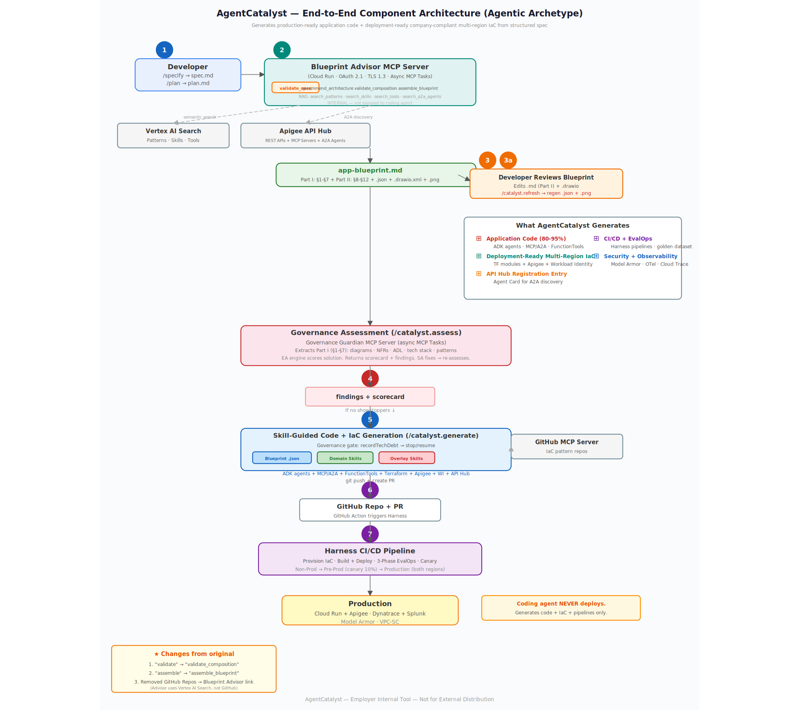

# AgentCatalyst GA — Developer Guide

*Get from "I need an app" to production-ready generated code in under 1 hour.*
*GA-only — zero pre-GA dependencies.*

> **Companion document:** For architectural depth — pattern catalog, HA/DR matrix, skill mechanism internals, cost analysis, governance model, and risk mitigations — see the *AgentCatalyst Architecture Document* (`agentcatalyst-architecture.md`).

---

## Quick Start (TL;DR)

If you've done this before and just need the commands:

```bash
# 1. Install preset (one-time — pick your archetype)
specify preset add agentcatalyst-agentic      # for AI agents
specify preset add agentcatalyst-microservice  # for microservices

# 2. Create project
mkdir my-app && cd my-app && specify init --preset agentcatalyst-agentic

# 3. Install skills (one-time)
gemini skills install github.com/company/agentcatalyst-skills --scope user

# 4. In VSCode with your coding agent:
/specify              # fill in the structured template → spec.md
/plan                 # answer technical questions → plan.md
/catalyst.blueprint   # Connects to Blueprint Advisor MCP Server (async) → returns app-blueprint.md
# review + edit the markdown blueprint
/catalyst.assess      # Governance Guardian assessment → findings + scorecard (fix + re-assess until passed)
/catalyst.generate    # Governance gate + coding agent generates everything using skills
```

### How Signal Validation Works (Two Layers)

Signal validation runs at two layers to catch issues as early as possible:

**Layer 1 — Local (during `/specify` capture):** The SpecKit preset template includes inline validation instructions. As you answer each section, the coding agent checks your response immediately and asks you to fix issues before moving on. You'll see real-time feedback:

```
You: "Process the claim and do some checks"
Agent: ⚠️ §2 needs ordering words. I can't determine the right patterns
       without sequence information. Can you rephrase using 'first',
       'then', 'in parallel', 'loop until', 'route to human if'?
You: "First extract claim details, then in parallel check policy and get estimate"
Agent: ✅ §2 captured. Detected: first (Sequential), in parallel (Parallel).
```

**Layer 2 — Server-side (inside `blueprint_start`):** When you run `/catalyst.blueprint`, the Blueprint Advisor runs `validate_spec` as Step 0 before the RAG pipeline. This catches complex issues that require server access: does the named data system have a pattern in the catalog? Is the A2A agent actually deployed? Does the spec violate an ADR?

**Why both layers:** Layer 1 catches OBVIOUS issues instantly (you fix them in 10 seconds). Layer 2 catches COMPLEX issues that need catalog/registry access (you find out in 2 seconds when `blueprint_start` returns a BLOCK or WARN). Without Layer 1, you'd fill 10 sections over 20 minutes and only discover problems when the server rejects your spec.

### Writing Specs That Pass Signal Validation

The Blueprint Advisor validates your spec BEFORE running the RAG pipeline. Specs with strong signals produce high-quality blueprints. Specs with weak signals produce generic results. Here's how to write specs that pass validation:

**§2 Workflow — Use ordering words (REQUIRED):**
- ✅ GOOD: "**First**, the agent extracts claim details from the call transcript. **Then**, **in parallel**, it checks the policy database and requests a damage estimate. **Next**, it calculates the payout. **If** the payout exceeds $50K, **route to** a human adjuster."
- ❌ BAD: "The system processes claims and does some checks and calculations."
- WHY: Ordering words ("first", "then", "in parallel", "loop until", "route to human") determine which patterns the Blueprint Advisor retrieves. Without them, it can't distinguish Sequential from Parallel from Loop.

**§4 Data Systems — Name specific systems (REQUIRED):**
- ✅ GOOD: "**Cloud SQL** for claims data, **BigQuery** for analytics, **existing REST API** for the policy system"
- ❌ BAD: "A database for storing stuff and some analytics"
- WHY: "Cloud SQL" retrieves the Cloud SQL MCP server pattern and `tf-cloud-sql` Terraform module. "A database" matches everything and nothing.

**§5 External Partners — Flag "own system" (IMPORTANT):**
- ✅ GOOD: "BodyShopConnect — **they operate their own system** and expose an agent endpoint"
- ❌ BAD: "We get damage estimates from somewhere"
- WHY: "They operate their own" triggers A2A agent discovery via API Hub. Missing this → the Blueprint Advisor defaults to MCP wrapping when A2A delegation is correct.

**§7 Business Rules — Use IF/THEN format (REQUIRED):**
- ✅ GOOD: "**IF** payout > $50K **THEN** route to senior adjuster. **IF** policy expired **THEN** reject claim."
- ❌ BAD: "Handle high-value claims carefully and check policy status"
- WHY: IF/THEN rules become FunctionTool first-drafts in the generated code. Vague prose can't be converted to executable logic.

**§10 Acceptance Criteria — Measurable (REQUIRED):**
- ✅ GOOD: "Claim intake **< 5 minutes**, accuracy **> 95%**, customer satisfaction **> 4.5/5**"
- ❌ BAD: "Make it fast and accurate"
- WHY: Measurable criteria seed the golden dataset for EvalOps. "Fast" is not testable. "< 5 minutes" is a test case.

That's it. Your complete project is generated. Skip to [Section 2](#2-greenfield-agentic--fnol-agent-from-scratch) for the full agentic walkthrough, or [Section 3](#3-brownfield-microservices--angular--spring-boot-on-ecs-fargate) for the microservices brownfield example.

---

## Who does what — EA Team vs Developer

### What the EA / Platform Engineering team provides

They've already set up everything you need. You don't configure any of this:

| What they provide | Where it lives | Why you care |
|---|---|---|
| AgentCatalyst presets (per archetype) | Internal preset catalog | You install once — gives you templates, commands, reference docs |
| Pattern catalog (per archetype) | Vertex AI Search | Blueprint Advisor searches this to recommend patterns |
| Domain skills (per archetype) | `github.com/company/agentcatalyst-skills` | Teach the coding agent how to write correct code for ADK, Spring Boot, etc. |
| Company overlay skills (shared) | Same repo | Teach Terraform patterns, Dynatrace config, Jenkins/Harness pipelines, security standards |
| Blueprint Advisor MCP Server | Cloud Run + Cloud Run Jobs (GCP) | LlmAgent exposed as MCP Server (async via MCP Tasks). Your coding agent calls `blueprint_start`, `blueprint_status`, `blueprint_result`, `validate_composition`, `assemble_blueprint` via MCP protocol. |
| Approved tools registry | Apigee API Hub + `memory/approved-tools.md` | Unified catalog: MCP servers, REST APIs, and **deployed A2A agents** (registered with `type=a2a_agent`). Blueprint Advisor queries API Hub for A2A agents — reusing deployed agents instead of rebuilding. |
| Company Terraform modules | `github.com/company/tf-modules` | Pre-approved infrastructure modules |

### What you (the developer) do

| Step | What you do | Time |
|---|---|---|
| 1 | Install the preset + skills (one-time) | 5 min |
| 2 | `/specify` — describe your problem in structured English | 15 min |
| 3 | `/plan` — answer technical questions | 5 min |
| 4 | `/catalyst.blueprint` — get AI architecture advice | 1–5 min (async, progress in chat) |
| 4a | Review + edit app-blueprint.md (Part I) and diagrams | 15–30 min (HITL) |
| 4b | `/catalyst.refresh` — validate edits + regenerate .json + .png | < 10 sec |
| 5 | Review and edit the markdown blueprint | 10 min |
| 5a | **`/catalyst.assess` — governance assessment (auto-refreshes if stale)** | **1–5 min per assessment** |
| 6 | `/catalyst.generate` — coding agent generates the project (with governance gate) | 5–10 min |
| 7 | Write business logic + system prompts (the 20%) | 2–4 hours |
| 8 | Commit, PR, CI/CD | Standard process |

---

## 1. Prerequisites

> **Important:** The AgentCatalyst preset includes a `constitution.md` file that encodes non-negotiable rules your coding agent MUST follow (e.g., never deploy directly, always use company Terraform modules, always generate pre-commit hooks). These are coding agent constraints — NOT meta-skills or decision frameworks (those exist only in AgentForge). Your coding agent reads constitution.md before generating any code.

### 1.1 Workstation requirements

| Tool | Version | Install | GA? |
|---|---|---|---|
| VSCode | Latest | https://code.visualstudio.com | N/A |
| A coding agent | Any: GitHub Copilot, Claude Code, Cursor, Gemini CLI | Via VSCode extensions or CLI | N/A |
| Python | 3.10+ | `brew install python` or company dev container | N/A |
| ADK (includes `adk create`) | Latest GA | `pip install google-adk` | ✅ GA |
| `gh` CLI | Latest | `brew install gh` — needed for `gh skill install` | N/A |
| `gcloud` CLI | Latest | `brew install google-cloud-sdk` | ✅ GA |
| Git | Latest | Standard | N/A |

**Not required:** `agents-cli` (pre-GA), `npm`, `npx`. This guide uses only GA tools.

### 1.2 One-time setup

```bash
# 1. Authenticate with GCP
gcloud auth login
gcloud config set project YOUR_PROJECT_ID

# 2. Authenticate with GitHub (for skill installation)
gh auth login

# 3. Install the ADK (GA — includes adk create)
pip install google-adk

# 4. Install company skills (domain + overlay)
gemini skills install github.com/company/agentcatalyst-skills --scope user

# 5. Verify skills are visible
# In your coding agent, type /skills list — you should see:
#   adk-agents           [user]  ADK agent classes and orchestration
#   adk-tools            [user]  ADK tools — FunctionTool, MCPToolset, AgentTool
#   adk-mcp              [user]  MCP server connections
#   model-armor          [user]  Model Armor content screening
#   company-terraform    [user]  Company Terraform modules
#   company-observability[user]  Dynatrace + Splunk + OTel
#   company-cicd         [user]  Jenkins + Harness (NO direct deploy)
#   company-security     [user]  VPC-SC + CMEK + Secret Manager
```

If skills don't appear, check that `~/.agents/skills/` directory contains the skill folders.

### 1.3 Where skills live on disk

| Scope | Directory | When to use |
|---|---|---|
| **User** (global) | `~/.agents/skills/` | Install once, available in every project |
| **Workspace** (project) | `.agents/skills/` in repo root | Checked into git, available to everyone who clones |

For team-wide consistency, you can also check skills into the project repo:

```bash
cp -r ~/.agents/skills/* .agents/skills/
git add .agents/skills/ && git commit -m "Add company skills"
```

---

## 2. Greenfield Agentic — FNOL Agent from Scratch



This walkthrough builds an AI agent that handles First Notice of Loss (FNOL) for auto insurance from scratch.

### 2.1 Initialize the project

```bash
mkdir fnol-agent && cd fnol-agent
specify init --preset agentcatalyst-agentic
```

This creates the `.specify/` folder with all preset files:

```
fnol-agent/
└── .specify/
    ├── preset.yml
    ├── templates/
    │   ├── spec-template.md
    │   ├── plan-template.md
    │   └── tasks-template.md
    ├── commands/
    │   ├── catalyst.blueprint.md
    │   └── catalyst.generate.md
    └── memory/
        ├── adk-reference.md
        ├── company-patterns.md
        ├── approved-tools.md
        └── infra-standards.md
```

### 2.2 Open in VSCode

```bash
code .
```

Open the Copilot Chat panel (Ctrl+Shift+I or click the chat icon).

### 2.3 `/specify` — Describe the problem

Type `/specify`. The coding agent presents the 6-section template. Fill in each section:

**Business Problem:** "FNOL auto insurance — AI agent handles policyholder accident reports, verifies coverage, collects details, checks fraud, gets repair estimates, routes high-severity to human adjusters."

**Workflow:**
```
1. First, verify the policyholder's identity and active coverage (BigQuery)
2. Then, extract structured incident details from caller description
3. Simultaneously enrich: weather data, police report, fraud scoring, coverage verification
4. Generate claim summary, validate against rubric, refine until quality > 0.85
5. If high severity or fraud score > 0.7, route to human adjuster
```

**Data Sources:** BigQuery (analytical, read-only), Cloud SQL (transactional, read-write), Vertex AI Search (document retrieval)

**External Integrations:** Body shop network (they operate their own quoting service), rental car (they operate their own API), police report (municipal service, we don't control it)

**Internal Capabilities:** Proprietary fraud detection model, proprietary severity classifier, claim notification service

**Infrastructure:** us-central1, gemini-2.0-flash, Jenkins + Harness, Model Armor + DLP + CMEK + VPC-SC

Saved as `spec.md`. (~15 min)

### 2.4 `/plan` — Technical decisions

Type `/plan`. Answer the technical questions:

```
Runtime:         agent_engine
GCP Project:     insurance-agents-prod
Region:          us-central1
Model:           gemini-2.0-flash
Garden Template: adk_a2a
TF Modules:      github.com/company/tf-modules
Jenkins:         agent-infra-plan-apply-v3
Harness:         agent-deploy-canary-v4
Security:        Model Armor yes, DLP yes, CMEK yes, VPC-SC yes
Observability:   Dynatrace yes, OTel yes, Cloud Trace yes
```

Saved as `plan.md`. (~5 min)

### 2.5 `/catalyst.blueprint` — Get AI advice via Blueprint Advisor MCP Server

Type `/catalyst.blueprint`. The coding agent connects to the **Blueprint Advisor MCP Server** and starts a background task.

> **First-time authentication:** The first time you run `/catalyst.blueprint` or `/catalyst.assess`, your coding agent opens a browser for company SSO login (Microsoft Entra ID). After authenticating once (including MFA), tokens are cached securely in your OS keychain. Subsequent commands use silent token refresh — no browser popup. Both the Blueprint Advisor and Governance Guardian share the same OAuth 2.1 authentication, so you authenticate once for both. Tokens last 1 hour with automatic refresh. See Architecture Document, Layer 2 Security for the full OAuth 2.1 flow with Entra ID. You see progress in the Chat pane as the pipeline runs (typically 1–5 minutes). When complete, the coding agent writes several files to your workspace:

- **`app-blueprint.md`** — the PRIMARY artifact. Human-readable structured markdown (12 sections). You edit THIS file.
- **`app-blueprint.json`** — the DERIVED artifact. Machine-readable JSON generated from the `.md`. Consumed by `/catalyst.generate` for code generation. **Never edit this file directly** — it's regenerated from `.md` automatically.
- **Diagram files** — `.drawio.xml` (editable in Draw.io VSCode extension) + `.png` (rendered by Draw.io headless, inline in markdown)

Edit `app-blueprint.md` (Part I for architecture changes, Part II to override defaults) and `diagrams/*.drawio.xml` (in Draw.io VSCode extension) with whichever tool you prefer.

**After editing, run `/catalyst.refresh`:** This validates .md structure (12 sections), checks .md↔.drawio consistency (agents in diagram match §5 topology), syncs Part II from Part I changes (new agents get config rows in §8, §10, §12 with company defaults — existing developer overrides are preserved), and regenerates `app-blueprint.json` + diagram `.png` files.

**If you skip `/catalyst.refresh`:** `/catalyst.assess` auto-refreshes for you (detects stale .json, refreshes before assessing). But `/catalyst.generate` BLOCKS on stale .json — requires explicit refresh or assess first. This prevents code generation from outdated blueprints.

When you run `/catalyst.assess`, the Governance Guardian reads Part I of your `.md` — all 7 governance sections: §1 Executive Summary, §2 Tech Stack, §3 Architecture Decision Log, §4 NFRs, §5 Patterns & Agent Topology, §6 Component Architecture (+ PNG diagram), §7 HA/DR Views (+ PNG diagrams). It does NOT read Part II (§8-§12) — those are technical configs for code generation, not governance concerns.

### Editing diagrams — choose your tool

Your workspace contains 4 formats per diagram. You only need to edit ONE — the others are re-rendered when you call `assemble_blueprint` or when `/catalyst.generate` auto-regenerates.

| Tool | VSCode Extension | File to open | How to edit |
|---|---|---|---|

| **Draw.io** | `hediet.vscode-drawio` extension | `*.drawio.xml` | Full draw.io editor in a VSCode tab. Standard diagramming UI. |

**After editing a diagram:** Run `/catalyst.refresh` — it validates .md↔.drawio consistency (catches mismatches like "diagram shows 8 agents but §5 has 7"), regenerates `.png` from edited `.drawio.xml` (Draw.io headless), and regenerates `.json` from `.md`.

> **Tip:** Draw.io has a VSCode extension (`hediet.vscode-drawio`) that works fully offline — no cloud dependency. Edit `.drawio.xml` visually, save, run `/catalyst.refresh` to regenerate `.png`.

→ *See `app-blueprint-md-template-and-fnol-example.md` for the complete 12-section template structure and FNOL reference example.*

**Why async?** VS Code Copilot enforces a hard 10–15 second timeout on MCP tool calls. The Blueprint Advisor's internal pipeline (3 RAG searches + LLM reasoning + validation + assembly) takes 15–60 seconds. A single blocking call would be killed before it completes. Instead, the coding agent uses three fast MCP tools — `blueprint_start` (< 2s), `blueprint_status` (< 1s), `blueprint_result` (< 1s) — to drive an async loop. You don't need to think about this; the prompt file handles it automatically.

**What you see in the Chat pane:**

```
You: /catalyst.blueprint

Agent: Blueprint generation started. Checking progress...
Agent: Searching pattern catalog...
Agent: Searching tool registry for BigQuery, Cloud SQL, Vertex AI Search tools...
Agent: Searching skill catalog for matching skills...
Agent: LLM reasoning: mapping tools to agents based on co-occurrence...
Agent: Validating composition...
Agent: Assembling blueprint...
Agent: Blueprint ready! Saved app-blueprint.md to your workspace.

Blueprint Advisor recommends:
  5 agents: LlmAgent (coordinator), SequentialAgent (intake),
            ParallelAgent (enrichment), LoopAgent (summary), LlmAgent (HITL)
  3 MCP servers: bigquery-policy, cloud-sql-claims, vertex-search-policies
  3 A2A agents: body-shop-network, rental-car-service, police-report-service
  3 FunctionTool implementations: severity_classifier, coverage_calculator, notification_sender
  2 skills: bigquery v1.2.0, fraud-detection v2.0.1

Review the markdown and edit before running /catalyst.generate.
```

**What happens behind the scenes:**

1. Your coding agent calls `blueprint_start` with `spec.md` + `plan.md`. The server validates the input, creates a background task, and returns a task ID in under 2 seconds.

2. The background pipeline (running on Cloud Run Jobs with no timeout) does three searches against the company's curated catalogs:

   - **Pattern search** — reads your Workflow section's ordering words ("First," "Simultaneously," "Refine until") and searches the pattern catalog. "First... then..." → Sequential. "Simultaneously" → Parallel. "Refine until" → Loop.

   - **Tool search** — reads your Data Sources and External Integrations sections and searches the tool registry for the specific tools your agent needs. The tool registry is chunked at the **individual tool level**, not the server level — so when you write "BigQuery analytical queries," the search matches the specific `execute_query` tool on the BigQuery MCP server, not just "BigQuery" generically. MCP tools are searched in Vertex AI Search; **A2A agents are searched in Apigee API Hub** (`type=a2a_agent`) — deployed agents with matching capabilities are discovered and recommended for A2A delegation instead of building new agents.

   - **Skill search** — finds skills that match the tools and capabilities your agent needs. Skills are automatically paired with their corresponding tools.

3. Your coding agent polls `blueprint_status` every 10 seconds. Each poll returns the current stage and a progress message displayed in the Chat pane.

4. When the pipeline completes, your coding agent calls `blueprint_result` to retrieve the blueprint and saves it as `app-blueprint.md`.

**How the Blueprint Advisor decides which tool goes to which agent:**

It uses **co-occurrence** — which data source is mentioned in the same sentence as which workflow step. Your spec says: *"First, verify coverage **by querying our BigQuery**."* BigQuery is mentioned in the same sentence as "verify" → BigQuery MCP is assigned to the `verify_policy` agent. This is why the language in your spec matters — clear co-occurrence leads to correct assignments.

### 2.6 Review and edit the markdown blueprint

Open `app-blueprint.md`. The Blueprint Advisor gets it right ~90% of the time. The other 10% is why you review.

**What to check — the assignment audit:**

For each tool in the blueprint, verify the `assigned_to` agent makes sense:

| In the blueprint | Ask yourself | If wrong |
|---|---|---|
| `bigquery-policy → assigned_to: verify_policy` | "Does verify_policy need BigQuery?" Yes — spec says "verify coverage by querying BigQuery" | ✓ Correct |
| `cloud-sql-claims → assigned_to: extract_details` | "Does extract_details write to Cloud SQL?" No — it extracts from caller input. Cloud SQL writes happen at coordinator level. | ✗ Change to `fnol_coordinator` |
| `body-shop-network → assigned_to: enrichment_fan_out` | "Is body shop part of enrichment?" Yes — spec says "simultaneously enrich... body shop" | ✓ Correct |
| `bigquery skill → assigned_to: verify_policy` | "Is the BigQuery skill on the same agent as bigquery-mcp?" Yes — both on verify_policy | ✓ Correct |

**Common assignment mistakes and how to fix them:**

| Mistake | Why it happens | How to fix |
|---|---|---|
| **Write tool on a leaf agent** | Spec says "extract and save" in one sentence — Blueprint Advisor assigns Cloud SQL to `extract_details` | Move `assigned_to` to the coordinator. Write operations are usually coordinator-level. |
| **Tool on wrong parallel branch** | Spec mentions "fraud scoring" and "police report" in the same paragraph — Blueprint Advisor mixes up which goes where | Check which branch name matches the tool's purpose. Edit `assigned_to`. |
| **Missing tool entirely** | Spec mentions a data source the tool registry doesn't have | Add the tool manually to the blueprint. Then request it be added to the registry (see `memory/approved-tools.md`). |
| **MCP when it should be A2A (or vice versa)** | Tool registry has the integration registered as the wrong type | This is rare — the registry determines the type. Report to platform engineering. |
| **Skill on wrong agent** | Skill's `compatible_tools` matched the wrong MCP server | Move the skill's `assigned_to` to match the agent that uses the related tool. |

**Pro tip:** Read the blueprint top-to-bottom and mentally trace the FNOL workflow. For each agent, ask: "Does this agent have access to every data source it needs, and ONLY the data sources it needs?" An agent with too many tools has too much scope. An agent missing a tool will fail at runtime.

### 2.6a `/catalyst.refresh` — Validate edits + regenerate derived files

After editing `app-blueprint.md` (Part I or Part II) or `diagrams/*.drawio.xml`, run:

```
/catalyst.refresh
```

This does 3 things in < 10 seconds:

**1. VALIDATE structure:**
- Part I completeness: are all 7 governance sections (§1-§7) present?
- .md↔.drawio consistency: do agents in the diagram match §5 topology?
- If mismatch: "Diagram has 8 agents, §5 has 7. Missing: fraud-check-agent."

**2. SYNC Part II from Part I changes:**
- New agent added to §5 → new rows auto-generated in §8 (tool config), §10 (security), §12 (observability)
- Developer's previous overrides in Part II are PRESERVED (only new rows added)
- Deleted agent from §5 → stale rows flagged in Part II for removal

**3. REGENERATE derived files:**
- `app-blueprint.json` — parsed from all 12 sections of .md
- `diagrams/*.png` — re-rendered from `.drawio.xml` via Draw.io headless (only if .drawio was modified)

**Output:**
```
/catalyst.refresh
  Validating Part I (§1-§7)... ✅ All 7 sections present
  Checking .md↔.drawio consistency... ✅ 8 agents in both
  Syncing Part II from Part I...
    §8: +1 row (fraud-check-agent tool config from API Hub defaults)
    §10: +1 row (fraud-check-agent security: Model Armor level_2)
    §12: +1 row (fraud-check-agent OTel span: fnol.fraud_check)
    §9, §11: no changes needed
  Regenerating app-blueprint.json... ✅ (12 sections → JSON)
  Regenerating diagrams/component-architecture.png... ✅ (from .drawio.xml)
  
  ✅ Refresh complete. .json and .png are current.
```

> **Can I skip this?** Yes — `/catalyst.assess` and `/catalyst.generate` both auto-detect stale files (by comparing .md/.drawio timestamps with .json timestamp) and run a lightweight refresh as Step 0 before proceeding. You'll see: "Stale .json detected — auto-refreshing..." So `/catalyst.refresh` is OPTIONAL as a standalone command but gives you detailed validation feedback. The auto-refresh in `/catalyst.assess` and `/catalyst.generate` is silent — it just ensures files are current.

> **What if .md and .drawio conflict?** `/catalyst.refresh` reports the mismatch: "§5 shows 7 agents, diagram shows 8. Missing from §5: fraud-check-agent." It does NOT auto-resolve — you must fix the conflict (add the agent to §5 or remove it from the diagram) and re-run `/catalyst.refresh`.

### 2.7 `/tasks` — See the breakdown

Type `/tasks`. See the 80/20 split:

**Auto-generated:** Agent classes, MCP connections, A2A clients, Model Armor callbacks, Terraform, **Apigee proxy routes** (one per tool binding), **per-agent Workload Identity** IAM bindings (least-privilege from topology), **API Hub registration entry** (agent card for future A2A discovery), Dynatrace, CI/CD pipelines

> **What the new generated artifacts do for you:**
> - **Apigee proxy routes** — each tool binding in your blueprint (§5) generates one Apigee proxy route with the correct authentication (mTLS, OAuth, API Key from §7). A2A agent connections discovered via API Hub generate A2A-specific proxy routes. You don't configure Apigee manually.
> - **Per-agent Workload Identity** — each agent in your topology (§3) gets its own GCP service account with IAM bindings ONLY for the tools assigned to it in §5. If `extract_details` is assigned to `claims-db-mcp`, it gets `roles/cloudsql.client` but cannot access `policy-api-mcp`. Least-privilege by default.
> - **API Hub registration** — after deployment, the CI/CD pipeline registers your agent in Apigee API Hub with capabilities and an Agent Card URL. Future Blueprint Advisor runs discover your agent and can recommend A2A delegation to it — reusing your agent instead of rebuilding.
> See Architecture Document Layer 3 for Terraform examples and derivation logic. See Operations Runbook §11 for health checks and failure modes.

**You implement:** System prompts, `severity_classifier()`, `coverage_calculator()`, `notification_sender()`, test data

### 2.7a `/catalyst.assess` — Governance assessment

→ *Governance Guardian Architecture Extension covers the full assessment flow, solution package schema, and scorecard format.*

After reviewing and editing the blueprint, run the governance assessment before generating code:

```
/catalyst.assess
```

The coding agent extracts solution artifacts from your workspace — TSA component diagram from your `.drawio.xml` file, HA/DR views, NFRs, architecture decisions log, tech stack, and patterns used — packages them as JSON, and sends them to the **Governance Guardian MCP Server** using the same async pattern as the Blueprint Advisor (`assess_start` → poll → `assess_result`).

**What you see in the Chat pane:**

```
You: /catalyst.assess

Agent: Extracting solution artifacts from workspace...
       ✓ TSA component diagram (claims-portal-tsa.drawio.xml)
       ✓ HA/DR views (2 views found)
       ✓ 
       ✓ NFRs (from plan.md)
       ✓ Architecture Decisions Log (4 entries from adl.md)
       ✓ Tech stack (from app-blueprint.md)
       ✓ Patterns used (3 patterns)

       Governance assessment started. Checking progress...
       Evaluating architecture compliance...
       Checking pattern adherence...
       Scoring HA/DR readiness...
       Assessment complete!

       SCORECARD: 72/100 (Grade C)
       🔴 SHOWSTOPPER: F-001 — No cross-region DR for Aurora PostgreSQL (ADR-205)
       🟠 HIGH: F-002 — WAF rules not using enterprise managed rule group
       🟡 MEDIUM: F-003 — Angular 17 not on approved tech radar

       Fix the showstopper and run /catalyst.assess again.
```

**The assess-fix loop:** Fix the showstopper findings in your workspace (update Terraform, drawio diagrams, etc.), then run `/catalyst.assess` again. Repeat until no showstoppers remain. Non-showstopper findings will be recorded as tech debt when you run `/catalyst.generate`.

**Missing artifacts:** If the coding agent can't find a drawio file or NFR section, it includes the artifact as `null` with a reason. The Governance Guardian will likely flag missing artifacts as findings.

### 2.8 `/catalyst.generate` — Generate everything

Type `/catalyst.generate`. **Before the generation pipeline runs**, two checks occur:

1. **Staleness check:** Is `app-blueprint.json` stale (was `.md` modified since last refresh)? If yes → BLOCKED with "Run /catalyst.refresh first." If no → proceed.
2. **Governance gate:** The coding agent calls `recordTechDebt` on the Governance Guardian. This checks whether any showstopper findings remain from your latest `/catalyst.assess` run:

- **If showstoppers exist → BLOCKED.** The coding agent reports the showstoppers and tells you to fix them and re-run `/catalyst.assess`.
- **If no showstoppers → RESUME.** Remaining findings are recorded as tech debt (you'll see the tech debt ID). Code generation proceeds.
- **If no assessment exists → WARNING.** The coding agent suggests running `/catalyst.assess` first, or you can type `skip` to proceed without governance assessment.

```
You: /catalyst.generate

Agent: Checking governance gate...
       Governance passed. Tech debt recorded (TD-2026-0142):
       - F-002: WAF managed rule group (HIGH) — tech debt
       - F-003: Angular 17 tech radar (MEDIUM) — tech debt
       Proceeding with code generation...
```

The coding agent then reads the blueprint and uses installed skills to generate the project:

```
fnol-agent/
├── app/
│   ├── agent.py                          ← Root LlmAgent
│   ├── sub_agents/
│   │   ├── intake_pipeline.py            ← SequentialAgent
│   │   ├── enrichment_fan_out.py         ← ParallelAgent
│   │   ├── claim_summary_loop.py         ← LoopAgent
│   │   └── adjuster_review.py            ← HITL
│   ├── mcp_connections/
│   │   ├── bigquery_policy.py            ← MCPToolset
│   │   ├── cloud_sql_claims.py           ← MCPToolset
│   │   └── vertex_search_policies.py     ← MCPToolset
│   ├── a2a_clients/
│   │   ├── body_shop_network.py          ← AgentTool
│   │   ├── rental_car_service.py         ← AgentTool
│   │   └── police_report_service.py      ← AgentTool
│   ├── tools/
│   │   ├── severity_classifier.py        ← YOUR CODE HERE
│   │   ├── coverage_calculator.py        ← YOUR CODE HERE
│   │   └── notification_sender.py        ← YOUR CODE HERE
│   ├── callbacks/
│   │   └── model_armor.py                ← Standard screening
│   └── skills/
│       ├── bigquery/
│       └── fraud-detection/
├── deployment/terraform/
│   ├── main.tf                           ← Company TF modules (via GitHub URLs)
│   ├── variables.tf                      ← Descriptions from module repos
│   ├── terraform.tfvars                  ← Pre-filled from blueprint
│   ├── versions.tf                       ← Provider versions pinned
│   ├── backend.tf                        ← GCS backend config
│   ├── environments/
│   │   ├── dev.tfvars
│   │   ├── staging.tfvars
│   │   └── prod.tfvars                   ← Multi-region for production
│   └── dr/
│       ├── failover.tf                   ← From blueprint §13 lifecycle
│       ├── failback.tf
│       └── lifecycle.tf
├── observability/
│   ├── dynatrace/
│   └── otel/
├── ci-cd/
│   ├── Jenkinsfile                       ← Company template ref
│   └── harness-pipeline.yaml             ← Canary deployment
├── pyproject.toml
├── README.md
└── app-blueprint.md
```

**What `/catalyst.generate` did NOT do:**
- It did NOT deploy to GCP — no `agents-cli deploy`, no direct provisioning
- It did NOT generate Cloud Build config — company uses Jenkins
- It generated Jenkinsfile + harness-pipeline.yaml instead — your CI/CD takes over after you merge

#### What the generated code looks like

**Agent class** (guided by `adk-agents` skill):

```python
# app/sub_agents/intake_pipeline.py
from google.adk.agents import SequentialAgent

intake_pipeline = SequentialAgent(
    name="intake_pipeline",
    sub_agents=["verify_policy", "extract_details"],
    description="Ordered intake — verify policy then extract incident details",
)
```

**MCP connection** (guided by `adk-mcp` skill):

```python
# app/mcp_connections/bigquery_policy.py
from google.adk.tools import MCPToolset

bigquery_policy = MCPToolset(
    name="bigquery-policy",
    connection_params={
        "endpoint": "bigquery.googleapis.com",
        "transport": "sse",
        "auth": "workload_identity",
    },
    description="Query policy data warehouse",
)
```

**Terraform module** (guided by `company-terraform` skill):

```hcl
# deployment/terraform/main.tf
module "agent-runtime" {
  source  = "github.com/company/tf-modules//agent-runtime?ref=v3.1.0"
  project = var.gcp_project
  region  = var.gcp_region
  agent_name = "fnol-coordinator"
}
```

#### How Terraform generation works behind the scenes

When `/catalyst.generate` runs, the IaC overlay skill (`company-terraform`) reads `app-blueprint.md` §8 (Infrastructure Modules) and generates all the Terraform by following these steps:

1. **Reads the module URLs from your blueprint** — §8 lists GitHub URLs for each company Terraform module needed by your solution (e.g., `github.com/company/tf-agentic-pilot-cold` for the overall pattern, `github.com/company/tf-cloud-sql` for the claims database).

2. **Reads module interfaces via GitHub MCP Server** — Your coding agent calls the GitHub MCP Server to read `variables.tf` and `outputs.tf` from each module repo. This tells it what parameters each module needs. It also reads `examples/` for reference values. Your GitHub authentication is used — no separate credentials needed.

3. **Maps your blueprint to module variables** — The skill deterministically maps blueprint fields to Terraform variables. For example: §10 NFRs says "availability: 99.95%" → `ha_enabled = true`. §1 Metadata says "DR strategy: Pilot Light" → selects the `tf-agentic-pilot-cold` pattern repo. §3 Agent Topology agent names → one Cloud Run service per agent.

4. **Generates the complete Terraform project:**

```
deployment/terraform/
├── main.tf             ← Root module: references company modules via GitHub URLs
├── variables.tf        ← All variables with descriptions from module repos
├── terraform.tfvars    ← Pre-filled from your blueprint (regions, project, DR)
├── outputs.tf          ← Values exported for CI/CD pipeline to consume
├── versions.tf         ← Provider versions pinned from module repos
├── backend.tf          ← GCS backend for state
├── environments/
│   ├── dev.tfvars      ← Single-region, minimal resources
│   ├── staging.tfvars  ← Single-region, production-like
│   └── prod.tfvars     ← Multi-region, full DR
└── dr/
    ├── failover.tf     ← Failover triggers from blueprint §13
    ├── failback.tf     ← Failback procedure resources
    └── lifecycle.tf    ← All 4 lifecycle scenarios
```

5. **Wires modules together** — The generated `main.tf` references each company module with a pinned version and passes in variables from your blueprint. Module outputs are wired to inputs (e.g., Cloud SQL connection string → agent environment variable):

```hcl
# deployment/terraform/main.tf — GENERATED, DO NOT EDIT MANUALLY
module "claims_db" {
  source         = "github.com/company/tf-cloud-sql?ref=v3.1.0"
  instance_name  = "${var.project_name}-claims-db"
  region         = var.primary_region
  ha_enabled     = true              # From blueprint §10: 99.95% availability
  replica_region = var.dr_region     # From blueprint §10: RPO < 1 hour
}

module "agent_stack" {
  source         = "github.com/company/tf-agentic-pilot-cold?ref=v2.3.0"
  project_name   = var.project_name
  primary_region = var.primary_region
  dr_region      = var.dr_region
  services = {
    fnol_coordinator = { cpu = "2", memory = "4Gi", min = 2, max = 10 }
    extract_details  = { cpu = "1", memory = "2Gi", min = 1, max = 5 }
    # ... one entry per agent from blueprint §3
  }
  db_connection_string = module.claims_db.connection_string  # wired
}
```

**The critical rule:** Your coding agent will **never** generate raw `google_*` or `aws_*` Terraform resources. It always references company modules from the GitHub URLs in your blueprint. This is enforced by the `company-terraform` skill. If a module doesn't exist for something your solution needs, the generated code includes a `# TODO: Request tf-{service} module from platform team` comment instead of guessing.

**If you need to customize Terraform:** Edit `terraform.tfvars` to change values (regions, instance sizes). To change the module structure itself, edit `main.tf` — but be aware that `/catalyst.generate` will overwrite it if you re-run. For persistent customizations, request module parameter additions from the platform team.

**Jenkinsfile** (guided by `company-cicd` skill):

```groovy
// ci-cd/Jenkinsfile — DO NOT use agents-cli deploy
@Library('company-pipeline-lib') _
agentInfraPlanApply(
    template: 'agent-infra-plan-apply-v3',
    terraformDir: 'deployment/terraform',
    environment: params.ENVIRONMENT
)
```

### 2.9 Write the 20%

**System prompts** — open each agent class and replace `<<< ENGINEER MUST WRITE >>>`:

```python
# app/agent.py
fnol_coordinator = LlmAgent(
    name="fnol_coordinator",
    model="gemini-2.0-flash",
    system_instruction="""You are the FNOL Coordinator for auto insurance.
    When a policyholder reports an accident, orchestrate: verify coverage
    (intake_pipeline), enrich from external sources (enrichment_fan_out),
    summarize (claim_summary_loop), route high-severity to adjuster
    (adjuster_review). Be professional, empathetic, thorough.""",
    sub_agents=[intake_pipeline, enrichment_fan_out,
                claim_summary_loop, adjuster_review],
)
```

**FunctionTool bodies** — implement business logic:

```python
# app/tools/severity_classifier.py
def severity_classifier(claim_data: dict) -> dict:
    """Classify claim severity."""
    damage = claim_data.get("estimated_damage", 0)
    injuries = claim_data.get("injuries_reported", False)
    if injuries or damage > 25000:
        return {"severity": "high", "confidence": 0.92}
    elif damage > 5000:
        return {"severity": "medium", "confidence": 0.85}
    else:
        return {"severity": "low", "confidence": 0.95}
```

### 2.10 Commit and CI/CD

```bash
git add . && git commit -m "feat: FNOL agent generated by AgentCatalyst"
git push origin feature/fnol-agent
# Open PR → Team reviews → Merge
# Jenkins runs Terraform → Harness deploys Non-Prod → Pre-Prod → Prod
```

---

## 3. Brownfield Microservices — Angular + Spring Boot on ECS Fargate

This section walks through a real-world brownfield scenario: your company has an existing SPA (Single Page Application) pattern with Angular frontend and Spring Boot backend running on ECS Fargate, connecting to Oracle RDS. There's existing IaC and boilerplate integration code, but **no "Hello World" reference implementation** that developers can clone and start building from.

### 3.1 What already exists

The platform engineering team has built the infrastructure layer and boilerplate, but stopped short of a working application:

```
existing-spa-pattern/
├── terraform/                         ← EXISTS: IaC for the full stack
│   ├── modules/
│   │   ├── ecs-fargate/               ← ECS cluster, task definitions, services
│   │   ├── oracle-rds/                ← Oracle RDS instance, subnet groups, security groups
│   │   ├── alb/                       ← Application Load Balancer, target groups, listeners
│   │   ├── ecr/                       ← Container registries (frontend + backend)
│   │   ├── vpc/                       ← VPC, subnets, NAT gateway, route tables
│   │   └── cloudwatch/                ← Log groups, dashboards, alarms
│   ├── environments/
│   │   ├── dev.tfvars
│   │   ├── staging.tfvars
│   │   └── prod.tfvars
│   └── main.tf                        ← Root module wiring all components
│
├── boilerplate/                       ← EXISTS: Integration code only
│   ├── backend/
│   │   ├── src/main/resources/
│   │   │   └── application.yml        ← Oracle datasource config (JDBC URL,
│   │   │                                 connection pool, HikariCP settings)
│   │   ├── Dockerfile                 ← Multi-stage build for Spring Boot
│   │   └── build.gradle               ← Dependencies (spring-boot-starter-web,
│   │                                     spring-boot-starter-data-jpa, ojdbc11)
│   └── frontend/
│       ├── proxy.conf.json            ← Angular dev server → backend proxy config
│       ├── Dockerfile                 ← Multi-stage build for Angular (nginx)
│       ├── nginx.conf                 ← Production nginx config (routing, gzip, headers)
│       └── angular.json               ← Angular workspace config
│
├── ci-cd/                             ← EXISTS: Pipeline definitions
│   ├── Jenkinsfile                    ← Terraform plan + apply
│   └── harness-pipeline.yaml          ← ECS Fargate blue-green deployment
│
└── docs/
    └── architecture.md                ← Pattern documentation
```

**What EXISTS:** Complete Terraform for ECS Fargate + Oracle RDS + ALB + VPC. Dockerfiles for both frontend and backend. Spring Boot `application.yml` with Oracle datasource configured. Angular proxy and nginx configs. Jenkins + Harness pipelines.

**What's MISSING:** There is no actual application code. No Spring Boot controllers, services, repositories, or entities. No Angular components, services, routes, or pages. A developer who clones this repo can provision the infrastructure and build empty containers — but the containers do nothing. There's no "Hello World" that proves the stack works end to end.

### 3.2 What needs to be built — the Hello World reference implementation

The "Hello World" reference implementation should prove that every layer works together:

| Layer | What needs to exist | Purpose |
|---|---|---|
| **Angular frontend** | A simple page with a form that submits data and displays a response | Proves: Angular → nginx → ALB → Spring Boot round-trip works |
| **Spring Boot backend** | A REST controller with GET and POST endpoints, a JPA entity, a repository, a service | Proves: Spring Boot → Oracle RDS round-trip works |
| **Database** | A Flyway migration creating one table + seed data | Proves: Schema management works, Oracle connection works |
| **End-to-end** | The form submits data, backend stores in Oracle, backend returns it, frontend displays it | Proves: The entire stack works top to bottom |

### 3.3 Step-by-step: Creating the Hello World with AgentCatalyst

#### Step 1: Initialize AgentCatalyst in the existing repo

```bash
cd existing-spa-pattern
specify init --preset agentcatalyst-microservice
```

This adds the `.specify/` folder alongside the existing `terraform/`, `boilerplate/`, and `ci-cd/` directories. It doesn't modify any existing files.

#### Step 2: `/specify` — Describe the Hello World

Type `/specify` in your coding agent. Fill in the microservice template:

```markdown
## Service Purpose
Hello World reference implementation for the Angular + Spring Boot SPA
pattern on ECS Fargate with Oracle RDS. This is NOT a production
application — it's a minimal working example that proves every layer
of the stack works end to end.

## API Contracts
GET  /api/greetings         — list all greetings
POST /api/greetings         — create a greeting (body: { "name": "Alice", "message": "Hello" })
GET  /api/greetings/{id}    — get greeting by ID
GET  /api/health            — health check (returns DB connectivity status)

## Dependencies
Oracle RDS — EXISTING database at the endpoint configured in
    boilerplate/backend/src/main/resources/application.yml.
    The agent MUST use the EXISTING datasource configuration.
    DO NOT create a new database or modify the connection settings.

## Data Model
Greeting: id (NUMBER, auto-generated), name (VARCHAR2 100),
    message (VARCHAR2 500), created_at (TIMESTAMP, auto-generated)

## Frontend Requirements
Angular SPA with one page:
    - A form with "Name" and "Message" fields + Submit button
    - A list below showing all submitted greetings (auto-refreshes)
    - Minimal styling using Angular Material
    - Calls backend via /api/greetings (proxied through nginx/ALB)

## Infrastructure Requirements
EXISTING infrastructure — DO NOT generate new Terraform.
Use the existing ECS Fargate + Oracle RDS + ALB from terraform/.
Use the existing Dockerfiles from boilerplate/.
Use the existing CI/CD from ci-cd/.
Only generate application code that runs inside the existing containers.
```

**Key language:** Notice the repeated "EXISTING" and "DO NOT create new" signals. This tells the Blueprint Advisor MCP Server (which the coding agent invokes via `blueprint_start`) and the coding agent to work within the existing infrastructure, not generate new infrastructure.

#### Step 3: `/plan` — Technical decisions

```
Runtime:           ecs_fargate (EXISTING)
Backend framework: Spring Boot 3.x (EXISTING build.gradle)
Frontend framework: Angular 17+ (EXISTING angular.json)
Database:          Oracle RDS (EXISTING — use boilerplate/application.yml)
Terraform:         SKIP — infrastructure already exists
CI/CD:             EXISTING Jenkinsfile + harness-pipeline.yaml
```

#### Step 4: `/catalyst.blueprint` — Get AI advice via MCP (async)

The Blueprint Advisor reads the spec and recognizes the brownfield signals. Like the greenfield flow (see §2.5 for the full async explanation), your coding agent starts a background task, polls for progress, and retrieves the result. You see progress in the Chat pane:

```
Agent: Blueprint generation started. Checking progress...
Agent: Searching pattern catalog for microservice patterns...
Agent: Searching tool registry — recognizing EXISTING signals for Oracle, Angular, ECS...
Agent: Reasoning: brownfield mode — skipping infrastructure generation...
Agent: Assembling blueprint...
Agent: Blueprint ready! Saved app-blueprint.md.
```

This typically takes 1–3 minutes for a brownfield spec. The returned `app-blueprint.md` references existing infrastructure rather than creating new infrastructure:

```yaml
metadata:
  name: hello-world-spa
  archetype: microservice
  template: springboot-angular
  description: "Hello World ref impl for SPA pattern on ECS Fargate"

platform:
  runtime: ecs_fargate    # EXISTING — do not provision

backend:
  framework: spring-boot
  base_package: com.company.helloworld
  endpoints:
    - method: GET
      path: /api/greetings
      handler: listGreetings
    - method: POST
      path: /api/greetings
      handler: createGreeting
    - method: GET
      path: /api/greetings/{id}
      handler: getGreeting
    - method: GET
      path: /api/health
      handler: healthCheck

  entities:
    - name: Greeting
      table: GREETINGS
      fields:
        - { name: id, type: Long, generated: true }
        - { name: name, type: String, length: 100 }
        - { name: message, type: String, length: 500 }
        - { name: createdAt, type: Timestamp, generated: true }

  database:
    type: oracle
    config_source: boilerplate/backend/src/main/resources/application.yml
    migration_tool: flyway

frontend:
  framework: angular
  pages:
    - name: greetings
      path: /
      components: [greeting-form, greeting-list]
  ui_library: angular-material
  api_proxy: boilerplate/frontend/proxy.conf.json

infrastructure:
  terraform:
    action: SKIP      # Infrastructure already exists
  security:
    existing: true    # Use existing VPC, security groups
  observability:
    cloudwatch: true  # Use existing CloudWatch config
  cicd:
    action: SKIP      # Pipeline definitions already exist
```

**Notice:** `infrastructure.terraform.action: SKIP` and `infrastructure.cicd.action: SKIP` — the Blueprint Advisor recognized the brownfield signals and excluded infrastructure generation.

#### Step 5: Review the markdown

Verify:
- `database.config_source` points to the correct `application.yml`
- Entity fields match your Oracle column types
- Frontend proxy references the existing `proxy.conf.json`
- Infrastructure is marked SKIP

#### Step 6: `/catalyst.generate` — Generate the application code

Type `/catalyst.generate`. The coding agent reads the blueprint and uses skills to generate **only the application code** — no infrastructure, no CI/CD, no Docker configs (those already exist):

```
existing-spa-pattern/
├── terraform/                         ← UNTOUCHED (exists)
├── boilerplate/                       ← UNTOUCHED (exists)
├── ci-cd/                             ← UNTOUCHED (exists)
│
├── backend/                           ← NEW: Generated Spring Boot app
│   ├── src/main/java/com/company/helloworld/
│   │   ├── HelloWorldApplication.java       ← Spring Boot main class
│   │   ├── controller/
│   │   │   └── GreetingController.java      ← REST controller (4 endpoints)
│   │   ├── service/
│   │   │   └── GreetingService.java         ← Business logic
│   │   ├── repository/
│   │   │   └── GreetingRepository.java      ← JPA repository (Spring Data)
│   │   ├── entity/
│   │   │   └── Greeting.java                ← JPA entity mapped to GREETINGS table
│   │   ├── dto/
│   │   │   ├── GreetingRequest.java         ← Request DTO with validation
│   │   │   └── GreetingResponse.java        ← Response DTO
│   │   └── health/
│   │       └── OracleHealthIndicator.java   ← DB connectivity health check
│   ├── src/main/resources/
│   │   ├── application.yml                  ← SYMLINK to boilerplate version
│   │   └── db/migration/
│   │       └── V1__create_greetings.sql     ← Flyway migration
│   └── src/test/java/com/company/helloworld/
│       ├── controller/
│       │   └── GreetingControllerTest.java  ← Unit tests
│       └── integration/
│           └── GreetingIntegrationTest.java ← Integration test with Oracle
│
├── frontend/                          ← NEW: Generated Angular app
│   ├── src/app/
│   │   ├── app.component.ts                 ← Root component
│   │   ├── app.module.ts                    ← Module with Material imports
│   │   ├── app-routing.module.ts            ← Routes
│   │   ├── components/
│   │   │   ├── greeting-form/
│   │   │   │   ├── greeting-form.component.ts
│   │   │   │   ├── greeting-form.component.html
│   │   │   │   └── greeting-form.component.css
│   │   │   └── greeting-list/
│   │   │       ├── greeting-list.component.ts
│   │   │       ├── greeting-list.component.html
│   │   │       └── greeting-list.component.css
│   │   ├── services/
│   │   │   └── greeting.service.ts          ← HTTP client for /api/greetings
│   │   └── models/
│   │       └── greeting.model.ts            ← TypeScript interface
│   ├── proxy.conf.json                      ← SYMLINK to boilerplate version
│   └── angular.json                         ← EXTENDED from boilerplate version
│
├── docs/
│   └── hello-world-readme.md          ← NEW: How to run the Hello World
│
└── .specify/                          ← AgentCatalyst preset
```

**What was generated:** Spring Boot application code (controller, service, repository, entity, DTOs, health check, Flyway migration, tests) + Angular application code (components, services, models, routing). Everything needed to make the existing infrastructure actually serve a working application.

**What was NOT generated:** No new Terraform. No new Dockerfiles. No new CI/CD pipelines. No new database instances. The generated code plugs into the existing infrastructure.

#### What the generated brownfield code looks like

**Spring Boot REST controller** (guided by `spring-boot` domain skill):

```java
// backend/src/main/java/com/company/helloworld/controller/GreetingController.java
@RestController
@RequestMapping("/api/greetings")
public class GreetingController {

    private final GreetingService greetingService;

    public GreetingController(GreetingService greetingService) {
        this.greetingService = greetingService;
    }

    @GetMapping
    public List<GreetingResponse> listGreetings() {
        return greetingService.findAll();
    }

    @PostMapping
    public GreetingResponse createGreeting(@Valid @RequestBody GreetingRequest request) {
        return greetingService.create(request);
    }

    @GetMapping("/{id}")
    public GreetingResponse getGreeting(@PathVariable Long id) {
        return greetingService.findById(id);
    }
}
```

**JPA entity** (mapped to Oracle GREETINGS table):

```java
// backend/src/main/java/com/company/helloworld/entity/Greeting.java
@Entity
@Table(name = "GREETINGS")
public class Greeting {

    @Id
    @GeneratedValue(strategy = GenerationType.IDENTITY)
    private Long id;

    @Column(length = 100, nullable = false)
    private String name;

    @Column(length = 500, nullable = false)
    private String message;

    @Column(name = "CREATED_AT", updatable = false)
    @CreationTimestamp
    private Timestamp createdAt;

    // getters, setters omitted
}
```

**Flyway migration** (creates the table in Oracle on first boot):

```sql
-- backend/src/main/resources/db/migration/V1__create_greetings.sql
CREATE TABLE GREETINGS (
    id         NUMBER GENERATED ALWAYS AS IDENTITY PRIMARY KEY,
    name       VARCHAR2(100)  NOT NULL,
    message    VARCHAR2(500)  NOT NULL,
    created_at TIMESTAMP      DEFAULT CURRENT_TIMESTAMP NOT NULL
);

-- Seed data for verification
INSERT INTO GREETINGS (name, message) VALUES ('System', 'Hello World — stack verified');
```

**Angular component** (the greeting form):

```typescript
// frontend/src/app/components/greeting-form/greeting-form.component.ts
@Component({
  selector: 'app-greeting-form',
  templateUrl: './greeting-form.component.html',
})
export class GreetingFormComponent {
  name = '';
  message = '';

  constructor(private greetingService: GreetingService) {}

  onSubmit(): void {
    this.greetingService
      .create({ name: this.name, message: this.message })
      .subscribe(() => {
        this.name = '';
        this.message = '';
        this.greetingService.refresh$.next();
      });
  }
}
```

**Angular HTTP service** (calls backend through nginx/ALB proxy):

```typescript
// frontend/src/app/services/greeting.service.ts
@Injectable({ providedIn: 'root' })
export class GreetingService {
  private apiUrl = '/api/greetings';  // proxied to backend via proxy.conf.json
  refresh$ = new Subject<void>();

  constructor(private http: HttpClient) {}

  findAll(): Observable<Greeting[]> {
    return this.http.get<Greeting[]>(this.apiUrl);
  }

  create(request: { name: string; message: string }): Observable<Greeting> {
    return this.http.post<Greeting>(this.apiUrl, request);
  }
}
```

Every generated file uses the **existing** `application.yml` for Oracle connectivity and the **existing** `proxy.conf.json` for API routing. No new infrastructure was created.

#### Step 7: Verify the integration points

Before committing, verify that the generated code connects to the existing infrastructure:

| Integration point | Generated code | Existing infrastructure | What to verify |
|---|---|---|---|
| **Oracle connection** | `application.yml` symlinks to boilerplate version | Oracle RDS endpoint in boilerplate `application.yml` | JDBC URL, credentials in Secrets Manager, HikariCP pool settings |
| **Docker build** | `HelloWorldApplication.java` is the main class | Existing `Dockerfile` runs `gradle bootJar` and expects main class | Ensure main class path matches Dockerfile `ENTRYPOINT` |
| **ALB routing** | Controller maps to `/api/greetings` | Existing ALB listener rules route `/api/*` to backend target group | Ensure path prefix matches ALB rules |
| **Angular proxy** | `greeting.service.ts` calls `/api/greetings` | Existing `proxy.conf.json` forwards `/api` to backend | Ensure proxy target matches backend container port |
| **Flyway migration** | `V1__create_greetings.sql` creates `GREETINGS` table | Existing Oracle RDS accepts DDL from application | Ensure Flyway is enabled in `application.yml` (`spring.flyway.enabled=true`) |

#### Step 8: Run locally (optional)

For local development, you need an Oracle-compatible database. Two options:

**Option A — Oracle XE in Docker (recommended):**

```bash
# Start Oracle XE locally
docker run -d --name oracle-xe \
  -p 1521:1521 \
  -e ORACLE_PASSWORD=localdev \
  container-registry.oracle.com/database/express:21.3.0-xe

# Create a local Spring Boot profile
cat > backend/src/main/resources/application-local.yml << EOF
spring:
  datasource:
    url: jdbc:oracle:thin:@localhost:1521/XEPDB1
    username: system
    password: localdev
  flyway:
    enabled: true
EOF
```

**Option B — H2 in Oracle compatibility mode (faster, no Docker):**

```bash
cat > backend/src/main/resources/application-local.yml << EOF
spring:
  datasource:
    url: jdbc:h2:mem:testdb;MODE=Oracle
    driver-class-name: org.h2.Driver
  jpa:
    database-platform: org.hibernate.dialect.H2Dialect
  flyway:
    enabled: true
EOF
```

**Run the stack locally:**

```bash
# Backend (uses local profile)
cd backend
SPRING_PROFILES_ACTIVE=local ./gradlew bootRun

# Frontend (separate terminal — proxies /api to localhost:8080)
cd frontend
ng serve --proxy-config proxy.conf.json

# Open http://localhost:4200 — submit a greeting, see it in the list
```

#### Step 9: Commit and deploy

```bash
git add backend/ frontend/ docs/
git commit -m "feat: Hello World ref impl for SPA pattern"
git push origin feature/hello-world-ref-impl
# Open PR → Team reviews → Merge
# EXISTING Jenkins pipeline runs Terraform (no changes) + builds Docker images
# EXISTING Harness pipeline deploys to ECS Fargate (blue-green)
```

The existing CI/CD pipelines handle everything — they build the Docker images using the existing Dockerfiles (which now have actual application code inside), push to existing ECR repos, and deploy to existing ECS Fargate services.

### 3.4 What the Hello World proves

| Layer | Before (IaC only) | After (Hello World) |
|---|---|---|
| **Angular → nginx** | nginx serves empty page | nginx serves Angular app with form + list |
| **nginx → ALB** | ALB routes to empty backend | ALB routes to Spring Boot with real endpoints |
| **ALB → Spring Boot** | Spring Boot starts but has no endpoints | 4 REST endpoints responding to requests |
| **Spring Boot → Oracle** | Datasource configured but no queries | JPA repository performing CRUD on GREETINGS table |
| **Flyway → Oracle** | No migrations exist | Schema auto-created on first boot |
| **End-to-end** | Infrastructure runs but does nothing | User submits greeting → stored in Oracle → displayed in UI |

**The Hello World is the missing proof that the entire stack works.** Any developer building a real application on this pattern can now clone the Hello World, see every integration working, and modify it for their use case.

---

## 4. Writing Effective Specs — Signal Words That Help

> For the full list of 11 agentic patterns and how the Blueprint Advisor selects them, see the Architecture Document (Layer 2 section).

### Words that trigger pattern selection

The Blueprint Advisor reads your Workflow section and searches the pattern catalog. These words help it find the right patterns:

| What you write | What the Blueprint Advisor searches for | Pattern found |
|---|---|---|
| "First... Then... After that" | `sequential ordered dependency` | SequentialAgent |
| "Simultaneously" / "In parallel" | `parallel concurrent independent` | ParallelAgent |
| "Generate... validate... refine until" | `loop iterative threshold` | LoopAgent |
| "If [condition], route to [human]" | `human approval async routing` | HITL (LlmAgent + LongRunningFunctionTool) |
| "Coordinate across multiple domains" | `coordinator dispatcher multi-domain` | LlmAgent as root with sub_agents |
| "Search documents and reason" | `agentic RAG retrieval reasoning` | LlmAgent + Vertex AI Search |

### Words that trigger tool discovery

The Blueprint Advisor reads your Data Sources and External Integrations sections and searches the tool registry. The tool registry is chunked at the **individual tool level** — so specific language helps it find the exact tool, not just the server:

| What you write | What the Blueprint Advisor searches for | What it finds |
|---|---|---|
| "BigQuery — analytical queries, read-only" | `BigQuery analytical query read-only` | `execute_query` tool on bigquery-mcp server |
| "Cloud SQL — create claim records, transactional" | `Cloud SQL transactional INSERT UPDATE` | `execute_sql` tool on cloudsql-mcp server |
| "Search policy documents for coverage" | `Vertex AI Search document retrieval` | `search_documents` tool on vertex-search-mcp |
| "body shop — they operate their own quoting service" | `body shop repair estimate` | `get_repair_estimate` task on body-shop-network A2A agent |
| "our proprietary fraud detection model" | (no search — ownership signal) | FunctionTool implementation (first draft generated from spec rules; you review and refine) |

**Key distinction — ownership signals determine MCP vs A2A:**

| What you write | Blueprint Advisor infers | Connection type |
|---|---|---|
| "BigQuery" / "Cloud SQL" / "our data warehouse" | We operate it | MCP server (`MCPToolset`) |
| "they operate their own" / "partner API" / "municipal system" | External partner | A2A agent (`AgentTool`) |
| "our proprietary" / "internal model" | Company-owned logic | FunctionTool implementation (first draft from spec rules; no external connection) |

You don't need to specify whether something is MCP or A2A. The tool registry knows. Just describe what it is and who operates it.

### Words that drive correct tool-to-agent assignment

The Blueprint Advisor assigns tools to agents based on **co-occurrence** — which data source you mention in the same sentence as which workflow step. This is why sentence structure matters:

**Good — clear co-occurrence (Blueprint Advisor assigns correctly):**

```markdown
## Workflow
1. First, verify the policyholder's coverage by querying our BigQuery
   policy data warehouse.
```

The Blueprint Advisor reads: "verify" (→ agent: verify_policy) + "BigQuery" (→ tool: bigquery-mcp) in the same sentence → assigns bigquery-mcp to verify_policy. ✅

**Bad — ambiguous co-occurrence (Blueprint Advisor may assign incorrectly):**

```markdown
## Workflow
1. First, verify the policyholder's coverage.
## Data Sources
- BigQuery — policy data warehouse
```

BigQuery is mentioned in the Data Sources section, not in the workflow step. The Blueprint Advisor doesn't know which agent needs BigQuery — it might assign it to the root coordinator instead of verify_policy. ❌

**Fix:** Mention the data source **in the workflow step** where it's used, not just in the Data Sources section.

### Words that help brownfield detection

| What you write | What the coding agent does |
|---|---|
| "EXISTING REST API" | Generates FunctionTool wrapper, not new service |
| "DO NOT create new" | Skips infrastructure generation |
| "EXISTING database" | Uses existing connection config, doesn't generate new DB |
| "Use the existing" | References existing files (symlinks or imports) |
| "MUST NOT modify" | Preserves existing code, generates alongside it |

### Common mistakes

| Mistake | Why it's a problem | Better approach |
|---|---|---|
| "uses BigQuery" (no workload type) | Blueprint Advisor can't distinguish `execute_query` (analytical) from `execute_sql` (transactional) | "BigQuery (analytical queries, read-only)" |
| "body shop API" (no ownership) | Blueprint Advisor doesn't know if it's MCP or A2A | "body shop — they operate their own API" |
| "process the claim" (vague workflow) | Blueprint Advisor can't determine ordering or parallelism | Break into explicit steps with ordering words |
| Data source in Data Sources section only | Tool assigned to wrong agent (no co-occurrence) | Mention the data source IN the workflow step where it's used |
| "extract and save to Cloud SQL" in one step | Write tool assigned to leaf agent instead of coordinator | Split: "extract details" (leaf) then "save claim record" (coordinator step) |
| One spec for multiple apps | Too many concerns, confused tool assignments | One spec per application |

---

## 4a. Capturing Business Logic in the Spec

If you want the coding agent to generate business logic — not just scaffolding — add these four sections to your spec. When present, the coding agent generates 90-95% of the code. When omitted, you write business logic manually (~55 additional hours per use case).

### Business Rules

For each decision point in your workflow, write the rules:

```markdown
### Severity Classification

**Inputs:**
- damage_estimate (float) — from extract_details output
- injuries_reported (boolean) — from extract_details output
- fraud_score (float) — from fraud_scoring output

**Rules (evaluated in order):**
1. IF damage_estimate > 25000 OR injuries_reported THEN level=high, routing=adjuster_review
2. IF fraud_score > 0.7 THEN level=high, routing=adjuster_review
3. IF damage_estimate > 10000 THEN level=medium, routing=auto_approve
4. OTHERWISE level=low, routing=auto_approve

**Edge cases:**
- WHEN damage_estimate is missing THEN level=high, reason="missing data"
- WHEN fraud_score unavailable (timeout) THEN proceed without it, flag for manual review

**Validation:**
- damage_estimate must be >= 0
- fraud_score must be between 0.0 and 1.0
```

The Blueprint Advisor converts this into a `business_rules:` block in the blueprint. The coding agent generates working `classify_severity()` with all conditions, edge cases, and validation — not a stub.

### Transformation Rules

For each data transformation, write the mapping:

```markdown
### Claim Summary

**Input:** Enrichment results (weather, police, fraud, coverage)
**Output:** ClaimSummary

**Mapping:**
- summary.total_damage = body_shop_estimate + rental_cost
- summary.risk_score = (fraud_score × 0.6) + (severity_numeric × 0.4)
- summary.weather_factor = IF conditions IN ["heavy rain","ice","fog"] THEN "adverse" ELSE "normal"
```

### Error Handling

For each external dependency, write the fallback:

```markdown
### Body Shop A2A Agent
- Timeout (> 30s): Use cached average estimate. Flag for manual review.
- Failure: Skip enrichment. Set repair_estimate = null. Route to adjuster.
- Retry policy: 2 retries, exponential backoff (1s, 3s).
```

### Acceptance Criteria

For each workflow step, write GIVEN/WHEN/THEN assertions. These auto-generate your evalsets:

```markdown
### Policy Verification
- GIVEN policyholder "P-12345" with active coverage
  WHEN verify_policy runs
  THEN output contains policy_status=active AND coverage_type=comprehensive

- GIVEN policyholder "P-99999" with expired coverage
  WHEN verify_policy runs
  THEN routing changes to adjuster_review
```

The Blueprint Advisor converts these into starter golden dataset entries and pre-populated evalsets in `tests/evalsets/`. Your acceptance criteria become your automated evaluation — no separate test-writing step.

---

## 4b. EvalOps — Your Evaluation Workflow

> For the full EvalOps architecture (3-layer lifecycle, golden dataset lifecycle, meta-evaluation), see the Architecture Document (Layer 4 section).

> **Golden dataset quality gate:** Your pre-commit hook enforces minimum quality: ≥10 entries per agent, ≥3 edge cases, ≥1 negative test, 100% agent coverage. If your golden dataset doesn't meet these thresholds, the commit is blocked. The entries generated from your acceptance criteria are a starting point — you need to add edge cases and negative tests during development.

AgentCatalyst generates a complete evaluation lifecycle. You don't need to set this up — the `company-cicd` and `company-observability` skills generate everything.

### What gets generated for you

| Generated file | What it does | When it runs |
|---|---|---|
| `tests/eval_inner_loop.py` | Pre-commit hook — runs 5-10 evalsets locally via Vertex AI Evaluation SDK. Blocks commit if any metric drops >10%. | Every `git commit` |
| `.pre-commit-config.yaml` | Wires the inner loop evaluator as a pre-commit hook | Automatic |
| `tests/baseline_scores.json` | Baseline scores to compare against | Updated after each successful deployment |
| `observability/adk-tracing-config.py` | ADK tracing instrumentation — captures LLM calls, tool calls, loop iterations | Every agent run (local + deployed) |
| `observability/phoenix-config.py` | Arize Phoenix config — traces visible at `localhost:6006` during local dev | Local development |
| `golden-dataset/golden-v1.json` | Starter golden dataset from your acceptance criteria | Blueprint Advisor generates |
| `harness-pipeline.yaml` | 3-phase pipeline: Arize eval → AutoSxS comparison → HITL triage | Every PR merge |

### Your daily workflow with EvalOps

```
Edit code or prompts
  ↓
git commit
  ↓
Pre-commit hook runs inner loop (< 60 seconds)
  ├─ Pass → commit proceeds
  └─ Fail → "Groundedness dropped 18%. Review prompt changes."
  ↓
Push + PR merge
  ↓
Harness pipeline:
  Phase A: Arize eval (pass/fail gates)
  Phase B: AutoSxS vs baseline (edge case detection)
  Phase C: Human triage (reviewers approve/reject flagged cases)
  ↓
Production with Arize monitoring
  ↓
Drift detected? → Failing cases sampled → Human annotates
  → Golden dataset updated → Next deployment tested against real failures
```

### Debugging with Phoenix traces

When an evaluation fails, open Phoenix at `localhost:6006` to see the full trace:

```
fnol_coordinator (2.3s)
├── intake_pipeline (0.8s)
│   ├── verify_policy (0.5s)
│   │   └── BigQuery execute_query (0.3s) ← see actual SQL
│   └── extract_details (0.3s)
│       └── LLM call: input="caller said..." output="structured={...}"
├── enrichment_fan_out (1.1s)
│   ├── weather_check (0.4s)
│   ├── police_report (0.8s) ← A2A call, full request/response
│   └── fraud_scoring (0.2s) ← FunctionTool, see input/output
└── claim_summary_loop (0.4s)
    ├── iteration 1: quality=0.72 → retry
    └── iteration 2: quality=0.91 → exit ✓
```

This shows you exactly which agent failed, which tool returned bad data, and whether a loop converged — instead of just seeing a pass/fail score.

---

## 5. Understanding the app-blueprint.md

> **If the Blueprint Advisor is unavailable:** You can author `app-blueprint.md` manually using the template schema below and the FNOL example in the Architecture Document (Appendix A.10) as a template. The `/catalyst.generate` command only needs the `app-blueprint.md` file — it does not require the MCP Server. You lose the AI-guided recommendation but are not blocked from generating code.

> **How the blueprint is created:** Your coding agent calls `blueprint_start(spec, plan)` on the Blueprint Advisor MCP Server, which returns a task ID immediately. The background pipeline runs the Blueprint Advisor LlmAgent internally (RAG search + LLM reasoning + company system prompt) and stores the result when complete. Your coding agent polls `blueprint_status(taskId)` for progress and retrieves the result via `blueprint_result(taskId)`. After reviewing and editing, your coding agent calls `refresh(blueprint_md, drawio_files[])` to validate edits, sync Part II, and regenerate .json + .png. All calls happen via MCP protocol — your coding agent never accesses Vertex AI Search or the LlmAgent directly. See the Architecture Document for the full MCP Server tool table.

### Agentic blueprint — key fields

```yaml
agents:
  - name: intake_pipeline     # Becomes: app/sub_agents/intake_pipeline.py
    type: SequentialAgent      # ADK class
    steps: [verify, extract]   # Execution order

tools:
  mcp_servers:
    - name: bigquery-policy    # Becomes: app/mcp_connections/bigquery_policy.py
      assigned_to: verify      # Wired to this agent's tools list
```

**The `assigned_to` field is critical** — it determines which agent gets which tool.

### Microservice blueprint — key fields

```yaml
backend:
  endpoints:
    - method: POST
      path: /api/greetings     # Becomes: GreetingController.createGreeting()
      handler: createGreeting

  entities:
    - name: Greeting           # Becomes: Greeting.java (entity) + GreetingRepository.java
      table: GREETINGS
```

### Brownfield signals in the blueprint

```yaml
infrastructure:
  terraform:
    action: SKIP              # Don't generate Terraform
  cicd:
    action: SKIP              # Don't generate CI/CD
database:
  config_source: boilerplate/backend/src/main/resources/application.yml  # Use EXISTING config
```

### Diagrams in the blueprint

The Blueprint Advisor generates diagrams as `.drawio.xml` (editable) + `.png` (rendered, referenced in the markdown). Two diagram types:

| Diagram | Where in .md | .drawio.xml source | What to check |
|---|---|---|---|
| **Component Architecture** | §6: `` | `diagrams/component-architecture.drawio.xml` | "Does each agent connect to the right tools? Are any tools orphaned or assigned to the wrong agent?" |
| **HA/DR Lifecycle** (4 scenarios) | §7: `` etc. | `diagrams/hadr-*.drawio.xml` | "Are all agents covered in each scenario? Are RTO/RPO values consistent with §4 NFRs?" |

**How to view them:** Open `app-blueprint.md` in VSCode — the `.png` images render inline in markdown preview. You see the architecture visually alongside the text.

**How to edit them:** Install the Draw.io VSCode extension (`hediet.vscode-drawio`). Open any `.drawio.xml` file — drag agents, reroute connections, resize boxes. Save. Run `/catalyst.refresh` to regenerate the `.png` and validate consistency with `.md` §5 topology.

**Pro tip:** After editing diagrams, always run `/catalyst.refresh` before `/catalyst.assess`. Or skip it — `/catalyst.assess` auto-detects stale diagrams and refreshes automatically.

---

## 6. Re-generating — Iterating on the Design

You can change the blueprint and re-run `/catalyst.generate` as many times as needed.

### How to re-generate safely

```bash
# Re-generate to a NEW directory, then diff
/catalyst.generate --output ./my-app-v2
diff -r my-app my-app-v2
```

Or use git:

```bash
git add . && git commit -m "before re-generate"
/catalyst.generate
git diff   # See exactly what changed
```

### What happens to custom code

Files marked `<<< ENGINEER MUST WRITE >>>` (system prompts) or FunctionTool implementations with first-draft business logic may contain your refinements. If you've already reviewed and refined them and then re-generate, the generated version will overwrite your changes. **Always commit before re-generating.**

---

## 7. Writing Tests for Generated Code

### Agentic: Agent evaluation datasets

For agents, create evaluation datasets that test the agent's tool-calling behavior:

```json
// tests/evalsets/fnol-basic.json
[
  {
    "test_id": "fnol-001-policy-verification",
    "input": "I was in a car accident on I-85. My policy number is P-12345.",
    "expected_tool_calls": ["bigquery-policy.execute_query"],
    "expected_agent_sequence": ["fnol_coordinator", "intake_pipeline", "verify_policy"],
    "expected_output_contains": ["policy verified", "active coverage"],
    "max_latency_ms": 3000
  },
  {
    "test_id": "fnol-002-high-severity-routing",
    "input": "The damage is about $30,000 and there were injuries.",
    "expected_tool_calls": ["severity_classifier"],
    "expected_output_contains": ["high severity"],
    "expected_routing": "adjuster_review",
    "max_latency_ms": 2000
  }
]
```

These evalsets are run by the **Harness pipeline against the deployed agent via Arize** — not locally. You commit them with your code; the pipeline takes care of execution.

Why not run them locally? Two reasons:
1. **No preview API dependency** — Arize is GA SaaS, available everywhere. Agent Evaluation Service (preview) might not be enabled in your project.
2. **Real environment validation** — local evaluation against mocked agents can pass while real deployment fails. Arize evaluates the actually deployed agent.

For local fast-feedback testing, write **unit tests with mocks** (covered in the next subsection).

### Microservices: Spring Boot + Angular tests

Generated code includes test stubs. Here's how to flesh them out:

**Spring Boot controller test:**

```java
// backend/src/test/java/com/company/helloworld/controller/GreetingControllerTest.java
@WebMvcTest(GreetingController.class)
class GreetingControllerTest {

    @Autowired private MockMvc mockMvc;
    @MockBean private GreetingService greetingService;

    @Test
    void listGreetings_returnsAll() throws Exception {
        when(greetingService.findAll()).thenReturn(List.of(
            new GreetingResponse(1L, "Alice", "Hello", Timestamp.valueOf("2026-01-01 00:00:00"))
        ));

        mockMvc.perform(get("/api/greetings"))
            .andExpect(status().isOk())
            .andExpect(jsonPath("$[0].name").value("Alice"));
    }

    @Test
    void createGreeting_returnsCreated() throws Exception {
        mockMvc.perform(post("/api/greetings")
            .contentType(MediaType.APPLICATION_JSON)
            .content("{\"name\":\"Bob\",\"message\":\"Hi\"}"))
            .andExpect(status().isOk());
    }
}
```

**Angular service test:**

```typescript
// frontend/src/app/services/greeting.service.spec.ts
describe('GreetingService', () => {
  let service: GreetingService;
  let httpMock: HttpTestingController;

  beforeEach(() => {
    TestBed.configureTestingModule({ imports: [HttpClientTestingModule] });
    service = TestBed.inject(GreetingService);
    httpMock = TestBed.inject(HttpTestingController);
  });

  it('should fetch all greetings', () => {
    service.findAll().subscribe(greetings => {
      expect(greetings.length).toBe(1);
      expect(greetings[0].name).toBe('Alice');
    });
    const req = httpMock.expectOne('/api/greetings');
    req.flush([{ id: 1, name: 'Alice', message: 'Hello' }]);
  });
});
```

### Tips for effective tests

| Archetype | What to test | What NOT to test |
|---|---|---|
| **Agentic** | Tool call sequences, routing decisions, exit conditions, FunctionTool logic | ADK framework internals (Google tests those) |
| **Microservice** | Controller request/response, service business logic, repository queries, API contract compliance | Spring Boot framework internals |
| **Both** | Integration with existing infrastructure (Oracle, BigQuery, MCP) | Generated boilerplate (trust the skills) |

---

## 8. Reading Blueprint Advisor Confidence Scores

The Blueprint Advisor returns each recommendation with a confidence score. Confidence comes from how strongly your spec matched the catalog — not from the LLM's reasoning. Understanding the score helps you decide what to trust and what to question.

### What confidence means

| Tier | Score range | What it means | What you should do |
|---|---|---|---|
| **High** | ≥ 0.85 with clear gap to next result | The catalog has a clear winner — search returned one obvious match | Trust it. Verify `assigned_to` is on the right agent and move on. |
| **Medium** | 0.65–0.85, or top score is high but next is close | Multiple candidates matched. The Blueprint Advisor picked the best, but alternatives exist. | Check the `alternatives:` field in the blueprint. Pick the one that matches your intent. |
| **Low** | < 0.65 | Search couldn't find a confident match. Either the spec is ambiguous or the catalog doesn't have what you need. | Don't accept the recommendation. Either rewrite the spec to be more specific, or contact platform engineering if you think a tool is missing from the registry. |

### Example: Medium confidence with alternatives

```yaml
tools:
  mcp_servers:
    - name: bigquery-policy
      assigned_to: verify_policy
      confidence: 0.78          # Medium — alternatives present
      alternatives:
        - name: bigquery-claims-history
          score: 0.71
          reason: "Also matches 'BigQuery analytical' but in claims domain"
```

The Blueprint Advisor picked `bigquery-policy` because your spec mentioned policy data. But it's telling you `bigquery-claims-history` is a close second — if you actually need claims history data, switch the assignment.

### Example: Low confidence flag

```yaml
tools:
  mcp_servers:
    - name: TBD
      assigned_to: verify_policy
      requires_review: true
      confidence: 0.52
      notes: "Spec mentions 'data warehouse' but no specific system. 
              Please specify BigQuery (analytical) or Cloud SQL (transactional) 
              and re-run /catalyst.blueprint."
```

When you see `requires_review: true`, the Blueprint Advisor is telling you it can't make a confident recommendation. Don't run `/catalyst.generate` — fix the spec first.

---

## 9. When the Blueprint Advisor Gets It Wrong

Even with good specs, the Blueprint Advisor sometimes misses. Here are the most common failure modes and how to diagnose them.

### Failure mode 1: Tool assigned to wrong agent

**Symptom:** Generated code has `cloud-sql-claims` connected to `extract_details`, but `extract_details` doesn't actually write to Cloud SQL — the coordinator does.

**Why it happened:** Your spec said *"extract details and save to Cloud SQL"* in one sentence. The Blueprint Advisor saw co-occurrence between "extract" and "Cloud SQL" and assigned them together.

**How to fix:**
1. In the blueprint, change `assigned_to: extract_details` to `assigned_to: fnol_coordinator`
2. To prevent this recurring, rewrite the spec to separate the actions: *"Extract incident details from the caller's description. The coordinator records the claim in our Cloud SQL claims database."*

### Failure mode 2: Search returns alternatives instead of a clear winner

**Symptom:** Multiple `alternatives:` fields in the blueprint. The Blueprint Advisor isn't sure which tool you wanted.

**Why it happened:** Your spec is ambiguous. Either you used generic language ("data warehouse") or your data sources overlap (multiple BigQuery datasets in the registry).

**How to fix:**
1. Pick the right alternative manually in the blueprint, or
2. Rewrite the spec to be specific. "Query BigQuery" is ambiguous if there are 3 BigQuery datasets in the registry. "Query the policy data warehouse in BigQuery" is unambiguous.

### Failure mode 3: A tool you need isn't in the recommendation

**Symptom:** Your spec mentions a system, but no MCP server or A2A agent for it appears in the blueprint.

**Why it happened:** Two possibilities:
- The tool isn't in the registry (catalog gap)
- The tool is in the registry but enrichment metadata doesn't match your spec language

**How to diagnose:**
1. Check `memory/approved-tools.md` to see if the tool exists
2. If it exists but wasn't found, the issue is enrichment metadata. Add the tool manually to the blueprint and report the search miss to platform engineering.
3. If it doesn't exist, this is a registry gap. Submit a request via platform engineering JIRA.

### Failure mode 4: Pattern composition that doesn't make architectural sense

**Symptom:** Generated blueprint composes patterns that shouldn't be composed (e.g., LoopAgent with HITL sub-agent).

**Why it happened:** Your spec described both iteration and human approval, and the Blueprint Advisor combined them naively. The pattern composition validator should have caught this — if it didn't, it's a validator gap.

**How to fix:**
1. Re-architect the blueprint so iteration happens before human approval, not within it
2. Re-run `/catalyst.generate` — the validator should now pass
3. Report the missed composition rule to EA

### Failure mode 5: Brownfield signals ignored

**Symptom:** You wrote "EXISTING database — DO NOT create new" but the blueprint still includes Terraform for a new database.

**Why it happened:** The brownfield signal was buried or contradicted elsewhere in the spec.

**How to fix:**
1. Set `infrastructure.terraform.action: SKIP` manually in the blueprint
2. Strengthen the spec: put "EXISTING" / "DO NOT create new" in BOTH the Dependencies section AND the Infrastructure Requirements section

### When to fix the blueprint vs rewrite the spec

| Situation | Action |
|---|---|
| One or two field-level mistakes (wrong `assigned_to`) | Fix the blueprint directly. Cheaper than re-running. |
| Multiple field-level mistakes, but pattern is correct | Fix the blueprint. Note the pattern in your team's spec-writing guide. |
| Wrong pattern selected (Sequential when you meant Parallel) | Rewrite the spec with clearer ordering language, re-run /catalyst.blueprint |
| Multiple `requires_review: true` fields | Rewrite the spec entirely. The Blueprint Advisor is telling you the spec is too ambiguous. |
| Tool you need isn't in the registry | Add manually to blueprint + submit JIRA request to platform engineering |

### When to escalate to platform engineering

| Issue | How to escalate |
|---|---|
| Tool missing from registry | Platform engineering JIRA: include tool name, vendor, business case, contact info |
| Search consistently returns wrong tool for your data source | Platform engineering JIRA: include 3+ examples of spec language → wrong recommendation |
| Pattern composition that should have been blocked | EA office hours: bring the blueprint and explain why the composition is invalid |
| Acceptance metrics on dashboard show your LOB at < 60% | Schedule spec quality review with EA |

---

## 10. Spec Quality Self-Check

Run this 10-question checklist before `/catalyst.blueprint`. A spec that passes all 10 gets ~95% Blueprint Advisor accuracy. A spec that fails several gets ~60%.

### The checklist

| # | Question | Why it matters |
|---|---|---|
| 1 | Does each workflow step start with an ordering word ("First," "Then," "Simultaneously," "Refine until," "If")? | These trigger pattern selection. Missing them produces wrong topology. |
| 2 | Is each data source mentioned in a workflow step (not only in the Data Sources section)? | Co-occurrence drives tool-to-agent assignment. No co-occurrence = wrong assignment. |
| 3 | Does each external integration include "they operate" or "we operate" language? | Determines MCP vs A2A vs FunctionTool. Ambiguous ownership produces wrong connection type. |
| 4 | Does each database/data source specify workload type (analytical, transactional, retrieval)? | Determines which specific tool on the MCP server is selected. |
| 5 | Are FunctionTool implementations explicitly marked "our proprietary" or "internal model"? | Tells the Blueprint Advisor not to search for these — they're implementations generated from your spec rules. |
| 6 | If brownfield: are "EXISTING" / "DO NOT create" signals in BOTH Dependencies and Infrastructure sections? | Brownfield signals must be unambiguous to skip infrastructure generation. |
| 7 | Is the Workflow section a sequence of explicit steps (not a wishlist or paragraph)? | Wishlists can't be parsed for ordering. |
| 8 | Are write actions ("create record," "update status") attributed to the coordinator, not extraction or enrichment steps? | Write tools assigned at coordinator scope are usually correct. Writes attributed to leaf agents are usually wrong. |
| 9 | If two systems serve similar purposes (BigQuery + Cloud SQL), is each one's purpose disambiguated? | Two analytical systems mentioned in one step produces ambiguous matches. |
| 10 | Is the spec for a single application (not multiple applications combined)? | Multi-app specs produce confused tool assignments. |

### Example — running the checklist on a real spec

**Spec text:**

> "We need an agent for FNOL. It checks coverage and gets repair estimates."

| # | Pass/Fail | Why |
|---|---|---|
| 1 | ❌ Fail | No ordering words. Will not produce a clear pattern. |
| 2 | ❌ Fail | No data sources mentioned in workflow. |
| 3 | ❌ Fail | No ownership signals. |
| 4 | ❌ Fail | No workload types. |
| 5 | ❌ Fail | No proprietary callouts. |
| 6 | N/A | Greenfield. |
| 7 | ❌ Fail | One paragraph, not steps. |
| 8 | ❌ Fail | No write actions specified. |
| 9 | N/A | No similar systems. |
| 10 | ✓ Pass | Single app. |

**Score: 1/10. The Blueprint Advisor will struggle.**

**Improved spec:**

> "## Workflow
> 1. First, verify coverage by querying our BigQuery policy data warehouse (analytical, read-only).
> 2. Then, extract incident details from the caller's description.
> 3. Simultaneously enrich with: weather data, police report (municipal — they operate it), repair estimates (body shop network — they operate their own quoting service).
> 4. Generate a claim summary, validate against our quality rubric, refine until quality > 0.85.
> 5. The coordinator records the claim in our Cloud SQL claims database (transactional, read-write).
> 6. If severity is high, route to a human adjuster.
> 
> ## Internal Capabilities
> - Our proprietary fraud detection model
> - Our proprietary severity classifier"

**Score: 10/10. The Blueprint Advisor will produce high-confidence recommendations.**

---

## 11. Reporting Issues to Platform Engineering

> The Platform Engineering team uses the acceptance telemetry pipeline (see Operations Runbook, Section 3) to track Blueprint Advisor quality. Your issue reports supplement this automated telemetry.

The Blueprint Advisor improves over time based on developer feedback. Reporting issues isn't a complaint — it's how the system gets smarter.

### How to report a missing tool

**When:** You wrote a spec that mentioned a system, but no tool for it appeared in the recommendation.

**Where:** Platform engineering JIRA — `AGENTCATALYST-TOOLS` queue.

**What to include:**
- Tool name and vendor
- Endpoint (if known)
- Business case (which use case needs it, why existing tools don't suffice)
- Owner contact (vendor TAM or internal team that operates it)

**Timeline:** Tool registration takes 1–2 weeks. Tool starts in `preview` state for 30 days, then `active`.

### How to report a wrong pattern recommendation

**When:** Your spec was clear, but the Blueprint Advisor picked the wrong pattern.

**Where:** EA office hours OR EA `AGENTCATALYST-PATTERNS` queue.

**What to include:**
- The spec text (especially the Workflow section)
- The recommended pattern
- The pattern you expected
- Why the recommendation is wrong (which signal phrases the Blueprint Advisor missed or misinterpreted)

**Timeline:** EA reviews monthly. System prompt or pattern catalog updates ship in the next quarterly release.

### How to report search quality issues

**When:** The Blueprint Advisor consistently picks the wrong tool for the same kind of spec language across multiple use cases.

**Where:** Platform engineering JIRA — `AGENTCATALYST-SEARCH` queue.

**What to include:**
- 3+ examples of spec language that produced wrong tool recommendations
- The tool you expected
- The tool that was recommended

**Timeline:** Platform engineering reviews telemetry weekly. Enrichment metadata or system prompt updates ship within 2 weeks.

### What platform engineering does with your reports

| Report type | Action taken |
|---|---|
| Missing tool | Tool added to registry with full enrichment metadata |
| Wrong pattern | Pattern catalog metadata updated, system prompt heuristics revised |
| Search quality issue | Enrichment metadata for affected tools updated, regression suite expanded with your examples |

Your reports become test cases in the regression suite — preventing future regressions for everyone.

---

## 12. Deployment Rules — What NOT to Do

> These rules are enforced by `constitution.md` in your preset. The coding agent reads constitution.md before generating code and will refuse to generate deployment commands or direct infrastructure provisioning. See the Architecture Document (Layer 3) for the full list of non-negotiable rules.

> See the Architecture Document for the full CI/CD architecture (Layer 4 — Jenkins infrastructure plane + Harness application plane with 3-phase EvalOps).

| ❌ Never do this | ✅ Do this instead |
|---|---|
| Deploy directly from your machine | Commit → PR → Jenkins → Harness |
| Run `agents-cli deploy` (if installed) | Company-cicd skill generates pipeline files instead |
| Run `agents-cli eval` or `agents-cli simulate` | Write evalsets locally; Harness runs them via Arize against the deployed agent |
| Generate Cloud Build config | Company uses Jenkins |
| Provision GCP/AWS resources manually | Jenkins runs Terraform after PR merge |

The `company-cicd` skill explicitly tells the coding agent: "Generate pipeline files. Do not deploy directly. Do not call preview GCP services." Three override layers (skill + GEMINI.md + command) reinforce this.

### How evaluation works in production

Local testing (your machine):
- `pytest tests/unit/` — unit tests with mocks (fast feedback)
- Don't try to run end-to-end evaluation locally — it requires the agent to be deployed

CI/CD (after PR merge):
- Harness deploys agent to non-prod
- Harness runs your evalsets via Arize against the non-prod agent
- Quality gates check: pass rate ≥ 95%, p95 latency ≤ 3s, hallucination ≤ 0.15
- If gates pass, the same flow runs in pre-prod, then prod canary

This pattern avoids any dependency on Agent Evaluation Service or Agent Simulation Service (both pre-GA preview services). AgentCatalyst is deployable to any GCP project — including locked-down environments where preview APIs are not enabled.

Your evalsets in `tests/evalsets/` are the input. Harness + Arize handle the rest.

---

## 13. A Concrete Deployment Scenario — FNOL Agent Merge to Production

To make the CI/CD model concrete, here's exactly what happens when you merge a PR for an FNOL agent change. Two distinct pipelines run in sequence — Jenkins for infrastructure, Harness for application. Understanding both helps you debug failures and write better evalsets.

```
1. Developer merges PR to main branch
        │
        ▼
2. JENKINS pipeline triggers (agent-infra-plan-apply-v3)
        │
        ├─ Checkout code, including deployment/terraform/
        │
        ├─ Terraform init
        │   └─ Loads state from GCS backend
        │
        ├─ Terraform plan
        │   └─ Generates plan.json showing what will change
        │
        ├─ OPA policy check
        │   ├─ "All Cloud SQL must use CMEK" ✓
        │   ├─ "All buckets must be private" ✓
        │   ├─ "Agent must run in VPC-SC perimeter" ✓
        │   └─ All policies pass
        │
        ├─ Terraform apply
        │   └─ Updates infrastructure (e.g., adds new MCP server config,
        │      updates Vertex AI Search data store, rotates secrets)
        │
        ├─ Infrastructure health check
        │   ├─ Cloud SQL responding ✓
        │   ├─ Vertex AI Search index up to date ✓
        │   ├─ Model Armor config valid ✓
        │   └─ All healthy
        │
        └─ Trigger Harness pipeline
            └─ POST to Harness API with build context
                │
                ▼
3. HARNESS pipeline triggers (agent-deploy-canary-v4)
        │
        ├─ Build container image
        │   ├─ Docker build with new agent code
        │   └─ Push to Artifact Registry as agents/fnol-coordinator:abc123
        │
        ├─ Deploy to Non-Prod
        │   ├─ gcloud agents deploy fnol-coordinator --version abc123 ...
        │   └─ Cloud Run routes 100% non-prod traffic to new revision
        │
        ├─ Arize evaluation against Non-Prod
        │   ├─ Run all evalsets in tests/evalsets/
        │   ├─ Pass rate: 97% ✓ (threshold 95%)
        │   ├─ p95 latency: 2.1s ✓ (threshold 3s)
        │   ├─ Hallucination score: 0.08 ✓ (threshold 0.15)
        │   └─ All gates pass — proceed
        │
        ├─ Approval gate (manual)
        │   └─ Tech lead approves promotion to Pre-Prod
        │
        ├─ Deploy to Pre-Prod (canary 10%)
        │   ├─ 10% of pre-prod traffic to new version
        │   ├─ Monitor for 30 minutes
        │   │   ├─ Dynatrace: p95 latency 2.3s ✓
        │   │   ├─ Dynatrace: error rate 0.02% ✓
        │   │   └─ Arize: hallucination drift +0.01 ✓
        │   └─ Promote to 100% pre-prod
        │
        ├─ Arize evaluation against Pre-Prod
        │   └─ All gates pass
        │
        ├─ Deploy to Prod (progressive)
        │   ├─ Canary 10% (30 min monitoring)
        │   ├─ Canary 25% (30 min monitoring)
        │   ├─ Canary 50% (30 min monitoring)
        │   └─ Full rollout 100%
        │
        └─ Deployment complete
            └─ Slack notification + Splunk audit log entry
```

### What happens when something fails

If anything fails — Terraform plan rejected by OPA, Arize gates fail, SLOs violated during canary — Harness automatically rolls back to the previous agent version. Jenkins doesn't roll back infrastructure (Terraform state needs careful manual handling), but the failed Terraform apply is visible in Jenkins for platform engineering to address.

### Why this two-plane model matters

The reason AgentCatalyst forbids direct deployment from your workstation and forces this two-plane model is governance. Each plane enforces a specific control:

| Governance concern | How it's enforced |
|---|---|
| Infrastructure follows company standards | Jenkins runs OPA policy checks before Terraform apply |
| All changes are traceable | Every deployment has Jenkins run ID + Harness execution ID logged in Splunk |
| Production deployments require approval | Harness manual approval gate before pre-prod promotion |
| Quality gates protect production | Arize evaluation must pass before each environment promotion |
| Bad deployments don't take down production | Canary deployment + automatic SLO-based rollback in Harness |
| No one can bypass the pipeline | Direct deployment is forbidden by three-layer skill override; CI/CD is the only path |

If you bypassed the pipeline and deployed directly, none of this happens. The agent would go straight to 100% traffic with no policy checks, no quality gates, no canary, no rollback, no audit trail. That's the failure mode AgentCatalyst prevents.

### Jenkins vs Harness — what each one is for

| Question | Jenkins | Harness |
|---|---|---|
| What does it deploy? | Infrastructure (cloud resources) | Application (agent code) |
| What tool does it run? | Terraform | Container deployment + traffic shifting |
| How often does it run? | Infrequently (weeks) | Frequently (multiple times per day) |
| Rollback strategy | Re-run Terraform (manual, careful) | Automatic traffic shift to previous version |
| Pipeline ownership | Platform engineering | Your team (with platform-provided template) |
| Unit of change | Terraform plan | Container image |
| Gate types | OPA policy checks | Arize quality gates + SLO validation |

Both are essential. Jenkins ensures the agent's environment is correct. Harness ensures the agent's deployment is safe. Together they take your agent from `git push` to production at enterprise scale.

---

## 14. Troubleshooting

> For platform-level failure modes and escalation procedures, see the Operations Runbook, Section 6 (Failure Modes) and Section 9 (MCP Server Operations). If the Blueprint Advisor MCP Server is unreachable or returning errors, contact Platform Engineering per the escalation matrix in the Operations Runbook.

| Problem | Cause | Fix |
|---|---|---|
| `/catalyst.blueprint` returns error | Blueprint Advisor API unreachable | Check `CATALYST_BLUEPRINT_API` env var |
| Blueprint task stuck in "working" for >5 min | Pipeline slow or Cloud Run Jobs quota exceeded | Check the Chat pane for the last progress message. If stuck on "Searching pattern catalog," the Vertex AI Search may be slow. If stuck on "Reasoning," the LLM call is running long. Wait up to 10 min for complex specs (10+ integrations). If no progress after 10 min, cancel and re-run with a simpler spec. Report to Platform Engineering if persistent. |
| `/catalyst.assess` returns error | Governance Guardian MCP Server unreachable | Check network connectivity. The Governance Guardian uses the same OAuth as Blueprint Advisor. If persistent, proceed without assessment: `/catalyst.generate` will warn but allow `skip`. |
| Assessment finds showstoppers you disagree with | EA standards may not match your use case | Contact the EA office to discuss. If the standard doesn't apply, request an exception via the governance exception process. You cannot bypass showstoppers — they must be resolved or exempted by EA. |
| `/catalyst.generate` blocked by governance gate | Showstopper findings still present | Run `/catalyst.assess` to see current findings. Fix showstoppers and re-assess. Only showstoppers block generation — non-showstoppers are recorded as tech debt. |
| MCP Server returns 401 Unauthorized | OAuth token expired or MFA timed out | Close and reopen VSCode to trigger a fresh SSO login (Entra ID). If persistent, check with IT that your Entra ID account is active. The coding agent refreshes tokens automatically; a 401 usually means the refresh token also expired (>24 hours since last login). |
| Blueprint validation fails | Schema error | Common: missing `assigned_to`, unpinned version, invalid type |
| Skill provenance check fails | Skill updated since blueprint generated | Update `version:` in blueprint |
| Skills not visible | Not installed | Run `gemini skills install github.com/company/agentcatalyst-skills --scope user` |
| Coding agent tries to deploy directly | Default workflow overriding company rules | Verify skills installed, check GEMINI.md has override table |
| Brownfield generates new infrastructure | Spec missing "EXISTING" / "DO NOT create" signals | Add explicit brownfield language to spec (see Section 4) |
| Generated code doesn't compile | Skill version mismatch | Check ADK/Spring Boot version matches skill expectations |
| Oracle connection fails locally | Wrong JDBC URL or missing credentials | Check `application.yml` datasource config, ensure Oracle RDS is accessible from your machine |
| Blueprint Advisor consistently picks wrong tool for my data source | Tool registry enrichment metadata is incomplete or doesn't match your spec language | Submit feedback via platform engineering JIRA (`AGENTCATALYST-SEARCH` queue) with 3+ examples of your spec language → wrong recommendation. See Section 11. |
| Search returns alternatives instead of a clear winner (multiple `alternatives:` fields in blueprint) | Spec is ambiguous — multiple tools or patterns match equally well | Run the Spec Quality Self-Check (Section 10). Disambiguate the spec or pick the right alternative manually in the blueprint. |
| Generated code fails because tool no longer exists | Tool was deprecated since the blueprint was generated | Check tool deprecation list. Run `catalyst migrate` if available, or update blueprint manually to use the replacement tool. Re-run `/catalyst.generate`. |
| Pattern composition validator rejects YAML | YAML composes patterns that aren't compatible (e.g., LoopAgent + HITL sub-agent) | Read the validator error — it specifies which composition rule was violated. Either restructure the YAML or rewrite the spec to use compatible patterns. |
| YAML has `requires_review: true` fields | Blueprint Advisor returned low-confidence results (< 0.65) | Don't run `/catalyst.generate`. Read the `notes:` field for what's ambiguous. Rewrite the spec to be more specific and re-run `/catalyst.blueprint`. |

### Getting help

| Channel | When |
|---|---|
| `#agentcatalyst` Slack | General questions, peer help |
| Platform Engineering JIRA — `AGENTCATALYST-TOOLS` | Missing tool requests |
| Platform Engineering JIRA — `AGENTCATALYST-SEARCH` | Search quality issues, wrong recommendations |
| Platform Engineering JIRA — `AGENTCATALYST-PATTERNS` | Wrong pattern selection |
| EA office hours | Pattern questions, spec reviews, architecture guidance, complex composition issues |

---

## 15. Reference — All Commands

| Command | What it does |
|---|---|
| `specify preset add agentcatalyst-agentic` | Install agentic preset |
| `specify preset add agentcatalyst-microservice` | Install microservice preset |
| `specify init --preset agentcatalyst-agentic` | Initialize project with preset |
| `/specify` | Present archetype-specific spec template |
| `/plan` | Present technical plan template |
| `/catalyst.blueprint` | Submit to Blueprint Advisor → YAML |
| `/catalyst.generate` | Generate code using skills |
| `/tasks` | Show generated vs engineer-implements breakdown |
| `gemini skills install <repo> --scope user` | Install skills globally |
| `/skills list` | Verify installed skills |

---

## 15. Preset File Map

Every file in the `.specify/` folder serves a specific purpose:

```
.specify/
├── preset.yml                    ← Manifest: archetype, templates, commands, settings
│
├── templates/
│   ├── spec-template.md          ← /specify loads this — archetype-specific sections
│   │                                with coaching prompts and examples
│   ├── plan-template.md          ← /plan loads this — technical questions
│   │                                mapping to markdown blueprint fields
│   └── tasks-template.md        ← /tasks loads this — generated vs
│                                    engineer-implements breakdown
│
├── commands/
│   ├── catalyst.blueprint.md    ← /catalyst.blueprint — instructions for
│   │                                the coding agent to call Blueprint
│   │                                Advisor API and save YAML
│   ├── catalyst.assess.md       ← /catalyst.assess — instructions for
│   │                                the coding agent to extract artifacts
│   │                                and call Governance Guardian API
│   └── catalyst.generate.md     ← /catalyst.generate — governance gate
│                                    + skill activation sequence with
│                                    CRITICAL override: DO NOT deploy directly
│
└── memory/
    ├── adk-reference.md          ← ADK class reference — loaded into
    │                                coding agent context during /specify
    ├── company-patterns.md       ← Company naming conventions, folder
    │                                structure, coding standards
    ├── approved-tools.md         ← Approved MCP servers + A2A agents
    │                                with endpoints and auth methods
    └── infra-standards.md        ← TF module registry, version pinning
                                     rules, CI/CD templates, security defaults
```

Complete preset source code is in **Appendix A of the Architecture Document** (`agentcatalyst-architecture.md`).

---

## 16. FAQ

**Q: Can I write the YAML manually?**
A: Yes. The coding agent doesn't care who produced the YAML. Write it by hand, copy from a teammate, or use any tool.

**Q: Can I use different coding agents for different steps?**
A: Yes. `/specify` in Copilot, `/catalyst.generate` in Claude Code — the preset files are the same.

**Q: What if my pattern doesn't have a ref impl (like the SPA pattern)?**
A: That's exactly the scenario in Section 3. Use AgentCatalyst to generate the application code on top of the existing IaC and boilerplate. The coding agent's skills teach it how to write correct Spring Boot / Angular / ADK code that plugs into the existing infrastructure.

**Q: Can I use AgentCatalyst for non-GCP infrastructure (AWS, Azure)?**
A: For the agentic archetype, GCP is required (Cloud Run is GCP-only for the agentic archetype). For microservice/pipeline/API archetypes, the application code is cloud-agnostic — only the company overlay skills (Terraform, CI/CD) are cloud-specific. The SPA brownfield example uses ECS Fargate (AWS).

**Q: Why not just use a project template (like Spring Initializr)?**
A: Templates give you a blank starter. AgentCatalyst gives you a starter that's already wired to your specific database, your specific APIs, your specific infrastructure, following your company's specific patterns. The Blueprint Advisor reads your spec and generates a YAML that's custom to your use case — not a generic template.

**Q: Is the generated code production-ready?**
A: The boilerplate is production-ready — correct framework patterns, proper project structure, company-standard infrastructure. You add: business logic, system prompts (for agents), test data, and domain-specific validation. That's the 20%.

**Q: How does this work with existing IaC that uses AWS (not GCP)?**
A: The brownfield SPA example in Section 3 uses AWS (ECS Fargate + Oracle RDS). AgentCatalyst generates the application code — it doesn't care about the cloud provider for the infrastructure. The `infrastructure.terraform.action: SKIP` flag tells it to leave existing infrastructure untouched. The company overlay skills for CI/CD would reference Jenkins/Harness templates appropriate for AWS deployment.

---

## Related Documents

| Document | Audience | What it covers | When to consult |
|---|---|---|---|
| **AgentCatalyst GA Architecture Document** | Architects, tech leads | WHY — architectural decisions, Blueprint Advisor MCP Server design (3-tool architecture), preset-based archetype adaptation, 5-layer architecture, cost model, ROI | When you need to understand why something is designed the way it is |
| **This Developer Guide** | Developers | HOW — step-by-step walkthroughs (greenfield FNOL + brownfield microservice), spec writing, business logic capture, EvalOps workflow, troubleshooting | When you need to build something |
| **AgentCatalyst Operations Runbook** | Platform engineering | PROCEDURES — wire-level Vertex AI Search APIs, search quality regression suite, acceptance telemetry, catalog quality engineering, tool lifecycle management, failure modes, escalation matrix | When you need to debug platform issues or maintain the Blueprint Advisor |
| **Governance Guardian Architecture Extension** | Architects, EA office, developers | `/catalyst.assess` design, solution package schema, scorecard format, `recordTechDebt` gate, tech debt registry | When you need to understand the governance assessment flow or troubleshoot assessment findings |

### Key cross-references from this guide to the Architecture Document

| This guide section | Architecture doc section | Why you might need it |
|---|---|---|
| Section 2-3 (Walkthroughs) | End-to-end thread | Narrative context for what the walkthrough steps do |
| Section 4 (Writing Specs) | Layer 2 — 11 agentic patterns table | Full list of patterns and selection signals |
| Section 4a (Business Logic) | Layer 1 — spec template table | How each spec section impacts code generation |
| Section 4b (EvalOps) | Layer 4 — EvalOps lifecycle | Full 3-layer architecture + golden dataset lifecycle |
| Section 5 (YAML Blueprint) | Layer 2 — MCP Server tools | How the YAML is created (3 MCP tools) |
| Section 8 (Confidence Scores) | Layer 2 — Blueprint Advisor | How confidence is determined |
| Section 12 (Deployment Rules) | Layer 4 — Company CI/CD | Jenkins + Harness architecture |
| Section 13 (Deployment Scenario) | Architecture doc — FNOL walkthrough | Architectural context for deployment steps |

*The architecture document provides the WHY. This guide provides the HOW. The operations runbook provides the PROCEDURES for maintaining the platform.*

---

### System Prompt Template — Greenfield Blueprint Advisor

→ *Referenced from Architecture Document Layer 2 (Blueprint Advisor internal components — company system prompt).*

The Blueprint Advisor LlmAgent uses a curated system prompt that guides its reasoning about greenfield architecture. This prompt is maintained by the platform engineering team and updated quarterly with the EA office.

```markdown
You are the Blueprint Advisor for greenfield agentic application development. You receive a structured spec (10 sections with ordering words, business rules, and acceptance criteria) and a technical plan (region, model, CI/CD, DR, security, observability, EvalOps).

Your job is to produce an opinionated architecture blueprint by:

1. **Compose patterns:** Read the workflow ordering words in spec §2. Select agentic patterns from the pattern catalog (Sequential, Parallel, Loop, HITL). "First... then..." → Sequential. "In parallel..." → Parallel. "Loop until..." → Loop. "Route to human..." → HITL. Validate composition rules (LoopAgent cannot nest inside ParallelAgent).

2. **Discover tools and agents:** Search the tool registry (Vertex AI Search) for MCP servers matching each data source and integration in spec §4-§5. Search Apigee API Hub for deployed A2A agents (`type=a2a_agent`). Priority: A2A (reuse deployed agent) > MCP (use existing tool) > Build (create new FunctionTool).

3. **Match skills:** For each agent in the topology, match relevant skills from the skill catalog. Attach skill references with provenance (SHA, version).

4. **Resolve infrastructure:** Match each component to a company Terraform module. Resolve module versions from IaC Module Registry (GitHub). Apply DR strategy from plan.md.

5. **Enforce ADR compliance:** Check every selection against the ADR constraint store. If a selection violates an ADR, substitute and note the attestation.

6. **Generate business logic stubs:** For each IF/THEN rule in spec §7, generate a FunctionTool stub with working Python logic. Mark as `requires_review: true`.

7. **Derive Agent Identity:** For each agent in the topology, compute the minimal capability set from tool bindings. Generate per-agent identity config (capabilities[], denied[], delegation[]).

8. **Assemble blueprint:** Generate `app-blueprint.md` (PRIMARY — 12-section structured markdown) + `app-blueprint.json` (DERIVED — machine-readable) + diagrams via Draw.io headless export (.drawio.xml + .png).

CONSTRAINTS:
- NEVER recommend technologies not in the company's approved tech radar.
- ALWAYS tag every recommendation with a confidence score (0.0–1.0).
- ALWAYS flag selections with confidence < 0.85 as `requires_review: true`.
- ALWAYS discover A2A agents in API Hub before recommending building a new agent.
- ALWAYS generate Apigee proxy routes, per-agent Workload Identity, and API Hub registration entry.
- ALWAYS generate diagrams via Draw.io headless export in 2 formats (.drawio.xml + .png).
```

---

## Appendix — FNOL Use Case: Complete Sample Files

This appendix contains every FNOL-specific sample for the greenfield Agentic SpecKit preset. Template files (empty structures) are in the Architecture Document Appendix.

---

### FNOL-T1 — Filled spec.md

```markdown
---
template: agentcatalyst-spec
version: "2.0"
archetype: agentic
use_case: fnol-claims-intake
---

# Agent Specification — FNOL Claims Intake

## 1. Business Context
Our auto insurance company processes approximately 2,000 first notice of loss (FNOL) claims per day. Currently, claims intake is handled by call center agents who manually enter data into a legacy mainframe system, look up policy details in a separate application, and classify severity using a paper decision tree. Average handling time is 45 minutes per claim. We want to build an AI agent that automates the intake process, reducing handling time to under 5 minutes while improving data accuracy and consistency.

## 2. Workflow — Step by Step
First, the customer calls or submits a claim through our web portal. The system extracts claimant details (name, policy number, date of loss, description of incident).

Then, in parallel, it enriches from three sources:
- Policy details from the policy management system (coverage limits, deductible, named drivers)
- Vehicle details from the vehicle registry (make, model, year, VIN, market value)
- Weather conditions at the time and location of the incident from weather.gov

After enrichment, the system classifies the claim severity (critical, high, medium, low) based on damage amount, injury reports, and vehicle total loss indicators.

Loop until the quality score exceeds 0.85: validate all enriched data for completeness and consistency.

Route high-severity and critical claims to a human adjuster for review before finalizing. Low and medium severity claims are auto-approved.

Finally, send confirmation notification to the claimant with their claim number and next steps.

## 3. Regulatory Requirements
- All claim data must be retained for 7 years per state insurance regulations
- PII (name, SSN, policy number) must be encrypted at rest and masked in logs
- Audit trail required for every claim status change
- Data residency: US only (us-east1, us-west1)

## 4. Data Systems
- Claims database (Cloud SQL) — read/write — stores claim records, status, notes
- Policy management system — read only — existing REST API at policy-api.internal
- Vehicle registry — read only — existing REST API at vehicle-api.internal

## 5. External Partners & Integrations
- Body shop network — they operate their own system. We send severity + vehicle details, they return repair estimates and available appointment slots.
- Weather.gov — public API, no auth required
- Police report system — future integration (Phase 2)

## 6. What We Own vs What We Connect To
- We OWN: Claims database, claim processing logic, severity classification rules
- We CONNECT TO: Policy management system (EXISTING REST API — MUST use these existing endpoints), Vehicle registry (EXISTING REST API), Body shop partner (THEIR system), Weather.gov (public)

## 7. Business Rules
IF injury_reported = true OR vehicle_total_loss = true THEN severity = "critical"
IF damage_amount > 10000 AND injury_reported = false THEN severity = "high"
IF damage_amount > 2500 AND damage_amount <= 10000 THEN severity = "medium"
IF damage_amount <= 2500 THEN severity = "low"

IF severity = "critical" OR severity = "high" THEN route_to = "human_adjuster"
IF severity = "medium" OR severity = "low" THEN route_to = "auto_approve"

IF policy_status != "active" THEN REJECT claim WITH reason = "inactive_policy"
IF date_of_loss > today() THEN REJECT claim WITH reason = "future_date"

TRANSFORM damage_description TO damage_categories USING keyword extraction (fire, flood, collision, theft, vandalism)

## 8. Transformation Rules
TRANSFORM claimant_phone TO E.164 format USING country_code + national_number
TRANSFORM date_of_loss TO ISO 8601 format
TRANSFORM policy_number TO uppercase + zero-padded (12 digits)

## 9. Error Handling
IF policy-api returns 503: retry 3 times with exponential backoff, then escalate to human
IF vehicle-api returns 404: proceed without vehicle enrichment, flag for manual lookup
IF weather.gov times out: proceed without weather data, set weather_enriched = false
IF body-shop-a2a is unreachable: queue the request, retry every 15 minutes for 4 hours

## 10. Acceptance Criteria
GIVEN a new claim with policy number POL-000123456 WHEN the agent processes it THEN it should return severity "medium" and all enrichments populated within 30 seconds
GIVEN a claim with injury_reported = true WHEN classified THEN severity MUST be "critical" and routed to human adjuster
GIVEN an inactive policy WHEN claim submitted THEN the claim MUST be rejected with reason "inactive_policy"
GIVEN a weather.gov timeout WHEN processing THEN the claim should complete with weather_enriched = false and no error
GIVEN 100 concurrent claims WHEN submitted simultaneously THEN all should complete within 60 seconds with zero data corruption
```

---

### FNOL-T2 — Filled plan.md

```markdown
---
template: agentcatalyst-plan
version: "2.0"
archetype: agentic
use_case: fnol-claims-intake
---

# Technical Plan — FNOL Claims Intake

## Infrastructure
- **Primary GCP region:** us-east1
- **DR region:** us-west1
- **DR strategy:** pilot-cold

## Model Selection
- **Primary LLM:** gemini-2.0-flash
- **Fallback LLM:** gemini-2.0-flash-lite
- **Embedding model:** text-embedding-005

## CI/CD
- **Infrastructure pipeline:** Jenkins
- **Application pipeline:** Harness
- **IaC module source:** github.com/[company]/terraform-modules

## Security
- **Auth method for MCP servers:** mTLS (internal), OAuth 2.1 (policy-api), API Key (vehicle-api)
- **Data classification:** confidential (PII present)
- **PII handling:** encrypt at rest, mask in logs

## Observability
- **APM:** Dynatrace
- **Logging:** Splunk
- **Tracing:** Cloud Trace (default) + Arize Phoenix (eval)

## EvalOps
- **Evaluation frequency:** pre-commit (Phase 1), nightly (Phase 1+2), weekly (all 3 phases)
- **HITL reviewers:** 3
- **AutoSxS baseline model:** gemini-1.5-pro
```

---

### FNOL-T3 — Filled tasks.md

```markdown
# FNOL Claims Intake — Work Breakdown

## Auto-Generated (87%)
| Category | Files | Status |
|---|---|---|
| 6 agent classes | `app/agents/fnol_coordinator.py`, `extract_details.py`, `parallel_enrichment.py`, `enrich_policy.py`, `enrich_vehicle.py`, `enrich_weather.py`, `severity_classifier.py`, `human_review.py` | ✅ Generated |
| 3 MCP connections | `app/mcp_connections/claims_db.py`, `policy_api.py`, `vehicle_api.py` | ✅ Generated |
| 1 A2A client | `app/a2a_clients/body_shop.py` | ✅ Generated |
| 3 FunctionTools | `app/tools/severity_classifier.py`, `coverage_calculator.py`, `notification_sender.py` | ✅ First-draft (review needed) |
| Model Armor | `app/security/model_armor.py` | ✅ Generated |
| Terraform | `deployment/terraform/*.tf` (15 files incl gateway + identity + registry) | ✅ Generated |
| Dynatrace | `config/dynatrace/dashboard.json` | ✅ Generated |
| CI/CD | `ci-cd/Jenkinsfile`, `ci-cd/harness-pipeline.yaml` | ✅ Generated |
| EvalOps | `eval/pipeline.yaml`, `eval/golden-dataset.json` | ✅ Generated |
| OTel | `config/otel-collector-config.yaml` | ✅ Generated |

## Developer Implements (13%)
| Task | Effort | Notes |
|---|---|---|
| System prompts for each LlmAgent | 2 hrs | Tone, constraints, persona for claims domain |
| Review severity_classifier logic | 1 hr | Verify edge cases from business rules |
| Review coverage_calculator logic | 1 hr | Verify deductible calculations |
| Write notification templates | 1 hr | Email/SMS content for claimant |
| Curate golden dataset | 4 hrs | Add 40+ edge cases beyond the 5 seeded entries |
| Integration testing | 2 hrs | Test with real policy-api and vehicle-api |
```

---

### FNOL-F2 — app-blueprint.json (FNOL example)

```json
{
  "metadata": {
    "name": "fnol-claims-agent",
    "version": "1.0.0",
    "archetype": "agentic",
    "description": "FNOL Claims intake agent — processes first notice of loss claims",
    "team": "claims-engineering",
    "lob": "auto-insurance"
  },
  "pattern_composition": {
    "root_pattern": "Sequential",
    "composition": ["Sequential", "Parallel", "Loop", "HITL"]
  },
  "agents": [
    { "name": "fnol_coordinator", "type": "SequentialAgent", "role": "Root orchestrator", "parent": null, "model": null, "tools": [] },
    { "name": "extract_details", "type": "LlmAgent", "role": "Extract claimant details from intake", "parent": "fnol_coordinator", "model": "gemini-2.0-flash", "tools": ["claims-db-mcp"] },
    { "name": "parallel_enrichment", "type": "ParallelAgent", "role": "Concurrent data enrichment", "parent": "fnol_coordinator", "model": null, "tools": [] },
    { "name": "enrich_policy", "type": "LlmAgent", "role": "Enrich with policy details", "parent": "parallel_enrichment", "model": "gemini-2.0-flash", "tools": ["policy-api-mcp"] },
    { "name": "enrich_vehicle", "type": "LlmAgent", "role": "Enrich with vehicle details", "parent": "parallel_enrichment", "model": "gemini-2.0-flash", "tools": ["vehicle-api-mcp"] },
    { "name": "enrich_weather", "type": "LlmAgent", "role": "Enrich with weather data", "parent": "parallel_enrichment", "model": "gemini-2.0-flash", "tools": ["weather-api-mcp"] },
    { "name": "severity_classifier", "type": "LlmAgent", "role": "Classify claim severity", "parent": "fnol_coordinator", "model": "gemini-2.0-flash", "tools": ["severity_classifier_fn", "body-shop-a2a"] },
    { "name": "human_review", "type": "LlmAgent", "role": "Route critical claims to human adjuster", "parent": "fnol_coordinator", "model": "gemini-2.0-flash", "tools": ["review-queue-mcp"] }
  ],
  "tools": {
    "mcp_servers": [
      { "name": "claims-db-mcp", "endpoint": "mcp://claims-db.internal:8080", "auth_method": "mtls", "assigned_to": "extract_details", "timeout": "30s", "retry": 3, "discovered_via": "Vertex AI Search (tool registry)" },
      { "name": "policy-api-mcp", "endpoint": "mcp://policy-api.internal:8080", "auth_method": "oauth2", "assigned_to": "enrich_policy", "timeout": "15s", "retry": 2, "discovered_via": "Vertex AI Search (tool registry)" },
      { "name": "vehicle-api-mcp", "endpoint": "mcp://vehicle-api.internal:8080", "auth_method": "api_key", "assigned_to": "enrich_vehicle", "timeout": "15s", "retry": 2, "discovered_via": "Vertex AI Search (tool registry)" },
      { "name": "weather-api-mcp", "endpoint": "https://api.weather.gov/points", "auth_method": "none", "assigned_to": "enrich_weather", "timeout": "10s", "retry": 1, "discovered_via": "Vertex AI Search (tool registry)" },
      { "name": "review-queue-mcp", "endpoint": "mcp://review-queue.internal:8080", "auth_method": "mtls", "assigned_to": "human_review", "timeout": "60s", "retry": 1, "discovered_via": "Vertex AI Search (tool registry)" }
    ],
    "a2a_agents": [
      { "name": "body-shop-a2a", "endpoint": "https://bodyshop.partner.com/a2a", "agent_card_url": "https://bodyshop.partner.com/.well-known/agent.json", "capabilities": ["estimate", "schedule", "parts-lookup"], "assigned_to": "severity_classifier", "discovered_via": "Apigee API Hub (type=a2a_agent, v2.3, active)" }
    ],
    "function_tools": [
      { "name": "severity_classifier_fn", "assigned_to": "severity_classifier", "business_rules_ref": "spec §7 — severity classification rules" },
      { "name": "coverage_calculator_fn", "assigned_to": "extract_details", "business_rules_ref": "spec §7 — policy validation rules" },
      { "name": "notification_sender_fn", "assigned_to": "human_review", "business_rules_ref": "spec §2 — final confirmation step" }
    ]
  },
  "infrastructure": {
    "modules": [
      { "name": "tf-agentic-pilot-cold", "source": "github.com/[company]/tf-agentic-pilot-cold", "version": "v3.1.0", "assigned_to": "fnol_coordinator (scaffold)", "dr_aware": true },
      { "name": "tf-cloud-sql", "source": "github.com/[company]/tf-cloud-sql", "version": "v2.1.0", "assigned_to": "claims-db", "dr_aware": true },
      { "name": "tf-model-armor", "source": "github.com/[company]/tf-model-armor", "version": "v1.3.0", "assigned_to": "fnol_coordinator (screening)", "dr_aware": false },
      { "name": "tf-vpc-sc", "source": "github.com/[company]/tf-vpc-sc", "version": "v1.2.0", "assigned_to": "all services", "dr_aware": true },
      { "name": "tf-secret-manager", "source": "github.com/[company]/tf-secret-manager", "version": "v1.1.0", "assigned_to": "credentials", "dr_aware": true }
    ],
    "dr_strategy": "pilot-cold",
    "primary_region": "us-east1",
    "dr_region": "us-west1"
  },
  "business_rules": {
    "severity_classifier_fn": [
      { "condition": "injury_reported = true OR vehicle_total_loss = true", "action": "return 'critical'" },
      { "condition": "damage_amount > 10000 AND injury_reported = false", "action": "return 'high'" },
      { "condition": "damage_amount > 2500 AND damage_amount <= 10000", "action": "return 'medium'" },
      { "condition": "damage_amount <= 2500", "action": "return 'low'" }
    ],
    "coverage_calculator_fn": [
      { "condition": "policy_status != 'active'", "action": "reject claim", "else_action": "proceed" },
      { "condition": "date_of_loss > today()", "action": "reject claim with 'future_date'" }
    ]
  },
  "screening_config": {
    "agents_with_input_screening": ["fnol_coordinator", "extract_details"],
    "agents_with_output_screening": ["fnol_coordinator", "extract_details", "severity_classifier", "human_review"],
    "pii_fields": ["claimant_name", "ssn", "policy_number", "phone", "address"]
  },
  "evalops": {
    "golden_dataset": {
      "entries": [
        { "input": "Claim for policy POL-000123456, fender bender, $3,200 damage, no injuries", "expected_output": "severity: medium, auto-approved", "tags": ["happy-path", "medium-severity"] },
        { "input": "Claim for policy POL-000789012, head-on collision, injuries reported", "expected_output": "severity: critical, routed to human adjuster", "tags": ["critical", "injury"] },
        { "input": "Claim for inactive policy POL-000000001", "expected_output": "rejected: inactive_policy", "tags": ["edge-case", "rejection"] },
        { "input": "Claim with future date_of_loss 2027-01-01", "expected_output": "rejected: future_date", "tags": ["edge-case", "validation"] },
        { "input": "Claim for policy POL-000456789, vehicle total loss, $45,000", "expected_output": "severity: critical, routed to human adjuster", "tags": ["critical", "total-loss"] }
      ],
      "min_count": 10
    },
    "eval_frequency": "pre-commit",
    "hitl_reviewers": 3,
    "autosxs_baseline": "gemini-1.5-pro"
  },
  "nfrs": [
    { "category": "Latency", "requirement": "End-to-end claim processing", "target": "< 30 seconds (p95)" },
    { "category": "Throughput", "requirement": "Concurrent claim processing", "target": ">= 100 concurrent claims" },
    { "category": "Availability", "requirement": "Service uptime", "target": "99.9% (3-nines)" },
    { "category": "Data retention", "requirement": "Claim data retention", "target": "7 years per regulation" },
    { "category": "Security", "requirement": "PII encryption", "target": "AES-256 at rest, TLS 1.3 in transit" }
  ],
  "pipeline_configs": {
    "infrastructure_pipeline": "agent-infra-plan-apply-v3",
    "deployment_pipeline": "agent-deploy-canary-v2",
    "evalops_pipeline": "agent-evalops-3phase-v1",
    "api_hub_registration": "agent-api-hub-register-v1"
  },
  "blueprint_hash": "sha256:a1b2c3d4e5f6...",
  "spec_hash": "sha256:f6e5d4c3b2a1...",
  "plan_hash": "sha256:1a2b3c4d5e6f..."
}
```

---

### FNOL-S1 — adk-agents skill output sample

```python
# app/agents/fnol_coordinator.py — Generated by /catalyst.generate (adk-agents skill)

from google.adk.agents import SequentialAgent
from app.agents.extract_details import ExtractDetails
from app.agents.parallel_enrichment import ParallelEnrichment
from app.agents.severity_classifier import SeverityClassifier
from app.agents.human_review import HumanReview

class FnolCoordinator(SequentialAgent):
    """Root orchestrator for FNOL claims intake workflow."""

    def __init__(self):
        super().__init__(
            name="fnol_coordinator",
            sub_agents=[
                ExtractDetails(),
                ParallelEnrichment(),
                SeverityClassifier(),
                HumanReview(),
            ],
        )
```

```python
# app/agents/parallel_enrichment.py — Generated by /catalyst.generate (adk-agents skill)

from google.adk.agents import ParallelAgent
from app.agents.enrich_policy import EnrichPolicy
from app.agents.enrich_vehicle import EnrichVehicle
from app.agents.enrich_weather import EnrichWeather

class ParallelEnrichment(ParallelAgent):
    """Runs policy, vehicle, and weather enrichment concurrently."""

    def __init__(self):
        super().__init__(
            name="parallel_enrichment",
            sub_agents=[
                EnrichPolicy(),
                EnrichVehicle(),
                EnrichWeather(),
            ],
        )
```

```python
# app/agents/extract_details.py — Generated by /catalyst.generate (adk-agents skill)

from google.adk.agents import LlmAgent
from app.mcp_connections.claims_db import claims_db_toolset
from app.security.model_armor import model_armor_input_screen, model_armor_output_screen

class ExtractDetails(LlmAgent):
    """Extract claimant details from intake and store in claims database."""

    def __init__(self):
        super().__init__(
            name="extract_details",
            model="gemini-2.0-flash",  # from plan.md
            instruction="",  # TODO: Developer writes system prompt
            tools=[claims_db_toolset],
            before_model_callback=model_armor_input_screen,
            after_model_callback=model_armor_output_screen,
        )
```

---

### FNOL-S2 — adk-tools skill output sample

```python
# app/mcp_connections/claims_db.py — Generated by /catalyst.generate (adk-tools skill)

import os
from google.adk.tools import MCPToolset

claims_db_toolset = MCPToolset.from_server(
    server_name="claims-db-mcp",
    server_url="mcp://claims-db.internal:8080",  # from app-blueprint.json tools.mcp_servers[0].endpoint
    auth_method="mtls",
    cert_path=os.environ["CLAIMS_DB_CERT_PATH"],  # from Secret Manager
)
```

```python
# app/a2a_clients/body_shop.py — Generated by /catalyst.generate (adk-tools skill)

from google.adk.tools import A2AClient

body_shop_client = A2AClient(
    agent_name="body-shop-agent",
    agent_card_url="https://bodyshop.partner.com/.well-known/agent.json",
    auth_method="mtls",
    # Discovered via: Apigee API Hub (type=a2a_agent, v2.3, active)
)
```

```python
# app/tools/severity_classifier.py — Generated by /catalyst.generate (adk-tools skill)
# FIRST DRAFT from spec §7 business rules — DEVELOPER MUST REVIEW

from google.adk.tools import FunctionTool

def severity_classifier(damage_amount: float, injury_reported: bool, vehicle_total_loss: bool) -> str:
    """Classify claim severity. Auto-generated from spec §7 — review edge cases."""
    if injury_reported or vehicle_total_loss:
        return "critical"
    elif damage_amount > 10000:
        return "high"
    elif damage_amount > 2500:
        return "medium"
    else:
        return "low"

severity_classifier_tool = FunctionTool(func=severity_classifier)
```

---

### FNOL-S3 — company-terraform skill output sample

```hcl
# deployment/terraform/main.tf — Generated by /catalyst.generate (company-terraform skill)

module "agent_platform" {
  source  = "github.com/[company]/tf-agentic-pilot-cold?ref=v3.1.0"
  project = var.project_id
  region  = var.primary_region
  dr_region = var.dr_region
  service_name = "fnol-claims-agent"
}
```

```hcl
# deployment/terraform/gateway/routes.tf — Generated from app-blueprint.json tools.mcp_servers[]

resource "google_apigee_proxy" "claims_db_route" {
  name        = "fnol-claims-db-proxy"
  target_url  = "mcp://claims-db.internal:8080"
  auth_method = "mtls"
  agent_name  = "extract_details"
}

resource "google_apigee_proxy" "policy_api_route" {
  name        = "fnol-policy-api-proxy"
  target_url  = "mcp://policy-api.internal:8080"
  auth_method = "oauth2"
  agent_name  = "enrich_policy"
}
```

```hcl
# deployment/terraform/identity/agent-identities.tf — Generated from agents[] + tools[]

resource "google_service_account" "extract_details" {
  account_id   = "fnol-extract-details"
  display_name = "FNOL - extract_details agent"
}

resource "google_project_iam_member" "extract_details_claims_db" {
  role   = "roles/cloudsql.client"
  member = "serviceAccount:${google_service_account.extract_details.email}"
}
# extract_details CANNOT access policy-api, vehicle-api, weather-api, or review-queue
```

---

### FNOL-S4 — company-observability skill output sample

```yaml
# config/otel-collector-config.yaml — Generated by /catalyst.generate (company-observability skill)

receivers:
  otlp:
    protocols:
      grpc: { endpoint: "0.0.0.0:4317" }
      http: { endpoint: "0.0.0.0:4318" }

exporters:
  googlecloud:
    project: ${PROJECT_ID}
  dynatrace:
    endpoint: ${DT_ENDPOINT}
    api_token: ${DT_API_TOKEN}

service:
  pipelines:
    traces:
      receivers: [otlp]
      exporters: [googlecloud, dynatrace]
```

---

### FNOL-S5 — company-cicd skill output sample

```yaml
# ci-cd/harness-pipeline.yaml — Generated by /catalyst.generate (company-cicd skill)

pipeline:
  name: fnol-claims-agent-deploy
  stages:
    - stage: build
      steps:
        - run: pytest tests/ --cov=app
        - run: docker build -t ${REGISTRY}/fnol-claims-agent:${TAG} .
    - stage: deploy-nonprod
      steps:
        - deploy: { service: fnol-claims-agent, env: nonprod }
    - stage: eval-nonprod
      steps:
        - run: python eval/pipeline.py --phase 1 --env nonprod
    - stage: deploy-preprod
      steps:
        - deploy: { service: fnol-claims-agent, env: preprod, canary: 10% }
        - rollback_if: error_rate > 1%
    - stage: deploy-prod
      steps:
        - deploy: { service: fnol-claims-agent, env: prod, progressive: [10, 50, 100] }
    - stage: register-api-hub
      steps:
        - run: |
            apihub register \
              --name=fnol-claims-agent --version=1.0.0 \
              --type=a2a_agent \
              --capabilities=claim-submission,claim-lookup,severity-classification \
              --agent-card=https://fnol.internal/.well-known/agent.json
```

---

### FNOL-S6 — company-security skill output sample

```python
# app/security/model_armor.py — Generated by /catalyst.generate (company-security skill)

from google.cloud.modelarmor import ModelArmor

_armor = ModelArmor(project=os.environ["PROJECT_ID"])

PII_FIELDS = ["claimant_name", "ssn", "policy_number", "phone", "address"]

def model_armor_input_screen(request):
    """Screen user input before LLM call — blocks PII leakage and prompt injection."""
    result = _armor.screen_input(
        content=request.content,
        policies=["prompt-injection", "pii-detection"],
        pii_fields=PII_FIELDS,
    )
    if result.blocked:
        raise ValueError(f"Input blocked by Model Armor: {result.reason}")
    return request

def model_armor_output_screen(response):
    """Screen LLM output before returning — blocks PII in response."""
    result = _armor.screen_output(
        content=response.content,
        policies=["pii-detection", "harmful-content"],
        pii_fields=PII_FIELDS,
    )
    if result.blocked:
        raise ValueError(f"Output blocked by Model Armor: {result.reason}")
    return response
```

---

### FNOL-P1 — catalyst.blueprint interaction sample

```
Developer: /catalyst.blueprint

Coding Agent: Connecting to Blueprint Advisor MCP Server...
Coding Agent: ✓ blueprint_start called — taskId: bp-2026-05-23-001
Coding Agent: Polling blueprint_status...
  → Stage: mapping — "Mapping current-state integrations to target-state..."
  → Stage: recommending — "Searching pattern catalog for Sequential + Parallel + Loop + HITL..."
  → Stage: recommending — "Discovering A2A agents in API Hub..."
  → Stage: checking — "Validating ADR compliance..."
  → Stage: assembling — "Rendering diagrams via Draw.io headless export..."
  → Stage: assembling — "Generating app-blueprint.json from .md..."
  → Stage: completed

Coding Agent: ✓ blueprint_result retrieved. Writing to workspace:
  → app-blueprint.md (PRIMARY — 12 sections, 347 lines)
  → app-blueprint.json (DERIVED — machine-readable, 189 lines)
  → fnol-component-diagram.png + .drawio.xml
  → fnol-hadr-diagram.png + .drawio.xml

Blueprint ready. Review app-blueprint.md in your editor.
```

---

### FNOL-P2 — catalyst.assess interaction sample

```
Developer: /catalyst.assess

Coding Agent: Reading app-blueprint.md (NOT app-blueprint.json)...
Coding Agent: Extracting 7 artifact types from .md sections...
  → TSA component diagram: fnol-component-diagram.png (§4)
  → HA/DR views: fnol-hadr-diagram.png (§13)
  
  → NFRs: 5 entries (§10)
  → ADL: 4 entries (§11)
  → Tech stack: 8 entries (§12)
  → Patterns: Sequential + Parallel + Loop + HITL (§2)

Coding Agent: Packaging as solution_package (ephemeral transport — NOT the .json file)...
Coding Agent: ✓ assess_start called — taskId: as-2026-05-23-001
Coding Agent: Polling assess_status...
  → "Evaluating architecture compliance..."
  → "Checking pattern adherence..."
  → "Scoring HA/DR readiness..."
  → completed

Assessment Results:
  Scorecard: 88/100
  ┌─────────────────────────────────────────────────────┐
  │ Findings:                                           │
  │ ⚠ SHOWSTOPPER: No cross-region DR for Cloud SQL    │
  │   → Add Aurora Global Database or Cloud SQL replica │
  │ ⓘ HIGH: WAF rules not using enterprise managed set │
  │ ⓘ MEDIUM: Angular 17 not on approved tech radar    │
  └─────────────────────────────────────────────────────┘

Fix showstoppers and re-run /catalyst.assess.
```

---

### FNOL-P3 — catalyst.generate interaction sample

```
Developer: /catalyst.generate

Coding Agent: Checking governance gate...
  → Calling recordTechDebt on Governance Guardian...
  → Response: { signal: "resume", tech_debt_id: "TD-2026-0142" }
  → Governance gate PASSED. Tech debt recorded.

Coding Agent: Checking app-blueprint.json freshness...
  → .md hash: sha256:a1b2c3... vs .json blueprint_hash: sha256:a1b2c3...
  → Hashes match. JSON is current.

Coding Agent: Loading skills...
  → Domain: adk-agents v1.2.0, adk-tools v1.1.0
  → Overlay: company-terraform v2.0.0, company-observability v1.3.0,
             company-cicd v1.5.0, company-security v1.2.0
  → Constitution: 20 non-negotiable rules loaded

Coding Agent: Generating project from app-blueprint.json...
  → [1/18] Agent classes: 6 files in app/agents/
  → [2/18] MCP connections: 3 files in app/mcp_connections/
  → [3/18] A2A clients: 1 file in app/a2a_clients/
  → [4/18] FunctionTools: 3 files in app/tools/ (first-draft — review needed)
  → [5/18] Model Armor: app/security/model_armor.py
  → [6/18] Terraform scaffold: deployment/terraform/main.tf
  → [7/18] Terraform services: database.tf, security.tf
  → [8/18] Gateway proxy routes: deployment/terraform/gateway/routes.tf (5 routes)
  → [9/18] Agent Workload Identity: deployment/terraform/identity/agent-identities.tf (6 agents)
  → [10/18] API Hub registration: deployment/terraform/registry/agent-entry.tf
  → [11/18] Dynatrace config: config/dynatrace/dashboard.json
  → [12/18] OTel collector: config/otel-collector-config.yaml
  → [13/18] CI/CD: ci-cd/Jenkinsfile + ci-cd/harness-pipeline.yaml
  → [14/18] Pre-commit hook: .pre-commit-config.yaml
  → [15/18] Golden dataset: eval/golden-dataset.json (5 seeded entries)
  → [16/18] EvalOps pipeline: eval/pipeline.yaml
  → [17/18] README.md + pyproject.toml + Dockerfile
  → [18/18] Health check: app/health.py

✅ Project generated. 42 files created.

Next steps:
  1. Write system prompts for each LlmAgent (TODO markers in agent files)
  2. Review FunctionTool logic in app/tools/ (first-draft from business rules)
  3. Curate golden dataset (5 entries seeded — add 40+ edge cases)
  4. Create a PR: git checkout -b feature/fnol-claims-agent && git add . && git push
```

*End of Appendix — Developer Guide*
