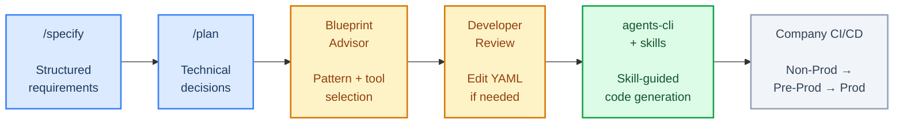
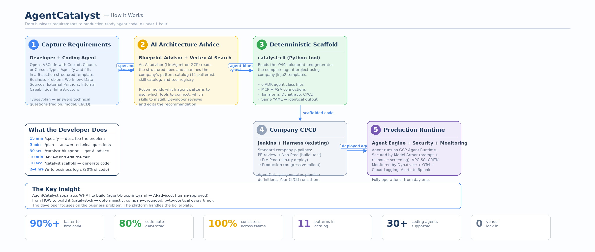
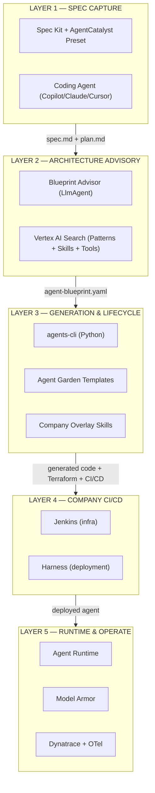
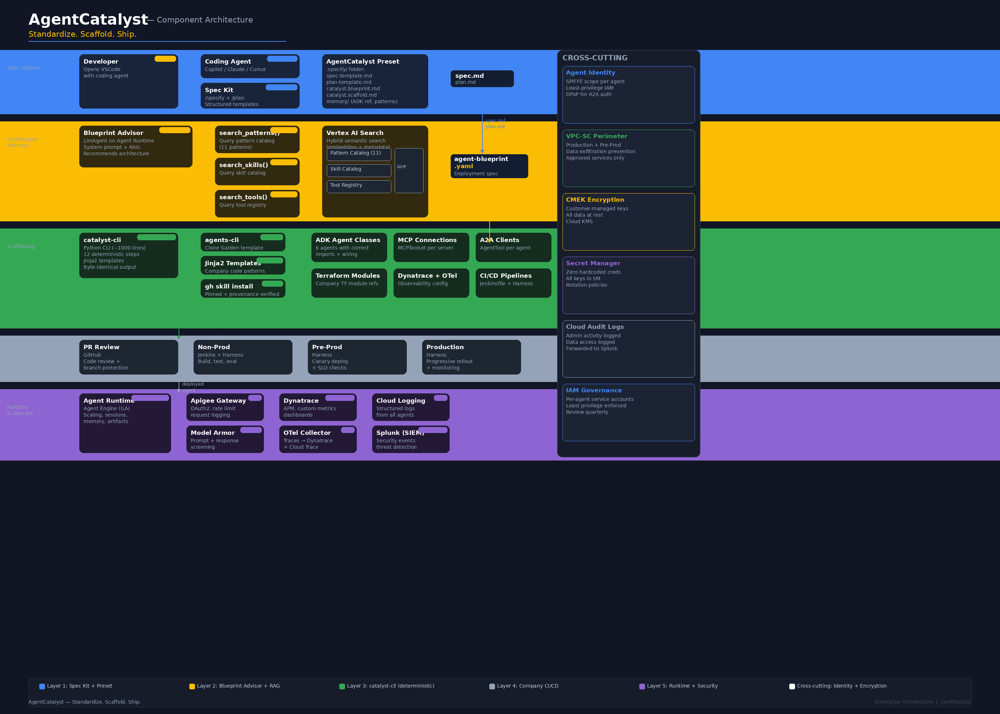
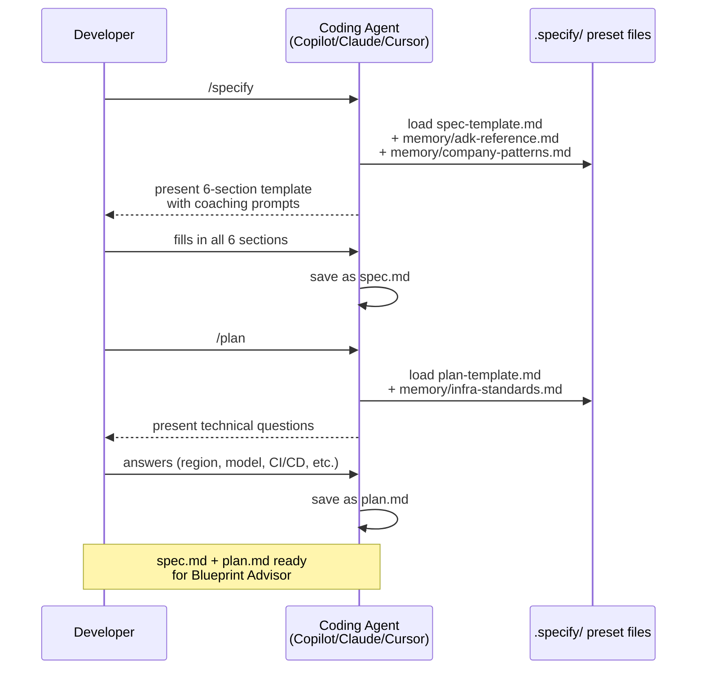
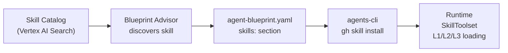
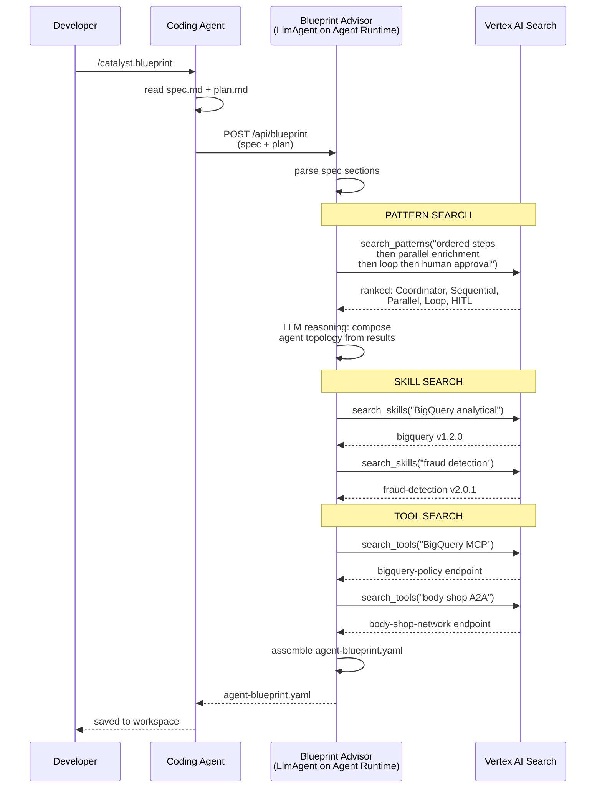
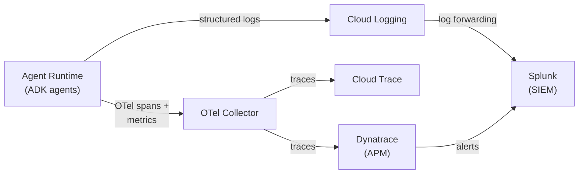
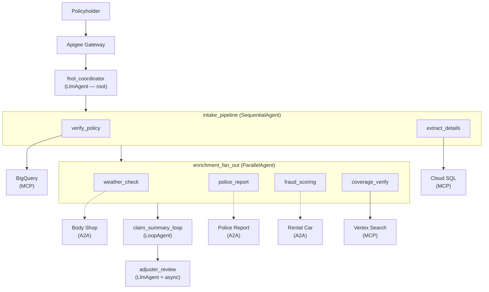

# AgentCatalyst — Standardize. Scaffold. Ship.

*A spec-driven agentic AI development accelerator on Google Cloud Platform*

---

## Executive Summary — For the SLT

### The problem

Enterprise teams building AI agents face three compounding challenges. First, requirements are expressed as vague prompts — "build me an FNOL agent" — that produce inconsistent architectures depending on who writes the prompt and which LLM interprets it. Second, every team hand-rolls its own agent infrastructure, CI/CD, and observability — creating fifty different ways to build agents, none of which follow a consistent standard. Third, the gap from idea to first committed code takes 4–6 weeks, with most of that time spent on boilerplate infrastructure, not business logic.

### The solution: AgentCatalyst

AgentCatalyst is a **spec-driven agentic AI development accelerator** that transforms structured business requirements into production-ready, fully generated agent code — grounded in company enterprise patterns and best practices.

It works in five phases:



### AgentCatalyst at a glance



*The diagram above shows the complete flow: a developer captures requirements via a structured template (Phase 1), the Blueprint Advisor recommends an architecture as a YAML file (Phase 2), the coding agent uses agents-cli skills + company overlay skills to generate the entire project (Phase 3), the company's existing CI/CD deploys it (Phase 4), and the agent runs on GCP with full security and monitoring (Phase 5). The developer's total hands-on time is under 1 hour for the 80% that's auto-generated — the remaining 20% is business logic that requires domain expertise.*

### Key principles

1. **Spec-driven, not prompt-driven.** Requirements are captured in a structured template — not free-form chat. Every developer produces the same quality of input regardless of experience level.
2. **AI-advised, human-decided.** The Blueprint Advisor recommends an architecture; the developer reviews and edits the YAML before code generation. The human is always in control.
3. **Skill-guided code generation.** The coding agent uses Google's 7 agents-cli skills + company overlay skills to generate agent code from the YAML blueprint. The skills ensure consistency with ADK best practices and company standards across all teams.
4. **Company-grounded.** Generation & Lifecycle templates embed company best practices — naming conventions, folder structure, security defaults, observability standards. The 50th agent looks like the 1st.
5. **Open tools, no vendor lock-in.** Spec Kit is GitHub open source. ADK is Google open source. agents-cli is Google open source. The YAML is a standard configuration file. Company overlay skills are the only company-specific component. No proprietary platform required.

### The ROI

| Activity | Without AgentCatalyst | With AgentCatalyst | Improvement |
|---|---|---|---|
| Requirements capture | 3–5 days (meetings + documents) | 2–4 hours (/specify template) | 90% faster |
| Architecture design | 1–2 weeks (manual research) | 30 minutes (Blueprint Advisor) | 95% faster |
| Code scaffolding | 1–2 weeks (manual ADK project setup) | 5 minutes (agents-cli scaffold) | 99% faster |
| Infrastructure as code | 3–5 days (manual Terraform) | Automatic (from YAML) | 90% faster |
| CI/CD pipeline config | 1–2 days | Automatic (from YAML) | 95% faster |
| Consistency across teams | Zero — every team is different | 100% — all agents follow company patterns | Structural |
| **Total: idea to generated code** | **4–6 weeks** | **< 1 day** | **90%+ faster** |

### Why not just use Google's tools directly?

Google ships three Agent Garden templates through `agents-cli`:

| Template | What it provides |
|---|---|
| `adk` | Single-agent starter with basic tool calling |
| `adk_a2a` | Multi-agent starter with A2A protocol support |
| `agentic_rag` | RAG agent with Vertex AI Search integration |

These templates are excellent starting points — but they solve a **different problem**. They answer: *"How do I create an ADK project?"* AgentCatalyst answers: *"How do I capture structured requirements, get AI-assisted architecture advice, and generate a complete production-ready agent with company infrastructure, security, observability, and CI/CD — in under an hour?"*

Google's templates provide the skeleton. `agents-cli` fills it with company-specific organs — proper Terraform modules, Dynatrace observability, Model Armor screening, Jenkins/Harness pipelines, and naming conventions that pass your company's code review on the first PR.

### Why now

Google Cloud Next '26 (April 2026) shipped the managed primitives AgentCatalyst depends on: Agent Runtime / Agent Engine *(GA)*, Model Armor *(GA)*, `agents-cli` with Agent Garden templates, and the official Agent Skills repository. GitHub shipped Spec Kit (open source, 30+ coding agent integrations) and `gh skill` (GitHub CLI with provenance verification). ADK reached GA stability with `SequentialAgent`, `ParallelAgent`, `LoopAgent`, `LlmAgent`, `MCPToolset`, `AgentTool`, and `SkillToolset` as production-ready classes.

Before these, building a standardized agent development accelerator required hand-rolling every layer — the framework, the runtime, the skills mechanism, the specification workflow, and the code generation pipeline. After them, the primitives exist. AgentCatalyst is the opinionated company layer that makes them work together as a paved road.

---

## Document scope and audience

This document describes the end-to-end architecture of AgentCatalyst — from structured requirements capture through fully generated agent code ready for company CI/CD. It is written for two audiences:

- **Enterprise Architecture / SLT** — Sections "Executive Summary" through "End-to-end thread" provide the strategic view: what AgentCatalyst is, why it matters, what the complete flow looks like, and what GCP services it uses. Start here.
- **Engineering teams** — Sections "Layer deep-dives" through "Worked Example" provide the technical detail: how each layer works, what `agents-cli` generates step by step, and how to build an agent from scratch with the FNOL example. Start at "End-to-end thread" then jump to the layer you're working on.

---

## End-to-end thread (read this first)

Before diving into the five layers, here is the complete flow as a narrative:

A developer is asked to build an AI agent that processes auto insurance claims (FNOL). She opens VSCode with GitHub Copilot and types `/specify`. The AgentCatalyst preset presents a structured template with six sections — Business Problem, Workflow, Data Sources, External Integrations, Internal Capabilities, and Infrastructure Requirements. She fills it in using plain English, describing the step-by-step workflow, the data systems involved, the external partner APIs, and her proprietary models. This takes about 15 minutes. The result is `spec.md` — a structured requirements document saved in her workspace.

She types `/plan` and answers a handful of technical questions — GCP region, LLM model, CI/CD tools, Terraform module source. This takes 5 minutes. The result is `plan.md`.

She types `/catalyst.blueprint`. This custom command packages her `spec.md` and `plan.md` and sends them to the Blueprint Advisor — an LlmAgent running on Agent Runtime. The Blueprint Advisor reads her spec, searches the company's pattern catalog and skill catalog in Vertex AI Search, and recommends an architecture: a Coordinator root agent with four sub-agents (Sequential intake, Parallel enrichment, Loop summary, HITL adjuster review), connected to BigQuery, Cloud SQL, and Vertex AI Search via MCP servers, with three external A2A agents for body shop, rental car, and police report services. It returns `agent-blueprint.yaml` — a deployment specification describing WHAT to build.

She reviews the YAML in her editor. The Blueprint Advisor assigned Cloud SQL to the wrong agent — she edits the YAML directly, changing `assigned_to: extract_details` to `assigned_to: fnol_coordinator`. She saves.

She types `/catalyst.generate`. The coding agent uses `agents-cli scaffold create` for the project structure, then applies Google's `google-agents-cli-adk-code` skill and company overlay skills to generate the complete project from `agent-blueprint.yaml`: 6 agent class files, 3 MCP connections, 3 A2A clients, 3 FunctionTool stubs (marked "engineer implements"), Model Armor callbacks, complete Terraform, Dynatrace observability config, and Jenkins/Harness pipeline definitions. Every file follows company coding standards because the company overlay skills encode those standards.

She opens `app/tools/severity_classifier.py` and writes the actual classification logic — the 20% that requires domain expertise. The 80% boilerplate was handled by `agents-cli`.

She commits, opens a PR, and the company's standard Jenkins/Harness pipelines take it through Non-Prod → Pre-Prod → Prod.

**Total time from "I need an FNOL agent" to generated code committed to GitHub: under 1 hour.** Without AgentCatalyst, this takes 4–6 weeks.

---

## Technology Stack — Layered Component Reference

AgentCatalyst uses a five-layer architecture. Each layer has a clear responsibility and a defined handoff to the next.



### Component architecture — detailed view



The diagram above shows every component in AgentCatalyst organized by layer. Here is what each component does and how they interact:

**Layer 1 — Spec Capture (blue):**
The developer works in VSCode with their preferred coding agent (Copilot, Claude Code, or Cursor). The coding agent loads the AgentCatalyst preset from the `.specify/` folder — this preset contains the 6-section spec template, the plan template, custom commands (`/catalyst.blueprint`, `/catalyst.generate`), and memory files with company ADK reference material and coding standards. The developer runs `/specify` to fill in the structured template and `/plan` to answer technical questions. The outputs — `spec.md` and `plan.md` — flow to Layer 2.

**Layer 2 — Architecture Advisory (amber):**
The Blueprint Advisor is an LlmAgent running on GCP Agent Runtime. It receives `spec.md` + `plan.md` and uses three RAG tools — `search_patterns()`, `search_skills()`, and `search_tools()` — to query Vertex AI Search. Vertex AI Search hosts three data stores: the Pattern Catalog (11 canonical agentic patterns with HA/DR documentation), the Skill Catalog (reusable agent skills with capability metadata), and the Tool Registry (MCP servers and A2A agents from Apigee API Hub). The Blueprint Advisor performs single-pass semantic search across these catalogs, uses its LLM reasoning (guided by a company-curated system prompt) to select the best patterns, skills, and tools, and assembles `agent-blueprint.yaml` — a deployment specification describing WHAT to build. The developer reviews and edits the YAML before proceeding.

**Layer 3 — Generation & Lifecycle (green):**
`agents-cli` is Google's unified CLI for the ADK agent development lifecycle. It ships with 7 skills that teach coding agents how to scaffold, build, evaluate, deploy, publish, and observe ADK agents. The developer instructs the coding agent to generate the project from `agent-blueprint.yaml`. The coding agent uses `agents-cli scaffold create` for the project structure, then applies `google-agents-cli-adk-code` to generate ADK agent classes, MCP connections (`MCPToolset`), A2A clients (`AgentTool`), and FunctionTool stubs from the YAML. Company overlay skills guide the generation of Terraform modules, Dynatrace + OpenTelemetry observability config, Jenkins + Harness CI/CD pipeline definitions, and Model Armor callbacks. Skills are installed via `gh skill install` at pinned versions with provenance verification. The FunctionTool stubs (shown in amber) are the ~20% the engineer writes; everything else (~80%) is generated by the coding agent guided by these skills.

**Layer 4 — Company CI/CD (gray):**
Outside AgentCatalyst's scope. The company's existing Jenkins and Harness pipelines take the generated code through the standard promotion process: PR review → Non-Prod (build, test, eval) → Pre-Prod (canary deploy, SLO checks) → Production (progressive rollout, monitoring). AgentCatalyst generated the pipeline definitions; the company's CI/CD executes them.

**Layer 5 — Runtime & Operate (purple):**
The deployed agent runs on Agent Runtime (GCP Agent Engine) — a managed runtime handling scaling, sessions, memory, and artifact storage. Apigee Runtime Gateway provides API gateway services (OAuth2, rate limiting, request logging). Model Armor screens every prompt before it reaches the LLM and every response before it reaches the user (standard prompt + response interception). Dynatrace provides APM with auto-instrumented traces, custom metrics (latency, error rate, token consumption), and dashboards. OpenTelemetry Collector forwards traces to both Dynatrace and Cloud Trace. Cloud Logging captures structured logs from all agent executions. Splunk (SIEM) aggregates security events, Cloud Audit Logs, and Dynatrace alerts for threat detection and compliance.

**Cross-cutting concerns (right panel):**
Six services span all layers: **Agent Identity** (SPIFFE scope per agent node + least-privilege IAM + DPoP for A2A auth), **VPC-SC Perimeter** (production + pre-prod enclosed, data exfiltration prevention), **CMEK Encryption** (customer-managed keys for all data at rest via Cloud KMS), **Secret Manager** (zero hardcoded credentials, rotation policies), **Cloud Audit Logs** (admin and data access logging, forwarded to Splunk), and **IAM Governance** (per-agent service accounts, least privilege enforced, quarterly review).

### Layer 1 — SPEC CAPTURE

| Component | Owner | Description |
|---|---|---|
| GitHub Spec Kit *(open source)* | GitHub | Structured specification workflow. Developer runs `/specify` and `/plan` in their coding agent. Templates guide the developer to describe their use case in a consistent format. |
| AgentCatalyst Preset | Company | Company-built preset for Spec Kit. Contains the requirements template, plan template, and custom commands (`catalyst.blueprint`, `catalyst.generate`). Installed via `specify preset add agentcatalyst`. |
| Coding Agent | Developer's choice | Any Spec Kit-compatible coding agent — GitHub Copilot, Claude Code, Gemini CLI, Cursor, Windsurf, etc. |

**Layer 1 delivers:** `spec.md` + `plan.md`

### Layer 2 — ARCHITECTURE ADVISORY

| Component | Owner | Description |
|---|---|---|
| Blueprint Advisor | Company | LlmAgent on Agent Runtime. Reads spec + plan, queries pattern/skill/tool catalogs via Vertex AI Search (single-pass semantic retrieval), generates `agent-blueprint.yaml`. Uses system prompt with company ADK best practices + RAG. |
| Pattern Catalog | Company | 11 canonical patterns documented as architectural knowledge artifacts, ingested into Vertex AI Search. |
| Skill Catalog | Company | Reusable agent skills with metadata, ingested into Vertex AI Search. |
| Tool Registry | Company/GCP | MCP servers and A2A agents registered in Apigee API Hub. |
| Vertex AI Search *(GA)* | GCP | Semantic search engine for pattern, skill, and tool discovery. Single-pass hybrid search. |

**Layer 2 delivers:** `agent-blueprint.yaml`

### Layer 3 — GENERATION & LIFECYCLE

| Component | Owner | Description |
|---|---|---|
| `agents-cli` *(Google)* | Google | Unified CLI for the full ADK agent development lifecycle — scaffold, build, eval, deploy, publish, observe. Ships with 7 bundled skills. Installed via `uvx google-agents-cli setup`. |
| 7 agents-cli Skills *(Google)* | Google | Skill documents that teach coding agents ADK patterns, scaffolding, evaluation, deployment, publishing, and observability. Compatible with Copilot, Claude Code, Gemini CLI, Cursor, Codex. |
| Company Overlay Skills | Company | 4 company-authored skills extending Google's 7: `company-terraform-patterns`, `company-observability` (Dynatrace + Splunk), `company-cicd` (Jenkins + Harness), `company-security` (Model Armor + VPC-SC + CMEK). |
| Agent Garden Templates *(GA)* | GCP | Starter templates (`adk`, `adk_a2a`, `agentic_rag`). `agents-cli scaffold create` clones the right template. |
| `gh skill install` *(GA)* | GitHub CLI | Installs agent skills at pinned versions with provenance verification. |

**Layer 3 delivers:** Complete agent codebase — ADK agents + MCP connections + A2A clients + FunctionTool stubs + Terraform + observability + CI/CD pipelines

### Layer 4 — COMPANY CI/CD (outside AgentCatalyst scope)

| Component | Owner | Description |
|---|---|---|
| Jenkins | Company | Infrastructure pipeline — Terraform plan/apply, OPA policy checks. |
| Harness | Company | Deployment pipeline — canary deployment, progressive rollout, rollback. |
| GitHub | Company | Source control — PR review, branch protection, merge policies. |

**Layer 4 delivers:** Deployed agent in Non-Prod → Pre-Prod → Prod

### Layer 5 — RUNTIME & OPERATE

| Component | Owner | Description |
|---|---|---|
| Agent Runtime (Agent Engine) *(GA)* | GCP | Managed runtime for ADK agents — scaling, session management, memory, artifact storage. |
| Apigee Runtime Gateway | GCP | API gateway for agent egress — OAuth2, rate limiting, request/response logging. |
| Model Armor *(GA)* | GCP | Prompt and response screening — injection detection, jailbreak detection, PII/PHI leakage prevention. |
| Dynatrace | Third-party | APM — OneAgent auto-instrumentation, custom metrics, dashboards. |
| OpenTelemetry Collector | Open source | Trace and metric collection, forwarding to Dynatrace + Cloud Trace + Cloud Logging. |
| Splunk | Third-party | SIEM — security event aggregation, threat detection, audit log correlation. |
| Cloud Trace + Cloud Logging | GCP | Native GCP observability. |

### Cross-cutting concerns

These services span all layers and are not specific to any single phase:

| Concern | Service | How it applies |
|---|---|---|
| **Identity** | Agent Identity (SPIFFE) + IAM | Each agent node runs under a dedicated least-privilege service account. SPIFFE provides per-agent identity scope for A2A communication. Agent Identity is provisioned via Terraform in Layer 3, enforced at Layer 5 runtime. |
| **Encryption at rest** | CMEK (Cloud KMS) | All data stores (Cloud SQL, GCS, Firestore) use Customer-Managed Encryption Keys. CMEK key ring is specified in the YAML `infrastructure.security.cmek_key_ring`. Provisioned via Terraform. |
| **Network perimeter** | VPC-SC (VPC Service Controls) | Production and pre-prod environments are enclosed in a VPC-SC perimeter. Prevents data exfiltration by restricting which services can communicate outside the perimeter. Provisioned via Terraform. |
| **Secret management** | Secret Manager | Zero hardcoded credentials in any generated code. All API keys, service account keys, and connection strings stored in Secret Manager and referenced by resource path. `agents-cli` generates Secret Manager references in all MCP connection files and A2A client files. |
| **Audit logging** | Cloud Audit Logs | All admin activity and data access logged. Forwarded to Splunk for correlation and threat detection. |

---

## Layer 1 — SPEC CAPTURE (deep dive)

### The AgentCatalyst preset

When a developer installs the AgentCatalyst preset (`specify preset add agentcatalyst`), the following files are added to their project:

```
.specify/
├── preset.yml                          ← Preset manifest
├── templates/
│   ├── spec-template.md                ← 6-section requirements template
│   ├── plan-template.md                ← Technical decisions template
│   └── tasks-template.md              ← Task breakdown template
├── commands/
│   ├── catalyst.blueprint.md           ← Sends spec+plan to Blueprint Advisor
│   └── catalyst.generate.md            ← Runs agents-cli against YAML
└── memory/
    ├── adk-reference.md                ← ADK class reference (public Google docs)
    ├── company-patterns.md             ← Company coding standards summary
    ├── approved-tools.md               ← Company-approved MCP servers and A2A agents
    └── infra-standards.md              ← Terraform module naming and pinning rules
```

**Note:** The `memory/` folder contains reference material that the coding agent loads into context during `/specify` and `/plan`. This is standard Spec Kit functionality — the memory files provide context so the coding agent can coach the developer as they fill in the template. They are NOT decision frameworks that teach the AI how to reason (that would be a different architecture). They are reference documents — the same information a developer would find in the company wiki.

### The spec template — 6 sections

```markdown
# Agent Specification

## Business Problem
<!-- Describe the business process this agent will automate.
     Who are the users? What value does it provide? -->

## Workflow
<!-- Describe the step-by-step workflow the agent should follow.
     Be specific about ordering: which steps happen first, which 
     can happen in parallel, which need human approval.
     Example: "First, verify... Then, extract... Simultaneously enrich..." -->

## Data Sources
<!-- List every data system the agent needs to access.
     For each, specify: system name, access pattern (read/write), 
     and workload type (analytical/transactional/storage/retrieval).
     Example: "BigQuery — policy data warehouse (read-only, analytical queries)" -->

## External Integrations
<!-- List any partner APIs, third-party services, or external agents
     the agent needs to communicate with.
     Specify who operates each service and how it's accessed. -->

## Internal Capabilities
<!-- List any proprietary models, internal APIs, or company-specific
     business logic the agent needs. These will become FunctionTool stubs
     that engineers implement. -->

## Infrastructure Requirements
<!-- GCP region, LLM model preference, CI/CD tools, security requirements,
     compliance constraints. -->
```

### Layer 1 sequence diagram



---

## Layer 2 — ARCHITECTURE ADVISORY (deep dive)

### Blueprint Advisor — how it works

The Blueprint Advisor is an LlmAgent deployed on Agent Runtime (GCP Agent Engine). It receives `spec.md` + `plan.md` as input and produces `agent-blueprint.yaml` as output.

#### System prompt structure

The Blueprint Advisor's intelligence comes from a well-crafted system prompt — not from separate versionable decision framework documents. The system prompt contains:

```
SYSTEM PROMPT STRUCTURE:

1. ROLE DEFINITION
   "You are the Blueprint Advisor — an AI architecture advisor for agentic 
   AI applications on Google Cloud Platform. You recommend agent architectures
   based on structured specifications."

2. COMPANY ADK BEST PRACTICES
   - Use SequentialAgent for ordered dependency chains
   - Use ParallelAgent for independent concurrent tasks
   - Use LoopAgent for iterative refinement with quality thresholds
   - Use LlmAgent + LongRunningFunctionTool for async human approval
   - Use LlmAgent as root Coordinator for multi-domain workflows
   - [Company-specific patterns: naming conventions, model preferences, etc.]

3. TOOL SELECTION HEURISTICS
   - Analytical data access → search for BigQuery-related tools
   - Transactional data access → search for Cloud SQL-related tools
   - Document retrieval → search for Vertex AI Search tools
   - Partner-operated services → recommend A2A agent connection
   - Proprietary company logic → recommend FunctionTool stub

4. OUTPUT FORMAT RULES
   - Output must be valid YAML conforming to the agent-blueprint schema
   - Every agent must have a name, type, and role
   - Every tool must have assigned_to referencing an agent name
   - Infrastructure section must be populated from plan.md

5. RAG TOOL USAGE
   - Use search_patterns() to find relevant patterns from the catalog
   - Use search_skills() to find matching skills
   - Use search_tools() to find MCP servers and A2A agents
   - Always search before recommending — do not hallucinate tool endpoints
```

**What makes this better than a developer asking Gemini directly?** Three things: (1) the system prompt embeds company-specific ADK patterns and tool selection heuristics that a developer would need to research manually; (2) the RAG tools give the Blueprint Advisor access to the company's curated catalogs rather than general internet knowledge; (3) the output is a structured YAML file that `agents-cli` can consume directly, not a prose description the developer must translate into code.

#### RAG tools

The Blueprint Advisor has three FunctionTools connected to Vertex AI Search:

| Tool | Data store | What it returns |
|---|---|---|
| `search_patterns(query)` | Pattern catalog (11 patterns) | Ranked pattern matches with applicability criteria, component descriptions, and composition guidance |
| `search_skills(query)` | Skill catalog | Matching skills with name, source, version, and capability description |
| `search_tools(query)` | Tool registry (Apigee API Hub) | MCP servers and A2A agents with endpoints, auth methods, and descriptions |

All three use single-pass semantic search with hybrid retrieval (embedding match + metadata filters). The Blueprint Advisor issues queries based on the developer's spec, reviews the results, and selects the best matches using its own LLM reasoning.

### The 11 canonical patterns

Each pattern is documented as a comprehensive architectural knowledge artifact with 8 mandatory sections:

#### Pattern documentation standard

| Section | Content |
|---|---|
| **Applicability** | When to use this pattern. Key trigger phrases from specifications. When NOT to use (anti-patterns). |
| **Component Diagram** | Mermaid component diagram showing agent topology, tool connections, data flows, and gateway points. |
| **Sequence Diagram** | Mermaid sequence diagram showing runtime execution flow: agent reasoning, tool calls, interactions. |
| **Security Considerations** | Pattern-specific security posture: identity model, data access boundaries, Model Armor screening points, VPC-SC implications. |
| **Performance & Idempotency** | Latency characteristics, token consumption profile, concurrency model, retry behavior, timeout strategy. |
| **HA/DR Views** | Four DR strategies documented per pattern, each with lifecycle behavior for initial provisioning, component failure (HA), DR failover, and DR failback. |
| **Composition Guidance** | Which patterns this pattern can compose with (parent/child). Nesting constraints. Common compositions. |
| **Search Metadata** | YAML frontmatter for Vertex AI Search ingestion: taxonomy, use_case_signals, adk_classes, complexity. |

#### HA/DR strategy matrix

Each pattern's HA/DR section documents behavior under four DR strategies:

| DR Strategy | Description | RTO | RPO |
|---|---|---|---|
| Backup & Restore | Cold recovery from backups. No standby infrastructure. | Hours | Last backup point |
| Pilot Light / On-Demand | Minimal core infrastructure always running. Scale up on failover. | 10–30 min | Near-zero |
| Pilot Light / Cold Standby | Core infrastructure running. Compute at zero. Start on failover. | 5–15 min | Near-zero |
| Warm Standby | Scaled-down replica always running. Scale up on failover. | 1–5 min | Near-zero |

**Lifecycle behaviors documented per DR strategy per pattern:**
- **Initial Provisioning** — what infrastructure is deployed in primary and DR regions at day 0
- **Component Failure (HA)** — how the pattern self-heals within a single region (auto-scaling, pod restart, session recovery)
- **DR Failover** — step-by-step failover procedure to the DR region
- **DR Failback** — step-by-step procedure to return to the primary region

This produces 4 DR strategies × 4 lifecycle behaviors = **16 HA/DR scenarios per pattern**, and **176 scenarios across all 11 patterns**.

#### Pattern catalog summary

| # | Pattern | ADK Class(es) | When to use |
|---|---|---|---|
| 1 | Sequential Pipeline | SequentialAgent | Ordered steps with dependencies |
| 2 | Parallel Fan-out | ParallelAgent | Independent tasks that can run simultaneously |
| 3 | Generator/Critic (Loop) | LoopAgent | Generate, validate, refine until quality threshold |
| 4 | ReAct (Tool Use) | LlmAgent + FunctionTool | Reasoning with external tool calls |
| 5 | Coordinator/Dispatcher | LlmAgent (root) + sub_agents | Multiple domains requiring specialist routing |
| 6 | Review & Critique | LoopAgent (generator + evaluator) | Output review against rubrics |
| 7 | Iterative Refinement | LoopAgent (programmatic exit) | Self-correction until threshold met |
| 8 | Hierarchical Decomposition | Nested Sequential + Parallel | Complex tasks broken into sub-task trees |
| 9 | Swarm | ParallelAgent (dynamic) | Large dataset processing with sharding |
| 10 | Human-in-the-Loop (HITL) | LlmAgent + LongRunningFunctionTool | Async human approval at high-risk boundaries |
| 11 | Agentic RAG | LlmAgent + Vertex AI Search | Document retrieval + reasoning |

### Skill lifecycle

Skills in AgentCatalyst follow a standard lifecycle from catalog to runtime:



1. **Catalog** — Skills are documented with metadata (name, capability description, version, source repo) and ingested into Vertex AI Search.
2. **Discovery** — Blueprint Advisor searches the catalog by capability match when analyzing the developer's spec. Skills and tools are discovered independently — the Blueprint Advisor recommends both based on the spec's Data Sources and External Integrations sections.
3. **Blueprint** — Selected skills are listed in the `skills:` section of `agent-blueprint.yaml` with source and pinned version.
4. **Installation** — `agents-cli` runs `gh skill install {source} {name}@{version}` for each skill. Provenance SHA is verified.
5. **Runtime** — Skills are loaded progressively at runtime: L1 (frontmatter, ~50 tokens) is always visible; L2 (instructions, ~500-2000 tokens) is loaded on activation; L3 (reference materials) is loaded on-demand via `load_skill_resource` tool.

### Blueprint Advisor sequence diagram



### agent-blueprint.yaml schema

The YAML output follows a fixed schema. The coding agent validates against this schema before generating code.

```yaml
metadata:
  name: string              # Agent project name (kebab-case)
  version: string           # Semantic version
  garden_template: string   # adk | adk_a2a | agentic_rag
  description: string       # Human-readable description

platform:
  gcp_project: string
  gcp_region: string
  model: string             # gemini-2.0-flash | gemini-2.0-pro
  runtime: string           # agent_engine | cloud_run

agents:                     # Array of agent definitions
  - name: string            # snake_case
    type: string            # LlmAgent | SequentialAgent | ParallelAgent | LoopAgent
    role: string            # Human-readable purpose
    sub_agents: [string]    # Child agent names (optional)
    steps: [string]         # SequentialAgent ordered steps
    branches: [string]      # ParallelAgent parallel branches
    max_iterations: int     # LoopAgent iteration limit
    exit_condition: string  # LoopAgent exit expression
    async_approval: bool    # HITL async review
    tools: [string]         # Tool names assigned to this agent

tools:
  mcp_servers:
    - name: string
      endpoint: string
      transport: string     # sse | stdio
      auth: string          # workload_identity | spiffe | api_key
      assigned_to: string   # Agent name
      purpose: string

  a2a_agents:
    - name: string
      endpoint: string
      auth: string
      assigned_to: string
      purpose: string

  function_tools:
    - name: string
      assigned_to: string
      purpose: string
      implementation: string  # always "engineer_implements"

skills:
  - name: string
    source: string          # GitHub repo path
    version: string         # Pinned version
    assigned_to: string

infrastructure:
  terraform:
    modules:
      - name: string
        source: string
        version: string
  security:
    model_armor: bool
    dlp: bool
    cmek_key_ring: string
    vpc_sc_perimeter: bool
  observability:
    dynatrace: bool
    otel_collector: bool
    cloud_trace: bool
    cloud_logging: bool
  cicd:
    jenkins:
      template: string
      parameters: object
    harness:
      template: string
      parameters: object
```

### What `agents-cli` generates vs what engineers implement

| Generated component | What agents-cli generates | Engineer effort |
|---|---|---|
| ADK agent class hierarchy | Root `LlmAgent` + typed sub-agents from `agents:` section with correct imports, class instantiation, model assignment | None — fully generated |
| MCP connections | `MCPToolset` per MCP server with endpoint, transport, auth from `tools.mcp_servers:` | None |
| A2A client connections | `AgentTool` per A2A agent from `tools.a2a_agents:` with endpoint, auth, timeout | None |
| FunctionTool stubs | Function signature + description from `tools.function_tools:` — **body is empty** | **Engineer implements business logic** |
| System prompts | Placeholder `<<< ENGINEER MUST WRITE >>>` in each agent class | **Engineer writes domain-specific prompts** |
| Skills installed | Skill directories installed via `gh skill install` at pinned versions | None |
| Model Armor callbacks | Standard prompt + response screening via Model Armor API | None (standard config) |
| Terraform modules | Company TF module references with populated variables from YAML | None |
| Dynatrace config | OneAgent config, custom metrics, dashboard-as-code JSON | None |
| OTel Collector config | Collector pipeline config forwarding to Dynatrace + Cloud Trace | None |
| CI/CD pipelines | Jenkinsfile + Harness config referencing company skills with parameters | None |
| **Summary** | **~80% of the codebase is generated** | **~20% requires engineer domain expertise** |

---

## Layer 3 — GENERATION & LIFECYCLE (deep dive)

### Google's agents-cli — the 7 bundled skills

`agents-cli` is Google's unified CLI for the full ADK agent development lifecycle. It ships with **7 skills** that teach any coding agent (Copilot, Claude Code, Gemini CLI, Cursor, Codex) how to build, evaluate, and deploy ADK agents:

| # | Skill | What it teaches the coding agent | Used by AgentCatalyst? |
|---|---|---|---|
| 1 | `google-agents-cli-workflow` | Full lifecycle (scaffold → build → evaluate → deploy → publish → observe), code preservation rules, model selection guidance, troubleshooting. Always active. | **YES** — always active |
| 2 | `google-agents-cli-adk-code` | ADK Python API reference — agents, tools, orchestration patterns, callbacks, state management. The coding agent uses this to write correct ADK code. | **YES** — core skill for code generation |
| 3 | `google-agents-cli-scaffold` | Project scaffolding commands (`scaffold create`, `scaffold enhance`, `scaffold upgrade`), template options, deployment targets, prototype-first workflow. | **YES** — creates project structure |
| 4 | `google-agents-cli-eval` | Evaluation methodology — eval metrics, evalset schema, LLM-as-judge, tool trajectory scoring, common failure causes. | **YES** — local dev evaluation before commit |
| 5 | `google-agents-cli-deploy` | Deployment workflows — Agent Runtime, Cloud Run, GKE, service accounts, rollback, production infrastructure. | **NO** — enterprise deployment goes through Jenkins + Harness pipelines, not `agents-cli deploy`. Direct deploy from a developer's machine bypasses code review, canary deployment, and promotion gates. |
| 6 | `google-agents-cli-publish` | Gemini Enterprise Agent Platform registration — making agents discoverable via Agent Cards. | **OPTIONAL** — called as a post-deployment step in Harness pipeline if the agent should be discoverable. Not used during development. |
| 7 | `google-agents-cli-observability` | Cloud Trace, prompt-response logging, BigQuery Agent Analytics, third-party integrations (AgentOps, Phoenix, MLflow), troubleshooting. | **PARTIALLY** — supplements company-observability skill. Cloud Trace setup from this skill; Dynatrace + Splunk from company skill. |

**Installation (one-time):**
```bash
uvx google-agents-cli setup
```
This installs the CLI and injects all 7 skills into the coding agent's environment.

### Company overlay skills — extending Google's 7

The 7 Google skills cover ADK best practices and GCP deployment. Company overlay skills extend them with enterprise-specific patterns:

| Company Skill | What it teaches | Replaces or extends |
|---|---|---|
| `company-terraform-patterns` | How to use company TF modules from `github.com/company/tf-modules` — module naming, version pinning, variable population, backend config. | Replaces `google-agents-cli-deploy` for infrastructure provisioning (company uses Jenkins + Terraform, not `agents-cli deploy`) |
| `company-observability` | Dynatrace OneAgent config, custom metrics, dashboard-as-code, Splunk threat rules, OTel Collector forwarding pipeline. | Extends `google-agents-cli-observability` with Dynatrace + Splunk (Google skill covers Cloud Trace only) |
| `company-cicd` | Jenkins pipeline templates (`agent-infra-plan-apply-v3`), Harness deployment templates (`agent-deploy-canary-v4`), company pipeline standards. | Replaces `google-agents-cli-deploy` for agent deployment (company uses Harness canary pipelines, not `agents-cli deploy`) |
| `company-security` | Model Armor configuration, VPC-SC perimeter setup, CMEK key ring references, Secret Manager patterns, company security standards. | Extends `google-agents-cli-scaffold` with company security defaults |

Company skills are installed alongside Google's skills:
```bash
npx skills add company/agentcatalyst-skills
```

### Enterprise lifecycle override — why the coding agent skips `agents-cli deploy`

Google's `google-agents-cli-workflow` skill teaches a default lifecycle: scaffold → build → evaluate → **deploy** → publish → observe. In that default flow, `agents-cli deploy` pushes code directly from the developer's machine to Agent Runtime or Cloud Run. This is fine for prototyping but violates enterprise governance: no code review, no Terraform-managed infrastructure, no canary deployment, no promotion gates.

AgentCatalyst overrides the deploy and publish steps with company CI/CD. The coding agent must know this. Three override layers ensure it does:

**Override Layer 1 — The `company-cicd` skill explicitly replaces `agents-cli deploy`.**

The `company-cicd` overlay skill begins with a critical instruction:

> **DO NOT use `agents-cli deploy` for any environment.** This company uses governed CI/CD pipelines for all infrastructure provisioning and agent deployment. Direct deployment from a developer's machine bypasses code review, canary deployment, and promotion gates — all of which are required by company policy. Instead, generate Jenkinsfile and harness-pipeline.yaml files.

The skill then provides the company's Jenkins template reference (`agent-infra-plan-apply-v3`), Harness template reference (`agent-deploy-canary-v4`), and exact parameter schemas. The coding agent reads this and generates pipeline definition files instead of running deploy commands.

**Override Layer 2 — The project's `GEMINI.md` instruction file reinforces the override.**

When `agents-cli scaffold create` runs, it generates a default `GEMINI.md` file. The AgentCatalyst preset replaces this with a company-specific version containing a workflow override table:

| Default agents-cli step | Company override |
|---|---|
| scaffold | ✅ Use `agents-cli scaffold create` (same) |
| build | ✅ Use `google-agents-cli-adk-code` skill (same) |
| evaluate | ✅ Use `agents-cli eval run` locally (same) |
| **deploy** | ❌ DO NOT use `agents-cli deploy`. Generate `Jenkinsfile` + `harness-pipeline.yaml` + Terraform. See `company-cicd` skill. |
| **publish** | ❌ Skip. Agent registration happens post-deployment via Harness pipeline. |
| observe | ⚠️ Use `company-observability` skill (Dynatrace + Splunk) instead of default Cloud Trace only. |

The `GEMINI.md` also states: *"When Google's agents-cli skills conflict with company overlay skills, always follow the company skill. Company skills override Google defaults for deployment, observability, security, and infrastructure."*

**Override Layer 3 — The `/catalyst.generate` command specifies the exact sequence.**

The `.specify/commands/catalyst.generate.md` file that drives the `/catalyst.generate` Spec Kit command explicitly lists the step-by-step sequence for the coding agent to follow — including which skill to activate at each step and which steps to skip:

```
Skill activation sequence (follow THIS, not the default agents-cli workflow):

 1. Read agent-blueprint.yaml from workspace
 2. Run agents-cli scaffold create (google-agents-cli-scaffold)
 3. Generate ADK agent code (google-agents-cli-adk-code)
 4. Generate MCP connections (google-agents-cli-adk-code)
 5. Generate A2A clients (google-agents-cli-adk-code)
 6. Generate FunctionTool stubs (google-agents-cli-adk-code)
 7. Install skills via gh skill install at pinned versions
 8. Generate Model Armor callbacks (company-security)
 9. Generate Terraform modules (company-terraform-patterns)
10. Generate Dynatrace + OTel config (company-observability)
11. Generate Jenkins + Harness pipelines (company-cicd)
12. Commit to GitHub and open PR

DO NOT: run agents-cli deploy, run agents-cli publish,
       generate Cloud Build config, provision any GCP resources directly
```

**Why three layers?** Redundancy. A coding agent that skips the command file might still read `GEMINI.md`. A coding agent that skips `GEMINI.md` might still read the `company-cicd` skill. With all three saying the same thing, the override is unambiguous regardless of which coding agent the developer uses.

### How code generation works

With agents-cli skills + company overlay skills installed, the coding agent generates code by interpreting the `agent-blueprint.yaml` guided by these skills. The flow:

1. **`agents-cli scaffold create`** — creates the bare project structure from the selected Garden template (deterministic)
2. **Coding agent + `google-agents-cli-adk-code` skill** — reads `agent-blueprint.yaml` and generates ADK agent classes, MCP connections, A2A clients, FunctionTool stubs (LLM-guided, skill-constrained)
3. **Coding agent + company overlay skills** — generates company-specific Terraform modules, Dynatrace config, Jenkins/Harness pipelines, Model Armor callbacks (LLM-guided, skill-constrained)
4. **`gh skill install`** — installs agent skills at pinned versions with provenance verification (deterministic)
5. **`agents-cli eval run`** — runs evaluation harness against test cases (deterministic)

**The skills constrain the LLM's output.** The coding agent doesn't invent ADK patterns from general knowledge — it follows the specific patterns documented in `google-agents-cli-adk-code`. It doesn't guess at Terraform module paths — it follows `company-terraform-patterns`. The skills act as guardrails that keep the generated code consistent with both Google's ADK standards and company enterprise patterns.

### Company skill governance

| Aspect | How it works |
|---|---|
| **Ownership** | Platform engineering team owns company overlay skills. EA team reviews content. |
| **Version control** | Skills stored in `github.com/company/agentcatalyst-skills` repo. Versioned with semver tags. |
| **Change process** | Skill changes follow standard PR review. Platform eng + EA review. |
| **ADK version updates** | When Google updates their 7 skills for a new ADK version, platform engineering reviews company overlay skills for compatibility and updates if needed. |
| **New technology support** | Adding a new observability platform: create a new company skill document, add to the skills repo. No CLI code changes needed. |
| **Testing** | Company skills include example prompts and expected outputs. CI validates that the coding agent generates code matching company patterns when guided by the skill. |

### FNOL code generation — step by step

When the developer instructs the coding agent to generate the FNOL agent from `agent-blueprint.yaml`, the coding agent uses the installed skills to produce each file:

**Step 1 — Scaffold the project structure** (deterministic):
```bash
agents-cli scaffold create fnol-agent --template adk_a2a
```
Creates the bare project with `pyproject.toml`, `app/__init__.py`, `app/agent.py` (placeholder).

**Step 2 — Generate ADK agent classes** (guided by `google-agents-cli-adk-code` skill):
The coding agent reads `agents:` from the YAML and generates one file per agent:

```python
# app/sub_agents/intake_pipeline.py
from google.adk.agents import SequentialAgent

intake_pipeline = SequentialAgent(
    name="intake_pipeline",
    sub_agents=["verify_policy", "extract_details"],
    description="Ordered intake — verify then extract",
)
```

**Step 3 — Generate MCP connections** (guided by `google-agents-cli-adk-code` skill):
```python
# app/mcp_connections/bigquery_policy.py
from google.adk.tools import MCPToolset

bigquery_policy = MCPToolset(
    name="bigquery-policy",
    connection_params={
        "endpoint": "bigquery.googleapis.com",
        "transport": "sse",
        "auth": "workload_identity",
    },
    description="Query policy data warehouse",
)
```

**Step 4 — Generate A2A clients** (guided by `google-agents-cli-adk-code` skill):
```python
# app/a2a_clients/body_shop_network.py
from google.adk.tools import AgentTool

body_shop_network = AgentTool(
    name="body-shop-network",
    endpoint="https://bodyshop.partner.com/a2a",
    auth="spiffe",
    timeout=30,
    description="Get repair estimates",
)
```

**Step 5 — Generate FunctionTool stubs** (guided by `google-agents-cli-adk-code` skill):
```python
# app/tools/severity_classifier.py — ENGINEER IMPLEMENTS BODY
from google.adk.tools import FunctionTool

def severity_classifier(claim_data: dict) -> dict:
    """Classify claim severity (low/medium/high)."""
    raise NotImplementedError("Engineer must implement")

severity_classifier_tool = FunctionTool(func=severity_classifier)
```

**Step 6 — Install skills** (deterministic via `gh skill install`):
Installs `bigquery@1.2.0` and `fraud-detection@2.0.1` with provenance verification.

**Step 7 — Generate Terraform** (guided by `company-terraform-patterns` skill):
Company TF module references with populated variables from the YAML.

**Step 8 — Generate Dynatrace + OTel config** (guided by `company-observability` skill):
OneAgent config, custom metrics, dashboard-as-code, OTel Collector pipeline.

**Step 9 — Generate CI/CD pipelines** (guided by `company-cicd` skill):
Jenkinsfile + Harness pipeline config referencing company templates.

**Step 10 — Generate Model Armor callbacks** (guided by `company-security` skill):
Standard prompt + response screening configuration.

### What's deterministic vs what's LLM-guided

| Step | Deterministic? | Why |
|---|---|---|
| 1. Scaffold project structure | ✅ Yes | `agents-cli scaffold create` — CLI command |
| 2–5. Generate ADK code | ❌ LLM-guided | Coding agent interprets YAML + skills. Functionally equivalent but not byte-identical across runs. |
| 6. Install skills | ✅ Yes | `gh skill install` — CLI command with SHA verification |
| 7–10. Generate infra + observability + CI/CD | ❌ LLM-guided | Coding agent interprets YAML + company skills |
| 11. Run local evaluation | ✅ Yes | `agents-cli eval run` — CLI command (local dev only, before commit) |
| 12. Deploy to GCP | ✅ Yes | **NOT via agents-cli** — Jenkins provisions infrastructure (Terraform), Harness deploys agent (canary pipeline). Company CI/CD handles all deployment. |

**The YAML blueprint constrains WHAT is generated. The skills constrain HOW it's expressed. The coding agent fills in the details.** Two runs produce functionally equivalent code — same agent classes, same tool wiring, same infrastructure — but variable names, comments, and code organization may vary. This is by design: it makes AgentCatalyst work with any coding agent that supports skills.

---

## Layer 4 — COMPANY CI/CD (outside AgentCatalyst scope)

AgentCatalyst generates CI/CD pipeline definitions. The company's pipelines execute them.

| Stage | Tool | What happens |
|---|---|---|
| PR Review | GitHub | Team reviews generated code + FunctionTool implementations. Standard branch protection. |
| Non-Prod | Jenkins + Harness | Terraform apply (infra), build, unit tests, integration tests, agent eval against test datasets. |
| Pre-Prod | Harness | Canary deployment (10% traffic), performance validation, SLO checks. |
| Production | Harness | Progressive rollout, monitoring, automatic rollback if SLOs violated. |

---

## Layer 5 — RUNTIME & OPERATE (deep dive)

### Observability pipeline



- **Dynatrace** provides APM: auto-instrumented traces from OneAgent, custom metrics (latency_p99, error_rate, token_consumption_per_agent, tool_call_success_rate), and pre-built dashboards per agent.
- **OpenTelemetry Collector** receives spans and metrics from the agent runtime, forwarding to both Dynatrace and Cloud Trace for dual visibility.
- **Cloud Logging** captures structured logs from every agent execution — tool calls, model calls, session events, errors — with consistent JSON format defined by `agents-cli` templates.
- **Splunk** aggregates security events, Cloud Audit Logs, and Dynatrace alerts for threat detection and audit compliance.

### Runtime security

| Layer | Service | What it protects |
|---|---|---|
| **Perimeter** | VPC-SC | Prevents data exfiltration. Agent can only communicate with approved services inside the perimeter. |
| **API Gateway** | Apigee Runtime Gateway | OAuth2 verification on every inbound request. Rate limiting per consumer. Request/response logging. |
| **Content Safety** | Model Armor | Screens every prompt before it reaches the LLM and every response before it reaches the user. Catches injection attacks, jailbreak attempts, and PII/PHI leakage. Standard Google integration — prompt interception + response interception. |
| **Data** | CMEK + Secret Manager | All data encrypted at rest with customer-managed keys. All credentials in Secret Manager, never in code. |
| **Identity** | Agent Identity (SPIFFE) + IAM | Per-agent service accounts with least privilege. SPIFFE identity scope for A2A authentication. |

### Agent Sessions and state management

Agent Runtime (Agent Engine) provides built-in session management:
- **Session persistence** — conversation context survives pod restarts via configurable session backends (in-memory, Cloud Firestore, Cloud Spanner)
- **Memory service** — long-term memory across sessions (Cloud Firestore or custom)
- **Artifact service** — binary artifact storage for agent-generated files (Cloud Storage or custom)

Session backend is configurable in the YAML via `platform.runtime` — when set to `agent_engine`, Agent Runtime handles session management automatically.

---

## Reading the diagrams as one story

Start at **Layer 1** where the developer runs `/specify` and fills in the structured template. The coding agent saves `spec.md`. The developer runs `/plan` and answers technical questions. The coding agent saves `plan.md`.

Flow to **Layer 2** where the developer runs `/catalyst.blueprint`. The coding agent sends `spec.md` + `plan.md` to the Blueprint Advisor on Agent Runtime. The Blueprint Advisor queries Vertex AI Search three times — patterns, skills, tools — and assembles `agent-blueprint.yaml`. The developer reviews and edits the YAML.

Flow to **Layer 3** where the developer instructs the coding agent to generate the project. The coding agent runs `agents-cli scaffold create` for the project structure, then uses Google's `google-agents-cli-adk-code` skill to generate ADK agent classes, MCP connections, A2A clients, and FunctionTool stubs from the YAML. Company overlay skills guide the generation of Terraform modules, Dynatrace config, and CI/CD pipeline definitions. The developer runs `agents-cli eval run` locally to validate before committing.

Flow to **Layer 4** where the developer commits and opens a PR. The company's Jenkins pipeline runs Terraform to provision infrastructure. The company's Harness pipeline deploys the agent through Non-Prod → Pre-Prod → Prod with canary deployment and SLO validation. **`agents-cli deploy` is not used** — all deployment goes through the company's governed CI/CD pipelines.

Flow to **Layer 4** where the developer commits, opens a PR, and the company's Jenkins/Harness pipelines take the code through Non-Prod → Pre-Prod → Prod.

Flow to **Layer 5** where the deployed agent runs on Agent Runtime, screened by Model Armor, monitored by Dynatrace + OTel + Cloud Logging, secured by VPC-SC + CMEK + Agent Identity.

The complete journey — from "I need an FNOL agent" to a deployed, monitored, secured agent in production — follows a **paved road**. Every team takes the same road. Every agent looks the same to the CISO, the platform team, and the operations team.

---

## Worked Example — First Notice of Loss (FNOL) Agent

### FNOL component architecture



### Step-by-step walkthrough

**Step 1:** Developer runs `/specify`, fills in the 6-section template describing the FNOL workflow. Saves as `spec.md`. (~15 min)

**Step 2:** Developer runs `/plan`, answers technical questions. Saves as `plan.md`. (~5 min)

**Step 3:** Developer runs `/catalyst.blueprint`. Blueprint Advisor returns `agent-blueprint.yaml` with: 5 agents (Coordinator + Sequential + Parallel + Loop + HITL), 3 MCP servers, 3 A2A agents, 3 FunctionTool stubs, 2 skills, full infrastructure config. (~30 sec)

**Step 4:** Developer reviews YAML, makes minor edits. (~10 min)

**Step 5:** Developer runs `/catalyst.generate`. The coding agent uses `agents-cli scaffold create` for the project structure, then applies agents-cli skills + company overlay skills to generate the complete project:

```
fnol-agent/
├── app/
│   ├── agent.py                          ← Root LlmAgent
│   ├── sub_agents/
│   │   ├── intake_pipeline.py            ← SequentialAgent
│   │   ├── enrichment_fan_out.py         ← ParallelAgent
│   │   ├── claim_summary_loop.py         ← LoopAgent
│   │   └── adjuster_review.py            ← HITL agent
│   ├── mcp_connections/
│   │   ├── bigquery_policy.py
│   │   ├── cloud_sql_claims.py
│   │   └── vertex_search_policies.py
│   ├── a2a_clients/
│   │   ├── body_shop_network.py
│   │   ├── rental_car_service.py
│   │   └── police_report_service.py
│   ├── tools/
│   │   ├── severity_classifier.py        ← ENGINEER IMPLEMENTS
│   │   ├── coverage_calculator.py        ← ENGINEER IMPLEMENTS
│   │   └── notification_sender.py        ← ENGINEER IMPLEMENTS
│   ├── callbacks/
│   │   └── model_armor.py                ← Standard screening
│   └── skills/
│       ├── bigquery/
│       └── fraud-detection/
├── deployment/terraform/
├── observability/
│   ├── dynatrace/
│   └── otel/
├── ci-cd/
│   ├── Jenkinsfile
│   └── harness-pipeline.yaml
├── pyproject.toml
├── README.md
└── agent-blueprint.yaml
```

**Step 6:** Developer implements FunctionTool stubs and writes system prompts. (~2–4 hours)

**Step 7:** Developer commits, opens PR, CI/CD deploys. Standard process.

**Total: ~40 minutes to generated code + 2–4 hours of business logic = under 1 day.**

---

## Production Readiness Checklist

Before rolling out AgentCatalyst to all agent development teams:

| # | Readiness criteria | Owner | Status |
|---|---|---|---|
| 1 | 11 pattern documents authored with all 8 sections + 176 HA/DR scenarios | EA team | |
| 2 | Pattern catalog ingested into Vertex AI Search with validated search quality | Platform eng | |
| 3 | Skill catalog populated with company skills (BigQuery, Cloud SQL, fraud detection, etc.) | EA team | |
| 4 | Tool registry populated in Apigee API Hub (MCP servers + A2A agents) | Platform eng | |
| 5 | Blueprint Advisor deployed on Agent Runtime (dev + staging + prod) | Platform eng | |
| 6 | Blueprint Advisor system prompt reviewed and approved by EA | EA team | |
| 7 | `agents-cli` templates authored, reviewed, and snapshot-tested | Platform eng | |
| 8 | `agents-cli` published to internal PyPI | Platform eng | |
| 9 | AgentCatalyst Spec Kit preset published to internal preset catalog | EA team | |
| 10 | FNOL pilot completed end-to-end (spec → scaffold → deploy) | Pilot team | |
| 11 | Developer documentation and onboarding guide published | EA team | |
| 12 | `agents-cli` template governance process documented and approved | Platform eng + EA | |

---

## Governance Model

### Who owns what

| Component | Owner | Update process |
|---|---|---|
| Pattern catalog (11 patterns) | Enterprise Architecture | EA authors and reviews. Changes via PR to pattern catalog repo. Vertex AI Search re-ingested on merge. |
| Skill catalog | EA + domain teams | Domain teams author skills. EA reviews and approves for catalog inclusion. Skills ingested into Vertex AI Search. |
| Tool registry | Platform engineering | MCP servers and A2A agents registered in Apigee API Hub. Platform eng validates endpoints and auth. |
| Blueprint Advisor system prompt | EA + Platform eng | Joint ownership. System prompt changes reviewed by both EA (for accuracy) and platform eng (for behavior). |
| Company overlay skills | Platform engineering | Platform eng maintains 4 company skills. Changes via PR with review by EA. Skills tested with example prompts to verify consistent output. |
| AgentCatalyst preset | EA | EA maintains preset files (templates, commands, memory). Published to internal preset catalog. |
| Agent development standards | EA | Published as company coding standards. Referenced in `agents-cli` validation (Step 12). |

### How to request changes

| Request | Process |
|---|---|
| "I need a new pattern in the catalog" | Open a request with EA. EA evaluates, documents the pattern (8 sections), and adds to catalog. |
| "agents-cli doesn't support technology X" | Platform engineering authors a new company overlay skill for the technology. No CLI code changes needed — just a new skill document in the company skills repo. |
| "The Blueprint Advisor recommends the wrong pattern for my use case" | Report to EA. They review the pattern catalog's applicability criteria and search metadata. May refine the pattern documentation to improve search relevance. |
| "I need a new skill in the catalog" | Author the skill following company skill standards. Submit to EA for review. EA adds to catalog on approval. |

---

## What AgentCatalyst is NOT

| What it IS | What it is NOT |
|---|---|
| A development accelerator — speeds up the path from idea to generated code | A runtime platform — it generates code; the code runs on Agent Engine |
| AI-advised architecture — Blueprint Advisor recommends; developer decides | AI-decided architecture — the developer always has final say |
| Skill-guided code generation — agents-cli skills + company skills ensure consistency | A proprietary code generator — uses Google's open-source agents-cli |
| Company-grounded — templates embed company patterns | Generic — every company's templates are different |
| Open tools — Spec Kit + ADK + agents-cli + YAML + company skills | Proprietary platform — no vendor lock-in |
| A spec-driven workflow with structured templates | A conversational workflow — no free-form chat |
| An internal development tool | A marketplace product — this is for internal use only |

---

## Conclusion — The Road Ahead

AgentCatalyst gives every development team a standardized, AI-assisted path from business requirements to production-ready agent code. The developer describes their problem in a structured template. The Blueprint Advisor recommends an architecture. The coding agent, guided by Google's agents-cli skills and company overlay skills, generates the complete project — grounded in company patterns, ready for the company's CI/CD.

The 50th agent generated through AgentCatalyst follows the same company patterns as the 1st. Naming conventions are consistent. Terraform modules are pinned. Observability is pre-configured. CI/CD pipelines use approved templates. The team's code review time drops because every generated project looks familiar.

**Next steps:**
1. Build the 11-pattern knowledge base (8 sections + 176 HA/DR scenarios per pattern) and ingest into Vertex AI Search
2. Deploy the Blueprint Advisor on Agent Runtime with company-curated system prompt
3. Author 4 company overlay skills (Terraform patterns, observability, CI/CD, security) and publish to company skills repo
4. Create the AgentCatalyst Spec Kit preset and publish internally
5. Pilot with the FNOL use case end-to-end
6. Establish governance: pattern catalog ownership, template change process, skill approval workflow
7. Roll out to all agent development teams with developer guide and onboarding sessions

---

## Appendix A — AgentCatalyst Preset (Complete Code)

This appendix contains the full source of every file in the AgentCatalyst Spec Kit preset. When a developer runs `specify preset add agentcatalyst`, these files are installed into their project's `.specify/` folder.

### Directory structure

```
.specify/
├── preset.yml
├── templates/
│   ├── spec-template.md
│   ├── plan-template.md
│   ├── tasks-template.md
│   └── gemini-md-template.md         ← Replaces default GEMINI.md with company workflow override
├── commands/
│   ├── catalyst.blueprint.md
│   └── catalyst.generate.md
└── memory/
    ├── adk-reference.md
    ├── company-patterns.md
    ├── approved-tools.md
    └── infra-standards.md
```

---

### preset.yml

```yaml
# AgentCatalyst Preset for GitHub Spec Kit
# Install: specify preset add agentcatalyst
# Source: github.com/[company]/agentcatalyst-preset

name: agentcatalyst
version: "1.0.0"
description: >
  AgentCatalyst enterprise agent development accelerator.
  Structured requirements capture, AI-assisted architecture advice
  via Blueprint Advisor, and skill-guided code generation via agents-cli.

templates:
  spec: templates/spec-template.md
  plan: templates/plan-template.md
  tasks: templates/tasks-template.md

commands:
  - commands/catalyst.blueprint.md
  - commands/catalyst.generate.md

memory:
  - memory/adk-reference.md
  - memory/company-patterns.md
  - memory/approved-tools.md
  - memory/infra-standards.md

settings:
  coding_agents:
    - copilot
    - claude-code
    - gemini-cli
    - cursor
    - windsurf
  output_format: markdown
  save_location: workspace_root
```

---

### templates/spec-template.md

```markdown
---
template: agentcatalyst-spec
version: "1.0.0"
description: Structured requirements template for agentic AI applications
usage: Run /specify to fill in this template with your coding agent
---

# Agent Specification

## Business Problem

<!-- 
WHAT TO WRITE HERE:
Describe the business process this agent will automate. Be specific about:
- Who are the end users? (e.g., policyholders, customer service reps, analysts)
- What is the current pain point? (e.g., manual processing takes 3 days)
- What business value does automation provide? (e.g., reduce processing time to minutes)
- What is the scope boundary? (e.g., handles first notice only, not full claim lifecycle)

EXAMPLE:
"We need an AI agent that handles First Notice of Loss (FNOL) for auto insurance.
When a policyholder reports an accident via phone or web, the agent should verify
their policy, collect incident details, assess severity, and either auto-approve
low-severity claims or route high-severity ones to a human adjuster. Currently
this process takes 3-5 days manually. The agent should reduce it to under 1 hour."
-->

[Describe your business problem here]

## Workflow

<!--
WHAT TO WRITE HERE:
Describe the step-by-step workflow the agent should follow. Be specific about:
- ORDERING: Which steps happen first, second, third? Use words like "First,"
  "Then," "After that," "Finally" for sequential steps.
- PARALLELISM: Which steps can happen at the same time? Use words like
  "Simultaneously," "In parallel," "At the same time" for concurrent steps.
- CONDITIONS: Are there decision points? Use "If [condition], then [action]"
- HUMAN REVIEW: Does a human need to approve anything? Use "Route to [role]
  for review" or "Requires human approval"
- ITERATION: Does anything need to repeat? Use "Generate... validate...
  refine until [threshold]"

EXAMPLE:
"1. First, verify the policyholder's identity and active coverage by querying
    our BigQuery policy data warehouse.
 2. Then, extract structured incident details from the caller's description.
 3. After extraction, simultaneously enrich with four external data sources:
    weather conditions, police report, fraud risk score, and coverage details.
 4. Generate a claim summary, validate it against our quality rubric, and
    refine until the quality score exceeds 0.85.
 5. If the severity is high or the fraud score exceeds 0.7, route to a
    human adjuster for review and approval."
-->

[Describe your workflow step by step here]

## Data Sources

<!--
WHAT TO WRITE HERE:
List every data system the agent needs to access. For each, specify:
- System name (e.g., BigQuery, Cloud SQL, Vertex AI Search)
- Access pattern: read-only or read-write?
- Workload type: analytical (complex queries, aggregations) or 
  transactional (single-row CRUD operations) or storage (file upload/download)
  or retrieval (document search, RAG)?

EXAMPLE:
"- BigQuery: policy data warehouse (read-only, analytical queries —
   aggregate coverage data, policy history lookups)
 - Cloud SQL: claims database (read-write, transactional — create new
   claim records, update claim status)
 - Vertex AI Search: policy document corpus (read-only, retrieval —
   search policy documents for coverage questions)"
-->

[List your data sources here]

## External Integrations

<!--
WHAT TO WRITE HERE:
List any partner APIs, third-party services, or external agents the agent
needs to communicate with. For each, specify:
- Who operates the service? (the key question — is it yours or theirs?)
- How is it accessed? (REST API, A2A agent protocol, webhook, etc.)
- What does the agent need from it?

EXAMPLE:
"- Body shop repair network — they operate their own quoting service.
   We send vehicle details, they return repair estimates.
 - Rental car provider — they operate their own availability API.
   We send dates and location, they return options.
 - Police report service — municipal system, we don't control it.
   We send incident ID, they return the report."
-->

[List your external integrations here]

## Internal Capabilities

<!--
WHAT TO WRITE HERE:
List any proprietary models, internal APIs, or company-specific business
logic the agent needs. These will become FunctionTool stubs that engineers
implement with actual business logic.

EXAMPLE:
"- Our proprietary fraud detection model (takes claim data, returns
   fraud probability score 0.0-1.0)
 - Our proprietary severity classification algorithm (takes incident
   details, returns low/medium/high severity)
 - Claim notification service (sends acknowledgment emails and SMS)"
-->

[List your internal capabilities here]

## Infrastructure Requirements

<!--
WHAT TO WRITE HERE:
Specify the deployment and operational requirements:
- GCP region (e.g., us-central1)
- LLM model preference (e.g., gemini-2.0-flash, gemini-2.0-pro)
- CI/CD tools (e.g., Jenkins for infra, Harness for deployment)
- Security requirements (e.g., Model Armor, DLP, CMEK, VPC-SC)
- Compliance constraints (e.g., PII masking, audit logging, data residency)

EXAMPLE:
"- Region: us-central1
 - Model: gemini-2.0-flash (latency-sensitive workflow)
 - CI/CD: Jenkins for infrastructure provisioning, Harness for deployment
 - Security: Model Armor enabled, DLP for PII detection, CMEK for
   encryption at rest, VPC-SC perimeter around production
 - Compliance: All claim decisions must be auditable, PII masked in logs,
   state insurance regulations require acknowledgment within 24 hours"
-->

[Specify your infrastructure requirements here]
```

---

### templates/plan-template.md

```markdown
---
template: agentcatalyst-plan
version: "1.0.0"
description: Technical decisions template mapping to agent-blueprint.yaml fields
usage: Run /plan to answer these technical questions
---

# Technical Plan

## Target Platform

<!-- Which GCP runtime will host the agent? -->
- **Runtime:** [agent_engine | cloud_run]
- **GCP Project:** [project-id]
- **GCP Region:** [e.g., us-central1]

## Model Selection

<!-- Which LLM will the agent use? -->
- **Primary model:** [e.g., gemini-2.0-flash]
- **Reasoning model (if different):** [e.g., gemini-2.0-pro for complex steps]

## Agent Garden Template

<!-- Which starter template to clone? -->
- **Template:** [adk | adk_a2a | agentic_rag]

## Infrastructure

<!-- Where do your Terraform modules live? -->
- **Terraform module source:** [e.g., github.com/company/tf-modules]
- **Module version pinning strategy:** [e.g., exact version tags like v3.1.0]

## CI/CD

<!-- Which pipeline tools does your team use? -->
- **Infrastructure pipeline:** [e.g., Jenkins — template: agent-infra-plan-apply-v3]
- **Deployment pipeline:** [e.g., Harness — template: agent-deploy-canary-v4]

## Security

<!-- Which security controls are required? -->
- **Model Armor:** [yes | no]
- **DLP:** [yes | no]
- **CMEK:** [yes | no — if yes, key ring path]
- **VPC-SC perimeter:** [yes | no]

## Observability

<!-- Which monitoring tools are in use? -->
- **Dynatrace:** [yes | no]
- **OpenTelemetry Collector:** [yes | no]
- **Cloud Trace:** [yes | no]
- **Cloud Logging:** [yes | no]
- **Splunk forwarding:** [yes | no]

## Additional Constraints

<!-- Any other technical requirements or constraints? -->
[List any additional constraints here]
```

---

### templates/tasks-template.md

```markdown
---
template: agentcatalyst-tasks
version: "1.0.0"
description: Task breakdown template separating generated vs engineer-implemented work
usage: Run /tasks after receiving agent-blueprint.yaml to generate the task list
---

# Task Breakdown

## Auto-generated by agents-cli (engineer does nothing)

<!-- agents-cli generates these from agent-blueprint.yaml -->

| Component | Source (YAML section) | Status |
|---|---|---|
| ADK agent class hierarchy | agents: | ⬜ Will be generated |
| MCP server connections | tools.mcp_servers: | ⬜ Will be generated |
| A2A agent client connections | tools.a2a_agents: | ⬜ Will be generated |
| Skills installed + wired | skills: | ⬜ Will be generated |
| Model Armor callbacks | infrastructure.security | ⬜ Will be generated |
| Terraform modules | infrastructure.terraform | ⬜ Will be generated |
| Dynatrace + OTel config | infrastructure.observability | ⬜ Will be generated |
| CI/CD pipeline definitions | infrastructure.cicd | ⬜ Will be generated |

## Engineer implements (business logic — the 20%)

<!-- These require domain expertise the scaffold cannot provide -->

| Component | What to implement | Priority |
|---|---|---|
| System prompts | Write agent personality + instructions for each agent node | P0 — agents won't work without prompts |
| FunctionTool bodies | Implement business logic inside each stub | P0 — core functionality |
| Test data | Create test cases and evaluation datasets | P1 — needed before CI/CD |
| Domain guardrails | Add business-specific validation rules beyond Model Armor | P2 — hardening |
```

---

### commands/catalyst.blueprint.md

```markdown
---
name: catalyst.blueprint
description: Submit spec + plan to the Blueprint Advisor and receive an agent-blueprint.yaml
---

# Generate Architecture Blueprint

Submit the structured specification and technical plan to the Blueprint Advisor
for AI-assisted architecture recommendations.

## Prerequisites

- `spec.md` exists in the workspace root (generated by /specify)
- `plan.md` exists in the workspace root (generated by /plan)
- Blueprint Advisor API endpoint is configured in environment variable
  `CATALYST_BLUEPRINT_API` or in `.specify/config.yaml`

## Steps

1. Read `spec.md` from the workspace root
2. Read `plan.md` from the workspace root
3. Validate both files are non-empty and contain the required sections
4. Submit to the Blueprint Advisor API:
   ```
   POST $CATALYST_BLUEPRINT_API/api/blueprint
   Content-Type: application/json
   
   {
     "spec": "<contents of spec.md>",
     "plan": "<contents of plan.md>"
   }
   ```
5. Receive `agent-blueprint.yaml` from the response
6. Save `agent-blueprint.yaml` to the workspace root
7. Display a summary of the recommended architecture:
   - Number of agents and their types
   - Number of MCP servers, A2A agents, and FunctionTool stubs
   - Infrastructure summary (Terraform modules, CI/CD templates)
8. Remind the developer: "Review the YAML and edit any field before
   running /catalyst.generate. The Blueprint Advisor recommends —
   you decide."

## Error Handling

- If `spec.md` or `plan.md` is missing: prompt the developer to run
  /specify and /plan first
- If the Blueprint Advisor API is unreachable: display connection error
  and suggest checking the API endpoint configuration
- If the response is invalid YAML: display the raw response and suggest
  the developer contact the platform engineering team
```

---

### commands/catalyst.generate.md

```markdown
---
name: catalyst.generate
description: Generate a complete agent project from agent-blueprint.yaml using agents-cli + skills
---

# Generate Agent from Blueprint

Use agents-cli and its skills to generate a complete, production-ready agent
project from the agent-blueprint.yaml in the current workspace.

## CRITICAL: Lifecycle Override

This command follows the AgentCatalyst enterprise lifecycle — NOT the
default agents-cli workflow. The key differences:

- DO NOT run `agents-cli deploy` — company uses Jenkins + Harness
- DO NOT run `agents-cli publish` — agent registration is post-deployment
- DO NOT generate Cloud Build config — company uses Jenkins
- DO NOT provision any GCP resources directly from the developer machine
- For deployment, GENERATE Jenkinsfile + harness-pipeline.yaml files
  using the `company-cicd` skill
- For infrastructure, GENERATE Terraform files using the
  `company-terraform-patterns` skill
- For observability, GENERATE Dynatrace + OTel config using the
  `company-observability` skill (not just Cloud Trace)

When Google's agents-cli skills conflict with company overlay skills,
ALWAYS follow the company skill.

## Prerequisites

- `agent-blueprint.yaml` exists in the workspace root
  (generated by /catalyst.blueprint or created manually)
- `agents-cli` is installed (`uvx google-agents-cli setup`)
- Google's 7 agents-cli skills are installed and visible
- Company overlay skills are installed (`npx skills add company/agentcatalyst-skills`)
- `gh` CLI is installed with skill extension (for skill installation)

## Skill Activation Sequence

Follow THIS sequence — not the default agents-cli workflow:

| Step | Action | Skill to activate |
|---|---|---|
| 1 | Locate and validate `agent-blueprint.yaml` | (none — schema validation) |
| 2 | Scaffold project structure | `google-agents-cli-scaffold` → `agents-cli scaffold create` |
| 3 | Generate ADK agent classes from `agents:` | `google-agents-cli-adk-code` |
| 4 | Generate MCP connections from `tools.mcp_servers:` | `google-agents-cli-adk-code` |
| 5 | Generate A2A clients from `tools.a2a_agents:` | `google-agents-cli-adk-code` |
| 6 | Generate FunctionTool stubs from `tools.function_tools:` | `google-agents-cli-adk-code` |
| 7 | Install skills from `skills:` | `gh skill install` at pinned versions |
| 8 | Generate Model Armor callbacks | `company-security` |
| 9 | Generate Terraform modules from `infrastructure.terraform:` | `company-terraform-patterns` |
| 10 | Generate Dynatrace + OTel config from `infrastructure.observability:` | `company-observability` |
| 11 | Generate Jenkins + Harness pipelines from `infrastructure.cicd:` | `company-cicd` |
| 12 | Replace GEMINI.md with company version | (use template from preset) |

After generation:
- Report total files generated
- Report files requiring engineer implementation (FunctionTool stubs)
- Report any warnings
- Open `app/agent.py` for the developer to review

## Error Handling

- If `agent-blueprint.yaml` is missing: prompt the developer to run
  /catalyst.blueprint first
- If `agents-cli` is not installed: display `uvx google-agents-cli setup`
- If company skills are not installed: display `npx skills add company/agentcatalyst-skills`
- If YAML validation fails: display specific errors and fields to fix
- If skill installation fails provenance check: display the mismatched
  SHA and warn that the skill may have been tampered with
```

---

### memory/adk-reference.md

```markdown
---
role: reference
description: Google ADK class reference for agent development
source: Google ADK documentation (public)
---

# ADK Agent Classes — Quick Reference

## Agent Types

| Class | When to use | Key parameters |
|---|---|---|
| `LlmAgent` | Single reasoning agent with tools. Also used as root Coordinator. | `name`, `model`, `tools`, `sub_agents`, `system_instruction` |
| `SequentialAgent` | Ordered pipeline — each step receives output of previous. | `name`, `sub_agents` (executed in order) |
| `ParallelAgent` | Concurrent execution — independent tasks run simultaneously. | `name`, `sub_agents` (executed in parallel) |
| `LoopAgent` | Iterative refinement — repeats until exit condition or max iterations. | `name`, `sub_agents`, `max_iterations` |

## Tool Types

| Class | When to use | Key parameters |
|---|---|---|
| `FunctionTool` | Wrap a Python function as an agent tool. | `func` (the Python function) |
| `MCPToolset` | Connect to an MCP server for external tool access. | `connection_params` (endpoint, transport, auth) |
| `AgentTool` | Connect to an external A2A agent. | `agent` (endpoint, auth, timeout) |
| `SkillToolset` | Load and use installed skills with progressive disclosure. | `skill_path`, includes `load_skill_resource` |
| `LongRunningFunctionTool` | Async human approval — pauses execution until human responds. | `func` (returns pending, resumes on callback) |

## Common Imports

```python
from google.adk.agents import LlmAgent, SequentialAgent, ParallelAgent, LoopAgent
from google.adk.tools import FunctionTool, MCPToolset, AgentTool, SkillToolset
from google.adk.tools import LongRunningFunctionTool
```

## Session and Memory

- `InMemorySessionService` — development/testing only
- `FirestoreSessionService` — production session persistence
- `SpannerSessionService` — high-scale session persistence
- Memory and artifacts configured via Agent Runtime settings
```

---

### memory/company-patterns.md

```markdown
---
role: reference
description: Company coding standards for agent development
source: Enterprise Architecture team
---

# Company Agent Development Standards

## Naming Conventions

- Agent names: `snake_case` (e.g., `intake_pipeline`, `enrichment_fan_out`)
- Tool names: `kebab-case` (e.g., `bigquery-policy`, `cloud-sql-claims`)
- Project names: `kebab-case` (e.g., `fnol-coordinator`, `loan-origination`)
- File names: `snake_case.py` matching the agent/tool name

## Project Structure

All agent projects MUST follow this folder structure:

```
{project-name}/
├── app/
│   ├── agent.py                  ← Root agent
│   ├── sub_agents/               ← One file per sub-agent
│   ├── mcp_connections/          ← One file per MCP server
│   ├── a2a_clients/              ← One file per A2A agent
│   ├── tools/                    ← One file per FunctionTool
│   ├── callbacks/                ← Model Armor + tool callbacks
│   └── skills/                   ← Installed skills
├── deployment/terraform/         ← Infrastructure as code
├── observability/                ← Dynatrace + OTel config
├── ci-cd/                        ← Pipeline definitions
├── pyproject.toml
├── README.md
└── agent-blueprint.yaml          ← The blueprint that generated this project
```

## Code Standards

- Every generated file includes a header comment:
  `# GENERATED by agents-cli — DO NOT EDIT MANUALLY`
- FunctionTool stubs include:
  `raise NotImplementedError("Engineer must implement")`
- System prompt placeholders marked: `<<< ENGINEER MUST WRITE >>>`
- Zero hardcoded credentials — all secrets via Secret Manager
- All MCP connections specify transport and auth explicitly
- All A2A connections have 30-second timeout default
```

---

### memory/approved-tools.md

```markdown
---
role: reference
description: Company-approved MCP servers and A2A agents
source: Platform Engineering team
updated: 2026-05-01
---

# Approved Tools Registry

## MCP Servers (approved for production use)

| Name | Endpoint | Transport | Auth | Owner |
|---|---|---|---|---|
| bigquery-mcp | bigquery.googleapis.com | sse | workload_identity | GCP Managed |
| cloud-sql-mcp | cloudsql-mcp.internal:8080 | sse | workload_identity | Platform Eng |
| vertex-search-mcp | vertexai-search.googleapis.com | sse | workload_identity | GCP Managed |
| gcs-mcp | storage.googleapis.com | sse | workload_identity | GCP Managed |
| weather-api-mcp | weather-api.internal:8080 | sse | api_key | Data Eng |

## A2A Agents (approved for production use)

| Name | Endpoint | Auth | Owner | Domain |
|---|---|---|---|---|
| body-shop-network | https://bodyshop.partner.com/a2a | spiffe | Partner | Insurance |
| rental-car-service | https://rental.partner.com/a2a | spiffe | Partner | Insurance |
| credit-bureau | https://credit.partner.com/a2a | mutual_tls | Partner | Finance |

## Requesting New Tools

To request a new MCP server or A2A agent be added to the approved list:
1. Open a request in the Platform Engineering JIRA project
2. Provide: tool name, endpoint, auth method, owner, and business justification
3. Platform Engineering will validate the endpoint, security posture, and SLA
4. Upon approval, the tool is added to this list and to Apigee API Hub
```

---

### memory/infra-standards.md

```markdown
---
role: reference
description: Company Terraform module and infrastructure standards
source: Platform Engineering team
updated: 2026-05-01
---

# Infrastructure Standards

## Terraform Module Registry

All agent infrastructure MUST use company-approved Terraform modules.
Do NOT write raw Terraform resources — use module references.

| Module | Source | Current Version | Purpose |
|---|---|---|---|
| agent-runtime | github.com/company/tf-modules//agent-runtime | v3.1.0 | Agent Engine provisioning |
| cloud-sql | github.com/company/tf-modules//cloud-sql | v2.4.0 | Cloud SQL instances |
| vpc-sc | github.com/company/tf-modules//vpc-sc | v1.8.0 | VPC Service Controls perimeter |
| cmek | github.com/company/tf-modules//cmek | v1.2.0 | KMS key ring + crypto keys |
| secret-manager | github.com/company/tf-modules//secret-manager | v1.5.0 | Secret storage |
| apigee-proxy | github.com/company/tf-modules//apigee-proxy | v2.1.0 | API gateway proxy |

## Version Pinning Rules

- Always pin to exact version tags (e.g., `v3.1.0`), never `latest` or branch refs
- Version updates require PR approval from Platform Engineering
- Major version bumps require EA review

## CI/CD Templates

| Tool | Template | Version | Purpose |
|---|---|---|---|
| Jenkins | agent-infra-plan-apply-v3 | v3 | Terraform plan + apply with OPA checks |
| Harness | agent-deploy-canary-v4 | v4 | Canary deployment with progressive rollout |

## Security Defaults

- CMEK: required for all production agents
- VPC-SC: required for all production agents
- Model Armor: enabled by default
- DLP: enabled by default for agents handling PII
- Service accounts: one per agent, least privilege, no key export
```

---

### templates/gemini-md-template.md

This template replaces the default `GEMINI.md` that `agents-cli scaffold create` generates. After scaffolding, the `/catalyst.generate` command copies this into the project root as `GEMINI.md` (or `AGENTS.md` / `.cursorrules` depending on the coding agent).

```markdown
---
template: agentcatalyst-gemini-md
version: "1.0.0"
description: Project-level instruction file for coding agents — overrides default agents-cli workflow
usage: Automatically placed in project root by /catalyst.generate
---

# Agent Project — AgentCatalyst Enterprise Workflow

## Project Information

- **Agent name:** ${metadata.name}
- **Blueprint:** agent-blueprint.yaml
- **Garden template:** ${metadata.garden_template}
- **Generated by:** AgentCatalyst /catalyst.generate

## Workflow Override — READ THIS FIRST

This project follows the **AgentCatalyst enterprise lifecycle**, which differs
from the default agents-cli workflow. You MUST follow the company workflow.

### What to use vs what to skip

| Default agents-cli step | Company override | Reason |
|---|---|---|
| `agents-cli scaffold create` | ✅ USE | Creates project structure from Garden template |
| `google-agents-cli-adk-code` skill | ✅ USE | Generates correct ADK code patterns |
| `agents-cli eval run` | ✅ USE (local dev only) | Local evaluation before commit |
| `agents-cli deploy` | ❌ DO NOT USE | Company deploys via Jenkins (Terraform) + Harness (canary). Direct deploy bypasses governance. |
| `agents-cli publish` | ❌ DO NOT USE | Agent registration is a post-deployment step in the Harness pipeline |
| `google-agents-cli-observability` | ⚠️ SUPPLEMENT | Use alongside `company-observability` skill — Dynatrace + Splunk in addition to Cloud Trace |

### Skill priority rule

When Google's agents-cli skills conflict with company overlay skills,
**ALWAYS follow the company skill**. Company skills override Google
defaults for: deployment, observability, security, and infrastructure.

### Company overlay skills (must be installed)

| Skill | Purpose | Overrides |
|---|---|---|
| `company-terraform-patterns` | Company Terraform modules + version pinning | Replaces `agents-cli deploy` for infrastructure |
| `company-observability` | Dynatrace + Splunk + OTel Collector | Extends `google-agents-cli-observability` |
| `company-cicd` | Jenkins + Harness pipeline templates | Replaces `agents-cli deploy` for agent deployment |
| `company-security` | Model Armor + VPC-SC + CMEK + Secret Manager | Extends `google-agents-cli-scaffold` |

If company skills are not installed, run:
`npx skills add company/agentcatalyst-skills`

## Project Structure

After generation, the project follows this structure:

- `app/` — Agent code (root agent, sub-agents, tools, connections)
- `deployment/terraform/` — Infrastructure as code (company TF modules)
- `observability/` — Dynatrace + OTel config
- `ci-cd/` — Jenkinsfile + Harness pipeline (NOT Cloud Build)
- `agent-blueprint.yaml` — The blueprint that generated this project

## What requires engineer implementation

Files marked `<<< ENGINEER MUST WRITE >>>` or containing
`raise NotImplementedError("Engineer must implement")` require
domain-specific business logic. Everything else is generated.
```
