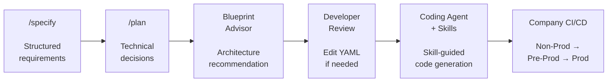
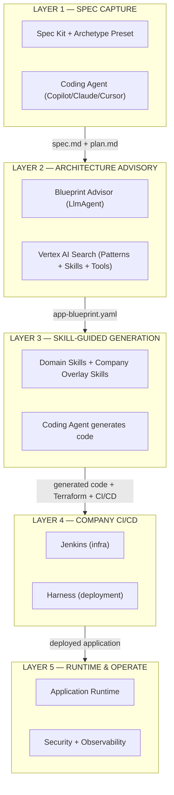
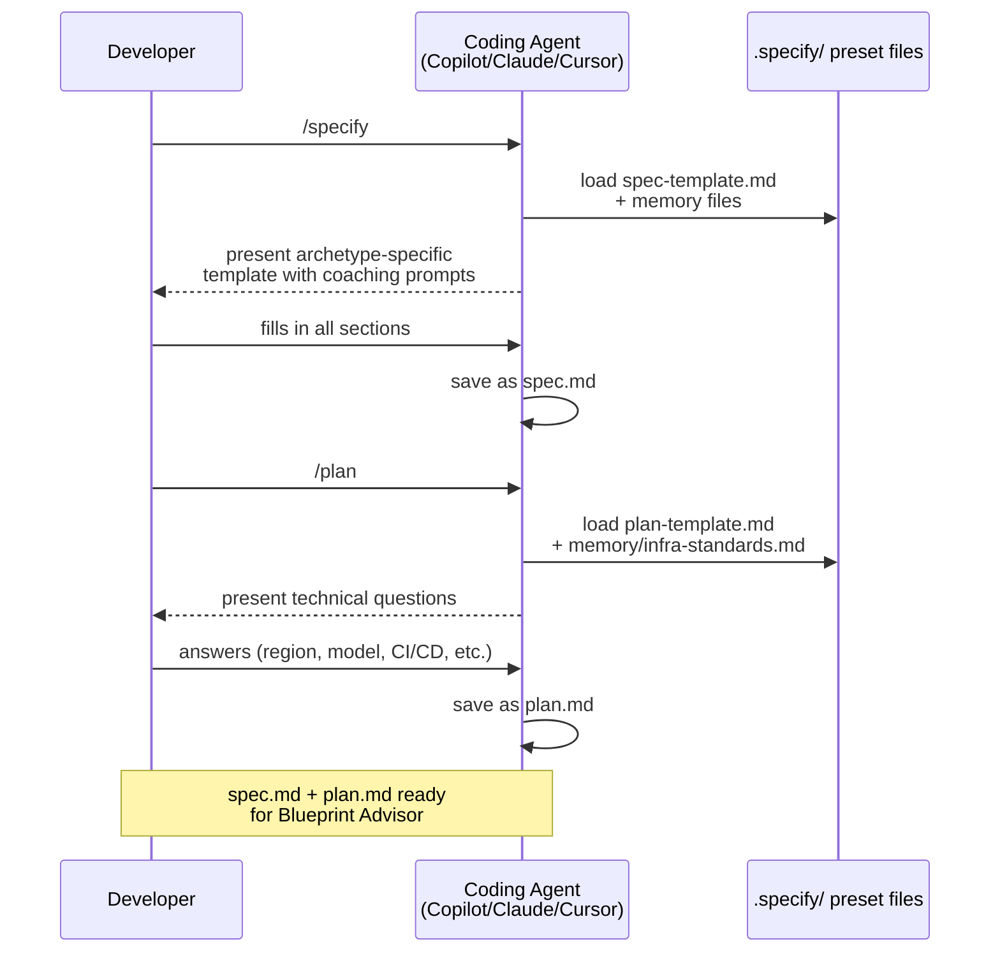
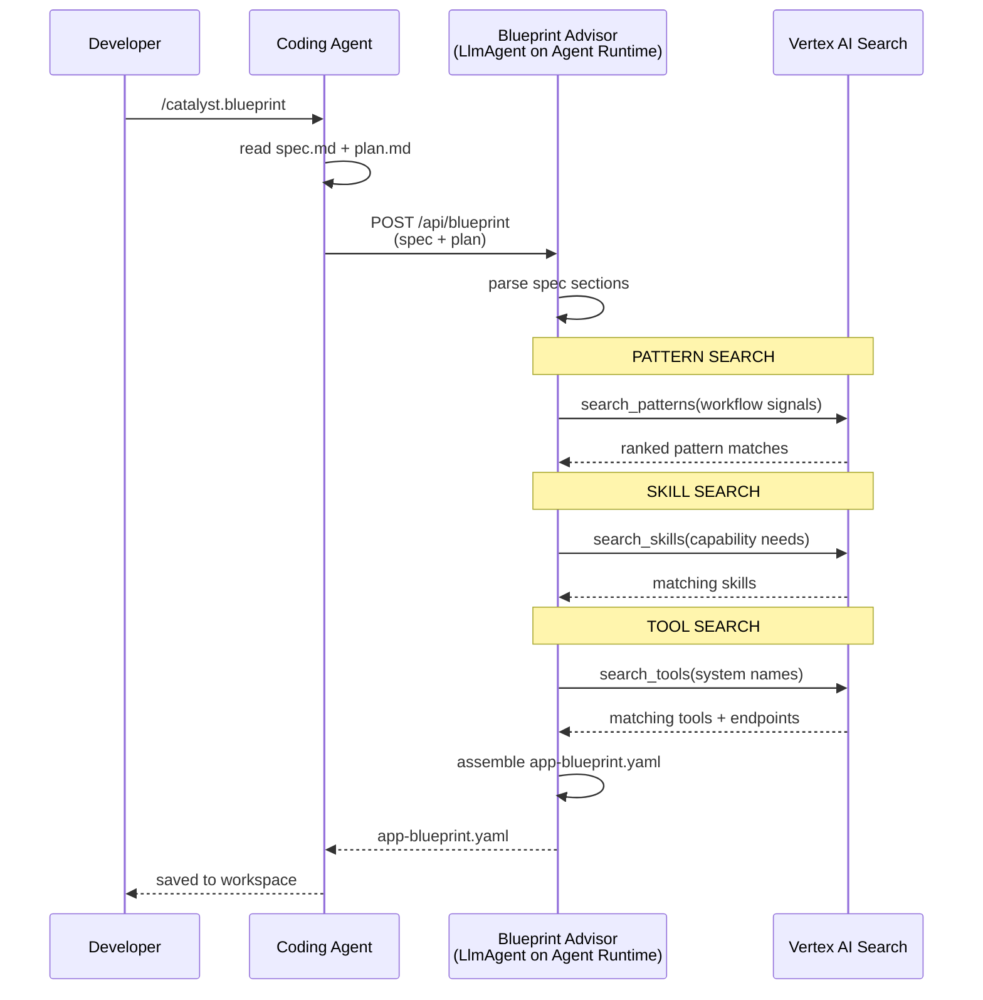
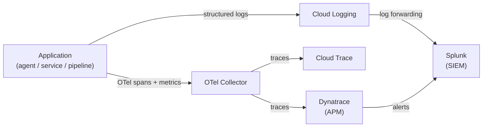
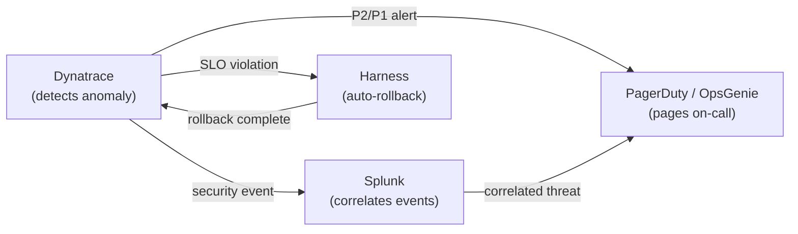

# AgentCatalyst — Standardize. Scaffold. Ship.

*A spec-driven development accelerator for enterprise applications on Google Cloud Platform*

---

## Executive Summary — For the SLT

### The problem

Enterprise development teams face a recurring pattern across every application type — agents, microservices, data pipelines, APIs. Requirements start as vague conversations. Every team hand-rolls its own infrastructure, CI/CD, and observability. The gap from idea to first committed code takes 4–6 weeks, with most of that time spent on boilerplate, not business logic. Across 50 teams, 50 different approaches, none following a consistent standard.

### The solution: AgentCatalyst

AgentCatalyst is a **spec-driven development accelerator** that transforms structured business requirements into production-ready, fully generated application code — grounded in company enterprise patterns and best practices.

It works in five phases:



### AgentCatalyst at a glance


*The diagram above shows the complete flow: a developer captures requirements via a structured template (Phase 1), the Blueprint Advisor recommends an architecture as a YAML file (Phase 2), the coding agent uses installed skills to generate the entire project (Phase 3), the company's existing CI/CD deploys it (Phase 4), and the application runs on GCP with full security and monitoring (Phase 5).*

### Key principles

1. **Spec-driven, not prompt-driven.** Requirements are captured in a structured template — not free-form chat. Every developer produces the same quality of input regardless of experience level.
2. **AI-advised, human-decided.** The Blueprint Advisor recommends an architecture; the developer reviews and edits the YAML before code generation. The human is always in control.
3. **Skill-guided code generation.** The coding agent uses installed skills — Markdown instruction documents — that teach it how to write correct code for each technology. The skills ensure consistency with both GCP best practices and company standards across all teams.
4. **Company-grounded.** Company-authored skills embed company best practices — naming conventions, folder structure, security defaults, observability standards. The 50th application generated looks like the 1st.
5. **Open tools, no vendor lock-in.** Spec Kit is GitHub open source. ADK is Google open source. The SKILL.md format is an open standard. The YAML is a standard configuration file. No proprietary platform required.
6. **Archetype-agnostic.** The same pattern — structured spec → AI-advised blueprint → skill-guided generation — works across application types. Agentic AI, microservices, data pipelines, and APIs all follow the same flow with different presets and skills.
7. **GA-only.** Every GCP component is GA (General Availability) with SLA backing. Zero pre-GA or preview dependencies.

### The ROI

| Activity | Without AgentCatalyst | With AgentCatalyst | Improvement |
|---|---|---|---|
| Requirements capture | 3–5 days (meetings + documents) | 2–4 hours (/specify template) | 90% faster |
| Architecture design | 1–2 weeks (manual research) | 30 minutes (Blueprint Advisor) | 95% faster |
| Code generation | 1–2 weeks (manual project setup) | 5–10 minutes (skill-guided) | 99% faster |
| Infrastructure as code | 3–5 days (manual Terraform) | Automatic (from YAML) | 90% faster |
| CI/CD pipeline config | 1–2 days | Automatic (from YAML) | 95% faster |
| Consistency across teams | Zero — every team is different | 100% — all apps follow company patterns | Structural |
| **Total: idea to generated code** | **4–6 weeks** | **< 1 day** | **90%+ faster** |

### Cost to build and operate

| Cost category | One-time investment | Ongoing (per quarter) |
|---|---|---|
| **Pattern catalog** (11 agentic patterns) | Generated by Pattern Factory + EA review (in-place) | ~20 hours (updates for new ADK features) |
| **Tool registry enrichment** (workload_types, data_domains, use_case_signals, sla, sensitivity per tool/task) | ~260 hours (platform eng) — ~2 hrs per tool × ~130 tools and tasks | ~40 hours (new tool onboarding) |
| **Domain skills authoring** (4 agentic skills: adk-agents, adk-tools, adk-mcp, model-armor) | ~40 hours (platform eng) | ~10 hours (SDK updates) |
| **Company overlay skills + EvalOps** (4 shared: Terraform, observability, CI/CD, security — includes 3-phase eval pipeline with Arize + AutoSxS + HITL triage, ADK tracing + Phoenix config, pre-commit inner loop evaluator) | ~85 hours (platform eng) | ~15 hours (template + eval updates) |
| **Blueprint Advisor** (LlmAgent + system prompt + deployment + golden dataset generation from spec) | ~50 hours (platform eng) | ~5 hours (prompt tuning) |
| **Search quality regression suite** (30–50 reference specs with golden YAML outputs) | ~80 hours (EA + platform eng) | ~20 hours (suite expansion) |
| **Acceptance telemetry + meta-evaluation** (capture YAML edits, build dashboards, quarterly metric drift detection for automated eval judges) | ~50 hours (platform eng) | ~10 hours (dashboard + meta-eval) |
| **Pattern composition validator** (static analyzer for YAML compatibility) | ~40 hours (platform eng) | ~5 hours (rule updates) |
| **Vertex AI Search + Spec Kit** (2 data stores: skills, tools — pattern store already operational. Spec Kit preset includes golden dataset section, business rules template, transformation rules template, error handling template, acceptance criteria template) | ~45 hours (platform eng + EA) | ~5 hours (catalog + template updates) |
| **Production feedback pipeline** (failure sampling → human annotation queue → golden dataset update) | ~10 hours (platform eng) | ~5 hours (queue tuning) |
| **FNOL Pilot** (end-to-end validation including all 3 EvalOps layers) | ~40 hours (pilot team) | — |
| **Per-LOB onboarding** (LOB-specific patterns, tool enrichment, training, office hours) | ~170 hours per LOB | ~20 hours per LOB per quarter |
| **Phase 1 total (1st LOB)** | **~870 hours / ~$87K** | **~140 hours/quarter / ~$14K** |
| **Each additional LOB** | **~170 hours / ~$17K** | **~20 hours/quarter / ~$2K** |
| | | |
| **GCP infrastructure** (Blueprint Advisor on Agent Runtime, Vertex AI Search, Arize Phoenix) | — | ~$500–1,500/month |
| **Break-even (1st LOB)** | Platform cost recovered after 3rd use case ($87K ÷ $39K savings per use case = 2.2). Each additional LOB pays back its onboarding cost in the 1st use case. | |

**Per use case cost comparison (both sides use Copilot):**

| | Without AgentCatalyst (Copilot + published standards) | With AgentCatalyst (Copilot + skills + Blueprint Advisor) |
|---|---|---|
| **Build phase** | 446 hrs (requirements 60 + standards learning 24 + architecture 60 + code 100 + prompts 35 + infra/CI/CD/obs/security 82 + testing 60 + deploy 25) | 138 hrs (requirements 60 + spec/plan/biz rules 8 + Blueprint Advisor 1 + generate 0.5 + complex domain logic 20 + prompts 25 + testing 15 + PR 8) |
| **Compliance remediation** | 82 hrs (EA review 16 + security review 16 + rework 50) | 0 hrs (compliant by construction) |
| **Total** | **528 hrs / $52.8K / ~7.5 weeks** | **138 hrs / $13.8K / ~3.5 weeks** |
| **Savings** | | **$39K per use case (74%)** |

† If business rules are NOT captured in the spec, add $5.5K per use case (55 hrs) for manual business logic implementation → $19.3K / 193 hrs per use case. Enterprise savings drop from $8.0M to $6.85M but ROI remains 36×.

### Application archetypes — one platform, many application types

AgentCatalyst uses **presets** to adapt the same five-phase flow to different application types. Each preset provides a domain-specific spec template, a domain-specific Blueprint Advisor catalog, and domain-specific skills. Company overlay skills (Terraform, observability, CI/CD, security) are shared across all presets.

| Archetype | Preset | Spec template sections | Blueprint catalog | Domain skills | Status |
|---|---|---|---|---|---|
| **Agentic AI** | `agentcatalyst-agentic` | Business Problem, Workflow, Data Sources, External Partners, Internal Capabilities, Infrastructure | 11 agentic patterns (Sequential, Parallel, Loop, HITL, Coordinator, RAG, etc.) | ADK agents, MCP connections, A2A clients, Model Armor | **Phase 1 — now** |
| **Microservice** | `agentcatalyst-microservice` | Service Purpose, API Contracts, Dependencies, Data Model, Event Model, Infrastructure | Microservice patterns (API Gateway, CQRS, Event Sourcing, Saga, Strangler Fig) | Spring Boot, FastAPI, Node.js Express, Cloud Run, Pub/Sub | **Phase 2 — future** |
| **Data Pipeline** | `agentcatalyst-pipeline` | Pipeline Purpose, Sources, Transformations, Quality Rules, Sinks, Schedule | Pipeline patterns (Batch ETL, Streaming, Lambda, CDC, Medallion) | Dataflow, Apache Beam, BigQuery, Cloud Storage, Pub/Sub | **Phase 3 — future** |
| **API** | `agentcatalyst-api` | API Purpose, Endpoints, Schemas, Auth Model, Rate Limits, Versioning | API patterns (REST, GraphQL, gRPC, Event-Driven, BFF) | OpenAPI, gRPC, Apigee proxy, Cloud Endpoints | **Phase 4 — future** |

**What's shared across ALL archetypes:**

```
Company overlay skills (reusable):
├── company-terraform-patterns   ← Same TF modules for any app type
├── company-observability        ← Same Dynatrace + Splunk + OTel for any app type
├── company-cicd                 ← Same Jenkins + Harness for any app type
└── company-security             ← Same VPC-SC + CMEK + Secret Manager for any app type
```

One investment in overlay skills, reusable across every application type the company builds. A microservice gets the same Terraform modules, the same Dynatrace config, the same Jenkins/Harness pipelines, and the same security standards as an agent.

### Why now

Google Cloud Next '26 (April 2026) shipped the managed primitives AgentCatalyst depends on — all GA: Agent Runtime (Agent Engine), Model Armor, ADK with production-ready agent classes, and Vertex AI Search with hybrid retrieval. GitHub shipped Spec Kit (open source, 30+ coding agent integrations) and the SKILL.md open standard for portable coding agent skills. The primitives exist. AgentCatalyst is the opinionated company layer that makes them work together as a paved road.

### GA-only commitment

Every GCP component in AgentCatalyst is GA with SLA backing:

| Component | GA Status | What it provides |
|---|---|---|
| Agent Runtime (Agent Engine) | ✅ GA | Managed runtime for ADK agents |
| ADK Python SDK | ✅ GA | Agent framework (SequentialAgent, ParallelAgent, LoopAgent, LlmAgent, tools) |
| Vertex AI Search | ✅ GA | Semantic search for pattern, skill, and tool discovery |
| Model Armor | ✅ GA | Prompt and response content screening |
| Cloud SQL / BigQuery / GCS | ✅ GA | Data services |
| Apigee | ✅ GA | API gateway |
| Cloud Trace + Cloud Logging | ✅ GA | Native observability |
| Secret Manager + Cloud KMS | ✅ GA | Secrets and encryption |
| VPC Service Controls | ✅ GA | Network perimeter security |

**Not used (pre-GA):** `agents-cli` (pre-GA), `agents-cli` bundled skills (pre-GA), Agent Simulation (pre-GA), Agent Evaluation (pre-GA), Agent Optimizer (pre-GA). The architecture achieves the same outcomes using GA alternatives and company-authored skills.

---

## Document scope and audience

This document describes the end-to-end architecture of AgentCatalyst — from structured requirements capture through fully generated application code ready for company CI/CD. It is written for two audiences:

- **Enterprise Architecture / SLT** — Sections "Executive Summary" through "End-to-end thread" provide the strategic view: what AgentCatalyst is, why it matters, how it extends to multiple application types, and what GCP services it uses. Start here.
- **Engineering teams** — Sections "Layer deep-dives" through "Worked Example" provide the technical detail: how each layer works, how skills guide code generation, and how to build an agent step by step with the FNOL example. Start at "End-to-end thread" then jump to the layer you're working on.

> **Companion document:** For hands-on developer instructions — prerequisites, installation, step-by-step greenfield and brownfield walkthroughs, test writing guidance, troubleshooting, and FAQ — see the *AgentCatalyst Developer Guide* (`agentcatalyst-ga-developer-guide.md`).

---

## End-to-end thread (read this first)

Before diving into the five layers, here is the complete flow as a narrative. No jargon, no architecture diagrams — just what happens step by step from the developer's perspective.

A developer is asked to build an AI agent that processes auto insurance claims (FNOL). She opens VSCode with GitHub Copilot and types `/specify`. The AgentCatalyst preset (the `agentcatalyst-agentic` variant) presents a structured template with six sections — Business Problem, Workflow, Data Sources, External Integrations, Internal Capabilities, and Infrastructure Requirements. She fills it in using plain English, describing the step-by-step workflow, the data systems involved, the external partner APIs, and her proprietary models. This takes about 15 minutes. The result is `spec.md` — a structured requirements document saved in her workspace.

She types `/plan` and answers a handful of technical questions — GCP region, LLM model, CI/CD tools, Terraform module source. This takes 5 minutes. The result is `plan.md`.

She types `/catalyst.blueprint`. This custom command packages her `spec.md` and `plan.md` and sends them to the Blueprint Advisor — an AI advisor running on GCP that has access to the company's catalog of 11 agent patterns, reusable skills, and approved tools. The Blueprint Advisor reads her spec, searches the catalogs, and recommends an architecture: a Coordinator root agent with four sub-agents (Sequential intake, Parallel enrichment, Loop summary, HITL adjuster review), connected to BigQuery, Cloud SQL, and Vertex AI Search via MCP servers, with three external A2A agents for body shop, rental car, and police report services. It returns `agent-blueprint.yaml` — a YAML file describing WHAT to build. Not code — just a specification.

She reviews the YAML in her editor. It's a readable file — agent names, types, tool endpoints, infrastructure settings. The Blueprint Advisor assigned Cloud SQL to the wrong agent — she edits the YAML directly, changing `assigned_to: extract_details` to `assigned_to: fnol_coordinator`. She saves.

She types `/catalyst.generate`. Now the coding agent (Copilot, in her case) reads the YAML and starts generating the actual code. But it doesn't guess how to write the code — it has **skills** installed that teach it the right way:

- **`adk-agents` skill** teaches it how to write correct ADK Python code — the right import paths, the right class constructors, the right way to wire tools to agents. Think of it as a "how to write ADK code" instruction manual that the coding agent reads before writing anything. This skill was authored by the company's platform engineering team based on the GA ADK SDK documentation.
- **`company-terraform-patterns` skill** teaches it which Terraform modules to use and how to pin versions — so the generated Terraform references `github.com/company/tf-modules//agent-runtime@v3.1.0`, not some generic Terraform.
- **`company-cicd` skill** teaches it to generate a Jenkinsfile and a Harness pipeline definition — NOT to deploy directly from her laptop. This is important: some coding agents have CLI tools that push code straight to GCP, but the company doesn't allow that. The `company-cicd` skill explicitly tells the coding agent: "Generate pipeline files. Do not deploy directly." The coding agent obeys.
- **`company-observability` skill** teaches it to generate Dynatrace and Splunk configuration, not just the default Cloud Trace.
- **`company-security` skill** teaches it to generate Model Armor callbacks, VPC-SC references, and CMEK configuration.

The result: a complete project in her workspace — 6 agent class files, 3 MCP connections, 3 A2A clients, 3 FunctionTool files with first-draft business logic (generated from business rules authored in the spec, ready for developer review), Model Armor callbacks, complete Terraform, Dynatrace observability config, and Jenkins + Harness pipeline definitions. Every file follows company coding standards because the company skills taught the coding agent those standards.

She opens `app/tools/severity_classifier.py` and reviews the first draft of generated business logic — the IF/THEN conditions she authored in the spec are already implemented as working Python code. This is her starting point, not a black box. She refines the logic, adds edge cases, and writes system prompts for each agent — the "personality" and instructions that make each agent behave correctly for insurance claims. The 80-95% was handled by the coding agent guided by skills. When business rules are authored in the spec, even FunctionTool bodies are generated as a first draft — the developer reviews and makes the code their own.

She commits and opens a PR. Her team reviews it — the generated code looks familiar because every AgentCatalyst project follows the same company patterns. After the PR is merged, Jenkins automatically runs Terraform to provision the infrastructure (Agent Runtime, Cloud SQL, Model Armor, VPC-SC). Then Harness automatically deploys the agent through Non-Prod (testing), Pre-Prod (canary at 10% traffic), and Production (progressive rollout). If anything breaks, Harness rolls back automatically.

She never deployed from her laptop. She never provisioned a GCP resource manually. She never wrote a Dockerfile. All of that was either generated by the coding agent (Terraform, pipeline definitions) or handled by the company's CI/CD after she committed.

**Now imagine** a different developer on another team who needs to build a FastAPI microservice for order management. He installs the `agentcatalyst-microservice` preset instead. His `/specify` template has different sections — Service Purpose, API Contracts, Dependencies, Data Model. His Blueprint Advisor searches a different pattern catalog — microservice patterns instead of agent patterns. His coding agent loads a `fastapi` skill instead of an `adk-agents` skill. But the **company overlay skills are the same** — same Terraform modules, same Dynatrace config, same Jenkins/Harness pipelines, same security standards. The microservice follows the same company patterns as the agent. The platform team maintains one set of overlay skills, and every application type benefits.

**Total time from "I need an FNOL agent" to generated code committed to GitHub: under 1 hour.** The remaining 2–4 hours are spent writing the 20% — system prompts, FunctionTool business logic, and test data. Without AgentCatalyst, this entire process takes 4–6 weeks.

### Brownfield: Adding an agent to an existing system

Not every agent starts from scratch. When adding an AI agent to an existing system with live APIs, production databases, and code you can't modify, the developer writes the spec differently. In the **External Integrations** section, she writes: "Loan origination REST API — WE operate this, EXISTING endpoints at /api/v2/applications. The agent MUST use these existing endpoints." In the **Internal Capabilities** section: "Credit score lookup — EXISTING internal function at /api/v2/credit-check."

The Blueprint Advisor reads phrases like "EXISTING REST API" and "MUST use these existing endpoints" and recommends FunctionTool wrappers around the existing REST endpoints — not new MCP connections or new services. The generated code wraps the existing API with thin Python functions. **The agent adapts to the existing system — never the other way around.** No existing database schemas, API contracts, or source code are modified.

---

## Technology Stack — Layered Component Reference

AgentCatalyst uses a five-layer architecture. Each layer has a clear responsibility and a defined handoff to the next.



### Component architecture — detailed view


The diagram above shows every component in AgentCatalyst organized by layer. Here is what each component does and how they interact:

**Layer 1 — Spec Capture (blue):**
The developer works in VSCode with their preferred coding agent (Copilot, Claude Code, or Cursor). The coding agent loads the AgentCatalyst preset from the `.specify/` folder — the preset is archetype-specific (agentic, microservice, pipeline, or API) and contains a domain-specific spec template, plan template, custom commands (`/catalyst.blueprint`, `/catalyst.generate`), and memory files with company reference material and coding standards. The developer runs `/specify` to fill in the structured template and `/plan` to answer technical questions. The outputs — `spec.md` and `plan.md` — flow to Layer 2.

**Layer 2 — Architecture Advisory (amber):**
The Blueprint Advisor is an LlmAgent running on GCP Agent Runtime. It receives `spec.md` + `plan.md` and uses RAG tools to query Vertex AI Search. The search catalogs are archetype-specific: 11 agentic patterns for the agentic preset, microservice patterns for the microservice preset, pipeline patterns for the pipeline preset. The Blueprint Advisor performs single-pass semantic search, uses its LLM reasoning (guided by a company-curated system prompt) to select patterns, skills, and tools, and assembles `app-blueprint.yaml` — a deployment specification describing WHAT to build. The developer reviews and edits the YAML before proceeding.

**Layer 3 — Skill-Guided Generation (green):**
The coding agent reads `app-blueprint.yaml` and generates the complete project guided by installed skills. Skills are Markdown documents (SKILL.md format — an open standard) that teach the coding agent how to write correct code for each technology. Domain skills are archetype-specific (ADK for agents, FastAPI for microservices, Beam for pipelines). Company overlay skills are shared across all archetypes (Terraform, Dynatrace, CI/CD, security). The coding agent activates the relevant skills based on the task, reads the instructions, and generates code that follows both technology best practices and company standards. No proprietary CLI tool is required — skills work with any coding agent that supports the SKILL.md format.

**Layer 4 — Company CI/CD (gray):**
Outside AgentCatalyst's scope. The company's existing Jenkins and Harness pipelines take the generated code through the standard promotion process: PR review → Non-Prod (build, test, eval) → Pre-Prod (canary deploy, SLO checks) → Production (progressive rollout, monitoring). AgentCatalyst generated the pipeline definitions; the company's CI/CD executes them. Code is NEVER deployed directly from the developer's machine.

**Layer 5 — Runtime & Operate (purple):**
The deployed application runs on GCP infrastructure. For agents: Agent Runtime (Agent Engine) with Model Armor screening. For microservices: Cloud Run or GKE. For pipelines: Dataflow or Cloud Composer. All application types share: Apigee Runtime Gateway for API management, Dynatrace for APM, OpenTelemetry Collector for trace forwarding, Cloud Logging for structured logs, Splunk for SIEM, VPC-SC for network perimeter, CMEK for encryption at rest.

**Cross-cutting concerns (right panel):**
Six services span all layers and all archetypes: Agent Identity / Workload Identity (per-workload IAM), VPC-SC Perimeter (production + pre-prod), CMEK Encryption (all data at rest via Cloud KMS), Secret Manager (zero hardcoded credentials), Cloud Audit Logs (forwarded to Splunk), and IAM Governance (least privilege, quarterly review).

### Layer 1 — SPEC CAPTURE

| Component | Owner | Description |
|---|---|---|
| GitHub Spec Kit *(open source)* | GitHub | Structured specification workflow. Developer runs `/specify` and `/plan` in their coding agent. Templates guide the developer to describe their use case in a consistent format. |
| Archetype Preset | Company | Company-built preset for Spec Kit — archetype-specific. Each preset contains the domain-specific spec template, plan template, custom commands, and memory files. Installed via `specify preset add agentcatalyst-{archetype}`. |
| Coding Agent | Developer's choice | Any Spec Kit-compatible coding agent — GitHub Copilot, Claude Code, Gemini CLI, Cursor, Windsurf, etc. |

**Layer 1 delivers:** `spec.md` + `plan.md`

### Layer 2 — ARCHITECTURE ADVISORY

| Component | Owner | Description |
|---|---|---|
| Blueprint Advisor | Company | LlmAgent on Agent Runtime (GCP Agent Engine). Reads spec + plan, queries archetype-specific pattern/skill/tool catalogs via Vertex AI Search (single-pass semantic retrieval), generates `app-blueprint.yaml`. Uses system prompt with company best practices + RAG. |
| Pattern Catalog | Company | Archetype-specific patterns documented as architectural knowledge artifacts, ingested into Vertex AI Search. 11 agentic patterns for Phase 1. Microservice, pipeline, and API patterns for future phases. |
| Skill Catalog | Company | Reusable skills with metadata, ingested into Vertex AI Search. Blueprint Advisor searches by capability match. |
| Tool Registry | Company/GCP | MCP servers, A2A agents, and APIs registered in Apigee API Hub. |
| Vertex AI Search *(GA)* | GCP | Semantic search engine for pattern, skill, and tool discovery. Single-pass hybrid search. |

**Layer 2 delivers:** `app-blueprint.yaml`

### Layer 3 — SKILL-GUIDED GENERATION

| Component | Owner | Description |
|---|---|---|
| Domain Skills | Company | Company-authored skills (SKILL.md format) that teach the coding agent how to write correct code for the archetype. Agentic: `adk-agents`, `adk-tools`, `model-armor`. Microservice: `fastapi`, `spring-boot`. Pipeline: `dataflow`, `beam`. |
| Company Overlay Skills | Company | 4 company-authored skills shared across ALL archetypes: `company-terraform-patterns`, `company-observability` (Dynatrace + Splunk), `company-cicd` (Jenkins + Harness), `company-security` (VPC-SC + CMEK + Secret Manager). |
| `adk create` *(GA)* | GCP | ADK CLI project creation command — part of the GA ADK package (`pip install google-adk`). Creates bare project structures from Garden templates. This is distinct from the pre-GA `agents-cli scaffold create` which bundles additional skills and deployment features. `adk create` provides the project skeleton only; skills handle the rest. |
| `gh skill install` *(GA)* | GitHub CLI | Installs agent skills at pinned versions with provenance verification. |
| Coding Agent | Developer's choice | Any coding agent that supports the SKILL.md open standard. Reads skills from `.agents/skills/` directory. |

**Layer 3 delivers:** Complete generated codebase — application code + infrastructure + observability + CI/CD pipelines

### Layer 4 — COMPANY CI/CD (outside AgentCatalyst scope)

| Component | Owner | Description |
|---|---|---|
| Jenkins | Company | Infrastructure pipeline — Terraform plan/apply with OPA policy checks. |
| Harness | Company | Deployment pipeline — canary deployment, progressive rollout, rollback. |
| GitHub | Company | Source control — PR review, branch protection, merge policies. |

**Layer 4 delivers:** Deployed application in Non-Prod → Pre-Prod → Prod

### Layer 5 — RUNTIME & OPERATE

| Component | Owner | Description |
|---|---|---|
| Agent Runtime (Agent Engine) *(GA)* | GCP | For agentic archetype: managed runtime for ADK agents — scaling, sessions, memory, artifacts. |
| Cloud Run *(GA)* | GCP | For microservice and API archetypes: serverless container runtime. |
| Dataflow *(GA)* | GCP | For pipeline archetype: managed Apache Beam runner. |
| Apigee Runtime Gateway *(GA)* | GCP | API gateway for all archetypes — OAuth2, rate limiting, request/response logging. |
| Model Armor *(GA)* | GCP | For agentic archetype: prompt and response screening. |
| Dynatrace | Third-party | APM — OneAgent auto-instrumentation, custom metrics, dashboards. All archetypes. |
| OpenTelemetry Collector | Open source | Trace and metric collection, forwarding to Dynatrace + Cloud Trace + Cloud Logging. All archetypes. |
| Splunk | Third-party | SIEM — security event aggregation, threat detection, audit log correlation. All archetypes. |
| Cloud Trace + Cloud Logging *(GA)* | GCP | Native GCP observability. All archetypes. |

### Cross-cutting concerns

| Concern | Service | How it applies |
|---|---|---|
| **Identity** | Workload Identity + IAM | Per-workload least-privilege service accounts. For agents: Agent Identity (SPIFFE) for A2A auth. |
| **Encryption at rest** | CMEK (Cloud KMS) | All data stores use Customer-Managed Encryption Keys. All archetypes. |
| **Network perimeter** | VPC-SC | Production and pre-prod enclosed in VPC-SC perimeter. All archetypes. |
| **Secret management** | Secret Manager | Zero hardcoded credentials in any generated code. All archetypes. |
| **Audit logging** | Cloud Audit Logs | All admin activity and data access logged. Forwarded to Splunk. All archetypes. |

---

## Layer 1 — SPEC CAPTURE (deep dive)

### The AgentCatalyst preset — archetype-specific

When a developer installs an archetype preset (e.g., `specify preset add agentcatalyst-agentic`), the following files are added to their project:

```
.specify/
├── preset.yml                          ← Preset manifest
├── templates/
│   ├── spec-template.md                ← Archetype-specific requirements template
│   ├── plan-template.md                ← Technical decisions template
│   ├── tasks-template.md              ← Task breakdown template
│   └── gemini-md-template.md          ← Project instruction file for coding agent
├── commands/
│   ├── catalyst.blueprint.md           ← Sends spec+plan to Blueprint Advisor
│   └── catalyst.generate.md            ← Instructs coding agent to generate code using skills
└── memory/
    ├── adk-reference.md                ← Domain reference (varies by archetype)
    ├── company-patterns.md             ← Company coding standards
    ├── approved-tools.md               ← Approved MCP servers, APIs, A2A agents
    └── infra-standards.md              ← Terraform module registry and pinning rules
```

The `memory/` folder provides reference material that the coding agent loads during `/specify` and `/plan` to coach the developer. These are reference documents — the same information a developer would find in the company wiki.

### Spec templates by archetype

| Archetype | Sections | What each section elicits |
|---|---|---|
| **Agentic** | Business Problem, Workflow, Data Sources, External Partners, Internal Capabilities, Infrastructure | Workflow ordering → agent topology. Data sources → tool selection. Partners → A2A connections. |
| **Microservice** | Service Purpose, API Contracts, Dependencies, Data Model, Event Model, Infrastructure | API contracts → endpoint generation. Events → Pub/Sub config. Data model → schema + migrations. |
| **Data Pipeline** | Pipeline Purpose, Sources, Transformations, Quality Rules, Sinks, Schedule | Sources + sinks → I/O connectors. Transformations → pipeline stages. Schedule → Cloud Scheduler config. |
| **API** | API Purpose, Endpoints, Request/Response Schemas, Auth Model, Rate Limits, Versioning | Endpoints → route generation. Schemas → validation. Auth → Apigee policy config. |

### Layer 1 sequence diagram



---

## Layer 2 — ARCHITECTURE ADVISORY (deep dive)

### Blueprint Advisor — how it works

The Blueprint Advisor is an LlmAgent deployed on Agent Runtime (GCP Agent Engine). It receives `spec.md` + `plan.md` as input and produces `app-blueprint.yaml` as output.

#### System prompt structure

The Blueprint Advisor's intelligence comes from a well-crafted system prompt containing company best practices and pattern selection heuristics. The system prompt is archetype-specific:

```
SYSTEM PROMPT STRUCTURE (agentic archetype):

1. ROLE: "You are the Blueprint Advisor — an AI architecture advisor
   for applications on Google Cloud Platform."

2. DOMAIN PATTERNS: Pattern selection heuristics for the archetype
   (agentic: SequentialAgent for ordered chains, ParallelAgent for
   concurrent tasks, etc.)

3. TOOL SELECTION: Workload-to-tool mapping
   (analytical → BigQuery, transactional → Cloud SQL, etc.)

4. OUTPUT FORMAT: Valid YAML conforming to the blueprint schema

5. RAG USAGE: "Search before recommending — do not hallucinate endpoints"
```

**What makes this better than a developer asking Gemini directly?** Three things: (1) the system prompt embeds company-specific patterns and tool selection heuristics; (2) the RAG tools give access to curated catalogs rather than general knowledge; (3) the output is a structured YAML that skills can consume directly.

#### RAG tools

| Tool | Data store | Returns |
|---|---|---|
| `search_patterns(query)` | Archetype-specific pattern catalog | Ranked pattern matches with applicability criteria |
| `search_skills(query)` | Skill catalog | Matching skills with name, source, version |
| `search_tools(query)` | Tool registry (Apigee API Hub) | MCP servers, A2A agents, APIs with endpoints and auth |

All three use single-pass semantic search via Vertex AI Search (GA).

#### How the three data stores are structured

The Blueprint Advisor queries three Vertex AI Search data stores, each optimized for a different discovery purpose:

| Data Store | Contents | Search Strategy |
|---|---|---|
| Pattern Catalog | 11 agentic patterns (8 sections each, 176 HA/DR scenarios) | Semantic search on pattern applicability |
| Skill Catalog | Reusable skills with frontmatter metadata | Semantic search on `use_when` / `do_not_use_when` |
| Tool Registry | MCP servers + A2A Agent Cards + FunctionTool definitions | Semantic search on capability + endpoint |

Each entry has YAML frontmatter (name, description, tags, applicability signals) that Vertex AI Search indexes for hybrid semantic + structured retrieval.


#### How the Blueprint Advisor extracts search queries from the spec

The Blueprint Advisor reads the spec's natural language and extracts search signals:

| Spec Signal | Extracted Query | Target Data Store |
|---|---|---|
| Workflow ordering words ("first...then...in parallel") | Pattern applicability phrases | Pattern Catalog |
| Data system references ("claims database", "policy store") | Data service capability descriptions | Tool Registry |
| External partner mentions ("body shop scheduling") | Partner capability + protocol | Tool Registry (A2A) |
| Business capability needs ("classify severity") | Skill `use_when` matching | Skill Catalog |

The Blueprint Advisor performs a **single-pass** semantic search — one query per data store, not iterative refinement. Results are ranked by Vertex AI Search's built-in relevance scoring.


#### How tools and skills are assigned to agents

The Blueprint Advisor assigns discovered tools and skills to specific agents in the blueprint based on:

- **Capability match**: which agent's purpose aligns with the tool's function
- **Data ownership**: which agent owns the data the tool accesses
- **Skill `use_when` rules**: skill frontmatter specifies which agent types should use it
- **FunctionTool scope**: proprietary logic is flagged as FunctionTool (first-draft generated from spec business rules)


#### How search results distinguish MCP from A2A

Tool Registry entries include a `connection_type` field: `mcp_server`, `a2a_agent_card`, or `function_tool`. The Blueprint Advisor reads this field to determine whether to generate an MCP connection, an A2A client, or a FunctionTool implementation in the blueprint.


#### Tool Registry ingestion pipeline

New tools are registered by submitting a YAML manifest to the ingestion pipeline. The pipeline validates frontmatter, generates embeddings, and indexes in Vertex AI Search. Tools without complete frontmatter are rejected. The platform team reviews new tool registrations weekly.


### The 11 agentic patterns (Phase 1 catalog)

Each pattern is documented with 8 mandatory sections:

| Section | Content |
|---|---|
| **Applicability** | When to use, trigger phrases, anti-patterns |
| **Component Diagram** | Mermaid component diagram |
| **Sequence Diagram** | Mermaid sequence diagram |
| **Security Considerations** | Identity model, data boundaries, screening points |
| **Performance & Idempotency** | Latency, token consumption, retry behavior |
| **HA/DR Views** | 4 DR strategies × 4 lifecycle behaviors = 16 scenarios per pattern |
| **Composition Guidance** | Which patterns compose as parent/child |
| **Search Metadata** | YAML frontmatter for Vertex AI Search ingestion |

| # | Pattern | ADK Class(es) | When to use |
|---|---|---|---|
| 1 | Sequential Pipeline | SequentialAgent | Ordered steps with dependencies |
| 2 | Parallel Fan-out | ParallelAgent | Independent concurrent tasks |
| 3 | Generator/Critic (Loop) | LoopAgent | Generate, validate, refine until threshold |
| 4 | ReAct (Tool Use) | LlmAgent + FunctionTool | Reasoning with external tool calls |
| 5 | Coordinator/Dispatcher | LlmAgent (root) + sub_agents | Multi-domain specialist routing |
| 6 | Review & Critique | LoopAgent (generator + evaluator) | Output review against rubrics |
| 7 | Iterative Refinement | LoopAgent (programmatic exit) | Self-correction until threshold |
| 8 | Hierarchical Decomposition | Nested Sequential + Parallel | Complex sub-task trees |
| 9 | Swarm | ParallelAgent (dynamic) | Large dataset sharding |
| 10 | Human-in-the-Loop | LlmAgent + LongRunningFunctionTool | Async human approval |
| 11 | Agentic RAG | LlmAgent + Vertex AI Search | Document retrieval + reasoning |

#### HA/DR strategy matrix

| DR Strategy | RTO | RPO |
|---|---|---|
| Backup & Restore | Hours | Last backup |
| Pilot Light / On-Demand | 10–30 min | Near-zero |
| Pilot Light / Cold Standby | 5–15 min | Near-zero |
| Warm Standby | 1–5 min | Near-zero |

4 strategies × 4 lifecycles (Initial Provisioning, Component Failure/HA, DR Failover, DR Failback) = **16 scenarios per pattern, 176 scenarios across all 11 patterns.**

### Blueprint Advisor sequence diagram



### app-blueprint.yaml schema

The YAML follows a fixed schema. The coding agent validates against this before generating code.

```yaml
metadata:
  name: string              # Project name (kebab-case)
  version: string           # Semantic version
  archetype: string         # agentic | microservice | pipeline | api
  template: string          # adk_a2a | fastapi | beam | openapi (archetype-specific)
  description: string

platform:
  gcp_project: string
  gcp_region: string
  model: string             # For agentic: gemini-2.0-flash
  runtime: string           # agent_engine | cloud_run | dataflow

# Archetype-specific sections follow:
# For agentic: agents, tools, skills
# For microservice: services, endpoints, databases, events
# For pipeline: stages, sources, transformations, sinks
# For API: routes, schemas, auth, rate_limits

infrastructure:             # Shared across all archetypes
  terraform:
    modules: [{name, source, version}]
  security:
    model_armor: bool       # Agentic only
    dlp: bool
    cmek_key_ring: string
    vpc_sc_perimeter: bool
  observability:
    dynatrace: bool
    otel_collector: bool
    cloud_trace: bool
    cloud_logging: bool
  cicd:
    jenkins: {template, parameters}
    harness: {template, parameters}
```

### Blueprint-generated diagrams

The `app-blueprint.yaml` includes a `diagrams:` section containing three Mermaid diagrams generated by the Blueprint Advisor. These diagrams are derived from the same reasoning that produced the agents, tools, and skills sections — they are a visual serialization of the architecture, not a separate artifact.

| Diagram | What it shows | Audience |
|---|---|---|
| **Component** | Agent tree with tool assignments — which agent connects to which MCP server, A2A agent, or FunctionTool. Agents as rectangles grouped by parent, MCP servers as cylinders, A2A agents as hexagons, FunctionTools as parallelograms. | Developers during YAML review, EA during architecture review |
| **Sequence** | Runtime message flow — what happens when a user sends a request. Each pattern phase (Sequential, Parallel, Loop, HITL) is annotated with a colored rect block. Tool calls shown as self-messages. Parallel enrichment shown with `par/end` blocks. | Developers understanding runtime behavior, QA writing test cases |
| **Infrastructure** | GCP components inside VPC-SC perimeter, external A2A partners outside the boundary, CI/CD pipeline connections (Jenkins, Harness, Arize). | Platform engineering, security review, ARB |

**Why Mermaid, not PNG/SVG:** The Blueprint Advisor is an LLM — it generates text natively. Mermaid is text-based, version-controllable in git, editable by developers, and rendered natively by VSCode (Mermaid preview extension), GitHub, and GitLab. PNG/SVG are rendered outputs, not source of truth. A CI step can convert Mermaid to PNG/SVG using `mmdc` (Mermaid CLI) for documentation or ARB presentations.

**Generation rules in the system prompt:**

The Blueprint Advisor's system prompt includes diagram generation instructions that ensure consistency:
- Component diagram uses the agent tree from the `agents:` section and tool assignments from the `tools:` section
- Sequence diagram follows the pattern ordering: Sequential steps in order, Parallel branches in `par/end`, Loop with `loop/end`, HITL with `alt/else`
- Infrastructure diagram maps `infrastructure:` section fields to GCP service boxes
- All diagrams reference agent names and tool names exactly as they appear in the YAML — no renaming, no abbreviations

**Developer workflow:** After `/catalyst.blueprint`, the developer opens `app-blueprint.yaml` in VSCode. The Mermaid preview extension renders diagrams inline. The developer reviews the YAML fields (agents, tools, skills) with the diagrams visible side-by-side — visual verification catches assignment mistakes that reading YAML alone would miss. When the developer opens a PR, GitHub/GitLab renders the Mermaid blocks natively, so the team reviews architecture visually during code review.

### Enhanced spec template — business logic capture

The spec template (`spec_template.md`) includes four sections beyond workflow and data sources that enable the coding agent to generate business logic — not just scaffolding. When these sections are filled out, the coding agent generates 90-95% of the code (including business rules). When omitted, the coding agent generates 80% (scaffolding only) and the developer implements business logic manually (+$5.5K per use case).

**Business Rules section:** For each decision point in the workflow, the developer documents the rules as structured conditions. The Blueprint Advisor converts these into `business_rules:` blocks in the YAML with inputs, outputs, conditions, edge cases, and validation constraints. The coding agent generates working implementations — not just stubs.

**Transformation Rules section:** For each data transformation, the developer documents field mappings and formulas. The Blueprint Advisor converts these into `transformations:` blocks. The coding agent generates data transformation functions with correct field references.

**Error Handling section:** For each external dependency (MCP server, A2A agent, API), the developer documents timeout behavior, failure fallbacks, partial-data handling, and retry policies. The Blueprint Advisor converts these into `error_handling:` blocks. The coding agent generates try/catch blocks with correct fallback behavior and circuit breakers.

**Acceptance Criteria section:** For each workflow step, the developer documents GIVEN/WHEN/THEN assertions. The Blueprint Advisor converts these into starter golden dataset entries. The coding agent generates pre-populated evalsets in `tests/evalsets/` derived directly from the spec. This closes the loop between requirements and testing — acceptance criteria become automated evaluation.

| Business logic type | Spec section that captures it | Coding agent accuracy | Still needs human? |
|---|---|---|---|
| Rule-based decisions (if/then with thresholds) | Business Rules | 90%+ | No — unless rules are ambiguous |
| Field mappings and transformations | Transformation Rules | 95%+ | No |
| Validation logic (input constraints) | Business Rules → validation | 95%+ | No |
| Routing conditions | Already in Workflow section | Already generated | No |
| Calculation formulas | Transformation Rules | 95%+ | No |
| Error handling and fallbacks | Error Handling | 90%+ | No |
| Complex domain algorithms (actuarial, ML, regulatory) | Cannot be expressed as rules | Not generated | Yes — `implementation: engineer_implements` |
| Nuanced business judgment | Cannot be expressed as rules | Not generated | Yes |

**Impact on what the coding agent generates:**

```
WITHOUT business logic in spec (current default):
  ├── agents/          ← full topology with routing
  ├── tools/           ← FunctionTool STUBS (empty bodies)
  ├── deployment/      ← Terraform, Jenkins, Harness, security
  ├── observability/   ← Dynatrace, OTel, Phoenix tracing
  ├── tests/           ← evalsets with basic cases
  └── golden-dataset/  ← minimal starter

WITH business logic in spec (enhanced):
  ├── agents/          ← full topology with routing
  ├── tools/           ← FunctionTool IMPLEMENTATIONS (working bodies)
  ├── deployment/      ← Terraform, Jenkins, Harness, security
  ├── observability/   ← Dynatrace, OTel, Phoenix tracing
  ├── tests/           ← evalsets with acceptance-criteria-derived cases
  └── golden-dataset/  ← comprehensive starter from acceptance criteria
```

### What the coding agent generates vs what engineers implement

| Generated (80-95% depending on business rules in spec) | Developer reviews and refines (5-20%) |
|---|---|
| Application code structure (agent classes / service endpoints / pipeline stages) | Business logic inside stubs |
| Tool connections (MCP / database / API clients) | System prompts / service behavior |
| Infrastructure as code (Terraform modules) | Test data and evaluation datasets |
| Observability config (Dynatrace + OTel) | Domain-specific validation rules |
| CI/CD pipeline definitions (Jenkins + Harness) | |
| Security config (Model Armor / VPC-SC / CMEK) | |

### Confidence-tiered recommendations

The Blueprint Advisor tags each recommendation with a confidence level: **high** (exact catalog match), **medium** (partial match, alternatives available), or **low** (best-effort, manual review recommended). The developer sees these confidence levels in the YAML and prioritizes review accordingly.


### Catalog quality engineering

The Blueprint Advisor's correctness depends on metadata quality in Vertex AI Search. The platform team maintains enrichment pipelines that validate frontmatter completeness, embedding freshness, and search relevance. Details are in the Operations Runbook.
### Pattern composition validator

The Blueprint Advisor validates pattern compositions before including them in the YAML. It checks an adjacency matrix that defines which patterns can compose with which (e.g., LoopAgent cannot nest inside ParallelAgent). Invalid compositions are flagged with a warning and an alternative suggestion.


## Layer 3 — SKILL-GUIDED GENERATION (deep dive)

### What is a skill?

A skill is a Markdown document that teaches a coding agent how to do something. It follows the SKILL.md open standard (originally proposed by Anthropic, adopted by Gemini CLI, Claude Code, Cursor, Copilot, and 20+ other coding agents):

```
company-cicd/
├── SKILL.md              ← Instructions for the coding agent
├── templates/             ← Optional: bundled reference files
└── examples/              ← Optional: example output
```

The SKILL.md has two parts — frontmatter (metadata) and body (instructions):

```markdown
---
name: company-cicd
description: >
  Company CI/CD standards for enterprise applications.
  Generates Jenkinsfile and Harness pipeline definitions.
  DO NOT deploy directly from the developer's machine.
---

# Company CI/CD Standards

## CRITICAL: No direct deployment
...detailed instructions the coding agent follows...
```

### Skill architecture — domain skills + company overlay skills

AgentCatalyst uses two categories of skills:

**Domain skills** are archetype-specific — they teach the coding agent how to write code for a particular technology:

| Archetype | Domain skills | What they teach |
|---|---|---|
| **Agentic** | `adk-agents`, `adk-tools`, `adk-mcp`, `model-armor` | ADK agent classes, tool wiring, MCP connections, content screening |
| **Microservice** | `fastapi`, `spring-boot`, `cloud-run`, `pubsub` | Service frameworks, container deployment, event messaging |
| **Pipeline** | `dataflow`, `beam`, `bigquery-io`, `gcs-io` | Pipeline runners, I/O connectors, transforms |
| **API** | `openapi`, `grpc`, `apigee-proxy`, `cloud-endpoints` | API specs, proxy bundles, endpoint config |

**Company overlay skills** are shared across ALL archetypes:

| Skill | What it teaches | Applies to |
|---|---|---|
| `company-terraform-patterns` | Company TF modules, version pinning, backend config | All archetypes |
| `company-observability` | Dynatrace + Splunk + OTel Collector | All archetypes |
| `company-cicd` | Jenkins + Harness pipelines. **DO NOT deploy directly.** | All archetypes |
| `company-security` | Model Armor + VPC-SC + CMEK + Secret Manager | All archetypes |

**All domain skills are company-authored** based on GA documentation for each technology. No pre-GA dependencies. The company's platform engineering team writes them, versions them in Git, and distributes them via the skills repo.

### Skill installation and discovery

Skills are delivered as part of the AgentCatalyst preset (installed via `specify preset add agentcatalyst-enterprise`). The preset's `preset.yml` declares skill dependencies. Skills follow the agentskills.io SKILL.md specification with three progressive disclosure levels: L1 (metadata, always loaded), L2 (instructions, loaded on-demand), L3 (reference files, loaded when referenced).

Company overlay skills (Terraform, observability, CI/CD, security) are shared across all archetype presets. Archetype-specific skills (e.g., `adk-agents`) are included only in the relevant preset variant.


### Skill activation — how the coding agent knows which skill to use

**Phase 1 — Discovery:** On session start, the coding agent loads only the `name:` and `description:` from each SKILL.md frontmatter into its system prompt. The full body is NOT loaded yet — progressive disclosure keeps the context lean.

**Phase 2 — Activation:** When the coding agent receives a task, it matches the task against each skill's `description:` and activates the most relevant skill. The full SKILL.md body is loaded into context, and the skill's directory becomes accessible for reading bundled templates and examples.

**Phase 3 — Precedence:** Workspace skills (`.agents/skills/`) override user skills (`~/.agents/skills/`). The `GEMINI.md` project instruction file adds a blanket rule: "When skills conflict, always follow company skills."

### Deployment override — why code is NEVER deployed directly

The `company-cicd` skill explicitly tells the coding agent:

> **DO NOT deploy directly from the developer's machine.** Generate Jenkinsfile + harness-pipeline.yaml instead. All infrastructure provisioning goes through Jenkins (Terraform). All application deployment goes through Harness (canary pipelines).

This is reinforced by three layers: the `company-cicd` skill itself, the project's `GEMINI.md` instruction file, and the `/catalyst.generate` command. All three say the same thing — no ambiguity.

### Skill governance

| Aspect | How it works |
|---|---|
| **Ownership** | Platform engineering owns company overlay skills. Domain teams own domain skills with EA review. |
| **Version control** | All skills in `github.com/company/agentcatalyst-skills`. Versioned with semver tags. |
| **Change process** | Skill changes via standard PR review. Platform eng + EA review. |
| **New archetype support** | Adding a new archetype: author domain skills, create a spec template, configure Blueprint Advisor catalog. Company overlay skills are reusable as-is. |
| **Testing** | Skills include example prompts and expected outputs. CI validates that the coding agent generates correct code when guided by the skill. |

### FNOL code generation — step by step

When the developer types `/catalyst.generate` for the FNOL agentic use case:

**Step 1 — Create project structure** (deterministic):
```bash
adk create fnol-agent --template adk_a2a
```
Creates the bare project with `pyproject.toml`, `app/__init__.py`, `app/agent.py` (placeholder).

**Step 2 — Generate ADK agent classes** (guided by `adk-agents` + `adk-tools` skills):
The coding agent reads `agents:` from the YAML and generates one Python file per agent with correct ADK imports, class constructors, and sub-agent wiring.

**Step 3 — Generate MCP connections** (guided by `adk-mcp` skill):
MCPToolset declarations with endpoints, transport, and auth from `tools.mcp_servers:`.

**Step 4 — Generate A2A clients** (guided by `adk-tools` skill):
AgentTool wrappers with endpoints, auth, and timeout from `tools.a2a_agents:`.

**Step 5 — Generate FunctionTool implementations** (guided by `adk-tools` skill):
Function signature + description. Body: `raise NotImplementedError("Engineer must implement")`.

**Step 6 — Install skills** (deterministic via `gh skill install`):
Agent skills installed at pinned versions with provenance SHA verification.

**Step 7 — Generate Model Armor callbacks** (guided by `model-armor` + `company-security` skills):
Standard prompt + response screening configuration.

**Step 8 — Generate Terraform** (guided by `company-terraform-patterns` skill):
Company TF module references with populated variables.

**Step 9 — Generate Dynatrace + OTel config** (guided by `company-observability` skill):
OneAgent config, custom metrics, dashboard-as-code, OTel Collector pipeline.

**Step 10 — Generate CI/CD pipelines** (guided by `company-cicd` skill):
Jenkinsfile + Harness pipeline config. **Does NOT deploy directly.**

**Step 11 — Replace GEMINI.md** with company version containing workflow overrides.

**Step 12 — Commit to GitHub** and open PR.

---

## Layer 4 — COMPANY CI/CD (outside AgentCatalyst scope)

AgentCatalyst generates CI/CD pipeline definitions. The company's pipelines execute them. This applies to ALL archetypes — agents, microservices, pipelines, and APIs all go through the same CI/CD.

| Stage | Tool | What happens |
|---|---|---|
| PR Review | GitHub | Team reviews generated code + engineer implementations. |
| Non-Prod | Jenkins + Harness | Terraform apply (infra), build, unit tests, integration tests, **Arize evaluation against deployed agent (agentic archetype)**. |
| Pre-Prod | Harness | Canary deployment (10% traffic), **Arize evaluation against pre-prod (agentic)**, SLO validation. |
| Production | Harness | Progressive rollout, monitoring, automatic rollback. |

### EvalOps — three-layer evaluation lifecycle (no preview services)

AgentCatalyst implements a multi-layered EvalOps strategy that fuses automated velocity with human judgment. This architecture follows the principle that automation is necessary for scale, but human judgment is necessary for ground truth. All evaluation runs on GA services — Arize for automated evaluation, AutoSxS for baseline comparison, and human review for edge-case triage. Agent Evaluation Service and Agent Simulation Service (both pre-GA preview services) are NOT used.

For non-agentic archetypes (microservices, pipelines, APIs), evaluation uses standard Java/Python testing frameworks (JUnit, pytest, integration tests) — the three-layer EvalOps architecture is specifically for LLM-based agent evaluation.

**Layer 1: Inner Loop (automated velocity — pre-commit)**

Developers get instant feedback in their IDE. The `company-cicd` skill generates a pre-commit evaluation hook (`tests/eval_inner_loop.py`) alongside the Harness pipeline. This hook runs a lightweight subset of evalsets (5-10 cases) against the local agent using the Vertex AI Evaluation SDK, checking safety, fluency, groundedness, and tool trajectory. Scores are compared against `tests/baseline_scores.json` — if any metric drops more than 10%, the commit is blocked. Completes in under 60 seconds.

What this catches: prompt regressions, broken tool connections, safety violations — before the code ever reaches CI/CD.

**Layer 2: Deep Dive (agent debugging — ADK tracing + Arize Phoenix)**

When a multi-step agent fails, a pass/fail score doesn't explain WHY. The `company-observability` skill generates ADK tracing instrumentation (`observability/adk-tracing-config.py`) and Arize Phoenix integration (`observability/phoenix-config.py`). Every agent in the topology gets OpenTelemetry spans capturing LLM calls (input/output/tokens), tool calls (name/params/response/latency), agent-to-agent delegation, and loop iterations with exit conditions. During local development, traces export to Phoenix at `localhost:6006`. In non-prod/pre-prod, traces export to a shared Phoenix instance for team debugging.

What this catches: hallucinated tool parameters, stuck loops, incorrect intermediate reasoning, agent delegation failures.

**Layer 3: Outer Loop (governance + HITL — 3-phase Harness pipeline)**

Before an agent touches production data, it must pass a rigorous governance check. The `company-cicd` skill generates a 3-phase Harness pipeline:

```
Phase A: Arize Evaluation (automated velocity)
  ├─ Run all evalsets against deployed agent
  ├─ Quality gates: pass_rate ≥ 0.95, p95_latency ≤ 3s, hallucination ≤ 0.15
  └─ If fail → block + notify

Phase B: AutoSxS Comparison (governance scale)
  ├─ Compare new version vs current baseline across Golden Dataset
  ├─ Win rate, safety alignment, factual accuracy
  ├─ Flag edge cases: ties, low confidence, safety concerns
  └─ Generate triage report

Phase C: Human Triage (HITL anchor)
  ├─ Route flagged cases to human review queue
  ├─ Reviewer sees: input, baseline output, candidate output,
  │   automated scores, Phoenix trace link
  ├─ Reviewer marks: approve / reject / needs-investigation
  └─ Final gate: human approval required for production
```

### Golden Dataset lifecycle

The Golden Dataset is the ground truth that powers Layer 3 evaluation. AgentCatalyst manages its full lifecycle:

**Creation:** The spec template includes an Acceptance Criteria section. The Blueprint Advisor converts these acceptance criteria into starter golden dataset entries with expected tool calls, agent sequences, and output assertions. The developer refines these during testing.

**Curation:** The coding agent generates `golden-dataset/golden-v1.json` with validation scripts (`scripts/validate_golden.py`) and a curation log. Human reviewers periodically audit the dataset for coverage gaps and bias.

**Production feedback loop:** When Arize detects hallucination spikes or drift in production, a production feedback pipeline (generated by the `company-cicd` skill) samples failing cases, routes them to a human annotation queue, and adds annotated cases back to the golden dataset. Future agents are tested against real production failures.

**Meta-evaluation (quarterly):** A scheduled Harness pipeline samples 50 AutoSxS decisions from the past quarter and routes them to human reviewers asking "do you agree with the automated verdict?" If agreement drops below 85%, metric drift is flagged and AutoSxS scoring rubrics are adjusted. This audits the auditors — ensuring automated evaluation still aligns with human intent.

### Where EvalOps components live in the architecture

| Component | Location | Generated by |
|---|---|---|
| Pre-commit inner loop evaluator | Developer workstation | `company-cicd` skill |
| ADK tracing + Phoenix config | Developer workstation + non-prod | `company-observability` skill |
| Arize evaluation stages | Harness pipeline | `company-cicd` skill |
| AutoSxS comparison config | Harness pipeline | `company-cicd` skill |
| HITL review queue | Harness pipeline + review tool | `company-cicd` skill |
| Golden dataset template | Project repo | Blueprint Advisor + `company-cicd` skill |
| Production feedback pipeline | Harness scheduled pipeline | `company-cicd` skill |
| Meta-evaluation pipeline | Harness quarterly scheduled pipeline | `company-cicd` skill |
| Arize SaaS account | External (arize.com) | Platform engineering (shared) |
| Arize API credentials | Harness Secret Manager | `ARIZE_API_KEY_SECRET`, `ARIZE_SPACE_KEY_SECRET` |

**Generic evaluation platform:** If Arize isn't an option for your enterprise, the same 3-layer pattern works with LangSmith, Patronus AI, Maxim, or a custom solution. The pipeline stages are the integration points — what runs inside each stage can be swapped without changing the architecture. The `company-cicd` skill encapsulates this choice.

### A concrete deployment scenario — FNOL agent merge to production

To make the two-plane CI/CD model concrete, here's what actually happens when a developer merges a PR for an FNOL agent change:

```
1. Developer merges PR to main branch
        │
        ▼
2. JENKINS pipeline triggers (agent-infra-plan-apply-v3)
        │
        ├─ Checkout code, including deployment/terraform/
        │
        ├─ Terraform init
        │   └─ Loads state from GCS backend
        │
        ├─ Terraform plan
        │   └─ Generates plan.json showing what will change
        │
        ├─ OPA policy check
        │   ├─ "All Cloud SQL must use CMEK" ✓
        │   ├─ "All buckets must be private" ✓
        │   ├─ "Agent must run in VPC-SC perimeter" ✓
        │   └─ All policies pass
        │
        ├─ Terraform apply
        │   └─ Updates infrastructure (e.g., adds new MCP server config,
        │      updates Vertex AI Search data store, rotates secrets)
        │
        ├─ Infrastructure health check
        │   ├─ Cloud SQL responding ✓
        │   ├─ Vertex AI Search index up to date ✓
        │   ├─ Model Armor config valid ✓
        │   └─ All healthy
        │
        └─ Trigger Harness pipeline
            └─ POST to Harness API with build context
                │
                ▼
3. HARNESS pipeline triggers (agent-deploy-canary-v4)
        │
        ├─ Build container image
        │   ├─ Docker build with new agent code
        │   └─ Push to Artifact Registry as agents/fnol-coordinator:abc123
        │
        ├─ Deploy to Non-Prod
        │   ├─ gcloud agents deploy fnol-coordinator --version abc123 ...
        │   └─ Agent Engine routes 100% non-prod traffic to new version
        │
        ├─ Arize evaluation against Non-Prod
        │   ├─ Run all evalsets in tests/evalsets/
        │   ├─ Pass rate: 97% ✓ (threshold 95%)
        │   ├─ p95 latency: 2.1s ✓ (threshold 3s)
        │   ├─ Hallucination score: 0.08 ✓ (threshold 0.15)
        │   └─ All gates pass — proceed
        │
        ├─ Approval gate (manual)
        │   └─ Tech lead approves promotion to Pre-Prod
        │
        ├─ Deploy to Pre-Prod (canary 10%)
        │   ├─ 10% of pre-prod traffic to new version
        │   ├─ Monitor for 30 minutes
        │   │   ├─ Dynatrace: p95 latency 2.3s ✓
        │   │   ├─ Dynatrace: error rate 0.02% ✓
        │   │   └─ Arize: hallucination drift +0.01 ✓
        │   └─ Promote to 100% pre-prod
        │
        ├─ Arize evaluation against Pre-Prod
        │   └─ All gates pass
        │
        ├─ Deploy to Prod (progressive)
        │   ├─ Canary 10% (30 min monitoring)
        │   ├─ Canary 25% (30 min monitoring)
        │   ├─ Canary 50% (30 min monitoring)
        │   └─ Full rollout 100%
        │
        └─ Deployment complete
            └─ Slack notification + Splunk audit log entry
```

**Failure handling.** If anything fails — Terraform plan rejected by OPA, Arize gates fail, SLOs violated during canary — Harness automatically rolls back to the previous agent version. Jenkins doesn't roll back infrastructure (Terraform state would need careful manual handling), but the failed Terraform apply is visible in Jenkins for platform engineering to address.

### Why the two-plane model matters for AgentCatalyst's value proposition

The reason AgentCatalyst forbids direct deployment from developer workstations and forces this two-plane model is governance. Each plane enforces a specific control:

| Governance concern | How it's enforced |
|---|---|
| Infrastructure follows company standards | Jenkins runs OPA policy checks before Terraform apply |
| All changes are traceable | Every deployment has Jenkins run ID + Harness execution ID logged in Splunk |
| Production deployments require approval | Harness manual approval gate before pre-prod promotion |
| Quality gates protect production | Arize evaluation must pass before each environment promotion |
| Bad deployments don't take down production | Canary deployment + automatic SLO-based rollback in Harness |
| No one can bypass the pipeline | Direct deployment is forbidden by three-layer skill override; CI/CD is the only path |

If a developer bypassed the pipeline and deployed directly from their workstation, none of this happens. The agent goes straight to 100% traffic with no policy checks, no quality gates, no canary, no rollback, no audit trail. That is the failure mode AgentCatalyst is designed to prevent.

### Jenkins vs Harness — purpose summary

| Question | Jenkins | Harness |
|---|---|---|
| What does it deploy? | Infrastructure (cloud resources) | Application (agent code) |
| What tool does it run? | Terraform | Container deployment + traffic shifting |
| How often does it run? | Infrequently (weeks) | Frequently (multiple times per day) |
| Rollback strategy | Re-run Terraform (manual, careful) | Automatic traffic shift to previous version |
| Pipeline ownership | Platform engineering | Application team (with platform-provided template) |
| Unit of change | Terraform plan | Container image |
| Gate types | OPA policy checks | Arize quality gates + SLO validation |

Both are essential. Jenkins ensures the agent's environment is correct. Harness ensures the agent's deployment is safe. Together they form the deployment pipeline that lets AgentCatalyst safely take agents from `git push` to production at enterprise scale.

---

## Layer 5 — RUNTIME & OPERATE (deep dive)

### Observability pipeline (all archetypes)



### Runtime by archetype

| Archetype | Runtime | Security | Scaling |
|---|---|---|---|
| **Agentic** | Agent Runtime (Agent Engine) | Model Armor + VPC-SC + CMEK | Managed by Agent Runtime |
| **Microservice** | Cloud Run | VPC-SC + CMEK | Cloud Run autoscaling |
| **Pipeline** | Dataflow | VPC-SC + CMEK | Dataflow autoscaling |
| **API** | Cloud Run + Apigee | Apigee policies + VPC-SC + CMEK | Cloud Run autoscaling |

### Agent Sessions and state management (agentic archetype)

Agent Runtime (Agent Engine) provides built-in session management:

| Capability | Service | Configuration |
|---|---|---|
| **Session persistence** | Cloud Firestore (production) or In-Memory (dev) | Conversation context survives pod restarts. Configurable via `platform.runtime` in the YAML. |
| **Long-term memory** | Cloud Firestore | Cross-session memory for returning users. Agent Runtime manages automatically. |
| **Artifact storage** | Cloud Storage | Binary artifacts (files, images) generated during sessions. |
| **Session timeout** | Agent Runtime config | Configurable idle timeout (default: 30 min). Sessions cleaned up after expiry. |

### SLO definitions (all archetypes)

Every deployed application must meet these SLOs, monitored by Dynatrace:

| SLO | Target | Measurement | Alerting threshold |
|---|---|---|---|
| **Availability** | 99.9% | Successful responses / total requests (5-min windows) | < 99.5% for 10 min → P2 alert |
| **Latency (P50)** | < 500ms (API/microservice), < 2s (agent) | Dynatrace custom metric | > 2× target for 5 min → P3 alert |
| **Latency (P99)** | < 2s (API/microservice), < 10s (agent) | Dynatrace custom metric | > 2× target for 5 min → P2 alert |
| **Error rate** | < 1% | 5xx responses / total responses | > 2% for 5 min → P2 alert |
| **Token consumption** (agentic) | < budget per session | Custom metric per agent | > 150% budget → P3 alert |

### Alerting and incident response



| Severity | Trigger | Response | SLA |
|---|---|---|---|
| **P1 — Outage** | Availability < 95% for 5 min | Page on-call immediately. Harness auto-rollback triggers. Incident bridge opened. | Acknowledge: 5 min. Mitigate: 30 min. |
| **P2 — Degradation** | SLO violation (latency, error rate) for 10 min | Page on-call. Investigate via Dynatrace traces. Manual rollback if auto-rollback didn't trigger. | Acknowledge: 15 min. Mitigate: 1 hour. |
| **P3 — Warning** | Metric approaching threshold | Slack notification to team channel. Investigate during business hours. | Acknowledge: 4 hours. Resolve: next sprint. |
| **Security** | Model Armor violation, suspicious A2A traffic, audit log anomaly | Splunk auto-correlates. Security team paged. Agent quarantined if threat confirmed. | Acknowledge: 15 min. Investigate: 1 hour. |

---

## Reading the diagrams as one story

Start at **Layer 1** where the developer runs `/specify` and fills in the archetype-specific template. The coding agent saves `spec.md`. The developer runs `/plan` and answers technical questions. The coding agent saves `plan.md`.

Flow to **Layer 2** where the developer runs `/catalyst.blueprint`. The coding agent sends `spec.md` + `plan.md` to the Blueprint Advisor on Agent Runtime. The Blueprint Advisor queries the archetype-specific pattern catalog and tool registry in Vertex AI Search, and assembles `app-blueprint.yaml`. The developer reviews and edits.

Flow to **Layer 3** where the developer runs `/catalyst.generate`. The coding agent reads the YAML and generates code guided by domain skills (archetype-specific) and company overlay skills (shared). For agents: `adk-agents` skill generates ADK classes. For microservices: `fastapi` skill generates service code. For all archetypes: `company-terraform-patterns` generates infrastructure, `company-cicd` generates pipeline definitions, `company-observability` generates monitoring config.

Flow to **Layer 4** where the developer commits and opens a PR. Jenkins provisions infrastructure via Terraform. Harness deploys through Non-Prod → Pre-Prod → Prod with canary gates. Code is NEVER deployed from the developer's machine.

Flow to **Layer 5** where the application runs on its archetype-appropriate runtime (Agent Runtime, Cloud Run, or Dataflow), secured by VPC-SC + CMEK, monitored by Dynatrace + OTel + Cloud Logging, with alerts forwarded to Splunk.

---

## Worked Example — First Notice of Loss (FNOL) Agent

### FNOL component architecture

The FNOL agent uses a Coordinator root with 4 sub-agents: Sequential intake (classify + extract), Parallel enrichment (3 sources simultaneously), Loop summary (iterate until quality threshold met), and HITL adjuster review. Connected to BigQuery (analytics), Cloud SQL (active claims), Vertex AI Search (policy documents) via MCP, and 3 external A2A agents (body shop, rental car, police report). Full component diagram is in the Developer Guide.


### Step-by-step walkthrough

The FNOL deployment scenario follows the same flow described in the end-to-end thread (above), with these specifics:

1. **PR opened** — generated code committed to `feature/fnol-agent` branch via GitHub MCP Server
2. **Jenkins runs Terraform** — provisions Cloud Run, Apigee, Cloud SQL, Model Armor, VPC-SC (~4 minutes)
3. **Harness Non-Prod** — deploys agent, runs integration tests against mock endpoints
4. **Harness 3-phase EvalOps** — Phase A: Arize quality gates (pass_rate ≥ 0.95, latency ≤ 3s). Phase B: AutoSxS baseline comparison against golden dataset. Phase C: 2 edge cases routed to HITL triage (adjuster approves).
5. **Harness Pre-Prod** — canary at 10% traffic for 30 minutes. Dynatrace monitors error rate.
6. **Harness Production** — progressive rollout: 25% → 50% → 100% over 2 hours. Automatic rollback if error rate > 1%.
7. **Total time: PR merge to production** — approximately 3 hours (mostly waiting for canary observation)


## Data Model
Order: id, customer_id, items[], total, status, created_at
OrderItem: product_id, quantity, unit_price
```

**Step 2:** `/plan` → region: us-central1, framework: FastAPI, CI/CD: Jenkins + Harness

**Step 3:** `/catalyst.blueprint` → Blueprint Advisor searches the **microservice pattern catalog** and returns `service-blueprint.yaml`:

```yaml
metadata:
  name: order-service
  archetype: microservice
  template: fastapi

platform:
  gcp_project: ecommerce-prod
  gcp_region: us-central1
  runtime: cloud_run

endpoints:
  - method: POST
    path: /orders
    handler: create_order
  - method: GET
    path: /orders/{id}
    handler: get_order
  - method: PUT
    path: /orders/{id}/cancel
    handler: cancel_order

databases:
  - name: orders-db
    type: postgresql
    access: read_write
  - name: orders-cache
    type: redis
    access: read_only

events:
  - name: order.created
    transport: pubsub
    publisher: order-service
  - name: order.cancelled
    transport: pubsub
    publisher: order-service

infrastructure:
  terraform:
    modules:
      - name: cloud-run
        source: github.com/company/tf-modules//cloud-run
        version: v2.3.0
      - name: cloud-sql
        source: github.com/company/tf-modules//cloud-sql
        version: v2.4.0
  security:
    dlp: true
    cmek_key_ring: projects/ecommerce-prod/locations/us-central1/keyRings/svc-keys
    vpc_sc_perimeter: true
  observability:
    dynatrace: true
    otel_collector: true
  cicd:
    jenkins:
      template: agent-infra-plan-apply-v3
    harness:
      template: svc-deploy-canary-v2
```

**Step 5:** `/catalyst.generate` → coding agent uses `fastapi` domain skill + same company overlay skills:

```
order-service/
├── app/
│   ├── main.py                           ← FastAPI app with routes
│   ├── routes/
│   │   ├── orders.py                     ← CRUD endpoints
│   │   └── webhooks.py                   ← Payment webhook handler
│   ├── models/
│   │   ├── order.py                      ← Pydantic models
│   │   └── order_item.py
│   ├── services/
│   │   ├── order_service.py              ← ENGINEER IMPLEMENTS
│   │   └── payment_client.py             ← ENGINEER IMPLEMENTS
│   ├── database/
│   │   ├── connection.py                 ← SQLAlchemy setup
│   │   └── migrations/                   ← Alembic migrations
│   └── events/
│       └── publisher.py                  ← Pub/Sub event publisher
├── deployment/terraform/                 ← SAME company TF modules
├── observability/                        ← SAME Dynatrace + OTel config
├── ci-cd/                                ← SAME Jenkins + Harness pipelines
│   ├── Jenkinsfile
│   └── harness-pipeline.yaml
├── Dockerfile
├── requirements.txt
└── service-blueprint.yaml
```

**The key insight:** The `deployment/`, `observability/`, and `ci-cd/` directories are generated by the **same company overlay skills** used for the agentic FNOL agent. The `app/` directory is different — generated by the `fastapi` domain skill instead of `adk-agents`. One investment in overlay skills, reusable across every application type.

---

## Production Readiness Checklist

| # | Criteria | Owner | Archetype |
|---|---|---|---|
| 1 | Pattern catalog generated by Pattern Factory + EA reviewed | EA | Per archetype |
| 2 | Pattern catalog ingested into Vertex AI Search via continuous pipeline | Platform eng | Per archetype |
| 3 | Domain skills authored and tested | EA + domain teams | Per archetype |
| 4 | Company overlay skills authored and tested | Platform eng | Shared (all) |
| 5 | Tool registry enrichment metadata authored for all tools/tasks (≥ 95% completeness) | Platform eng | Per LOB |
| 6 | Tool registry quality scorecard deployed (search hit rate, acceptance rate tracked per tool) | Platform eng | Shared (all) |
| 7 | Search quality regression suite built (30–50 reference specs with golden YAML outputs) | EA + Platform eng | Per archetype |
| 8 | CI quality gates configured (regression suite blocks Blueprint Advisor changes failing thresholds) | Platform eng | Shared (all) |
| 9 | Acceptance telemetry pipeline deployed (YAML edits captured, dashboards live) | Platform eng | Shared (all) |
| 10 | Pattern composition validator implemented (static analyzer with composition rules) | EA + Platform eng | Per archetype |
| 11 | Tool lifecycle management workflow documented (active/preview/deprecated/sunset states) | Platform eng | Shared (all) |
| 12 | Tool deprecation playbook authored (notification, replacement, migration tooling) | Platform eng | Shared (all) |
| 13 | Operational runbook authored (failure modes, fallback behaviors, rollback procedures) | Platform eng | Shared (all) |
| 14 | Blueprint Advisor deployed on Agent Runtime (dev + staging + prod) | Platform eng | Shared (all) |
| 15 | Blueprint Advisor system prompt reviewed by EA, passes regression suite | EA | Per archetype |
| 16 | Auto-rollback configured on production regression | Platform eng | Shared (all) |
| 17 | Skill repo published to GitHub | Platform eng | Shared (all) |
| 18 | Archetype preset published to internal preset catalog | EA | Per archetype |
| 19 | Pilot completed end-to-end (spec → generate → deploy) | Pilot team | Per archetype |
| 20 | Developer guide published, including spec quality self-check | EA | Per archetype |
| 21 | LOB onboarding playbook authored (training, office hours, ramp-up plan) | EA + Platform eng | Per LOB |
| 22 | Skill and preset governance process documented | Platform eng + EA | Shared (all) |
| 23 | Quarterly quality review process established (catalog enrichment, system prompt, telemetry) | Platform eng + EA | Shared (all) |

---

## Risks and Mitigations

| # | Risk | Likelihood | Impact | Mitigation |
|---|---|---|---|---|
| 1 | **Blueprint Advisor recommends wrong patterns** — spec is ambiguous or catalog metadata is poor | Medium | Medium | Spec template coaching prompts guide developers to write unambiguous language. Search quality regression suite validates catalog metadata. Developer reviews and edits the YAML before generation — the Blueprint Advisor recommends, humans decide. |
| 2 | **Catalog enrichment metadata is incomplete or low-quality** — search returns noisy results | High | High | Quality scorecard tracks enrichment completeness per tool. Tools cannot be promoted from preview to active until completeness ≥ 95% and search hit rate ≥ 80%. Acceptance telemetry surfaces tools needing enrichment improvement. |
| 3 | **Skills become outdated** — Google ships a new ADK version with breaking changes | Medium | High | Skills are version-controlled in Git with semver tags. Platform engineering monitors ADK releases and updates skills within 2 weeks. CI validates skills against latest ADK. Skills include `adk_version_compatibility` in frontmatter. |
| 4 | **Coding agent ignores skill instructions** — generates code that doesn't follow the skill patterns | Low | Medium | Three-layer override (skill + GEMINI.md + command) makes instructions unambiguous. Company overlay skills use strong directive language ("DO NOT," "MUST," "ALWAYS"). Coding agent output is reviewed in PR — team catches deviations. |
| 5 | **Developer edits YAML incorrectly** — invalid agent topology, wrong tool assignment, unpinned module version | Medium | Low | YAML schema validation runs before code generation. Pattern composition validator catches architecturally-invalid combinations. Common errors (missing `assigned_to`, unpinned version, invalid agent type) caught automatically. |
| 6 | **No telemetry on developer acceptance — quality regressions invisible** | High | High | Acceptance telemetry pipeline captures all YAML edits anonymously. Dashboards track acceptance rate per tool, override patterns per LOB, confidence calibration. Quarterly reviews drive enrichment and system prompt improvements. |
| 7 | **System prompt change breaks recommendation quality** — silent regression after deployment | Medium | High | Search quality regression suite (30–50 reference specs with golden outputs) runs on every PR. Quality gates: ≥ 90% pattern accuracy, ≥ 85% tool/skill accuracy. Auto-rollback on production regression. |
| 8 | **Pattern composition produces architecturally-invalid YAML** — LoopAgent + HITL, parallel writes to shared resource, etc. | Medium | Medium | Pattern composition validator runs as static analyzer before code generation. Composition rules versioned with pattern catalog. Errors block generation; warnings inform developer. |
| 9 | **Tool deprecation breaks existing projects** — generated YAMLs reference tools that no longer exist | Medium | Medium | Tools have lifecycle states (active/preview/deprecated/sunset). YAML pins registry version at blueprint time. Deprecation workflow includes notification, replacement identification, migration timeline. Migration tooling (`catalyst migrate`) automates compatible replacements. |
| 10 | **Spec quality varies across LOBs** — Blueprint Advisor accuracy degrades for poorly-written specs | High | Medium | Spec quality self-check (10-question developer checklist). Telemetry detects LOB-specific override patterns. EA-led spec quality reviews triggered when LOB acceptance < 60%. Spec coaching during LOB onboarding. |
| 11 | **Vendor lock-in via Vertex AI Search** — company becomes dependent on GCP for pattern/skill discovery | Low | Medium | Pattern and skill catalogs are Markdown files in Git — portable to any search engine. Vertex AI Search is the discovery layer, not the storage layer. Switching to Elasticsearch or Typesense requires only re-ingestion, not content rewrite. |
| 12 | **Company overlay skills diverge from company standards** — skills encode outdated Terraform module versions or deprecated CI/CD templates | Medium | Medium | Quarterly review of overlay skills by platform engineering + EA. CI runs generated code against company linting/security rules. Version pinning prevents drift — skills reference exact versions, not "latest." |
| 13 | **Adoption resistance** — teams prefer their existing manual workflow | Medium | High | Start with high-pain use case (agentic — 4-6 week gap). Demonstrate ROI with FNOL pilot. Don't mandate — let early adopters create pull. Executive sponsorship helps but shouldn't be the primary driver. |

---

## Governance Model

### Who owns what

| Component | Owner | Update process |
|---|---|---|
| Pattern catalogs | EA + Pattern Factory | Pattern Factory generates draft pattern docs and reference implementations. EA reviews and approves. Continuous ingestion pipeline embeds approved patterns into Vertex AI Search. |
| Domain skills | EA + domain teams | Domain teams author. EA reviews. Published to skills repo. |
| Company overlay skills | Platform engineering | Platform eng maintains. Changes via PR with EA consultation. |
| Tool registry enrichment metadata | Platform engineering | Per-tool enrichment authored at registration. Quality scorecard reviewed monthly. Updates triggered by acceptance telemetry. |
| Blueprint Advisor system prompt | EA + Platform eng | Joint ownership. System prompt versioned in Git. Changes via PR — EA reviews for pattern accuracy, platform eng reviews for behavior. Must pass regression suite (≥ 90% pattern accuracy, ≥ 85% tool/skill accuracy) before deployment. Auto-rollback on production regression. |
| Search quality regression suite | EA + Platform eng | Joint ownership. 30–50 reference specs with golden YAML outputs. Expanded as new patterns/archetypes added. Runs on every Blueprint Advisor change. |
| Acceptance telemetry pipeline | Platform engineering | Captures YAML edits, surfaces dashboards. Quarterly review with EA produces enrichment improvement priorities. |
| Pattern composition validator | EA + Platform eng | Composition rules versioned alongside pattern catalog. Updated when patterns added/deprecated. |
| Tool lifecycle (active/preview/deprecated/sunset) | Platform engineering | Lifecycle states managed in registry. Deprecation workflow includes notification, replacement identification, migration timeline. |
| Blueprint Advisor deployment | Platform engineering | Deployed on Agent Runtime (dev → staging → prod). Config changes via Terraform. |
| Archetype presets | EA | EA maintains preset files. Published to internal catalog. |
| Skill repo | Platform engineering | All skills version-controlled. Semver tags. |

### How to request changes

To request new patterns, skills, or tools: submit a PR to the AgentCatalyst catalog repo. The platform team reviews weekly. To report Blueprint Advisor quality issues: file a ticket with the spec.md and the generated YAML. The platform team uses acceptance telemetry diffs to prioritize fixes.


## What AgentCatalyst is NOT

| What it IS | What it is NOT |
|---|---|
| A development accelerator — speeds up idea to generated code | A runtime platform — it generates code; the runtime runs it |
| AI-advised architecture — Blueprint Advisor recommends; developer decides | AI-decided architecture — the developer always has final say |
| Skill-guided code generation — skills teach the coding agent company patterns | A proprietary code generator — uses the open SKILL.md standard |
| Archetype-agnostic — same pattern for agents, microservices, pipelines, APIs | Agent-only — the agentic archetype is Phase 1, not the only archetype |
| Company-grounded — company overlay skills ensure consistency | Generic — every company's skills are different |
| GA-only — every GCP component is GA with SLA backing | Dependent on pre-GA tools — no agents-cli, no preview services |
| Open tools — Spec Kit + ADK + SKILL.md + YAML | Proprietary platform — no vendor lock-in |
| An internal development tool | A marketplace product — this is for internal use only |

---

## Conclusion — The Road Ahead

AgentCatalyst gives every development team a standardized, AI-assisted path from business requirements to production-ready code — regardless of application type. The developer describes their problem in a structured template. The Blueprint Advisor recommends an architecture. The coding agent, guided by domain skills and company overlay skills, generates the complete project.

The same company overlay skills work across agents, microservices, data pipelines, and APIs. One investment in Terraform patterns, observability standards, CI/CD templates, and security configuration — reusable across every application type the company builds.

**Phase 1 (now):** Agentic AI archetype — 11 patterns, ADK domain skills, FNOL pilot.
**Phase 2 (next):** Microservice archetype — microservice patterns, FastAPI/Spring Boot skills.
**Phase 3:** Data Pipeline archetype — pipeline patterns, Dataflow/Beam skills.
**Phase 4:** API archetype — API patterns, OpenAPI/gRPC skills.

Each phase adds a new preset and new domain skills. The platform infrastructure — Blueprint Advisor, skill mechanism, Spec Kit integration, company overlay skills, CI/CD pipelines — is built once and reused.

**Next steps for Phase 1:**
1. Author 11 agentic pattern documents (8 sections + 176 HA/DR scenarios)
2. Ingest pattern catalog into Vertex AI Search
3. Author agentic domain skills (adk-agents, adk-tools, adk-mcp, model-armor)
4. Deploy Blueprint Advisor on Agent Runtime with agentic system prompt
5. Create `agentcatalyst-agentic` preset and publish internally
6. Pilot with FNOL use case end-to-end
7. Establish governance: pattern ownership, skill change process, preset versioning
8. Roll out to all agent development teams

---

## Appendix A — AgentCatalyst Agentic Preset (Complete Code)

This appendix contains the full source of every file in the `agentcatalyst-agentic` preset. When a developer runs `specify preset add agentcatalyst-agentic`, these files are installed into their project's `.specify/` folder.

### preset.yml

The preset manifest declares: preset name, version, description, required skills (with versions), template paths, command paths, memory file paths, and catalog endpoint. Full preset.yml is maintained in the AgentCatalyst preset repository.


### templates/spec-template.md

See the AgentCatalyst Developer Guide for the full template content. Summary: 10-section structured format with business logic sections.


### templates/plan-template.md

See the AgentCatalyst Developer Guide for the full template content. Summary: technical decisions template.


### templates/tasks-template.md

See the AgentCatalyst Developer Guide for the full template content. Summary: post-generation checklist.


### commands/catalyst.blueprint.md

```markdown
---
name: catalyst.blueprint
description: Submit spec + plan to Blueprint Advisor for architecture recommendation
---

# Generate Architecture Blueprint

## Steps
1. Read `spec.md` and `plan.md` from workspace root
2. Validate both files contain required sections
3. Submit to Blueprint Advisor API:
   POST $CATALYST_BLUEPRINT_API/api/blueprint
   Body: { "spec": "<spec.md>", "plan": "<plan.md>" }
4. Save response as `app-blueprint.yaml`
5. Display summary: agents, tools, skills, infrastructure
6. Remind: "Review the YAML and edit before running /catalyst.generate"

## Error Handling
- Missing spec/plan: prompt to run /specify and /plan first
- API unreachable: check CATALYST_BLUEPRINT_API env var
- Invalid response: display raw response, contact platform eng
```

---

### commands/catalyst.generate.md

```markdown
---
name: catalyst.generate
description: Generate agent project from app-blueprint.yaml using skills
---

# Generate Agent from Blueprint

## CRITICAL: No direct deployment
- DO NOT deploy directly to GCP from the developer's machine
- DO NOT generate Cloud Build config — company uses Jenkins
- GENERATE Jenkinsfile + harness-pipeline.yaml using company-cicd skill
- GENERATE Terraform using company-terraform-patterns skill

## Skill Activation Sequence
| Step | Action | Skill |
|---|---|---|
| 1 | Validate app-blueprint.yaml | (schema check) |
| 2 | Create project structure | adk create (GA ADK CLI) |
| 3 | Generate ADK agent classes | adk-agents |
| 4 | Generate MCP connections | adk-mcp |
| 5 | Generate A2A clients | adk-tools |
| 6 | Generate FunctionTool implementations | adk-tools |
| 7 | Install skills | gh skill install |
| 8 | Generate Model Armor callbacks | company-security |
| 9 | Generate Terraform | company-terraform-patterns |
| 10 | Generate Dynatrace + OTel config | company-observability |
| 11 | Generate CI/CD pipelines | company-cicd |
| 12 | Replace GEMINI.md with company version | (template) |

## Error Handling
- Missing YAML: prompt to run /catalyst.blueprint first
- Skills not installed: display installation command
- YAML validation fails: show specific errors
```

---

### memory/adk-reference.md

```markdown
---
role: reference
description: ADK class reference (GA)
---

# ADK Classes

| Class | Use for | Key params |
|---|---|---|
| LlmAgent | Reasoning agent + root coordinator | name, model, tools, sub_agents, system_instruction |
| SequentialAgent | Ordered pipeline | name, sub_agents (in order) |
| ParallelAgent | Concurrent tasks | name, sub_agents (parallel) |
| LoopAgent | Iterative refinement | name, sub_agents, max_iterations |

| Tool | Use for | Key params |
|---|---|---|
| FunctionTool | Wrap Python function | func |
| MCPToolset | MCP server connection | connection_params (endpoint, transport, auth) |
| AgentTool | A2A agent connection | agent (endpoint, auth, timeout) |
| SkillToolset | Load installed skills | skill_path |
| LongRunningFunctionTool | Async human approval | func |
```

---

### memory/company-patterns.md

```markdown
---
role: reference
description: Company coding standards
---

# Company Standards

## Naming
- Agents: snake_case (e.g., intake_pipeline)
- Tools: kebab-case (e.g., bigquery-policy)
- Projects: kebab-case (e.g., fnol-coordinator)

## Project Structure
app/ → agent code. deployment/terraform/ → IaC. observability/ → monitoring.
ci-cd/ → pipeline definitions. Never hardcode credentials. Use Secret Manager.
```

---

### memory/approved-tools.md

```markdown
---
role: reference
description: Approved MCP servers and A2A agents
updated: 2026-05-01
---

# Approved Tools

## MCP Servers
| Name | Endpoint | Auth |
|---|---|---|
| bigquery-mcp | bigquery.googleapis.com | workload_identity |
| cloud-sql-mcp | cloudsql-mcp.internal:8080 | workload_identity |
| vertex-search-mcp | vertexai-search.googleapis.com | workload_identity |

## A2A Agents
| Name | Endpoint | Auth |
|---|---|---|
| body-shop-network | https://bodyshop.partner.com/a2a | spiffe |
| rental-car-service | https://rental.partner.com/a2a | spiffe |

## Requesting new tools
Open a request in Platform Engineering JIRA with: name, endpoint, auth, justification.
```

---

### memory/infra-standards.md

```markdown
---
role: reference
description: Terraform and infrastructure standards
updated: 2026-05-01
---

# Infrastructure Standards

## Terraform Modules
| Module | Source | Version |
|---|---|---|
| agent-runtime | github.com/company/tf-modules//agent-runtime | v3.1.0 |
| cloud-sql | github.com/company/tf-modules//cloud-sql | v2.4.0 |
| vpc-sc | github.com/company/tf-modules//vpc-sc | v1.8.0 |
| cmek | github.com/company/tf-modules//cmek | v1.2.0 |

## Rules
- Always pin exact version tags (never "latest")
- Major version bumps require EA review
- CI/CD: Jenkins template agent-infra-plan-apply-v3, Harness template agent-deploy-canary-v4
- CMEK required for production. VPC-SC required for production.
```

---

## Related Documents

| Document | Audience | What it covers |
|---|---|---|
| **This Architecture Document** | Architects, tech leads | Architectural decisions, layer deep dives, cost model, ROI |
| **AgentCatalyst Developer Guide** (GA or agents-cli variant) | Developers | Step-by-step walkthroughs, full preset file contents, code examples, spec writing, troubleshooting |
| **AgentCatalyst Operations Runbook** | Platform engineering | Wire-level Vertex AI Search APIs, search quality regression suite, acceptance telemetry, catalog quality engineering, tool lifecycle management, failure modes, escalation matrix, EvalOps operations |

*Operational procedures (wire-level APIs, regression testing, telemetry, tool lifecycle, failure modes) have been moved to the Operations Runbook to keep this architecture document focused on architectural decisions.*
