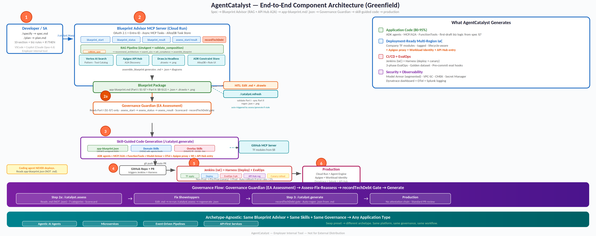
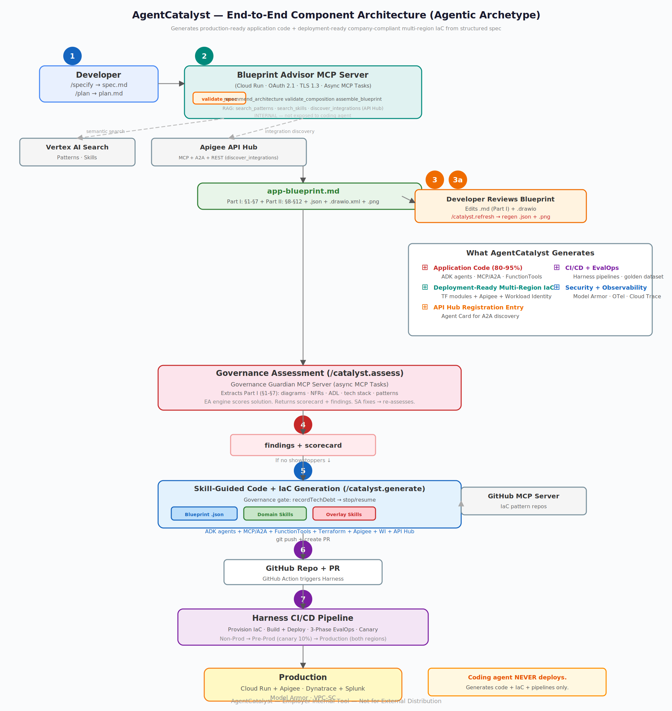
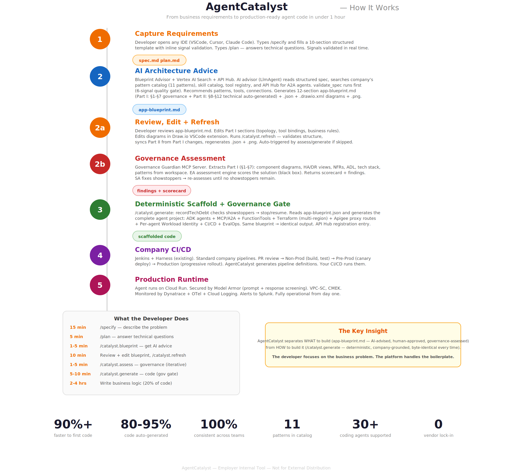
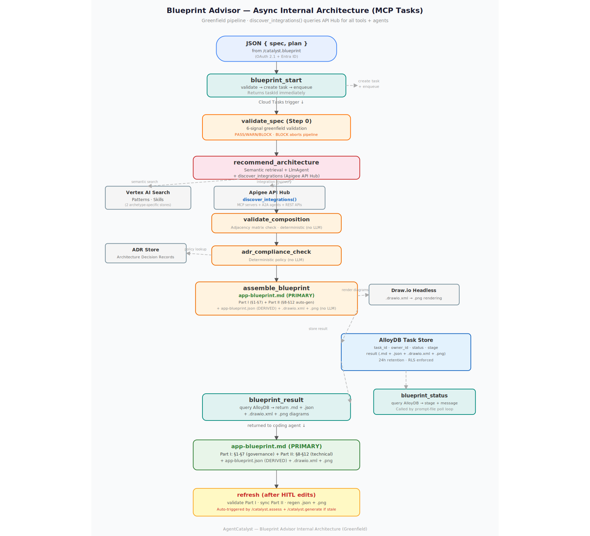
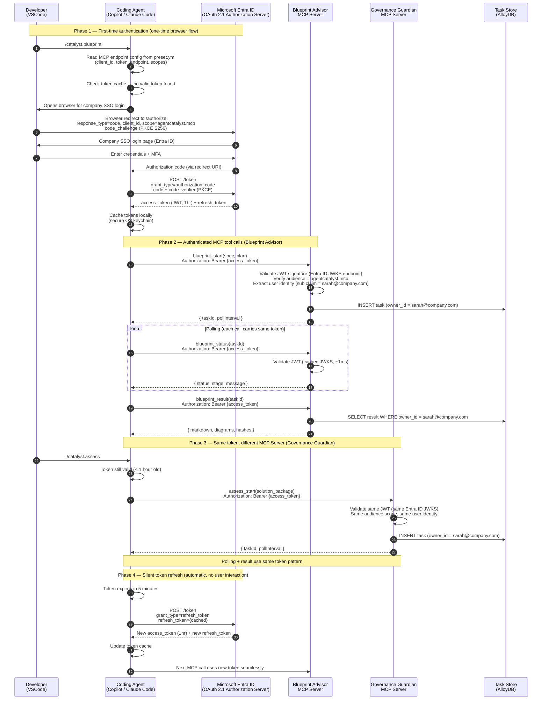

# AgentCatalyst — GA Architecture

**A spec-driven enterprise application development accelerator on Google Cloud Platform**
*GA-Only — all services SLA-backed, zero preview dependencies*

> **Note:** This document contains Mermaid.js diagrams in fenced code blocks. To render them as images, use a Mermaid-compatible viewer (VS Code with Mermaid Preview extension, GitHub, or mermaid.live). Standard markdown viewers will display the diagram source code instead.

---

## Executive Summary — For the SLT

### The problem

Every enterprise team building AI agents (or microservices, or data pipelines) today follows its own approach. Copilot helps write code faster, but it has no knowledge of company patterns, no understanding of compliance standards, and no ability to recommend architectures from organizational catalogs. The result: 50 teams produce 50 different implementations, 82 hours of compliance rework per use case, and 30+ POCs that never reach production.

### The solution: AgentCatalyst

AgentCatalyst is a spec-driven development accelerator with three core capabilities:

1. **Blueprint Advisor** — an LlmAgent exposed as an MCP Server that recommends architectures by searching company-curated catalogs via RAG. The developer's coding agent connects via MCP protocol, calls `blueprint_start(spec, plan)` to initiate an async task, polls for progress via `blueprint_status`, and retrieves the markdown blueprint via `blueprint_result` when complete. This async pattern (using MCP Tasks) is necessary because VS Code Copilot enforces a hard 10–15 second timeout on synchronous MCP tool calls, while the LlmAgent pipeline takes 15–60 seconds. The developer reviews and edits the blueprint — the human is always in control.

2. **Preset-based archetype adaptation** — each application type (agentic AI, microservice, data pipeline, API-first) is served by a self-contained preset with archetype-specific templates, catalogs, and skills. All presets share company overlay skills (Terraform, observability, CI/CD, security) maintained once by the platform team. New archetype = new preset. Zero platform changes.

3. **Skill-constrained code generation** — the coding agent (Copilot, Claude Code, Cursor) is constrained by three layers: the blueprint (WHAT), the archetype skill (HOW), and the overlay skills (MUST). Constitution.md encodes non-negotiable code generation rules. The coding agent generates a first draft of the complete application — including working business logic from structured rules in the spec — for the developer to review and make their own.

AgentCatalyst does NOT deploy agents. It generates code, infrastructure definitions, and CI/CD pipeline files — then commits everything to the developer's GitHub repo. The company's existing Jenkins + Harness pipelines take it to production.





### AgentCatalyst at a glance

| Activity | Without AgentCatalyst | With AgentCatalyst | Improvement |
|---|---|---|---|
| Requirements capture | 3–5 days (meetings + documents) | 2–4 hours (/specify template) | 90% faster |
| Architecture design | 1–2 weeks (manual research) | 1–5 minutes (Blueprint Advisor) | 99% faster |
| Code generation | 1–2 weeks (manual project setup) | 5–10 minutes (skill-guided) | 99% faster |
| Infrastructure as code | 3–5 days (manual Terraform) | Automatic (from blueprint) | 90% faster |

### Key principles

1. **Spec-driven, not prompt-driven.** Structured 10-section templates with business rules — not free-form chat prompts.
2. **AI-advised, human-decided.** The Blueprint Advisor recommends; the developer reviews and edits the blueprint. The human is always in control.
3. **Compliant by construction.** Company overlay skills teach the coding agent non-negotiable standards. Compliance is structural, not retrofitted.
4. **Archetype-agnostic.** Same platform, same flow, same overlay skills — regardless of whether you're building an AI agent, a microservice, a data pipeline, or an API.
5. **Generates, never deploys.** Code and pipeline definitions committed to GitHub. The company's CI/CD deploys.

**Supported coding agents:** Officially tested: **Copilot, Claude Code, Cursor**. Compatible (community-tested): Gemini CLI, Windsurf. Any Spec Kit-compatible coding agent should work — the preset and skills follow the agentskills.io standard.

### The ROI

| Metric | Value | Derivation |
|---|---|---|
| Per use case savings | **$39K (74%)** | $52.8K without → $13.8K with AgentCatalyst |
| Platform investment (Year 1) | **$51K** | Build $25K (250 hrs × $100) + GCP infra $12K ($1K/mo) + maintenance $14K (35 hrs/quarter) |
| Break-even | **2nd use case** | 2 × $39K savings = $78K > $51K platform cost |
| Enterprise investment (7 LOBs) | **$170K** | Platform $51K + LOB onboarding 7 × $17K ($119K) |
| Enterprise savings (210 use cases) | **$8.19M** | 210 × $39K per use case |
| Enterprise ROI (build-cost only) | **48×** | $8.19M savings / $170K build + onboarding investment |
| **Year 1 full TCO** | **$688K** | Platform build $51K + platform ops ~$400K (2 FTE) + EA curation ~$100K (0.5 FTE) + GCP infra ~$18K + LOB onboarding $119K |
| **Year 1 ROI (full TCO)** | **~12×** | $8.19M savings / $688K total investment. Year 2+ improves as build costs amortize |
| Each additional LOB | **$17K** to onboard |
| Time to first agent | **~3.5 weeks** (down from ~7.5 weeks) |

### Cost to build and operate

| Component | One-time build | Recurring |
|---|---|---|
| Pattern Knowledge Base (11 agentic patterns + Vertex AI Search) | ~120 hours (platform eng) | ~10 hours/quarter (catalog maintenance) |
| Blueprint Advisor MCP Server (LlmAgent + system prompt + RAG + golden dataset) | ~50 hours (platform eng) | ~5 hours/quarter (prompt tuning) |
| Company overlay skills (Terraform, observability, CI/CD, security, EvalOps) | ~80 hours (platform eng) | ~10 hours/quarter (version updates) |
| Each additional archetype preset | ~40 hours | ~5 hours/quarter |
| GCP infrastructure (Blueprint Advisor API layer + pipeline on Cloud Run, AlloyDB Task Store, Vertex AI Search, Arize Phoenix) | — | ~$500–1,500/month |

### Per use case cost comparison (both sides use Copilot)

| | Without AgentCatalyst (Copilot + published standards) | With AgentCatalyst (Copilot + skills + Blueprint Advisor) |
|---|---|---|
| **Build phase** | 446 hrs (requirements 60 + standards learning 24 + architecture 60 + code 100 + prompts 35 + infra/CI/CD/obs/security 82 + testing 60 + deploy 25) | 138 hrs (requirements 60 + spec/plan/biz rules 8 + Blueprint Advisor 0.1 + generate 1 + complex domain logic 20 + prompts 25 + testing 15 + PR 8) |
| **Compliance remediation** | 82 hrs (EA review 16 + security review 16 + rework 50) | 0 hrs (compliant by construction — overlay skills enforce company standards; constitution.md constrains code generation) |
| **Total** | **528 hrs / $52.8K / ~7.5 weeks** | **138 hrs / $13.8K / ~3.5 weeks** |
| **Savings** | | **$39K per use case (74%)** |

† If business rules are NOT captured in the spec, add $5.5K per use case (55 hrs) for manual business logic implementation → $19.3K / 193 hrs per use case. Enterprise savings drop from $8.0M to $6.85M but ROI remains 36×.

Note: Requirements gathering (60 hrs) is identical on both sides. AgentCatalyst does not reduce the time to gather requirements — it reduces the time to go from requirements to production-ready code.

### Application archetypes — one platform, many application types

AgentCatalyst achieves archetype-agnosticism through preset-swapping, not meta-skills or signed contracts:

| Archetype | Preset Name | Spec Template | Catalog | Domain Skill | Status |
|---|---|---|---|---|---|
| **Agentic AI** | `agentcatalyst` | agent-spec-template.md | 11 ADK patterns | `adk-agents` | **Phase 1 — active** |
| **Microservice** | `agentcatalyst-microservice` | service-spec-template.md | Microservice patterns | `springboot-service` / `fastapi` | **Phase 2 — planned** |
| **Data Pipeline** | `agentcatalyst-pipeline` | pipeline-spec-template.md | ETL/ELT patterns | `beam` / `dataflow` | **Phase 3 — planned** |
| **API-First** | `agentcatalyst-api` | api-spec-template.md | API patterns | `openapi` / `graphql` | **Phase 4 — planned** |

All presets share the same company overlay skills: Terraform, Dynatrace, Jenkins/Harness, security, EvalOps. New archetype = new preset + new catalog + new domain skill. Zero overlay changes. Zero platform changes.

### GA-only commitment

Every GCP service used by AgentCatalyst is Generally Available with SLA backing. No preview APIs. No preview services. Deployable in any GCP project, including locked-down enterprise environments.

---

## End-to-end thread (read this first)

Before diving into the five layers, here is the complete flow as a narrative. No jargon, no architecture diagrams — just what happens step by step from the developer's perspective.

A developer is asked to build an AI agent that processes auto insurance claims (FNOL). She opens VSCode with her preferred coding agent — Claude Code, in her case — and installs the AgentCatalyst preset: `specify preset add agentcatalyst-enterprise`. This installs a structured spec template, a plan template, custom commands (`/catalyst.blueprint`, `/catalyst.assess`, `/catalyst.generate`), memory files with company reference material, company overlay skills, and an `adk-agents` domain skill.

She types `/specify`. The preset presents a structured template with ten sections — Business Context, Workflow Step by Step, Regulatory Requirements, Data Systems, External Partners, What We Own, Business Rules, Transformation Rules, Error Handling, and Acceptance Criteria. She fills it in using plain English, describing the step-by-step workflow ("first the customer calls, then the system classifies severity, then in parallel it enriches from three sources..."), the data systems involved, the external partner APIs, and her proprietary business logic as structured IF/THEN conditions. This takes about 20 minutes. The result is `spec.md` — a structured requirements document saved in her workspace.

She types `/plan` and answers a handful of technical questions — GCP region, LLM model, CI/CD tools, Terraform module source. This takes 5 minutes. The result is `plan.md`.

She types `/catalyst.blueprint`. This custom command connects to the **Blueprint Advisor MCP Server** — an LlmAgent running on Cloud Run, exposed as an MCP Server. Her coding agent calls `blueprint_start` via MCP protocol with her `spec.md` and `plan.md` as input. The call returns a task ID in under 2 seconds — the heavy work runs in the background. She doesn't need to know what happens inside the server — but here's what does:

The Blueprint Advisor reads her spec's natural language signals. "First the customer calls, then the system classifies severity" tells it Sequential. "In parallel it enriches from three sources" tells it Parallel. "Loop until quality score exceeds 0.85" tells it Loop. "Route high-severity to a human adjuster" tells it HITL. It searches the company's pattern catalog and skill catalog via Vertex AI Search (semantic retrieval), then queries **Apigee API Hub** to discover available integrations — MCP servers, A2A agents, and REST APIs — in a single call — "body shop — they operate their own" triggers an API Hub query for `type=a2a_agent, capabilities CONTAINS 'body-shop-estimate'`, finding the deployed body-shop-agent (v2.3, active). It applies LLM reasoning guided by a company-curated system prompt and assembles a recommendation. While this runs (15–60 seconds), her coding agent polls `blueprint_status` every 10 seconds and reports progress in the Chat pane: "Searching pattern catalog...", "Discovering A2A agents...", "Reasoning about architecture...", "Assembling blueprint...".

When the background pipeline completes, the coding agent calls `blueprint_result` and receives a JSON response containing the markdown content, a machine-readable `app-blueprint.json`, base64-encoded diagram PNGs and editable `.drawio.xml` source files. It writes all files to the workspace:

- **`app-blueprint.md`** — the PRIMARY artifact. Human-readable structured markdown organized in TWO parts:
  - **Part I (§1-§7): Architecture Review** — What Governance Guardian assesses. Executive summary, tech stack, architecture decisions, NFRs, patterns & agent topology, component architecture (+ PNG diagram), HA/DR views (+ PNG diagrams). The developer actively edits this part.
  - **Part II (§8-§12): Technical Specification** — What code generation needs. Tool & integration configs, business rules & FunctionTools, security & identity, CI/CD & EvalOps, observability. Auto-generated by Blueprint Advisor from Part I + server-side knowledge (API Hub, company standards, NFR template). Developer overrides specific values if needed.
- **`app-blueprint.json`** — the DERIVED artifact. Machine-readable JSON parsed from ALL 12 sections of the `.md`. Consumed by `/catalyst.generate` for deterministic code generation. **Never edit this file directly** — it is regenerated from `.md` by `/catalyst.refresh` (or auto-regenerated before `/catalyst.assess` and `/catalyst.generate`).
- **`diagrams/*.drawio.xml`** — editable diagram sources. Open in Draw.io VSCode extension to edit visually.
- **`diagrams/*.png`** — rendered from `.drawio.xml` by Draw.io headless export. Referenced in `.md` via ``. Regenerated by `/catalyst.refresh`.
- **Diagram files** — `.drawio.xml` (editable in Draw.io VSCode extension) + `.png` (rendered by Draw.io headless, inline in markdown)

The markdown file describes WHAT to build: 5 agents (Coordinator + Sequential + Parallel + Loop + HITL), 3 MCP servers (BigQuery, Cloud SQL, Vertex AI Search), 3 A2A agents (body shop, rental car, police report), 3 FunctionTool implementations (severity classifier, coverage calculator, notification sender — with her IF/THEN business rules included), infrastructure settings, EvalOps configuration, and a golden dataset derived from her acceptance criteria. Component diagrams are rendered as inline PNG images with editable `.drawio.xml` alongside.  NFRs, ADL, and tech stack are tables. Each recommendation is tagged with a confidence level (high/medium/low).

She reviews the markdown in her editor — the component diagram renders inline in VSCode's markdown preview, all tables are readable. The Blueprint Advisor assigned Cloud SQL to the wrong agent — she edits the table directly, changing `assigned_to: extract_details` to `assigned_to: fnol_coordinator`. She saves. Her coding agent calls `validate_composition` via MCP — a deterministic check that her edited pattern tree is valid (e.g., LoopAgent cannot nest inside ParallelAgent). It passes. Then `assemble_blueprint` finalizes the markdown **and regenerates `app-blueprint.json`** from the edited sections (the JSON is always derived from the `.md` — never edited directly). If she needs to edit the component diagram, she opens the `.drawio.xml` file in the Draw.io VSCode extension — edits visually, saves, and runs `/catalyst.refresh` to regenerate the `.png` and validate consistency with the `.md`. Updated diagrams are picked up automatically on her next `/catalyst.assess` run.

### Spec Signal Validation (Quality Gate in Blueprint Advisor)

Before the RAG pipeline runs, the Blueprint Advisor validates that the spec contains the signals needed for high-quality architecture retrieval. This is the first step inside `blueprint_start` — a quality gate, not a reasoning step.

**Greenfield Signal Validation Matrix:**

| Section | Signal checked | Why it matters | Pass | Warn | Block |
|---|---|---|---|---|---|
| §2 Workflow | Ordering words: "first", "then", "in parallel", "loop until", "route to human" | Determines pattern retrieval (Sequential, Parallel, Loop, HITL). Without ordering words, the RAG pipeline can't select the right patterns. | ≥3 ordering words | 1-2 ordering words | 0 ordering words |
| §4 Data Systems | Named systems: "Cloud SQL", "BigQuery", "AlloyDB", "existing REST API" | Determines data platform retrieval and MCP server matching. "A database" matches everything; "Cloud SQL" matches one pattern. | All systems named specifically | Some vague references | §4 empty or all vague |
| §5 External Partners | "They operate their own system" signal | Determines A2A vs MCP decision. Missing this → pipeline defaults to MCP when A2A is correct. | Each partner has own-system flag | Partners listed but no flag | §5 empty (may be legitimate) |
| §7 Business Rules | IF/THEN format | Seeds FunctionTool first-drafts. Prose like "handle complex claims" can't be converted to code. | All rules in IF/THEN | Mixed format | §7 empty or all prose |
| §8 Sensitive Data | PII/PHI/financial classification | Triggers Model Armor callback generation. Missing → agents handle PII without screening. | Specific classifications | Vague "some sensitive data" | §8 empty when §4 has user-facing systems |
| §10 Acceptance Criteria | Measurable metrics: "< 5 min", "> 95% accuracy" | Seeds golden dataset for EvalOps. "Make it faster" is unmeasurable. | ≥3 measurable criteria | 1-2 measurable + vague | 0 measurable criteria |

**Validation output:** A `spec_quality_score` (0-100) with per-section status (PASS/WARN/BLOCK). If any section is BLOCK, `blueprint_start` returns immediately with specific guidance ("§2 has no ordering words — add 'first', 'then', 'in parallel' to describe the workflow sequence"). If WARN, the pipeline continues but attaches warnings to the blueprint output with a lower confidence score. If all PASS, the pipeline runs at full confidence.

**Two-layer validation architecture (local + server-side):**

Signal validation runs at TWO layers — a fast local layer during spec capture, and a thorough server-side layer before the RAG pipeline:

```
Layer 1: LOCAL (SpecKit Preset — during /specify capture)
  ┌─────────────────────────────────────────────────────────┐
  │ SpecKit preset template includes inline validation       │
  │ instructions. The coding agent validates EACH section    │
  │ as the developer responds — catching issues in real time.│
  │                                                          │
  │ §2 captured → check ordering words → ✅/⚠️/❌            │
  │ §4 captured → check specific system names → ✅/⚠️       │
  │ §5 captured → check "own system" flags → ✅/⚠️          │
  │ §7 captured → check IF/THEN format → ✅/⚠️/❌           │
  │ §10 captured → check measurable criteria → ✅/⚠️/❌     │
  │                                                          │
  │ Summary validation → score → write spec.md               │
  └─────────────────────────────────────────────────────────┘
                         ↓ spec.md
Layer 2: SERVER-SIDE (Blueprint Advisor — Step 0 of blueprint_start)
  ┌─────────────────────────────────────────────────────────┐
  │ validate_spec runs inside the MCP Server with access to: │
  │ - Vertex AI Search (verify data systems have patterns)   │
  │ - Apigee API Hub (verify A2A agents exist and are active)│
  │ - ADR Store (verify spec decisions comply with ADRs)     │
  │ - Cross-section consistency checks                       │
  │                                                          │
  │ Returns: spec_quality_score + per-section status          │
  │ BLOCK → return immediately. WARN → continue with flags.  │
  └─────────────────────────────────────────────────────────┘
                         ↓
  RAG pipeline (recommend_architecture → discover_integrations → adr_compliance → assemble)
```

**Why two layers:** Local validation catches OBVIOUS issues during capture (missing ordering words, vague system names, prose business rules) — the developer fixes them immediately instead of discovering them 20 minutes later when `blueprint_start` returns a low-quality result. Server-side validation catches COMPLEX issues that require data access (does the named data system have a pattern in the catalog? is the A2A agent actually deployed? does the spec violate an ADR?).

**SpecKit preset template — inline validation instructions:**

The `/specify` SpecKit preset includes validation rules directly in its template. The coding agent reads these rules and executes them during capture:

| Section | SpecKit preset validates | Mechanism |
|---|---|---|
| §2 Workflow | Ordering words present (≥3 required: "first", "then", "in parallel", "loop until", "route to human") | Preset template instructs coding agent to scan response for ordering words and report findings immediately |
| §4 Data Systems | Specific system names (not "a database") | Preset template instructs: "If the developer says 'a database' or 'some storage', ask which specific system" |
| §5 External Partners | "Own system" flag per partner | Preset template instructs: "For each partner, ask: does [partner] operate their own system?" |
| §7 Business Rules | IF/THEN format | Preset template instructs: "If rules are prose, ask to rephrase as IF condition THEN action" |
| §8 Sensitive Data | Cross-check with §4 | Preset template instructs: "If §4 has user-facing systems but §8 is empty, warn" |
| §10 Acceptance Criteria | Measurable metrics | Preset template instructs: "If criteria like 'fast' or 'accurate', ask for measurable: '< 5 min', '> 95%'" |

**RAG pipeline with validation (both layers):**
```
/specify (SpecKit preset — Layer 1 local validation during capture)
  → spec.md written with validated signals
  
/catalyst.blueprint
  → blueprint_start(spec, plan)
    → validate_spec (Layer 2 server-side — checks against catalogs, API Hub, ADR Store)
    → recommend_architecture (RAG retrieval — quality depends on signal quality)
    → discover_integrations (API Hub query — MCP servers + A2A agents)
    → adr_compliance_check
    → assemble_blueprint
```

Before generating code, she runs the governance check. She edits §5 (adds a fraud-check agent) and opens `component-architecture.drawio.xml` in Draw.io to add the box. She types `/catalyst.refresh` — it validates .md↔.drawio consistency, syncs Part II (adds new rows to §8, §10, §12 for the new agent), and regenerates .json + .png. **Skip-refresh safety:** If `/catalyst.assess` detects that `app-blueprint.md` or any `.drawio.xml` file has been modified since the last `/catalyst.refresh` (by comparing file timestamps with `.json` timestamp), it auto-triggers a lightweight refresh as Step 0 — validating .md structure, checking .md↔.drawio consistency, and regenerating `.json` + `.png`. The developer sees: "Stale .json detected — auto-refreshing before assessment..." This means `/catalyst.refresh` is OPTIONAL as a standalone command (for detailed validation feedback) but AUTOMATIC before assessment and code generation. The developer can never accidentally assess or generate from stale files.

She types `/catalyst.assess`. The coding agent reads `app-blueprint.md` (NOT `app-blueprint.json` — the Governance Guardian assesses the human-readable architecture, not the machine-readable JSON) and extracts the 7 governance sections from Part I — executive summary (§1), tech stack (§2), architecture decision log (§3), NFRs (§4), patterns & agent topology (§5), component architecture diagram PNG from `` reference (§6), and HA/DR lifecycle diagrams (§7) — packages them as a **solution_package** (an ephemeral JSON transport payload sent over MCP — this is NOT the same as the persisted `app-blueprint.json` file), and sends them to the **Governance Guardian MCP Server** using the same async pattern as the Blueprint Advisor (`assess_start` → poll `assess_status` → `assess_result`). The `app-blueprint.json` file in the workspace is not read, not sent, and not modified during governance assessment — it exists solely for `/catalyst.generate` to consume later. While the EA assessment engine evaluates her solution (a black box to AgentCatalyst — the EA office owns all the assessment logic), she sees progress in the Chat pane: "Evaluating architecture compliance...", "Checking pattern adherence...", "Scoring HA/DR readiness...".

The assessment returns a scorecard and findings. One showstopper: her Aurora PostgreSQL has no cross-region DR strategy, violating ADR-205. Two non-critical findings: WAF rules not using the enterprise managed rule group, and Angular 17 not yet on the approved tech radar. She fixes the showstopper — adds Aurora Global Database with a us-west-2 read replica to her Terraform and updates the HA/DR view in her drawio. She runs `/catalyst.assess` again. This time: no showstoppers, score 88/100. The two remaining findings are flagged as acceptable tech debt.

She types `/catalyst.generate`. **Staleness check:** Before the 18-step generation pipeline runs, the coding agent makes one final call to the Governance Guardian — `recordTechDebt`. This tool checks whether any showstopper findings remain from her latest assessment. None do — the two remaining findings are classified as tech debt, recorded in the governance database (TD-2026-0142), and the Governance Guardian returns `{ signal: "resume" }`. The coding agent reports: "Governance gate passed. Tech debt recorded. Generating code..." and proceeds.

The coding agent reads the blueprint and generates all the code — but it doesn't guess HOW to write the code. It has **skills** installed that teach it the right way:

- **`adk-agents` skill** teaches it how to write correct ADK Python code — the right import paths, the right class constructors, the right way to wire tools to agents.
- **Company overlay skills** teach it which Terraform modules to use (with pinned versions), how to configure Dynatrace observability, how to generate Jenkins + Harness pipeline definitions (NOT deploy directly), and how to generate Model Armor callbacks.
- **`constitution.md`** encodes non-negotiable rules: never deploy directly, always use company Terraform modules, always generate pre-commit evaluation hooks. These are coding agent constraints, not meta-skills or decision frameworks.

The result: a complete project in her workspace — 6 agent class files, 3 MCP connections, 3 A2A clients, 3 FunctionTool files with first-draft business logic (the IF/THEN conditions from her spec are already implemented as working Python code), Model Armor callbacks, complete Terraform, Dynatrace config, Jenkins + Harness pipeline definitions, a pre-commit evaluation hook, Phoenix tracing config, a golden dataset derived from her acceptance criteria, and a 3-phase Harness evaluation pipeline. Every file follows company standards because the company overlay skills taught the coding agent those standards.

She opens `app/tools/severity_classifier.py` and reviews the first draft of generated business logic — the IF/THEN conditions she authored in the spec are already implemented as working Python code. This is her starting point, not a black box. She refines the logic, adds one edge case the spec didn't cover, and writes system prompts for each agent. Because she captured business rules in the spec, the manual work is only ~5–10% — primarily system prompts, eval dataset curation, and truly proprietary algorithms not expressible as structured IF/THEN rules.

She commits. The pre-commit hook runs — 5 evaluation sets execute in under 60 seconds via the Vertex AI Evaluation SDK. All metrics pass. She pushes and opens a PR. Her team reviews it — the generated code looks familiar because every AgentCatalyst project follows the same company patterns.

After the PR is merged, Jenkins runs Terraform to provision the infrastructure. Then Harness deploys the agent through the 3-phase evaluation pipeline: Phase A (Arize quality gates), Phase B (AutoSxS baseline comparison against the golden dataset), Phase C (2 edge cases routed to HITL triage where a reviewer approves them). After evaluation passes, Harness promotes through Non-Prod → Pre-Prod (canary at 10%) → Production (progressive rollout). If anything breaks, Harness rolls back automatically.

She never deployed from her laptop. She never provisioned a GCP resource manually. She never wrote a Dockerfile. All of that was either generated by the coding agent (Terraform, pipeline definitions, evaluation infrastructure) or handled by the company's CI/CD. The 80-95% was handled by the coding agent guided by skills. When business rules are authored in the spec, even FunctionTool bodies are generated as a first draft — the developer reviews and makes the code their own.

**Total time from "I need an FNOL agent" to generated code committed to GitHub: under 2 hours.** The remaining 2–4 hours are spent reviewing generated business logic, writing system prompts, curating eval datasets, and adding edge cases. Without AgentCatalyst, this entire process takes 7–8 weeks.

**Now imagine** a different developer on another team who needs to build a FastAPI microservice for order management. He installs the `agentcatalyst-microservice` preset instead. His `/specify` template has different sections — Service Purpose, API Contracts, Dependencies, Data Model. His Blueprint Advisor searches a different pattern catalog — microservice patterns instead of agent patterns. His coding agent loads a `fastapi` skill instead of an `adk-agents` skill. But the **company overlay skills are the same** — same Terraform modules, same Dynatrace config, same Jenkins/Harness pipelines, same security standards. The microservice follows the same company patterns as the agent. The platform team maintains one set of overlay skills, and every application type benefits.

### Brownfield: Adding an agent to an existing system

Not every agent starts from scratch. When adding an AI agent to an existing system with live APIs, production databases, and code you can't modify, the developer writes the spec differently. In the **External Integrations** section, she writes: "Loan origination REST API — WE operate this, EXISTING endpoints at /api/v2/applications. The agent MUST use these existing endpoints." In the **Internal Capabilities** section: "Credit score lookup — EXISTING internal function at /api/v2/credit-check."

The Blueprint Advisor reads phrases like "EXISTING REST API" and "MUST use these existing endpoints" and recommends FunctionTool wrappers around the existing REST endpoints — not new MCP connections or new services. The generated code wraps the existing API with thin Python functions. **The agent adapts to the existing system — never the other way around.** No existing database schemas, API contracts, or source code are modified.

**Architecture infographic:**



---

## Technology Stack

| Component | Details |
|---|---|
| Agent Framework | Google ADK — Python |
| Runtime (API layer) | Cloud Run Service (GA) — hosts the MCP API layer for Blueprint Advisor |
| Runtime (Pipeline) | Cloud Run Jobs (GA) — runs the Blueprint Advisor LlmAgent pipeline (no timeout) |
| Task Store | AlloyDB (GA) — async task state for MCP Tasks lifecycle (24h TTL) |
| Task Queue | Cloud Tasks (GA) — enqueues pipeline jobs from `blueprint_start` |
| Spec Workflow | GitHub Spec Kit with AgentCatalyst preset (archetype-specific) |
| Blueprint Advisor | LlmAgent exposed as MCP Server. API layer on Cloud Run Service (async via MCP Tasks). Pipeline on Cloud Run Jobs. Task state in AlloyDB. Enqueue via Cloud Tasks. |
| Discovery | Vertex AI Search (archetype-specific catalogs: patterns, skills) + **Apigee API Hub** (single discovery surface: MCP servers + A2A agents + REST APIs) |
| IaC | Terraform + company TF modules via GitHub MCP Server |
| Security | Model Armor (standard), DLP, Secret Manager, SPIFFE, VPC-SC, CMEK |
| Gateway | Apigee Runtime Gateway (GA) |
| Observability | OTel → Dynatrace (APM) + Splunk (SIEM) + Arize Phoenix (traces) + Cloud Logging |
| Evaluation | Arize SaaS + Vertex AI Eval SDK + AutoSxS + HITL triage |
| CI/CD | Jenkins (infrastructure plane) + Harness (application plane + 3-phase EvalOps) |
| Source Control | GitHub + GitHub MCP Server for code commit |

---

## Five-Layer Architecture

```
Layer 1 — SPEC CAPTURE         /specify → spec.md, /plan → plan.md
Layer 2 — ARCHITECTURE ADVISORY Blueprint Advisor MCP Server → app-blueprint.md
Layer 3 — SKILL-GUIDED GEN     /catalyst.generate → complete project
Layer 4 — COMPANY CI/CD        Jenkins (infra) + Harness (deploy + EvalOps)
Layer 5 — RUNTIME & OPERATE    Cloud Run + Apigee + Dynatrace + Splunk
```

### Layer 1 — Spec Capture

> For step-by-step walkthroughs of spec writing (greenfield FNOL + brownfield microservice), see the Developer Guide, Sections 2-3. For spec writing tips, see Developer Guide, Section 4.

The developer installs the AgentCatalyst preset and runs `/specify` + `/plan`. The preset is archetype-specific — an agentic preset captures workflow ordering words and agent boundaries, a microservice preset captures API contracts and data models.

The spec template has 10 sections (6 original + 4 business logic sections added in v2):

| Section | Purpose | Impact on code generation |
|---|---|---|
| Business Problem | Context and value proposition | Informs Blueprint Advisor recommendations |
| Workflow | Step-by-step with ordering words | Blueprint Advisor maps to patterns |
| Data Sources | Data systems with workload types | Blueprint Advisor assigns MCP connections |
| External Integrations | Partner services | Blueprint Advisor assigns A2A or FunctionTool wrappers |
| Internal Capabilities | Proprietary logic | Blueprint Advisor flags as FunctionTool implementations |
| Infrastructure | GCP region, compliance, networking | Maps to Terraform and security config |
| **Business Rules** | Structured IF/THEN per decision point | Coding agent generates first-draft business logic |
| **Transformation Rules** | Field mappings and formulas | Coding agent generates data transformation functions |
| **Error Handling** | Timeout/retry per dependency | Coding agent generates try/catch with circuit breakers |
| **Acceptance Criteria** | GIVEN/WHEN/THEN assertions | Coding agent generates golden dataset + evalsets |

When business rules are in the spec, code generation reaches 90-95%. When omitted, 80% scaffolding with stubs.

### Layer 2 — Architecture Advisory (Blueprint Advisor MCP Server)



The Blueprint Advisor is an LlmAgent running on Cloud Run, **exposed as an MCP Server**. The coding agent connects via MCP protocol — this is the only universally compatible method (GitHub Copilot cannot make HTTP calls or run shell commands, but all major coding agents support MCP).

**Async invocation via MCP Tasks:** VS Code Copilot enforces a hard 10–15 second timeout on synchronous MCP tool calls. The Blueprint Advisor's internal pipeline (2 RAG queries + API Hub discovery + LLM reasoning + validation + assembly) takes 15–60 seconds depending on spec complexity. A synchronous call would be killed by Copilot before it completes. The Blueprint Advisor therefore uses the **MCP Tasks** async primitive (spec revision 2025-11-25): the coding agent starts a background task, polls for progress, and retrieves the result when complete. Each individual MCP call completes in under 2 seconds — well within any coding agent's timeout window.

**MCP Tools exposed to the coding agent:**

| MCP Tool | Type | Latency | Purpose |
|---|---|---|---|
| `blueprint_start(spec, plan)` | **ASYNC START** | < 2 seconds | Validates input, creates a background task in the Task Store, enqueues the pipeline via Cloud Tasks, returns `taskId` + `pollInterval` immediately |
| `blueprint_status(taskId)` | **POLL** | < 1 second | Returns current pipeline stage (searching / reasoning / validating / assembling) and a progress message for display to the developer |
| `blueprint_result(taskId)` |
| `refresh(blueprint_md, drawio_files[])` | **SYNCHRONOUS** | < 10 seconds | NEW — Called after developer edits `.md` and/or `.drawio.xml`. Does 3 things: (1) VALIDATE: .md Part I completeness (§1-§7) + .md↔.drawio consistency (agents in diagram match §5 topology). (2) SYNC Part II: auto-generates/updates §8-§12 from Part I changes (new agents get new rows in §8, §10, §12; existing manual overrides preserved). (3) REGENERATE: `.json` from all 12 sections + `.png` from `.drawio.xml` via Draw.io headless. Returns: structural_report, sync_report, updated .json + .png files. Also auto-triggered as Step 0 of `/catalyst.assess` and `/catalyst.generate` if stale files detected. |
| `blueprint_result(taskId)` | **RETRIEVE** | < 1 second | Returns JSON with: `markdown` (full app-blueprint.md content, 12 sections), `diagrams` (array of base64-encoded PNGs + `.drawio.xml` source), `spec_hash`, `plan_hash`, `blueprint_hash`. The prompt file writes the .md and all diagram files to the workspace. |
| `validate_composition(pattern_tree)` | **DETERMINISTIC** | < 1 second | Checks developer's edited pattern selections against adjacency matrix. Returns valid/invalid + reason. Called after developer edits the blueprint |
| `assemble_blueprint(selections, spec, plan)` | **DETERMINISTIC** | < 1 second | Rebuilds final `app-blueprint.md` from validated selections + **regenerates `app-blueprint.json`** from the `.md` sections (machine-readable derived artifact). Diagram rendering via **Draw.io headless export** (→ `.drawio.xml` source + `.png` rendered). No LLM involved. Called after validation passes, and auto-called by `/catalyst.generate` if `.md` was edited since last assembly. |

The first three tools implement the async MCP Tasks pattern. The last two are called after the developer has reviewed and edited the blueprint — they remain synchronous because they are fast and deterministic.

**Task lifecycle:**

| Status | Meaning |
|---|---|
| `accepted` | Task record created, queued for execution |
| `working` | Pipeline executing (substage: searching / reasoning / validating / assembling) |
| `completed` | Blueprint + confidence scores available for retrieval |
| `failed` | Structured error (LlmAgent failure, RAG timeout, composition invalid) |

Task records are stored in AlloyDB with a 24-hour TTL. This allows the developer to retrieve a result even after closing and reopening VSCode.

**Blueprint Advisor versioning:**

Every markdown blueprint includes version metadata in its header:

```yaml
# Generated by: blueprint-advisor/v2.3.1
# System prompt: v1.8 (SHA: abc123)
# Pattern catalog: 2026-05-10 (11 patterns)
# Timestamp: 2026-05-10T14:30:00Z
```

This enables reproducibility: if a developer needs to understand why a recommendation was made, the platform team can re-invoke the same Blueprint Advisor version with the same spec. The Operations Runbook (Section 9) covers the deployment procedure for new versions, including maintaining 2 versions in production for rollback.

**Internal to the MCP Server (NOT exposed to the coding agent):**

| Internal Component | Purpose |
|---|---|
| Blueprint Advisor LlmAgent | RAG + LLM reasoning guided by company system prompt |
| `search_patterns()` | RAG tool — queries Pattern Catalog in Vertex AI Search |
| `search_skills()` | RAG tool — queries Skill Catalog in Vertex AI Search |
| `discover_integrations()` | Queries **Apigee API Hub** for MCP servers, A2A agents, and REST APIs in a single call. Returns endpoint, auth, capabilities, Agent Card URL, lifecycle status. Priority: A2A (reuse deployed agent) > MCP (use existing tool) > Build (create new). |
| Company system prompt | Curated best practices, constraints, preferences. → *See Developer Guide "System Prompt Template — Greenfield Blueprint Advisor" for the full system prompt.* |
| Vertex AI Search connections | 2 archetype-specific data stores (patterns, skills) |
| **Apigee API Hub connection** | **Single discovery surface: MCP servers + A2A agents + REST APIs. Queried by `discover_integrations()` during the pipeline. Source of truth for all tool and agent registrations.** |

**MCP protocol version:** The Blueprint Advisor MCP Server implements **MCP protocol version 2025-11-25** (which introduced the Tasks primitive for async operations). Coding agent compatibility:

| Coding Agent | MCP Version Supported | Tasks Support | Status |
|---|---|---|---|
| GitHub Copilot | 2025-11-25 | ✅ via prompt-file polling | ✅ Tested |
| Claude Code | 2025-11-25 | ✅ native | ✅ Tested |
| Cursor | 2025-11-25 | ✅ via prompt-file polling | ✅ Tested |
| Gemini CLI | 2025-11-25 | ✅ via prompt-file polling | ⚠️ Community-tested |
| Windsurf | 2025-11-25 | ✅ via prompt-file polling | ⚠️ Community-tested |

For coding agents without native MCP Tasks support (most IDE-based agents), the `/catalyst.blueprint` prompt file drives the start → poll → result loop. The LLM naturally handles the polling — each tool call is a fast round-trip.

The coding agent calls `blueprint_start` ONCE (which kicks off the background pipeline), then polls `blueprint_status` until complete, then retrieves the result. The coding agent has no direct access to Vertex AI Search, no access to the company system prompt, and no ability to invoke the LlmAgent directly. All intelligence lives on the server side.

**`/catalyst.blueprint` command flow (async via MCP Tasks):**

1. Coding agent calls `blueprint_start(spec, plan)` via MCP → returns `taskId` in < 2 seconds
2. Background pipeline starts on Cloud Run Jobs (no timeout constraint):
   - Runs Blueprint Advisor LlmAgent internally (RAG search → LLM reasoning → recommendations)
   - Validates composition against adjacency matrix
   - Assembles blueprint from validated selections
   - Stores result in AlloyDB Task Store
3. Coding agent polls `blueprint_status(taskId)` every 10 seconds via MCP (< 1 second each)
   - Reports progress to developer in Chat pane: "Searching pattern catalog...", "Reasoning about architecture...", etc.
4. When status returns `completed`, coding agent calls `blueprint_result(taskId)` via MCP
5. Recommendations with confidence scores returned in < 1 second
6. Coding agent saves them as `app-blueprint.md`
7. Developer reviews in markdown editor, edits selections
8. Coding agent calls `validate_composition(edited_pattern_tree)` — deterministic pass/fail (< 1 second)
9. Coding agent calls `assemble_blueprint(validated_selections, spec, plan)` — deterministic blueprint assembly (< 1 second)
10. Result: final `app-blueprint.md` written to workspace

**Prompt-file orchestration:** The `/catalyst.blueprint` prompt file drives the start → poll → result loop without custom client code. The LLM naturally handles the polling — each tool call is a fast round-trip within any coding agent's timeout window. The developer sees progress messages in the Chat pane throughout.

**Offline / disconnected fallback:**

If the Blueprint Advisor MCP Server is unreachable (VPN down, server maintenance, network issue), the developer is NOT blocked. Two fallback paths exist:

1. **Manual YAML authoring:** The developer writes `app-blueprint.md` manually using the schema reference (see Appendix A.10 for a complete example). The coding agent can still run `/catalyst.generate` against a hand-written blueprint — it only needs `app-blueprint.md`, not the MCP Server.

2. **Cached recommendation:** If the developer previously received a recommendation for a similar spec, they can copy and modify that YAML. The `validate_composition` and `assemble_blueprint` MCP tools are lightweight, synchronous, and may still be available even when the background pipeline is down (they don't depend on Vertex AI Search or LLM reasoning).

3. **Stale task retrieval:** If a `blueprint_start` succeeded but the developer lost connectivity before calling `blueprint_result`, the result remains in the Task Store for 24 hours. Reconnecting and calling `blueprint_result(taskId)` retrieves the completed blueprint.

The Developer Guide (Section 5) includes the complete schema and an annotated example that developers can use as a starting template for manual authoring

**The 11 agentic patterns (Phase 1 catalog):**

| Pattern | ADK Class | When Blueprint Advisor selects it |
|---|---|---|
| Coordinator | LlmAgent | Root orchestrator — spec describes multiple specialized sub-agents |
| Sequential Pipeline | SequentialAgent | "First... then... finally" ordering |
| Parallel Fan-out | ParallelAgent | "Simultaneously" or "in parallel" |
| Loop / Iterative Refinement | LoopAgent | "Repeat until" or "refine until threshold" |
| Human-in-the-Loop | LlmAgent + callback | "Route to human" or "requires approval" |
| RAG / Retrieval-Augmented | LlmAgent + Vertex AI Search | "Search documents" or "knowledge base" |
| ReAct (Reason + Act) | LlmAgent + tools | Complex reasoning with tool use |
| Event-Driven | LlmAgent + Pub/Sub | "When event occurs" or "triggered by" |
| Supervisor | LlmAgent + delegation | "Oversee" or "quality check" |
| Critic / Evaluator | LlmAgent | "Validate" or "score quality" |
| Custom Tool Agent | LlmAgent + FunctionTool | Proprietary logic — domain-specific |

### Blueprint Advisor MCP Server — Security

The Blueprint Advisor MCP Server receives spec.md content that may contain proprietary business rules, competitive intelligence, partner names, and regulatory details. The following security controls are required:

**Authentication — OAuth 2.1 with Entra ID:**

Both the Blueprint Advisor and Governance Guardian MCP Servers require OAuth 2.1 authentication via the company's **Microsoft Entra ID** (formerly Azure AD) identity provider. The coding agent authenticates the developer once, then attaches the access token to every MCP tool call. The token is validated by both MCP Servers — a developer authenticated for the Blueprint Advisor does NOT need to re-authenticate for the Governance Guardian (same token, same IdP, same audience scope).

The following sequence diagram shows the complete authentication flow from the developer's first `/catalyst.blueprint` command through token acquisition to authenticated MCP tool calls on both servers:



**Key authentication design decisions:**

| Decision | Rationale |
|---|---|
| **OAuth 2.1** (not 2.0) | OAuth 2.1 mandates PKCE for all clients and prohibits the implicit grant — both required for a desktop IDE context where a client secret cannot be securely stored |
| **Entra ID as IdP** | Company standard. All developers have Entra ID accounts via company SSO. No separate credentials to manage. |
| **Single audience scope** (`agentcatalyst.mcp`) | Both Blueprint Advisor and Governance Guardian share the same scope — one token works for both servers. The developer authenticates once. |
| **PKCE (S256)** | Required by OAuth 2.1 for public clients (the IDE cannot securely store a client secret). The code_verifier/code_challenge exchange prevents authorization code interception. |
| **JWT validation at each MCP Server** | Each server independently validates the JWT signature against Entra ID's JWKS endpoint (cached, ~1ms). No shared session state between servers. |
| **1-hour token with silent refresh** | Developer authenticates once per day (or when the refresh token expires, typically 24 hours). All subsequent calls use silent refresh — no browser popup. |
| **`owner_id` from JWT `sub` claim** | The Task Store's tenant isolation uses the `sub` claim (e.g., `sarah@company.com`) from the validated JWT as the `owner_id`. This is set at `blueprint_start` / `assess_start` time and enforced on every subsequent status/result call. |
| **Token cached in OS keychain** | The coding agent stores tokens in the OS-native secure store (macOS Keychain, Windows Credential Manager, Linux Secret Service). NOT in plain text, NOT in the workspace. |

**Credential provisioning (zero manual config):**
- The MCP endpoint URL, OAuth client ID, Entra ID token endpoint, and required scopes are configured in the preset's `preset.yml` under an `mcp_servers` section
- When the developer installs the preset (`specify preset add agentcatalyst-enterprise`), the connection configuration is installed automatically
- First-time `/catalyst.blueprint` or `/catalyst.assess` triggers the browser-based SSO flow
- Subsequent commands use the cached token with silent refresh

**Transport security:**
- All MCP protocol connections use **TLS 1.3** minimum (enforced by Cloud Run's default TLS termination)
- The MCP endpoint  resolves to an HTTPS endpoint with a valid certificate
- Mutual TLS (mTLS) is optional — recommended for environments requiring client certificate authentication

**Spec content handling:**
- spec.md and plan.md content is transmitted via `blueprint_start` and processed **in-memory** during the background pipeline run
- Spec content is stored in the AlloyDB Task Store only as part of the task record during processing (encrypted at rest, 24-hour TTL, then auto-deleted)
- Spec content is **NOT persisted** beyond the task TTL
- Telemetry captures the spec hash (SHA-256) for traceability, NOT the spec content itself
- Spec content does not leave the configured GCP region (Cloud Run regional deployment; AlloyDB co-located)

**Task Store tenant isolation:**
- Every task record in AlloyDB carries an `owner_id` field set to the authenticated user's identity from the OAuth token at `blueprint_start` time
- `blueprint_status` and `blueprint_result` enforce `owner_id == caller_id` before returning data — a developer cannot read another developer's task
- `taskId` is a **cryptographically random UUID** (128-bit, `uuid4`), not sequential — preventing enumeration attacks
- AlloyDB PostgreSQL Row-Level Security (RLS) policies enforce the `owner_id` check at the database layer as defense-in-depth (not just application-layer validation)

**Cloud Tasks queue security:**
- The API layer service account requires `cloudtasks.tasks.create` on the blueprint-tasks queue
- The pipeline job service account requires `cloudtasks.tasks.lease` (pull model) or is invoked directly by Cloud Tasks (push model)
- The Cloud Tasks queue is configured with a dead-letter topic (`blueprint-tasks-dlq`) for tasks that fail after max retries
- Queue IAM is scoped to the Blueprint Advisor service accounts only — no developer-facing access

> See the Operations Runbook, Section 9 for MCP Server operational security (health checks, deployment procedures, scaling, Task Store maintenance).

### Blueprint Advisor MCP Server — Capacity and Rate Limiting

The Blueprint Advisor uses an async two-component architecture: a lightweight **MCP API layer** (Cloud Run Service) handles the three fast tools, and a **background pipeline** (Cloud Run Jobs) runs the LlmAgent work with no timeout constraint. Each `blueprint_start` triggers a pipeline run that takes 15–60 seconds (2 RAG queries + API Hub discovery + LLM reasoning + validation + assembly) and costs ~$0.01 (Vertex AI Search + Gemini API tokens).

**Rate limits (enforced at the MCP API layer on `blueprint_start` only):**

| Limit | Value | Rationale |
|---|---|---|
| Per-developer | 10 starts/hour | Developers rarely need more than 3-5 iterations per use case |
| Per-team | 30 starts/hour | Prevents one team from monopolizing the pipeline |
| Concurrent pipelines | 10 simultaneous | Cloud Run Jobs max-concurrent setting |
| `blueprint_status` / `blueprint_result` | No limit | Lightweight AlloyDB queries, negligible cost |
| `validate_composition` / `assemble_blueprint` | No limit | Deterministic, sub-second, negligible cost |

When a rate limit is hit, `blueprint_start` returns a clear error: "Rate limit exceeded. You have used N/10 starts this hour. Next start available in M minutes."

**Capacity planning:**

| Metric | Expected (Year 1) | Infrastructure |
|---|---|---|
| Daily active developers | 10–20 | API layer: `--min-instances 1` (avoid cold starts) |
| Peak concurrent pipelines | 3–5 | Cloud Run Jobs: max-concurrent 10 (headroom) |
| Monthly `blueprint_start` calls | 200–500 | ~$2–5/month Vertex AI Search + $5–10/month Gemini |
| Monthly API layer compute | ~5 Cloud Run instance-hours | ~$2–5/month |
| Monthly pipeline compute | ~15 Cloud Run Job-hours | ~$5–10/month |
| Task Store (AlloyDB) | ~500 task records/month × 24h TTL | ~$1/month |

**Total monthly Blueprint Advisor cost at expected usage: $15–30/month.** The exec summary's $500–1,500/month GCP infrastructure estimate covers the full platform, not just the Blueprint Advisor. The reconciliation:

| Component | Monthly cost (Year 1) |
|---|---|
| Blueprint Advisor (API layer + pipeline + AlloyDB + Gemini + Vertex AI Search) | $15–30 |
| Governance Guardian (API layer + AlloyDB tables + Cloud Tasks queue) | $10–25 |
| Cloud Tasks queues (blueprint-tasks + governance-assess) | <$2 |
| Arize Phoenix SaaS (tracing for deployed agents) | $200–400 |
| Dynatrace APM (platform + deployed agents) | $100–300 |
| Cloud Run for deployed agents (runtime, not Blueprint Advisor) | $100–400 |
| Vertex AI Search (larger catalogs at scale) | $50–100 |
| Cloud Logging + Splunk ingestion | $50–150 |
| Model Armor + DLP | $25–75 |
| **Total GCP platform infrastructure** | **$540–1,455** |

The $500–1,500/month estimate in the exec summary is accurate for the full platform. The capacity section above covers only the Blueprint Advisor's share.

> See Operations Runbook, Section 9 for Cloud Run scaling configuration and adjustment triggers.

### Layer 3 — Skill-Guided Code Generation

> For the complete code generation walkthrough with generated directory trees, see Developer Guide, Section 2 (greenfield) and Section 3 (brownfield). For writing tests for generated code, see Developer Guide, Section 7.

The coding agent reads the markdown blueprint and generates the complete project. It is constrained by three layers:

| Layer | Source | Role |
|---|---|---|
| **Blueprint** (WHAT) | `app-blueprint.json` (machine-readable, derived from `.md` by `assemble_blueprint`) | Defines topology, tool assignments, infrastructure config |
| **Archetype skill** (HOW) | e.g., `adk-agents` SKILL.md | Teaches correct framework-specific patterns, imports, constructors |
| **Overlay skills** (MUST) | Company overlay SKILL.md files | Teaches non-negotiable company standards (Terraform, Dynatrace, CI/CD, security) |
| **Constitution.md** | In the preset | Non-negotiable rules the coding agent MUST follow (e.g., never deploy directly) |

**Auto-regeneration:** When `/catalyst.generate` runs, the coding agent first checks whether `app-blueprint.md` was modified since the last `assemble_blueprint` call (by comparing the `.md` file's hash against `blueprint_hash` stored in `app-blueprint.json`). If the hashes differ, the coding agent calls `assemble_blueprint` first to regenerate `app-blueprint.json` from the edited `.md` + re-render diagrams via Draw.io headless export. This ensures the JSON always reflects the latest `.md` edits. The developer never needs to manually call `assemble_blueprint` before `/catalyst.generate`.

**Important: Constitution.md contains coding agent rules — NOT meta-skills or decision frameworks.** The 4 meta-skills (pattern-composition, data-platform-selection, agent-boundary, skill-tool-discovery) exist only in AgentForge and are loaded into the Design Agent via ADK SkillToolset. AgentCatalyst's constitution.md is a different file with a different purpose: it constrains the coding agent during code generation.

**What code generation produces (80-95% depending on business rules in spec):**

| Generated component | Source (blueprint section) |
|---|---|
| ADK agent class hierarchy | `agents:` |
| MCP server connections | `tools.mcp_servers:` |
| A2A client connections | `tools.a2a_agents:` |
| FunctionTool implementations (first draft from business rules) | `tools.function_tools:` + `business_rules:` |
| Terraform modules | `infrastructure:` |
| Dynatrace observability config | `observability:` |
| Jenkins + Harness pipeline definitions | `ci_cd:` |
| Model Armor callbacks | `security:` |
| Pre-commit evaluation hook | `evalops:` |
| Arize Phoenix tracing config | `evalops:` |
| Golden dataset (starter from acceptance criteria) | `golden_dataset:` |
| 3-phase Harness evaluation pipeline | `evalops:` |
| **Apigee proxy routes** (one per tool binding) | `tools.mcp_servers:` + `tools.a2a_agents:` |
| **Per-agent Workload Identity** (IAM bindings with least-privilege) | `agents:` + `tools:` |
| **API Hub registration entry** (agent card for A2A discovery) | `metadata:` + `agents:` |

#### Apigee proxy generation — per-connection routing from app-blueprint.md

Each tool binding in §5 generates one Apigee proxy route with authentication settings from §7 (MCP server configs). A2A agent connections discovered via API Hub generate A2A-specific proxy routes.

| Source | What's generated | Purpose |
|---|---|---|
| Each `tools.mcp_servers[]` entry | Apigee proxy with target endpoint, mTLS/OAuth config, timeout, retry | Routes agent-to-tool calls through Apigee with IAM enforcement |
| Each `tools.a2a_agents[]` entry | Apigee proxy with A2A Agent Card URL, mTLS, delegation scope | Routes agent-to-agent handoffs through Apigee with identity verification |
| Agent topology (parent-child) | Delegation policy per proxy | Enforces that only authorized agents can call specific tools |

#### Per-agent Workload Identity — least-privilege from app-blueprint.md

For each agent in the topology (§3), the IaC generation derives a per-agent IAM configuration from the tool bindings (§5): the agent gets IAM bindings ONLY for the tools assigned to it. All other tools are implicitly denied.

```hcl
# Generated from app-blueprint.md §3 (topology) + §5 (tool bindings)
resource "google_service_account" "extract_details" {
  account_id   = "fnol-extract-details"
  display_name = "FNOL - extract_details agent"
}

resource "google_project_iam_member" "extract_details_claims_db" {
  role    = "roles/cloudsql.client"    # ONLY claims-db access
  member  = "serviceAccount:${google_service_account.extract_details.email}"
}
# extract_details CANNOT access policy-api, vehicle-api, weather-api, or review-queue
```

Orchestrator agents (e.g., `fnol_coordinator`) get delegation permissions but no direct data access.

#### API Hub registration — making the agent discoverable for future projects

After deployment, the CI/CD pipeline registers the agent in Apigee API Hub as a new entry (`type=a2a_agent`):

```yaml
# In Jenkins/Harness pipeline — post-deployment step
- step:
    name: register-in-api-hub
    command: |
      apihub register \
        --name=fnol-claims-agent \
        --version=1.0.0 \
        --type=a2a_agent \
        --capabilities=claim-submission,claim-lookup,severity-classification \
        --endpoint=https://fnol.internal/a2a \
        --agent-card=https://fnol.internal/.well-known/agent.json \
        --lifecycle=active \
        --labels=lob:insurance,domain:claims
```

Once registered, future Blueprint Advisor runs discover this agent via `discover_integrations()` and can recommend A2A delegation to it — reusing the deployed agent instead of rebuilding duplicate capability. This creates a flywheel: the more agents deployed via AgentCatalyst, the more agents available for A2A delegation in future projects.

→ *See Operations Runbook §11 for Apigee proxy, per-agent Workload Identity, and API Hub A2A operational procedures, health checks, and failure modes.*

#### IaC generation — how the Terraform overlay skill uses GitHub URLs

The Terraform generation flow is the most infrastructure-critical step in the pipeline. The coding agent **never writes raw Terraform resources** (`google_cloud_run_v2_service`, `aws_rds_instance`, etc.) — it always references **company modules** from the GitHub URLs in `app-blueprint.md` §8. This ensures every resource is tagged, compliant, DR-aware, and version-pinned.

**Two types of GitHub URLs in §8:**

| Type | Example | Purpose |
|---|---|---|
| **Pattern repo** | `github.com/company/tf-agentic-pilot-cold` | Complete IaC scaffold for an entire architectural pattern + DR strategy combination. Wires together multiple service modules. |
| **Service module** | `github.com/company/tf-cloud-sql` | Individual Terraform module for one cloud service. Enforces company standards (naming, tagging, encryption, HA). |

The pattern repo is selected by the Blueprint Advisor based on two fields: the archetype (agentic, microservice, pipeline, API) and the DR strategy from plan.md (backup-restore, pilot-cold, pilot-ondemand, warm-standby). The service modules are selected based on the tech stack in §12.

**Step-by-step generation flow:**

1. **Read §8** — The IaC overlay skill (`company-terraform` SKILL.md) reads the Infrastructure Modules table from `app-blueprint.md` and builds a dependency graph: which pattern repo to scaffold from, and which service modules to compose.

2. **Read module interfaces via GitHub MCP Server** — For each GitHub URL, the coding agent calls the GitHub MCP Server (`read_file` tool) to read three files: `variables.tf` (what parameters the module needs), `outputs.tf` (what it exports for wiring), and `examples/{archetype}/terraform.tfvars` (reference values for this use case type). The coding agent does NOT clone repos — it reads files through MCP, respecting the developer's GitHub authentication and access controls.

3. **Map blueprint fields to module variables** — The skill contains a deterministic mapping table (no LLM guessing) that maps blueprint sections to Terraform variables:

   | Blueprint source | Terraform variable | Example value |
   |---|---|---|
   | §1 Metadata: `solution_id` | `project_name` | `fnol-claims-agent` |
   | §1 Metadata: `region_primary` | `primary_region` | `us-east1` |
   | §1 Metadata: `region_dr` | `dr_region` | `us-west1` |
   | §1 Metadata: `dr_strategy` | Pattern repo selection | `pilot-cold` → `tf-agentic-pilot-cold` |
   | §3 Agent Topology: agent names | `services{}` map | One Cloud Run service per agent with CPU/memory |
   | §5 Tool Bindings: MCP endpoints | `mcp_server_endpoints{}` | Connection strings per tool |
   | §7 MCP Server Configs: auth methods | `auth_configs{}` | mTLS / OAuth / API Key per server |
   | §10 NFRs: availability target | HA configuration | 99.95% → `ha_enabled = true` |
   | §10 NFRs: RPO | Cross-region replica | RPO < 1 hour → `replica_region = var.dr_region` |
   | §12 Tech Stack: data layer | Service module selection | Cloud SQL → `tf-cloud-sql` |

4. **Generate the Terraform project** — The skill generates a complete directory structure:

   ```
   terraform/
   ├── main.tf             ← Root module: composes pattern repo + service modules
   ├── variables.tf        ← All variables with descriptions
   ├── terraform.tfvars    ← Pre-filled values from blueprint
   ├── outputs.tf          ← Exported values for CI/CD pipeline
   ├── versions.tf         ← Provider versions (pinned from module repos)
   ├── backend.tf          ← GCS/S3 backend for state
   ├── environments/
   │   ├── dev.tfvars
   │   ├── staging.tfvars
   │   └── prod.tfvars     ← Multi-region values for production
   └── dr/
       ├── failover.tf     ← Failover triggers and health checks
       ├── failback.tf     ← Failback procedure resources
       └── lifecycle.tf    ← All 4 lifecycle scenarios from blueprint §13
   ```

5. **Wire modules together** — The root `main.tf` references each company module via its GitHub URL with a pinned version (`?ref=v2.3.0`), passes in variables resolved from the blueprint, and wires module outputs to inputs (e.g., Cloud SQL connection string → agent environment variable). Example:

   ```hcl
   module "claims_db" {
     source  = "github.com/company/tf-cloud-sql?ref=v3.1.0"
     instance_name  = "${var.project_name}-claims-db"
     region         = var.primary_region
     ha_enabled     = true              # From §10 NFRs: 99.95% availability
     replica_region = var.dr_region     # From §10 NFRs: RPO < 1 hour
   }
   ```

**Critical skill rule:** The `company-terraform` SKILL.md contains: *"NEVER use raw `google_*` or `aws_*` Terraform resources. ALWAYS reference a company module from app-blueprint.md §8. If no module exists for a required service, add `# TODO: Request tf-{service} module from platform team` and skip the resource."* This ensures the coding agent cannot generate non-compliant infrastructure even if it "knows" the raw Terraform syntax.

**GitHub MCP Server role in the flow:** The architecture diagram shows a dashed arrow from Step 4 (code generation) to the GitHub MCP Server. This represents the coding agent reading module repos during generation — it's the only step where the coding agent accesses GitHub directly. The Blueprint Advisor accessed GitHub earlier (Step 2) to discover which repos exist; the coding agent accesses the same repos (Step 4) to read the actual module interfaces and generate compliant Terraform.

**OPA policy validation (Plan Gate):** The generated Terraform is validated by OPA policies at the Plan Gate before the CI/CD pipeline provisions infrastructure (see Layer 4). OPA checks include: no public IPs, CMEK encryption on all data stores, VPC-SC perimeter membership, DR strategy matches plan.md, and all modules are from approved company repos. If OPA validation fails, the developer must fix the Terraform before the pipeline proceeds.

**What the developer implements (5-20%):**

| Task | Why it can't be generated | Priority |
|---|---|---|
| Review FunctionTool business logic | First draft generated from spec rules — developer refines and makes it their own | P0 |
| System prompts per agent | Requires domain expertise, tone, persona | P0 |
| Eval dataset curation | Requires real-world edge cases beyond acceptance criteria | P1 |
| Proprietary algorithms | ML models, actuarial formulas not expressible as IF/THEN | P1 |
| Pydantic output schemas | Domain-specific data contracts | P2 |

### Layer 4 — Company CI/CD (outside AgentCatalyst scope)

AgentCatalyst generates code and pipeline definitions. The company's existing CI/CD executes them.

| Pipeline | Tool | Purpose |
|---|---|---|
| Infrastructure plane | Jenkins | `terraform plan` → `terraform apply` → provisions Cloud Run, Apigee proxy routes, Workload Identity SAs, Cloud SQL, Model Armor, VPC-SC |
| Application plane | Harness | Deploys agent → runs 3-phase EvalOps → promotes Non-Prod → Pre-Prod (canary) → Production |
| Post-deployment | Jenkins/Harness | Registers agent in Apigee API Hub (`type=a2a_agent`, capabilities, Agent Card URL) → enables A2A discovery by future Blueprint Advisor runs |

**EvalOps — three-layer evaluation lifecycle:**

| Layer | What it does | When it runs |
|---|---|---|
| **Layer 1: Inner Loop** | Pre-commit hook runs 5-10 evalsets in <60 seconds via Vertex AI Eval SDK. Blocks commit if metrics regress >10%. | Developer's laptop, before `git commit` |
| **Layer 2: Deep Dive** | ADK tracing + Arize Phoenix captures LLM calls, tool calls, agent delegation. Explains WHY agents fail. | Local dev (`localhost:6006`) + deployed (OTel → Dynatrace) |
| **Layer 3: Outer Loop** | 3-phase Harness pipeline: Phase A (Arize quality gates), Phase B (AutoSxS baseline comparison), Phase C (HITL triage for flagged cases) | CI/CD pipeline, after PR merge |

**Phoenix tracing scope:** Phoenix tracing is for **generated agents at runtime** — LLM calls, tool calls, and agent delegation within your deployed agent. The Blueprint Advisor background pipeline is **not** traced by Phoenix; it is traced via Cloud Logging (structured logs per pipeline stage) and Dynatrace APM (OTel spans for RAG query latency, LLM reasoning time, and end-to-end pipeline duration). Platform engineers troubleshooting Blueprint Advisor performance use Dynatrace, not Phoenix. See the Operations Runbook, Section 9 for monitoring details.

**Golden dataset quality gate (enforced by pre-commit hook):**

The pre-commit hook validates the golden dataset before allowing a commit:

| Check | Minimum | What it catches |
|---|---|---|
| Total entries | ≥ 10 per agent | Low-coverage datasets that make evaluation meaningless |
| Edge cases | ≥ 3 | Datasets that only test the happy path |
| Negative tests | ≥ 1 (expected failure) | Datasets that don't verify error handling |
| All agents covered | 100% of agents in blueprint | Agents with zero evaluation coverage |

If the golden dataset fails any check, the pre-commit hook blocks with: "Golden dataset quality gate failed: [reason]. Add more entries before committing. See Developer Guide, Section 4b for guidance."

> For operational procedures for EvalOps maintenance (pre-commit hook tuning, Phoenix retention, Harness threshold updates, meta-evaluation procedure), see the Operations Runbook, Section 8.

**Golden Dataset lifecycle:** Acceptance criteria in spec → starter golden dataset → developer curation during testing → production feedback (Arize drift detection → failure sampling → human annotation → golden dataset update) → quarterly meta-evaluation (audit automated judges, ≥85% agreement threshold).

### Layer 5 — Runtime & Operate

All runtime services are GA with SLA backing:

| Component | Service | Purpose |
|---|---|---|
| Agent runtime | Cloud Run | Container-based agent hosting, scale-to-zero |
| API Gateway | Apigee Runtime Gateway | OAuth 2.1/OIDC, mTLS, rate limiting, API Products |
| Observability | Dynatrace + Splunk + OTel Collector | APM, SIEM, distributed tracing |
| Content screening | Model Armor (standard) | Google's default single-pass screening. Segmented Model Armor (per-source attribution with source-specific remediation) is a future roadmap item — it requires custom implementation beyond the Model Armor API. Standard Model Armor provides adequate content screening for GA. |
| Security | VPC-SC + CMEK + Secret Manager + Workload Identity | Data protection, key management, identity |

> **Zero manual configuration:** Apigee proxy routes (one per tool binding), per-agent Workload Identity IAM bindings (least-privilege from blueprint topology + tool assignments), and API Hub registration entries (agent card for A2A discovery) are all generated by `/catalyst.generate` from `app-blueprint.md` — see Layer 3 for the generation flow, and Operations Runbook §11 for health checks and failure modes. No DevOps engineer manually configures proxy routes, IAM policies, or API Hub entries.

---

## app-blueprint.md — Two-Part Document Structure

### Design Principle

The `app-blueprint.md` is a **two-part structured markdown document** that serves three roles simultaneously: (1) human-readable governance review artifact (Part I, §1-§7 — what Governance Guardian assesses), (2) machine-readable code generation input (Part II, §8-§12 — detailed configs parsed to JSON), and (3) single source of truth for the entire design (one file, not many).

**Part I (§1-§7):** Architecture Review — what Governance Guardian assesses. Written by the developer with Blueprint Advisor guidance. Human-readable narrative + summary tables.

**Part II (§8-§12):** Technical Specification — what code generation needs. AUTO-GENERATED by Blueprint Advisor from Part I signals + server-side knowledge (API Hub, patterns catalog, company standards, NFR template). Developer accepts defaults and overrides selectively.

### The 12 Sections

#### Part I: Architecture Review (Governance Guardian Assesses These)

| § | Section | Content | Source |
|---|---|---|---|
| 1 | **Executive Summary** | Strategic alignment, impacted app IDs + tier levels, business outcomes | spec.md §1 + App Registry API |
| 2 | **Tech Stack** | Target state per application tier: network, compute, storage, database, software | spec.md §4 + plan.md + Tech Radar API |
| 3 | **Architecture Decision Log** | Decisions + rationale + alternatives considered + ADR compliance | Blueprint Advisor RAG reasoning + ADR Store |
| 4 | **Non-Functional Requirements** | From NFR template: how solution meets each requirement + evidence | spec.md §10 + plan.md DR + NFR Template API |
| 5 | **Patterns & Agent Topology** | Patterns used, agent tree, tool bindings summary, infra modules, business rules, security summary | spec.md §2/§4/§5/§7 + Patterns Catalog + API Hub |
| 6 | **Component Architecture** | Narrative description + `` | Blueprint Advisor + Draw.io render |
| 7 | **HA/DR & Lifecycle Views** | Per-scenario narrative + `` + recovery table (RTO/RPO) | plan.md DR strategy |

#### Part II: Technical Specification (Auto-Generated, Code Gen Detail)

| § | Section | Content | Auto-generated from |
|---|---|---|---|
| 8 | **Tool & Integration Configs** | MCP server configs (endpoint, auth, timeout, retry, circuit breaker, rate limit), A2A client configs, Apigee API Hub registration | §5 tool bindings + API Hub lookup + company standards |
| 9 | **Business Rules & FunctionTools** | Full IF/THEN detail per rule: FunctionTool name, input/output params, test entries, golden dataset entries | §5 business rules column |
| 10 | **Security & Identity** | Model Armor per-agent config (screening level, PII handling), Workload Identity SAs + IAM roles, VPC-SC perimeter | §5 data classification + §4 NFR security + security baseline API |
| 11 | **CI/CD & EvalOps** | Jenkins pipeline stages, Harness deployment config, EvalOps phases, golden dataset size, pre-commit hooks | plan.md CI/CD + company CI/CD standards |
| 12 | **Observability** | OTel span names per agent, logging config, PII filtering, dashboard metrics, alert thresholds | §5 agent topology + plan.md observability + company standards |

### Workspace File Layout (Simplified)

```
features/fnol-claims-agent/
├── app-blueprint.md                           ← SOURCE: two-part, 12 sections
├── app-blueprint.json                         ← DERIVED: parsed from ALL 12 sections
├── diagrams/
│   ├── component-architecture.drawio.xml      ← SOURCE: editable in Draw.io
│   ├── component-architecture.png             ← DERIVED: rendered from .drawio
│   ├── hadr-provision.drawio.xml              ← SOURCE
│   ├── hadr-provision.png                     ← DERIVED
│   ├── hadr-ha.drawio.xml
│   ├── hadr-ha.png
│   ├── hadr-dr-failover.drawio.xml
│   ├── hadr-dr-failover.png
│   ├── hadr-dr-failback.drawio.xml
│   └── hadr-dr-failback.png
├── spec.md
└── plan.md
```

**Two source files** (app-blueprint.md + diagrams/*.drawio.xml). **Two derived types** (app-blueprint.json + diagrams/*.png). No `.eraser`, no `.svg`, no `.mmd`. Draw.io is the single diagram editing tool (VSCode extension: `hediet.vscode-drawio`).

### How `blueprint_result` Delivers Files

```json
{
  "markdown": "<full content of app-blueprint.md — 12 sections>",
  "blueprint_json": "<full content of app-blueprint.json — parsed from all 12 sections>",
  "diagrams": [
    { "filename": "diagrams/component-architecture.drawio.xml", "format": "drawio", "content_base64": "..." },
    { "filename": "diagrams/component-architecture.png", "format": "png", "content_base64": "..." },
    { "filename": "diagrams/hadr-provision.drawio.xml", "format": "drawio", "content_base64": "..." },
    { "filename": "diagrams/hadr-provision.png", "format": "png", "content_base64": "..." },
    { "filename": "diagrams/hadr-ha.drawio.xml", "format": "drawio", "content_base64": "..." },
    { "filename": "diagrams/hadr-ha.png", "format": "png", "content_base64": "..." },
    { "filename": "diagrams/hadr-dr-failover.drawio.xml", "format": "drawio", "content_base64": "..." },
    { "filename": "diagrams/hadr-dr-failover.png", "format": "png", "content_base64": "..." },
    { "filename": "diagrams/hadr-dr-failback.drawio.xml", "format": "drawio", "content_base64": "..." },
    { "filename": "diagrams/hadr-dr-failback.png", "format": "png", "content_base64": "..." }
  ],
  "hashes": { "spec": "sha256:...", "plan": "sha256:...", "blueprint_md": "sha256:...", "blueprint_json": "sha256:..." }
}
```

### /catalyst.refresh — Structural Validation + File Regeneration

After the developer edits `app-blueprint.md` and/or `diagrams/*.drawio.xml`, they run `/catalyst.refresh` to validate structural integrity, sync Part II from Part I changes, and regenerate derived files.

**MCP tool:** `refresh(blueprint_md, drawio_files[])` — new tool on the Blueprint Advisor MCP Server.

**Three steps:**

```
/catalyst.refresh
  │
  ├── Step 1: VALIDATE
  │   ├── .md completeness: all 12 sections present?
  │   ├── .md table parseability: can every table be parsed to JSON?
  │   ├── .md internal consistency:
  │   │   Agents in §5 topology all have tool bindings?
  │   │   Tool bindings reference real tools in §8?
  │   │   Security config in §10 covers all agents from §5?
  │   │   OTel spans in §12 cover all agents from §5?
  │   ├── .md↔.drawio consistency:
  │   │   Parse component-architecture.drawio.xml → extract agent nodes
  │   │   Compare with §5 agent topology table
  │   │   If mismatch → WARN: "Diagram has 8 agents, §5 has 7.
  │   │     Missing from §5: fraud-check-agent"
  │   └── Return: structural_report (PASS/WARN per check)
  │
  ├── Step 2: SYNC Part II from Part I
  │   If Part I changed (new agent, new tool, new rule):
  │   ├── §8: Add rows for new agents (MCP config from API Hub + company defaults)
  │   ├── §9: Add FunctionTool rows for new business rules
  │   ├── §10: Add security rows (Model Armor + WI from data classification)
  │   ├── §11: No change needed (CI/CD config is project-level, not per-agent)
  │   ├── §12: Add OTel span rows for new agents
  │   │
  │   PRESERVE developer overrides:
  │   │ If developer changed claims-mcp timeout from 30s to 60s in §8,
  │   │ /catalyst.refresh does NOT clobber it. Only NEW rows get defaults.
  │   └── Return: sync_report (rows added, rows preserved)
  │
  └── Step 3: REGENERATE derived files
      ├── .json: parse ALL 12 sections → emit app-blueprint.json
      ├── .png: for each .drawio where modified_time > .png modified_time,
      │         call Draw.io headless export → render .png
      └── Return: updated .json + .png files + refresh_report
```

### Staleness Detection — Skip-Refresh Safety Net

If the developer skips `/catalyst.refresh` and goes directly to `/catalyst.assess` or `/catalyst.generate`, the system detects stale files:

**How it works:** Every time Blueprint Advisor generates or refreshes files, it records SHA-256 hashes in a `.blueprint-hashes` file:

```json
{
  "blueprint_md_hash": "sha256:abc...",
  "blueprint_json_hash": "sha256:def...",
  "blueprint_json_source_md_hash": "sha256:abc...",
  "drawio_hashes": {
    "component-architecture.drawio.xml": "sha256:111...",
    "hadr-provision.drawio.xml": "sha256:222..."
  },
  "png_source_drawio_hashes": {
    "component-architecture.png": "sha256:111...",
    "hadr-provision.png": "sha256:222..."
  },
  "last_refresh": "2026-05-28T14:30:00Z"
}
```

**On /catalyst.assess:**
1. Read current `app-blueprint.md` → compute hash
2. Compare with `blueprint_json_source_md_hash` (the .md hash when .json was last generated)
3. If different → .json is STALE
4. **Auto-refresh:** Run refresh internally before assessment. Report: "⚠️ app-blueprint.md was modified since last refresh. Auto-refreshing .json and .png before assessment."
5. Then proceed with assessment on the refreshed files

**On /catalyst.generate:**
1. Same staleness check
2. If .json is stale → **BLOCK with specific error:**
   "❌ app-blueprint.json is stale — .md was modified since last refresh. Run /catalyst.refresh first, or run /catalyst.assess (which auto-refreshes)."
3. /catalyst.generate does NOT auto-refresh — it requires explicit refresh or assess. This is intentional: code generation from stale .json is dangerous, and the developer should consciously validate before generating code.

**Why /catalyst.assess auto-refreshes but /catalyst.generate blocks:**
- Assessment is a REVIEW step — the reviewer should see the latest state. Auto-refreshing is helpful.
- Code generation is a PRODUCTION step — generating code from stale data is dangerous. The developer must explicitly validate first.

### Governance Guardian Extraction (from Part I only)

Governance Guardian reads ONLY Part I (§1-§7). It does NOT read Part II:

| Governance Artifact | Extracted from |
|---|---|
| Executive summary + strategic alignment | §1 tables + narrative |
| Tech stack (target state) | §2 tables |
| Architecture Decision Log | §3 table |
| NFRs + how met | §4 table |
| Patterns + topology | §5 tables |
| Component diagram | §6 PNG reference |
| HA/DR views | §7 PNG references + recovery table |

Part II (§8-§12) is NOT assessed by Governance Guardian — it's technical implementation detail that doesn't affect architecture soundness. If the developer changes a timeout from 30s to 60s in §8, that's not a governance concern.

### Diagram Generation (Inside the Pipeline)

Blueprint Advisor generates diagrams during `assemble_blueprint`:
1. Builds diagram description from §5 agent topology + tool bindings
2. Renders `.drawio.xml` using Draw.io export library (server-side)
3. Renders `.png` from `.drawio.xml` using Draw.io headless
4. Returns both formats. Developer edits `.drawio.xml`; `.png` is view-only.

For HA/DR diagrams: reads DR strategy from plan.md, generates 4 lifecycle scenarios (Provision, HA, DR Failover, DR Failback) as separate `.drawio.xml` + `.png` pairs.

---

## Governance Model

### Who owns what

| Component | Owner | Responsibilities |
|---|---|---|
| AgentCatalyst platform | Platform Engineering | Blueprint Advisor MCP Server, Governance Guardian MCP Server, overlay skills, preset catalog, Vertex AI Search data stores |
| Pattern catalog | Enterprise Architecture | Pattern documentation, composition rules, HA/DR views |
| **EA governance standards** | **Enterprise Architecture** | **Governance Guardian assessment logic, scoring rubrics, EA standards (black box to AgentCatalyst)** |
| **Tech Debt Registry** | **Enterprise Architecture + LOB teams** | **Accepted tech debt tracking, resolution follow-up** |
| Individual use cases | LOB development teams | Spec writing, blueprint review, governance assessment review, FunctionTool refinement, system prompts |
| CI/CD pipelines | DevOps / Platform Engineering | Jenkins + Harness configuration, deployment policies |
| Company overlay skills | Platform Engineering | Terraform modules, observability templates, security policies |

### How to request changes

To request new patterns, skills, or tools: submit a PR to the AgentCatalyst catalog repo. The platform team reviews weekly. To report Blueprint Advisor quality issues: file a ticket with the spec.md and the generated blueprint. To report Governance Guardian assessment issues: file a ticket with the solution_package JSON and the findings — the EA office reviews assessment logic. See the Operations Runbook for telemetry-driven quality improvement procedures and the Governance Guardian Architecture Extension for assessment procedures.

---

## What AgentCatalyst is NOT

- **Not a deployment tool.** It generates code and pipeline definitions. Your CI/CD deploys.
- **Not a hosting platform.** It doesn't run your agents. Cloud Run + Apigee hosts them.
- **Not a replacement for developers.** It generates a first draft (80-95%). Developers review, refine, and own the code.
- **Not AgentForge.** AgentForge (AnchorOps.ai) uses meta-skills + signed Design Contracts + attestation chains — completely different mechanisms. AgentCatalyst uses Blueprint Advisor RAG + skill-constrained generation. Zero IP overlap.
- **Not a one-size-fits-all template.** Each archetype has its own preset, catalog, and domain skill. The platform adapts.

---

## Production Readiness Checklist

| # | Check | Status |
|---|---|---|
| 1 | All overlay skills pinned to specific versions | ⬜ |
| 2 | Blueprint Advisor MCP Server deployed with OAuth 2.1 | ⬜ |
| 3 | Vertex AI Search data stores populated and search quality validated (≥80% precision) | ⬜ |
| 4 | Company system prompt reviewed by EA + Security | ⬜ |
| 5 | Constitution.md reviewed and approved | ⬜ |
| 6 | Pre-commit evaluation hook tested end-to-end | ⬜ |
| 7 | 3-phase Harness evaluation pipeline tested | ⬜ |
| 8 | Golden dataset baseline established | ⬜ |
| 9 | FNOL reference implementation passing all evaluation gates | ⬜ |
| 10 | 3 additional use cases validated beyond FNOL | ⬜ |
| 11 | Governance Guardian MCP Server deployed with OAuth 2.1 | ⬜ |
| 12 | EA assessment engine connected and returning valid findings for FNOL reference case | ⬜ |
| 13 | Tech Debt Registry table created and accessible | ⬜ |
| 14 | `/catalyst.assess` → `/catalyst.generate` flow tested end-to-end (including showstopper block + tech debt resume) | ⬜ |
| 15 | Apigee proxy routes generated from app-blueprint.md §5 tool bindings and verified (one route per MCP + A2A binding) | ⬜ |
| 16 | Per-agent Workload Identity IAM bindings generated with least-privilege (no `roles/owner` or `roles/editor` on any agent SA) | ⬜ |
| 17 | API Hub registration entry created post-deployment with Agent Card URL accessible and capabilities matching topology | ⬜ |
| 18 | Developer documentation (dev guide) published | ⬜ |
| 16 | Operations runbook (ops procedures) published | ⬜ |

---

## Risks and Mitigations

| # | Risk | Likelihood | Impact | Mitigation |
|---|---|---|---|---|
| 1 | Blueprint Advisor recommends wrong pattern | Medium | Medium | Confidence scores visible in blueprint. Developer reviews. `validate_composition` catches invalid nesting. Acceptance telemetry tracks accuracy. |
| 2 | Coding agent ignores constitution.md | Low | High | Test with each supported coding agent. Constitution rules are absolute — skills cannot override. |
| 3 | Stale catalogs produce outdated recommendations | Medium | Medium | Weekly catalog health checks. Embedding freshness pipeline. Search quality regression suite. See Operations Runbook. |
| 4 | Business rules too complex for IF/THEN format | Medium | Low | Spec template coaching prompts help developers decompose complex rules. Proprietary algorithms handled as manual P1 tasks (5-20%). |
| 5 | Adoption resistance | Medium | High | Start with high-pain use case (agentic — 4-6 week gap). Demonstrate ROI with FNOL pilot. Let early adopters create pull. |
| 6 | Governance Guardian becomes bottleneck | Medium | Medium | Assessment is async (non-blocking). SA can skip assessment with `/catalyst.generate --skip-assess` (recorded as policy exception). Tech debt path allows proceeding with non-showstoppers. EA office monitors assessment turnaround via telemetry. |

---

## Related Documents

| Document | Filename | Audience | What it covers |
|---|---|---|---|
| **This Architecture Document** | `agentcatalyst-architecture-archetype-agnostic.md` | Architects, tech leads | Architectural decisions, layer deep dives, cost model, ROI |
| **AgentCatalyst Developer Guide** (GA) | `agentcatalyst-archetype-agnostic-developer-guide.md` | Developers | Step-by-step walkthroughs, full preset file contents, code examples, spec writing, troubleshooting |
| **AgentCatalyst Operations Runbook** | `agentcatalyst-operations-greenfield_runbook.md` | Platform engineering | Wire-level Vertex AI Search APIs, search quality regression suite, acceptance telemetry, catalog quality engineering, tool lifecycle management, failure modes, escalation matrix, EvalOps operations |
| **Governance Guardian Architecture Extension** | `governance-guardian-architecture.md` | Architects, EA office | `/catalyst.assess` design, async assessment flow, `recordTechDebt` gate in `/catalyst.generate`, Tech Debt Registry, solution package schema, scorecard format |

*Operational procedures (wire-level APIs, regression testing, telemetry, tool lifecycle, failure modes) are maintained in the Operations Runbook to keep this architecture document focused on architectural decisions.*

---

## Appendix — Greenfield Agentic SpecKit Preset: Complete Template Files

This appendix contains every template file in the `agentcatalyst-enterprise` preset. FNOL-specific samples (filled examples) are in the Developer Guide Appendix.

```
.specify/
├── preset.yml                              ← G1: Manifest
├── templates/
│   ├── spec-template.md                    ← T1: 10-section spec
│   ├── plan-template.md                    ← T2: Technical questions
│   └── tasks-template.md                   ← T3: Generated vs manual
├── commands/
│   ├── catalyst.blueprint.md               ← P1: Blueprint Advisor call
│   ├── catalyst.assess.md                  ← P2: Governance Guardian call
│   └── catalyst.generate.md                ← P3: Code generation + gov gate
├── skills/
│   ├── adk-agents/SKILL.md                 ← S1: ADK agent patterns
│   ├── adk-tools/SKILL.md                  ← S2: ADK tool patterns
│   ├── company-terraform/SKILL.md          ← S3: IaC overlay
│   ├── company-observability/SKILL.md      ← S4: Monitoring overlay
│   ├── company-cicd/SKILL.md               ← S5: CI/CD overlay
│   └── company-security/SKILL.md           ← S6: Security overlay
├── memory/
│   ├── adk-reference.md                    ← M1: ADK framework reference
│   ├── company-patterns.md                 ← M2: Company coding standards
│   ├── approved-tools.md                   ← M3: Approved integrations
│   └── infra-standards.md                  ← M4: Infrastructure standards
├── schemas/
│   └── app-blueprint.schema.json           ← F2: JSON schema
└── constitution.md                         ← C1: Non-negotiable rules
```

→ *app-blueprint.md template (F1) is in `app-blueprint-md-template-and-fnol-example.md` (12-section template + FNOL example).*

---

### G1 — preset.yml

```yaml
name: agentcatalyst
version: "1.0.0"
description: >
  AgentCatalyst enterprise agent development accelerator.
  Structured requirements capture, AI-assisted architecture advice
  via Blueprint Advisor, and skill-guided code generation.

archetype: agentic

templates:
  spec: templates/spec-template.md
  plan: templates/plan-template.md
  tasks: templates/tasks-template.md

commands:
  - commands/catalyst.blueprint.md
  - commands/catalyst.assess.md
  - commands/catalyst.generate.md

memory:
  - memory/adk-reference.md
  - memory/company-patterns.md
  - memory/approved-tools.md
  - memory/infra-standards.md

skills:
  domain:
    - name: adk-agents
      version: "1.2.0"
      source: github.com/[company]/skills/adk-agents
    - name: adk-tools
      version: "1.1.0"
      source: github.com/[company]/skills/adk-tools
  overlay:
    - name: company-terraform
      version: "2.0.0"
      source: github.com/[company]/skills/company-terraform
    - name: company-observability
      version: "1.3.0"
      source: github.com/[company]/skills/company-observability
    - name: company-cicd
      version: "1.5.0"
      source: github.com/[company]/skills/company-cicd
    - name: company-security
      version: "1.2.0"
      source: github.com/[company]/skills/company-security

settings:
  coding_agents: [copilot, claude-code, gemini-cli, cursor, windsurf]
  output_format: markdown
  save_location: workspace_root
```

---

### T1 — templates/spec-template.md

```markdown
---
template: agentcatalyst-spec
version: "2.0"
archetype: agentic
---

# Agent Specification

## 1. Business Context
<!-- What business problem does this agent solve? Who are the users? What's the current process? -->

## 2. Workflow — Step by Step
<!-- Describe the agent's workflow using ordering words: "First... then... in parallel... loop until... route to..." -->
<!-- These ordering words are signals for the Blueprint Advisor to select agentic patterns. -->

## 3. Regulatory Requirements
<!-- Compliance, data residency, audit trail, PII handling, retention policies -->

## 4. Data Systems
<!-- What databases, data warehouses, or data lakes does this agent need? -->
<!-- Include: system name, read/write/both, data format, existing or new -->

## 5. External Partners & Integrations
<!-- External APIs, partner systems, third-party services -->
<!-- Include: who owns it, API type (REST/gRPC/MCP/A2A), auth method -->
<!-- Use phrases like "they operate their own" to signal A2A boundaries -->

## 6. What We Own vs What We Connect To
<!-- Clarify ownership: which systems does your team own/control vs consume -->
<!-- "EXISTING REST API — MUST use these existing endpoints" signals FunctionTool wrapping -->

## 7. Business Rules
<!-- Structured IF/THEN conditions. These generate working FunctionTool code. -->
<!-- Format: IF <condition> THEN <action> [ELSE <alternative>] -->

## 8. Transformation Rules
<!-- Data transformation, mapping, enrichment logic -->
<!-- Format: TRANSFORM <source_field> TO <target_field> USING <logic> -->

## 9. Error Handling
<!-- What happens when things fail? Retry? Fallback? Human escalation? -->

## 10. Acceptance Criteria
<!-- Measurable criteria for success. These seed the golden dataset. -->
<!-- Format: GIVEN <context> WHEN <action> THEN <expected_result> -->
```

---

### T2 — templates/plan-template.md

```markdown
---
template: agentcatalyst-plan
version: "2.0"
archetype: agentic
---

# Technical Plan

## Infrastructure
- **Primary GCP region:** <!-- e.g., us-east1 -->
- **DR region:** <!-- e.g., us-west1 -->
- **DR strategy:** <!-- active-active | hot-standby | pilot-cold -->

## Model Selection
- **Primary LLM:** <!-- e.g., gemini-2.0-flash -->
- **Fallback LLM:** <!-- e.g., gemini-2.0-flash-lite -->
- **Embedding model:** <!-- e.g., text-embedding-005 -->

## CI/CD
- **Infrastructure pipeline:** <!-- Jenkins | Cloud Build -->
- **Application pipeline:** <!-- Harness | Cloud Deploy -->
- **IaC module source:** <!-- e.g., github.com/[company]/terraform-modules -->

## Security
- **Auth method for MCP servers:** <!-- mTLS | OAuth 2.1 | API Key -->
- **Data classification:** <!-- public | internal | confidential | restricted -->
- **PII handling:** <!-- mask | tokenize | encrypt -->

## Observability
- **APM:** <!-- Dynatrace | Cloud Monitoring -->
- **Logging:** <!-- Splunk | Cloud Logging -->
- **Tracing:** <!-- Arize Phoenix | Cloud Trace -->

## EvalOps
- **Evaluation frequency:** <!-- pre-commit | nightly | weekly -->
- **HITL reviewers:** <!-- number of human reviewers for phase 3 -->
- **AutoSxS baseline model:** <!-- e.g., gemini-1.5-pro for comparison -->
```

---

### T3 — templates/tasks-template.md

```markdown
---
template: agentcatalyst-tasks
version: "2.0"
archetype: agentic
---

# Work Breakdown — Generated vs Manual

## Auto-Generated by /catalyst.generate (80-95%)

| Category | Files | Source |
|---|---|---|
| Agent classes | `app/agents/*.py` | Blueprint §3 agent topology |
| MCP connections | `app/mcp_connections/*.py` | Blueprint §5 tool bindings |
| A2A clients | `app/a2a_clients/*.py` | Blueprint §5 A2A bindings |
| FunctionTools (first draft) | `app/tools/*.py` | Spec §7 business rules (IF/THEN → Python) |
| Model Armor callbacks | `app/security/*.py` | Blueprint §16 screening config |
| Terraform (multi-region) | `deployment/terraform/*.tf` | Blueprint §8 infra modules |
| Gateway proxy routes | `deployment/terraform/gateway/*.tf` | Blueprint §5 tool bindings |
| Agent Workload Identity | `deployment/terraform/identity/*.tf` | Blueprint §3+§5 topology+bindings |
| API Hub registration | `deployment/terraform/registry/*.tf` | Blueprint §1+§3 metadata+topology |
| Dynatrace config | `config/dynatrace/*.json` | Plan observability settings |
| CI/CD pipelines | `ci-cd/*.yaml` | Plan CI/CD settings |
| Pre-commit eval hook | `.pre-commit-config.yaml` | Always generated |
| Golden dataset (starter) | `eval/golden-dataset.json` | Spec §10 acceptance criteria |
| EvalOps pipeline | `eval/pipeline.yaml` | Plan EvalOps settings |
| OTel collector config | `config/otel-collector-config.yaml` | Always generated |

## Developer Implements (5-20%)

| Task | Priority | Effort | Why |
|---|---|---|---|
| System prompts | P0 | 2-4 hrs | Domain expertise — only you know the right tone, constraints, persona |
| Review FunctionTool logic | P0 | 2-4 hrs | First-draft from business rules — verify edge cases, add domain nuance |
| Eval dataset curation | P1 | 4-8 hrs | Add edge cases, adversarial inputs, domain-specific test scenarios |
| Proprietary algorithms | P1 | 4-8 hrs | Complex domain logic that can't be captured as IF/THEN rules |
| Integration testing | P1 | 2-4 hrs | End-to-end testing with real data sources |
```

---

### P1 — commands/catalyst.blueprint.md

```markdown
---
command: catalyst.blueprint
description: Send spec and plan to Blueprint Advisor for AI-assisted architecture advice
---

# /catalyst.blueprint

## What this command does
Connects to the Blueprint Advisor MCP Server, sends your spec.md and plan.md, and retrieves an architecture blueprint with diagrams.

## Steps (you execute these automatically)

1. Read `spec.md` and `plan.md` from the workspace.
2. Call `blueprint_start` on the Blueprint Advisor MCP Server:
   - Endpoint: configured in preset (MCP Server URL)
   - Auth: OAuth 2.1 + Entra ID (automatic via stored token)
   - Payload: `{ spec: <spec.md content>, plan: <plan.md content> }`
   - Response: `{ taskId, status: "accepted", pollInterval: 10000 }`
3. Poll `blueprint_status(taskId)` every `pollInterval` milliseconds:
   - Report progress to the developer: stage name + message
   - Continue until `status` is `completed` or `failed`
4. Call `blueprint_result(taskId)` to retrieve the output.
5. Write all files to the workspace:
   - `app-blueprint.md` from the `markdown` field (PRIMARY artifact)
   - `app-blueprint.json` from the `blueprint_json` field (DERIVED — never edit directly)
   - All diagram files from the `diagrams` array (base64-decode each):
     - `*-component-diagram.png` + `.drawio.xml`
     - `*-hadr-diagram.png` + `.drawio.xml`
6. Report to developer: "Blueprint ready. Review app-blueprint.md in your editor."

## Error handling
- If `blueprint_start` returns 401: OAuth token expired. Run `/auth refresh` and retry.
- If `blueprint_status` returns `failed`: Report the error message. Developer should check spec.md format.
- If polling exceeds 5 minutes: Report timeout. The Blueprint Advisor may be overloaded.

## What NOT to do
- Do NOT read or modify `app-blueprint.json` — it is auto-generated from `.md`.
- Do NOT call `blueprint_result` before status is `completed`.
- Do NOT send `app-blueprint.md` content back to the MCP Server — the blueprint is a LOCAL artifact.
```

---

### P2 — commands/catalyst.assess.md

```markdown
---
command: catalyst.assess
description: Send solution artifacts to Governance Guardian for EA assessment
---

# /catalyst.assess

## What this command does
Extracts architecture artifacts from app-blueprint.md (NOT app-blueprint.json) and sends them to the Governance Guardian for enterprise architecture assessment.

## Steps (you execute these automatically)

1. Read `app-blueprint.md` from the workspace. Do NOT read `app-blueprint.json`.
2. Extract 7 artifact types by section header:
   - TSA component diagram: read PNG path from `` in §4
   - HA/DR views: read PNG paths from §13
   - Sequence diagrams: extract  from §14
   - NFRs: extract the table from §10
   - Architecture decisions log: extract the table from §11
   - Tech stack: extract the table from §12
   - Patterns used: extract from §2
3. Package as a `solution_package` JSON (ephemeral transport — NOT the same as `app-blueprint.json`):
   ```json
   {
     "tsa_diagram": "<base64 PNG>",
     "hadr_views": ["<base64 PNG>", ...],
     "nfrs": [{ "category": "...", "requirement": "...", "target": "..." }],
     "adl": [{ "decision": "...", "rationale": "...", "alternatives": "..." }],
     "tech_stack": [{ "component": "...", "technology": "...", "version": "..." }],
     "patterns": [{ "name": "...", "justification": "..." }]
   }
   ```
4. Call `assess_start` on the Governance Guardian MCP Server:
   - Payload: the `solution_package` JSON
   - Response: `{ taskId, status: "accepted" }`
5. Poll `assess_status(taskId)` every 10 seconds:
   - Report progress: "Evaluating architecture compliance...", "Scoring HA/DR readiness..."
6. Call `assess_result(taskId)` to retrieve the scorecard + findings.
7. Display to developer:
   - Scorecard (7 categories, score 0-100)
   - Findings list (severity: showstopper / high / medium / low)
   - If showstoppers: "Fix showstoppers and re-run /catalyst.assess"
   - If no showstoppers: "Assessment passed. You can run /catalyst.generate"

## Critical rules
- ALWAYS read from `app-blueprint.md`, NEVER from `app-blueprint.json`.
- The `solution_package` is an ephemeral transport payload — not a file, not the `.json`.
- `app-blueprint.json` is NOT read, NOT sent, NOT modified during assessment.
```

---

### P3 — commands/catalyst.generate.md

```markdown
---
command: catalyst.generate
description: Generate complete project with governance gate
---

# /catalyst.generate

## What this command does
Checks governance gate, auto-regenerates app-blueprint.json if needed, then generates the complete project using skill-constrained code generation.

## Steps (you execute these automatically)

### Step 0 — Governance gate
1. Call `recordTechDebt` on the Governance Guardian MCP Server.
2. If response is `{ signal: "stop", showstoppers: [...] }`:
   - Report: "Governance gate BLOCKED. Showstoppers remain. Run /catalyst.assess after fixing."
   - STOP. Do not proceed.
3. If response is `{ signal: "resume", tech_debt_id: "TD-..." }`:
   - Report: "Governance gate passed. Tech debt recorded as [tech_debt_id]."
   - Proceed to Step 0a.

### Step 0a — Auto-regeneration
1. Read `blueprint_hash` from `app-blueprint.json`.
2. Compute SHA-256 of current `app-blueprint.md`.
3. If hashes differ:
   - Call `assemble_blueprint` on the Blueprint Advisor MCP Server to regenerate `.json` from `.md`.
   - Write updated `app-blueprint.json` to workspace.
   - Report: "Blueprint changed. JSON regenerated."
4. If hashes match: proceed (JSON is current).

### Step 1–18 — Skill-guided code generation
1. Read `app-blueprint.json` (machine-readable — the WHAT).
2. Load domain skills: `adk-agents` SKILL.md + `adk-tools` SKILL.md (the HOW).
3. Load overlay skills: `company-terraform`, `company-observability`, `company-cicd`, `company-security` (the MUST).
4. Load `constitution.md` (non-negotiable rules).
5. Generate files in this order:
   - Agent classes from `agents[]` in JSON (constrained by `adk-agents` skill)
   - MCP connections from `tools.mcp_servers[]` (constrained by `adk-tools` skill)
   - A2A clients from `tools.a2a_agents[]` (constrained by `adk-tools` skill)
   - FunctionTools from `business_rules{}` (first-draft Python from IF/THEN rules)
   - Model Armor callbacks from `screening_config{}` (constrained by `company-security` skill)
   - Terraform from `infrastructure{}` (constrained by `company-terraform` skill)
   - Gateway proxy routes from `tools[]` (constrained by `company-terraform` skill)
   - Agent Workload Identity from `agents[]` + `tools[]` (constrained by `company-terraform` skill)
   - API Hub registration from `metadata{}` + `agents[]` (constrained by `company-terraform` skill)
   - Dynatrace config (constrained by `company-observability` skill)
   - CI/CD pipelines (constrained by `company-cicd` skill)
   - Pre-commit eval hook (always generated)
   - Golden dataset from `evalops.golden_dataset{}` (constrained by `company-cicd` skill)
   - EvalOps pipeline (constrained by `company-cicd` skill)
   - OTel collector config (constrained by `company-observability` skill)
   - README.md, pyproject.toml, Dockerfile
6. `git add` all generated files. Do NOT `git push` or deploy.
7. Report: "Project generated. Review files, write system prompts, then create a PR."

## Critical rules
- NEVER use raw `google_*` or `aws_*` Terraform resources — ALWAYS use company modules from §8.
- NEVER deploy directly — generate code + IaC + pipeline definitions ONLY.
- ALWAYS generate pre-commit evaluation hooks.
- ALWAYS generate Model Armor callbacks for agents handling PII.
- Read `app-blueprint.json` for code generation, NOT `app-blueprint.md`.
```

---

### S1 — skills/adk-agents/SKILL.md

```markdown
---
skill: adk-agents
version: "1.2.0"
archetype: agentic
---

# ADK Agent Patterns

## When to use this skill
Use when generating ADK agent classes from `app-blueprint.json` agent topology.

## Agent class patterns

### LlmAgent (reasoning agent)
```python
from google.adk.agents import LlmAgent

class ExtractDetails(LlmAgent):
    def __init__(self):
        super().__init__(
            name="extract_details",
            model="gemini-2.0-flash",
            instruction="You are a claims intake agent. Extract claimant details from the conversation.",
            tools=[ClaimsDbMcp()],
            before_model_callback=model_armor_input_screen,
            after_model_callback=model_armor_output_screen,
        )
```

### SequentialAgent (ordered steps)
```python
from google.adk.agents import SequentialAgent

class FnolCoordinator(SequentialAgent):
    def __init__(self):
        super().__init__(
            name="fnol_coordinator",
            sub_agents=[
                ExtractDetails(),
                ParallelEnrichment(),
                SeverityClassifier(),
                HumanReview(),
            ],
        )
```

### ParallelAgent (concurrent execution)
```python
from google.adk.agents import ParallelAgent

class ParallelEnrichment(ParallelAgent):
    def __init__(self):
        super().__init__(
            name="parallel_enrichment",
            sub_agents=[
                EnrichPolicy(),
                EnrichVehicle(),
                EnrichWeather(),
            ],
        )
```

### LoopAgent (iterate until condition)
```python
from google.adk.agents import LoopAgent

class QualityLoop(LoopAgent):
    def __init__(self):
        super().__init__(
            name="quality_loop",
            sub_agents=[EnrichAndValidate()],
            max_iterations=5,
            exit_condition="quality_score >= 0.85",
        )
```

## Rules
- ALWAYS set `name` to match the agent name in the blueprint JSON `agents[]`.
- ALWAYS wire `before_model_callback` and `after_model_callback` for agents handling PII.
- ALWAYS use the model specified in `plan.md` — do not hardcode model names.
- Root agent MUST be a SequentialAgent or LlmAgent — never a ParallelAgent.
- File naming: `app/agents/{agent_name}.py` (snake_case).
```

---

### S2 — skills/adk-tools/SKILL.md

```markdown
---
skill: adk-tools
version: "1.1.0"
archetype: agentic
---

# ADK Tool Patterns

## MCP Connection
```python
from google.adk.tools import MCPToolset

claims_db_toolset = MCPToolset.from_server(
    server_name="claims-db-mcp",
    server_url="mcp://claims-db.internal:8080",
    auth_method="mtls",
    cert_path=os.environ["CLAIMS_DB_CERT_PATH"],  # From Secret Manager
)
```

## A2A Client
```python
from google.adk.tools import A2AClient

body_shop_client = A2AClient(
    agent_name="body-shop-agent",
    agent_card_url="https://bodyshop.partner.com/.well-known/agent.json",
    auth_method="mtls",
)
```

## FunctionTool (from business rules)
```python
from google.adk.tools import FunctionTool

def severity_classifier(damage_amount: float, injury_reported: bool, vehicle_total_loss: bool) -> str:
    """Classify claim severity based on business rules from spec §7."""
    if injury_reported or vehicle_total_loss:
        return "critical"
    elif damage_amount > 10000:
        return "high"
    elif damage_amount > 2500:
        return "medium"
    else:
        return "low"

severity_tool = FunctionTool(func=severity_classifier)
```

## Rules
- ALWAYS use `os.environ` for credentials — NEVER hardcode.
- ALWAYS reference Secret Manager paths, not literal secrets.
- MCP server URLs MUST match `app-blueprint.json` `tools.mcp_servers[].endpoint`.
- A2A agent URLs MUST match `app-blueprint.json` `tools.a2a_agents[].endpoint`.
- FunctionTool implementations are first-draft from spec §7 business rules — developer MUST review.
- File naming: `app/mcp_connections/{server_name}.py`, `app/a2a_clients/{agent_name}.py`, `app/tools/{tool_name}.py`.
```

---

### S3 — skills/company-terraform/SKILL.md

```markdown
---
skill: company-terraform
version: "2.0.0"
type: overlay
---

# Company Terraform Standards

## Rule 1: NEVER use raw resources
NEVER use raw `google_*` or `aws_*` Terraform resources. ALWAYS reference a company module from `app-blueprint.json` `infrastructure.modules[]`. If no module exists for a required service, add `# TODO: Request tf-{service} module from platform team` and skip the resource.

## Rule 2: Read modules from GitHub via MCP
Use the GitHub MCP Server to read `variables.tf` and `outputs.tf` from each module repo. Map blueprint fields to module variables.

## Rule 3: Multi-region + DR
Always generate `environments/dev.tfvars`, `environments/staging.tfvars`, `environments/prod.tfvars`. DR strategy from `plan.md` determines failover config.

## Rule 4: Gateway proxy routes
For each entry in `tools.mcp_servers[]` and `tools.a2a_agents[]`, generate one Apigee proxy route in `deployment/terraform/gateway/routes.tf` with auth settings from the blueprint.

## Rule 5: Per-agent Workload Identity
For each agent in `agents[]`, generate a GCP service account in `deployment/terraform/identity/agent-identities.tf` with IAM bindings ONLY for the tools assigned to that agent. All other tools are implicitly denied.

## Rule 6: API Hub registration
Generate `deployment/terraform/registry/agent-entry.tf` with capabilities from the agent topology and an Agent Card URL.

## Rule 7: Pin versions
All module source refs MUST use pinned versions: `source = "github.com/[company]/tf-cloud-sql?ref=v2.1.0"`.

## Output structure
```
deployment/terraform/
├── main.tf                    ← Pattern scaffold from infra_modules[0]
├── database.tf                ← Service modules from infra_modules[1+]
├── security.tf                ← VPC-SC, CMEK, Secret Manager
├── gateway/
│   ├── routes.tf              ← One route per tool binding
│   └── a2a-routes.tf          ← A2A delegation routes
├── identity/
│   ├── agent-identities.tf    ← Per-agent capabilities
│   └── denied-policies.tf     ← Least-privilege deny rules
├── registry/
│   └── agent-entry.tf         ← Agent Card for A2A discovery
└── environments/
    ├── dev.tfvars / staging.tfvars / prod.tfvars
```
```

---

### S4 — skills/company-observability/SKILL.md

```markdown
---
skill: company-observability
version: "1.3.0"
type: overlay
---

# Company Observability Standards

## Dynatrace
- Generate dashboard-as-code JSON in `config/dynatrace/dashboard.json`.
- Include tiles: agent latency (p50/p95/p99), error rate, throughput, LLM token usage, eval scores.
- Use Dynatrace API token from Secret Manager: `os.environ["DT_API_TOKEN"]`.

## OpenTelemetry
- Generate `config/otel-collector-config.yaml` with exporters for Cloud Trace AND Dynatrace.
- Every agent class MUST have `@trace` decorator or `tracer.start_span()` at entry.
- Span attributes MUST include: `agent.name`, `tool.name`, `llm.model`, `llm.token_count`.

## Structured Logging
- All logs MUST use structured JSON format compatible with Splunk.
- Include fields: `timestamp`, `level`, `agent_name`, `trace_id`, `span_id`, `message`.
- Use `google.cloud.logging` client with Splunk HEC forwarder config.

## Health Checks
- Every agent MUST expose a `/health` endpoint returning `{ "status": "healthy", "version": "..." }`.
- Generate `app/health.py` with readiness and liveness probes.

## Alert Rules
- Generate `deployment/terraform/monitoring.tf` with `google_monitoring_alert_policy` for: error rate > 1%, latency p95 > 5s, eval score drop > 10%.
```

---

### S5 — skills/company-cicd/SKILL.md

```markdown
---
skill: company-cicd
version: "1.5.0"
type: overlay
---

# Company CI/CD Standards

## Jenkins (infrastructure plane)
- Generate `ci-cd/Jenkinsfile` with stages: `terraform plan` → approval gate → `terraform apply`.
- Multi-region: apply to primary region first, then DR region.
- NEVER apply without plan approval.

## Harness (application plane)
- Generate `ci-cd/harness-pipeline.yaml` with stages: build → deploy-nonprod → eval → deploy-preprod (canary 10%) → eval → deploy-prod.
- Auto-rollback if error rate > 1% during canary.
- Progressive rollout: 10% → 50% → 100%.

## EvalOps (3-phase pipeline)
- Generate `eval/pipeline.yaml` with 3 phases:
  - Phase 1: Vertex AI Eval SDK (automated metrics: coherence, groundedness, safety)
  - Phase 2: AutoSxS (side-by-side comparison against baseline model)
  - Phase 3: HITL triage (human reviewers for edge cases)
- Generate `eval/golden-dataset.json` seeded from spec §10 acceptance criteria.
- GIVEN/WHEN/THEN acceptance criteria → JSON test entries with `input`, `expected_output`, `tags`.

## Pre-commit hook
- ALWAYS generate `.pre-commit-config.yaml` with eval hook that runs Phase 1 on every commit.

## API Hub registration (post-deployment)
- Generate a post-deployment step in the Harness pipeline that registers the agent in Apigee API Hub:
  - `type=a2a_agent`, capabilities from agent topology, Agent Card URL.
```

---

### S6 — skills/company-security/SKILL.md

```markdown
---
skill: company-security
version: "1.2.0"
type: overlay
---

# Company Security Standards

## Model Armor (segmented callbacks)
- Generate `app/security/model_armor.py` with:
  - `model_armor_input_screen(request)` — screens user input before LLM call
  - `model_armor_output_screen(response)` — screens LLM output before returning to user
- Agents handling PII (from `screening_config{}` in blueprint): wire BOTH callbacks.
- Agents NOT handling PII: wire output callback only.

## VPC-SC
- Generate VPC-SC perimeter in Terraform: `google_access_context_manager_service_perimeter`.
- Include all Cloud Run services, Cloud SQL instances, and Secret Manager.

## CMEK
- Generate `google_kms_crypto_key` for all data-at-rest: Cloud SQL, Secret Manager, Cloud Storage.
- Key ring in primary region; replica key ring in DR region.

## Workload Identity
- NEVER use service account keys. ALWAYS use `google.auth.default()`.
- No `.json` key files anywhere in the codebase.
- No `credentials = "..."` in Terraform.

## Secret Manager
- All credentials (DB passwords, API keys, mTLS certs) MUST be in Secret Manager.
- Reference via `os.environ["SECRET_NAME"]` — NEVER hardcode.

## Rules
- NEVER hardcode API keys, passwords, connection strings, or base64-encoded credentials.
- NEVER use `google.auth.credentials.Credentials(...)` with inline keys.
- ALWAYS generate Model Armor callbacks for agents listed in `screening_config{}`.
```

---

### M1 — memory/adk-reference.md

```markdown
# ADK Framework Quick Reference

## Imports
- `from google.adk.agents import LlmAgent, SequentialAgent, ParallelAgent, LoopAgent`
- `from google.adk.tools import FunctionTool, MCPToolset, A2AClient`
- `from google.adk.skills import SkillToolset`
- `from google.adk.runners import Runner`

## Agent hierarchy
- Root agent: the entry point. Must be `SequentialAgent` or `LlmAgent`.
- Sub-agents: children in the agent tree. Can be any agent type.
- ParallelAgent: runs all sub-agents concurrently, merges results.
- LoopAgent: repeats sub-agents until `exit_condition` is met or `max_iterations` reached.

## Tool binding
- `LlmAgent(tools=[tool1, tool2])` — binds tools to agent.
- Tools can be `FunctionTool`, `MCPToolset`, or `A2AClient` instances.

## Runner
```python
runner = Runner(agent=FnolCoordinator(), app_name="fnol-claims")
response = await runner.run(user_id="test", session_id="s1", new_message=message)
```

## Key constraints
- Agent `name` must be unique within the tree.
- `LoopAgent` cannot be nested inside `ParallelAgent`.
- `before_model_callback` runs BEFORE every LLM call — use for input screening.
- `after_model_callback` runs AFTER every LLM call — use for output screening.
```

---

### M2 — memory/company-patterns.md

```markdown
# Company Coding Standards

## Naming
- Files: `snake_case.py` (e.g., `extract_details.py`)
- Classes: `PascalCase` (e.g., `ExtractDetails`)
- Functions/variables: `snake_case` (e.g., `severity_classifier`)

## Code organization
```
app/
├── agents/            ← Agent classes (one per file)
├── tools/             ← FunctionTool implementations
├── mcp_connections/   ← MCP server connections
├── a2a_clients/       ← A2A agent clients
├── security/          ← Model Armor callbacks
├── health.py          ← Health check endpoint
└── main.py            ← Runner entry point
```

## Error handling
- Use structured logging (JSON to Splunk).
- Retry with exponential backoff for transient failures.
- Human escalation for persistent failures (>3 retries).

## Documentation
- Docstrings on all public functions and classes.
- Type hints on all function parameters and return values.
```

---

### M3 — memory/approved-tools.md

```markdown
# Approved Integrations

## MCP Servers (query Apigee API Hub for latest)
| Server | Endpoint pattern | Auth | Status |
|---|---|---|---|
| claims-db-mcp | mcp://{project}-claims-db.internal:8080 | mTLS | approved |
| policy-api-mcp | mcp://{project}-policy-api.internal:8080 | OAuth 2.1 | approved |
| vehicle-api-mcp | mcp://{project}-vehicle-api.internal:8080 | API Key | approved |
| bigquery-mcp | mcp://{project}-bigquery.internal:8080 | Workload Identity | approved |

## A2A Agents (query API Hub for deployed agents — type=a2a_agent)
| Agent | Capabilities | Protocol | Status |
|---|---|---|---|
| body-shop-agent | estimate, schedule, parts-lookup | A2A | deployed |
| rental-car-agent | reserve, cancel, extend | A2A | deployed |

## Public APIs (no approval needed)
| API | Endpoint | Auth |
|---|---|---|
| weather.gov | https://api.weather.gov/points | None |
| geocoding | https://maps.googleapis.com/maps/api/geocode | API Key |
```

---

### M4 — memory/infra-standards.md

```markdown
# Infrastructure Standards

## Terraform modules (pinned versions)
| Module | Repo | Version | Purpose |
|---|---|---|---|
| tf-agentic-pilot-cold | github.com/[company]/tf-agentic-pilot-cold | v3.1.0 | Cloud Run + Agent Engine scaffold (pilot-cold DR) |
| tf-agentic-hot-standby | github.com/[company]/tf-agentic-hot-standby | v2.0.0 | Cloud Run + Agent Engine scaffold (hot-standby DR) |
| tf-cloud-sql | github.com/[company]/tf-cloud-sql | v2.1.0 | Cloud SQL with CMEK + backup |
| tf-model-armor | github.com/[company]/tf-model-armor | v1.3.0 | Model Armor config + policies |
| tf-vpc-sc | github.com/[company]/tf-vpc-sc | v1.2.0 | VPC-SC perimeter |
| tf-secret-manager | github.com/[company]/tf-secret-manager | v1.1.0 | Secret Manager secrets + IAM |

## Dynatrace
- Dashboard template: `config/dynatrace/agent-dashboard-template.json`
- API token secret: `projects/{project}/secrets/DT_API_TOKEN/versions/latest`

## CI/CD paths
- Jenkins template: `ci-cd/templates/agent-infra-plan-apply-v3`
- Harness template: `ci-cd/templates/agent-deploy-canary-v2`
- EvalOps template: `ci-cd/templates/agent-evalops-3phase-v1`

## Cloud Run scaling
- Min instances: 1 (dev), 2 (staging), 3 (prod)
- Max instances: 10 (dev), 25 (staging), 100 (prod)
- Concurrency: 80 requests per instance
```

---

### C1 — constitution.md (Greenfield Agentic Preset)

```markdown
# AgentCatalyst Constitution — Greenfield Agentic Preset
# Version: 2.0 | Effective: 2026-01-01 | Owner: Platform Engineering
# Review cadence: Quarterly with EA office
#
# These rules are ABSOLUTE. The coding agent MUST follow every rule without exception.
# Violation of any rule produces non-compliant output that will fail security review.
# Rules are enforced by: (a) skill constraints, (b) CI/CD pipeline checks, (c) security scan.

# ═══════════════════════════════════════════════════════════════
# SECTION 1: DEPLOYMENT — What you must NEVER do
# ═══════════════════════════════════════════════════════════════

## Rule 1: Never deploy directly
NEVER run `terraform apply`, `kubectl apply`, `docker push`, `gcloud deploy`, or any command
that provisions infrastructure or deploys code to any environment.
- Rationale: All deployments go through Jenkins (infra) + Harness (app) pipelines with approval gates.
- Enforcement: CI/CD pipeline rejects direct deployments. Security scan flags deployment commands in generated scripts.
- Violation example: `subprocess.run(["terraform", "apply"])` in any generated Python file.

## Rule 2: Never push to protected branches
NEVER push to `main`, `master`, `production`, `release/*`, or `hotfix/*` branches.
ALWAYS create feature branches (`feature/{solution-name}`) and open Pull Requests.
- Rationale: PR review + CI pipeline must run before merge.
- Enforcement: Branch protection rules in GitHub. Generated `.github/workflows` must not include push to protected branches.

## Rule 3: Never modify existing systems
NEVER modify existing database schemas, API contracts, shared libraries, or configuration of
systems outside the current project scope. Generate new code alongside existing systems.
- Rationale: Brownfield safety — changes to shared systems require separate change management.
- Enforcement: Code review. Generated Terraform must not reference existing resource IDs for modification.

# ═══════════════════════════════════════════════════════════════
# SECTION 2: INFRASTRUCTURE — How you must build
# ═══════════════════════════════════════════════════════════════

## Rule 4: Always use company Terraform modules
NEVER use raw `google_*` or `aws_*` Terraform resources.
ALWAYS reference company modules from `app-blueprint.json` → `infrastructure.modules[]`.
If no module exists for a required service, add a `# TODO: Request tf-{service} module from platform team`
comment and skip the resource.
- Rationale: Company modules encode security baselines (CMEK, VPC-SC, backup, monitoring) that raw resources lack.
- Enforcement: `company-terraform` overlay skill refuses to generate raw resources. PRS scan for `resource "google_*"`.
- Violation example: `resource "google_cloud_run_service" "agent" { ... }` instead of `module "agent_platform" { source = "github.com/[company]/tf-agentic-pilot-cold" }`.

## Rule 5: Never hardcode secrets
NEVER include API keys, passwords, database connection strings, mTLS certificates,
OAuth client secrets, or any credential in source code, Terraform, config files, or environment variables.
ALWAYS use Google Secret Manager or AWS Secrets Manager with `os.environ["SECRET_NAME"]`.
- Rationale: Hardcoded secrets are the #1 cause of security incidents.
- Enforcement: PRS regex scan for patterns: `AIza...`, `sk-...`, `password=`, `postgresql://user:pass@`, base64 credential blocks.
- Violation example: `STRIPE_KEY = "sk_live_abc123def456"` anywhere in generated code.

## Rule 6: Always use Workload Identity
NEVER use service account key files (`.json` key files).
NEVER use `google.auth.credentials.Credentials(...)` with inline keys.
ALWAYS use `google.auth.default()` (Workload Identity Federation).
- Rationale: Key files can be leaked, rotated incorrectly, or shared insecurely.
- Enforcement: PRS scan for `.json` key files and `Credentials(` with arguments.

# ═══════════════════════════════════════════════════════════════
# SECTION 3: SECURITY — What you must always include
# ═══════════════════════════════════════════════════════════════

## Rule 7: Always generate Model Armor callbacks
For EVERY agent listed in `app-blueprint.json` → `screening_config.agents_with_input_screening[]`,
generate `before_model_callback=model_armor_input_screen`.
For EVERY agent in `screening_config.agents_with_output_screening[]`,
generate `after_model_callback=model_armor_output_screen`.
- Rationale: Model Armor prevents prompt injection (input) and PII leakage (output).
- Enforcement: PRS AST scan checks every LlmAgent constructor for callback registration.
- Violation example: `LlmAgent(name="extract_details", model="gemini-2.0-flash")` without callbacks when agent is in screening_config.

## Rule 8: Always generate VPC-SC and CMEK
ALWAYS generate a VPC-SC perimeter in Terraform enclosing all Cloud Run services, Cloud SQL, and Secret Manager.
ALWAYS generate CMEK encryption keys for all data-at-rest (Cloud SQL, Secret Manager, Cloud Storage).
- Rationale: Enterprise data protection policy — all data encrypted with customer-managed keys, all services behind perimeter.
- Enforcement: PRS HCL scan checks for `google_access_context_manager_service_perimeter` and `google_kms_crypto_key`.

## Rule 9: Never expose endpoints without proxy
NEVER expose Cloud Run service URLs or Agent Engine endpoints directly to the public internet.
ALWAYS route through Apigee proxy with IAM enforcement.
- Rationale: Apigee provides rate limiting, DDoS protection, and audit logging.
- Enforcement: Generated Terraform must set `ingress = "internal-and-cloud-load-balancing"` on Cloud Run.

## Rule 10: Always generate per-agent Workload Identity
For EACH agent in the topology, generate a dedicated GCP service account with IAM bindings
ONLY for the tools assigned to that agent in `app-blueprint.json` → `tools`.
Orchestrator agents get delegation permissions but NO direct data access.
- Rationale: Least-privilege — if one agent is compromised via prompt injection, blast radius is limited.
- Enforcement: PRS HCL scan checks that no agent SA has `roles/owner` or `roles/editor`.

# ═══════════════════════════════════════════════════════════════
# SECTION 4: QUALITY — What you must always generate
# ═══════════════════════════════════════════════════════════════

## Rule 11: Always generate pre-commit eval hook
ALWAYS generate `.pre-commit-config.yaml` with an evaluation hook that runs EvalOps Phase 1
(Vertex AI Eval SDK — automated metrics) on every commit.
- Rationale: Catches quality regressions before they reach the PR.
- Enforcement: PRS file-existence check for `.pre-commit-config.yaml`.

## Rule 12: Always generate golden dataset
ALWAYS generate `eval/golden-dataset.json` seeded from spec §10 acceptance criteria.
Minimum: 10 entries per agent, ≥3 edge cases, ≥1 negative test, 100% agent coverage.
- Rationale: Golden dataset is the quality gate for deployment — without it, EvalOps has nothing to evaluate.
- Enforcement: PRS file-existence + JSON parse + entry count validation.

## Rule 13: Always generate health checks
ALWAYS generate `/health` and `/ready` endpoints in `app/health.py`.
`/health` returns liveness status. `/ready` returns readiness (all dependencies reachable).
- Rationale: Kubernetes/Cloud Run probes require these for auto-restart and traffic routing.
- Enforcement: PRS file-existence check for `app/health.py`.

# ═══════════════════════════════════════════════════════════════
# SECTION 5: OBSERVABILITY — What you must always instrument
# ═══════════════════════════════════════════════════════════════

## Rule 14: Always generate OpenTelemetry spans
Every agent class MUST have `@trace` decorator or `tracer.start_span()` at the entry point.
Span attributes MUST include: `agent.name`, `tool.name`, `llm.model`, `llm.token_count`.
- Rationale: Without spans, latency debugging is impossible in production.
- Enforcement: PRS AST scan checks every LlmAgent for trace instrumentation.

## Rule 15: Always generate structured logging
All log statements MUST use structured JSON format with fields:
`timestamp`, `level`, `agent_name`, `trace_id`, `span_id`, `message`.
NEVER use `print()` statements. ALWAYS use `logging.getLogger(__name__)`.
- Rationale: Splunk ingestion requires structured JSON. Print statements are invisible in production.
- Enforcement: PRS regex scan for `print(` in agent code (excluding test files).

## Rule 16: Always generate Dynatrace dashboard
ALWAYS generate `config/dynatrace/dashboard.json` with tiles for:
agent latency (p50/p95/p99), error rate, throughput, LLM token usage, eval scores.
- Rationale: Day-one observability — ops team needs dashboards from first deployment.
- Enforcement: PRS file-existence check for `config/dynatrace/dashboard.json`.

# ═══════════════════════════════════════════════════════════════
# SECTION 6: CODE GENERATION — How you must generate code
# ═══════════════════════════════════════════════════════════════

## Rule 17: Always read JSON for code generation
ALWAYS read `app-blueprint.json` (the DERIVED, machine-readable artifact) for code generation.
NEVER read `app-blueprint.md` (the PRIMARY, human-readable artifact) during /catalyst.generate.
The `.md` is for human review and Governance Guardian assessment.
The `.json` is for deterministic code generation.
- Rationale: JSON parsing is deterministic. Markdown parsing is fragile and ambiguous.
- Enforcement: `/catalyst.generate` command template (P3) hardcodes JSON path.

## Rule 18: Always follow domain skills
ALWAYS use the `adk-agents` skill for agent class generation (correct constructors, imports, wiring).
ALWAYS use the `adk-tools` skill for tool generation (MCP connections, A2A clients, FunctionTools).
NEVER generate ADK code from memory — the skill encodes the correct patterns.
- Rationale: ADK API evolves. Skills are version-pinned and tested. Memory is stale.
- Enforcement: Skill loading is mandatory in `/catalyst.generate` command template.

## Rule 19: Always follow overlay skills
ALWAYS follow `company-terraform` for infrastructure (company modules, not raw resources).
ALWAYS follow `company-observability` for monitoring (Dynatrace + OTel, not custom).
ALWAYS follow `company-cicd` for pipelines (Jenkins + Harness templates, not custom).
ALWAYS follow `company-security` for security (Model Armor + VPC-SC + CMEK patterns).
- Rationale: Overlay skills encode company standards. Custom infrastructure fails security review.
- Enforcement: Overlay skills are mandatory in `/catalyst.generate` command template.

## Rule 20: Always generate API Hub registration
ALWAYS generate a post-deployment CI/CD step that registers the agent in Apigee API Hub
with `type=a2a_agent`, capabilities from the topology, and an Agent Card URL.
- Rationale: The flywheel — every deployed agent enriches API Hub for future A2A discovery.
- Enforcement: PRS checks for API Hub registration step in pipeline definition.

## Rule 21: Always generate README
ALWAYS generate `README.md` with: project description, architecture summary (from blueprint),
setup instructions, development workflow, deployment instructions (via CI/CD — not direct), and contact info.
- Rationale: Onboarding new developers requires documentation. README is the entry point.
- Enforcement: PRS file-existence check for `README.md`.
```

---

### F2 — schemas/app-blueprint.schema.json

```json
{
  "$schema": "http://json-schema.org/draft-07/schema#",
  "title": "AgentCatalyst App Blueprint",
  "description": "Machine-readable blueprint derived from app-blueprint.md by assemble_blueprint. Consumed by /catalyst.generate for code generation.",
  "type": "object",
  "required": ["metadata", "agents", "tools", "infrastructure", "screening_config", "evalops", "blueprint_hash"],
  "properties": {
    "metadata": {
      "type": "object",
      "required": ["name", "version", "archetype"],
      "properties": {
        "name": { "type": "string", "description": "Agent application name (from §1)" },
        "version": { "type": "string", "description": "Blueprint version" },
        "archetype": { "type": "string", "enum": ["agentic", "microservice", "pipeline", "api"] },
        "description": { "type": "string" },
        "team": { "type": "string" },
        "lob": { "type": "string" }
      }
    },
    "pattern_composition": {
      "type": "object",
      "description": "Agent topology pattern tree (from §2)",
      "properties": {
        "root_pattern": { "type": "string", "description": "Top-level pattern: Sequential, Parallel, Loop, HITL" },
        "composition": { "type": "array", "items": { "type": "string" }, "description": "Ordered list of composed patterns" }
      }
    },
    "agents": {
      "type": "array",
      "description": "Agent topology tree (from §3)",
      "items": {
        "type": "object",
        "required": ["name", "type", "role"],
        "properties": {
          "name": { "type": "string" },
          "type": { "type": "string", "enum": ["LlmAgent", "SequentialAgent", "ParallelAgent", "LoopAgent"] },
          "role": { "type": "string" },
          "parent": { "type": "string", "description": "Parent agent name (null for root)" },
          "model": { "type": "string" },
          "tools": { "type": "array", "items": { "type": "string" }, "description": "Tool names bound to this agent" }
        }
      }
    },
    "tools": {
      "type": "object",
      "description": "Tool bindings (from §5)",
      "properties": {
        "mcp_servers": {
          "type": "array",
          "items": {
            "type": "object",
            "required": ["name", "endpoint", "auth_method", "assigned_to"],
            "properties": {
              "name": { "type": "string" },
              "endpoint": { "type": "string" },
              "auth_method": { "type": "string", "enum": ["mtls", "oauth2", "api_key", "none"] },
              "assigned_to": { "type": "string", "description": "Agent name this tool is bound to" },
              "timeout": { "type": "string" },
              "retry": { "type": "integer" },
              "discovered_via": { "type": "string" }
            }
          }
        },
        "a2a_agents": {
          "type": "array",
          "items": {
            "type": "object",
            "required": ["name", "endpoint", "assigned_to"],
            "properties": {
              "name": { "type": "string" },
              "endpoint": { "type": "string" },
              "agent_card_url": { "type": "string" },
              "capabilities": { "type": "array", "items": { "type": "string" } },
              "assigned_to": { "type": "string" },
              "discovered_via": { "type": "string" }
            }
          }
        },
        "function_tools": {
          "type": "array",
          "items": {
            "type": "object",
            "required": ["name", "assigned_to"],
            "properties": {
              "name": { "type": "string" },
              "assigned_to": { "type": "string" },
              "business_rules_ref": { "type": "string", "description": "Reference to spec §7 rule set" }
            }
          }
        }
      }
    },
    "infrastructure": {
      "type": "object",
      "description": "Infrastructure modules (from §8)",
      "properties": {
        "modules": {
          "type": "array",
          "items": {
            "type": "object",
            "required": ["name", "source", "version"],
            "properties": {
              "name": { "type": "string" },
              "source": { "type": "string" },
              "version": { "type": "string" },
              "assigned_to": { "type": "string" },
              "dr_aware": { "type": "boolean" }
            }
          }
        },
        "dr_strategy": { "type": "string", "enum": ["active-active", "hot-standby", "pilot-cold"] },
        "primary_region": { "type": "string" },
        "dr_region": { "type": "string" }
      }
    },
    "business_rules": {
      "type": "object",
      "description": "Structured business rules per FunctionTool (from §9, sourced from spec §7)",
      "additionalProperties": {
        "type": "array",
        "items": {
          "type": "object",
          "properties": {
            "condition": { "type": "string" },
            "action": { "type": "string" },
            "else_action": { "type": "string" }
          }
        }
      }
    },
    "screening_config": {
      "type": "object",
      "description": "Model Armor segmentation (from §16)",
      "properties": {
        "agents_with_input_screening": { "type": "array", "items": { "type": "string" } },
        "agents_with_output_screening": { "type": "array", "items": { "type": "string" } },
        "pii_fields": { "type": "array", "items": { "type": "string" } }
      }
    },
    "evalops": {
      "type": "object",
      "description": "EvalOps configuration (from §15)",
      "properties": {
        "golden_dataset": {
          "type": "object",
          "properties": {
            "entries": { "type": "array", "items": { "type": "object" } },
            "min_count": { "type": "integer" }
          }
        },
        "eval_frequency": { "type": "string" },
        "hitl_reviewers": { "type": "integer" },
        "autosxs_baseline": { "type": "string" }
      }
    },
    "nfrs": {
      "type": "array",
      "description": "Non-functional requirements (from §10)",
      "items": {
        "type": "object",
        "properties": {
          "category": { "type": "string" },
          "requirement": { "type": "string" },
          "target": { "type": "string" }
        }
      }
    },
    "pipeline_configs": {
      "type": "object",
      "description": "CI/CD pipeline configuration (from §17)",
      "properties": {
        "infrastructure_pipeline": { "type": "string" },
        "deployment_pipeline": { "type": "string" },
        "evalops_pipeline": { "type": "string" },
        "api_hub_registration": { "type": "string" }
      }
    },
    "blueprint_hash": {
      "type": "string",
      "description": "SHA-256 hash of app-blueprint.md at time of JSON generation. Used by /catalyst.generate to detect edits."
    },
    "spec_hash": { "type": "string" },
    "plan_hash": { "type": "string" }
  }
}
```

*End of Appendix — Architecture Document*
