# AgentForge GA — Born Compliant. Built to Scale.

*GA-Only Variant — All services SLA-backed, zero preview dependencies*

*Built on Google's Gemini Enterprise Agent Platform*

---

## Executive Summary — For the C-Suite

### The problem

Every team in the enterprise that wants to build an AI agent today faces the same journey: weeks of architecture decisions, months of infrastructure provisioning, a manual security review that takes longer than the build, and a compliance audit that starts from zero because nothing was recorded along the way. The result is that each team independently reinvents identity, governance, observability, and deployment — and the agents they produce look nothing alike, follow no common standard, and cannot be audited as a portfolio. At a typical enterprise scale of 50–100 agents planned over the next 18 months, this approach produces 50–100 unique architectures, each with its own compliance posture, its own operational runbook, and its own blast radius.

### The solution: AgentForge

AgentForge is a **paved-road platform** that turns agent development from a bespoke construction project into a governed, repeatable, design-to-deploy workflow. A developer describes a use case in plain English through a chat interface. The platform's Design Agent selects the right ADK patterns, discovers reusable tools and MCP servers, generates the architecture diagrams, and presents a Design Contract for human approval. On approval, a deterministic pipeline scaffolds the agent code from a vetted template, provisions compliant infrastructure from signed Terraform modules, runs eval and security scans, and promotes the agent through four governance gates to production — where it runs with managed identity, inline Model Armor, continuous evaluation, and threat detection from day one.

**The developer writes business logic. AgentForge writes everything else.**

### The four governance gates — what makes "born compliant" real

The phrase "born compliant" is a claim. The four-gate attestation chain is the **proof.** Every agent built through AgentForge passes through four mandatory governance checkpoints. Each gate produces a cryptographically signed attestation — a tamper-proof evidence artifact that proves the check occurred and what the result was. The attestations are chained: each one references the hash of the previous, so removing or altering any link in the chain is detectable and blocks the pipeline. This is the same principle as a certificate chain in TLS or a notarized chain of custody in legal proceedings — but applied to the agent lifecycle.

```mermaid
flowchart LR
    G1["🟧 DESIGN GATE<br/><br/>Human approves the<br/>architecture + patterns<br/>before any code is written"]
    G2["🟧 PLAN GATE<br/><br/>Policy-as-code validates<br/>infrastructure plan before<br/>any resource is provisioned"]
    G3["🟧 EVAL GATE<br/><br/>Automated quality + safety<br/>thresholds are met before<br/>the agent is packaged"]
    G4["🟧 PROMOTION GATE<br/><br/>Full attestation chain is<br/>verified before the agent<br/>reaches production"]

    G1 -->|"Design Attestation<br/>(signed contract)"| G2
    G2 -->|"Plan Attestation<br/>(signed policy pass)"| G3
    G3 -->|"Eval Attestation<br/>(signed quality report)"| G4
    G4 -->|"Promotion Attestation<br/>(signed deploy auth)"| PROD["✅ PRODUCTION<br/><br/>Agent is live with<br/>continuous monitoring"]

    classDef gate fill:#78350f,stroke:#fbbf24,color:#fbbf24,stroke-width:2px;
    classDef prod fill:#14532d,stroke:#22c55e,color:#22c55e,stroke-width:2px;
    class G1,G2,G3,G4 gate;
    class PROD prod;
```

**What each gate does and why it exists:**

| Gate | When it fires | What it checks | Who approves | Evidence it produces | What happens without it |
|---|---|---|---|---|---|
| **Design Gate** | After the Design Agent produces the architecture, before any code or infrastructure is generated | Is the pattern selection sound? Are the right tools and MCP servers selected? Does the architecture match the use case? Is the threat model addressed? | Developer (human) | Signed Design Contract + component diagram + sequence diagram | Teams ship agents with untested architectures; wrong pattern selection discovered in production |
| **Plan Gate** | After Terraform generates the infrastructure plan, before any cloud resources are provisioned | Does the plan comply with OPA policies? Are CMEK, VPC-SC, region pinning enforced? Is the cost diff acceptable? Is the blast radius bounded? | Platform engineer (human) | Signed Plan Attestation referencing the Design Attestation hash | Non-compliant infrastructure reaches production; CMEK missing, VPC-SC perimeter open, cost overruns |
| **Eval Gate** | After the agent code is scaffolded and tests are run, before the agent is packaged | Do quality metrics (trajectory accuracy, autorater scores) meet thresholds? Does the prompt-injection corpus pass? Do synthetic personas produce safe responses? | Automated (threshold-based) | Signed Eval Attestation referencing the Plan Attestation hash | Agents with hallucination problems, prompt-injection vulnerabilities, or quality regressions reach production |
| **Promotion Gate** | After staging deploy and smoke tests pass, before production traffic is routed | Is the complete attestation chain (Design → Plan → Eval) intact and verified? Did staging smoke tests pass? Has the change record been opened? | Production approver (human) | Signed Promotion Attestation completing the chain | Agents without design review, untested infrastructure, or failing evals reach production because someone manually pushed a deploy |

**Why the chain matters — not just the individual gates:**

Individual gates are not new — every CI/CD pipeline has approval steps. What's new is the **chain.** Each attestation includes the cryptographic hash of the previous attestation, creating a tamper-proof sequence. If an attacker or a well-meaning engineer bypasses the Eval Gate and tries to promote directly, the Promotion Gate will detect that the Eval Attestation is missing from the chain and **block the deploy automatically.** No human has to catch the skip — the math catches it.

This means:
- **For the CISO:** Every agent in production can be traced back to a signed design review, a signed infrastructure policy pass, a signed quality evaluation, and a signed production authorization. The audit trail is not a spreadsheet someone filled in — it's a cryptographic chain that cannot be forged.
- **For the CAO/CIO:** The compliance posture of the 50th agent deployed through AgentForge is identical to the 1st — because the chain is enforced by the platform, not by human discipline. You don't need to worry about standards decaying as the team scales.
- **For the auditor:** The chain answers the question *"prove this agent was reviewed, tested, and authorized"* with a single API call to Binary Authorization, not a week of evidence gathering across Confluence, JIRA, and email threads.

### The ROI

| Metric | Building from scratch | Building with AgentForge | Improvement |
|---|---|---|---|
| **Time: design to first deploy** | 12–16 weeks | 2–4 weeks | ~75% faster |
| **Scaffolding code** | 100% hand-written | ~70% generated from Design Contract | ~70% less boilerplate |
| **Infrastructure provisioning** | Manual Terraform, per-team | Company TF modules, fully automated | Zero manual IaC per agent |
| **CI/CD pipeline setup** | Custom per agent | Pre-staged templates configured via MCP — zero YAML authoring | Zero pipeline authoring per agent |
| **Compliance audit prep** | Weeks of evidence gathering | Automatic — signed attestation chain from intake to runtime | Hours, not weeks |
| **Security review** | Per-agent review by security team | Structural — every agent inherits identity, gateway, Model Armor, VPC-SC, CMEK | Review the platform once, trust every agent |
| **Observability setup** | Custom per agent | Auto-wired — Open Telemetry, Cloud Trace, Splunk, Dynatrace | Zero instrumentation code per agent |
| **Rollback** | Redeploy previous version | Apigee traffic-split weight shift (seconds) | Sub-minute rollback |
| **Platform team size** | N/A (each team self-serves poorly) | ~5 engineers maintain the platform for the entire enterprise | Centralized investment, distributed benefit |
| **Cost of compliance failure** | Unbounded (each agent is its own risk) | Bounded — no agent escapes the four governance gates | Portfolio-level compliance, not agent-level |

**The one-line pitch for the board:** AgentForge lets the enterprise ship 10x more agents in half the time with a compliance posture that improves with every deployment, because compliance is structural — not a checkbox.

### Why not just use Google's tools directly?

Google ships three Agent Garden templates — the starting points every developer uses to create an agent project. In the GA-only variant, AgentForge's **company scaffold script** (built on the ADK Python SDK, both GA) consumes these templates instead of agents-cli (which is Public Preview):

| Template | What Google gives you | What it creates |
|---|---|---|
| `adk` | A single ReAct agent with one sample tool | One agent, one tool, placeholder prompt |
| `adk_a2a` | Same, plus A2A protocol wiring | One agent with an A2A endpoint |
| `agentic_rag` | Same, plus a RAG pipeline with data ingestion | One agent with document retrieval |

These templates are excellent starting points — but they solve a **different problem** than AgentForge. They answer: *"How do I create an ADK project?"* AgentForge answers: *"How do I compose five design patterns into a governed, compliant, multi-agent workflow — and do it 50 times across the enterprise with the same compliance posture every time?"*

Here is the gap:

| What an enterprise agent needs | Google's templates | AgentForge |
|---|---|---|
| Multi-pattern composition (Coordinator + Sequential + Parallel + HITL) | ❌ Templates produce a single agent — the developer manually designs and wires the sub-agent hierarchy | ✅ Design Agent selects patterns, validates they're composable, generates the full agent tree |
| Tool / MCP / skill discovery per agent node | ❌ Developer manually finds and wires tools | ✅ Federated semantic discovery across five registries, mapped to specific agent nodes |
| Architecture diagrams for human review | ❌ Not provided | ✅ Generated from the pattern composition, signed as evidence |
| Compliance-hardened infrastructure | ❌ Templates use Google's default Terraform | ✅ Company TF modules with CMEK, VPC-SC, billing labels, region pinning baked in |
| CI/CD pipelines aligned to company standards | ❌ Cloud Build configs (Google's standard) | ✅ Pre-staged Jenkins + Harness templates discovered via MCP |
| Four-gate attestation chain | ❌ Not provided | ✅ Design → Plan → Eval → Promotion, cryptographically chained |
| Skill discovery by developer intent | ❌ Developer manually selects skills | ✅ Semantic search matches use-case intent to skills, assigns them to agent nodes |
| Provenance verification at build time | ❌ Not provided | ✅ Every skill, module, and template verified against signed Design Contract |

**Google's templates are the foundation AgentForge builds on — not a competitor.** The company scaffold script clones the template and parameterizes it from the Design Contract; AgentForge's Design Contract fills it with a complete, governed, multi-pattern agent. The template provides the skeleton; the Design Contract provides the organs.

A developer using Google's templates alone spends **4–6 weeks** on architecture, tool discovery, infrastructure, and CI/CD before writing any business logic. A developer using AgentForge spends **2–3 days** — because the Design Agent, the Design Contract, and the deterministic pipeline handle everything except the business logic and domain guardrails that only the developer can write.

### Why now

Google Cloud Next '26 (April 22, 2026) shipped the managed primitives this platform depends on: Agent Runtime *(GA)*, Agent Identity *(GA)*, Agent Gateway *(Private Preview, replaced by Apigee in GA-only)*, Agent Registry *(Public Preview)*, Model Armor *(GA)*, agents-cli *(Public Preview, replaced by scaffold script in GA-only)*, and Agent Simulation *(Preview)*. Before Next '26, building a compliant agent platform required hand-rolling identity, gateway, and threat detection. After Next '26, those are managed services. AgentForge is the opinionated layer on top that makes them work together as a paved road.

---

## Document scope and audience

**Primary audience:** Engineering community — platform engineers, agent developers, SREs, security engineers

**Secondary audience:** Chief AI & Analytics Officer, CIO, Principal Architects (executive summary + diagrams)

**Scope:** Five sequence diagrams, one per architectural layer. Each diagram details the runtime interactions between Company-owned, Third-party/OSS, and GCP-managed components needed to deliver that layer's outcome. Diagrams are sequenced for end-to-end navigation: every layer declares **what enters** and **what exits**, so reading them in order traces the full lifecycle of a "born compliant" agent from intake to runtime.

**Color legend** (preserved across all diagrams via Mermaid `box` groupings):

| Group color | Meaning |
|---|---|
| 🟦 Blue | GCP managed services |
| 🟩 Green | Company-owned components |
| 🟪 Purple | Third-party / open-source tools |
| 🟨 Yellow | Open protocols / standards |

---

## End-to-end thread (read this first)

The artifact passed between layers is *always* a signed object. Each layer either produces a new attestation, consumes one from upstream, or both.

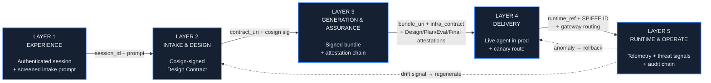

---

## Technology Stack — Layered Component Reference

The diagram below shows every platform and product component required to enable the five layers. Icon shapes distinguish component ownership at a glance: **■ rounded square = GCP managed**, **⬡ hexagon = Company-owned**, **⯃ octagon = Third-party/OSS**, **● circle = Open protocol**.

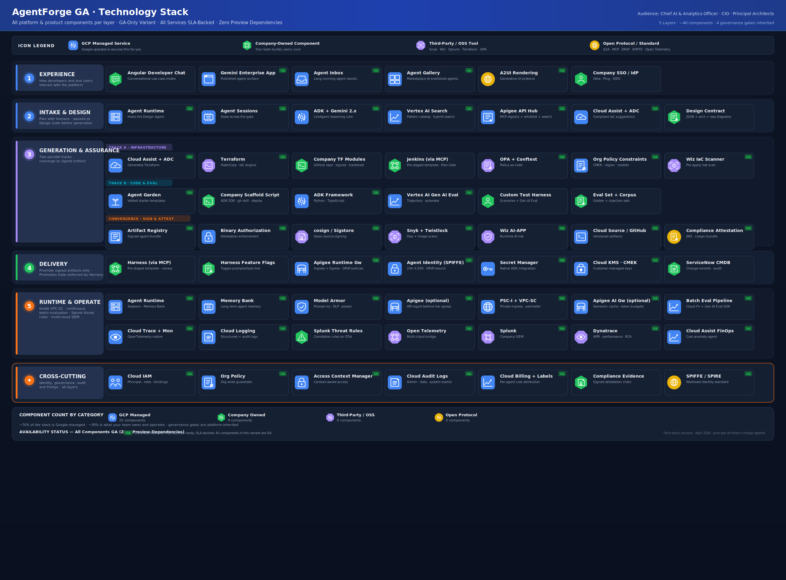

### Layer 1 — EXPERIENCE

The user-facing entry points for both developers (build-time) and end users (run-time). This layer authenticates, screens, and routes.

| Component | Category | Description |
|---|---|---|
| Angular Developer Chat | Company | The product's conversational UI where developers describe use cases in natural language to start the build-time workflow. Renders Mermaid diagrams inline via mermaid.js at the Design Gate for architecture review. |
| Gemini Enterprise App *(GA)* | GCP | Google's published agent surface (formerly Agentspace). End users consume agents here via Agent Inbox, Agent Gallery, and A2UI rendering. |
| Agent Inbox *(GA)* | GCP | Surfaces results from long-running agent tasks — the asynchronous counterpart to real-time chat. |
| Agent Gallery *(GA)* | GCP | A marketplace of all published agents in the organization — every agent built by this platform appears here automatically after Layer 4 promotion. |
| A2UI Rendering *(GA)* | Protocol | The generative UI protocol that lets agents render structured, interactive responses rather than plain text. |
| Company SSO / IdP | Company | Okta, Ping, or equivalent OIDC provider. Authenticates the developer; the resulting token is exchanged for a DPoP-bound cert at Agent Identity in the next layer. |

### Layer 2 — INTAKE & DESIGN

The planning layer. A single Design Agent reasons about the use case, discovers reusable components, selects ADK patterns via semantic search, and emits a signed Design Contract.

| Component | Category | Description |
|---|---|---|
| Agent Runtime *(GA)* | GCP | Hosts the Design Agent as an ADK `LlmAgent`. Provides managed compute, auto-scaling, and the session/memory infrastructure. |
| Agent Sessions *(GA)* | GCP | Persists conversational state across the Design Gate — the developer can leave, come back, and resume without losing context. |
| ADK + Gemini 2.x *(GA)* | GCP | The reasoning core. The Design Agent is an `LlmAgent` powered by Gemini 2.x Pro, using ADK's tool-use and sub-agent capabilities. Generates Mermaid component and sequence diagrams as part of its design output. |
| Vertex AI Search *(GA)* (Pattern Catalog) | GCP | An unstructured data store with structured metadata containing all ADK design patterns, composition rules, and Architecture Center reference architectures. The Design Agent queries it with semantic/hybrid search to select applicable patterns. |
| Apigee API Hub *(GA)* | GCP | MCP server registry with MCP as a first-class API style. All MCP servers — Google-managed, company-built, and third-party — are registered here. Whitelist enforcement via API Products. Semantic search for tool discovery. Replaces Agent Registry (Public Preview) in the GA-only variant. |
| Company Private Registry | Company | The company-internal catalog of vetted skills, connection recipes, A2A peer agents, and signed Agent Cards. Merged into Apigee API Hub as a category. Federated with GitHub MCP Server, Jenkins MCP Server, and Harness MCP Server for a unified discovery view. |
| GitHub MCP Server | Third-party | Connects the Design Agent to the company's GitHub Enterprise repos — primarily the Company Terraform Module Library. Enables the LLM to browse module READMEs, input/output schemas, and version tags during design. *(GA)* |
| Jenkins MCP Server | Company | Registered in Apigee API Hub. Enables the Design Agent to discover and configure pre-staged Jenkins pipeline templates — reading template parameter schemas and supplying values from the Design Contract. No Jenkinsfile is generated. |
| Harness MCP Server | Company | Registered in Apigee API Hub. Enables the Design Agent to discover and configure pre-staged Harness deployment pipeline templates — reading template input schemas and supplying values from the Design Contract. No Harness YAML is generated. |
| Cloud Assist + ADC *(GA)* | GCP | Gemini Cloud Assist and Application Design Center. Given the selected pattern composition and tools, it recommends a compliant IaC architecture and maps to an Agent Garden template. |
| Design Contract | Company | The typed JSON output of this layer — specifying the pattern composition, ADK agent tree, Garden template ID, tools/MCP bindings, model selection, identity scope, region, eval set ID, Model Armor template, residency tag, and URIs to the generated component architecture diagram and sequence diagram. Signed by Cosign before handoff to Layer 3. |

### Layer 3 — GENERATION & ASSURANCE

The factory floor. Two parallel tracks — infrastructure and code/eval — run independently and converge at the sign-and-attest step. Each track has its own governance gate.

**Track A — Infrastructure:**

| Component | Category | Description |
|---|---|---|
| Cloud Assist + ADC *(GA)* | GCP | Generates Terraform HCL from the Design Contract, constrained to reference only signed company modules from the GitHub repo. Does not use Agent Garden modules directly. |
| Terraform *(GA)* | Third-party | HashiCorp's IaC engine. Executes `plan` and `apply` against the GCP provider. |
| Company TF Module Library | Company | Company-owned, signed, compliance-hardened Terraform modules stored in a GitHub repo. Wrap Google's upstream Agent Garden patterns with company naming conventions, CMEK defaults, VPC-SC membership, billing labels, PAB bindings, region pinning, and Model Armor floor settings. The *only* module source Cloud Assist is allowed to reference. |
| Jenkins *(via MCP Server)* | Company | CI server running a **pre-staged company pipeline template** (`agent-infra-plan-apply-v3`). The template contains all gate logic — OPA check, `terraform plan`, human approval, `terraform apply`. The Design Agent discovers the template and configures it with parameters from the Design Contract via the Jenkins MCP Server. No Jenkinsfile is generated. |
| OPA + Conftest *(GA)* | Third-party | Open Policy Agent with Conftest for Rego-based policy-as-code evaluation of Terraform plan output. |
| Org Policy Constraints *(GA)* | GCP | Google Cloud organization-level guardrails — CMEK enforcement, region pinning, allowed-models lists, machine-type restrictions. Evaluated automatically during `terraform plan`. |
| Wiz IaC Scanner *(GA)* | Third-party | Pre-apply infrastructure risk scan. Checks for misconfigurations, overly permissive IAM, and compliance violations before any resource is created. |

**Track B — Code & Eval:**

| Component | Category | Description |
|---|---|---|
| Agent Garden Templates *(GA)* | GCP | Vetted agent starter templates — the parameterized starting point that replaces free-form code generation. Selected by the Design Contract's `garden_template_id`. |
| Company Scaffold Script *(GA stack)* | Company | A company-built Python script (~500–800 lines) using the **ADK Python SDK (GA)**. Reads the Design Contract, clones the Garden template from GitHub, parameterizes using ADK library APIs, installs skills via `gh skill install` (GitHub CLI, GA), verifies provenance, bundles skills into the agent package, and wires the ADK `SkillToolset`. Eval via **Vertex AI Gen AI Eval SDK (GA)**. Deploy via **Agent Runtime REST API (GA)**. Replaces agents-cli (Public Preview). |
| ADK Framework *(GA)* | GCP | The Agent Development Kit — Python 1.31.x stable, 2.0 Beta (graph workflows), TypeScript 1.0 GA, Java and Go 1.0. The framework the generated agent code runs on. |
| Vertex AI Gen AI Eval *(GA)* | GCP | Evaluation service providing trajectory metrics (`trajectory_in_order_match`, `trajectory_precision`, `trajectory_recall`), multi-turn autorater scoring, and structured output validation. |
| Custom Test Harness *(GA stack)* | Company | Company-authored structured test scenarios (persona + intent + expected trajectory) run through the **Vertex AI Gen AI Eval (GA)** multi-turn autorater. Deterministic — same scenarios every run. Replaces Agent Simulation (Preview). |
| Eval Set + Corpus | Company | Company-authored golden datasets, prompt-injection test corpora, and domain-specific eval assertions. Stored alongside agent code in the versioned repository. |

**Convergence — Sign & Attest:**

| Component | Category | Description |
|---|---|---|
| Artifact Registry *(GA)* | GCP | Stores the signed agent bundle (container image + config). The bundle_uri from here is what Layer 4 pulls. |
| Binary Authorization *(GA)* | GCP | Registers the attestation chain (Design + Plan + Eval + Final). Layer 4 verifies this chain before any deploy is attempted. |
| cosign / Sigstore *(GA)* | Third-party | Open-source artifact signing using Fulcio ephemeral certificates and Rekor transparency log. No long-lived signing keys. |
| Snyk + Twistlock *(GA)* | Third-party | Dependency vulnerability scan (Snyk) and container image scan (Twistlock). Both must pass before the bundle is signed. |
| Wiz AI-APP *(GA)* | Third-party | AI-application-specific runtime risk scan — checks for prompt injection surfaces, data leakage paths, and model access control gaps. |
| Cloud Source / GitHub *(GA)* | GCP/Company | Versioned source control for agent code, Terraform modules, eval sets, and pipeline definitions. |
| Compliance Attestation | Protocol | The JWS/cosign attestation bundle that travels with the artifact. Contains the Design doc hash, Plan attestation, Eval report, and final scan results. |

### Layer 4 — DELIVERY

Harness owns environment promotion. Nothing reaches production unless the full attestation chain from Layer 3 is intact.

| Component | Category | Description |
|---|---|---|
| Harness *(via MCP Server)* | Company | Continuous delivery platform running a **pre-staged company pipeline template** (`agent-deploy-canary-v4`). The template contains the Promotion Gate logic, canary watch, rollback triggers, and environment progression. The Design Agent discovers the template and configures it with parameters from the Design Contract via the Harness MCP Server. No Harness YAML is generated. |
| Harness Feature Flags | Company | Toggle prompt packs, tool allowlists, and Model Armor templates in production without redeploying the agent. |
| Apigee Runtime Gateway *(GA)* | GCP | Apigee serving as the unified gateway for all agent traffic. **Ingress:** OAuth 2.1/OIDC, mTLS, Model Armor integration. **Egress:** routes all outbound agent traffic (tools, models, A2A) through Apigee proxies with API Products for whitelist enforcement. Custom DPoP policies via Apigee policy engine replicate Agent Gateway's DPoP re-authentication. Custom A2A routing policies replicate Agent Gateway's protocol awareness. **No SCC mutual exclusivity constraint** — Splunk threat rules work alongside Apigee without limitation. |
| Agent Identity (SPIFFE) *(GA)* | GCP | Issues SPIFFE-based X.509 certificates with 24-hour rotation and DPoP-bound tokens. Each environment (staging, prod) gets a separate identity — no identity promotion. |
| Secret Manager *(GA)* | GCP | Native ADK integration for tool credentials. Secrets are bound to the agent's SPIFFE identity — no long-lived service account keys anywhere. |
| Cloud KMS · CMEK *(GA)* | GCP | Customer-managed encryption keys for Sessions, Memory Bank, and any Discovery Engine data stores. Provisioned by Terraform in Layer 3 Track A. |
| ServiceNow CMDB | Company | Change record management. Every promotion creates an RFC linked to the original JIRA ticket from Layer 1, closed on successful canary or marked FAILED on rollback. |

### Layer 5 — RUNTIME & OPERATE

The agent runs inside a VPC-SC perimeter with continuous evaluation, threat detection, and cost monitoring. All telemetry exits through a single Open Telemetry Collector.

**Runtime & Security:**

| Component | Category | Description |
|---|---|---|
| Agent Runtime *(GA)* | GCP | Production hosting for the deployed agent. Provides managed Sessions (conversational state), Memory Bank (long-term personalization), auto-scaling, and multi-region support. |
| Memory Bank *(GA)* | GCP | Persistent agent memory for user context and personalization. Not Terraform-managed as of April 2026 — schema migrations are imperative scripts. |
| Model Armor *(GA)* | GCP | Inline AI firewall. Screens every inbound prompt and outbound response for prompt injection, jailbreak attempts, DLP-sensitive content, malicious URLs, and tool poisoning. 2M-token free tier. |
| Apigee AI Gateway *(GA, optional)* | GCP | **Optional** model management layer sitting **downstream of Apigee Runtime Gateway egress**, not alongside it. When Apigee Runtime Gateway routes model traffic outbound, it can optionally pass through Apigee AI Gateway for additional capabilities: semantic caching (~70% cost reduction for repeated patterns), per-agent/per-team token budgets, multi-provider model failover, and the `ApigeeLlm` ADK wrapper. If Apigee Runtime Gateway is used without Apigee AI Gateway, model routing and Model Armor still work — you lose caching, token budgets, and multi-provider failover. |
| Apigee Tool Gateway *(GA, optional)* | GCP | **Optional** API management layer for external tool endpoints that sit **downstream of Apigee Runtime Gateway egress**. Apigee Runtime Gateway handles the routing and security for all outbound tool calls; Apigee adds API management features (rate limiting, OAuth credential management, API keys, quota enforcement) for specific external APIs that need them. Not required for Google-managed MCP servers. |
| PSC-I + VPC-SC *(GA)* | GCP | Private Service Connect Interface for private ingress from the company VPC. VPC Service Controls perimeter wraps Agent Runtime, BigQuery, Cloud Storage, Secret Manager, Discovery Engine, and KMS. |
| Cloud DLP *(GA)* | GCP | Data classification and de-identification. Integrated with Model Armor for content-level inspection beyond prompt screening. |
| Batch Eval Pipeline *(GA stack)* | GCP + Company | A **Cloud Function (GA)** that periodically samples logged conversations from **Cloud Logging (GA)**, sends them to the **Vertex AI Gen AI Eval SDK (GA)** for batch scoring, and publishes results as custom metrics in **Cloud Monitoring (GA)**. Batch interval: 5–15 minutes. Replaces Vertex AI Online Eval (Preview). |

**Observability & Threat Detection:**

| Component | Category | Description |
|---|---|---|
| Cloud Trace + Monitoring *(GA)* | GCP | Open Telemetry-native distributed tracing and metrics. Enabled automatically via `GOOGLE_CLOUD_AGENT_ENGINE_ENABLE_TELEMETRY=true` at the Terraform layer. |
| Cloud Logging *(GA)* | GCP | Structured and audit log collection. Feeds the Open Telemetry Collector for SIEM export and the Batch Eval Pipeline for quality monitoring. |
| Splunk Threat Rules *(GA)* | Company | Custom **Splunk correlation rules** that ingest **Cloud Audit Logs (GA)** and **Cloud Trace (GA)** data via the **Open Telemetry Collector (GA)**. Pattern-based detection for excessive permissions, anomalous tool patterns, and A2A communication anomalies. **No gateway exclusivity constraint** — works alongside Apigee Runtime Gateway without limitation. When SCC Agent Threat Detection reaches GA and the mutual exclusivity constraint is resolved, it can be added alongside Splunk for defense-in-depth. |
| Open Telemetry Collector *(GA)* | Third-party | The single egress point for all agent telemetry. Fans out to Splunk (SIEM) and Dynatrace (APM). Adding another destination means adding an OTel exporter — agent code is untouched. |
| Splunk *(GA)* | Third-party | Company SIEM. Receives traces, logs, and SCC findings via the Open Telemetry Collector. Security and audit teams use this as their primary investigation surface. |
| Dynatrace *(GA)* | Third-party | APM platform. Receives distributed traces for performance monitoring, root-cause analysis, and SLO tracking. SREs pivot here from Splunk alerts. |
| Cloud Assist FinOps *(GA)* | GCP | Gemini Cloud Assist's cost anomaly agent. Tracks per-agent token usage via billing labels and flags unexpected spend spikes. |

### Cross-cutting — applies to all layers

| Component | Category | Description |
|---|---|---|
| Cloud IAM *(GA)* | GCP | Identity and Access Management. Principals, roles, and policy bindings for every GCP resource across all layers. |
| Org Policy *(GA)* | GCP | Organization-wide guardrails enforced at the resource-manager level — CMEK requirements, region restrictions, allowed-models lists, service-account key creation blocks. |
| Access Context Manager *(GA)* | GCP | Context-aware access policies. Defines the VPC-SC perimeter rules and the conditions under which agents can access sensitive resources. |
| Cloud Audit Logs *(GA)* | GCP | Admin activity, data access, and system event logs. The only component that appears in every layer — it is the audit backbone. |
| Cloud Billing + Labels *(GA)* | GCP | Per-agent cost attribution via billing labels. Each agent deployed by the platform inherits labels from its Design Contract (agent class, team, cost center). |
| Compliance Evidence | Company | The signed attestation chain — Design Doc → Plan Attestation → Eval Report → Promotion Attestation → Signed Agent Card → Live SLO + Audit Log. This chain is what "born compliant" means to an auditor. |
| SPIFFE / SPIRE *(GA)* | Protocol | The workload identity standard underpinning Agent Identity. SPIFFE IDs are the only principal type for agent IAM grants — no service account keys. |

---

## Layer-by-layer sequence diagrams

The sections below show the detailed interaction sequences within each layer. Each diagram picks up where the previous one left off.

---

## Layer 1 — EXPERIENCE

**Outcome:** A developer's natural-language use-case description is authenticated, screened by Model Armor for prompt-injection, and lands on the Design Agent inside Agent Runtime as a fresh session.

**Enters:** Developer's intent (chat message).
**Exits to Layer 2:** `session_id` (bound to developer identity + JIRA/change-request ID) + the original prompt.

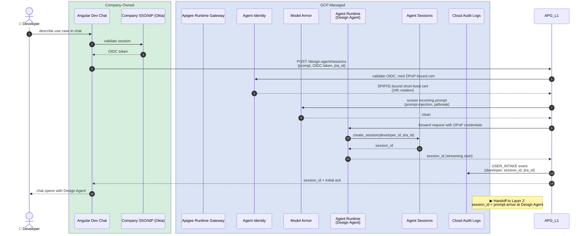

**Engineering notes:**

- The `session_id` is the auditable thread; it carries the developer identity and the JIRA/change-request linkage all the way to runtime.
- Model Armor runs the *user-prompt screen* here (cheap, fast). The full DLP/output screen happens at runtime in Layer 5 inside Agent Runtime.
- DPoP-bound certs make the session credential non-replayable: a leaked token cannot be reused from a different host.
- **This sequence is the build-time flow** — a developer using this platform to *create a new agent*. There is a separate run-time flow (an end user *consuming an agent the platform previously built*) that originates at the Gemini Enterprise App; that flow is covered in the Layer 5 request path. The two flows are not variants of each other — they have different originators, different targets, and different downstream layers:
  - **Build-time:** Angular Dev Chat → Design Agent (this platform's planner) → Layers 2 → 3 → 4 → produces a new published agent.
  - **Run-time:** Gemini Enterprise App → the published agent that was built earlier → Layer 5 only.
  - They share **Apigee Runtime Gateway, Agent Identity, and Model Armor** as inbound infrastructure (which is why those primitives appear in both Layer 1 and Layer 5 of the stack diagram), but everything downstream of those primitives is different.

---

## Layer 2 — INTAKE & DESIGN

**Outcome:** A signed Design Contract — a typed JSON document specifying the **ADK pattern composition** (which patterns, how they compose), agent class, Garden template ID, tools/MCP servers, sub-agent topology, region, identity scope, eval set ID, model selection, Model Armor template, and residency tag — accompanied by a **generated component architecture diagram** and **sequence diagram** that visualize the designed workflow for developer review.

**Enters from Layer 1:** `session_id` + prompt + developer identity.
**Exits to Layer 3:** `contract_uri` (in Cloud Storage) + cosign signature + `component_diagram_uri` + `sequence_diagram_uri` + Jenkins webhook trigger.

### ADK Pattern Catalog (what the Design Agent searches)

Google's Cloud Architecture Center and ADK documentation define a two-tier pattern taxonomy that the Design Agent must understand and compose:

**Tier 1 — Foundational ADK execution patterns** (the building blocks):

| Pattern | ADK class | When to use |
|---|---|---|
| Sequential pipeline | `SequentialAgent` | Deterministic multi-step workflows — output of agent A feeds agent B. Linear, auditable, easy to debug. |
| Parallel fan-out/gather | `ParallelAgent` | Independent sub-tasks that can run simultaneously, then a synthesizer agent aggregates results. |
| Loop (iterative) | `LoopAgent` | Repeated execution of a sub-agent sequence until a termination condition is met — e.g., refinement cycles. |

**Tier 2 — Compositional design patterns** (built from Tier 1 primitives):

| Pattern | Composed from | Use case signal |
|---|---|---|
| Coordinator / Dispatcher | `LlmAgent` routing to specialist `LlmAgent` sub-agents | Open-ended request that requires classification before execution — e.g., customer service routing. |
| Hierarchical decomposition | Nested `SequentialAgent` + `ParallelAgent` trees | Complex goal that decomposes into independent sub-goals with their own sub-task sequences. |
| Generator and Critic | `LoopAgent` wrapping generator + critic `LlmAgent` pair | Output quality is critical — generator produces, critic validates, loop refines until threshold. |
| Iterative Refinement | `LoopAgent` wrapping generator + critique + refiner agents | Multi-pass quality improvement — extends Generator/Critic with a dedicated refiner agent. |
| Human-in-the-Loop | Any pattern + `LongRunningFunctionTool` or ADK resume capability | High-stakes decisions requiring human judgment — financial transactions, production deploys, compliance approvals. |
| Custom orchestration | `LlmAgent` with imperative routing logic across sub-agents | Logic-level orchestration that doesn't fit structured patterns — e.g., conditional branching across parallel and sequential sub-flows. |

**Tier 3 — Reference architectures** (full use-case blueprints from the Architecture Center):

| Reference architecture | Underlying patterns | Source |
|---|---|---|
| Classify multimodal data | Parallel fan-out/gather | Architecture Center |
| Orchestrate security operations | Hierarchical decomposition + RAG | Architecture Center |
| Multimodal GraphRAG resource orchestration | Sequential pipeline + graph-backed RAG | Architecture Center |
| Administer interactive learning | Single-agent tool use | Architecture Center |
| Automate data science workflows | Multi-agent sequential + parallel | Architecture Center |
| Bidirectional multimodal streaming | Real-time single-agent with Live API | Architecture Center |
| Orchestrate access to disparate systems | Coordinator/Dispatcher + MCP | Architecture Center |
| Single-agent AI system (ADK + Cloud Run) | Single-agent tool use | Architecture Center |

Patterns are **compositional** — a real use case almost always requires combining multiple patterns. For example, a procurement agent might use a *Coordinator/Dispatcher* at the top level, routing to a *Sequential pipeline* for order processing, a *Parallel fan-out/gather* for multi-vendor price comparison, and a *Human-in-the-Loop* gate before final purchase approval. The Design Agent's job is to identify which patterns compose to solve the developer's use case and to validate that the composition is sound.

### Ingesting the pattern catalog into Vertex AI Search

The patterns, their metadata, and their composition rules must be ingested into a **Vertex AI Search data store** so the Design Agent can perform semantic/hybrid retrieval at intake time. The ingestion design:

**Data store type:** Vertex AI Search **unstructured data store with metadata** — supports both semantic (embedding-based) vector search and keyword-based search in a single hybrid query.

**Document schema per pattern:**

```json
{
  "id": "pattern-coordinator-dispatcher",
  "structData": {
    "pattern_name": "Coordinator / Dispatcher",
    "tier": "compositional",
    "adk_classes": ["LlmAgent"],
    "foundation_primitives": ["routing", "delegation"],
    "composable_with": [
      "pattern-sequential-pipeline",
      "pattern-parallel-fan-out-gather",
      "pattern-human-in-the-loop"
    ],
    "use_case_signals": [
      "open-ended request",
      "classification before execution",
      "multiple specialist domains",
      "customer service",
      "routing"
    ],
    "complexity": "medium",
    "latency_profile": "interactive",
    "cost_profile": "medium",
    "human_involvement": "optional",
    "reference_architectures": [
      "orchestrate-access-disparate-systems"
    ],
    "adk_sample_url": "https://github.com/google/adk-samples/...",
    "arch_center_url": "https://docs.google.com/architecture/..."
  },
  "content": {
    "mimeType": "text/html",
    "uri": "gs://pattern-catalog/coordinator-dispatcher.html"
  }
}
```

**Content documents** (stored in Cloud Storage, referenced by URI):
Each pattern gets a rich-text document containing: the pattern description, when to use / when not to use, ADK pseudocode showing the agent tree, composition rules (which patterns it nests with), anti-patterns and pitfalls, and links to the Architecture Center reference architecture and Agent Garden template (if one exists).

**Chunking strategy:** Each pattern document is chunked at the section level (description, use-case signals, composition rules, ADK code, anti-patterns) so that semantic search can match on specific sections rather than entire documents. Vertex AI Search's **layout-aware chunking** handles this natively for HTML/PDF.

**Metadata filtering:** The `structData` fields enable **hybrid search**: the Design Agent's query combines a natural-language semantic embedding match (against `content`) with metadata filters (against `structData`). For example: *"semantic: 'multi-vendor price comparison with human approval' AND complexity IN (medium, high) AND human_involvement = required"*.

**Ingestion pipeline:** A Cloud Function triggered on Cloud Storage upload parses each pattern document, extracts/validates the `structData` schema, and calls the Vertex AI Search `ImportDocuments` API. The pipeline runs on initial load and on every Architecture Center or ADK docs update (monitored via a Cloud Scheduler job that checks the Architecture Center release notes RSS feed).

**Composition graph:** In addition to the flat document store, a small **composition adjacency list** is maintained in the `composable_with` metadata field. This lets the Design Agent, after retrieving candidate patterns, traverse the composition graph to find valid multi-pattern compositions — e.g., if the top result is *Coordinator/Dispatcher*, the adjacency list tells it that *Sequential Pipeline*, *Parallel Fan-out*, and *Human-in-the-Loop* are valid children.

### Skill Lifecycle — Discovery, Bundling, and Runtime Loading

Skills are compact, agent-first documentation written in Markdown (Google's official Agent Skills format, announced at Next '26 Day 1). Unlike MCP tools which are *invoked* at runtime via API calls, skills are *loaded into the agent's context window* at runtime — providing condensed expertise without context bloat. The lifecycle spans all five layers.

**Where skills are stored:**

| Source | Repository | Examples |
|---|---|---|
| Google-authored | `github.com/google/skills` (Apache 2.0) | BigQuery, Cloud SQL, Cloud Run, Firebase, GKE, Gemini API, Security/Reliability/Cost Optimization pillars, Onboarding/Auth/Network recipes |
| Google Gemini-specific | `github.com/google-gemini/gemini-skills` | Gemini API, SDK, and model interaction skills |
| Company-authored | `github.com/company/skills` (private) | Domain-specific: fraud detection, regulatory compliance, vendor integration recipes, proprietary data patterns |

**Skill directory structure (per the `agentskills.io` spec):**

```
skills/bigquery/
├── SKILL.md              # L2: Instructions (YAML frontmatter + Markdown body)
└── references/
    ├── query-patterns.md  # L3: Loaded on-demand via load_skill_resource
    ├── schema-design.md   # L3: Loaded on-demand
    └── cost-optimization.md
```

**Progressive disclosure model (three layers):**

| Layer | What it contains | When it loads | Token cost |
|---|---|---|---|
| **L1 — Frontmatter** | YAML metadata: name, description, capabilities, tags, version | Always visible to the agent | ~50 tokens |
| **L2 — Instructions** | The SKILL.md body: step-by-step instructions for the agent | Loaded when the skill is activated | ~500–2000 tokens |
| **L3 — References** | Subdirectory files: detailed domain knowledge, code snippets, examples | Loaded on-demand via ADK's `load_skill_resource` tool | Variable (only what's needed) |

**End-to-end sequence diagram:**

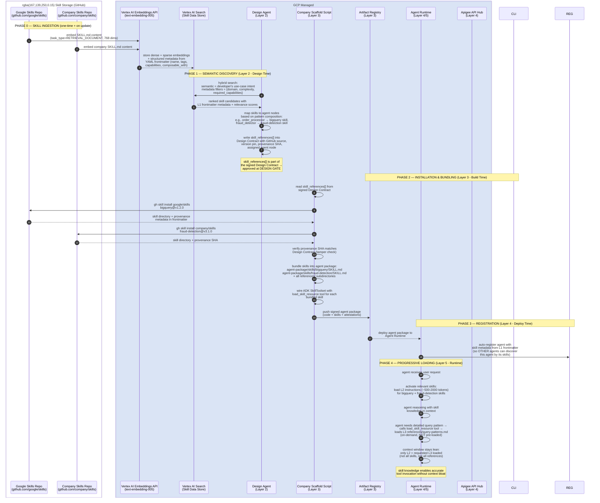

**Why this matters for AgentForge:**

The skill lifecycle closes a critical gap. MCP servers give agents the ability to *call* tools. Skills give agents the expertise to *use them correctly.* An agent with a BigQuery MCP connection but no BigQuery skill will hallucinate query syntax, miss cost optimization patterns, and ignore schema conventions. An agent with the BigQuery skill loaded into context knows the right patterns, the service limits, and the recommended practices — and loads that knowledge progressively, keeping the context window lean.

The Design Agent's job is to match developer intent to skills *semantically* — a developer describing "I need to query our claims database efficiently" should get the BigQuery skill and the company's "Row-Level Security Patterns" skill, even if neither the developer nor the skills use exactly those words. That's what the Vertex AI Search embedding layer provides.

The provenance verification at build time ensures that the skills approved at the Design Gate are the same skills bundled into the agent package. If someone modifies a skill in the GitHub repo between design approval and build, the provenance SHA mismatch will fail the build — maintaining the attestation chain integrity.

### Updated sequence diagram

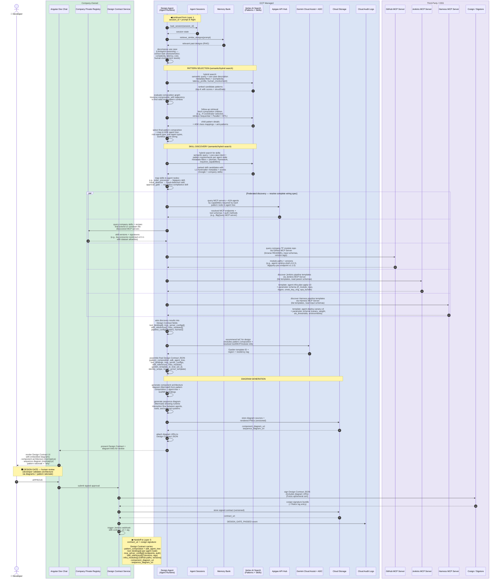

**Engineering notes:**

**Separation of concerns: Design Agent (Layer 2) vs Company Scaffold Script (Layer 3):**

| | Design Agent (Layer 2) | Company Scaffold Script (Layer 3) |
|---|---|---|
| **Role** | Designs the agentic solution | Generates code for it |
| **LLM involved?** | Yes — reasoning, pattern selection, tool discovery, diagram generation | No — deterministic parameterization from signed contract |
| **Inputs** | Developer's use-case prompt + pattern catalog + registries + GitHub MCP | Signed Design Contract JSON (all choices already made) |
| **Outputs** | Signed Design Contract + component diagram + sequence diagram | Scaffolded ADK agent package + eval results |
| **Who approves the output?** | Developer at Design Gate (reviews architecture via diagrams) | Automated eval thresholds at Eval Gate (no human reviews code) |
| **Why this boundary exists** | If Design Agent invoked the scaffold script directly, the human approval gate would come *after* code generation — forcing the developer to review generated code instead of reviewing a design. That's a worse developer experience and a weaker compliance posture. |

**Design Contract JSON example** (the artifact handed from Layer 2 to Layer 3):

```json
{
  "contract_version": "2.1.0",
  "session_id": "sess-a1b2c3",
  "jira_id": "AGENT-4521",

  "pattern_composition": {
    "root": "coordinator_dispatcher",
    "children": [
      {"node": "order_processor", "pattern": "sequential_pipeline"},
      {"node": "vendor_comparator", "pattern": "parallel_fan_out"},
      {"node": "approval_gate", "pattern": "human_in_the_loop"}
    ]
  },

  "adk_agent_tree": {
    "root_agent": {"type": "LlmAgent", "model": "gemini-3.1-pro"},
    "sub_agents": [
      {"name": "order_processor", "type": "SequentialAgent"},
      {"name": "vendor_comparator", "type": "ParallelAgent"},
      {"name": "approval_gate", "type": "LlmAgent", "model": "gemini-3.1-flash"}
    ]
  },

  "tool_bindings": [
    {
      "agent_node": "order_processor",
      "tools": [
        {
          "type": "mcp_server",
          "name": "bigquery-mcp",
          "source": "agent_registry",
          "endpoint": "mcp://bigquery.googleapis.com/v1",
          "transport": "sse",
          "auth": "agent_identity"
        },
        {
          "type": "company_skill",
          "name": "bq-connector-restricted",
          "source": "private_registry",
          "version": "2.3.1",
          "signature": "sha256:abc123...",
          "config": {
            "dataset_allowlist": ["procurement.*"],
            "row_level_security": true
          }
        }
      ]
    },
    {
      "agent_node": "vendor_comparator",
      "tools": [
        {
          "type": "mcp_server",
          "name": "vendor-api-gateway",
          "source": "private_registry",
          "endpoint": "mcp://vendor-gw.internal:8443/v1",
          "transport": "sse",
          "auth": "oauth2_client_credentials",
          "secret_ref": "sm://projects/p/secrets/vendor-api-key"
        },
        {
          "type": "function_tool",
          "name": "price_normalizer",
          "source": "private_registry",
          "version": "1.0.4",
          "signature": "sha256:def456..."
        }
      ]
    }
  ],

  "mcp_server_configs": [
    {
      "name": "bigquery-mcp",
      "transport": "sse",
      "auth": "agent_identity",
      "psc_endpoint": true,
      "model_armor_template": "ma-standard-v2"
    },
    {
      "name": "vendor-api-gateway",
      "transport": "sse",
      "auth": "oauth2_client_credentials",
      "secret_ref": "sm://projects/p/secrets/vendor-api-key",
      "model_armor_template": "ma-external-strict-v1"
    }
  ],

  "skill_references": [
    {
      "name": "bq-connector-restricted",
      "registry": "private",
      "version": "2.3.1",
      "signature": "sha256:abc123..."
    },
    {
      "name": "price_normalizer",
      "registry": "private",
      "version": "1.0.4",
      "signature": "sha256:def456..."
    }
  ],

  "infra_modules": [
    {
      "module": "agent-runtime-shell",
      "source": "github.com/company/tf-modules//modules/agent-runtime-shell",
      "version": "v3.2.0"
    },
    {
      "module": "bigquery-psc-endpoint",
      "source": "github.com/company/tf-modules//modules/bigquery-psc-endpoint",
      "version": "v1.1.0"
    },
    {
      "module": "agent-identity",
      "source": "github.com/company/tf-modules//modules/agent-identity",
      "version": "v2.0.1"
    }
  ],

  "garden_template_id": "coordinator-dispatcher-v2",
  "eval_set_id": "eval-procurement-agent-v3",
  "injection_corpus_id": "corpus-prompt-injection-v2",
  "identity_scope": "projects/my-project/agents/procurement",
  "region": "us-central1",
  "residency_tag": "us",
  "model_armor_template": "ma-standard-v2",

  "model_routing": {
    "_comment": "Optional — only when Apigee AI Gateway is enabled",
    "apigee_proxy_url": "https://api.company.com/ai-gateway/v1",
    "primary_model": "gemini-3.1-pro",
    "fallback_models": ["gemini-3-flash", "gemini-3-flash-lite"],
    "failover_policy": "on_error_or_rate_limit",
    "token_budget_per_request": 8000,
    "semantic_cache_enabled": true
  },

  "component_diagram_uri": "gs://design-artifacts/sess-a1b2c3/component.mermaid",
  "sequence_diagram_uri": "gs://design-artifacts/sess-a1b2c3/sequence.mermaid",

  "pipeline_configs": {
    "jenkins": {
      "template_id": "agent-infra-plan-apply-v3",
      "template_source": "company-shared-libraries",
      "parameters": {
        "tf_module_repo": "github.com/company/tf-modules",
        "tf_module_path": "modules/agent-runtime-shell",
        "tf_module_version": "v3.2.0",
        "agent_spiffe_scope": "projects/my-project/agents/procurement",
        "region": "us-central1",
        "cmek_key_ring": "agent-keys-us-central1",
        "opa_policy_bundle": "agent-infra-policies-v2",
        "wiz_scan_profile": "agent-iac-standard"
      }
    },
    "harness": {
      "template_id": "agent-deploy-canary-v4",
      "template_source": "company-harness-templates",
      "parameters": {
        "artifact_registry": "us-central1-docker.pkg.dev/my-project/agents",
        "agent_runtime_id": "from_infra_contract",
        "canary_weight": 10,
        "canary_duration_minutes": 30,
        "slo_latency_p99_ms": 2000,
        "slo_error_rate_pct": 1.0,
        "feature_flags": ["prompt-pack-v2", "tool-allowlist-strict"],
        "rollback_on_slo_breach": true,
        "environments": ["staging", "prod"]
      }
    }
  }
}
```

**How the company scaffold script consumes this contract in Layer 3 Track B:**

| Design Contract field | What the scaffold script does with it |
|---|---|
| `garden_template_id` | Fetches the matching Agent Garden template as the scaffold starting point |
| `adk_agent_tree` | Generates the agent class hierarchy — root LlmAgent with typed sub-agents |
| `tool_bindings[]` | For each agent node, generates `FunctionTool`, `MCPToolset`, or `AgentTool` declarations with exact endpoints, auth configs, and skill versions |
| `mcp_server_configs[]` | Generates MCP client connection setup — transport, auth method, PSC endpoint flag, Model Armor template binding |
| `skill_references[]` | Pins skill versions and signature hashes; eval step verifies integrity before scoring |
| `infra_modules[]` | Generates Terraform module references that Track A consumes (module paths + pinned versions from GitHub repo) |
| `eval_set_id` + `injection_corpus_id` | Configures the eval run — which golden dataset and which prompt-injection corpus to test against |
| `model_armor_template` | Configures the Model Armor floor settings for the agent at runtime |
| `model_routing` *(optional)* | When Apigee AI Gateway is enabled, configures the `ApigeeLlm` wrapper — proxy URL, primary model, fallback chain, failover policy, token budget, and semantic cache flag. When not enabled, Apigee Runtime Gateway routes model calls directly. |
| `pipeline_configs.jenkins` | Jenkins MCP Server triggers the pre-staged infra template (`agent-infra-plan-apply-v3`) with the specified parameters — no Jenkinsfile is generated |
| `pipeline_configs.harness` | Harness MCP Server triggers the pre-staged deploy template (`agent-deploy-canary-v4`) with the specified parameters — no Harness YAML is generated |

Every parameter comes from the signed Design Contract — **the scaffold script makes zero choices.** This is why the pipeline is deterministic and auditable. If a field is missing or malformed, the script fails fast with a schema validation error rather than guessing.

**Additional notes:**

- The Design Contract schema is versioned in the Company Private Registry. Treat schema changes like API changes — backwards compatibility matters.
- **Diagram generation is an LLM capability, not a separate service.** The Design Agent's Gemini 2.x model produces Mermaid source code for both diagrams as part of its reasoning chain. The component diagram is derived from the `pattern_composition` and `adk_agent_tree` fields — agent nodes, sub-agent relationships, tool bindings, and MCP wiring. The sequence diagram is derived from the runtime interaction flow implied by the selected patterns.
- **Diagrams are part of the signed Design Contract.** The `component_diagram_uri` and `sequence_diagram_uri` are fields in the signed payload — post-approval tampering with the diagrams invalidates the signature. The diagrams travel with the bundle through Layers 3 and 4 as design evidence and appear in the Compliance Evidence Chain as the "Design Doc" node.
- **At the Design Gate, the developer reviews architecture — not JSON.** The Angular UI presents: (1) the component architecture diagram showing agent topology and tool bindings, (2) the sequence diagram showing runtime interaction flow, and (3) the pattern rationale. The JSON example above is what travels *inside* the signed contract; the developer never reads it directly.
- **Vertex AI Search performs hybrid search for BOTH patterns AND skills** — combining semantic embedding match with structured metadata filters. For patterns: two-pass retrieval finds candidate root patterns, then traverses the `composable_with` adjacency for valid children. For skills: after patterns are selected, a second hybrid search matches the developer's use-case intent + each pattern node's requirements to ranked skill candidates from both Google-authored skills (`github.com/google/skills`) and company-authored skills (`github.com/company/skills`). Skills are indexed with their L1 YAML frontmatter metadata (name, tags, capabilities, domain) as structured filters and their L2 Markdown body as the semantic embedding surface. The Design Agent maps discovered skills to specific agent nodes in the pattern composition — e.g., the `order_processor` node gets the BigQuery skill, the `fraud_detector` gets the fraud-detection skill — and writes these assignments into `skill_references[]` in the Design Contract.
- Three registry queries (Apigee API Hub + Company Private Registry + GitHub MCP Server) run in parallel **after** pattern selection. The GitHub MCP Server query discovers which company Terraform modules are available — browsing module READMEs, input/output schemas, and version tags so the Design Agent can reference exact module paths and versions in the Design Contract.
- Cosign signs with a Fulcio-issued ephemeral cert; the public log entry in Rekor is the auditable trail.
- **Company Terraform modules are the only module source — Agent Garden is upstream reference only.** Cloud Assist in Layer 3 Track A is constrained to reference only these signed company modules. This is compliance-by-construction, not compliance-by-inspection.
- **Jenkins and Harness pipelines are parameterized templates, not generated YAML.** The Design Agent discovers pipeline templates via Jenkins MCP Server and Harness MCP Server (both registered in Apigee API Hub), reads their parameter schemas, and supplies values from the Design Contract. The templates themselves — `agent-infra-plan-apply-v3` for Jenkins and `agent-deploy-canary-v4` for Harness — are pre-staged, company-audited, and version-pinned. All gate logic (OPA checks, human approvals, canary watch, rollback triggers) lives in the template, not in generated code. This is the same "parameterize, don't generate" principle applied to CI/CD that we applied to agent code via the company scaffold script. The attestation chain is preserved because the gates fire at the same points — only the mechanism that creates the pipeline configuration changes. The chain is actually *stronger* because the auditor now has two levels of assurance: (1) the template was reviewed and signed by the platform team, and (2) the parameters for this specific agent were reviewed and signed at the Design Gate.

---

## Layer 3 — GENERATION & ASSURANCE

This is the longest diagram. Two parallel tracks (A: Infrastructure, B: Code & Eval) run independently and converge at the SIGN step. Each track has its own gate.

**Enters from Layer 2:** `contract_uri` + cosign signature.
**Exits to Layer 4:** Signed agent bundle in Artifact Registry + `infra_contract` (resource IDs, SPIFFE IDs, secret refs) + attestation chain (Design + Plan + Eval + Final).

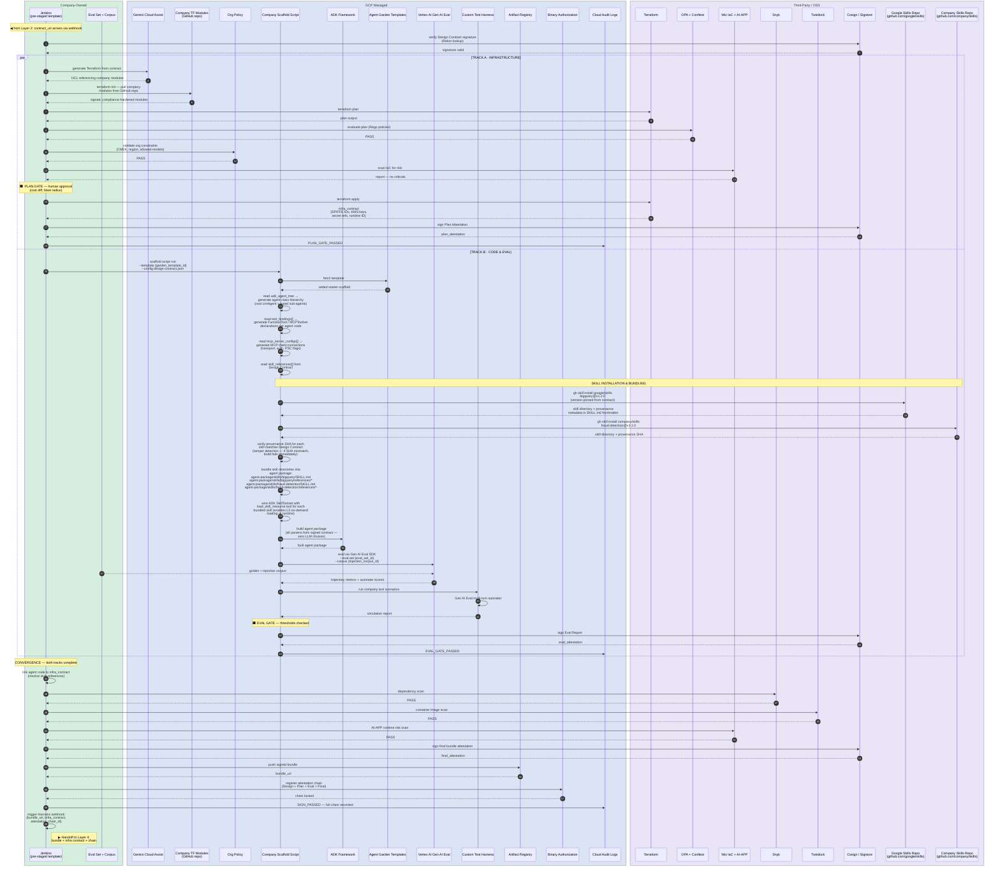

**Engineering notes:**

- The two tracks share the Design Contract but produce independent artifacts. Convergence requires both to have signed attestations. If one fails, the other is discarded — there is no partial promotion.
- Track B builds the agent code against **stub references** to the infra contract; at convergence, stubs are replaced with the real IDs Track A emitted. The bundle is *re-signed* after substitution.
- **The company scaffold script is a deterministic consumer of the Design Contract — see the field-by-field consumption table in the Layer 2 engineering notes.** It reads `garden_template_id` to fetch the scaffold, `adk_agent_tree` to generate the class hierarchy, `tool_bindings[]` to wire MCP servers and function tools per agent node, `mcp_server_configs[]` to generate connection setup, `skill_references[]` to pin versions with signature hashes, and `infra_modules[]` to generate the Terraform references Track A consumes. If any field is missing or malformed, the scaffold script fails with a schema validation error — it never guesses.
- **There is no LLM in Track B.** The LLM did its work in Layer 2. From Layer 3 onward, the pipeline is deterministic. This is the fundamental architectural boundary: design is LLM-assisted (Layer 2), generation is LLM-free (Layer 3).
- Binary Authorization stores the *chain*, not individual attestations. Layer 4 verifies the entire chain in one call.
- Plan Gate human approval is the *same* gate the existing Jenkins pipeline uses — `terraform plan` review by a platform engineer with access to cost diff and blast radius. We did not invent a new approval flow.

### What the platform scaffolds vs what engineers must implement

> **The platform provides roughly 70% of the code as scaffolding. The remaining 30% is NOT just business logic — it includes use-case-specific wiring, guardrails, and operational contracts that engineers must implement before the agent is production-ready. This section exists to prevent the assumption that scaffolding + business logic = done.**

**What the platform provides out-of-the-box (the ~70% scaffold):**

| Scaffolded component | What the scaffold script generates | Engineer effort |
|---|---|---|
| ADK agent class hierarchy | Root agent + sub-agents matching `adk_agent_tree` from the Design Contract, with correct `SequentialAgent`/`ParallelAgent`/`LlmAgent` types | None — fully generated |
| MCP server connections | `MCPToolset` declarations with transport (SSE), auth method (Agent Identity or OAuth2), PSC endpoint flags, per the `mcp_server_configs[]` | None — fully wired |
| Tool declarations | `FunctionTool` and `MCPToolset` stubs with endpoints, schemas, and descriptions per `tool_bindings[]` | **Function bodies are empty** — see below |
| Agent Identity integration | SPIFFE-bound auth, DPoP token handling, credential refresh | None — wired via ADK + Agent Identity |
| Model Armor integration | `before_model_callback` wired to the Model Armor template specified in `model_armor_template` for generic prompt/output screening | None — generic screening is automatic |
| Apigee AI Gateway integration *(optional)* | When `model_routing` is present in Design Contract, `ApigeeLlm` wrapper configured for primary model, failover chain, token budget, semantic cache. When absent, agents call models directly via Apigee Runtime Gateway egress. | None — conditionally wired from Design Contract |
| Session management | Agent Sessions create/load/persist boilerplate for conversational state | None — standard lifecycle is generated |
| Memory Bank integration | Retrieve/store context boilerplate per ADK Memory Bank API | None — standard CRUD is generated |
| Observability instrumentation | Open Telemetry trace spans, structured logging, `GOOGLE_CLOUD_AGENT_ENGINE_ENABLE_TELEMETRY=true` env var | None — auto-wired at Terraform layer |
| Terraform infrastructure | Agent Runtime, Agent Identity, Apigee Runtime Gateway route, Secret Manager, KMS, PSC-I — all from signed company modules | None — Track A handles this |
| CI/CD pipeline configuration | Pre-staged Jenkins template (`agent-infra-plan-apply-v3`) configured with Design Contract parameters via Jenkins MCP Server; pre-staged Harness template (`agent-deploy-canary-v4`) configured via Harness MCP Server | None — templates are company-audited; only parameters vary per agent |
| Eval harness configuration | Eval set ID + injection corpus ID + autorater config from Design Contract | None — harness is wired; **eval content is not** |
| Deployment configuration | Agent Runtime region, scaling, CMEK, billing labels from Design Contract | None — Terraform-managed |

**What engineers MUST implement (the ~30% that is not business logic):**

| Engineer responsibility | Why it's not scaffolded | Risk if skipped |
|---|---|---|
| **System prompts and agent instructions** | The scaffold provides placeholder prompts. Engineers must write the actual instructions — persona, reasoning constraints, tone, boundaries, and safety directives. These are use-case-specific and are the primary prompt-injection attack surface. | Agent behaves unpredictably; prompt injection risk is unmitigated at the instruction level |
| **FunctionTool implementations** | For MCP servers, connections are wired but *result interpretation and error handling* are not. For custom `FunctionTool` declarations, the scaffold generates the signature and description but **the function body is empty**. Engineers write the actual logic. | Tools are declared but do nothing; agent cannot complete tasks |
| **`before_tool_callback` / `after_tool_callback` validation** | Model Armor handles generic prompt/output screening. But tool-level argument validation and output filtering are use-case-specific. Example: "the `transfer_funds` tool must not accept amounts above $10,000 without dual approval." The platform cannot know your business rules. | Business-critical constraints are unenforced at the tool-call level |
| **Structured output schemas (Pydantic models)** | The scaffold does not generate output schemas. Where downstream systems expect typed data (e.g., an order confirmation JSON), engineers must define Pydantic models and configure `output_schema` on the relevant agent. | Agent returns unstructured text where structured data is expected; downstream integrations break |
| **Error handling and fallback logic** | What happens when a tool call fails? When an MCP server is unreachable? When the model produces an unexpected response? The scaffold provides the happy path. Engineers implement retries, circuit breakers, graceful degradation, and human escalation triggers. | First transient failure causes an unhandled exception; agent crashes instead of degrading gracefully |
| **Eval assertions and golden datasets** | The platform *runs* evals; engineers *author* them. Golden datasets (expected input/output pairs), trajectory assertions ("agent must call tool X before tool Y"), and domain-specific quality thresholds are use-case-specific. The eval *harness* is scaffolded; the eval *content* is not. | Eval gate passes everything because the golden dataset is empty or trivial; quality issues reach production |
| **Prompt-injection test corpus (domain-specific)** | The platform provides a generic injection corpus. Engineers must extend it with domain-specific attack vectors — e.g., attempts to trick a financial agent into revealing account numbers, or attempts to make a healthcare agent provide unauthorized diagnoses. | Generic injection tests pass but domain-specific attacks succeed in production |
| **Memory Bank schema and lifecycle** | What goes into Memory Bank, what doesn't, retention policies, and migration scripts when the schema changes. Memory Bank is not Terraform-managed as of April 2026 — schema changes are imperative scripts. | Unbounded memory growth; stale context causes incorrect agent behavior; no migration path when schema evolves |
| **Human escalation criteria** | For Human-in-the-Loop patterns, the scaffold provides the `LongRunningFunctionTool` stub and ADK resume capability. But *when* to escalate (confidence threshold, risk score, ambiguity detection), *to whom* (role-based routing), *with what context* (summary vs full transcript), and *what SLA* on response — all must be defined by engineers. | Agent either never escalates (risk) or always escalates (defeats the purpose of automation) |
| **Multi-turn conversation state design** | Session persistence is scaffolded, but engineers must design *what* state is tracked across turns — what's summarized vs retained verbatim, when state is reset, and how to handle context window limits for long conversations. | Context window bloat on long conversations; agent "forgets" critical context or carries stale state |
| **Domain-specific guardrails** | Model Armor provides generic screening. Domain-specific rules — "never recommend a drug not in the formulary", "never disclose salary data to non-HR users", "never execute a trade above the client's risk limit" — must be implemented as `before_model_callback` or `before_tool_callback` logic. | Generic screening passes but domain-specific violations reach users; regulatory or compliance exposure |
| **A2A Agent Card authoring** | If the agent will be discoverable by other agents via A2A, the Agent Card (name, description, capabilities, input/output schemas, authentication requirements) must be authored by engineers. The scaffold creates a stub card; the content must be filled in. | Agent is undiscoverable or misrepresented to peer agents; A2A routing fails or routes incorrectly |
| **Cost controls and token budgets** | The scaffold does not implement per-request token limits, cost circuit breakers, or fallback-to-cheaper-model logic. Engineers must implement these if the use case has cost constraints beyond what Cloud Assist FinOps monitors at the billing level. | Runaway token consumption on complex queries; unexpected cost spikes that FinOps catches after the fact, not before |

**The bottom line for an engineer receiving a scaffold from this platform:**

The scaffold gives you a *runnable but incomplete* agent. You can deploy it to staging and it will start, accept requests, and connect to tools — but it will respond with placeholder prompts, return empty tool results, pass every input without domain validation, and have no eval assertions to catch quality issues. The ~30% you implement is what turns it from "structurally correct" into "does what the business needs safely." The platform ensures the structural correctness is born compliant; you ensure the behavior is correct and safe.

---

## Layer 4 — DELIVERY

**Outcome:** A signed bundle becomes a running agent in production with canary routing, bound to a fresh production SPIFFE identity and CMEK-encrypted secrets.

**Enters from Layer 3:** `bundle_uri` + `infra_contract` + attestation chain.
**Exits to Layer 5:** Live agent on Agent Runtime (prod) with routing in Apigee Runtime Gateway, identity issued by Agent Identity, and secrets bound via Secret Manager.

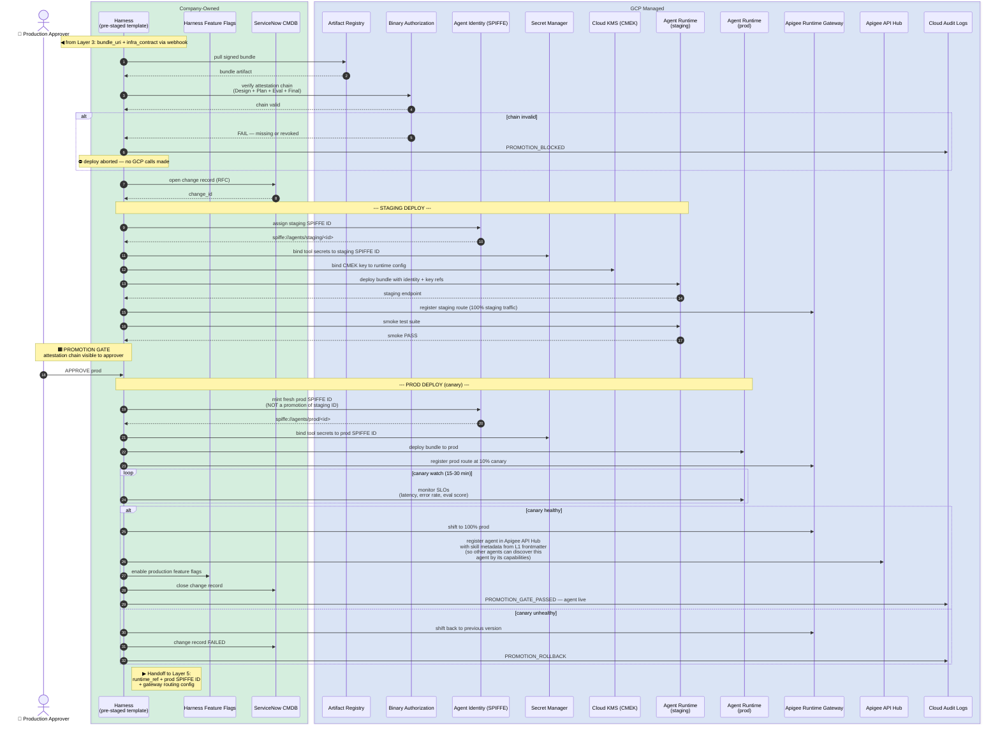

**Engineering notes:**

- Harness *consumes* the attestation chain via Binary Auth before any GCP API is called. If any link is missing or revoked, the deploy aborts at step 5; nothing is provisioned, nothing is logged as a deploy attempt at Agent Runtime.
- Staging and prod use **separate** SPIFFE IDs. There is no "promote the same identity" — Harness mints a fresh prod identity at promotion time. This is a deliberate isolation property.
- Canary routing is via **Apigee traffic-split policies**, not a load balancer. Apigee custom policies replicate the A2A-aware routing that Agent Gateway provides natively in the stack.
- Rollback is "shift Apigee traffic-split weight back to previous version" — not a redeploy. The previous version stays in Artifact Registry until explicitly retired.
- ServiceNow integration is for change-management audit trail — the change record links the JIRA ID (from Layer 1) to the deploy event.
- **Agent + skill registration in Apigee API Hub happens after successful canary, not at deploy time.** The agent is registered with its skill metadata (extracted from L1 YAML frontmatter of each bundled skill) only when it reaches 100% production traffic. This means other agents cannot discover this agent until it's proven healthy in production. The skill metadata enables capability-based discovery — other agents querying Apigee API Hub for "fraud detection" or "BigQuery analytics" will find this agent by its skills, not just by name. On rollback, the previous agent version's registry entry is restored.

---

## Layer 5 — RUNTIME & OPERATE

**Outcome:** Live request/response handling with inline guardrails, plus four continuous loops (telemetry, quality, security, cost) feeding the company's SIEM (Splunk) and APM (Dynatrace) via the Open Telemetry Collector.

**Enters from Layer 4:** Live agent + identity + routing.
**Exits:** Continuous evidence stream. Drift signals trigger a **regenerate** path (back to Layer 2). Anomaly signals trigger a **rollback** path (back to Layer 4).

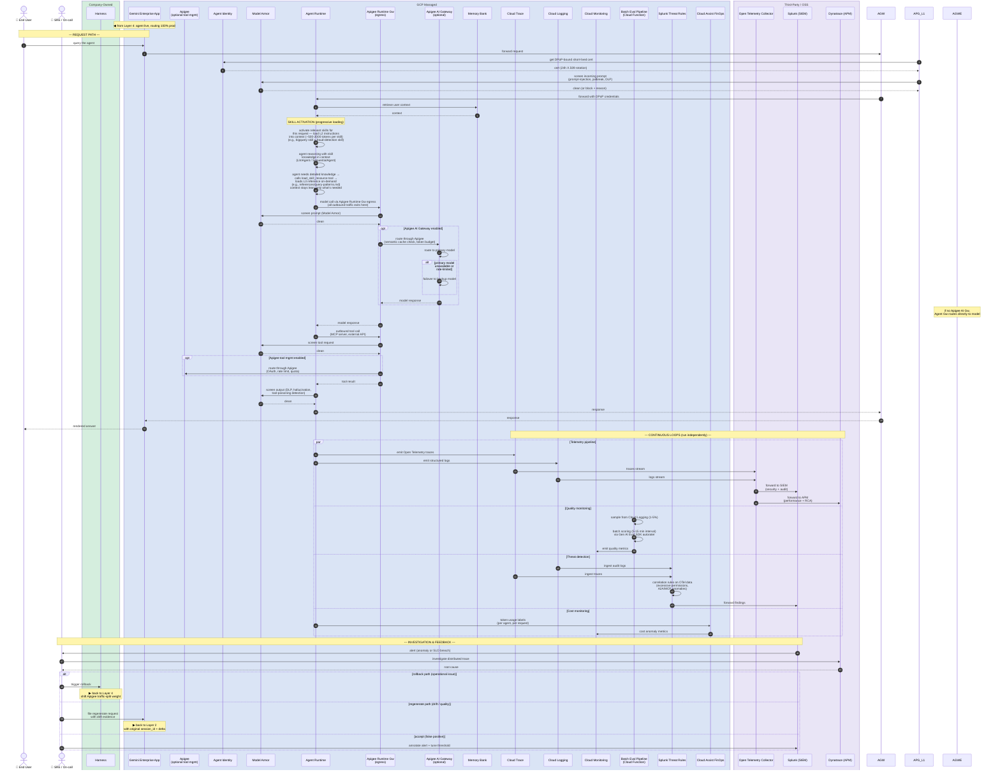

**Engineering notes:**

- The Open Telemetry Collector is the **single egress point** for all agent telemetry. Splunk (SIEM) and Dynatrace (APM) both consume from it. Adding another tool means adding another Open Telemetry exporter — agent code is untouched. This is why we standardized on Open Telemetry rather than vendor SDKs.
- Splunk Threat Rules ingest *audit logs and traces* via the Open Telemetry Collector, not direct agent telemetry. Because Splunk and Dynatrace consume the same Open Telemetry stream, investigations across the SIEM and APM views line up on the same trace IDs.
- The Batch Eval Pipeline (Cloud Function) samples a configurable percentage of logged conversations — typically 1–5% — at a batch interval of 5–15 minutes. The sampling rate is declared in the Design Contract per agent class. Unlike Vertex AI Online Eval (Preview), this is batch rather than real-time, but uses the same Gen AI Eval SDK for scoring consistency between build-time and runtime evaluation.
- The "regenerate" path is the most distinctive runtime feedback loop: a drift signal triggers a re-entry to Layer 2 with the original `session_id`, the drift evidence, and a delta prompt. The result is a *new* Design Contract that, on the next pass through Layers 3 and 4, replaces the running agent. This is how the platform stays current without engineers manually rebuilding agents.
- **Apigee Runtime Gateway serves as the unified control plane for all agent traffic in the GA-only variant.** It operates in two modes: **Ingress (Client-to-Agent)** controls which clients can access agents; **Egress (Agent-to-Anywhere)** secures and governs all outbound traffic from agents — to tools/MCP servers, to models (Gemini, Model Garden, third-party), to other agents (A2A), and to external APIs. Model routing, identity-aware policies, and Model Armor enforcement all happen at the Apigee Runtime Gateway egress point. Apigee AI Gateway and Apigee Tool Gateway are optional downstream destinations for advanced model and API management respectively.
- **Apigee AI Gateway is optional and sits downstream of Apigee Runtime Gateway egress.** When enabled, Apigee Runtime Gateway routes model traffic through Apigee AI Gateway for semantic caching, per-agent token budgets, and multi-provider failover. Without it, Apigee Runtime Gateway still routes model calls and applies Model Armor — you lose caching, token budgets, and cross-provider failover. The `ApigeeLlm` wrapper in ADK is only needed when Apigee AI Gateway is enabled.
- **Apigee Tool Gateway is also optional and downstream.** For external APIs that need API management (rate limiting, OAuth, quotas), Apigee Runtime Gateway can route tool calls through Apigee AI Gateway. Google-managed MCP servers (BigQuery, Cloud SQL, etc.) do not need Apigee — Apigee Runtime Gateway handles them directly.
- **In the GA-only variant, Splunk correlation rules replace SCC Agent Threat Detection.** There is no mutual exclusivity constraint between Splunk and Apigee Runtime Gateway — the constraint only existed between SCC Threat Detection and Agent Gateway (both preview). Using Splunk correlation rules on GA services eliminates this limitation entirely.
- **Skills are loaded progressively at runtime to prevent context bloat.** The agent package contains bundled skill directories (installed at build time in Layer 3). At runtime, the ADK `SkillToolset` manages a three-layer progressive disclosure: **L1 frontmatter** (always visible — ~50 tokens per skill, so the agent knows what skills are available); **L2 instructions** (loaded when a skill is activated for a request — ~500–2000 tokens of step-by-step guidance); **L3 references** (loaded on-demand via the `load_skill_resource` tool only when a specific step requires detailed knowledge). This means an agent with 10 bundled skills doesn't load all 10 into context for every request — it activates only the relevant ones, and within those, loads detailed references only when reasoning requires them. This is a local operation (skill files are in the package, not fetched over the network) and is the mechanism Google designed to solve the context bloat problem that MCP servers create when agents pull too much documentation into the context window.

---

## Reading the diagrams as one story

If you read the five diagrams in order, the artifact passed between them is always a *signed object*:

1. **Layer 1** produces a `session_id` — an authentication artifact bound to the developer and a JIRA ticket.
2. **Layer 2** produces a **cosign-signed Design Contract** — what to build, declared as typed JSON — accompanied by a generated component architecture diagram and sequence diagram that the developer approves at the Design Gate.
3. **Layer 3** produces a **signed bundle plus an attestation chain** — the build evidence, registered in Binary Authorization.
4. **Layer 4** produces a **runtime reference plus a fresh prod SPIFFE identity** — the deploy evidence, recorded in ServiceNow and Cloud Audit Logs.
5. **Layer 5** produces a **continuous evidence stream** — telemetry, eval, threat, and cost — that feeds back into Layer 2 (regenerate) or Layer 4 (rollback).

This is the literal definition of "born compliant": every interaction in every layer either consumes an attestation, produces an attestation, or appends to the audit chain. **There is no path through the system that escapes signing.**

For an engineer onboarding to the platform, the diagrams above are the right starting point — pick the layer your service lives in, follow the message flow, and the integration contract will be evident.

---

## Appendix: Where each component lives

| Component | Category | Layer(s) it appears in |
|---|---|---|
| Angular Dev Chat | Company | 1 |
| Company SSO/IdP | Company | 1 |
| Company Private Registry | Company | 2 |
| Design Contract Service | Company | 2 |
| Eval Set + Corpus | Company | 3 |
| Jenkins | Company | 3 |
| Harness | Company | 4 |
| Harness Feature Flags | Company | 4 |
| ServiceNow CMDB | Company | 4 |
| Gemini Enterprise App *(GA)* | GCP | 1, 5 |
| Apigee Runtime Gateway *(GA)* | GCP | 1, 4, 5 |
| Agent Identity | GCP | 1, 4, 5 |
| Model Armor *(GA)* | GCP | 1, 5 |
| Agent Runtime *(GA)* | GCP | 1, 2, 4, 5 |
| Agent Sessions *(GA)* | GCP | 1, 2 |
| Memory Bank *(GA)* | GCP | 2, 5 |
| Vertex AI Search *(GA)* (Pattern Catalog) | GCP | 2 |
| Apigee API Hub *(GA)* | GCP | 2 |
| Gemini Cloud Assist + ADC | GCP | 2, 3 |
| Cloud Storage | GCP | 2 |
| Company TF Module Library | Company | 3 |
| GitHub MCP Server *(GA)* | Third-party | 2 |
| Jenkins MCP Server | Company | 2 |
| Harness MCP Server | Company | 2 |
| Agent Garden Templates *(GA)* | GCP | 3 |
| ADK Framework *(GA)* | GCP | 3 |
| Company Scaffold Script | Company | 3 |
| Vertex AI Gen AI Eval *(GA)* | GCP | 3 |
| Custom Test Harness | Company | 3 |
| Org Policy *(GA)* | GCP | 3 |
| Artifact Registry *(GA)* | GCP | 3, 4 |
| Binary Authorization *(GA)* | GCP | 3, 4 |
| Secret Manager *(GA)* | GCP | 4, 5 |
| Cloud KMS | GCP | 4 |
| Apigee Tool Gateway *(GA, optional)* | GCP | 5 |
| Apigee AI Gateway *(GA, optional)* | GCP | 5 |
| Cloud Trace | GCP | 5 |
| Cloud Logging *(GA)* | GCP | 5 |
| Cloud Monitoring | GCP | 5 |
| Batch Eval Pipeline *(GA)* | GCP + Company | 5 |
| Splunk Threat Rules | Company | 5 |
| Cloud Assist FinOps *(GA)* | GCP | 5 |
| Cloud Audit Logs *(GA)* | GCP | all |
| Terraform *(GA)* | Third-party | 3 |
| OPA + Conftest *(GA)* | Third-party | 3 |
| Wiz IaC + AI-APP | Third-party | 3 |
| Snyk | Third-party | 3 |
| Twistlock | Third-party | 3 |
| Cosign / Sigstore | Third-party | 2, 3 |
| Open Telemetry Collector *(GA)* | Third-party | 5 |
| Splunk *(GA)* | Third-party | 5 |
| Dynatrace *(GA)* | Third-party | 5 |

---

## Worked Example — First Notice of Loss (FNOL) Agent

This section demonstrates what AgentForge produces for a real-world use case: a **First Notice of Loss** agent for a property & casualty insurance company. FNOL is the process where a policyholder reports a claim (auto accident, property damage, theft) for the first time. It is a natural fit for an agentic workflow because it involves multi-step intake, multiple data sources, third-party integrations, regulatory compliance, and human judgment at critical decision points.

**The developer's prompt to AgentForge:**

> "I need an agent that handles First Notice of Loss for auto claims. The policyholder calls or chats to report an accident. The agent should verify their policy, extract claim details from the conversation, assess severity, check for fraud indicators, enrich the claim with weather and police report data, generate a claim summary for the adjuster, and route high-severity claims to a human adjuster for review. It should also book a rental car and find nearby body shops for the policyholder. The agent must comply with state insurance regulations and maintain a full audit trail."

### Pattern selection by the Design Agent

Based on the use-case signals (multi-domain routing, parallel enrichment, human-in-the-loop for high-severity, sequential intake), the Design Agent selects:

| Pattern | ADK class | Role in FNOL |
|---|---|---|
| Coordinator / Dispatcher | `LlmAgent` (root) | Receives the policyholder's report, classifies claim type, routes to specialist sub-agents |
| Sequential Pipeline | `SequentialAgent` | Intake flow: verify policy → extract claim details → assess severity |
| Parallel Fan-out / Gather | `ParallelAgent` | Enrichment: simultaneously check weather data, police reports, fraud signals, coverage details |
| Generator & Critic | `LoopAgent` | Claim summary: generate summary → validate against policy terms → refine until accurate |
| Human-in-the-Loop | `LlmAgent` + `LongRunningFunctionTool` | Adjuster review gate for high-severity or flagged-fraud claims |

### Tools, skills, MCP servers, and A2A agents discovered

| Component | Type | Source | Purpose |
|---|---|---|---|
| BigQuery MCP Server | MCP Server | Apigee API Hub (GCP) | Query policy database and historical claims |
| Cloud SQL MCP Server | MCP Server | Apigee API Hub (GCP) | Read/write to the claims management system |
| Vertex AI Search | MCP Server | Apigee API Hub (GCP) | RAG over policy documents and state regulations |
| Weather API MCP Server | MCP Server | Company Private Registry | Enrich claim with weather conditions at time/location of incident |
| Policy Verification Skill | Company Skill | Company Private Registry | Wraps BigQuery MCP with company-specific policy validation rules, coverage limits, and deductible calculations |
| Fraud Detection Skill | Company Skill | Company Private Registry | Scores the claim against fraud indicators using company's ML model + historical patterns |
| SLA Tracker Skill | Company Skill | Company Private Registry | Tracks regulatory SLA (e.g., California requires acknowledgment within 15 days) |
| Body Shop Network Agent | A2A Agent | Third-party (A2A) | External agent operated by a repair network; finds available shops near the policyholder, returns estimates |
| Rental Car Agent | A2A Agent | Third-party (A2A) | External agent operated by a rental car partner; books a rental based on claim severity and policy coverage |
| Police Report Agent | A2A Agent | Third-party (A2A) | External agent operated by a data aggregator; retrieves police report by incident number and jurisdiction |
| Severity Classifier | FunctionTool | Generated (scaffold) | Classifies claim as low / medium / high severity based on extracted details — **engineer implements the logic** |
| Coverage Calculator | FunctionTool | Generated (scaffold) | Calculates coverage, deductible, and estimated payout — **engineer implements the logic** |
| Notification Sender | FunctionTool | Generated (scaffold) | Sends SMS/email confirmations to the policyholder — **engineer implements the logic** |

### Component architecture diagram (generated by the Design Agent)

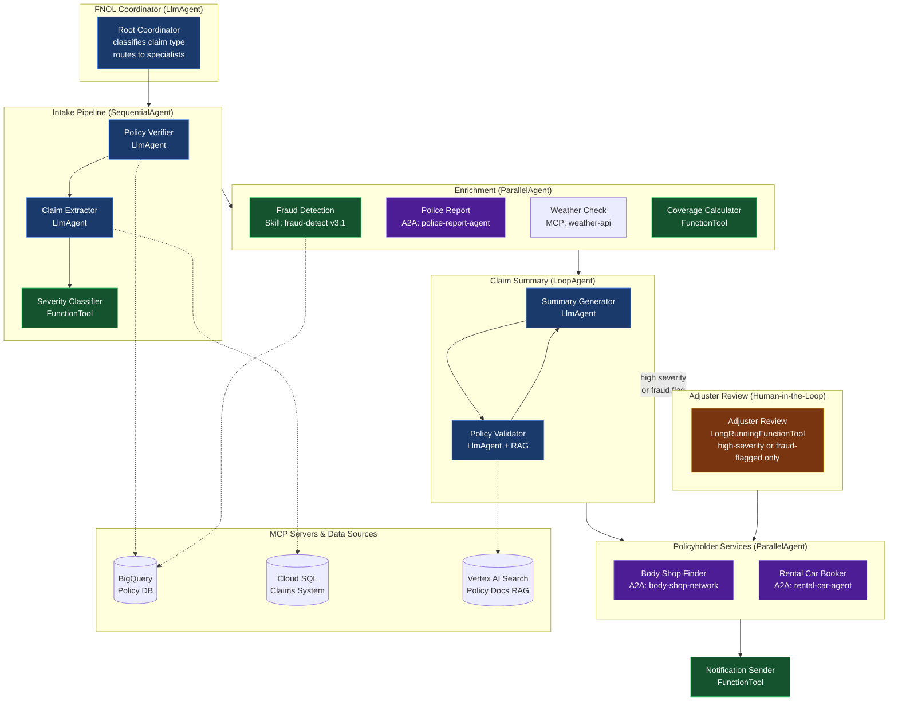

### Sequence diagram (generated by the Design Agent)

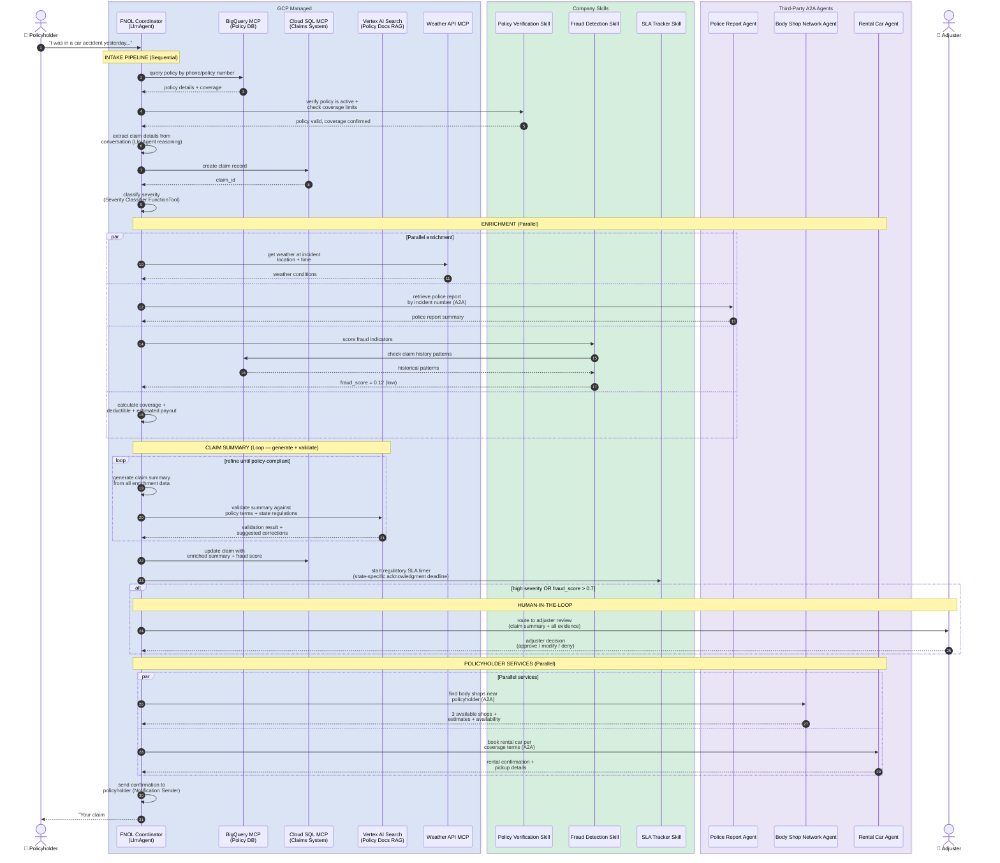

### What AgentForge provides vs what the FNOL team implements

For this use case, here is the concrete split:

**AgentForge generates (scaffolded, zero engineer effort):**
- The ADK agent tree: root `LlmAgent` → `SequentialAgent` (intake) → `ParallelAgent` (enrichment) → `LoopAgent` (summary) → `ParallelAgent` (services) + `LlmAgent` with `LongRunningFunctionTool` (HITL)
- MCP connections to BigQuery, Cloud SQL, Vertex AI Search, and Weather API — transport, auth, and PSC endpoint all wired
- A2A client connections to Body Shop Network, Rental Car, and Police Report agents — with signed Agent Card verification
- Skill bindings for Policy Verification, Fraud Detection, and SLA Tracker — pinned versions with signature hashes
- Agent Identity (SPIFFE), Apigee Runtime Gateway route, Model Armor template binding, CMEK, VPC-SC membership, Secret Manager entries
- Jenkinsfile (Plan Gate) + Harness YAML (Promotion Gate) from company shared-library templates
- Open Telemetry instrumentation, Cloud Trace spans, structured logging
- Eval harness pointing to the FNOL eval set and injection corpus
- Component diagram and sequence diagram (the ones above)

**The FNOL engineering team implements:**
- **System prompts** for each agent: how the coordinator classifies claim types, how the extractor identifies claim details from natural language, what persona the customer-facing agent uses
- **Severity Classifier logic**: the actual classification rules (total loss threshold, injury indicators, multi-vehicle detection)
- **Coverage Calculator logic**: deductible computation, coverage limit enforcement, pro-rata calculations
- **Notification Sender logic**: SMS/email templates, channel selection logic, opt-in verification
- **before_tool_callback on claims system**: validate that claim amounts don't exceed policy limits before writing to Cloud SQL
- **Fraud escalation threshold**: the 0.7 score cutoff in the example is a business decision the team calibrates
- **State regulation guardrails**: "in California, must acknowledge within 15 days; in New York, within 35 days" — implemented as before_model_callback logic referencing the SLA Tracker
- **Eval golden dataset**: 200+ example FNOL conversations with expected claim extractions, severity classifications, and summary outputs
- **Domain-specific injection corpus**: attempts to trick the agent into approving fraudulent claims, disclosing other policyholders' data, or bypassing the adjuster review gate
- **Memory Bank schema**: what policyholder context to retain across sessions (claim history, communication preferences, outstanding items)
- **A2A Agent Card**: describing the FNOL agent's capabilities for other enterprise agents that might need to invoke it

---

## Production Readiness — GA Migration Path

AgentForge comprises **71 distinct capabilities** across GCP managed services, company-owned components, third-party tools, and open protocols. Of these, **10 rely on preview services** that must be replaced for production deployment with SLA-backed alternatives. The remaining **61 are already GA or company-owned and carry forward unchanged.**

**This analysis exists to answer the executive question: "Can we ship this to production today?"** The answer is yes — with the GA alternatives below. And when the preview services reach GA, each swap is a Terraform module change, not an architectural redesign.

### Part 1: Capabilities that CHANGE (10 Preview → GA replacements)

| # | Capability | Future State (Preview) | GA-Only Replacement | What you gain | What you lose | Effort |
|---|---|---|---|---|---|---|
| 1 | **Agent-to-Anywhere Gateway** (ingress + egress) | **Agent Gateway** *(Private Preview)* — unified ingress + egress for all agent traffic (tools, models, A2A). mTLS, DPoP, identity-aware model routing, Model Armor inline, Context-Aware Access. | **Apigee** *(GA)* — MCP proxy, OAuth 2.1/OIDC, mTLS, Model Armor, traffic-split for canary, API Products for whitelist. Custom DPoP policies via Apigee policy engine. | Production SLA. No allowlist. Resolves SCC mutual exclusivity constraint. | Native A2A protocol awareness (must implement as custom Apigee policies). Native Agent Identity ↔ DPoP ↔ Context-Aware Access chain (must replicate via policies). | **3–4 weeks** |
| 2 | **MCP / tool / agent registry + whitelist** | **Agent Registry** *(Public Preview)* — centralized catalog of agents (with skills), MCP servers, tools. API-based search. Auto-registers agents on deploy. | **Apigee API Hub** *(GA)* — MCP is a first-class API style. Register MCP servers, whitelist via API Products, semantic search. + **Vertex AI Search** *(GA)* for semantic skill/pattern discovery. | Full GA. Richer API management (quotas, rate limits, developer portal). Semantic search stronger than Registry's metadata-only search. | Auto-registration on deploy (must build post-deploy hook). Google-managed MCP servers must be manually cataloged. | **2–3 weeks** |
| 3 | **Skill semantic discovery** | **Agent Registry** *(Public Preview)* — skills are first-class entities. Design Agent queries by capability. | **Vertex AI Search** *(GA)* — index company + Google skills (Markdown) as documents with embeddings + structured metadata. Semantic/hybrid search matches developer intent to skills. | Semantic discovery is *stronger* — embedding-based matching finds skills by intent, not just keyword. | No native "skill as first-class entity" — skills are documents in a search store. Requires sync pipeline from Skills repos. | **1–2 weeks** |
| 4 | **Agent lifecycle CLI** (scaffold + eval + deploy) | **agents-cli** *(Public Preview)* — scaffold from Garden template, eval, deploy, publish. Single CLI for entire lifecycle. | **ADK Python SDK** *(GA)* + **company scaffold script** — reads Design Contract, clones Garden template, parameterizes via ADK APIs, builds package. Eval via **Gen AI Eval SDK** *(GA)*. Deploy via **Agent Runtime REST API** *(GA)*. | Full GA. Complete control over scaffold logic. | Integrated lifecycle in one CLI. Must replicate each step (~500–800 lines Python). | **2–3 weeks** |
| 5 | **Skill installation + provenance** | **agents-cli** invokes `gh skill install` *(Public Preview)* | Company scaffold script calls `gh skill install` directly (**GitHub CLI is GA**) — same provenance verification, same version pinning, same SHA check | No functional difference — `gh skill` is GA regardless of agents-cli status | None | Included in #4 |
| 6 | **Synthetic persona testing** | **Agent Simulation** *(Preview)* — generates synthetic personas, automated diversity. | **Custom test harness** + **Vertex AI Gen AI Eval** *(GA)* — company-authored test scenarios (persona + intent + trajectory) run through multi-turn autorater. | Full GA. Deterministic — same scenarios every run. Tailored to company use cases. | Automated persona diversity. Test quality is only as good as scenarios written. | **1–2 weeks** |
| 7 | **Live traffic quality monitoring** | **Vertex AI Online Eval** *(Preview)* — samples 1–5% of live traffic, real-time autorater scoring for drift/hallucination. | **Cloud Monitoring** *(GA)* + **Cloud Function** *(GA)* — batch-samples logged conversations from **Cloud Logging** *(GA)*, scores via **Gen AI Eval SDK** *(GA)*, publishes custom metrics. | Full GA. Same eval SDK in build and runtime (consistency). Custom sampling logic. | Real-time → batch (5–15 min lag). Not suitable for safety-critical agents needing immediate halt on quality degradation. | **2 weeks** |
| 8 | **Agent-specific threat detection** | **SCC Agent Threat Detection** *(Preview)* — ML-based anomaly detection for excessive permissions, A2A/MCP anomalies. **⚠ Mutually exclusive with Agent Gateway.** | **Splunk correlation rules** *(GA)* — pattern-based detection ingesting same Cloud Audit Logs + Cloud Trace via Open Telemetry. | Full GA. In company's existing SIEM. **No mutual exclusivity constraint** with any gateway. | Google-trained ML models. Splunk rules catch known patterns; may miss novel attacks. | **1–2 weeks** |
| 9 | **Agent observability dashboard** | **Agent Observability** *(Preview)* — per-agent dashboard in Gemini Enterprise console (latency, errors, model calls, tool calls, token usage, CPU/memory). | **Custom Cloud Monitoring dashboard** *(GA)* — built from Open Telemetry metrics + Cloud Trace spans. Same data, custom layout. | Full GA. Custom layout tailored to company SRE workflows. Integrates with existing Dynatrace dashboards. | No pre-built per-agent dashboard — must design and build. Google's dashboard auto-discovers agent metrics; custom dashboard requires explicit metric configuration. | **1 week** |
| 10 | **Auto-registration of agents on deploy** | **Agent Registry auto-registration** *(Public Preview)* — agents deployed to Agent Runtime automatically appear in Agent Registry. | **Post-deploy hook in Harness pipeline** that calls **Apigee API Hub API** *(GA)* to register agent metadata (name, skills, endpoints, version, SPIFFE ID). | Explicit — registration is a deliberate pipeline step, not implicit. Easier to audit. | Automatic — must remember to include the hook. If hook fails, agent runs but is undiscoverable by other agents. | **1 week** |

### Part 2: Capabilities that STAY UNCHANGED (61 capabilities — already GA or company-owned)

**GCP Managed Services (30 — no change needed):**

| # | Capability | Component | Status |
|---|---|---|---|
| 11 | Agent hosting + auto-scaling | Agent Runtime | GA |
| 12 | Conversational state persistence | Agent Sessions | GA |
| 13 | Long-term agent memory | Memory Bank | GA |
| 14 | Agent identity + auth (SPIFFE, DPoP, X.509) | Agent Identity | GA |
| 15 | LLM reasoning framework | ADK Framework (Python, TypeScript, Java, Go) | GA |
| 16 | LLM models | Gemini 2.x / 3.x (Pro, Flash) via Model Garden | GA |
| 17 | Pattern + skill semantic search engine | Vertex AI Search | GA |
| 18 | Embeddings for semantic indexing | Vertex AI Embeddings API (text-embedding-005) | GA |
| 19 | IaC generation from natural language | Gemini Cloud Assist + Application Design Center | GA |
| 20 | Prompt / response AI firewall | Model Armor | GA |
| 21 | Model routing + failover (optional, downstream of gateway) | Apigee AI Gateway | GA |
| 22 | External tool API management (optional, downstream of gateway) | Apigee Tool Gateway | GA |
| 23 | Code scaffold templates | Agent Garden Templates | GA |
| 24 | Build-time evaluation (trajectory, autorater) | Vertex AI Gen AI Eval | GA |
| 25 | Signed bundle storage | Artifact Registry | GA |
| 26 | Attestation chain enforcement | Binary Authorization | GA |
| 27 | Secrets (native ADK integration, no long-lived keys) | Secret Manager | GA |
| 28 | Customer-managed encryption | Cloud KMS / CMEK | GA |
| 29 | Distributed tracing (Open Telemetry native) | Cloud Trace | GA |
| 30 | Metrics collection | Cloud Monitoring | GA |
| 31 | Structured + audit logging | Cloud Logging | GA |
| 32 | Admin / data / system event audit trail | Cloud Audit Logs | GA |
| 33 | Network perimeter + private ingress | VPC-SC + PSC-I | GA |
| 34 | Access control (principals, roles, bindings) | Cloud IAM | GA |
| 35 | Org-wide guardrails (CMEK, region, models) | Org Policy | GA |
| 36 | Context-aware access policies | Access Context Manager | GA (note: native in Agent Gateway; requires custom Apigee integration in GA-only variant) |
| 37 | Per-agent cost attribution | Cloud Billing + Labels | GA |
| 38 | Cost anomaly detection | Cloud Assist FinOps agent | GA |
| 39 | End-user agent surface | Gemini Enterprise App | GA |
| 40 | Async long-running results | Agent Inbox | GA |

**Company-Owned Components (11 — no change needed):**

| # | Capability | Component | Notes for GA-only variant |
|---|---|---|---|
| 41 | Developer chat interface + diagram rendering | Angular Developer Chat (mermaid.js) | Unchanged |
| 42 | SSO / authentication | Company SSO/IdP (Okta/Ping) | Unchanged |
| 43 | Company skills + recipes catalog | Company Private Registry | Merges into Apigee API Hub as a category in GA-only |
| 44 | Design contract signing + storage | Design Contract Service + Cloud Storage | Unchanged |
| 45 | Compliance-hardened Terraform modules | Company TF Module Library (GitHub repo) | Unchanged — accessed via GitHub MCP Server |
| 46 | Infrastructure CI pipeline template | Jenkins (via MCP) — `agent-infra-plan-apply-v3` | Unchanged — template parameterized via Jenkins MCP |
| 47 | Deployment CD pipeline template | Harness (via MCP) — `agent-deploy-canary-v4` | Unchanged — template parameterized via Harness MCP |
| 48 | Production feature toggles | Harness Feature Flags | Unchanged |
| 49 | Change management + audit trail | ServiceNow CMDB | Unchanged |
| 50 | Domain-specific test data | Eval Set + Corpus (golden + injection) | Unchanged — authored by use-case teams |
| 51 | Design evidence (architecture diagrams) | Mermaid component + sequence diagrams | Unchanged — generated by Design Agent, signed in contract |

**Third-Party / OSS Tools (14 — no change needed):**

| # | Capability | Component | Status |
|---|---|---|---|
| 52 | IaC engine | Terraform | GA |
| 53 | Policy-as-code evaluation | OPA + Conftest | GA |
| 54 | IaC risk scanning | Wiz IaC Scanner | GA |
| 55 | AI-APP runtime risk scanning | Wiz AI-APP | GA |
| 56 | Dependency vulnerability scanning | Snyk | GA |
| 57 | Container image scanning | Twistlock | GA |
| 58 | Artifact signing + transparency log | cosign / Sigstore (Fulcio + Rekor) | GA |
| 59 | Telemetry egress (single exit point) | Open Telemetry Collector | GA |
| 60 | SIEM (+ threat detection rules in GA-only) | Splunk | GA |
| 61 | APM + root-cause analysis | Dynatrace | GA |
| 62 | TF module + skill discovery from repos | GitHub MCP Server | GA |
| 63 | Jenkins template discovery + parameterization | Jenkins MCP Server | Company-operated |
| 64 | Harness template discovery + parameterization | Harness MCP Server | Company-operated |
| 65 | Skill installation with provenance verification | `gh skill` (GitHub CLI v2.90+) | GA |

**Open Protocols and Standards (6 — no change needed):**

| # | Capability | Protocol | Status |
|---|---|---|---|
| 66 | Agent-to-agent communication | A2A v1.0 (Linux Foundation) | GA |
| 67 | Tool connectivity | MCP (adopted by Google Dec 2025) | GA |
| 68 | Generative UI rendering | A2UI | GA |
| 69 | Proof-of-possession tokens | DPoP (IETF standard) | GA |
| 70 | Workload identity standard | SPIFFE / SPIRE | GA |
| 71 | Telemetry standard | Open Telemetry | GA |

### Part 3: Context-Aware Access — the one capability that works differently

| Capability | Future state | GA-only | Impact |
|---|---|---|---|
| Context-Aware Access | Native in Agent Gateway — CAA policies enforce access based on device posture, IP, identity attributes automatically | Must integrate **Access Context Manager API** *(GA)* with **Apigee custom policies** — CAA itself is GA, the Agent Gateway integration is not | **1 week** additional Apigee policy work beyond Row 1 |

### Impact summary

| Metric | Value |
|---|---|
| **Total capabilities in AgentForge** | **71** |
| **Capabilities that change (preview → GA)** | **10** (14% of total) |
| **Capabilities unchanged (already GA/company/OSS)** | **61** (86% of total) |
| **Total engineering effort for GA-only** | **14–20 weeks** of platform team work |
| **Largest single effort** | Agent Gateway → Apigee (3–4 weeks + 1 week CAA) |
| **Attestation chain impact** | **Zero** — all four gates fire at the same points |
| **Design Contract schema impact** | **Zero** — same fields, same JSON structure |
| **Scaffold vs engineer split impact** | **Zero** — same ~70/30 split |
| **Skill lifecycle impact** | **Zero** — same semantic discovery, same `gh skill install`, same progressive loading |
| **SCC mutual exclusivity resolved?** | **Yes** — Splunk has no gateway dependency |
| **Migration path back to managed** | Every GA replacement is a pluggable module with a documented exit ramp |

### The strategic decision

Two deployment strategies are available, and the choice depends on the company's risk tolerance:

**Strategy A — Preview-inclusive (move fast, accept preview risk):**
Deploy with Agent Gateway, Agent Registry, and agents-cli in their current preview state. Accept the lack of SLA and the SCC mutual exclusivity constraint. Benefit from tighter managed-service integration. Plan to absorb breaking changes when these services reach GA.

*Best for:* Companies with a strong platform team, existing Google Cloud partnership, and a launch timeline that aligns with expected GA dates (H2 2026 for most services).

**Strategy B — GA-only (production-grade, zero preview dependencies):**
Deploy with Apigee, API Hub, and the custom scaffold script. Accept the additional 14–20 weeks of platform engineering. Benefit from production SLAs on every component. Migrate to managed services as they reach GA.

*Best for:* Regulated industries (insurance, financial services, healthcare) where CISO approval requires SLA-backed services, or companies where the launch timeline cannot tolerate preview-service breaking changes.

**In both strategies, the developer experience is identical.** The developer describes a use case, reviews diagrams at the Design Gate, and receives a scaffolded agent. The attestation chain is the same. The Design Contract is the same. The skill lifecycle is the same. The only difference is what runs behind the interfaces — and AgentForge is designed so that swap is invisible to the developer.

---

## Intellectual Property — Patentability Analysis

> **Disclaimer:** This analysis is a technical assessment of potential patentability — not legal advice. Patent counsel specializing in software patents should be consulted before filing.

AgentForge contains seven clusters of potentially patentable innovations. Each is evaluated against the three patentability requirements (novelty, non-obviousness, utility) and the *Alice Corp v. CLS Bank* eligibility hurdle that requires "something significantly more" than an abstract idea implemented on a computer.

### What is NOT patentable in AgentForge

These are known techniques applied to a new domain and would be rejected as obvious:

- Using an LLM to analyze a use case and recommend an architecture
- Using Terraform to provision infrastructure
- Using CI/CD pipelines with approval gates
- Using cosign/Sigstore for artifact signing
- Using MCP servers for tool access
- Using semantic search to find relevant documents (standard RAG)
- Generating code from templates (scaffolding tools have existed since Yeoman, 2012)
- Using OPA for policy-as-code

### Claim 1 — Bifurcated Design-Generation Architecture with Signed Intermediate Representation

**Problem solved:** LLM-assisted code generation is non-deterministic and unauditable. No existing system can prove to a regulator that the same inputs produce the same outputs.

**Novel method:** AgentForge bifurcates the pipeline into an LLM-assisted *design phase* (Layer 2) and an LLM-free *generation phase* (Layer 3), connected by a cryptographically signed intermediate representation (the Design Contract) that is human-approved at the boundary. The generation phase is deterministic — every parameter consumed by the code generator comes from the signed contract. This is not "LLM generates code" (known) or "templates generate code" (known) — it is "LLM generates a machine-readable *specification* that a deterministic generator consumes, with a cryptographic signature and human approval gate at the boundary."

**Draft claim:** A computer-implemented method for generating an agentic software application, comprising: (a) generating, by a design agent using an LLM, a machine-readable design contract comprising pattern composition, agent class hierarchy, tool binding declarations, and infrastructure module references; (b) presenting the design contract to a human operator for approval; (c) upon approval, cryptographically signing the design contract; (d) deterministically generating, by a code scaffolding tool consuming only fields of the verified design contract and without invoking an LLM, application source code; and (e) producing a signed application bundle with an attestation chain linking the signed design contract to the generated bundle.

| Novelty | Non-obviousness | Alice risk | **Strength** |
|---|---|---|---|
| High | High | Low (specific technical method) | **Strong** |

### Claim 2 — Two-Pass Semantic Search with Composition Adjacency Graph for Agent Pattern Selection

**Problem solved:** Agent design patterns are compositional — a real use case requires combining multiple patterns. Existing semantic search returns individual documents but cannot validate that returned patterns are *structurally composable* with each other.

**Novel method:** A two-pass retrieval where: (1) hybrid search (semantic embedding + structured metadata filters) identifies candidate root patterns; (2) a composition adjacency list in the structured metadata is traversed to retrieve only structurally composable child patterns; (3) the combined composition is validated against the adjacency graph before acceptance.

**Draft claim:** A computer-implemented method for selecting a composition of agent design patterns, comprising: (a) maintaining pattern documents with structured metadata including composability lists; (b) executing a first hybrid search combining semantic embedding match with metadata filters; (c) reading the composability list from the selected root pattern; (d) executing a second retrieval for patterns in the composability list; (e) assembling a pattern composition tree; and (f) validating each parent-child relationship against both patterns' composability lists.

| Novelty | Non-obviousness | Alice risk | **Strength** |
|---|---|---|---|
| High | Medium-high | Low (search algorithm) | **Strong** |

### Claim 3 — Multi-Gate Attestation Chain for Agent Lifecycle Compliance

**Problem solved:** Existing CI/CD approval gates produce pass/fail flags, not durable cryptographically verifiable evidence. An auditor cannot prove, from the deployed artifact alone, that all reviews occurred and were not tampered with.

**Novel method:** A four-gate attestation chain where each gate produces a cryptographically signed attestation referencing the hash of the previous attestation, creating a tamper-proof sequence registered in a binary authorization system. Deployment is conditional on verification of the complete chain.

**Draft claim:** A system for compliance-verified deployment of an AI agent, comprising: (a) a design gate generating a signed design attestation; (b) a plan gate generating a signed plan attestation referencing the design attestation hash; (c) an evaluation gate generating a signed evaluation attestation referencing the plan attestation hash; (d) a promotion gate verifying the complete chain before deployment; and (e) a deployment module that deploys only if the chain is valid.

| Novelty | Non-obviousness | Alice risk | **Strength** |
|---|---|---|---|
| Medium | Medium | Medium (related to SLSA framework) | **Medium** |

### Claim 4 — LLM-Generated Architecture Diagrams from Pattern Composition as Signed Design Evidence

**Problem solved:** Human reviewers approve software designs by reading configuration files or prose — neither is an effective review surface. Architecture diagrams are the natural review surface but require manual effort.

**Novel method:** The design agent generates machine-renderable diagram source code (Mermaid) from the pattern composition and agent tree, stores them alongside the design contract, includes their URIs in the signed contract payload (so post-approval tampering invalidates the signature), and presents them to the reviewer for approval via client-side rendering.

**Draft claim:** A method for generating reviewable architecture documentation, comprising: (a) generating diagram source code derived from pattern composition and agent class hierarchy; (b) storing diagram source and obtaining identifiers; (c) including identifiers in the design contract; (d) cryptographically signing the contract including diagram identifiers; (e) presenting diagrams via client-side rendering for review; and (f) upon approval, transmitting the signed contract with embedded diagram identifiers to a downstream code generation pipeline.

| Novelty | Non-obviousness | Alice risk | **Strength** |
|---|---|---|---|
| High | High | Low (specific workflow) | **Strong** |

### Claim 5 — Federated Multi-Source Registry Discovery via MCP for Agent Design

**Problem solved:** A design agent must discover tools, skills, MCP servers, infrastructure modules, and CI/CD pipeline templates from multiple heterogeneous registries. No existing system performs parallel multi-source discovery and wires heterogeneous results into a single signed specification.

**Novel method:** Five-way parallel discovery across: (1) cloud-provider agent registry for managed tools/MCP servers; (2) enterprise-private registry for company-vetted skills; (3) code-repository server via MCP for versioned infrastructure modules; (4) CI server via MCP for pipeline templates; (5) CD server via MCP for deployment templates. Results are mapped to agent nodes and assembled into structured binding declarations in a machine-readable design contract.

**Draft claim:** A method for federated discovery of agent components, comprising: (a) receiving capability requirements from a selected pattern composition; (b) executing, in parallel, queries against three or more heterogeneous registries including a cloud registry, an enterprise registry, and one or more MCP servers; (c) mapping candidate components to agent nodes; (d) assembling structured binding declarations; and (e) including the declarations in a signed design contract for deterministic code generation.

| Novelty | Non-obviousness | Alice risk | **Strength** |
|---|---|---|---|
| Medium-high | Medium | Low (technical method) | **Medium-strong** |

### Claim 6 — Intent-Driven Semantic Skill Discovery with Provenance-Verified Agent Packaging

**Problem solved:** AI agents need condensed domain expertise (skills) to use tools correctly, but existing approaches either load entire documentation into context (causing context bloat and token waste) or require manual skill selection (slow and error-prone). No existing system automatically discovers skills based on user intent, maps them to specific agent nodes in a composition tree, verifies their provenance at build time, and bundles them for progressive runtime loading.

**Novel method:** A multi-phase skill lifecycle comprising: (1) skills authored in Markdown with YAML frontmatter are embedded via a foundation model's embeddings API and indexed into a search data store with both dense (semantic) and sparse (keyword) embeddings plus structured metadata; (2) upon receiving a use-case description, a design agent performs a hybrid search combining semantic embedding match on the use-case intent with structured metadata filters to discover relevant skills; (3) discovered skills are mapped to specific nodes in the agent pattern composition tree based on each node's capability requirements; (4) skill assignments with version pins and provenance SHA hashes are written into a signed design contract; (5) at build time, a scaffold tool reads the skill references, installs each skill from a version-controlled repository using the version pin, verifies the provenance SHA matches the design contract (failing the build on mismatch), and bundles the skill directories into the agent package alongside generated code; (6) the scaffold tool wires an ADK `SkillToolset` with a `load_skill_resource` tool enabling three-layer progressive disclosure at runtime: L1 frontmatter always visible (~50 tokens), L2 instructions loaded on activation (~500–2000 tokens), L3 references loaded on-demand only when detailed knowledge is needed.

**Draft claim:** A computer-implemented method for intent-driven skill provisioning for an AI agent, comprising: (a) maintaining, in a search data store, a plurality of skill documents, each comprising Markdown content embedded as dense and sparse vectors and structured metadata including capability tags, domain classification, and version; (b) receiving a natural-language use-case description; (c) executing a hybrid search combining semantic embedding match on the use-case description with structured metadata filters to produce a ranked set of candidate skills; (d) mapping each candidate skill to a specific node in an agent pattern composition tree based on the node's capability requirements; (e) including, in a cryptographically signed design contract, skill references specifying for each skill a repository source, version pin, provenance hash, and assigned agent node; (f) at build time, installing each skill from its repository at the pinned version, verifying the provenance hash against the design contract, and failing the build if any hash mismatches; (g) bundling the installed skill directories into the agent package; (h) wiring a skill toolset in the agent framework that exposes a progressive loading mechanism with three disclosure layers: metadata always visible, instructions loaded on activation, and reference content loaded on-demand; and (i) at runtime, loading skill content progressively based on the agent's reasoning needs, such that context window usage is minimized while domain expertise is available when required.

**Why this survives Alice:** The claim recites a specific technical pipeline — from embedding-based semantic discovery through provenance-verified installation through progressive runtime loading — that solves two specific technical problems (context bloat and manual skill selection). The three-layer progressive disclosure mechanism (L1/L2/L3) is a specific data structure with specific loading semantics, not an abstract business process.

**Prior art risk:** Low. Google's Agent Skills format is new (Next '26 Day 1). Semantic search for documents exists, but the combination of intent-driven discovery → agent-node mapping → provenance-verified installation → progressive three-layer runtime loading is novel. No existing agent framework performs this end-to-end flow.

| Novelty | Non-obviousness | Alice risk | **Strength** |
|---|---|---|---|
| Very high | High | Low (specific data structure + algorithm) | **Very strong** |

### Claim 7 — MCP-Mediated CI/CD Pipeline Template Discovery and Parameterization

**Problem solved:** CI/CD pipelines for agent deployments are typically generated as YAML/Groovy files by an LLM, producing unique, non-auditable artifacts every time. Alternatively, teams manually select and configure pipeline templates — slow and error-prone.

**Novel method:** CI/CD tools (Jenkins, Harness) expose MCP servers registered in an agent registry. A design agent discovers available pipeline templates by querying these MCP servers, reads the template parameter schemas, and supplies values from the design contract. The templates themselves are pre-staged, company-audited, and version-pinned — all gate logic lives in the template, not in generated code. No pipeline YAML is generated. The design contract carries `pipeline_configs` specifying template IDs and parameter sets, and the downstream pipeline consumes these configurations deterministically.

**Draft claim:** A method for automated CI/CD pipeline configuration for agent deployment, comprising: (a) registering, in an agent registry, MCP server endpoints for one or more CI/CD tools, each exposing a set of pre-audited pipeline templates with typed parameter schemas; (b) querying, by a design agent, the MCP server endpoints to discover available pipeline templates and read their parameter schemas; (c) populating the parameter schemas with values derived from a design contract specifying the agent's infrastructure, identity, deployment, and testing requirements; (d) including, in the signed design contract, pipeline configuration objects specifying template identifiers and populated parameter sets; and (e) at build time, triggering the pre-audited pipeline templates with the parameters from the signed contract, such that no pipeline definition code is generated and all gate logic executes from the pre-audited template.

**Why this survives Alice:** The claim describes a specific method for MCP-mediated template discovery and parameterization that eliminates generated pipeline artifacts — a concrete technical improvement over the existing pattern of LLM-generated CI/CD YAML. The MCP server as a discovery and schema-reading interface for CI/CD templates is a novel integration pattern.

| Novelty | Non-obviousness | Alice risk | **Strength** |
|---|---|---|---|
| High | High | Low (specific integration method) | **Strong** |

### Patent strength summary

| Claim | Innovation | Strength | File as |
|---|---|---|---|
| 1. Bifurcated design-generation with signed IR | The architectural boundary that makes the whole system work | **Strong** | Independent |
| 2. Two-pass composition search | Specific algorithm with novel data structure | **Strong** | Independent |
| 3. Four-gate attestation chain | Cryptographic chain for agent lifecycle | **Medium** | Dependent on Claim 1 |
| 4. LLM-generated diagrams as signed evidence | Novel review-surface innovation | **Strong** | Independent |
| 5. Federated five-source MCP discovery | Novel integration pattern | **Medium-strong** | Dependent on Claim 1 |
| 6. Intent-driven skill discovery + progressive loading | Most novel single claim — combines five innovations | **Very strong** | Independent |
| 7. MCP-mediated CI/CD template parameterization | Eliminates generated pipeline YAML | **Strong** | Independent |

**Recommended filing strategy:** Claims 1, 2, 4, 6, and 7 as independent claims in a provisional patent application. Claims 3 and 5 as dependent claims narrowing Claims 1 and 5 respectively. Claim 6 (intent-driven skill discovery) is the strongest individual claim due to the combination of five distinct technical innovations in a single pipeline, the very low prior art risk (Google's skill format was announced days ago), and the specific three-layer progressive disclosure data structure that examiners can evaluate independently of the agentic context.

---

## Conclusion — The Road Ahead

AgentForge exists because the hardest part of enterprise AI is not building one agent — it is building the hundredth agent with the same compliance posture as the first. Every enterprise that has shipped agents at scale has learned the same lesson: without a paved road, teams diverge, standards decay, and the CISO's office becomes the bottleneck.

What Google shipped at Next '26 made this platform possible. Agent Identity, Agent Gateway, Model Armor, Agent Runtime, and Agent Registry are the managed primitives the industry needed — but they are primitives, not a product. AgentForge is the opinionated product layer that makes them work together as a governed pipeline, aligned to the company's Jenkins/Harness/OPA standards, producing agents that are compliant on first deploy and observable from day one.

**For the engineer reading this document**, the promise is specific: you will never again write Terraform for an agent deployment. You will never again configure observability for an agent. You will never again debate which ADK pattern to use without evidence. You will never again face a compliance review that starts from a blank spreadsheet. AgentForge handles those. What you *will* do is write the business logic that makes your agent valuable, the eval assertions that prove it works, and the guardrails that keep it safe in your domain. That is the work that only you can do — and AgentForge is designed to make sure that is the *only* work you have to do.

**For the architect reading this document**, the promise is structural: every agent deployed through AgentForge inherits the same identity model, the same gateway posture, the same observability stack, and the same attestation chain. When the CISO asks "how do we know all our agents are compliant?", the answer is not "we reviewed each one" — it is "they were forged compliant, and here is the signed chain that proves it."

**For the executive reading this document**, the promise is economic: AgentForge turns agent development from a linear cost (each agent requires a full team and a full review cycle) into a platform cost (invest once, deploy many). The first agent takes four weeks. The fiftieth takes two. The compliance posture of the fiftieth is identical to the first — because compliance is inherited, not re-earned.

The FNOL example above is one use case. The same platform, the same patterns, the same paved road applies to claims adjudication, underwriting triage, customer onboarding, fraud investigation, regulatory reporting, and every other workflow where an enterprise needs an AI agent that is trustworthy on day one. The patterns are composable. The modules are reusable. The attestation chain is continuous.

**AgentForge GA. Born Compliant. Built to Scale. Zero Preview Dependencies.**
