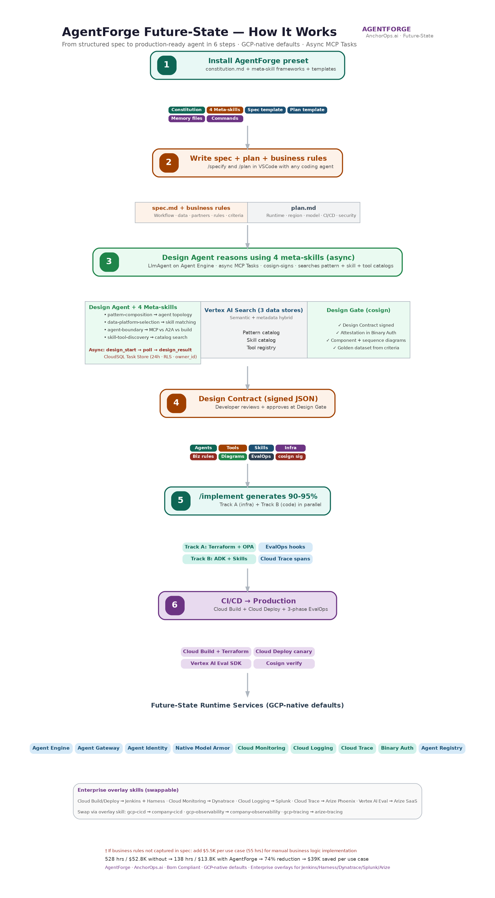
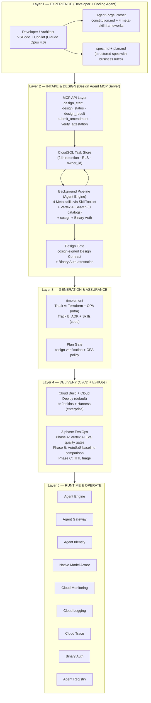
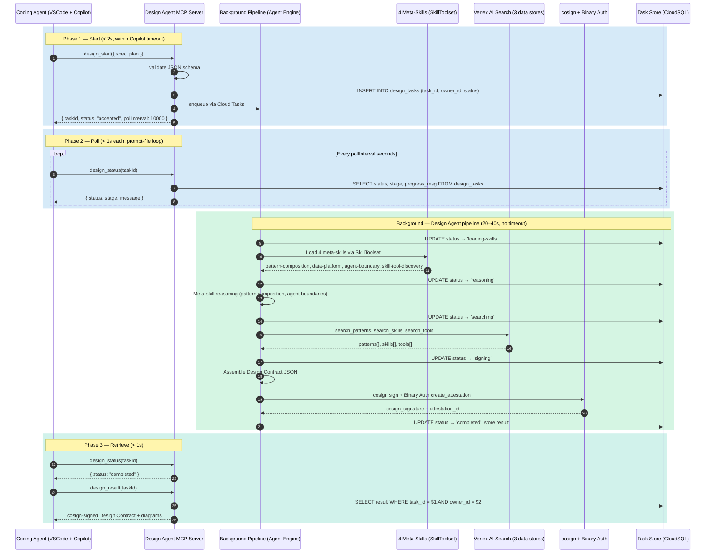
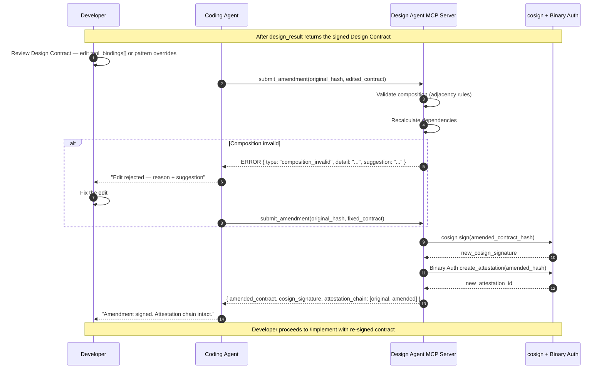

# AgentForge — Future-State Architecture (Preview Services)

**A spec-driven multi-agent development platform on Google Cloud Platform**
*Future-State — leverages GCP preview services for native agent lifecycle, gateway, identity, and consumption*
*AnchorOps.ai — Commercial product for GCP Marketplace*

> **Relationship to GA version:** This document describes the future-state architecture that uses GCP preview and pre-GA services. The GA version (separate document) uses only SLA-backed services and is the recommended starting point for production deployments today. As preview services reach GA, the platform will migrate incrementally — the core design (Design Agent MCP Server, meta-skills, signed Design Contract, attestation chain) is identical across both versions. Only the runtime layer changes.

> **Diagrams:** All architecture diagrams are embedded inline — Mermaid flowcharts and sequence diagrams render in GitHub natively and in VSCode with the [Markdown Preview Mermaid Support](https://marketplace.visualstudio.com/items?itemName=bierner.markdown-mermaid) extension. The infographic PNG renders in any markdown viewer when placed in the same directory as this file.

### Document set

| Document | Filename | Audience | Covers |
|---|---|---|---|
| **This document** | `agentforge-speckit-future-architecture.md` | Architects, tech leads | **WHY** — design decisions, Design Agent internals, meta-skills, governance gates |
| Developer Guide | `agentforge-speckit-future-developer-guide.md` | Developers | **HOW** — step-by-step workflow, spec/plan templates, worked examples |
| Operations Playbook | `agentforge-speckit-future-operations-playbook.md` | Platform engineering | **PROCEDURES** — operate, maintain, deploy, govern |

### Related core AgentCatalyst documents

AgentForge shares the async MCP Tasks pattern and several architectural principles with the AgentCatalyst platform:

| Core document | Filename | Consult for |
|---|---|---|
| Core Architecture | `agentcatalyst-architecture-archetype-agnostic.md` | Async MCP Tasks design (Layer 2), EvalOps three-layer lifecycle (Layer 4), Blueprint Advisor wire format |
| Core Operations Runbook | `agentcatalyst-operations-runbook-both-options.md` | MCP tool wire format (§1a), search quality regression patterns (§2), acceptance telemetry pipeline (§3) |

---

## Executive Summary — For the C-Suite

### The problem

Every enterprise team building AI agents today follows its own approach. Coding assistants help write code faster, but they have no knowledge of company patterns, no ability to reason about architecture, and no understanding of compliance standards. The result: $52.8K and 528 hours per use case, 82 hours of compliance rework, and 30+ POCs that never reach production.

### The solution: AgentForge

AgentForge is a spec-driven platform with three core capabilities:

1. **Design Agent** — an LlmAgent with 4 meta-skills (pattern-composition, data-platform-selection, agent-boundary, skill-tool-discovery) loaded as separate SKILL.md files via ADK SkillToolset with L1/L2/L3 progressive disclosure. The Design Agent is **exposed as an MCP Server** — the developer's coding agent connects via MCP protocol, calls `design_start(spec, plan)` to initiate an async background task, polls `design_status(taskId)` for progress, and retrieves the result via `design_result(taskId)` — a **cosign-signed Design Contract** (not an unsigned YAML blueprint). This async pattern (using MCP Tasks, spec revision 2025-11-25) is necessary because VS Code Copilot enforces a hard 10–15 second timeout on synchronous MCP tool calls, while the Design Agent's meta-skill reasoning + RAG + cosign signing takes 20–40 seconds. The Design Agent REASONS about architecture using embedded decision frameworks — fundamentally different from RAG-based recommendation.

2. **Two-gate attestation chain** — the Design Contract is cosign-signed and registered in Binary Authorization (Design Gate). The Terraform plan is OPA-validated, cosign-signed, and registered referencing the Design Contract hash (Plan Gate). Production deployment is blocked unless both attestations are present. This creates a cryptographic chain from spec → contract → plan → production.

3. **Skill-constrained code generation** — the coding agent is constrained by three layers: the Design Contract (WHAT), the archetype skill (HOW), and the overlay skills (MUST). Constitution.md encodes non-negotiable code generation rules (NOT the meta-skills — those are separate SKILL.md files loaded into the Design Agent). The coding agent generates a first draft including working business logic from structured rules in the spec — for the developer to review and make their own.

AgentForge generates code, IaC from company pattern repos (multi-region, DR-aware, compliant from day one), and CI/CD pipeline definitions. It NEVER deploys. A GitHub Action triggers the CI/CD pipeline (Cloud Build + Cloud Deploy by default; Jenkins + Harness via enterprise overlay) to provision IaC, then build and deploy.

### Key principles

1. **Spec-driven, not prompt-driven.** Structured 10-section template with business rules.
2. **AI-reasoned, human-governed.** The Design Agent reasons; the developer reviews the Design Contract. Two cryptographic gates (Design Gate + Plan Gate) enforce governance.
3. **Compliant by construction.** Overlay skills + IaC from company pattern repos + constitution.md. Standards are structural, not retrofitted.
4. **Archetype-agnostic.** Same platform, same meta-skills, same overlay skills — regardless of whether you're building an AI agent, a microservice, a data pipeline, or an API. Swap catalogs and skills to support any archetype.
5. **Generates, never deploys.** GitHub Action triggers CI/CD pipeline (Cloud Build/Deploy default; Jenkins/Harness enterprise). Coding agent never deploys.

**Supported coding agents:** Officially tested: **Copilot, Claude Code, Cursor**. Compatible (community-tested): Gemini CLI, Windsurf. MCP protocol **v2025-03-26**.

### The ROI

**Two ROI scenarios:** The future-state variant has a ~22% per-use-case premium during the preview period (additional debugging, workarounds, API instability). This premium is eliminated as preview services reach GA.

| Metric | During Preview Period | After Services Reach GA |
|---|---|---|
| Per use case cost | **$16.8K** (168 hrs) | **$13.8K** (138 hrs) |
| Per use case savings | **$36K (68%)** | **$39K (74%)** |
| Platform investment (Year 1) | **$59K** (build $30K + GCP $16K + maint $13K) | **$55K** (GCP drops to $12K as preview pricing normalizes) |
| Break-even | **2nd use case** (2 × $36K = $72K > $59K) | **2nd use case** |
| Enterprise (210 use cases) | **$7.55M saved / 43× ROI** ($7.55M / $176K) | **$8.19M saved / 47× ROI** ($8.19M / $174K) |

**Year 1 Full TCO (build-cost-only ROI above; full TCO below):**

| Cost component | Preview | Post-GA |
|---|---|---|
| Platform build + GCP infra + maintenance | $59K | $55K |
| Platform engineering operations (~2 FTE) | ~$400K | ~$400K |
| EA office curation (~0.5 FTE) | ~$100K | ~$100K |
| LOB onboarding (7 LOBs) | ~$119K | ~$119K |
| **Year 1 Full TCO** | **~$678K** | **~$674K** |
| **Year 1 ROI (full TCO)** | **~11.1×** ($7.55M / $678K) | **~12.2×** ($8.19M / $674K) |

Year 2+ ROI improves as build and onboarding costs amortize. The 43×/47× figures above represent build-cost-only ROI.
| GCP Marketplace pricing | Free / Pro ($149/mo) / Enterprise ($50K+/yr) |
| Time to first agent | **~3.5 weeks** (down from ~7.5 weeks) — same as GA |

The preview premium affects build cost, not delivery speed. The 22% is engineering complexity (undocumented APIs, workarounds), not architectural overhead. As services mature and documentation improves, per-use-case cost converges to GA levels.

### Per use case cost comparison

| | Without AgentForge | With AgentForge |
|---|---|---|
| **Build phase** | 446 hrs | 168 hrs during preview (requirements 60 + spec/plan/biz rules 8 + Design Agent 0.1 + generate 1 + complex domain logic 20 + prompts 25 + testing 15 + PR 8 + preview debugging/workarounds 30) · 138 hrs post-GA |
| **Compliance remediation** | 82 hrs | 0 hrs (compliant by construction + attestation chain) |
| **Total** | **528 hrs / $52.8K / ~7.5 weeks** | **168 hrs / $16.8K / ~3.5 weeks** (preview) · **138 hrs / $13.8K** (post-GA) |

† Requirements gathering (60 hrs) is identical on both sides. AgentForge reduces post-requirements time.
† Future-state GCP infrastructure estimate: $16K/year ($1.3K/month) during preview — $4K higher than GA due to Agent Engine (higher per-instance cost than Cloud Run) and Agent Gateway (separate from Apigee billing). Expected to normalize to $12-14K/year as services reach GA and pricing stabilizes.
† Platform cost is $59K during preview ($55K + $4K additional GCP infra) vs $55K post-GA. Compared to AgentCatalyst's $51K. The additional $4K covers: cosign key provisioning + Binary Authorization configuration, segmented Model Armor 3-layer setup, and 4 meta-skill implementation/testing (50 additional hours).
† Without business rules in spec: $19.3K per use case. ROI remains 40×.

### Preview services used (and what they replace)

| GA Service (current) | Preview Service (future-state) | What changes | Risk |
|---|---|---|---|
| Cloud Run | **Agent Engine** (Pre-GA) | Native agent hosting with built-in session management, memory, and agent lifecycle | No SLA. API may change. |
| Apigee Runtime Gateway | **Agent Gateway** (Preview) | Native agent-aware gateway with built-in A2A routing, MCP proxying, and agent discovery | No SLA. Limited documentation. |
| Workload Identity | **Agent Identity** (Preview) | Per-agent identity with fine-grained capability-based access control | No SLA. May merge into Workload Identity. |
| Custom agent management | **Agent Registry** (Preview) | Native agent discovery, versioning, health monitoring, and lifecycle management | No SLA. Schema may change. |
| Custom segmented Model Armor | **Native Segmented Model Armor** (Preview) | Google-managed per-source screening with source attribution — eliminates custom 3-layer implementation | No SLA. Feature set may change. |
| No consumption layer | **Gemini Enterprise Agent Platform** (Preview) | End-user consumption layer for published agents — chat, voice, API access | No SLA. UX may change. |

**Migration strategy:** Start with GA version in production. Adopt preview services in non-production environments. Migrate to future-state as each service reaches GA. The Design Agent MCP Server, meta-skills, Design Contract schema, attestation chain, and overlay skills are unchanged — only the runtime layer migrates.

**Per-service GA fallback matrix (emergency revert procedures):**

| Preview Service | GA Fallback | Revert Procedure | Estimated RTO | What's Lost |
|---|---|---|---|---|
| Agent Engine | Cloud Run | Redeploy containers to Cloud Run. Re-configure external session management (CloudSQL or Redis for sessions). | 2-4 hours | Built-in session management, native agent metrics |
| Agent Gateway | Apigee Runtime Gateway | Switch DNS/load balancer to Apigee. Re-enable manual proxy config. | 1-2 hours | Auto-discovery, native MCP proxying, A2A routing |
| Agent Identity | Workload Identity | Revert to per-service-account IAM. Less granular but functional. | 1-2 hours | Per-agent fine-grained capabilities |
| Agent Registry | Manual Cloud Run revisions | Manage agent versions via Cloud Run revision tags. No discovery API. | 2-4 hours | Agent discovery, health monitoring, lifecycle management |
| Native Segmented Model Armor | Custom 3-layer callbacks | Re-deploy with GA overlay skill generating custom Model Armor callbacks. | 4-8 hours | Google-managed screening; must maintain custom code |
| Gemini Enterprise | Custom Web UI | Activate the SSE-based conversational UI (generated by /implement as fallback). | 1-2 hours | Gemini Enterprise consumption UX (chat, voice) |

**Dual-track IaC requirement:** Maintain both GA and future-state Terraform modules at all times. IaC pattern repos use a `runtime_target` parameter: `agent-engine` (future-state) or `cloud-run` (GA fallback). Both are tested in CI weekly. See Operations Playbook, Section 9.

---

## How It Works — Visual Overview



*6 steps from structured spec to production-ready agent. GCP-native defaults with enterprise overlay swaps for Dynatrace, Splunk, and Arize Phoenix. Design Agent invoked asynchronously via MCP Tasks with CloudSQL Task Store.*

---

## End-to-end thread (read this first)

A developer needs an FNOL claims agent. She opens VSCode with Claude Code and installs the AgentForge preset: `specify preset add agentforge-enterprise`.

She types `/specify`. A 10-section template appears — Business Context, Workflow, Data Systems, External Partners, What We Own, Business Rules, Transformation Rules, Error Handling, Acceptance Criteria. She fills it in with ordering words, data systems, partner APIs, and structured IF/THEN business rules. Result: `spec.md`.

She types `/plan` and answers technical questions. Result: `plan.md`.

She types `/agentforge.design`. This command connects to the **Design Agent MCP Server** — an LlmAgent running on Agent Engine (or Cloud Run in GA variant), exposed as an MCP Server. Her coding agent calls `design_start(spec, plan)` via MCP protocol. The call returns a task ID in under 2 seconds — the heavy work runs in the background on Agent Engine. She sees progress in the Chat pane as the Design Agent works:

```
Agent: Design generation started (task abc-123). Checking progress...
Agent: Loading meta-skills via SkillToolset...
Agent: Pattern-composition (L2): Sequential + Parallel + Loop + HITL detected
Agent: Data-platform-selection (L2): BigQuery MCP + Cloud SQL MCP mapped
Agent: Agent-boundary (L2): body-shop classified as A2A
Agent: Skill-tool-discovery (L2): searching Vertex AI Search...
Agent: Locating IaC pattern repos in GitHub...
Agent: Cosign-signing Design Contract...
Agent: Registering in Binary Authorization (Design Gate)...
Agent: Design Contract ready!
```

Inside the background pipeline on Agent Engine (invisible to the coding agent): the Design Agent loads 4 meta-skills via SkillToolset. "First... then..." triggers pattern-composition (L2) → loads adjacency graph (L3) → validates composition. "BigQuery policy warehouse" triggers data-platform-selection (L2) → maps to BigQuery MCP. "Body shop — they operate their own" triggers agent-boundary (L2) → classifies as A2A. "Severity classifier" triggers skill-tool-discovery (L2) → searches Vertex AI Search. The Design Agent also locates IaC pattern repos in GitHub — multi-region, DR-aware Terraform modules per agentic pattern.

When the background pipeline completes, the coding agent calls `design_result(taskId)` and receives a **cosign-signed Design Contract** — JSON with pattern_composition, adk_agent_tree, tool_bindings[], skill_references[], business_rules{} per FunctionTool, golden_dataset{}, eval_config{}, screening_config{} (segmented Model Armor), infra_modules[] (IaC repo links + DR strategy), and cosign_signature. This is registered in Binary Authorization (Design Gate).

She reviews the Design Contract. Each recommendation has provenance — which meta-skill produced it, which catalog entry matched, what confidence level. She edits one field (changes a tool assignment). Her coding agent calls `submit_amendment(original_hash, edited_contract)` via MCP — the Design Agent validates her edit (checks the new assignment doesn't break composition rules), re-signs the contract with cosign, and re-registers the new hash in Binary Authorization. The attestation chain is preserved: every version of the Design Contract is signed and attested.

She types `/implement`. The coding agent reads the Design Contract **deterministically** — no LLM reasoning. Each field maps to a generation step. The coding agent accesses IaC pattern repos via GitHub MCP Server. Constrained by: Design Contract (WHAT), `adk-agents` skill (HOW), overlay skills (MUST), constitution.md (coding rules — NOT meta-skills).

Result: 6 agents, 3 MCP connections, 3 A2A clients, 3 FunctionTools with first-draft business logic, segmented Model Armor callbacks, multi-region Terraform from pattern repos, observability config (GCP-native default), CI/CD pipeline defs (Cloud Build + Cloud Deploy default), pre-commit hook, golden dataset, 3-phase eval pipeline.

She reviews `severity_classifier.py` — the first draft is her starting point. Refines, writes system prompts.

Commits. Pre-commit hook passes. Pushes. GitHub Action triggers the CI/CD pipeline: **Cloud Build** provisions IaC via Terraform (multi-region) → OPA validates → cosign signs Plan Gate → **Cloud Deploy** deploys → 3-phase EvalOps → canary → production. Binary Authorization verifies both gates. (Enterprise alternative: Jenkins + Harness via `company-cicd` overlay skill.)

**Total time: under 2 hours to generated code committed. Without AgentForge: 7–8 weeks.**

---

## Technology Stack

| Component | GA Default | Future-State (Preview) | Enterprise Alternative (swappable) |
|---|---|---|---|
| Agent Framework | Google ADK — Python | Same | — |
| Runtime | Cloud Run | **Agent Engine** (Pre-GA) — native session, memory, lifecycle | — |
| Design Agent | MCP Server on Cloud Run | MCP Server on **Agent Engine** | — |
| Discovery | Vertex AI Search (3 data stores) | Same + **Agent Registry** for versioning and lifecycle | — |
| IaC Generation | GitHub MCP Server → TF pattern repos | Same | — |
| Governance | cosign + Binary Authorization | Same (attestation chain unchanged) | — |
| Security | Custom segmented Model Armor | **Native Segmented Model Armor** (Preview) — Google-managed | — |
| Gateway | Apigee Runtime Gateway | **Agent Gateway** (Preview) — A2A routing, MCP proxying | — |
| Identity | Workload Identity | **Agent Identity** (Preview) — per-agent capabilities | — |
| Agent Lifecycle | Cloud Run revisions | **Agent Registry** (Preview) — discovery, health, lifecycle | — |
| Consumption | Custom UI / API | **Gemini Enterprise** — chat, voice, API | — |
| **Observability** | **Cloud Monitoring + Cloud Logging + Cloud Trace** | Same (Agent Engine exports OTel natively) | Dynatrace (APM) + Splunk (SIEM) — swap OTel exporter |
| **Agent Tracing** | **Cloud Trace** | Same | Arize Phoenix — swap OTel exporter |
| **Evaluation** | **Vertex AI Eval SDK + AutoSxS + Vertex AI Rapid Eval** | Same | Arize SaaS (production monitoring) |
| **CI/CD** | **Cloud Build + Cloud Deploy** | Same | Harness or Jenkins — swap overlay skill |
| **Task Store** | — | **CloudSQL** (PostgreSQL, HA, RLS, Cloud SQL Auth Proxy) | — |
| **Task Queue** | — | **Cloud Tasks** (enqueues Design Agent pipeline jobs) | — |
| MCP Protocol | v2025-11-25 | Same | — |

**Swappability principle (same as GA):** AgentForge defaults to GCP-native services for zero-friction GCP Marketplace deployment. Enterprise customers swap observability, evaluation, or CI/CD via **overlay skills**. The abstraction layers (OTel Collector, pipeline templates, Vertex AI Eval SDK) are identical across GA and future-state — only the runtime layer (Agent Engine vs Cloud Run) differs.

---

## Five-Layer Architecture




### Layer 1 — Spec Capture

> For step-by-step walkthroughs, see the Developer Guide, Section 2.

| Section | Impact on Design Agent reasoning | Impact on code generation |
|---|---|---|
| Workflow (ordering words) | Pattern-composition meta-skill selects ADK patterns | Agent hierarchy generated |
| Data Sources | Data-platform-selection maps to services | MCP connections generated |
| External Partners | Agent-boundary classifies build/buy/A2A | A2A clients or FunctionTool wrappers |
| Internal Capabilities | Skill-tool-discovery searches catalogs | FunctionTool implementations |
| **Business Rules** (IF/THEN) | Populates business_rules{} per FunctionTool in Design Contract | **First-draft business logic** generated |
| **Acceptance Criteria** (GIVEN/WHEN/THEN) | Populates golden_dataset{} + eval_config{} | Golden dataset + evalsets generated |

When business rules are in the spec, code generation reaches 90-95%. When omitted, 80% scaffolding with stubs.

### Layer 2 — Intake & Design (Design Agent MCP Server)

> For wire-level API details of internal search tools, see the Operations Playbook, Section 1.

The Design Agent is an LlmAgent with 4 meta-skills loaded as **separate SKILL.md files** via ADK SkillToolset. It runs on **Agent Engine** (future-state) or Cloud Run (GA fallback), **exposed as an MCP Server**.

**Async invocation via MCP Tasks:** VS Code Copilot enforces a hard 10–15 second timeout on synchronous MCP tool calls. The Design Agent's internal pipeline (meta-skill reasoning + 3 RAG queries + cosign signing + Binary Authorization registration) takes 20–40 seconds. A synchronous call would be killed by Copilot before it completes. The Design Agent therefore uses the **MCP Tasks** async primitive (spec revision 2025-11-25): the coding agent starts a background task, polls for progress, and retrieves the cosign-signed Design Contract when complete. Each individual MCP call completes in under 2 seconds.

**MCP Tools exposed to the coding agent:**

| MCP Tool | Type | Latency | Purpose |
|---|---|---|---|
| `design_start(spec, plan)` | **ASYNC START** | < 2 seconds | Validates input, creates a background task in the CloudSQL Task Store, enqueues the Design Agent pipeline via Cloud Tasks, returns `taskId` + `pollInterval` immediately |
| `design_status(taskId)` | **POLL** | < 1 second | Returns current pipeline stage (loading-skills / reasoning / searching / signing / registering) and a progress message for display to the developer |
| `design_result(taskId)` | **RETRIEVE** | < 1 second | Returns the completed cosign-signed Design Contract JSON when status is `completed`. Returns structured error when status is `failed` |
| `submit_amendment(original_hash, edited_contract)` | **SYNCHRONOUS** | < 5 seconds | Design Agent validates edit (checks composition rules), re-signs with cosign, re-registers in Binary Authorization. Returns amended contract or error + suggestion. Fast enough for synchronous call within Copilot's timeout. |
| `verify_attestation(contract_hash)` | **DETERMINISTIC** | < 1 second | Checks cosign signature + Binary Authorization attestation. Returns valid/invalid + attestation chain. |

The first three tools implement the async MCP Tasks pattern. `submit_amendment` and `verify_attestation` remain synchronous because they are fast enough to complete within Copilot's timeout window.

**Task Store (CloudSQL):** Background task state (taskId, owner_id, status, stage, progress, result) is stored in a CloudSQL PostgreSQL instance (`design-tasks-prod`). Task records have a 24-hour retention enforced by an hourly Cloud Scheduler cleanup job (`DELETE FROM design_tasks WHERE created_at < NOW() - INTERVAL '24 hours'`). CloudSQL is chosen over Firestore for PostgreSQL compatibility (connection pooling via Cloud SQL Auth Proxy, Row-Level Security for tenant isolation, standard SQL for ops queries).

> **ADR-AF-001: CloudSQL for Task Store.** CloudSQL PostgreSQL is chosen for three reasons: (1) the Task Store workload is lightweight transient records with 24h retention — a simple managed PostgreSQL instance is optimal; (2) CloudSQL is cost-effective at AgentForge's expected volume (<500 tasks/month, ~$20–50/month); (3) CloudSQL's HA auto-failover (< 60s) is sufficient for a recoverable task store. The PostgreSQL wire protocol, RLS policies, Cloud SQL Auth Proxy, and `psql` CLI provide enterprise-grade security and operability. This decision is reviewed annually.

**Task Store tenant isolation:** Every task record carries an `owner_id` column set from the OAuth token at `design_start` time. `design_status` and `design_result` enforce `owner_id == caller_id` before returning data. PostgreSQL Row-Level Security (RLS) policies enforce this at the database layer as defense-in-depth. `taskId` is a cryptographically random UUID (`uuid4`, 128-bit) to prevent enumeration.

**Task lifecycle:**

| Status | Meaning |
|---|---|
| `accepted` | Task record created, queued for execution |
| `working` | Design Agent pipeline executing (substage: loading-skills / reasoning / searching / signing / registering) |
| `completed` | Cosign-signed Design Contract available for retrieval |
| `failed` | Structured error (meta-skill failure, RAG timeout, cosign error, composition invalid) |

**MCP protocol version:** 2025-11-25 (which introduced the Tasks primitive for async operations).

**Internal to the MCP Server (NOT exposed):**

| Internal Component | Purpose |
|---|---|
| Design Agent LlmAgent | Architectural reasoning guided by meta-skills |
| SkillToolset (4 meta-skills) | pattern-composition, data-platform-selection, agent-boundary, skill-tool-discovery |
| `search_patterns()` / `search_skills()` / `search_tools()` | RAG tools — query Vertex AI Search |
| cosign signing key | Signs the Design Contract |
| Binary Authorization client | Registers Design Gate attestation |

The coding agent has no direct access to the meta-skills, Vertex AI Search, cosign, or Binary Authorization. All intelligence lives on the server side.

**`/agentforge.design` command flow (async via MCP Tasks):**

1. Coding agent calls `design_start(spec, plan)` via MCP → returns `taskId` in < 2 seconds
2. Background pipeline starts on Agent Engine (no timeout constraint):
   - Design Agent loads meta-skills, reasons about architecture, searches catalogs
   - Cosign-signs the Design Contract
   - Registers signed hash in Binary Authorization (Design Gate)
   - Stores result in CloudSQL Task Store
3. Coding agent polls `design_status(taskId)` every 10 seconds via MCP (< 1 second each)
   - Reports progress to developer in Chat pane
4. When status returns `completed`, coding agent calls `design_result(taskId)` via MCP
5. Developer receives cosign-signed Design Contract with provenance per recommendation
6. Developer reviews and edits fields (tool assignments, config tweaks, pattern overrides)
7. Coding agent calls `submit_amendment(original_hash, edited_contract)` — synchronous (< 5s), validates + re-signs
8. If validation fails (e.g., invalid composition), MCP Server returns error with reason + suggestion
9. Developer fixes the edit, re-submits
10. On success: new signed contract + new Design Gate attestation
11. Developer proceeds to `/implement` with the re-signed contract

The developer NEVER runs `/implement` against an edited-but-unsigned contract. The attestation chain requires every version of the Design Contract to be signed.

**Prompt-file orchestration:** The `/agentforge.design` prompt file drives the start → poll → result loop without custom client code. The LLM naturally handles the polling — each tool call is a fast round-trip within Copilot's timeout window.

### Design Agent async call sequence




### Design Contract amendment workflow




**Design Agent versioning:** Every Design Contract includes version metadata:

```json
{
  "generated_by": "design-agent/v2.3.1",
  "meta_skill_versions": {"pattern-composition": "1.4", "data-platform": "1.2", ...},
  "catalog_date": "2026-05-10",
  "cosign_signature": "..."
}
```

Maintain **2 versions in production** for rollback. See Operations Playbook, Section 6 for deployment procedures.

**4 meta-skills (why they matter):**

| Meta-Skill | What it does | Why it's not RAG |
|---|---|---|
| pattern-composition | Reads ordering words → selects patterns → validates via adjacency graph | RAG retrieves; this REASONS about valid compositions and rejects invalid ones |
| data-platform-selection | Maps workload types to GCP services, detects anti-patterns | RAG retrieves; this VALIDATES against workload constraints |
| agent-boundary | Evaluates build vs buy vs A2A based on ownership signals | RAG retrieves; this DECIDES based on domain ownership criteria |
| skill-tool-discovery | Searches catalogs with dependency chain resolution | RAG retrieves; this RESOLVES dependency chains and maps tools to agent nodes |

**Design Contract (signed output):** JSON containing pattern_composition, adk_agent_tree, tool_bindings[], mcp_server_configs[], skill_references[], business_rules{} (per FunctionTool), golden_dataset{}, eval_config{}, screening_config{} (segmented Model Armor), infra_modules[] (IaC repo links + DR strategy), and cosign_signature. Registered in Binary Authorization (Design Gate).

**Offline fallback:** If the MCP Server is unreachable, the developer can author a Design Contract JSON manually using the schema and FNOL example in Developer Guide, Section 5. `/implement` only needs the JSON file. Manual contracts are unsigned (Design Gate skipped, Plan Gate still enforced). If `design_start` succeeded before disconnection, the result remains retrievable from the CloudSQL Task Store for 24 hours — reconnecting and calling `design_result(taskId)` retrieves the completed contract.

### Design Agent MCP Server — Security

| Concern | Control |
|---|---|
| Authentication | OAuth 2.0 via developer SSO. Per-user identity. |
| Transport | TLS 1.3 (Agent Engine / Cloud Run default). All MCP connections encrypted. |
| Spec content | Transmitted via `design_start`. Stored in CloudSQL Task Store (encrypted at rest) during pipeline processing. Auto-deleted after 24-hour retention. Only spec hash captured in telemetry. |
| Task Store isolation | Every task record carries `owner_id` from OAuth token. `design_status` and `design_result` enforce `owner_id == caller_id`. PostgreSQL RLS policies enforce at the database layer as defense-in-depth. `taskId` is cryptographically random UUID (`uuid4`). |
| Data residency | Spec content stays within configured GCP region. CloudSQL instance co-located. |
| Cloud Tasks | API layer service account: `cloudtasks.tasks.create` on `design-tasks` queue. Pipeline invoked via Cloud Tasks push handler. Queue IAM scoped to Design Agent service accounts only — no developer-facing access. Dead-letter topic `design-tasks-dlq` for poisoned messages. |
| Credentials | MCP endpoint + OAuth client ID in preset.yml. |

> Transport security details in Operations Playbook, Section 1.

### Design Agent MCP Server — Capacity and Rate Limiting

The Design Agent uses an async two-component architecture: a lightweight **MCP API layer** (Agent Engine or Cloud Run Service) handles the fast MCP tools, and the **background pipeline** runs the Design Agent LlmAgent with no timeout constraint. Each `design_start` triggers a pipeline run that takes 20–40 seconds (meta-skill reasoning + 3 RAG queries + cosign + Binary Auth) and costs ~$0.01 (Vertex AI Search + Gemini API tokens).

**Rate limits (enforced on `design_start` only):**

| Limit | Value |
|---|---|
| Per-developer | 10 starts/hour |
| Concurrent pipelines | 10 simultaneous |
| `submit_amendment` | 10/hour per developer (counts separately — fast enough for synchronous) |
| `design_status` / `design_result` / `verify_attestation` | No limit (lightweight reads) |
| CloudSQL Task Store | Co-located with Agent Engine; 24h retention; hourly cleanup |
| Monthly cost at expected usage | $15–30/month (Design Agent pipeline + Vertex AI Search + CloudSQL) |

**Cost reconciliation (Design Agent → full platform):**

| Component | Monthly cost (Year 1) |
|---|---|
| Design Agent (API layer + pipeline + CloudSQL + Gemini + Vertex AI Search) | $15–30 |
| Agent Engine runtime (deployed agents) | $300–500 |
| Agent Gateway | $100–200 |
| Vertex AI Search (catalogs at scale) | $50–100 |
| Cloud Monitoring + Cloud Logging + Cloud Trace | $100–200 |
| Model Armor (native segmented) | $25–75 |
| Binary Auth + cosign KMS | $10–20 |
| Cloud Tasks queue | <$1 |
| **Total GCP platform infrastructure** | **~$600–1,125** |

The architecture doc footnote estimates $1.3K/month ($16K/year) during preview — the higher end accounts for Agent Engine preview pricing premiums. Post-GA, expected to normalize to $1.0–1.2K/month.

### Layer 3 — Generation & Assurance

> For complete code generation walkthrough, see Developer Guide, Section 2.

The coding agent reads the Design Contract **deterministically** — each field maps to a generation step with zero LLM reasoning needed. Constrained by:

| Layer | Source | Role |
|---|---|---|
| **Design Contract** (WHAT) | Signed JSON from Design Agent | Pattern tree, tool bindings, infra modules, business rules |
| **Archetype skill** (HOW) | e.g., `adk-agents` SKILL.md | Framework-specific patterns, imports, constructors |
| **Overlay skills** (MUST) | Company SKILL.md files | Non-negotiable standards (Terraform, Dynatrace, CI/CD, security) |
| **Constitution.md** | In the preset | Non-negotiable coding rules (**NOT the meta-skills** — those are separate SKILL.md files in the Design Agent) |

**What gets generated (80-95%):** ADK agents, MCP/A2A connections, FunctionTool implementations (first-draft business logic from Design Contract business_rules{}), **multi-region Terraform IaC** from pattern repo templates, segmented Model Armor callbacks, observability config (GCP-native default), CI/CD pipeline defs (Cloud Build + Cloud Deploy default), pre-commit hook, golden dataset, 3-phase eval pipeline.

**What the developer implements (5-20%):** System prompts (P0), review first-draft FunctionTool logic (P0), eval dataset curation (P1), proprietary algorithms (P1).

**Golden dataset quality gate (pre-commit hook):**

| Check | Minimum |
|---|---|
| Total entries | ≥ 10 per agent |
| Edge cases | ≥ 3 |
| Negative tests | ≥ 1 (expected failure) |
| Agent coverage | 100% of agents in Design Contract |

### Layer 4 — Company CI/CD

> For EvalOps maintenance procedures, see Operations Playbook, Section 5.

| Step | Tool | What happens |
|---|---|---|
| PR created | GitHub Action | Triggers CI/CD pipeline (Cloud Build default; Harness enterprise) |
| IaC provisioned | Cloud Build + Terraform (default; Jenkins enterprise) | `terraform apply` (multi-region) → OPA validates → cosign signs Plan Gate |
| Agent deployed | **Cloud Deploy** (GCP-native default) or Harness (enterprise) | Build + deploy to Agent Engine (or Cloud Run in GA) |
| EvalOps | Cloud Build 3-phase | Vertex AI Eval gates → AutoSxS → HITL triage (enterprise: Harness 3-phase via overlay) |
| Promotion | Cloud Deploy | Non-Prod → Pre-Prod (canary 10%) → Production (enterprise: Harness via overlay) |
| Gate enforcement | Binary Authorization | Blocks production unless Design Gate + Plan Gate attestations present |

**Two-gate attestation chain + Agent Registry interaction:**

| Gate / Check | What | When | Enforcement point |
|---|---|---|---|
| **Design Gate** | Design Contract cosign-signed + registered in Binary Auth | After `design_result` retrieves completed contract | Binary Authorization |
| **Plan Gate** | TF plan OPA-validated + cosign-signed referencing Design Contract hash | After `terraform plan` | Binary Authorization |
| **Registry Gate** | Agent registered in Agent Registry with `deployed` + `healthy` status | After CI/CD deploys to Agent Engine | Agent Gateway |

**How they interact:** Binary Authorization is the *security gate* (cryptographic proof of design and plan approval) — checked by the CI/CD deployment pipeline (Cloud Deploy default; Harness enterprise). Agent Registry is the *operational gate* (lifecycle and health) — checked by Agent Gateway before routing traffic. An agent must pass BOTH: valid Binary Auth attestations (Design Gate + Plan Gate) AND `deployed` + `healthy` in Agent Registry. If an agent is `deprecated` in Agent Registry but has valid attestations, Agent Gateway stops routing new traffic but existing sessions continue until drained.

**EvalOps — three-layer lifecycle:**

| Layer | What | When |
|---|---|---|
| Layer 1: Inner Loop | Pre-commit hook, 5-10 evalsets in <60s | Before `git commit` |
| Layer 2: Deep Dive | ADK tracing + Arize Phoenix | Local + deployed |
| Layer 3: Outer Loop | Cloud Build/Deploy 3-phase: Vertex AI Eval → AutoSxS → HITL (enterprise: Harness via overlay) | CI/CD pipeline |

**Golden dataset lifecycle:** Acceptance criteria → starter dataset → developer curation → production feedback (drift → annotation) → quarterly meta-evaluation (≥85% agreement).

### Layer 5 — Runtime & Operate

| Component | GA (current) | Future-State (Preview) | What changes for the developer |
|---|---|---|---|
| Agent runtime | Cloud Run | **Agent Engine** | Built-in session persistence (no external session store setup), built-in memory management, native agent metrics. Deploy command changes from Cloud Run revision to Agent Engine deployment. |
| API Gateway | Apigee Runtime Gateway | **Agent Gateway** | Native A2A routing (no manual proxy config), MCP request proxying, agent-aware rate limiting, built-in agent discovery endpoint. |
| Identity | Workload Identity | **Agent Identity** | Per-agent identity (not per-service-account). Fine-grained capability declarations: "this agent can read BigQuery but not write Cloud SQL." Simpler IAM. |
| Agent lifecycle | Cloud Run revisions | **Agent Registry** | Agents registered with metadata (version, health, capabilities). Discovery API for other agents. Canary deployment managed by registry. |
| Content screening | Custom segmented Model Armor | **Native Segmented Model Armor** | Google manages the 3-layer screening. `screening_config{}` in Design Contract maps directly to the native API — no custom callbacks needed. |
| Consumption | Custom UI / API | **Gemini Enterprise Agent Platform** | End users access published agents via Gemini Enterprise — chat, voice, API. No custom UI needed for standard use cases. |
| Observability | **Cloud Monitoring + Cloud Logging + Cloud Trace** (via OTel Collector) | Same (Agent Engine exports OTel natively, adding built-in agent metrics) | Dynatrace (APM) + Splunk (SIEM) — swap `gcp-observability` overlay skill to `company-observability`. OTel Collector routes to either backend. |
| Security | VPC-SC + CMEK + Secret Manager | Same + Agent Identity | VPC-SC and CMEK unchanged. Agent Identity simplifies per-agent access control. |

**Gemini Enterprise publication governance:**

| Step | Who | Criteria | Automated? |
|---|---|---|---|
| 1. Agent passes 3-phase EvalOps | CI/CD pipeline (Cloud Build/Deploy default; Harness enterprise) | Vertex AI Eval gates + AutoSxS + HITL triage all pass | Yes |
| 2. Binary Auth attestations verified | CI/CD pipeline + Binary Auth | Design Gate + Plan Gate present | Yes |
| 3. Agent registered as `healthy` in Agent Registry | Agent Engine + Agent Registry | Health check passing for > 5 minutes | Yes |
| 4. Platform admin approves for Gemini Enterprise | **Enterprise Architect or designated LOB lead** | Review: agent description, capabilities, target audience, data access scope | **Manual** (approval gate in CI/CD pipeline) |
| 5. Published to Gemini Enterprise | Agent Registry → Agent Gateway → Gemini Enterprise | Auto-published after Step 4 approval | Yes |
| 6. Auto-unpublish on persistent unhealthy | Agent Registry monitor | Agent unhealthy > 15 minutes continuously | Yes |

All publication events are logged in BigQuery `telemetry.gemini_publications` for audit trail.

**What stays identical across GA and future-state:** Design Agent MCP Server (4 tools), meta-skills, signed Design Contract schema, two-gate attestation chain (cosign + Binary Auth), IaC from pattern repos, overlay skills, constitution.md, golden dataset quality gate, EvalOps 3-layer lifecycle, GitHub Action → Harness CI/CD flow.

**What changes:** Runtime hosting (Cloud Run → Agent Engine), gateway (Apigee → Agent Gateway), identity model (Workload Identity → Agent Identity), agent management (manual → Agent Registry), content screening implementation (custom → native), and consumption layer (custom → Gemini Enterprise).

---

## Brownfield: Adapting to Existing Systems

Not every project starts from scratch. When adding an AI agent to an existing system with live APIs, production databases, and code you can't modify, the developer writes the spec differently:

| Spec signal | What the Design Agent does |
|---|---|
| "EXISTING database at endpoint..." | Recommends FunctionTool wrapper — does NOT create new MCP connection |
| "EXISTING REST API at /api/v2/..." | Generates thin Python wrapper around existing endpoints |
| "EXISTING Terraform in terraform/" | Sets infra_modules[] to SKIP — uses existing IaC |
| "EXISTING CI/CD in ci-cd/" | Sets ci_cd to SKIP — integrates with existing pipelines |
| "They operate their own scheduling system" | Classifies as A2A (same as greenfield) — agent-boundary meta-skill handles both |

The Design Contract's `infra_modules[]` supports a `"action": "SKIP"` flag that tells `/implement` to leave existing infrastructure untouched. The agent adapts to the existing system — never the other way around.

> See Developer Guide, Section 3 for the complete brownfield walkthrough.

---

## Archetype Adaptation

AgentForge achieves archetype-agnosticism by swapping catalogs and skills. The meta-skill framework, Design Contract schema, attestation chain, and overlay skills are shared.

| Archetype | Catalog | Domain Skill | IaC Repos | Status |
|---|---|---|---|---|
| **Agentic AI** | 11 ADK patterns | `adk-agents` | tf-agentic-*/ | **Phase 1 — active** |
| **Microservice** | Service patterns | `springboot` / `fastapi` | tf-service-*/ | **Phase 2 — planned** |
| **Data Pipeline** | ETL/ELT patterns | `beam` / `dataflow` | tf-pipeline-*/ | **Phase 3 — planned** |
| **API-First** | API patterns | `openapi` / `graphql` | tf-api-*/ | **Phase 4 — planned** |

New archetype = new catalog + new domain skill + new IaC repos. Zero changes to meta-skills, Design Contract schema, attestation chain, or overlay skills. (Patent Claim 12.)

---

## Preview Service Risk Management

Building a commercial product on preview services requires explicit risk management. The following controls are mandatory:

**1. Monitoring:** Automated alerts on Google Cloud release notes for any preview service status change (deprecation notice, breaking change, GA announcement). Platform team subscribes to: Agent Engine release notes, Agent Gateway changelog, Agent Identity updates, Agent Registry API changes, Model Armor updates, Gemini Enterprise announcements.

**2. Dual-track infrastructure:** GA IaC modules maintained alongside preview IaC modules at all times. Both tested in CI weekly. If any preview service requires >2 weeks of re-work to replace, the GA fallback must be pre-tested quarterly.

**3. Maximum dependency threshold:** If removing a single preview service would require >80 hours of re-work, that service must have: (a) a pre-tested GA fallback, (b) a documented revert procedure with <4 hour RTO, and (c) quarterly fallback drill.

**4. Customer transparency:** GCP Marketplace listing and enterprise contracts must acknowledge preview service dependency. Recommend: "AgentForge leverages GCP preview services for [list]. These services may change. AgentForge maintains GA fallback paths for all preview dependencies. Core architecture (Design Agent, attestation chain, meta-skills) has zero preview dependencies."

**5. Exit strategy per service:** If Google announces a preview service will NOT reach GA:

| Service | Exit path | Effort estimate |
|---|---|---|
| Agent Engine | Revert to Cloud Run (GA fallback IaC already maintained) | 40-80 hrs migration |
| Agent Gateway | Revert to Apigee + manual proxy config | 40-60 hrs |
| Agent Identity | Revert to Workload Identity IAM | 20-40 hrs |
| Agent Registry | Build lightweight registry on Cloud Run + CloudSQL | 60-100 hrs |
| Native Segmented Model Armor | Revert to custom 3-layer callbacks (GA overlay skill) | 40-60 hrs |
| Gemini Enterprise | Custom Web UI already generated as fallback | 20-40 hrs |

**Key insight:** The core architecture (Design Agent MCP Server, meta-skills, signed Design Contract, attestation chain) has ZERO preview dependencies. All preview services are in Layer 5 (runtime). Exit from any preview service affects deployment, not design.

---

## Risks and Mitigations

| # | Risk | Mitigation |
|---|---|---|
| 1 | Design Agent recommends wrong pattern | Meta-skill provenance in Design Contract shows which skill made the decision. `submit_amendment` re-validates edits. Regression suite (30-50 golden cases). |
| 2 | cosign key compromise | Key stored in GCP KMS with IAM-restricted access. Annual rotation. Binary Auth policy requires both Design Gate + Plan Gate — compromising one key isn't sufficient. See Ops Playbook, Section 7. |
| 3 | Stale catalogs produce outdated recommendations | Weekly regression suite. GitHub repos as source of truth. Catalog DR with RTO < 4 hours. See Ops Playbook, Section 4. |
| 4 | Segmented Model Armor false positives | Per-source threshold calibration from golden dataset. Monthly false positive review. Threshold adjustment requires approval. See Ops Playbook, Section 8. |
| 5 | MCP Server unreachable | Offline fallback: manual Design Contract JSON authoring. `submit_amendment`, `verify_attestation` may stay available (synchronous, lightweight). If `design_start` succeeded, result retrievable from CloudSQL Task Store for 24 hours. |
| 6 | Developer bypasses attestation chain | Binary Authorization enforcement at Cloud Run — blocks deployment without both Design Gate + Plan Gate attestations. Cannot be bypassed from coding agent. |
| 7 | Meta-skill update breaks in-progress work | Maintain 2 versions in production. New versions produce contracts compatible with previous /implement. See Ops Playbook, Section 6. |

---

## Performance Characteristics (Preview vs GA)

*Measured in staging environment. Preview service performance may vary between releases.*

| Metric | GA (Cloud Run stack) | Future-State (Agent Engine stack) | Notes |
|---|---|---|---|
| Agent cold start | 1-2 seconds | 3-5 seconds (Agent Engine) | Expected to improve before GA |
| Request latency (p50) | 200-400ms | 300-600ms | Agent Gateway adds ~100ms vs Apigee |
| Request latency (p99) | 800-1,200ms | 1,000-1,500ms | Agent Engine warm instances comparable |
| `design_start` → `design_result` pipeline | 20-40 seconds | 20-40 seconds | Same — Design Agent on dedicated Agent Engine instance (async via MCP Tasks) |
| Session persistence | External (CloudSQL ~5ms) | Native (Agent Engine ~2ms) | Agent Engine native sessions are faster |
| Health propagation | Cloud Run → custom check (~30s) | Agent Registry → Agent Gateway (~10s) | Agent Registry propagation is faster |
| Model Armor screening | Custom callbacks (~50ms) | Native API (~30ms) | Native screening eliminates callback overhead |
| Max concurrent agents | Cloud Run: configurable (no hard limit) | Agent Engine: TBD (preview limit may apply) | Monitor and request quota increase |

---

## What AgentForge is NOT

- **Not a deployment tool.** Generates code + IaC + pipelines. GitHub Action triggers CI/CD pipeline (Cloud Build/Deploy default; Jenkins/Harness enterprise).
- **Not AgentCatalyst.** AgentCatalyst uses Blueprint Advisor RAG + unsigned YAML. AgentForge uses Design Agent meta-skills + signed Design Contract + attestation chain. Zero IP overlap.
- **Not a replacement for developers.** Generates 80-95%. Developers review, refine, and own.

---

## Service Swappability — GCP-Native Defaults with Enterprise Flexibility

Same principle as the GA variant. AgentForge defaults to GCP-native services for zero-friction GCP Marketplace deployment. Enterprise customers swap via overlay skills. The abstraction layers are identical across GA and future-state.

### Default → Enterprise swap matrix (future-state)

| Capability | GCP-Native Default | Enterprise Alternative | How to swap | What doesn't change |
|---|---|---|---|---|
| **Observability** | Cloud Monitoring + Cloud Logging | Dynatrace (APM) + Splunk (SIEM) | Replace `gcp-observability` overlay skill with `company-observability` | OTel Collector config; Agent Engine native OTel export unchanged |
| **Agent tracing** | Cloud Trace | Arize Phoenix | Replace `gcp-tracing` overlay skill with `arize-tracing` | ADK trace generation unchanged |
| **Evaluation (inner loop)** | Vertex AI Evaluation SDK | Arize Evaluation | Replace eval script in pre-commit config | Golden dataset format unchanged |
| **Evaluation (CI gate)** | Vertex AI Eval quality gate | Arize quality gate | Replace eval step in pipeline template | Thresholds unchanged |
| **Evaluation (HITL)** | Vertex AI Rapid Eval | Arize HITL triage | Replace HITL step in pipeline template | Review criteria unchanged |
| **CI/CD pipeline** | **Cloud Build + Cloud Deploy** (GCP-native default) | Jenkins + Harness (enterprise) | Replace `gcp-cicd` overlay skill with `company-cicd` | Pipeline stages unchanged; only the runner and deployment tool change |

### What's NEVER swappable (core to AgentForge — GA and future-state)

| Component | Why it's locked |
|---|---|
| Design Agent MCP Server (4 tools) | Patent Claims 1-4 |
| cosign + Binary Authorization | Patent Claims 5-8 |
| Vertex AI Search | Catalog discovery |
| Model Armor (segmented — native in future-state) | Patent Claims 9-11 |
| Design Contract schema | Patent Claim 12 |
| OpenTelemetry Collector | Abstraction layer — always routes to configured backend |

### How overlay skills control the swap

```yaml
# preset.yml — GCP-native defaults (GCP Marketplace customers)
skills:
  overlay:
    - name: gcp-observability     # → Cloud Monitoring + Cloud Logging + Cloud Trace
    - name: gcp-cicd              # → Cloud Build + Cloud Deploy
    - name: gcp-evaluation        # → Vertex AI Eval SDK + AutoSxS + Rapid Eval

# preset.yml — Enterprise swap
skills:
  overlay:
    - name: company-observability  # → Dynatrace + Splunk via OTel exporter
    - name: company-cicd           # → Jenkins/Harness pipeline definitions (enterprise override)
    - name: company-evaluation     # → Arize SaaS + Phoenix
```

---

## Multi-Tenant Isolation (Preview Services)

For GCP Marketplace customers requiring tenant isolation:

| Service | Isolation approach | Preview support |
|---|---|---|
| Agent Engine | Separate Agent Engine instances per customer | ⚠️ Verify with Google — shared instance isolation may be limited |
| Agent Gateway | Per-customer routing rules + API key isolation | ✅ Supported via gateway policies |
| Agent Identity | Per-customer Agent Identity namespace | ⚠️ Namespace support may be limited in preview |
| Agent Registry | Per-customer registry partition | ⚠️ Verify — may require separate registry instances |
| Native Segmented Model Armor | Per-customer screening policies | ✅ Policy-level isolation |
| Gemini Enterprise | Per-customer agent visibility | ✅ Supported via publication scoping |

Until preview services confirm tenant isolation primitives, the recommended approach is: **separate Agent Engine instances per enterprise customer**, shared Agent Gateway with per-customer routing rules, and separate Vertex AI Search data stores per customer.

---

## Production Readiness Checklist

| # | Check | GA | Future-State |
|---|---|---|---|
| 1 | Design Agent MCP Server deployed with OAuth 2.0 + TLS 1.3 | ⬜ | ⬜ (on Agent Engine) |
| 2 | 4 meta-skills loaded and tested via SkillToolset | ⬜ | ⬜ |
| 3 | Vertex AI Search data stores populated (≥80% precision) | ⬜ | ⬜ |
| 4 | cosign signing key + Binary Authorization configured | ⬜ | ⬜ |
| 5 | Segmented Model Armor screening tested | ⬜ (custom) | ⬜ (native preview API) |
| 6 | IaC pattern repos with multi-region + DR templates | ⬜ | ⬜ |
| 7 | Golden dataset quality gate in pre-commit hook | ⬜ | ⬜ |
| 8 | FNOL passing all eval gates | ⬜ | ⬜ |
| 9 | Rate limiting configured | ⬜ | ⬜ |
| 10 | Catalog DR tested (RTO < 4 hrs) | ⬜ | ⬜ |
| 11 | Agent Engine deployment tested (session, memory) | N/A | ⬜ |
| 12 | Agent Gateway routing tested (A2A, MCP proxy) | N/A | ⬜ |
| 13 | Agent Identity per-agent capabilities configured | N/A | ⬜ |
| 14 | Agent Registry discovery + lifecycle tested | N/A | ⬜ |
| 15 | Gemini Enterprise consumption layer tested | N/A | ⬜ |

---

## Related Documents

| Document | Audience | What it covers |
|---|---|---|
| **This Architecture Document (Future-State)** | Architects | WHY — same core design as GA + Agent Engine, Agent Gateway, Agent Identity, Agent Registry, native Model Armor, Gemini Enterprise |
| **AgentForge GA Architecture Document** | Architects | WHY — GA-only version using Cloud Run, Apigee, Workload Identity. Recommended for production today. |
| **AgentForge Developer Guide** (Future-State) | Developers | HOW — FNOL walkthrough with Agent Engine deployment, Agent Registry, Gemini Enterprise consumption |
| **AgentForge Operations Playbook** (Future-State) | Platform eng | PROCEDURES — Agent Engine ops, Agent Gateway configuration, Agent Registry lifecycle, native Model Armor ops |

*The architecture document provides the WHY. The developer guide provides the HOW. The operations playbook provides the PROCEDURES.*


---

## Appendix A — Complete Preset Definition: Templates, Skills & Prompt Templates (Future-State)

*This appendix defines every file in the AgentForge future-state preset. For filled FNOL examples, see the Future-State Developer Guide Appendix C.*

### Directory structure

```
.specify/
├── preset.yml                              ← Manifest with runtime_target: agent-engine
├── templates/
│   ├── spec-template.md                    ← /specify — 10-section format (identical to GA)
│   ├── plan-template.md                    ← /plan — includes runtime_target + backend selection
│   └── tasks-template.md                   ← /tasks — generated vs manual work breakdown
├── commands/
│   ├── agentforge.design.md                ← Connects to Design Agent MCP Server (on Agent Engine)
│   └── implement.md                        ← Reads Design Contract, generates code + IaC + Agent Registry manifest
├── skills/
│   ├── domain/
│   │   └── adk-agents/SKILL.md             ← ADK agentic archetype skill (Agent Engine variant)
│   └── overlay/
│       ├── gcp-observability/SKILL.md      ← Cloud Monitoring + Cloud Logging + Cloud Trace (default)
│       ├── gcp-cicd/SKILL.md               ← Cloud Build + Cloud Deploy (default)
│       ├── gcp-evaluation/SKILL.md         ← Vertex AI Eval SDK + AutoSxS + Rapid Eval (default)
│       ├── company-terraform/SKILL.md      ← IaC from company pattern repos (runtime_target aware)
│       └── company-security/SKILL.md       ← Native Segmented Model Armor + VPC-SC + CMEK
├── memory/
│   ├── adk-reference.md                    ← ADK patterns, imports, Agent Engine deployment
│   ├── company-patterns.md                 ← Company coding standards
│   ├── approved-tools.md                   ← Approved MCP servers, A2A endpoints
│   └── infra-standards.md                  ← IaC conventions, Agent Engine config standards
├── prompts/
│   ├── agent-system-prompt-template.md     ← System prompt template
│   └── tool-docstring-template.md          ← FunctionTool docstring template
└── constitution.md                         ← Non-negotiable coding rules (NOT meta-skills)
```

### A.1 preset.yml (Future-State)

```yaml
name: agentforge-future
version: "1.0.0"
description: >
  AgentForge future-state enterprise agent accelerator.
  Uses Agent Engine, Agent Gateway, Agent Identity, Agent Registry, Gemini Enterprise.

archetype: agentic

templates:
  spec: templates/spec-template.md
  plan: templates/plan-template.md
  tasks: templates/tasks-template.md

commands:
  - commands/agentforge.design.md
  - commands/implement.md

memory:
  - memory/adk-reference.md
  - memory/company-patterns.md
  - memory/approved-tools.md
  - memory/infra-standards.md

skills:
  domain:
    - name: adk-agents
      version: "1.2.0"
      path: skills/domain/adk-agents/SKILL.md
  overlay:
    - name: gcp-observability
      version: "1.0.0"
      path: skills/overlay/gcp-observability/SKILL.md
    - name: gcp-cicd
      version: "1.0.0"
      path: skills/overlay/gcp-cicd/SKILL.md
    - name: gcp-evaluation
      version: "1.0.0"
      path: skills/overlay/gcp-evaluation/SKILL.md
    - name: company-terraform
      version: "2.0.0"
      path: skills/overlay/company-terraform/SKILL.md
    - name: company-security
      version: "1.2.0"
      path: skills/overlay/company-security/SKILL.md

prompts:
  - prompts/agent-system-prompt-template.md
  - prompts/tool-docstring-template.md

design_agent:
  endpoint: mcp://design-agent.[domain].run.app    # Agent Engine hosting
  auth: oauth2
  oauth_client_id: [CLIENT_ID]

settings:
  coding_agents: [copilot, claude-code, gemini-cli, cursor, windsurf]
  runtime_target: agent-engine       # KEY DIFFERENCE from GA (cloud-run)
  observability_backend: gcp-native
  cicd_backend: gcp-native
  evaluation_backend: gcp-native
```

### A.2 templates/spec-template.md

Identical to GA version — the 10-section spec is archetype-specific, not runtime-specific. See GA Architecture Document Appendix A.2.

### A.3 templates/plan-template.md (Future-State)

```markdown
---
name: plan-template-future
description: Technical decisions for AgentForge (Future-State variant)
---

# Technical Plan: [Application Name]

## Infrastructure
- GCP Project ID: [PROJECT_ID]
- Primary Region: [e.g., us-central1]
- DR Region: [e.g., us-east1]
- DR Strategy: [backup-restore | pilot-cold | pilot-ondemand | warm-standby]
- Runtime Target: agent-engine         # ← Future-state uses Agent Engine (not cloud-run)

## Preview Services
- Agent Engine: enabled
- Agent Gateway: enabled
- Agent Identity: enabled
- Agent Registry: enabled
- Native Segmented Model Armor: enabled
- Gemini Enterprise: enabled

## Model Selection
- Primary LLM: [e.g., gemini-2.0-flash]

## Observability Backend
- Backend: [gcp-native | enterprise]
- If enterprise: [dynatrace | datadog] for APM, [splunk | elastic] for SIEM

## Evaluation Backend
- Backend: [gcp-native | enterprise]
- If enterprise: [arize | langsmith]

## CI/CD Backend
- Backend: [gcp-native | enterprise]
- If enterprise: [harness | jenkins]

## Gemini Enterprise Publishing
- Publish to Gemini Enterprise: [yes/no]
- Display name: [user-facing name]
- Access scope: [enterprise-internal | partner | public]

## Agent Identity
- Capability model: [per-agent fine-grained]
- Cross-project access: [yes/no]
```

### A.4 commands/agentforge.design.md

Identical to GA version — the MCP Server protocol is the same regardless of whether the Design Agent runs on Cloud Run or Agent Engine. See GA Architecture Document Appendix A.4.

### A.5 commands/implement.md (Future-State)

```markdown
---
name: implement
description: Generate code + IaC + Agent Registry manifest from signed Design Contract
usage: /implement
---

# /implement (Future-State)

Same 10-step generation sequence as GA, plus 3 additional steps for preview services:

## Additional steps (Future-State only):

11. **Agent Registry manifest** from `agent_registry_manifest` in Design Contract:
    - Generate agent-registry.yaml with version, capabilities, health endpoint
    - Register agent in Agent Registry for discovery by Agent Gateway

12. **Agent Identity capabilities** from `agent_identity_capabilities` in Design Contract:
    - Generate agent-identity.yaml with per-resource, per-operation declarations
    - Validate against max-privilege template (pre-commit hook)

13. **Gemini Enterprise publication config** from `gemini_enterprise_publication`:
    - Generate publication manifest for Gemini Enterprise Agent Platform
    - Configure display name, description, access scope

## Runtime-target awareness:
- Read `runtime_target` from Design Contract (agent-engine for future-state)
- Select Agent Engine module subdirectory in IaC pattern repos (not cloud-run)
- Generate Agent Engine deployment config (session management: native, memory: enabled)
- Generate Agent Gateway routing config (A2A auto-discovery from Agent Registry)
```

### A.6 constitution.md

Identical to GA version — coding rules are runtime-agnostic. See GA Architecture Document Appendix A.6.

### A.7 skills/overlay/gcp-observability/SKILL.md

Identical to GA version — OTel Collector exports to the same GCP-native backends. Agent Engine exports OTel natively, simplifying instrumentation. See GA Architecture Document Appendix A.7.

### A.8 skills/overlay/gcp-cicd/SKILL.md

Identical to GA version — Cloud Build + Cloud Deploy pipeline. The deploy target changes (Agent Engine instead of Cloud Run) but the pipeline structure is the same. See GA Architecture Document Appendix A.8. The Cloud Deploy target line changes from `gcloud run deploy` to `gcloud agent-engine deployments create`.

### A.9 skills/overlay/gcp-evaluation/SKILL.md

Identical to GA version — Vertex AI Eval SDK, AutoSxS, Rapid Eval. See GA Architecture Document Appendix A.9.

### A.10 skills/overlay/company-terraform/SKILL.md (Future-State)

```markdown
---
name: company-terraform
version: "2.0.0"
description: IaC from company pattern repos — runtime-target aware
use_when: "Generating Terraform infrastructure code"
do_not_use_when: "Never — always use this skill for IaC generation"
---

# Company Terraform Skill (Future-State)

## Runtime-target selection:
- Read `runtime_target` from Design Contract (agent-engine or cloud-run)
- Select module subdirectory accordingly:
  - `tf-agentic-*/modules/agent-engine/` for future-state
  - `tf-agentic-*/modules/cloud-run/` for GA fallback
  - `tf-agentic-*/modules/shared/` for common resources (VPC-SC, Secret Manager, Binary Auth)

## Agent Engine modules (future-state specific):
- `agent-engine-agent.tf` — Agent Engine deployment with native session/memory
- `agent-gateway.tf` — Agent Gateway with A2A routing + MCP proxying
- `agent-identity.tf` — Per-agent capability declarations
- `agent-registry.tf` — Agent Registry manifest + lifecycle management

## All other conventions identical to GA:
- Module versioning (semver), tagging, naming, multi-region DR, 4 lifecycle scenarios
- See GA Architecture Document Appendix A.10 for full conventions
```

### A.11 skills/overlay/company-security/SKILL.md (Future-State)

```markdown
---
name: company-security
version: "1.2.0"
description: Security — Native Segmented Model Armor + Agent Identity + VPC-SC + CMEK
use_when: "Generating security configuration"
do_not_use_when: "Never — always use this skill"
---

# Company Security Skill (Future-State)

## Native Segmented Model Armor (Preview):
- Generate from `screening_config{}` in Design Contract
- Maps DIRECTLY to Native Segmented Model Armor Preview API:
  - `perSourceScreening.enabled = true` → Layer A
  - `assembledContextScreening.enabled = true` → Layer B
  - `responseScreening.enabled = true` → Layer C
- No custom callbacks needed (unlike GA custom 3-layer implementation)
- Source-specific remediation: block (user), quarantine (MCP), disconnect (A2A), revoke (RAG), purge (LLM)

## Agent Identity (Preview):
- Generate capability declarations from `agent_identity_capabilities` in Design Contract
- Per-resource, per-operation access control (e.g., "read BigQuery but not write Cloud SQL")
- Short-lived tokens (1-hour TTL), auto-refreshed by Agent Engine
- Validate against max-privilege template in pre-commit hook

## Secrets, Network, Encryption:
- Identical to GA. See GA Architecture Document Appendix A.11.
```

### A.12 skills/domain/adk-agents/SKILL.md

Identical to GA version — ADK patterns, composition rules, MCP/A2A connections, FunctionTool generation. The agent framework doesn't change between Cloud Run and Agent Engine. See GA Architecture Document Appendix A.12.

### A.13 prompts/agent-system-prompt-template.md

Identical to GA version. See GA Architecture Document Appendix A.13.

### A.14 FNOL Example: Generated Design Contract (Future-State, signed)

```json
{
  "generated_by": "design-agent/v2.3.1",
  "meta_skill_versions": {
    "pattern-composition": "1.4",
    "data-platform-selection": "1.2",
    "agent-boundary": "1.1",
    "skill-tool-discovery": "1.3"
  },
  "catalog_date": "2026-05-10",
  "spec_hash": "sha256:abc123",
  "plan_hash": "sha256:def456",
  "runtime_target": "agent-engine",

  "pattern_composition": {
    "root": "coordinator",
    "children": [
      {"pattern": "sequential", "name": "intake_pipeline", "steps": ["verify_coverage", "extract_details"]},
      {"pattern": "parallel", "name": "enrichment_parallel", "branches": ["body_shop", "rental_car", "police_report"]},
      {"pattern": "loop", "name": "summary_loop", "max_iterations": 3, "exit_condition": "quality_score >= 0.85"},
      {"pattern": "hitl", "name": "adjuster_review", "routing_condition": "severity >= high OR fraud_score > 0.7"}
    ],
    "provenance": {"meta_skill": "pattern-composition", "signals": ["first...then", "simultaneously", "refine until", "route to adjuster"]}
  },

  "adk_agent_tree": {
    "fnol_coordinator": {"type": "LlmAgent", "model": "gemini-2.0-flash", "sub_agents": ["intake_pipeline", "enrichment_parallel", "summary_loop", "adjuster_review"]}
  },

  "tool_bindings": [
    {"name": "bigquery-policy", "type": "mcp_server", "assigned_to": "verify_coverage"},
    {"name": "cloud-sql-claims", "type": "mcp_server", "assigned_to": "fnol_coordinator"},
    {"name": "vertex-search-policies", "type": "mcp_server", "assigned_to": "verify_coverage"},
    {"name": "body-shop-network", "type": "a2a_agent", "assigned_to": "enrichment_parallel"},
    {"name": "severity-classifier", "type": "function_tool", "assigned_to": "fnol_coordinator"}
  ],

  "business_rules": {
    "severity_classifier": {
      "rules": [
        "IF vehicle_damage > $10,000 AND injury_reported = true THEN severity = critical",
        "IF vehicle_damage > $10,000 AND injury_reported = false THEN severity = high",
        "IF vehicle_damage > $2,000 THEN severity = medium",
        "ELSE severity = low",
        "Edge: IF vehicle_damage unknown THEN severity = high (conservative)"
      ]
    }
  },

  "golden_dataset": [
    {"given": "policyholder P-12345", "when": "minor fender bender $1500 no injuries", "then": "severity=low, auto_approved=true"},
    {"given": "policyholder P-67890", "when": "multi-vehicle $25000 injuries", "then": "severity=critical, route_to_adjuster=true"},
    {"given": "caller no matching policy", "when": "attempt to file claim", "then": "claim_rejected=true"}
  ],

  "screening_config": {
    "layer_a": {"enabled": true, "per_source": true, "sources": ["user_prompt", "mcp_response", "a2a_response", "rag_result"]},
    "layer_b": {"enabled": true, "assembled_context": true},
    "layer_c": {"enabled": true, "llm_response": true}
  },

  "agent_engine_config": {
    "session_management": "native",
    "memory_api": "enabled",
    "health_check": "built-in",
    "min_instances": 1
  },

  "agent_registry_manifest": {
    "agent_id": "fnol-coordinator",
    "version": "1.0.0",
    "capabilities": ["process-claims", "route-to-adjuster", "severity-classification"],
    "health_endpoint": "/health",
    "lifecycle_state": "registered"
  },

  "agent_identity_capabilities": [
    {"resource": "bigquery://project/dataset/policy_table", "operations": ["read"]},
    {"resource": "cloudsql://project/instance/claims_db", "operations": ["read", "write"]},
    {"resource": "mcp://body-shop-agent", "operations": ["invoke"]},
    {"resource": "mcp://rental-car-api", "operations": ["invoke"]},
    {"resource": "secretmanager://project/secrets/claims-api-key", "operations": ["access"]}
  ],

  "gemini_enterprise_publication": {
    "publish": true,
    "display_name": "FNOL Claims Agent",
    "description": "Processes first notice of loss for auto insurance claims",
    "access": "enterprise-internal",
    "approval_required": true
  },

  "native_model_armor_policy": {
    "per_source_screening": true,
    "assembled_context_screening": true,
    "response_screening": true,
    "source_attribution": true
  },

  "observability_config": {
    "backend": "gcp-native",
    "otel_exporters": {"traces": "googlecloud", "metrics": "googlecloudmonitoring", "logs": "googlecloudlogging"},
    "agent_engine_native_metrics": true
  },

  "evaluation_config": {
    "backend": "gcp-native",
    "inner_loop": "vertex-ai-eval-sdk",
    "ci_gate": "vertex-ai-eval-gate",
    "comparison": "autosxs",
    "hitl": "vertex-ai-rapid-eval"
  },

  "cicd_config": {
    "backend": "gcp-native",
    "build": "cloud-build",
    "deploy": "cloud-deploy",
    "trigger": "cloud-build-trigger",
    "deploy_target": "agent-engine"
  },

  "infra_modules": [
    {"repo": "github.com/company/tf-agentic-warm-standby", "dr_strategy": "warm_standby", "primary_region": "us-central1", "dr_region": "us-east1", "runtime_target": "agent-engine"},
    {"module": "agent-engine-agent", "version": "v1.2.0"},
    {"module": "agent-gateway", "version": "v1.0.0"},
    {"module": "agent-identity", "version": "v1.0.0"},
    {"module": "agent-registry", "version": "v1.0.0"},
    {"module": "vpc-sc-perimeter", "version": "v1.5.0"}
  ],

  "cosign_signature": "MEUCIQDx...base64...==",
  "binary_auth_attestation_id": "projects/agentforge-prod/attestors/design-gate/attestations/abc123"
}
```

*End of Appendix A — For filled FNOL example files, see the Future-State Developer Guide Appendix C.*
