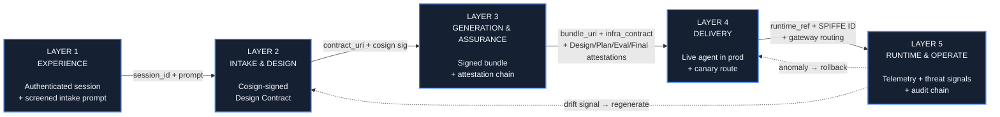
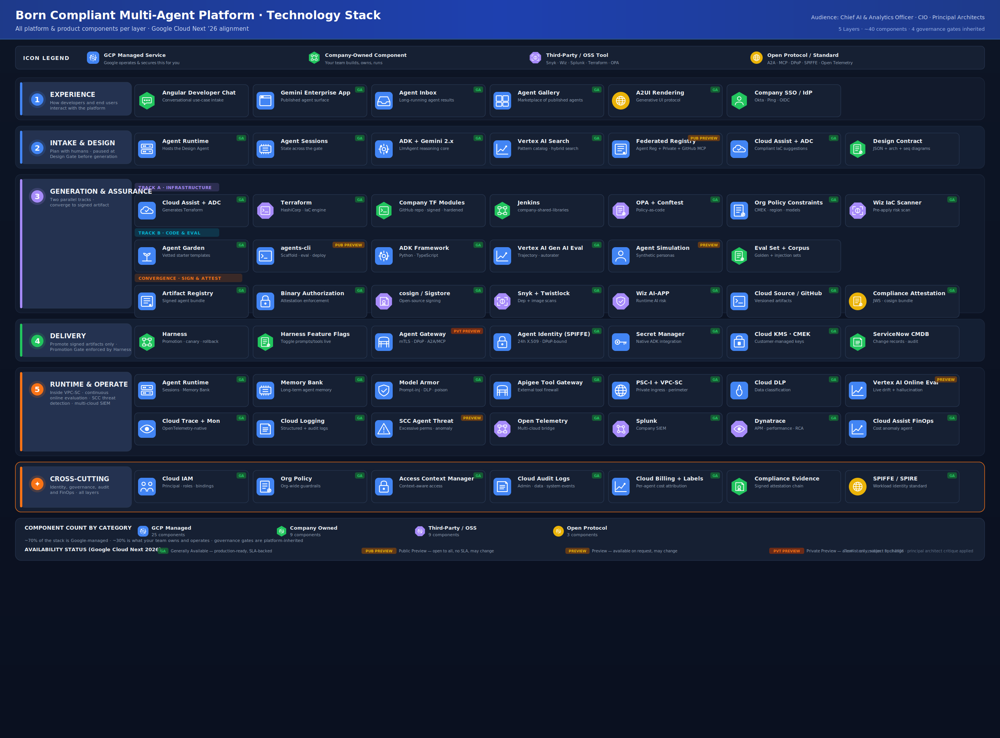
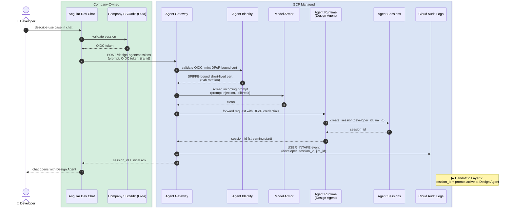
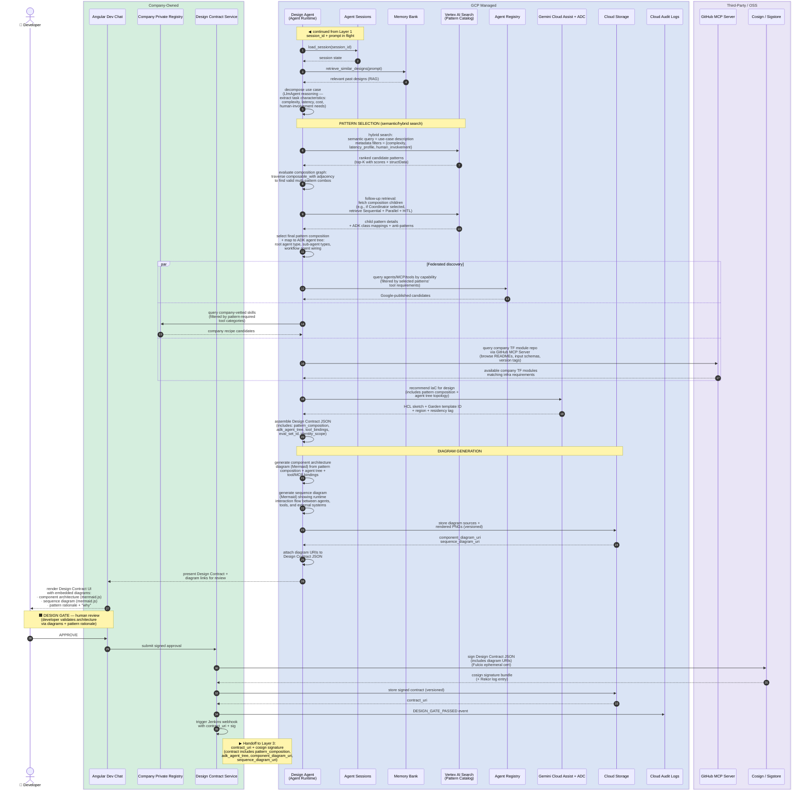
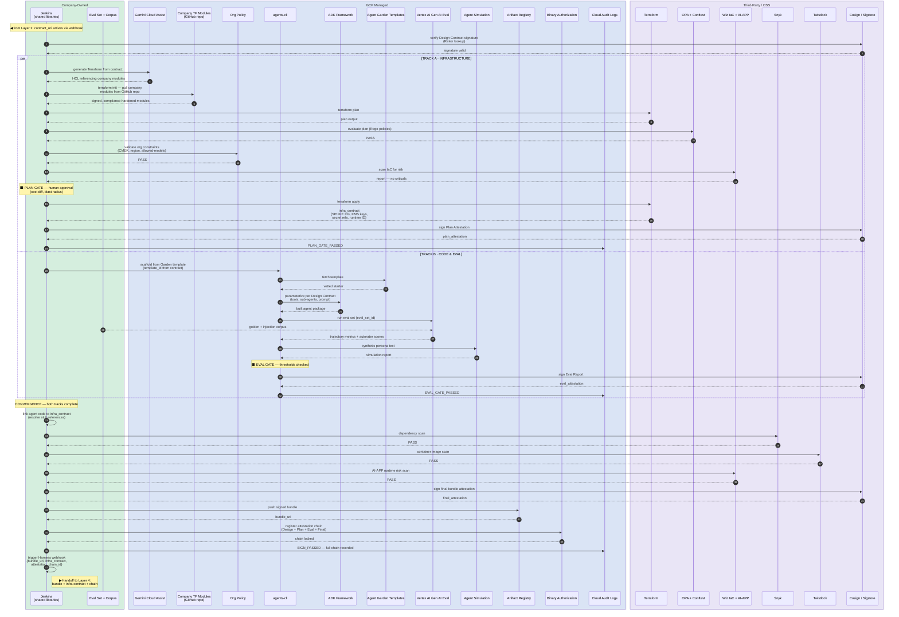
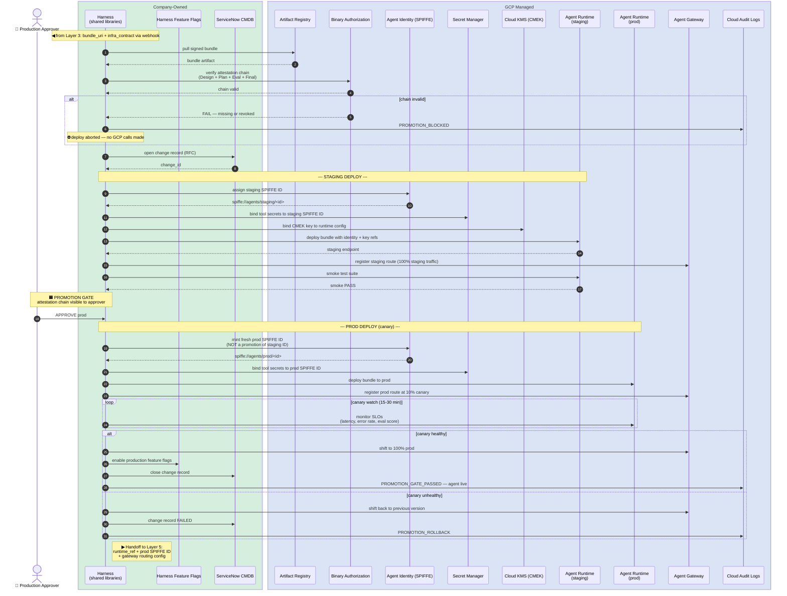
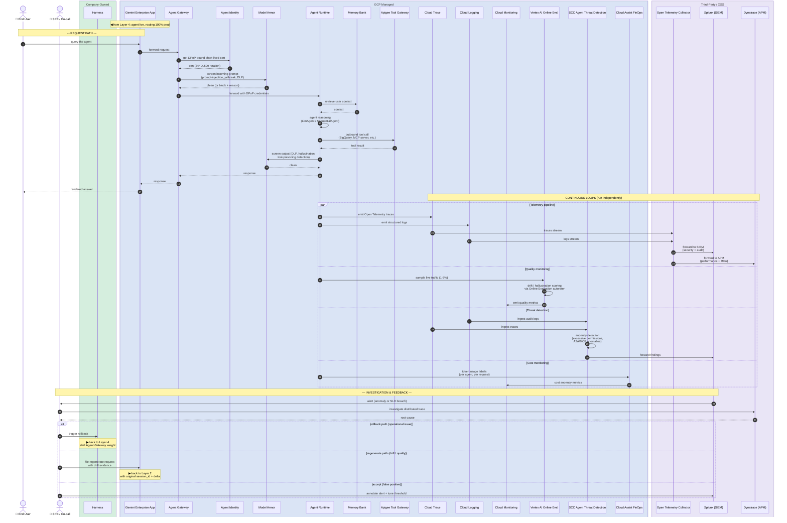

# Born Compliant Multi-Agent Platform — Sequence Diagrams

**Audience:** Engineering community — platform engineers, agent developers, SREs, security engineers

**Scope:** Five sequence diagrams, one per architectural layer. Each diagram details the runtime interactions between Company-owned, Third-party/OSS, and GCP-managed components needed to deliver that layer's outcome. Diagrams are sequenced for end-to-end navigation: every layer declares **what enters** and **what exits**, so reading them in order traces the full lifecycle of a "born compliant" agent from intake to runtime.

**Color legend** (preserved across all diagrams via Mermaid `box` groupings):

| Group color | Meaning |
|---|---|
| 🟦 Blue | GCP managed services |
| 🟩 Green | Company-owned components |
| 🟪 Purple | Third-party / open-source tools |
| 🟨 Yellow | Open protocols / standards |

---

## End-to-end thread (read this first)

The artifact passed between layers is *always* a signed object. Each layer either produces a new attestation, consumes one from upstream, or both.



---

## Technology Stack — Layered Component Reference

The diagram below shows every platform and product component required to enable the five layers. Icon shapes distinguish component ownership at a glance: **■ rounded square = GCP managed**, **⬡ hexagon = Company-owned**, **⯃ octagon = Third-party/OSS**, **● circle = Open protocol**.



### Layer 1 — EXPERIENCE

The user-facing entry points for both developers (build-time) and end users (run-time). This layer authenticates, screens, and routes.

| Component | Category | Description |
|---|---|---|
| Angular Developer Chat | Company | The product's conversational UI where developers describe use cases in natural language to start the build-time workflow. Renders Mermaid diagrams inline via mermaid.js at the Design Gate for architecture review. |
| Gemini Enterprise App *(GA)* | GCP | Google's published agent surface (formerly Agentspace). End users consume agents here via Agent Inbox, Agent Gallery, and A2UI rendering. |
| Agent Inbox *(GA)* | GCP | Surfaces results from long-running agent tasks — the asynchronous counterpart to real-time chat. |
| Agent Gallery *(GA)* | GCP | A marketplace of all published agents in the organization — every agent built by this platform appears here automatically after Layer 4 promotion. |
| A2UI Rendering *(GA)* | Protocol | The generative UI protocol that lets agents render structured, interactive responses rather than plain text. |
| Company SSO / IdP | Company | Okta, Ping, or equivalent OIDC provider. Authenticates the developer; the resulting token is exchanged for a DPoP-bound cert at Agent Identity in the next layer. |

### Layer 2 — INTAKE & DESIGN

The planning layer. A single Design Agent reasons about the use case, discovers reusable components, selects ADK patterns via semantic search, and emits a signed Design Contract.

| Component | Category | Description |
|---|---|---|
| Agent Runtime *(GA)* | GCP | Hosts the Design Agent as an ADK `LlmAgent`. Provides managed compute, auto-scaling, and the session/memory infrastructure. |
| Agent Sessions *(GA)* | GCP | Persists conversational state across the Design Gate — the developer can leave, come back, and resume without losing context. |
| ADK + Gemini 2.x *(GA)* | GCP | The reasoning core. The Design Agent is an `LlmAgent` powered by Gemini 2.x Pro, using ADK's tool-use and sub-agent capabilities. Generates Mermaid component and sequence diagrams as part of its design output. |
| Vertex AI Search *(GA)* (Pattern Catalog) | GCP | An unstructured data store with structured metadata containing all ADK design patterns, composition rules, and Architecture Center reference architectures. The Design Agent queries it with semantic/hybrid search to select applicable patterns. |
| Agent Registry *(Public Preview)* | GCP | Google's managed catalog of agents, MCP servers, and tools. The Design Agent queries it to discover reusable components already published in the organization or by Google. |
| Company Private Registry | Company | The company-internal catalog of vetted skills, connection recipes, A2A peer agents, and signed Agent Cards. Federated with Agent Registry and GitHub MCP Server for a single discovery view. |
| GitHub MCP Server | Third-party | Connects the Design Agent to the company's GitHub Enterprise repos — primarily the Company Terraform Module Library. Enables the LLM to browse module READMEs, input/output schemas, and version tags during design. *(GA)* |
| Cloud Assist + ADC *(GA)* | GCP | Gemini Cloud Assist and Application Design Center. Given the selected pattern composition and tools, it recommends a compliant IaC architecture and maps to an Agent Garden template. |
| Design Contract | Company | The typed JSON output of this layer — specifying the pattern composition, ADK agent tree, Garden template ID, tools/MCP bindings, model selection, identity scope, region, eval set ID, Model Armor template, residency tag, and URIs to the generated component architecture diagram and sequence diagram. Signed by Cosign before handoff to Layer 3. |

### Layer 3 — GENERATION & ASSURANCE

The factory floor. Two parallel tracks — infrastructure and code/eval — run independently and converge at the sign-and-attest step. Each track has its own governance gate.

**Track A — Infrastructure:**

| Component | Category | Description |
|---|---|---|
| Cloud Assist + ADC *(GA)* | GCP | Generates Terraform HCL from the Design Contract, constrained to reference only signed company modules from the GitHub repo. Does not use Agent Garden modules directly. |
| Terraform *(GA)* | Third-party | HashiCorp's IaC engine. Executes `plan` and `apply` against the GCP provider. |
| Company TF Module Library | Company | Company-owned, signed, compliance-hardened Terraform modules stored in a GitHub repo. Wrap Google's upstream Agent Garden patterns with company naming conventions, CMEK defaults, VPC-SC membership, billing labels, PAB bindings, region pinning, and Model Armor floor settings. The *only* module source Cloud Assist is allowed to reference. |
| Jenkins | Company | CI server running company-shared-libraries. Owns the Plan Gate: `terraform plan` → policy evaluation → human approval → `terraform apply`. |
| OPA + Conftest *(GA)* | Third-party | Open Policy Agent with Conftest for Rego-based policy-as-code evaluation of Terraform plan output. |
| Org Policy Constraints *(GA)* | GCP | Google Cloud organization-level guardrails — CMEK enforcement, region pinning, allowed-models lists, machine-type restrictions. Evaluated automatically during `terraform plan`. |
| Wiz IaC Scanner *(GA)* | Third-party | Pre-apply infrastructure risk scan. Checks for misconfigurations, overly permissive IAM, and compliance violations before any resource is created. |

**Track B — Code & Eval:**

| Component | Category | Description |
|---|---|---|
| Agent Garden Templates *(GA)* | GCP | Vetted agent starter templates — the parameterized starting point that replaces free-form code generation. Selected by the Design Contract's `garden_template_id`. |
| agents-cli *(Public Preview)* | GCP | Google's agent lifecycle CLI (Public Preview, launched at Next '26). Scaffolds from a Garden template, runs evals, deploys to Agent Runtime, and publishes to Gemini Enterprise. Invoked directly by Jenkins — not via Gemini CLI — because Layer 3 is deterministic. |
| ADK Framework *(GA)* | GCP | The Agent Development Kit — Python 1.31.x stable, 2.0 Beta (graph workflows), TypeScript 1.0 GA, Java and Go 1.0. The framework the generated agent code runs on. |
| Vertex AI Gen AI Eval *(GA)* | GCP | Evaluation service providing trajectory metrics (`trajectory_in_order_match`, `trajectory_precision`, `trajectory_recall`), multi-turn autorater scoring, and structured output validation. |
| Agent Simulation *(Preview)* | GCP | Synthetic persona testing — generates realistic user interactions to validate agent behavior before real users are exposed. |
| Eval Set + Corpus | Company | Company-authored golden datasets, prompt-injection test corpora, and domain-specific eval assertions. Stored alongside agent code in the versioned repository. |

**Convergence — Sign & Attest:**

| Component | Category | Description |
|---|---|---|
| Artifact Registry *(GA)* | GCP | Stores the signed agent bundle (container image + config). The bundle_uri from here is what Layer 4 pulls. |
| Binary Authorization *(GA)* | GCP | Registers the attestation chain (Design + Plan + Eval + Final). Layer 4 verifies this chain before any deploy is attempted. |
| cosign / Sigstore *(GA)* | Third-party | Open-source artifact signing using Fulcio ephemeral certificates and Rekor transparency log. No long-lived signing keys. |
| Snyk + Twistlock *(GA)* | Third-party | Dependency vulnerability scan (Snyk) and container image scan (Twistlock). Both must pass before the bundle is signed. |
| Wiz AI-APP *(GA)* | Third-party | AI-application-specific runtime risk scan — checks for prompt injection surfaces, data leakage paths, and model access control gaps. |
| Cloud Source / GitHub *(GA)* | GCP/Company | Versioned source control for agent code, Terraform modules, eval sets, and pipeline definitions. |
| Compliance Attestation | Protocol | The JWS/cosign attestation bundle that travels with the artifact. Contains the Design doc hash, Plan attestation, Eval report, and final scan results. |

### Layer 4 — DELIVERY

Harness owns environment promotion. Nothing reaches production unless the full attestation chain from Layer 3 is intact.

| Component | Category | Description |
|---|---|---|
| Harness | Company | Continuous delivery platform using company-shared-libraries. Owns the Promotion Gate: staging deploy → smoke test → human approval → canary → full prod. |
| Harness Feature Flags | Company | Toggle prompt packs, tool allowlists, and Model Armor templates in production without redeploying the agent. |
| Agent Gateway *(Private Preview)* | GCP | Google-managed ingress gateway (Private Preview). Terminates mTLS, enforces DPoP re-authentication, applies inline Model Armor, and supports A2A/MCP-aware routing with weighted canary splits. |
| Agent Identity (SPIFFE) *(GA)* | GCP | Issues SPIFFE-based X.509 certificates with 24-hour rotation and DPoP-bound tokens. Each environment (staging, prod) gets a separate identity — no identity promotion. |
| Secret Manager *(GA)* | GCP | Native ADK integration for tool credentials. Secrets are bound to the agent's SPIFFE identity — no long-lived service account keys anywhere. |
| Cloud KMS · CMEK *(GA)* | GCP | Customer-managed encryption keys for Sessions, Memory Bank, and any Discovery Engine data stores. Provisioned by Terraform in Layer 3 Track A. |
| ServiceNow CMDB | Company | Change record management. Every promotion creates an RFC linked to the original JIRA ticket from Layer 1, closed on successful canary or marked FAILED on rollback. |

### Layer 5 — RUNTIME & OPERATE

The agent runs inside a VPC-SC perimeter with continuous evaluation, threat detection, and cost monitoring. All telemetry exits through a single Open Telemetry Collector.

**Runtime & Security:**

| Component | Category | Description |
|---|---|---|
| Agent Runtime *(GA)* | GCP | Production hosting for the deployed agent. Provides managed Sessions (conversational state), Memory Bank (long-term personalization), auto-scaling, and multi-region support. |
| Memory Bank *(GA)* | GCP | Persistent agent memory for user context and personalization. Not Terraform-managed as of April 2026 — schema migrations are imperative scripts. |
| Model Armor *(GA)* | GCP | Inline AI firewall. Screens every inbound prompt and outbound response for prompt injection, jailbreak attempts, DLP-sensitive content, malicious URLs, and tool poisoning. 2M-token free tier. |
| Apigee Tool Gateway *(GA)* | GCP | Outbound tool-call firewall. The "Tool Gateway" in Google's three-gateways pattern (Agent Gateway → Model Gateway → Tool Gateway). Controls which external APIs and MCP servers the agent can reach. |
| PSC-I + VPC-SC *(GA)* | GCP | Private Service Connect Interface for private ingress from the company VPC. VPC Service Controls perimeter wraps Agent Runtime, BigQuery, Cloud Storage, Secret Manager, Discovery Engine, and KMS. |
| Cloud DLP *(GA)* | GCP | Data classification and de-identification. Integrated with Model Armor for content-level inspection beyond prompt screening. |
| Vertex AI Online Eval *(Preview)* | GCP | Samples 1–5% of live traffic and runs autorater scoring for drift, hallucination, and quality regression. Sampling rate is declared in the Design Contract per agent class. |

**Observability & Threat Detection:**

| Component | Category | Description |
|---|---|---|
| Cloud Trace + Monitoring *(GA)* | GCP | Open Telemetry-native distributed tracing and metrics. Enabled automatically via `GOOGLE_CLOUD_AGENT_ENGINE_ENABLE_TELEMETRY=true` at the Terraform layer. |
| Cloud Logging *(GA)* | GCP | Structured and audit log collection. Feeds both SCC Agent Threat Detection and the Open Telemetry Collector for SIEM export. |
| SCC Agent Threat Detection *(Preview)* | GCP | Security Command Center feature that ingests audit logs and traces to detect excessive-permission patterns, A2A/MCP anomalies, and suspicious tool-call sequences. Integrates with Wiz AI-APP findings. |
| Open Telemetry Collector *(GA)* | Third-party | The single egress point for all agent telemetry. Fans out to Splunk (SIEM) and Dynatrace (APM). Adding another destination means adding an OTel exporter — agent code is untouched. |
| Splunk *(GA)* | Third-party | Company SIEM. Receives traces, logs, and SCC findings via the Open Telemetry Collector. Security and audit teams use this as their primary investigation surface. |
| Dynatrace *(GA)* | Third-party | APM platform. Receives distributed traces for performance monitoring, root-cause analysis, and SLO tracking. SREs pivot here from Splunk alerts. |
| Cloud Assist FinOps *(GA)* | GCP | Gemini Cloud Assist's cost anomaly agent. Tracks per-agent token usage via billing labels and flags unexpected spend spikes. |

### Cross-cutting — applies to all layers

| Component | Category | Description |
|---|---|---|
| Cloud IAM *(GA)* | GCP | Identity and Access Management. Principals, roles, and policy bindings for every GCP resource across all layers. |
| Org Policy *(GA)* | GCP | Organization-wide guardrails enforced at the resource-manager level — CMEK requirements, region restrictions, allowed-models lists, service-account key creation blocks. |
| Access Context Manager *(GA)* | GCP | Context-aware access policies. Defines the VPC-SC perimeter rules and the conditions under which agents can access sensitive resources. |
| Cloud Audit Logs *(GA)* | GCP | Admin activity, data access, and system event logs. The only component that appears in every layer — it is the audit backbone. |
| Cloud Billing + Labels *(GA)* | GCP | Per-agent cost attribution via billing labels. Each agent deployed by the platform inherits labels from its Design Contract (agent class, team, cost center). |
| Compliance Evidence | Company | The signed attestation chain — Design Doc → Plan Attestation → Eval Report → Promotion Attestation → Signed Agent Card → Live SLO + Audit Log. This chain is what "born compliant" means to an auditor. |
| SPIFFE / SPIRE *(GA)* | Protocol | The workload identity standard underpinning Agent Identity. SPIFFE IDs are the only principal type for agent IAM grants — no service account keys. |

---

## Layer-by-layer sequence diagrams

The sections below show the detailed interaction sequences within each layer. Each diagram picks up where the previous one left off.

---

## Layer 1 — EXPERIENCE

**Outcome:** A developer's natural-language use-case description is authenticated, screened by Model Armor for prompt-injection, and lands on the Design Agent inside Agent Runtime as a fresh session.

**Enters:** Developer's intent (chat message).
**Exits to Layer 2:** `session_id` (bound to developer identity + JIRA/change-request ID) + the original prompt.



**Engineering notes:**

- The `session_id` is the auditable thread; it carries the developer identity and the JIRA/change-request linkage all the way to runtime.
- Model Armor runs the *user-prompt screen* here (cheap, fast). The full DLP/output screen happens at runtime in Layer 5 inside Agent Runtime.
- DPoP-bound certs make the session credential non-replayable: a leaked token cannot be reused from a different host.
- **This sequence is the build-time flow** — a developer using this platform to *create a new agent*. There is a separate run-time flow (an end user *consuming an agent the platform previously built*) that originates at the Gemini Enterprise App; that flow is covered in the Layer 5 request path. The two flows are not variants of each other — they have different originators, different targets, and different downstream layers:
  - **Build-time:** Angular Dev Chat → Design Agent (this platform's planner) → Layers 2 → 3 → 4 → produces a new published agent.
  - **Run-time:** Gemini Enterprise App → the published agent that was built earlier → Layer 5 only.
  - They share **Agent Gateway, Agent Identity, and Model Armor** as inbound infrastructure (which is why those primitives appear in both Layer 1 and Layer 5 of the stack diagram), but everything downstream of those primitives is different.

---

## Layer 2 — INTAKE & DESIGN

**Outcome:** A signed Design Contract — a typed JSON document specifying the **ADK pattern composition** (which patterns, how they compose), agent class, Garden template ID, tools/MCP servers, sub-agent topology, region, identity scope, eval set ID, model selection, Model Armor template, and residency tag — accompanied by a **generated component architecture diagram** and **sequence diagram** that visualize the designed workflow for developer review.

**Enters from Layer 1:** `session_id` + prompt + developer identity.
**Exits to Layer 3:** `contract_uri` (in Cloud Storage) + cosign signature + `component_diagram_uri` + `sequence_diagram_uri` + Jenkins webhook trigger.

### ADK Pattern Catalog (what the Design Agent searches)

Google's Cloud Architecture Center and ADK documentation define a two-tier pattern taxonomy that the Design Agent must understand and compose:

**Tier 1 — Foundational ADK execution patterns** (the building blocks):

| Pattern | ADK class | When to use |
|---|---|---|
| Sequential pipeline | `SequentialAgent` | Deterministic multi-step workflows — output of agent A feeds agent B. Linear, auditable, easy to debug. |
| Parallel fan-out/gather | `ParallelAgent` | Independent sub-tasks that can run simultaneously, then a synthesizer agent aggregates results. |
| Loop (iterative) | `LoopAgent` | Repeated execution of a sub-agent sequence until a termination condition is met — e.g., refinement cycles. |

**Tier 2 — Compositional design patterns** (built from Tier 1 primitives):

| Pattern | Composed from | Use case signal |
|---|---|---|
| Coordinator / Dispatcher | `LlmAgent` routing to specialist `LlmAgent` sub-agents | Open-ended request that requires classification before execution — e.g., customer service routing. |
| Hierarchical decomposition | Nested `SequentialAgent` + `ParallelAgent` trees | Complex goal that decomposes into independent sub-goals with their own sub-task sequences. |
| Generator and Critic | `LoopAgent` wrapping generator + critic `LlmAgent` pair | Output quality is critical — generator produces, critic validates, loop refines until threshold. |
| Iterative Refinement | `LoopAgent` wrapping generator + critique + refiner agents | Multi-pass quality improvement — extends Generator/Critic with a dedicated refiner agent. |
| Human-in-the-Loop | Any pattern + `LongRunningFunctionTool` or ADK resume capability | High-stakes decisions requiring human judgment — financial transactions, production deploys, compliance approvals. |
| Custom orchestration | `LlmAgent` with imperative routing logic across sub-agents | Logic-level orchestration that doesn't fit structured patterns — e.g., conditional branching across parallel and sequential sub-flows. |

**Tier 3 — Reference architectures** (full use-case blueprints from the Architecture Center):

| Reference architecture | Underlying patterns | Source |
|---|---|---|
| Classify multimodal data | Parallel fan-out/gather | Architecture Center |
| Orchestrate security operations | Hierarchical decomposition + RAG | Architecture Center |
| Multimodal GraphRAG resource orchestration | Sequential pipeline + graph-backed RAG | Architecture Center |
| Administer interactive learning | Single-agent tool use | Architecture Center |
| Automate data science workflows | Multi-agent sequential + parallel | Architecture Center |
| Bidirectional multimodal streaming | Real-time single-agent with Live API | Architecture Center |
| Orchestrate access to disparate systems | Coordinator/Dispatcher + MCP | Architecture Center |
| Single-agent AI system (ADK + Cloud Run) | Single-agent tool use | Architecture Center |

Patterns are **compositional** — a real use case almost always requires combining multiple patterns. For example, a procurement agent might use a *Coordinator/Dispatcher* at the top level, routing to a *Sequential pipeline* for order processing, a *Parallel fan-out/gather* for multi-vendor price comparison, and a *Human-in-the-Loop* gate before final purchase approval. The Design Agent's job is to identify which patterns compose to solve the developer's use case and to validate that the composition is sound.

### Ingesting the pattern catalog into Vertex AI Search

The patterns, their metadata, and their composition rules must be ingested into a **Vertex AI Search data store** so the Design Agent can perform semantic/hybrid retrieval at intake time. The ingestion design:

**Data store type:** Vertex AI Search **unstructured data store with metadata** — supports both semantic (embedding-based) vector search and keyword-based search in a single hybrid query.

**Document schema per pattern:**

```json
{
  "id": "pattern-coordinator-dispatcher",
  "structData": {
    "pattern_name": "Coordinator / Dispatcher",
    "tier": "compositional",
    "adk_classes": ["LlmAgent"],
    "foundation_primitives": ["routing", "delegation"],
    "composable_with": [
      "pattern-sequential-pipeline",
      "pattern-parallel-fan-out-gather",
      "pattern-human-in-the-loop"
    ],
    "use_case_signals": [
      "open-ended request",
      "classification before execution",
      "multiple specialist domains",
      "customer service",
      "routing"
    ],
    "complexity": "medium",
    "latency_profile": "interactive",
    "cost_profile": "medium",
    "human_involvement": "optional",
    "reference_architectures": [
      "orchestrate-access-disparate-systems"
    ],
    "adk_sample_url": "https://github.com/google/adk-samples/...",
    "arch_center_url": "https://docs.google.com/architecture/..."
  },
  "content": {
    "mimeType": "text/html",
    "uri": "gs://pattern-catalog/coordinator-dispatcher.html"
  }
}
```

**Content documents** (stored in Cloud Storage, referenced by URI):
Each pattern gets a rich-text document containing: the pattern description, when to use / when not to use, ADK pseudocode showing the agent tree, composition rules (which patterns it nests with), anti-patterns and pitfalls, and links to the Architecture Center reference architecture and Agent Garden template (if one exists).

**Chunking strategy:** Each pattern document is chunked at the section level (description, use-case signals, composition rules, ADK code, anti-patterns) so that semantic search can match on specific sections rather than entire documents. Vertex AI Search's **layout-aware chunking** handles this natively for HTML/PDF.

**Metadata filtering:** The `structData` fields enable **hybrid search**: the Design Agent's query combines a natural-language semantic embedding match (against `content`) with metadata filters (against `structData`). For example: *"semantic: 'multi-vendor price comparison with human approval' AND complexity IN (medium, high) AND human_involvement = required"*.

**Ingestion pipeline:** A Cloud Function triggered on Cloud Storage upload parses each pattern document, extracts/validates the `structData` schema, and calls the Vertex AI Search `ImportDocuments` API. The pipeline runs on initial load and on every Architecture Center or ADK docs update (monitored via a Cloud Scheduler job that checks the Architecture Center release notes RSS feed).

**Composition graph:** In addition to the flat document store, a small **composition adjacency list** is maintained in the `composable_with` metadata field. This lets the Design Agent, after retrieving candidate patterns, traverse the composition graph to find valid multi-pattern compositions — e.g., if the top result is *Coordinator/Dispatcher*, the adjacency list tells it that *Sequential Pipeline*, *Parallel Fan-out*, and *Human-in-the-Loop* are valid children.

### Updated sequence diagram



**Engineering notes:**

- The Design Contract schema is versioned in the Company Private Registry. Treat schema changes like API changes — backwards compatibility matters.
- **Diagram generation is an LLM capability, not a separate service.** The Design Agent's Gemini 2.x model produces Mermaid source code for both diagrams as part of its reasoning chain. The component diagram is derived from the `pattern_composition` and `adk_agent_tree` fields — agent nodes, sub-agent relationships, tool bindings, and MCP wiring. The sequence diagram is derived from the runtime interaction flow implied by the selected patterns — e.g., a Coordinator/Dispatcher pattern produces a sequence showing the root agent routing to specialists, while a Parallel Fan-out produces a `par` block with a gather step.
- **Diagram rendering is client-side.** The Angular Dev Chat embeds `mermaid.js` to render the Mermaid source stored in Cloud Storage. The developer sees fully rendered, interactive diagrams — not raw code. Rendered PNGs are also stored alongside the source for use in Confluence, JIRA tickets, and the Compliance Evidence Chain.
- **Diagrams are part of the signed Design Contract.** The `component_diagram_uri` and `sequence_diagram_uri` are fields in the Design Contract JSON. When the contract is cosign-signed, the diagram URIs are included in the signed payload — meaning any post-approval tampering with the diagrams would invalidate the signature. The diagrams travel with the bundle through Layers 3 and 4 as design evidence.
- **At the Design Gate, the developer reviews architecture — not JSON.** The Angular UI presents three views: (1) the component architecture diagram showing the agent topology and tool bindings, (2) the sequence diagram showing the runtime interaction flow, and (3) the pattern rationale showing which use-case signals triggered each pattern selection. This lets the developer validate that the *designed workflow* matches their intent, not just that the *parameters* are correct.
- **Vertex AI Search performs hybrid search** — combining a semantic embedding match on the developer's use-case description with structured metadata filters (complexity, latency profile, human involvement). This is not a keyword-only lookup; it uses the embeddings from Vertex AI's foundation models to find patterns that *semantically match* even when the developer's language doesn't use Google's exact pattern names.
- **Two-pass retrieval:** The first query finds candidate root patterns (e.g., Coordinator/Dispatcher). The second query traverses the `composable_with` adjacency to retrieve the child patterns that compose with the root. This two-pass approach prevents the Design Agent from proposing pattern combinations that are structurally invalid (e.g., nesting a LoopAgent inside a ParallelAgent where ordering matters).
- The Design Gate is **not** an LLM judgment — it is a human approval. The agent presents; the human decides. Pattern selection and diagram generation are LLM outputs backed by search evidence; the developer validates them.
- Three registry queries (Agent Registry + Company Private Registry + GitHub MCP Server) run in parallel **after** pattern selection, because the selected patterns determine which tool categories and infrastructure modules to search for. The GitHub MCP Server query specifically discovers which company Terraform modules are available for the infrastructure the selected patterns require — browsing module READMEs, input/output schemas, and version tags so the Design Agent can reference exact module paths and versions in the Design Contract.
- Cosign signs with a Fulcio-issued ephemeral cert; the public log entry in Rekor is the auditable trail. There are no long-lived signing keys to rotate.
- **Company Terraform modules are the only module source — Agent Garden is upstream reference only.** The company's platform team reviews Google's Agent Garden Terraform patterns when they ship, wraps them with compliance defaults (company naming, CMEK, VPC-SC membership, billing labels, PAB bindings, region pinning, Model Armor floors), tests them against the OPA policy corpus, signs them, and publishes them to the GitHub repo. Cloud Assist in Layer 3 Track A is constrained to reference only these signed company modules. This is compliance-by-construction, not compliance-by-inspection.
- **The `pattern_composition`, `adk_agent_tree`, `component_diagram_uri`, and `sequence_diagram_uri` fields in the Design Contract** are what Layer 3's `agents-cli` consumes to scaffold the correct ADK agent structure from the matching Agent Garden template. The diagrams also appear in the Compliance Evidence Chain as the "Design Doc" node — the first link in the attestation chain an auditor walks.

---

## Layer 3 — GENERATION & ASSURANCE

This is the longest diagram. Two parallel tracks (A: Infrastructure, B: Code & Eval) run independently and converge at the SIGN step. Each track has its own gate.

**Enters from Layer 2:** `contract_uri` + cosign signature.
**Exits to Layer 4:** Signed agent bundle in Artifact Registry + `infra_contract` (resource IDs, SPIFFE IDs, secret refs) + attestation chain (Design + Plan + Eval + Final).



**Engineering notes:**

- The two tracks share the Design Contract but produce independent artifacts. Convergence requires both to have signed attestations. If one fails, the other is discarded — there is no partial promotion.
- Track B builds the agent code against **stub references** to the infra contract; at convergence, stubs are replaced with the real IDs Track A emitted. The bundle is *re-signed* after substitution.
- The "free-form code generation" antipattern is replaced by `agents-cli` parameterizing a Garden template using only values from the signed Design Contract. **There is no LLM in the bundle-build step.** The LLM did its work in Layer 2; from Layer 3 onward, the pipeline is deterministic.
- Binary Authorization stores the *chain*, not individual attestations. Layer 4 verifies the entire chain in one call.
- Plan Gate human approval is the *same* gate the existing Jenkins pipeline uses — `terraform plan` review by a platform engineer with access to cost diff and blast radius. We did not invent a new approval flow.

---

## Layer 4 — DELIVERY

**Outcome:** A signed bundle becomes a running agent in production with canary routing, bound to a fresh production SPIFFE identity and CMEK-encrypted secrets.

**Enters from Layer 3:** `bundle_uri` + `infra_contract` + attestation chain.
**Exits to Layer 5:** Live agent on Agent Runtime (prod) with routing in Agent Gateway, identity issued by Agent Identity, and secrets bound via Secret Manager.



**Engineering notes:**

- Harness *consumes* the attestation chain via Binary Auth before any GCP API is called. If any link is missing or revoked, the deploy aborts at step 5; nothing is provisioned, nothing is logged as a deploy attempt at Agent Runtime.
- Staging and prod use **separate** SPIFFE IDs. There is no "promote the same identity" — Harness mints a fresh prod identity at promotion time. This is a deliberate isolation property.
- Canary routing is via **Agent Gateway weighted routes**, not a load balancer. Agent Gateway is the only place where A2A-aware and DPoP-aware canary routing exists in the stack.
- Rollback is "shift Agent Gateway weight back to previous version" — not a redeploy. The previous version stays in Artifact Registry until explicitly retired.
- ServiceNow integration is for change-management audit trail — the change record links the JIRA ID (from Layer 1) to the deploy event.

---

## Layer 5 — RUNTIME & OPERATE

**Outcome:** Live request/response handling with inline guardrails, plus four continuous loops (telemetry, quality, security, cost) feeding the company's SIEM (Splunk) and APM (Dynatrace) via the Open Telemetry Collector.

**Enters from Layer 4:** Live agent + identity + routing.
**Exits:** Continuous evidence stream. Drift signals trigger a **regenerate** path (back to Layer 2). Anomaly signals trigger a **rollback** path (back to Layer 4).



**Engineering notes:**

- The Open Telemetry Collector is the **single egress point** for all agent telemetry. Splunk (SIEM) and Dynatrace (APM) both consume from it. Adding another tool means adding another Open Telemetry exporter — agent code is untouched. This is why we standardized on Open Telemetry rather than vendor SDKs.
- SCC Agent Threat Detection ingests *audit logs and traces*, not direct agent telemetry. Because Splunk and Dynatrace consume the same Open Telemetry stream, investigations across the SCC, SIEM, and APM views line up on the same trace IDs.
- Vertex AI Online Eval samples a configurable percentage of live traffic — typically 1-5% for cost reasons. The sampling rate is declared in the Design Contract per agent class and honored automatically by the runtime.
- The "regenerate" path is the most distinctive runtime feedback loop: a drift signal triggers a re-entry to Layer 2 with the original `session_id`, the drift evidence, and a delta prompt. The result is a *new* Design Contract that, on the next pass through Layers 3 and 4, replaces the running agent. This is how the platform stays current without engineers manually rebuilding agents.
- Apigee Tool Gateway is the *outbound* firewall — separate from Agent Gateway (inbound). Together with Model Armor, this implements Google's published "three-gateways" pattern: Agent Gateway → Model Gateway → Tool Gateway.

---

## Reading the diagrams as one story

If you read the five diagrams in order, the artifact passed between them is always a *signed object*:

1. **Layer 1** produces a `session_id` — an authentication artifact bound to the developer and a JIRA ticket.
2. **Layer 2** produces a **cosign-signed Design Contract** — what to build, declared as typed JSON — accompanied by a generated component architecture diagram and sequence diagram that the developer approves at the Design Gate.
3. **Layer 3** produces a **signed bundle plus an attestation chain** — the build evidence, registered in Binary Authorization.
4. **Layer 4** produces a **runtime reference plus a fresh prod SPIFFE identity** — the deploy evidence, recorded in ServiceNow and Cloud Audit Logs.
5. **Layer 5** produces a **continuous evidence stream** — telemetry, eval, threat, and cost — that feeds back into Layer 2 (regenerate) or Layer 4 (rollback).

This is the literal definition of "born compliant": every interaction in every layer either consumes an attestation, produces an attestation, or appends to the audit chain. **There is no path through the system that escapes signing.**

For an engineer onboarding to the platform, the diagrams above are the right starting point — pick the layer your service lives in, follow the message flow, and the integration contract will be evident.

---

## Appendix: Where each component lives

| Component | Category | Layer(s) it appears in |
|---|---|---|
| Angular Dev Chat | Company | 1 |
| Company SSO/IdP | Company | 1 |
| Company Private Registry | Company | 2 |
| Design Contract Service | Company | 2 |
| Eval Set + Corpus | Company | 3 |
| Jenkins | Company | 3 |
| Harness | Company | 4 |
| Harness Feature Flags | Company | 4 |
| ServiceNow CMDB | Company | 4 |
| Gemini Enterprise App *(GA)* | GCP | 1, 5 |
| Agent Gateway *(Private Preview)* | GCP | 1, 4, 5 |
| Agent Identity | GCP | 1, 4, 5 |
| Model Armor *(GA)* | GCP | 1, 5 |
| Agent Runtime *(GA)* | GCP | 1, 2, 4, 5 |
| Agent Sessions *(GA)* | GCP | 1, 2 |
| Memory Bank *(GA)* | GCP | 2, 5 |
| Vertex AI Search *(GA)* (Pattern Catalog) | GCP | 2 |
| Agent Registry *(Public Preview)* | GCP | 2 |
| Gemini Cloud Assist + ADC | GCP | 2, 3 |
| Cloud Storage | GCP | 2 |
| Company TF Module Library | Company | 3 |
| GitHub MCP Server *(GA)* | Third-party | 2 |
| Agent Garden Templates *(GA)* | GCP | 3 |
| ADK Framework *(GA)* | GCP | 3 |
| agents-cli *(Public Preview)* | GCP | 3 |
| Vertex AI Gen AI Eval *(GA)* | GCP | 3 |
| Agent Simulation *(Preview)* | GCP | 3 |
| Org Policy *(GA)* | GCP | 3 |
| Artifact Registry *(GA)* | GCP | 3, 4 |
| Binary Authorization *(GA)* | GCP | 3, 4 |
| Secret Manager *(GA)* | GCP | 4, 5 |
| Cloud KMS | GCP | 4 |
| Apigee Tool Gateway *(GA)* | GCP | 5 |
| Cloud Trace | GCP | 5 |
| Cloud Logging *(GA)* | GCP | 5 |
| Cloud Monitoring | GCP | 5 |
| Vertex AI Online Eval *(Preview)* | GCP | 5 |
| SCC Agent Threat Detection *(Preview)* | GCP | 5 |
| Cloud Assist FinOps *(GA)* | GCP | 5 |
| Cloud Audit Logs *(GA)* | GCP | all |
| Terraform *(GA)* | Third-party | 3 |
| OPA + Conftest *(GA)* | Third-party | 3 |
| Wiz IaC + AI-APP | Third-party | 3 |
| Snyk | Third-party | 3 |
| Twistlock | Third-party | 3 |
| Cosign / Sigstore | Third-party | 2, 3 |
| Open Telemetry Collector *(GA)* | Third-party | 5 |
| Splunk *(GA)* | Third-party | 5 |
| Dynatrace *(GA)* | Third-party | 5 |
