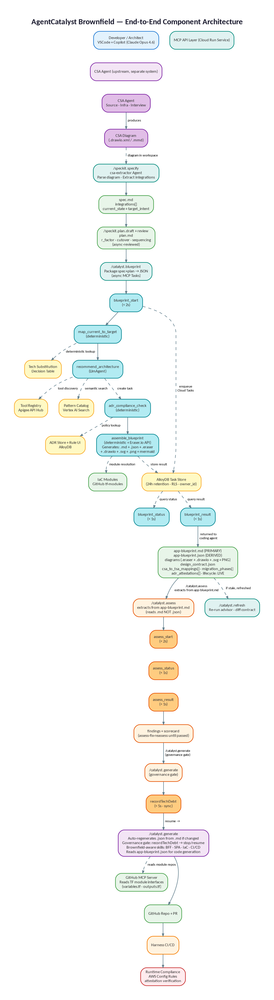
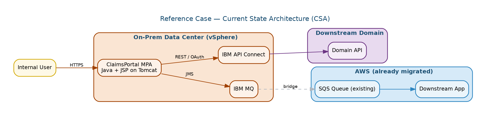
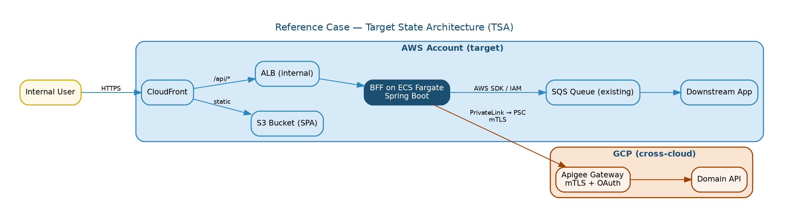
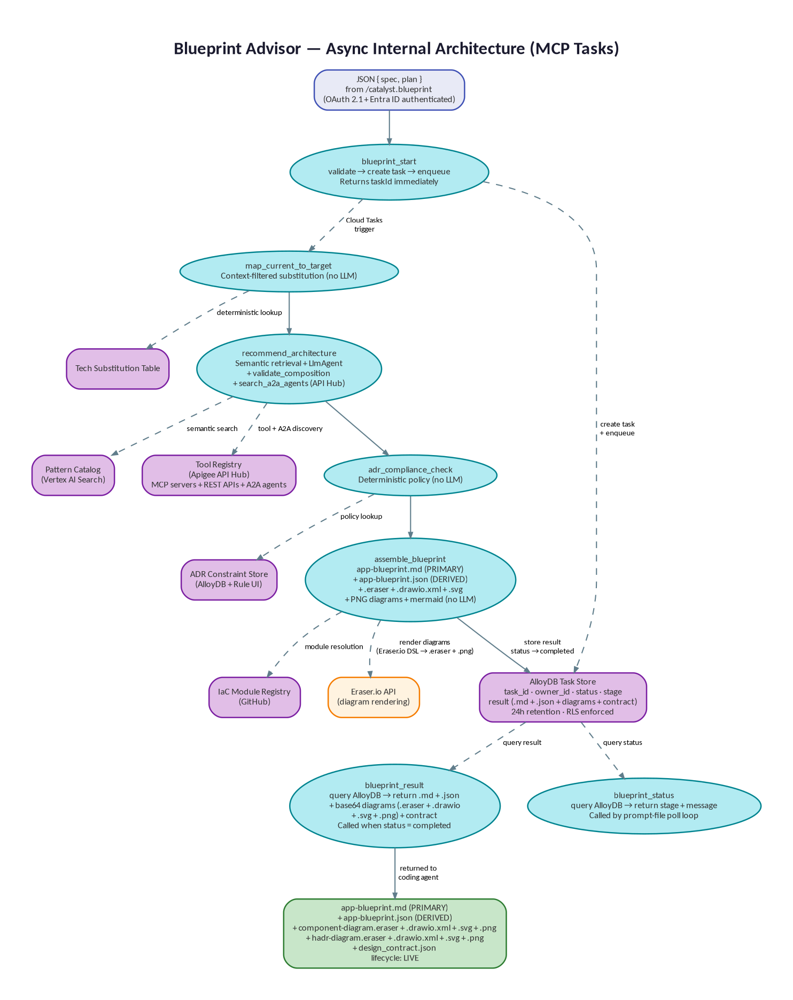
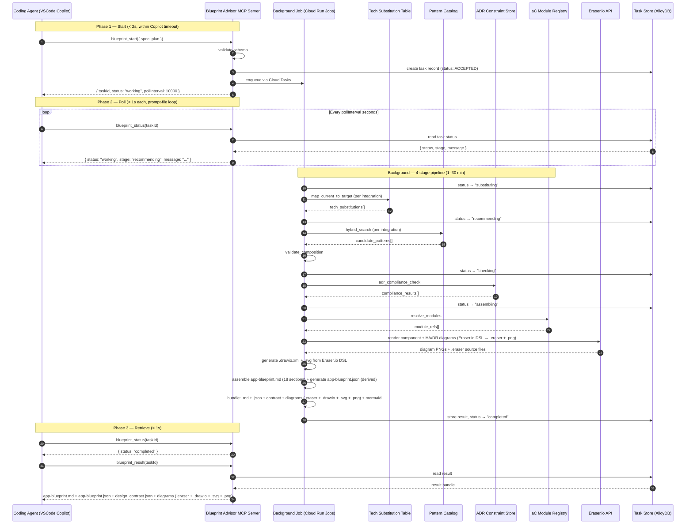
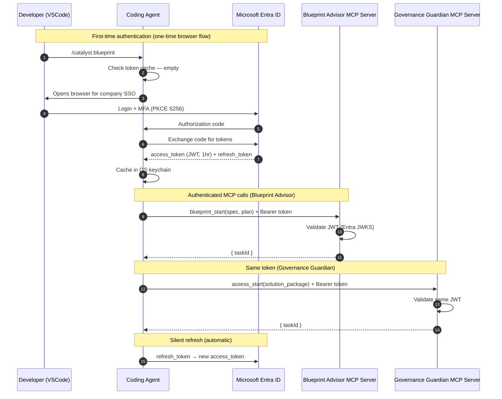

# AgentCatalyst Brownfield — Architecture Document

*Scope: extending AgentCatalyst from greenfield app generation to **brownfield current-state-to-target-state transformation** for AWS modernization, delivered as a Spec Kit preset.*

*Canonical name for all references: **AgentCatalyst Brownfield**. Repository: `agentcatalyst-brownfield-preset`. Spec Kit preset name: `agentcatalyst-brownfield`.*

---

### Document set

| Document | Filename | Audience | Covers |
|---|---|---|---|
| **This document** | `csa-tsa-speckit-architecture.md` | Architects, tech leads | **WHY** — design decisions, internal designs, peripheral systems |
| Developer Guide | `csa-tsa-speckit-developerguide.md` | Developers | **HOW** — step-by-step workflow, templates, worked examples |
| Operating Playbook | `csa-tsa-speckit-operating-playbook.md` | Platform engineering, EA office | **PROCEDURES** — operate, maintain, govern, onboard |
| Governance Guardian | `governance-guardian-architecture.md` | Architects, EA office | **GOVERNANCE** — `/catalyst.assess` design, EA assessment flow, `recordTechDebt` gate, tech debt registry |

### Related core AgentCatalyst documents

The brownfield document set extends (does not replace) the core AgentCatalyst platform documentation:

| Core document | Filename | Consult for |
|---|---|---|
| Core Architecture | `agentcatalyst-architecture-archetype-agnostic.md` | Blueprint Advisor MCP wire format (Layer 2), MCP Tasks async protocol design, base overlay skill architecture (Layer 3), EvalOps three-layer lifecycle (Layer 4) |
| Core Developer Guide | `agentcatalyst-archetype-agnostic-developer-guide.md` | Greenfield agentic/microservice workflows (§2–§3), spec signal words (§4), app-blueprint.md schema (§5), confidence scores (§8) |
| Core Operations Runbook | `agentcatalyst-operations-runbook-both-options.md` | Vertex AI Search wire-level API calls (§1), MCP tool wire format (§1a), search quality regression suite (§2), acceptance telemetry (§3), catalog backup/DR (§4a), shared MCP Server operations (§9) |

---

## Table of Contents

1. [Document Purpose & Audience](#1-document-purpose--audience)
2. [Relationship to the Spec Kit Framework](#2-relationship-to-the-spec-kit-framework)
3. [Problem Statement](#3-problem-statement)
4. [Design Principles](#4-design-principles)
5. [High-Level Component Architecture](#5-high-level-component-architecture)
6. [Flow Walkthrough — The Ten Stages](#6-flow-walkthrough--the-ten-stages)
7. [CSA Agent — Upstream Dependency and Handoff Boundary](#7-csa-agent--upstream-dependency-and-handoff-boundary)
8. [Reference Case Architecture](#8-reference-case-architecture-vsphere-mpa--aws-spa)
9. [Blueprint Advisor — Internal Design](#9-blueprint-advisor--internal-design)
10. [Peripheral Systems](#10-peripheral-systems)
11. [Design Contract Lifecycle](#11-design-contract-lifecycle)
12. [Runtime Compliance Verification](#12-runtime-compliance-verification)
13. [Constitution Versioning Model](#13-constitution-versioning-model)
14. [Brownfield-Specific Changes to Greenfield Assets](#14-brownfield-specific-changes-to-greenfield-assets)
15. [Cross-Cloud Egress Pattern](#15-cross-cloud-egress-pattern-privatelink--psc)
16. [Framework Dependency Risk](#16-framework-dependency-risk)
17. [Cross-Cutting Concerns](#17-cross-cutting-concerns)
18. [Architectural Failure Modes](#18-architectural-failure-modes)

---

## 1. Document Purpose & Audience

This document is the architectural specification for AgentCatalyst Brownfield. Its audience is enterprise architects, platform engineers, and senior developers who need to understand *why* the design is shaped the way it is before they implement, extend, or operate it.

AgentCatalyst Brownfield is an additive extension on top of the existing AgentCatalyst platform. The existing platform (greenfield archetypes, skill mechanism, constitution, EvalOps three-layer architecture, GitHub→Harness CI/CD path) remains in place with specific brownfield adaptations cataloged in §14. The brownfield extension adds: a CSA diagram-based integration extractor, a new spec template oriented around integration inventory, a new plan template with async review, a four-tool Blueprint Advisor, a design-contract lifecycle with refresh, runtime compliance verification, and five peripheral data stores.

---

## 2. Relationship to the Spec Kit Framework

→ *Operating Playbook §2 covers framework dependency management and version-pinning.*

Spec Kit is GitHub's open-source toolkit for Spec-Driven Development. It owns the workflow concept (constitution → spec → plan → tasks → implement), the `/speckit.*` command namespace, the `specify` CLI, the preset mechanism, and helper scripts. Spec Kit adapts the same workflow to 30+ coding agents by rendering commands into each agent's native format.

### Spec Kit version governance

AgentCatalyst Brownfield pins to a specific Spec Kit version. The pinned version is declared in `preset.yml` under `speckit_version`. Upgrades are gated through the preset release pipeline (Operating Playbook §2.2) — a Spec Kit upgrade is treated identically to a major-version preset change, requiring full CI/CD validation and manual platform-engineering approval before rollout.

**Contingency:** If Spec Kit introduces a breaking change that cannot be accommodated, the preset can operate in "pinned-fork" mode, referencing an internal fork of the Spec Kit CLI for up to 6 months while the platform team resolves the incompatibility. This fork is maintained in `github.company.com/platform/speckit-fork` and is a designated technical-debt item reviewed at every quarterly governance cycle (Operating Playbook §14).

→ *§16 details the framework dependency risk assessment and contingency plan.*

### Architecture picture

```
Spec Kit (framework, pinned version)
├── owns: workflow shape (constitution → spec → plan → tasks → implement)
├── owns: /speckit.* command namespace
├── owns: specify CLI, preset mechanism, helper scripts
└── adapts to: 30+ coding agents (Copilot, Claude Code, Gemini, ...)

AgentCatalyst-Greenfield (Spec Kit preset)
├── overrides: /speckit.specify with archetype-specific template
├── overrides: /speckit.plan with archetype-specific template
├── adds: /catalyst.blueprint, /catalyst.generate
├── adds: Blueprint Advisor MCP Server (3-tool, greenfield-focused)
└── adds: domain skills + overlay skills

AgentCatalyst Brownfield (Spec Kit preset — this document)
├── overrides: /speckit.specify with diagram extraction (csa-extractor agent) + CSA-inventory template
├── overrides: /speckit.plan with /speckit.plan.draft + /speckit.plan.review
├── adds: /catalyst.blueprint (4-tool brownfield Blueprint Advisor)
├── adds: /catalyst.assess (Governance Guardian assessment — see Governance Guardian Architecture Extension)
├── adds: /catalyst.generate (brownfield-aware, updated skills + governance gate — see §14)
├── adds: /catalyst.refresh (design-contract lifecycle refresh — see §11)
└── reuses: Spec Kit CLI, helper scripts, constitution mechanism (versioned — see §13)
```

### Command-namespace mapping

| Command | Source | Brownfield behavior |
|---|---|---|
| `/speckit.constitution` | Spec Kit built-in | Preset ships versioned dual constitution (§13) |
| `/speckit.specify` | Spec Kit built-in, preset override | csa-extractor agent parses CSA diagram + CSA-inventory template |
| `/speckit.plan.draft` | AgentCatalyst Brownfield custom | Developer's first-pass r-factor + cutover decisions |
| `/speckit.plan.review` | AgentCatalyst Brownfield custom | Async EA/architect review with structured comments |
| `/catalyst.blueprint` | AgentCatalyst custom | 4-tool brownfield Blueprint Advisor (§9) |
| `/catalyst.assess` | AgentCatalyst custom | Governance Guardian assessment — extracts artifacts from app-blueprint.md, returns scorecard + findings (see Governance Guardian Architecture Extension) |
| `/catalyst.generate` | AgentCatalyst custom, brownfield-updated | Governance gate (recordTechDebt → stop/resume) + skill-guided generation with migration-phase awareness (§14) |
| `/catalyst.refresh` | AgentCatalyst Brownfield custom | Re-runs Blueprint Advisor, diffs design contract (§11) |
| `/speckit.clarify` | Spec Kit built-in | Reused unchanged |
| `/speckit.analyze` | Spec Kit built-in | Reused unchanged |
| `/speckit.checklist` | Spec Kit built-in | Brownfield quality checklist swapped in |

---

## 3. Problem Statement

The transformation problem — moving an existing on-prem application onto AWS — is structurally harder than greenfield generation along six axes.

**CSA discovery is a prerequisite, not an inline step.** Producing an accurate current-state architecture diagram is hard — most brownfield apps lack one. A separate **CSA Agent** handles this upstream: scanning source code, dependency manifests, infrastructure configs, and conducting structured interviews to produce a validated CSA diagram (drawio XML or Mermaid). AgentCatalyst Brownfield begins *after* that diagram exists in the workspace. The coding agent's job is to extract integration points from the diagram and pre-fill the spec template — not to discover them from scratch. → *§7 covers the CSA Agent handoff boundary.*

**Integrations, not applications, are the unit of work.** An application is rarely lifted in one motion. A brownfield MPA on vSphere typically consists of a UI layer, a server-side rendering layer, three or four outbound integrations, and zero-to-many inbound integrations. Each gets a different r-factor verdict, a different target pattern, and potentially a different sequencing window.

**R-factor is a business decision, not a derivation.** The same IBM MQ-fronted integration legitimately maps to Amazon MQ (rehost), SQS (refactor), or EventBridge (event mesh). R-factor decisions are contested between dev, EA, and finance; they require async review, not a 30-minute solo pass. → *Developer Guide §9 covers the two-stage plan process.*

**ADRs are constraints, not retrieval candidates.** ADRs encode what the target state is forbidden to look like. If ADRs sit in the same semantic search index as patterns, compliance is enforced probabilistically. In a regulated enterprise, probabilistic compliance is non-compliance.

**High-stakes tech substitutions belong on deterministic rails, but the real world is multi-dimensional.** Mapping IBM MQ to SQS is not just `(source_tech, r_factor) → target_tech`. It's also conditional on data volume, criticality, compliance, region, partner constraints, and operational capability. The substitution mechanism must be designed for multi-dimensional decision logic from the start.

**Cross-cloud topology is first-class.** An AWS-resident SPA consuming a domain API through Apigee on GCP via PrivateLink+PSC is a recurring enterprise pattern with enough implementation complexity to warrant its own first-class architectural pattern. → *§15 covers this.*

**Design contracts go stale.** A 6-month modernization will see ADRs supersede, IaC modules version up, SLAs renegotiate, and org structures change. The design contract must be a living artifact with explicit lifecycle states and a refresh mechanism. → *§11 covers this.*

---

## 4. Design Principles

**P1 — Integration-level decomposition.** The unit of analysis is the integration, not the application. `spec.md` enumerates each integration point with its current and target state. `plan.md` carries the r-factor and sequencing decision for each one. The Blueprint Advisor returns a `csa_to_tsa_mappings[]` array with one entry per integration. → *Developer Guide §7 (spec template) and §8 (worked example) show the integration-level structure.*

**P2 — Patterns retrieved, constraints enforced.** Patterns live in Vertex AI Search (semantic retrieval). ADRs live in a structured policy store (deterministic enforcement). The two are never co-indexed. → *§10.1 and §10.2 detail the separate stores. Operating Playbook §3 and §4 cover their operations.*

**P3 — Deterministic substitution before probabilistic composition.** Every CSA technology with an enterprise-approved AWS substitute is resolved by context-filtered table lookup before any LLM reasoning. The LlmAgent composes patterns around fixed choices. → *§10.3 details the context-filtered substitution mechanism.*

**P4 — Multi-label functional categorization.** The spec captures `functional_category[]` as a multi-label tag set plus a capability vector.

**P5 — Transition is a first-class artifact.** The Blueprint Advisor emits both an end-state and a transition sequence diagram. Migration phases are explicit in the design contract. → *§9.5 details `assemble_blueprint` diagram generation via Eraser.io API.*

**P6 — Audit attestation is generated, not added later.** Every `csa_to_tsa_mappings[]` entry carries `adr_attestations[]`. Verified at design time (§9.4), at commit time (§11), and at runtime (§12).

**P7 — CSA Agent as upstream dependency.** A validated CSA diagram is a prerequisite. The CSA Agent (a separate system) handles source scanning, infra-config analysis, and human interviews. AgentCatalyst Brownfield starts when the diagram is in the workspace. The coding agent extracts integrations from the diagram and pre-fills the spec. → *§7 details the handoff boundary.*

**P8 — Design contracts are living artifacts.** The design contract has explicit lifecycle states (live/stale/expired) and a refresh mechanism. Long-lived projects must refresh before deploy. → *§11 details the lifecycle.*

---

## 5. High-Level Component Architecture



The diagram above shows the complete flow from CSA Agent through Blueprint Advisor (OAuth 2.1 + Entra ID), Governance Guardian (assess-fix-reassess loop), governance gate (recordTechDebt → stop/resume), to brownfield-aware code generation via GitHub MCP Server, Harness CI/CD, and runtime compliance.

**Read this diagram top-down.** The CSA Agent (⓪, upstream, separate system) produces a validated CSA diagram and places it in the workspace. The coding agent's `csa-extractor` parses the diagram and pre-fills `spec.md` (①). The developer completes a two-stage plan (②), then invokes the Blueprint Advisor (③). Inside the MCP server, four tools run in a fixed order: ④ deterministic context-filtered substitution, ⑤ semantic pattern retrieval and LLM composition (the only LLM stage), ⑥ deterministic ADR compliance enforcement, and ⑦ deterministic blueprint assembly (markdown + `app-blueprint.json` + Eraser.io diagrams: `.eraser` + `.drawio.xml` + `.svg` + PNG + mermaid). The output (⑧) is an `app-blueprint.md` (PRIMARY) plus `app-blueprint.json` (DERIVED, machine-readable) plus a design contract with attestations and inline diagrams. The developer reviews (⑧) using Eraser.io / Draw.io / Canva for diagram editing, runs `/catalyst.assess` for governance assessment (⑧a — reads `.md` NOT `.json`, iterative until no showstoppers), then generates brownfield-aware code with a governance gate (⑨ — recordTechDebt → stop/resume, auto-regenerates `.json` from `.md` if changed, reads `.json` for code generation), and can refresh the contract (🔄) at any time if peripherals have changed. The IaC generation reads company Terraform module repos via the GitHub MCP Server. Runtime compliance closes the loop between deployment and attestation. The peripheral systems band is maintained by Platform Engineering and consumed read-only at runtime.

---

## 6. Flow Walkthrough — The Ten Stages

### ⓪ CSA Agent (upstream) — Produce a validated CSA diagram

→ *§7 covers the handoff boundary. The CSA Agent is a separate system with its own documentation.*

The CSA Agent is an upstream prerequisite, not part of AgentCatalyst Brownfield. It scans source code, dependency manifests, infrastructure configs, and conducts structured interviews to produce a validated CSA diagram (drawio XML or Mermaid). The CSA Agent places the diagram file in the developer's workspace. AgentCatalyst Brownfield begins when that diagram is present.

### ① /speckit.specify — Extract integrations from the diagram and formalize the spec

The developer invokes `/speckit.specify`. The preset's `csa-extractor` agent parses the CSA diagram in the workspace, extracts integration points (nodes as components, edges as integrations, group containers as cloud/on-prem boundaries, edge labels as protocol hints), and pre-fills the integration blocks of `spec-template.md`. Fields the diagram cannot reveal — auth specifics, SLAs, payload schemas, criticality, compliance, target intent, hard rejections — are elicited from the developer. The deliverable is `spec.md`.

### ② /speckit.plan.draft + /speckit.plan.review — Two-stage r-factor decisions

→ *Developer Guide §9 covers the two-stage plan process in detail.*

The developer runs `/speckit.plan.draft` to produce a first-pass `plan.md` with r-factor, cutover, and sequencing decisions per integration. Then `/speckit.plan.review` publishes the draft for async review by an EA architect or LOB lead, who adds structured comments. The developer resolves comments and the plan enters `reviewed` state. Acceptance telemetry tracks solo-drafted vs. reviewed plans and correlates with downstream quality.

### ③ /catalyst.blueprint — Package and invoke (async)

The developer invokes `/catalyst.blueprint`. The command packages `spec.md` and `plan.md` into a single JSON envelope conforming to a versioned schema (`blueprint_request.schema.json`), then invokes the Blueprint Advisor MCP server using the **MCP Tasks** async protocol.

VS Code Copilot enforces a hard 10–15 second timeout on MCP tool calls. A synchronous call that blocks for the full blueprint generation (1–30 minutes depending on integration count) would be killed immediately. The Blueprint Advisor therefore exposes three MCP tools — `blueprint_start`, `blueprint_status`, `blueprint_result` — instead of one blocking call. The prompt file orchestrates the polling loop: start the task, poll for status at the server-recommended interval, report progress to the developer in the Chat pane, and retrieve the result when complete. Each individual MCP call completes in under 2 seconds. The coding agent never touches Vertex AI Search, the ADR store, or the LlmAgent directly. The MCP server remains the single point of governance. → *§9 details the three-tool async interface and the internal 4-stage pipeline.*

### ④ map_current_to_target — Context-filtered technology substitution

The first tool the MCP server runs takes the CSA inventory and r-factor intent per integration and produces a `tech_substitutions[]` list by context-filtered lookup against the Tech Substitution Decision Table. The table is keyed by `(source_tech, r_factor)` plus up to 12 context dimensions (criticality, data_size_class, compliance, etc.) and returns `target_tech`, the ADR reference that authorizes the substitution, and any transition-pattern reference. No LLM runs at this stage. If a substitution is missing from the table, the tool returns a `requires_review: true` flag — never an LLM-invented substitute. → *§9.3 details the context-filtered mechanism.*

### ⑤ recommend_architecture — Semantic pattern retrieval + composition

With substitutions locked in, the LlmAgent inside the Blueprint Advisor uses hybrid semantic and keyword search against the Pattern Catalog in Vertex AI Search. The retrieval is filtered by `functional_category[]`, `r_factor_supports[]`, and the resolved `target_tech` set. For each integration, the LlmAgent picks a target-state pattern and composes them into a coherent multi-integration target architecture. A `validate_composition` sub-step runs before return to catch incompatible compositions (strangler-fig wrapping big-bang, dual-publish without downstream idempotency, etc.). This is the only stage where probabilistic LLM reasoning is permitted. → *§9.3 details the full tool logic.*

### ⑥ adr_compliance_check — Deterministic policy enforcement

The composed pattern tree from ⑤ is checked against the ADR Constraint Store. Each ADR is a structured rule with a machine-readable predicate; the check is a query, not an LLM judgment. Output per integration: `pass` (with attested ADRs), `flag` (requires developer review), or `reject` (violated ADR, blocks pipeline). → *§9.4 details the predicate evaluation.*

### ⑦ assemble_blueprint — Deterministic blueprint and diagram generation

The final tool takes the substitutions, composed patterns, compliance attestations, and matched IaC modules, and assembles two artifacts: **`app-blueprint.md`** (PRIMARY — structured markdown with inline PNG references and mermaid code) and **`app-blueprint.json`** (DERIVED — machine-readable JSON generated from the `.md` sections, consumed by `/catalyst.generate`). It also produces base64-encoded component and HA/DR diagram PNGs, Eraser.io source files (`.eraser`, editable in the Eraser.io VSCode extension), drawio XML files (`.drawio.xml`, editable in the Draw.io VSCode extension), SVG vector exports (`.svg`, importable into Canva), and `design_contract.json` with full provenance. Component and HA/DR diagrams are rendered via **Eraser.io API**. Sequence diagrams (end-state, transition) are inline mermaid. When cross-cloud topology is selected, it injects a Phase-0 entry with an external-team coordination checklist. All assembly is deterministic — no LLM. → *§9.5 details the assembly logic and diagram generation. See `app-blueprint-md-template-and-fnol-example.md` for the complete 18-section template structure and FNOL reference example.*

### ⑧ Developer reviews `app-blueprint.md` + `design_contract.json`

The developer reviews the blueprint and the design contract in VSCode. Mermaid diagrams render inline in VSCode markdown preview. Component diagrams are inline PNGs with editable source files alongside — `.eraser` (Eraser.io VSCode extension), `.drawio.xml` (Draw.io extension), or `.svg` (Canva import). The developer edits whichever format they prefer. Confidence scores, alternatives, and `requires_review` flags are visible per integration. The developer edits the blueprint `.md` if needed (the `.json` is auto-regenerated from `.md` by `assemble_blueprint` — never edit `.json` directly). The developer may re-invoke `/catalyst.blueprint` to regenerate after spec or plan edits. The design contract is emitted with `lifecycle: "LIVE"`. → *Developer Guide §13 covers the review checklist.*

### ⑧a /catalyst.assess — Governance assessment (iterative)

After reviewing the blueprint, the developer runs `/catalyst.assess`. The coding agent reads `app-blueprint.md` (NOT `app-blueprint.json` — the Governance Guardian assesses the human-readable architecture, not the machine-readable JSON) and extracts all 7 artifact types directly from it — the TSA component diagram PNG from §4, HA/DR views from §13, sequence diagrams from §14 (inline mermaid), NFRs from §10, architecture decisions log from §11, tech stack from §12, and patterns from §2 — packages them as an ephemeral **solution_package** (transport JSON sent over MCP — not the same as the persisted `app-blueprint.json` file), and sends to the **Governance Guardian MCP Server** via the same async MCP Tasks pattern as the Blueprint Advisor (`assess_start` → poll `assess_status` → `assess_result`). The `app-blueprint.json` file in the workspace is not read, not sent, and not modified during governance assessment — it exists solely for `/catalyst.generate` to consume later. The EA assessment engine evaluates the solution against enterprise standards (black box to AgentCatalyst). The developer sees progress in the Chat pane and receives a scorecard (7 categories) + findings (showstopper / high / medium / low).

If showstoppers exist, the developer fixes them (e.g., adds cross-region DR for Aurora PostgreSQL per ADR-205) and re-runs `/catalyst.assess`. This assess-fix-reassess loop continues until no showstoppers remain. Non-showstopper findings are acceptable and will be recorded as tech debt at the next step.

→ *Governance Guardian Architecture Extension covers the full assessment flow, solution package schema, scorecard format, and MCP tool definitions.*

### ⑨ /catalyst.generate — Brownfield-aware skill-guided generation (with governance gate)

→ *§14 lists every skill updated and every greenfield asset modified for brownfield.*

**Governance gate (Step 0):** Before the generation pipeline runs, the coding agent calls `recordTechDebt` on the Governance Guardian MCP Server. This tool looks up the latest assessment findings and classifies each as showstopper or tech_debt. If any showstoppers remain → `{ signal: "stop" }` — generation is blocked, the developer must fix and re-assess. If no showstoppers → `{ signal: "resume", tech_debt_id: "TD-2026-0142" }` — remaining findings are recorded as tech debt and generation proceeds. If no assessment exists, the developer is warned but can skip.

**Auto-regeneration (Step 0a):** After the governance gate passes, the coding agent checks whether `app-blueprint.md` was modified since the last `assemble_blueprint` call (by comparing the `.md` file's hash against `blueprint_hash` stored in `app-blueprint.json`). If the hashes differ, the coding agent calls `assemble_blueprint` first to regenerate `app-blueprint.json` from the edited `.md` + re-render diagrams via Eraser.io API. This ensures the JSON always reflects the latest `.md` edits.

**Generation (Steps 1–18):** Skills read `app-blueprint.json` (machine-readable) and consume `migration_phases[]` and `coexistence_constraints[]` from the design contract. Generated code includes feature-flag scaffolding for strangler-fig and dual-publish patterns, Phase-0 cross-cloud plumbing checklists when PrivateLink+PSC is selected, and AWS Config rules derived from ADR attestations for runtime compliance verification. The IaC generation skill reads company Terraform module interfaces from GitHub repos via the **GitHub MCP Server**, maps blueprint fields to module variables deterministically, and generates compliant Terraform that references company modules (never raw `aws_*` resources). → *See greenfield Architecture Document, Layer 3 for the full IaC generation flow via GitHub MCP Server.*

### 🔄 /catalyst.refresh — Keep the contract alive

→ *§11 covers the full lifecycle. Developer Guide §15 covers usage.*

Re-runs the Blueprint Advisor against the existing spec/plan, diffs the design contract, and surfaces changes. Required at every PR if the contract is stale. The pre-commit hook blocks commit on an expired contract.

---

## 7. CSA Agent — Upstream Dependency and Handoff Boundary

→ *Developer Guide §6 covers the developer-facing `/speckit.specify` workflow. The CSA Agent is a separate system with its own architecture documentation.*

### 7.1 Separation of concerns

The CSA Agent and AgentCatalyst Brownfield are separate systems with a clean handoff:

| Responsibility | Owner | Deliverable |
|---|---|---|
| Produce an accurate CSA diagram from source code, infra configs, manifests, and human interviews | **CSA Agent** (separate system) | `.drawio.xml` or `.mmd` file in the workspace |
| Extract integration points from the diagram and pre-fill `spec.md` | **AgentCatalyst Brownfield** (`csa-extractor` agent via `/speckit.specify`) | `spec.md` |

AgentCatalyst Brownfield does NOT perform source-code scanning, infra-config analysis, or structured interviews. Those are CSA Agent responsibilities. If the CSA Agent has not yet run, or has produced a diagram the developer considers incomplete, the developer must return to the CSA Agent workflow before running `/speckit.specify`.

### 7.2 What the diagram must contain

For the `csa-extractor` agent to produce a useful spec, the CSA diagram should contain:

- **Component nodes** — each system or service the application interacts with (including itself)
- **Integration edges** — labeled with protocol/transport hints where known (e.g. `HTTPS`, `JMS`, `SFTP`)
- **Boundary groups** — containers marking cloud or on-prem boundaries (e.g. a subgraph labeled "On-Prem" or "AWS")
- **Vendor stencils** (optional, drawio only) — e.g. `shape=mscae/aws-sqs` enables tech-token inference

### 7.3 What the diagram typically does NOT contain

The following fields are elicited from the developer by `/speckit.specify` because diagrams rarely carry them:

- Auth flow specifics (OAuth grant type, mTLS cert source, SAML configuration)
- SLA / throughput numbers (p95 latency, peak TPS, message volume)
- Payload schemas (path to OpenAPI / JSON schema files)
- Criticality tier, data classification, compliance regimes
- Target intent (preserve invariants, acceptable downtime, hard rejections)
- Cross-cloud latency budgets and transit method (PrivateLink / VPN / Internet)

Real enterprise diagrams also frequently have unlabeled edges — the extractor will leave `TODO:` markers for protocol and transport details it cannot infer. This is by design: leaving a gap is better than guessing wrong.

### 7.4 Diagram format parsing rules

**drawio XML:**
- `<mxCell vertex="1">` with no `edge` attribute → component node
- `<mxCell edge="1" source="X" target="Y">` → integration edge
- `style` attribute containing `shape=mscae/*` → vendor-tech inference
- Parent-child `<mxCell>` with `style="...container"` → boundary group

**Mermaid:**
- `A -->|label| B` — node declarations and edge labels
- `subgraph Name` blocks → boundary groups
- `class X aws` assignments → cloud/region inference

---

## 8. Reference Case Architecture — vSphere MPA → AWS SPA

→ *Developer Guide §8 has the filled `spec.md` and Developer Guide §11 has the filled `plan.md` for this case.*

### 8.1 Scenario

A legacy multi-page application runs on vSphere (Java + JSP on Tomcat), with two outbound integrations: a synchronous domain API via IBM API Connect on-prem, and an asynchronous IBM MQ producer to a queue consumed by a downstream app already in AWS (fronted by SQS). Target: SPA on S3/CloudFront, BFF on ECS Fargate, domain API via Apigee on GCP, direct SQS publish.

### 8.2 Current State Architecture



### 8.3 Target State Architecture



### 8.4 Transformation per integration

| ID | Integration | CSA → TSA | R-Factor | Transition |
|---|---|---|---|---|
| INT-001 | UI rendering | JSP → SPA on CloudFront + S3 | Refactor | Big-bang (paired with INT-002) |
| INT-002 | Server logic | Tomcat → Spring Boot on Fargate | Refactor | Strangler-fig via feature flag |
| INT-003 | Domain API | APIC client → Apigee client | Replatform | Blue-green at gateway, 14-day soak |
| INT-004 | Async messaging | MQ producer → SQS producer | Refactor | 48h dual-publish |

**Coupling constraints:** INT-001 + INT-002 cut over together. INT-003 lags by 14 days (soak). INT-004 has 48h dual-publish driven by downstream idempotency SLA. `migration_phases[]` models this explicitly.

**Cross-cloud:** INT-003 requires a Phase-0 cross-cloud plumbing step (PrivateLink+PSC provisioning) before the BFF can reach Apigee. → *§15 covers this pattern.*

⚠️ **Decisions in this reference case that should NOT be copied without evaluation for your context:** SAML SSO via Ping Federate (may not be your IDP), Oracle 19c retained on-prem (may not be your DB strategy), 48h dual-publish window (depends on your downstream's idempotency contract), Pilot Light DR (Tier 1 apps may need Warm Standby).

---

## 9. Blueprint Advisor — Internal Design

→ *Operating Playbook §8 covers deployment, scaling, and observability. Developer Guide §12 covers the developer-facing invocation.*

### 9.1 Overview

The Blueprint Advisor is an ADK-based agent exposed as an MCP Server, deployed on Cloud Run in the company's GCP project. It is OAuth 2.1 protected and does not persist the inbound spec or plan beyond the task boundary. Audit logs (caller, timestamp, integrations summary, output blueprint hash) are written to Splunk.

The MCP interface exposes **three async tools** using the MCP Tasks primitive (spec revision 2025-11-25). This is necessary because VS Code Copilot enforces a hard 10–15 second timeout on synchronous MCP tool calls, while the internal 4-stage pipeline (map → recommend → check → assemble) can take 1–30 minutes depending on integration count and pattern-catalog query volume.

| MCP tool | What it does | Latency |
|---|---|---|
| `blueprint_start` | Validates input, creates a background task, returns `taskId` | < 2 seconds |
| `blueprint_status` | Returns current pipeline stage and progress message | < 1 second |
| `blueprint_result` | Returns JSON: `markdown` (app-blueprint.md), `blueprint_json` (app-blueprint.json — derived, machine-readable), `diagrams` (base64 PNGs + `.eraser` source + `.drawio.xml` + `.svg`), `design_contract`, hashes | < 1 second |

Internally, the background task runs the 4-stage pipeline described in §9.4–§9.7. The background work executes on **Cloud Run Jobs** (no request-timeout constraint), triggered by `blueprint_start` via Cloud Tasks. Task state (taskId, status, progress, result) is stored in AlloyDB with a 24-hour retention enforced by a scheduled Cloud Scheduler cleanup job (hourly: `DELETE FROM blueprint_tasks WHERE created_at < NOW() - INTERVAL '24 hours'`).

Rate limiting applies to `blueprint_start` (10 starts/hour per user, 200/hour per org) but not to `blueprint_status` or `blueprint_result` (polling is lightweight).

### 9.2 Component view



### 9.3 Call sequence (async MCP Tasks)

→ *Standalone Mermaid file: [`blueprint-advisor-sequence.mmd`](blueprint-advisor-sequence.mmd)*



### 9.3.1 Prompt-file orchestration

The `/catalyst.blueprint` prompt file drives the three-phase loop:

```markdown
---
model: ['Claude Opus 4.6', 'Claude Opus 4.7', 'Claude Sonnet 4.6']
tools: ['blueprint_start', 'blueprint_status', 'blueprint_result']
---
Step 1: Package spec.md and plan.md into JSON. Call blueprint_start.
        Capture taskId. Tell user: "Blueprint generation started."

Step 2: Wait pollInterval. Call blueprint_status(taskId).

Step 3: If "working", report stage + message to user. Wait. Repeat Step 2.
        If "failed", report error with reason. Stop.

Step 4: When "completed", call blueprint_result(taskId).
        Write app-blueprint.md + base64-decode diagrams to workspace.
```

Each tool call completes in under 2 seconds. The LLM naturally handles the polling loop. The user sees progress in the Chat pane ("Stage ⑤: pattern retrieval for INT-003...").

### 9.3.2 Task lifecycle

| Status | Meaning | Transitions to |
|---|---|---|
| `accepted` | Queued for execution | → `working` |
| `working` | Pipeline executing (substage: substituting / recommending / checking / assembling) | → `completed` or `failed` |
| `completed` | Result available | Terminal |
| `failed` | Structured error (unresolved substitution, ADR rejection, composition failure) | Terminal |
| `cancelled` | Developer cancelled | Terminal |

Task records are retained in AlloyDB for 24 hours (enforced by scheduled cleanup job), then deleted. This allows retrieval even after closing and reopening VSCode.

### 9.3.3 Task Store tenant isolation

Every task record carries an `owner_id` column set to the authenticated user's identity (from the OAuth token) at `blueprint_start` time. Access control is enforced at two layers:

- **Application layer:** `blueprint_status` and `blueprint_result` verify `owner_id == caller_id` before returning data. A developer cannot read another developer's task — this prevents leakage of CSA-to-TSA mappings, ADR attestations, and migration-phase sequencing.
- **Database layer:** AlloyDB PostgreSQL **Row-Level Security (RLS)** policies enforce the `owner_id` check as defense-in-depth. Even if the application-layer check is bypassed, the database rejects cross-user queries.
- **TaskId unpredictability:** `taskId` is a **cryptographically random UUID** (`uuid4`, 128-bit), not sequential — preventing enumeration attacks.

The `blueprint_tasks` table schema includes:

```sql
CREATE TABLE blueprint_tasks (
  task_id      UUID PRIMARY KEY DEFAULT gen_random_uuid(),
  owner_id     TEXT NOT NULL,
  status       TEXT NOT NULL DEFAULT 'accepted',
  stage        TEXT,
  progress_msg TEXT,
  spec_hash    TEXT,
  plan_hash    TEXT,
  result_yaml  TEXT,
  result_contract JSONB,
  created_at   TIMESTAMPTZ NOT NULL DEFAULT NOW(),
  updated_at   TIMESTAMPTZ NOT NULL DEFAULT NOW()
);

-- Row-Level Security
ALTER TABLE blueprint_tasks ENABLE ROW LEVEL SECURITY;
CREATE POLICY task_owner_policy ON blueprint_tasks
  USING (owner_id = current_setting('app.current_user'));
```

### 9.4 Tool 1 — `map_current_to_target` (context-filtered decision table)

The substitution mechanism is a **context-filtered decision table** that accepts context dimensions beyond `(source_tech, r_factor)`:

```
lookup(source_tech, r_factor, {
  criticality,
  data_size_class,       // small (<1TB) / medium / large (>10TB)
  compliance_regime,
  messaging_pattern,     // point-to-point / pub-sub / stream
  region_constraints,
  partner_constraints
})
```

The decision table is implemented as a rules engine with bounded dimensions (ceiling: 12 context dimensions). Each row has a priority field; the most specific matching row wins. Ties are flagged as `requires_review`. → *Operating Playbook §5 covers table authoring UI and governance. The identifier ceiling of 12 is enforced by CI.*

**Output schema:**
```json
{
  "tech_substitutions": [
    {
      "integration_id": "INT-004",
      "source_tokens": ["ibm-mq-9.1", "spring-jms"],
      "r_factor": "refactor",
      "context_matched": { "messaging_pattern": "point-to-point", "criticality": "tier2" },
      "target_tokens": ["aws-sqs", "aws-sdk-v2"],
      "adr_ref": "ADR-205",
      "transition_pattern_ref": "PAT-T-007-dual-publish-mq-sqs",
      "confidence": 1.0
    }
  ],
  "unresolved": []
}
```

**Failure mode:** If a `(source_token, r_factor, context)` tuple has no matching entry, the integration goes into `unresolved[]` and the MCP server returns an error. No LLM fallback. This forces unknown substitutions through the platform-engineering review queue.

### 9.5 Tool 2 — `recommend_architecture`

**Inputs:** `spec`, `plan`, `tech_substitutions[]` from Tool 1.

**Logic:** The only LLM-driven stage. For each integration:

1. Build a query vector from the integration's intent paragraph + `functional_category[]` tags + `target_tech` tokens.
2. Hybrid-search the Pattern Catalog in Vertex AI Search (semantic + keyword on `signals[]`).
3. Filter candidates by `r_factor_supports[]` and `functional_category[]` overlap.
4. LlmAgent picks a winner from top-K candidates; confidence based on score gap to runner-up.
5. Discover applicable tools from the Tool Registry.

After per-integration selection, run `validate_composition(pattern_tree)` — a deterministic check (not LLM) catching:
- Strangler-fig wrapping big-bang cutover (invalid)
- LoopAgent containing HITL sub-agent (existing rule, preserved)
- Dual-publish without downstream idempotency confirmation (cross-checked against plan)

If confidence < 0.65 on a pattern selection, the integration is marked `requires_review: true`. The coding agent's constitution blocks generation against any blueprint with unresolved review flags.

### 9.6 Tool 3 — `adr_compliance_check` (with authoring-UI-backed rules)

→ *Operating Playbook §4 covers the rule authoring UI, predicate DSL governance, identifier ceiling, and mandatory unit tests.*

For each (integration, target_tech, pattern) triple, query the ADR Constraint Store with the key `(source_tech, target_tech, functional_category, r_factor)`. The store returns all applicable ADRs with structured rule predicates. Each predicate is a small expression in a constrained DSL:

- `target_tech == 'aurora-mysql' AND data_size_gb > 10000 → REJECT (ADR-118)`
- `cross_cloud_egress AND target_gateway != 'apigee' → REJECT (ADR-101)`
- `target_tech == 'ecs-fargate' AND criticality == 'tier1' AND dr_strategy != 'warm-standby' → FLAG (ADR-403)`

Predicates are evaluated deterministically by a small interpreter (~200 lines, parser-combinator, no `eval()`). The DSL is governed by three constraints:
1. **Identifier ceiling:** maximum 25 identifiers. New identifiers require documented justification and platform-engineering review.
2. **Mandatory unit tests:** every rule ships with ≥3 positive and ≥3 negative test cases, run by CI.
3. **Authoring UI:** EA office uses a browser-based editor with autocomplete, test sandbox, and conflict detection.

Output per integration: `pass` (with `attested_adrs[]`), `flag` (with `requires_review`), or `reject` (with violated ADR). The `attested_adrs[]` output becomes part of the design contract — this is the audit trail.

### 9.7 Tool 4 — `assemble_blueprint`

**Inputs:** all prior outputs plus IaC Module Registry query.

**Logic:** Deterministically construct `app-blueprint.md` with one block per integration containing the target pattern, tech substitution, IaC module references, and attested ADRs. Generate four diagrams:

| Diagram | What it shows | Generated from |
|---|---|---|
| **Component (end-state)** | TSA boxes and arrows | `pattern_selections[]` + `tech_substitutions[]` |
| **Sequence (end-state)** | Runtime message flow | Patterns' built-in sequence templates, parameterized |
| **Sequence (transition)** | Dual-write windows, strangler routes, cutover gates | `plan.cutover_strategy` + `migration_phases[]` |
| **Infrastructure** | AWS account, VPC, region, cross-cloud links | IaC modules referenced |

When `recommend_architecture` selects a pattern involving cross-cloud topology (PrivateLink, PSC, Direct Connect), `assemble_blueprint` injects a **Phase-0 entry** in `migration_phases[]` with an external-team coordination checklist. → *§15 details the cross-cloud pattern.*

The design contract is emitted with `lifecycle: "LIVE"` and version stamps for all peripheral stores (ADR store, substitution table, IaC manifest) as `staleness_triggers`. → *§11 covers the lifecycle.*

### 9.8 Design contract schema

```json
{
  "schema_version": "2.0",
  "lifecycle": "LIVE",
  "generated_at": "2026-05-17T19:42:11Z",
  "last_refreshed_at": "2026-05-17T19:42:11Z",
  "staleness_triggers": {
    "adr_store_version": "2026-05-17-001",
    "substitution_table_version": "2026-05-15-003",
    "iac_manifest_version": "2026-05-10-002"
  },
  "spec_hash": "sha256:...",
  "plan_hash": "sha256:...",
  "plan_review_status": "reviewed",
  "advisor_version": "2.0.0",
  "speckit_version": "1.5.2",
  "constitution_enterprise_version": "v2026Q2",
  "diagram_source": "claims-portal-csa.drawio.xml",
  "csa_to_tsa_mappings": [
    {
      "integration_id": "INT-004",
      "current_state_summary": "...",
      "target_state_summary": "...",
      "tech_substitution": {
        "source_tokens": ["ibm-mq-9.1", "spring-jms"],
        "target_tokens": ["aws-sqs", "aws-sdk-v2"],
        "context_matched": { "messaging_pattern": "point-to-point" }
      },
      "pattern_selected": { "id": "PAT-020", "confidence": 0.91 },
      "alternatives": [...],
      "iac_modules": [
        { "path": "tf-modules/sqs-producer", "version": "v3.2.0" },
        { "path": "tf-modules/ecs-fargate-task", "version": "v5.1.0" }
      ],
      "adr_attestations": ["ADR-205", "ADR-501", "ADR-722"],
      "applicable_tools": [...],
      "requires_review": false
    }
  ],
  "migration_phases": [
    {
      "phase": 0,
      "name": "Cross-cloud plumbing (PrivateLink → PSC)",
      "integrations": ["INT-003"],
      "external_teams": ["gcp-networking", "apigee-platform"],
      "checklist_ref": "checklists/privatelink-psc-v2.md",
      "estimated_duration_days": 14,
      "exit_criteria": "mTLS handshake verified in non-prod"
    },
    {
      "phase": 1,
      "name": "BFF parity (pre-cutover)",
      "integrations": ["INT-002"],
      "duration_days": 14,
      "exit_criteria": "API replay parity > 99.9%"
    },
    {
      "phase": 2,
      "name": "UI + BFF cutover (paired)",
      "integrations": ["INT-001", "INT-002"],
      "duration_minutes": 15,
      "rollback_trigger": "p95 > 5s for 5 min OR P1 in 30 min"
    },
    {
      "phase": 3,
      "name": "Apigee cutover (14-day soak)",
      "integrations": ["INT-003"],
      "duration_days": 30,
      "exit_criteria": "30 days at 100% Apigee"
    },
    {
      "phase": 4,
      "name": "SQS dual-publish window",
      "integrations": ["INT-004"],
      "duration_hours": 48,
      "exit_criteria": "Zero downstream duplicate complaints"
    }
  ],
  "coexistence_constraints": [...],
  "global_governance": {
    "dr_strategy": "pilot-light",
    "rto_hours": 4,
    "rpo_hours": 1,
    "compliance_regimes": ["SOX", "internal-data-protection-v3"]
  },
  "diagrams": {
    "component_endstate": "<mermaid>",
    "sequence_endstate": "<mermaid>",
    "sequence_transition": "<mermaid>",
    "infrastructure": "<mermaid>"
  }
}
```

### 9.9 Confidence semantics

`tech_substitution.confidence` is always `1.0` for exact matches and `0.0` for unresolved entries — deterministic lookup is binary. Pattern selection retains the 0–1 fuzzy range from semantic search. ADR compliance is ternary (pass/flag/reject). If the LlmAgent returns < 0.65 confidence on a pattern, the integration is marked `requires_review: true` and generation is blocked downstream.

---

## 10. Peripheral Systems

→ *Operating Playbook §3–§7 covers operational procedures for each.*

### 10.1 Pattern Catalog (Vertex AI Search)

The Pattern Catalog is the semantic retrieval surface for target-state patterns. Each pattern is a structured document with embeddings on `description` and `signals` fields. Hosted in Vertex AI Search datastore `pattern-catalog-brownfield`.

**Pattern schema:**
```yaml
pattern_id: PAT-020
name: AWS Queue Publisher (SQS)
description: >
  Application publishes durable messages to an SQS queue using IAM role-based
  auth and SQS VPC interface endpoint. Includes DLQ wiring, exponential backoff,
  and CloudWatch metric publishing for queue depth.
functional_categories:
  - app_to_app_internal
  - event_driven_async
r_factor_supports: [refactor, rewrite]
signals:
  - "SQS publisher"
  - "queue producer AWS"
  - "async message AWS native"
  - "at-least-once delivery"
standard_refs: [STD-MSG-014, STD-IAM-008]
components:
  - { name: SQS Queue, type: aws-sqs }
  - { name: DLQ, type: aws-sqs }
  - { name: VPC Interface Endpoint, type: aws-vpc-endpoint }
iac_modules:
  - { path: tf-modules/sqs-producer, version: ">=v3.0.0" }
skill_references:
  - sqs-producer-skill
  - ecs-task-iam-role-skill
sequence_template_endstate: |
  sequenceDiagram
    BFF->>SQS: SendMessage(payload)
    SQS-->>BFF: MessageId
    DownstreamApp->>SQS: ReceiveMessage
    SQS-->>DownstreamApp: payload
```

New patterns require ADR-approval before publication. Retrieval API: `hybrid_search(query, filters)` filtered by `functional_categories`, `r_factor_supports`, and `target_tech_compatibility`. → *Operating Playbook §3 covers add/update/retire lifecycle and quality regression suite.*

### 10.2 ADR Constraint Store (AlloyDB + Rule Authoring UI)

→ *Operating Playbook §4 covers full operational procedures including the authoring UI, identifier governance, unit-test requirements, and exception handling.*

A structured policy store, separate from the Pattern Catalog, implementing deterministic constraint enforcement. AlloyDB table `adr_constraints` in the `enterprise-ea-prod` AlloyDB cluster. Schema:

| Column | Type | Purpose |
|---|---|---|
| `adr_id` | `VARCHAR(20)` PRIMARY KEY | e.g. `ADR-205` |
| `title` | `TEXT` | Human-readable title |
| `status` | `VARCHAR(20)` | `active` / `deprecated` / `superseded` |
| `effective_date` | `DATE` | When the rule took effect |
| `supersedes` | `VARCHAR(20)` | FK to replaced ADR, nullable |
| `scope` | `JSONB` | `{ "source_techs": [...], "target_techs": [...], "functional_categories": [...] }` |
| `rules` | `JSONB` | Array of `{ "type": "REQUIRE/FORBID/PREFER", "predicate": "...", "human_readable": "..." }` |
| `created_at` | `TIMESTAMPTZ` | Row creation timestamp |
| `updated_at` | `TIMESTAMPTZ` | Last modification timestamp |

The JSONB columns for `scope` and `rules` preserve the flexible nested structure from the original document model while gaining PostgreSQL query performance, indexing (GIN indexes on JSONB), and Row-Level Security support.

**ADR schema:**
```yaml
adr_id: ADR-205
title: Use SQS or SNS for queue-based messaging in AWS
status: active
effective_date: 2024-09-01
supersedes: ADR-180
scope:
  source_techs: [ibm-mq, activemq, rabbitmq-onprem]
  target_techs: [aws-sqs, aws-sns, aws-eventbridge]
  functional_categories: [event_driven_async, app_to_app_internal]
rules:
  - type: REQUIRE
    predicate: "r_factor IN ['refactor', 'rewrite'] AND target_tech IN ['aws-sqs', 'aws-sns']"
    human_readable: "Refactor/rewrite of MQ producers must target SQS or SNS, not Amazon MQ"
  - type: FORBID
    predicate: "target_tech == 'amazon-mq' AND r_factor != 'rehost'"
    human_readable: "Amazon MQ is only approved for true lift-and-shift; not for refactor"
  - type: PREFER
    predicate: "messaging_pattern == 'point-to-point' → target_tech = 'aws-sqs'"
    human_readable: "Point-to-point messaging prefers SQS over SNS"
```

The EA office authors and maintains rules through a browser-based **Rule Authoring UI** with grammar autocomplete, a "test this rule" sandbox against 50 curated fixtures, conflict detection, and version history with diff view.

### 10.3 Tech Substitution Decision Table

→ *Operating Playbook §5 covers the authoring UI, quarterly review, and dimension-ceiling governance.*

A context-filtered decision table backing `map_current_to_target`. Implemented as a Postgres table in AlloyDB `tech-substitution-prod` with 12 bounded context columns plus a priority field.

**Representative entries:**

| source_tech | r_factor | criticality | messaging | target_tech | adr_ref | transition_ref | priority | notes |
|---|---|---|---|---|---|---|---|---|
| `ibm-mq-9.x` | rehost | * | * | `amazon-mq-rabbitmq` | ADR-205 | PAT-T-001 | 10 | Strict lift only |
| `ibm-mq-9.x` | refactor | * | point-to-point | `aws-sqs` | ADR-205 | PAT-T-007 | 100 | Default |
| `ibm-mq-9.x` | refactor | * | pub-sub | `aws-sns + aws-sqs` | ADR-205 | PAT-T-008 | 100 | Fan-out |
| `ibm-apic` | replatform | * | * | `gcp-apigee` | ADR-101 | PAT-T-012 | 100 | Cross-cloud |
| `tomcat-on-vsphere` | refactor | * | * | `ecs-fargate + spring-boot` | ADR-401 | PAT-T-020 | 100 | Default container |
| `jsp` | refactor | * | * | `spa-on-s3-cloudfront` | ADR-310 | PAT-T-025 | 100 | Static frontend |
| `oracle-19c-onprem` | retain | * | * | `oracle-19c-onprem` | ADR-602 | — | 100 | DB migration separate |
| `oracle-19c-onprem` | replatform | * | * | `aurora-postgres + ora2pg` | ADR-602 | PAT-T-040 | 100 | Heterogeneous |

The table is the enterprise's single source of truth for what-replaces-what. Reviewed quarterly by the EA office. Adding a row requires an ADR. The **Decision Table Authoring UI** provides decision-tree visualization, a "what would this spec match?" simulator, and conflict detection.

### 10.4 Tool Registry (Apigee API Hub)

MCP servers and A2A agents indexed in Apigee API Hub with enrichment metadata. The Blueprint Advisor's `recommend_architecture` queries the registry filtered by `target_tech` to discover tools that match the integration intent and the resolved target-tech set.

Each tool entry carries:
- `name`, `purpose`, `mcp_endpoint`
- `target_tech_compatibility[]` — which target technologies this tool supports
- `r_factor_relevance[]` — which r-factors this tool is relevant for (e.g. `[refactor, rewrite]` for SQS MCP; suppresses noise in rehost-only scenarios)
- `lifecycle_state` — preview / active / deprecated / retired

→ *Operating Playbook §6 covers registration, enrichment, deprecation, and lifecycle.*

### 10.5 IaC Module Registry (GitHub)

A GitHub repository (`github.company.com/platform/tf-modules`) plus a `manifest.yaml` at the repo root indexed by module path and version. The Blueprint Advisor reads the manifest during `assemble_blueprint` to resolve `iac_modules[]` references from patterns into specific module paths and versions.

**Manifest schema:**
```yaml
modules:
  - path: tf-modules/sqs-producer
    versions: [v3.0.0, v3.1.0, v3.2.0]
    current: v3.2.0
    supported_resources: [aws_sqs_queue, aws_sqs_queue_redrive_policy, aws_iam_role_policy_attachment]
    dr_strategies: [backup-restore, pilot-light, warm-standby]
    regions: [us-east-1, us-west-2, eu-west-1]
    tags_required: [cost-center, data-classification, owner]
    standard_refs: [STD-IAC-001]
```

Modules follow semver. The design contract pins module versions at generation time; module updates don't retroactively affect produced blueprints. → *Operating Playbook §7 covers add/update/drift-detection.*

---

## 11. Design Contract Lifecycle

→ *Developer Guide §15 covers the `/catalyst.refresh` command. Operating Playbook §8.7 covers drift-detection operations.*

### 11.1 Lifecycle states

| State | Meaning | Permitted actions |
|---|---|---|
| **LIVE** | Contract matches current peripherals (ADR store, substitution table, IaC manifest) | `/catalyst.generate`, commit, PR, deploy |
| **STALE** | One or more peripheral stores have changed since `last_refreshed_at` | Commit allowed (with warning); deploy blocked; must run `/catalyst.refresh` |
| **EXPIRED** | Stale for >30 days OR spec/plan modified without refresh | All actions blocked until refresh |

### 11.2 Staleness detection

The design contract records `staleness_triggers` — version stamps of the ADR store, substitution table, and IaC manifest at generation time. The pre-commit hook compares these against current versions. If any differ, the contract transitions to `STALE`.

### 11.3 `/catalyst.refresh`

Re-runs the Blueprint Advisor against the existing spec/plan. Produces a diff showing: substitutions changed, patterns re-scored, ADR attestations changed, IaC module versions bumped, new `requires_review` flags. The developer reviews the diff, accepts or rejects changes, and the contract returns to `LIVE`.

### 11.4 Long-lived project handling

Projects that take 6+ months between blueprint and prod:
- `/catalyst.refresh` required before every PR (pre-commit hook enforces)
- `/catalyst.refresh` required before every deploy (Harness pipeline gate enforces)
- Contracts refreshed >3 times are flagged in quarterly governance review for possible re-scoping

---

## 12. Runtime Compliance Verification

→ *Operating Playbook §8.8 covers deployment of AWS Config rules and Custodian policies.*

### 12.1 The gap

Pre-commit hooks verify that the design contract's attestations are consistent with the ADR store. But nothing verifies that the *deployed artifact* matches the attestations. Risk: the attestation says "uses SQS, not Amazon MQ" (ADR-205), but the IAM role is over-permissioned and allows MQ calls.

### 12.2 Design

The deployment pipeline (Harness) deploys an **attestation-derived rule set** alongside the application:

1. At `/catalyst.generate` time, the `company-security` skill translates `adr_attestations[]` into AWS Config rules and Cloud Custodian policies.
2. These rules are generated Terraform resources, versioned alongside the application.
3. Post-deploy, AWS Config evaluates continuously. Non-compliant resources trigger CloudWatch alarm → Splunk → platform-engineering pager.

### 12.3 Example

ADR-205 attestation for INT-004: "target uses SQS, not Amazon MQ."

Generated AWS Config rule:
```json
{
  "ConfigRuleName": "agentcatalyst-INT004-no-amazonmq",
  "Source": { "Owner": "CUSTOM_LAMBDA", "SourceIdentifier": "arn:aws:lambda:...check-no-mq" },
  "Scope": { "ComplianceResourceTypes": ["AWS::IAM::Role"], "TagFilters": [{ "Key": "agentcatalyst:integration", "Value": "INT-004" }] },
  "Description": "Verifies IAM role for INT-004 BFF task does not include AmazonMQ permissions (ADR-205)"
}
```

This closes the loop: design → generation → deployment → runtime-verification → attestation.

---

## 13. Constitution Versioning Model

→ *Developer Guide §5 covers developer-facing usage. Operating Playbook §2.6 covers enterprise constitution governance.*

### 13.1 The problem

A single `constitution.md` file drifts per project and can silently contradict enterprise policy.

### 13.2 Dual-file model

| File | Location | Mutability | Version |
|---|---|---|---|
| `constitution-enterprise.md` | Shipped by preset, read-only in project repos | Updated only via preset upgrade | Semantic version (e.g. `v2026Q2`) |
| `constitution-project.md` | Project repo, editable by developer | Developer-authored additions | Git-versioned |

### 13.3 Consistency enforcement

A pre-commit hook validates that `constitution-project.md` does not contradict `constitution-enterprise.md`. Contradiction detection: each enterprise rule is tagged with an ID; if a project rule references the same ID with a conflicting directive, the commit is blocked.

### 13.4 Audit trail

The design contract records `constitution_enterprise_version` and includes a hash of the project constitution at generation time. PR reviewers can verify which enterprise version the project was built against.

---

## 14. Brownfield-Specific Changes to Greenfield Assets

The following greenfield assets require modification for brownfield. This is an exhaustive list — anything not listed here is genuinely unchanged.

### 14.1 Skills updated

| Skill | Brownfield change |
|---|---|
| `ecs-fargate-task` | Reads `migration_phases[]` to generate feature-flag config for strangler-fig routing |
| `sqs-producer` | Reads `coexistence_constraints[]` to generate dual-publish scaffolding with config-flag toggle |
| `apigee-client` | Reads `migration_phases[phase:0]` to generate PrivateLink+PSC verification tests |
| `company-terraform` | Reads `iac_modules[]` with version pinning from design contract. Accesses company Terraform module repos via **GitHub MCP Server** — reads `variables.tf` and `outputs.tf` to understand module interfaces, maps blueprint fields to variables deterministically, generates compliant Terraform referencing company modules (never raw `aws_*` resources). Pattern repos (e.g., `tf-microservice-pilot-cold`) provide the scaffold; service modules (e.g., `tf-aurora-postgresql`) provide building blocks. See greenfield Architecture Document, Layer 3 for the full 5-step IaC generation flow. |
| `company-cicd` | Harness pipeline template extended with `/catalyst.refresh` gate before deploy |
| `company-observability` | OTel Collector config extended with transition-phase metric labels |
| `company-security` | Generates AWS Config rules from `adr_attestations[]` for runtime compliance (§12) |

### 14.2 Constitution updated

`constitution-enterprise.md` adds five brownfield-specific non-negotiables (listed in Developer Guide §5).

### 14.3 Pre-commit hooks updated

| Hook | Brownfield addition |
|---|---|
| Attestation check | Checks design-contract lifecycle state; blocks on EXPIRED |
| IaC version check | Checks design-contract IaC module versions |
| Feature-flag check | NEW: confirms transition feature flags are present in code for active `migration_phases[]` |
| Constitution consistency | NEW: validates project constitution does not contradict enterprise constitution |

### 14.4 EvalOps

Golden dataset generation is unchanged. Brownfield projects must include parity-test fixtures (API replay harness inputs) as part of the golden dataset. The `company-cicd` skill generates a parity-eval phase in the Harness pipeline.

---

## 15. Cross-Cloud Egress Pattern — PrivateLink + PSC

→ *Developer Guide §18 FM-6 covers developer-facing troubleshooting. Operating Playbook §3.6 covers catalog operations for this pattern.*

### 15.1 Why this is first-class

AWS PrivateLink → GCP Private Service Connect for Apigee is a multi-team, multi-cloud, multi-week coordination exercise. Treating it as a spec line-item leads to last-minute plumbing failures that block the entire modernization.

### 15.2 Pattern Catalog entry

```yaml
pattern_id: PAT-XCLOUD-001
name: Cross-Cloud Egress (AWS PrivateLink → GCP PSC → Apigee)
functional_categories: [app_to_app_cross_cloud, sync_request_response]
r_factor_supports: [replatform, refactor]
components:
  - { name: VPC Interface Endpoint, type: aws-vpce }
  - { name: NLB (endpoint service), type: aws-nlb }
  - { name: PSC Consumer Endpoint, type: gcp-psc }
  - { name: Apigee Instance Attachment, type: gcp-apigee }
iac_modules:
  - { path: tf-modules/aws-privatelink-egress, version: ">=v2.0.0" }
  - { path: tf-modules/gcp-psc-consumer, version: ">=v1.0.0", note: "provisioned by GCP networking team" }
phase_0_checklist:
  - "Request IP range allocation from cloud-networking team"
  - "Provision PSC consumer endpoint on GCP side (GCP networking team)"
  - "Provision PrivateLink endpoint on AWS side (AWS platform team)"
  - "Exchange mTLS certificates (security team)"
  - "Verify DNS resolution across boundary"
  - "Run mTLS handshake test from AWS VPC to Apigee non-prod"
  - "Measure latency baseline (target: <100ms added)"
external_teams_required: [gcp-networking, aws-platform, security-certs, apigee-platform]
estimated_lead_time_days: 14
```

### 15.3 Blueprint Advisor behavior

When `recommend_architecture` selects PAT-XCLOUD-001, `assemble_blueprint` automatically:
1. Injects Phase-0 in `migration_phases[]` with checklist and external-team contacts
2. Sets the dependent integration to `blocked_until: phase_0_complete`
3. Generates infrastructure diagram showing the cross-cloud boundary with PrivateLink/PSC components

---

## 15a. Production Readiness Checklist

| # | Item | Status |
|---|---|---|
| 1 | CSA Agent producing validated diagrams for at least 2 reference cases | ⬜ |
| 2 | Blueprint Advisor MCP Server deployed on Cloud Run with OAuth 2.1 + Entra ID | ⬜ |
| 3 | AlloyDB Task Store provisioned with RLS policies | ⬜ |
| 4 | All 5 peripheral systems connected (ADR Store, Tech Substitution Table, Pattern Catalog, Tool Registry, IaC Module Registry) | ⬜ |
| 5 | Governance Guardian MCP Server deployed with OAuth 2.1 (same Entra ID app registration) | ⬜ |
| 6 | EA assessment engine connected and returning valid findings for reference case | ⬜ |
| 7 | Tech Debt Registry table created in AlloyDB | ⬜ |
| 8 | `/catalyst.assess` → `/catalyst.generate` flow tested end-to-end (showstopper block + tech debt resume) | ⬜ |
| 9 | Reference case (vSphere MPA → AWS SPA) generating compliant IaC via GitHub MCP Server | ⬜ |
| 10 | Cross-cloud egress pattern (PrivateLink + PSC) tested with Phase-0 checklist | ⬜ |
| 11 | Runtime compliance (AWS Config rules from ADR attestations) verified | ⬜ |
| 12 | `/catalyst.refresh` lifecycle tested (LIVE → STALE → refresh → LIVE) | ⬜ |
| 13 | Harness CI/CD pipeline generating and deploying successfully | ⬜ |
| 14 | Developer documentation (dev guide) published | ⬜ |
| 15 | Operations playbook published | ⬜ |

---

## 16. Framework Dependency Risk

→ *Operating Playbook §2.3 covers Spec Kit version pinning and upgrade governance.*

### 16.1 Risk assessment

| Risk | Likelihood | Impact | Mitigation |
|---|---|---|---|
| Spec Kit breaking change | Medium (rapid OSS evolution) | High | Pin version, gate upgrades through full CI, maintain internal fork contingency |
| Spec Kit sunset | Low | Critical | Fork supports 6-month transition; preset files are vanilla Markdown, portable |
| VS Code Copilot drops prompt-file support | Very low | High | `.agent.md` files are the successor format |
| Claude Opus 4.6 removed from Copilot | Medium (observed in 2026) | Low | Model array fallback chain |

### 16.2 Containment strategy

Spec Kit-specific code is isolated to two layers: the `specify` CLI (used only for `preset add` and `init`) and the `.github/prompts/` + `.github/agents/` files (vanilla Markdown with YAML frontmatter). If Spec Kit disappears, the CLI wrapper is replaced in a week; the Markdown files are portable to any agent that reads prompt files.

---

## 17. Cross-Cutting Concerns

### 17.1 Observability

Every MCP call emits structured logs to Splunk with: caller identity, spec hash, plan hash, integration count, per-tool latency, per-integration confidence scores, ADR attestations, and final blueprint hash. Dynatrace APM instruments the Cloud Run service. OpenTelemetry traces are emitted through the OTel Collector. Additional brownfield signals: runtime compliance alerts (§12), contract lifecycle state changes.

**Blueprint Advisor pipeline tracing scope:** The Blueprint Advisor background pipeline (4-stage: map → recommend → check → assemble) is traced via **Cloud Logging** (structured logs per pipeline stage) and **Dynatrace APM** (OTel spans for RAG query latency, LLM reasoning time, and end-to-end pipeline duration). Arize Phoenix tracing is for **generated agents at runtime** only — it does not trace the Blueprint Advisor pipeline. Platform engineers troubleshooting pipeline performance use Dynatrace, not Phoenix.

### 17.2 Security

**Authentication — OAuth 2.1 with Entra ID:**

Both the Blueprint Advisor and Governance Guardian MCP Servers require OAuth 2.1 authentication via Microsoft Entra ID. The coding agent authenticates the developer once (browser-based SSO + MFA), caches tokens in the OS keychain, and attaches the access token to every MCP tool call. Both MCP Servers share the same `agentcatalyst.mcp` audience scope — one authentication for both servers. Tokens last 1 hour with automatic silent refresh.



→ *See greenfield Architecture Document, Layer 2 Security for the full 4-phase sequence diagram with PKCE details and design decision rationale.*

**Transport:** All MCP protocol connections use TLS 1.3 (Cloud Run default). Specs and plans are not persisted past the call. Blueprint task state stored in AlloyDB (encrypted at rest, 24-hour retention). All peripheral stores are read-only from the Blueprint Advisor's perspective. Service-account-to-service-account auth uses Workload Identity Federation. All data stores are inside the GCP VPC-SC perimeter; the only egress is the MCP response.

### 17.3 Governance and feedback loop

The acceptance telemetry pipeline tracks whether developers accept generated blueprints unchanged, modify specific fields, or rewrite substantially. A structured "modification reason" dropdown in the PR template (advisor wrong / new info / scope change / mistake / preference) separates advisor errors from developer-side noise. For brownfield, additional signals: which `adr_attestations[]` were challenged at PR review and overridden, and solo vs. reviewed plan outcome comparison. → *Operating Playbook §11 covers the telemetry pipeline.*

### 17.4 Total Cost of Ownership

The per-call compute cost (~$0.11/blueprint) represents ~2% of total platform TCO. The full annual cost at 210-use-case enterprise scale is ~$669K, including EA office curation time, platform engineering operations, authoring UIs, developer training, and Governance Guardian operations (Cloud Run + AlloyDB tables + Cloud Tasks queue, ~$10–25/month — EA assessment engine operated by EA office, not AgentCatalyst cost). The revised ROI is ~11.2× (vs. 48× based on compute-only cost). → *Operating Playbook §9 provides the full TCO model.*

---

## 18. Architectural Failure Modes

| Failure | Detection | Recovery | Cross-ref |
|---|---|---|---|
| No CSA diagram in workspace | `/speckit.specify` reports no diagram found | Developer returns to CSA Agent workflow upstream | Dev Guide §6 |
| Tech substitution unresolved | Tool ④ `unresolved[]` non-empty | Platform-engineering ticket; no LLM fallback | Dev Guide §18 FM-2 |
| Substitution dimension missing | Tool ④ multiple matches at same priority | `requires_review: true`; EA reviews | Playbook §5 |
| Pattern low confidence | Tool ⑤ confidence < 0.65 | `requires_review: true`; generation blocked | Dev Guide §18 FM-4 |
| ADR rejection | Tool ⑥ returns `reject` | Revise plan or request waiver | Dev Guide §18 FM-3 |
| Composition validation fails | Tool ⑤ sub-step | Re-architect plan | Dev Guide §18 FM-5 |
| Design contract stale | Pre-commit hook detects peripheral version drift | `/catalyst.refresh` | Dev Guide §15 |
| Design contract expired | Pre-commit hook blocks; Harness gate blocks | Mandatory refresh | Dev Guide §15 |
| Runtime compliance violation | AWS Config rule fires | Pager → investigation | Playbook §13 |
| Cross-cloud plumbing incomplete | Phase-0 exit criteria not met | Integration blocked until verified | Dev Guide §18 FM-6 |
| Spec Kit breaking change | Preset CI fails after upgrade | Pin to previous version; activate fork | Playbook §2.3 |
| Blueprint task timeout | `blueprint_status` returns `working` for >30 min | Developer cancels and re-runs with simplified spec; investigate slow pipeline stage | Dev Guide §18 FM-9 |
| Task store unavailable | `blueprint_start` fails with AlloyDB connection error | Failover to DR region; AlloyDB cross-region replica auto-promotes | Playbook §13 |
| Constitution drift | Pre-commit hook detects contradiction | Developer resolves project rule | Dev Guide §5 |

---

*End of architecture document.*

*→ Developer Guide: `csa-tsa-speckit-developerguide.md`*
*→ Operating Playbook: `csa-tsa-speckit-operating-playbook.md`*
