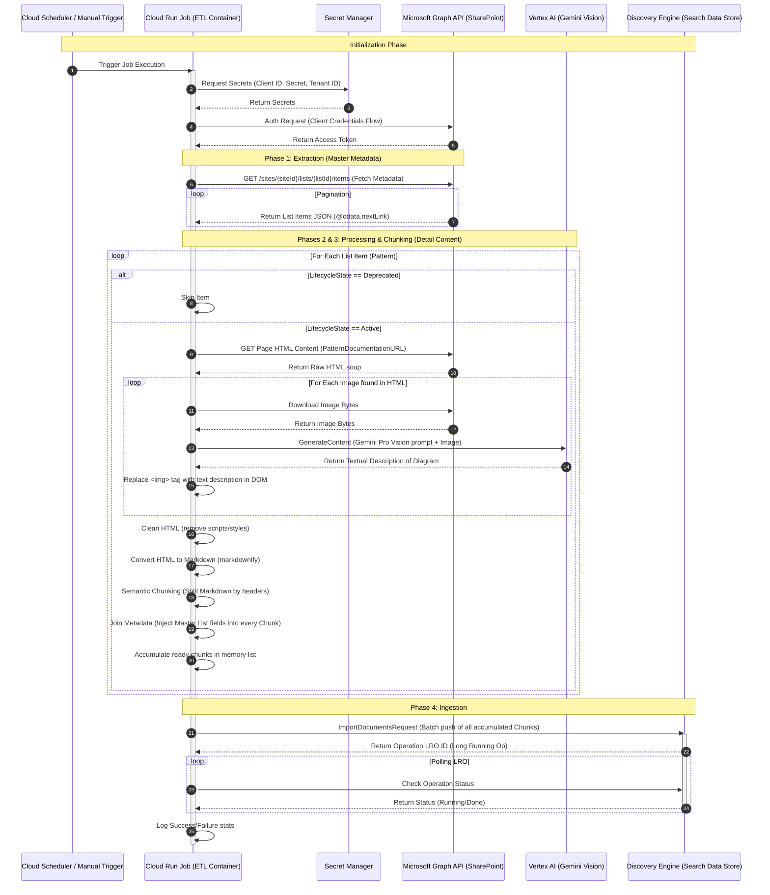

# ETL Ingestion Pipeline from SharePoint Source

This directory contains the ETL pipeline for ingesting architecture patterns from SharePoint into Vertex AI Search.

## Project Structure

```
etl_pipeline/
├── app/
│ ├── __init__.py
│ ├── main.py          # Orchestration logic
│ ├── sp_client.py     # Microsoft Graph interactions
│ ├── processor.py     # HTML cleaning & Gemini Vision
│ ├── chunker.py       # Semantic splitting & metadata join
│ └── ingestor.py      # Vertex AI Search push
├── requirements.txt
└── Dockerfile
```

## End-to-End Pipeline Sequence Diagram

Below is a Mermaid sequence diagram illustrating the flow when the Cloud Run Job executes.



## Detailed Explanation of Sequence Diagram Steps

### Trigger & Initialization (Steps 1-5)
The process begins via a schedule or manual trigger. The Cloud Run Job starts up. Its first action is to securely retrieve the Microsoft Entra ID credentials from GCP Secret Manager. It uses these credentials to authenticate against Microsoft Graph and obtain a temporary bearer Access Token.

### Phase 1: Master Extraction (Steps 6-7)
The job uses the access token to query the SharePoint Graph API for the items in the "Master List" (Artifact #1). It handles pagination loops automatically to ensure it retrieves metadata for all patterns, not just the first page of results.

### Processing Loop (Step 8)
The job enters a main loop, iterating through every item fetched from the Master List.
*   **Triage:** It checks the `LifecycleState` metadata field. If it's "Deprecated," it skips to the next item.

### Detail Content Fetching (Steps 9-10)
If active, it uses the URL found in the master metadata to fetch the full HTML content of the corresponding SharePoint Page (Artifact #2).

### Multimodal Enrichment (Steps 11-16)
The job parses the HTML soup looking for `` tags. For each image:
1.  It downloads the raw image bytes from SharePoint.
2.  It sends these bytes, along with a prompt asking for a technical description, to the Vertex AI Gemini Pro Vision model.
3.  Gemini returns a text description of the diagram.
4.  The job modifies the HTML DOM in memory, replacing the original image tag with the newly generated text description, ensuring the diagram's meaning is now text-searchable.

### Cleaning & Conversion (Steps 17-18)
The remaining HTML is cleaned (removing navigation elements, scripts) and converted into clean Markdown text.

### Phase 3: Chunking & Joining (Steps 19-21)
1.  The Markdown is split semantically based on headers (e.g., H1, H2 sections).
2.  **Crucial Step:** The metadata from the Master List item (Pattern Name, Source/Dest Platform, State) is injected into every single chunk generated from that page. This ensures that even if a chunk just discusses "Security," it carries the context that it belongs to the "AWS to GCP Async Pattern."
3.  These enriched chunks are added to a large list in memory.

### Phase 4: Ingestion (Steps 22-26)
Once all pages are processed, the job takes the complete list of enriched chunks and sends a batch `ImportDocumentsRequest` to the Vertex AI Search Data Store. Because this can take time, it receives an Operation ID and polls the Discovery Engine API until the import completes, finally logging the resulting success or failure counts before shutting down.

## Deployment Steps to Google Cloud Run Jobs

### Step 1: Create Secrets in Secret Manager
Go to Secret Manager in GCP console and create secrets for your sensitive data.
*   `sp-client-id`: Your Azure AD Application Client ID.
*   `sp-client-secret`: Your Azure AD Application Client Secret.
*   `sp-tenant-id`: Your Azure AD Tenant ID.

### Step 2: Build Container Image using Cloud Build
From the root directory containing the Dockerfile:
```bash
# Replace PROJECT_ID with your GCP project ID
gcloud builds submit --tag gcr.io/PROJECT_ID/sharepoint-etl-job:v1 .
```

### Step 3: Create Service Account
Create a dedicated service account for the Cloud Run Job and grant it necessary permissions:
*   Vertex AI User (for Gemini access)
*   Discovery Engine Editor (for ingestion access)
*   Secret Manager Secret Accessor (to read secrets at runtime)
*   Logs Writer

### Step 4: Deploy Cloud Run Job
You will deploy the job, mapping environment variables for configuration and mounting secrets as environment variables.

```bash
gcloud run jobs create sharepoint-etl-job \
  --image gcr.io/PROJECT_ID/sharepoint-etl-job:v1 \
  --region us-central1 \
  --service-account YOUR-SERVICE-ACCOUNT@PROJECT_ID.iam.gserviceaccount.com \
  --set-env-vars=GCP_PROJECT_ID=PROJECT_ID \
  --set-env-vars=GCP_LOCATION=global \
  --set-env-vars=DATA_STORE_ID=YOUR_DATA_STORE_ID \
  --set-env-vars=SP_SITE_ID=YOUR_SITE_ID_FROM_GRAPH \
  --set-env-vars=SP_LIST_ID=YOUR_LIST_ID_FROM_GRAPH \
  --set-secrets=SP_CLIENT_ID=sp-client-id:latest \
  --set-secrets=SP_CLIENT_SECRET=sp-client-secret:latest \
  --set-secrets=SP_TENANT_ID=sp-tenant-id:latest \
  --max-retries 1 \
  --task-timeout 3600s \
  --memory 2Gi \
  --cpu 1
```
*Note: Adjust timeout and memory based on your data volume. Processing images with Gemini takes time.*

### Step 5: Execute
Run the job manually to test:
```bash
gcloud run jobs execute sharepoint-etl-job --region us-central1
```
*(Optional) Set up Cloud Scheduler to trigger this job periodically (e.g., every night).*
