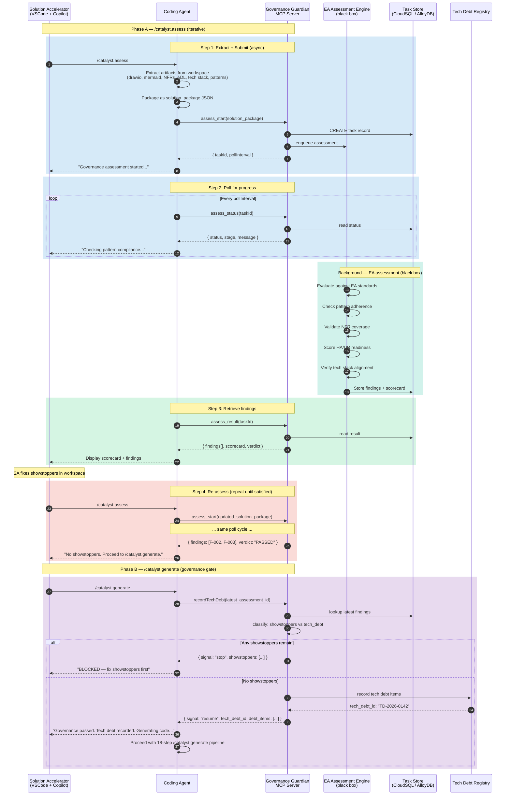

# Governance Guardian MCP Server — Architecture Extension

*Extends: AgentCatalyst Brownfield Architecture Document (csa-tsa-speckit-architecture.md)*
*New commands: `/catalyst.assess` and governance gate in `/catalyst.generate`*

---

## 1. Overview

The Governance Guardian is an EA-operated MCP Server that assesses solutions against enterprise architecture standards, patterns, and ADRs. It introduces a **review-fix-reassess loop** between the Blueprint Advisor's output and code generation, ensuring that every generated codebase has been reviewed against enterprise governance before a single line of code is produced.

The Governance Guardian is a **black box** to the AgentCatalyst platform — the assessment logic (EA standards, scoring rubrics, pattern compliance rules) is owned and maintained by the EA office. AgentCatalyst only knows the input/output contract: it sends a structured JSON document and receives findings + a scorecard.

### Where it fits in the workflow

```
/catalyst.blueprint  →  app-blueprint.yaml (from Blueprint Advisor)
                              ↓
                     SA reviews + edits YAML
                              ↓
/catalyst.assess     →  Extract solution artifacts → reviewSolution (async)
                              ↓
                     Findings + Scorecard returned
                              ↓
                     SA fixes issues → re-runs /catalyst.assess
                              ↓  (loop until resolved or SA decides to proceed)
/catalyst.generate   →  recordTechDebt → resume/stop signal
                              ↓
                     If resume: code generation proceeds
                     If stop: SA must fix showstoppers first
```

### Design principles

- **Same async pattern as Blueprint Advisor.** The Governance Guardian uses MCP Tasks (`assess_start` / `assess_status` / `assess_result`) — identical three-phase invocation. The SA sees progress in the Chat pane. Each MCP call completes in <2 seconds.
- **Black box assessment.** AgentCatalyst does not know the EA standards, scoring rubrics, or compliance rules. The Governance Guardian owns all assessment logic. This separation means the EA office can update standards without touching the AgentCatalyst platform.
- **Tech debt recording, not blocking.** The `recordTechDebt` tool classifies findings as showstoppers or tech debt. Showstoppers block code generation. Non-showstoppers are recorded as tech debt and code generation proceeds — the SA has made an informed decision.
- **Iterative loop.** The SA can run `/catalyst.assess` as many times as needed. Each run produces a fresh assessment against the latest version of the solution artifacts.

---

## 2. MCP Tools

The Governance Guardian MCP Server exposes **five tools** to the coding agent:

| MCP Tool | Type | Latency | Purpose |
|---|---|---|---|
| `assess_start(solution_package)` | **ASYNC START** | < 2 seconds | Validates input, creates a background assessment task in the Task Store, enqueues the assessment pipeline, returns `taskId` + `pollInterval` |
| `assess_status(taskId)` | **POLL** | < 1 second | Returns current assessment stage and progress message |
| `assess_result(taskId)` | **RETRIEVE** | < 1 second | Returns findings JSON + scorecard when status is `completed` |
| `recordTechDebt(latest_assessment_id)` | **SYNCHRONOUS** | < 5 seconds | Looks up the latest assessment findings. If any showstopper: returns `{ signal: "stop", reason: "..." }`. If no showstoppers: records remaining findings as tech debt, returns `{ signal: "resume", tech_debt_id: "...", debt_items: [...] }` |
| `getAssessmentHistory(solution_id)` | **DETERMINISTIC** | < 1 second | Returns the history of all assessments for this solution — useful for the SA to see progress across iterations |

### async assessment tools (assess_start / assess_status / assess_result)

These mirror the Blueprint Advisor's `blueprint_start` / `blueprint_status` / `blueprint_result` pattern exactly. The background pipeline runs the EA's assessment logic (black box to AgentCatalyst) with no timeout constraint.

### recordTechDebt (synchronous)

This is called by `/catalyst.generate` before code generation begins. It's synchronous (<5 seconds) because it's a lightweight lookup + classification + write:

1. Retrieves the latest `assess_result` findings for this solution
2. Classifies each finding as `showstopper` or `tech_debt` (classification rules are owned by the EA office)
3. If any `showstopper` findings exist → returns `{ signal: "stop", showstoppers: [...] }`
4. If no showstoppers → records remaining findings as tech debt in the governance database, returns `{ signal: "resume", tech_debt_id: "TD-2026-0142", debt_items: [...] }`

The coding agent acts on the signal: `stop` → abort code generation, tell the SA what to fix. `resume` → proceed with `/catalyst.generate`, report the tech debt ID.

---

## 3. Solution Package (input to assess_start)

The `/catalyst.assess` command extracts the following artifacts from the workspace and packages them as a JSON document:

```json
{
  "solution_id": "claims-portal-modernization",
  "assessment_version": 3,
  "timestamp": "2026-05-19T14:30:00Z",

  "tsa_component_diagram": {
    "format": "drawio_xml",
    "content": "<extracted from .drawio.xml — TSA component diagram node>"
  },

  "ha_dr_views": {
    "format": "drawio_xml",
    "content": "<extracted from .drawio.xml — HA/DR view nodes>"
  },

  "sequence_diagrams": {
    "format": "mermaid",
    "content": ["<mermaid sequence diagram 1>", "<mermaid sequence diagram 2>"]
  },

  "nfrs": {
    "format": "structured",
    "content": {
      "availability": "99.95%",
      "rto": "4 hours",
      "rpo": "1 hour",
      "peak_tps": 500,
      "p95_latency_ms": 200,
      "data_classification": "Confidential PII",
      "compliance_regimes": ["SOC2", "PCI-DSS"],
      "additional": ["<extracted from NFR node in workspace>"]
    }
  },

  "architecture_decisions_log": {
    "format": "structured",
    "content": [
      {
        "adl_id": "ADL-001",
        "title": "Use ECS Fargate over EKS for BFF",
        "status": "accepted",
        "rationale": "Simpler ops model, no cluster management",
        "consequences": "Limited to 4 vCPU per task"
      }
    ]
  },

  "tech_stack": {
    "format": "structured",
    "content": {
      "frontend": ["Angular 17", "CloudFront", "S3"],
      "backend": ["Spring Boot 3.2", "ECS Fargate", "ALB"],
      "data": ["Aurora PostgreSQL", "ElastiCache Redis"],
      "integration": ["Apigee", "SQS", "EventBridge"],
      "security": ["Cognito", "WAF", "KMS"],
      "observability": ["CloudWatch", "X-Ray", "Splunk"],
      "cicd": ["Jenkins", "Harness", "Terraform"]
    }
  },

  "patterns_used": {
    "format": "structured",
    "content": [
      { "pattern_id": "PAT-042", "name": "BFF-SPA", "source": "pattern_catalog" },
      { "pattern_id": "PAT-018", "name": "Strangler-Fig Migration", "source": "pattern_catalog" },
      { "pattern_id": "PAT-091", "name": "Cross-Cloud API Gateway", "source": "pattern_catalog" }
    ]
  },

  "app_blueprint_yaml_hash": "sha256:abc123...",
  "spec_hash": "sha256:def456...",
  "plan_hash": "sha256:ghi789..."
}
```

### Extraction rules

The `/catalyst.assess` prompt file instructs the coding agent to extract each artifact:

| Artifact | Source in workspace | Extraction method |
|---|---|---|
| TSA component diagram | `*.drawio.xml` or `*.drawio` | Parse XML, find the node/tab labeled "TSA" or "Target State" or "Component" |
| HA/DR views | `*.drawio.xml` or `*.drawio` | Parse XML, find nodes/tabs labeled "HA", "DR", "High Availability", "Disaster Recovery" |
| Sequence diagrams | `*.mmd` files or mermaid blocks in `*.md` | Extract all `sequenceDiagram` blocks |
| NFRs | `nfr.md` or NFR section in `spec.md` or `plan.md` | Parse structured NFR fields |
| Architecture Decisions Log | `adl.md` or `adr/` directory | Parse ADL/ADR entries |
| Tech stack | `app-blueprint.yaml` + `terraform/` | Extract from YAML `tech_stack` section + TF provider/module declarations |
| Patterns used | `app-blueprint.yaml` | Extract from YAML `patterns[]` section |

If an artifact is missing, the coding agent includes `"content": null` with `"missing_reason": "No .drawio.xml found in workspace"` — the Governance Guardian handles missing artifacts in its assessment (likely flagging them as findings).

---

## 4. Assessment Response (output from assess_result)

```json
{
  "assessment_id": "GA-2026-0089",
  "solution_id": "claims-portal-modernization",
  "assessment_version": 3,
  "timestamp": "2026-05-19T14:31:45Z",
  "overall_score": 72,
  "max_score": 100,
  "grade": "C",

  "scorecard": {
    "architecture_compliance": { "score": 85, "max": 100 },
    "pattern_adherence": { "score": 90, "max": 100 },
    "nfr_coverage": { "score": 60, "max": 100 },
    "ha_dr_readiness": { "score": 45, "max": 100 },
    "security_posture": { "score": 80, "max": 100 },
    "tech_stack_alignment": { "score": 75, "max": 100 },
    "decision_documentation": { "score": 70, "max": 100 }
  },

  "findings": [
    {
      "finding_id": "F-001",
      "severity": "showstopper",
      "category": "ha_dr_readiness",
      "title": "No cross-region DR strategy for Aurora PostgreSQL",
      "description": "The solution uses Aurora PostgreSQL in us-east-1 only. Enterprise ADR-205 requires cross-region read replica for Tier-1 applications with RPO < 4 hours.",
      "adr_reference": "ADR-205",
      "remediation": "Add Aurora Global Database with us-west-2 read replica. Update HA/DR view in the drawio diagram.",
      "effort_estimate": "2–4 hours"
    },
    {
      "finding_id": "F-002",
      "severity": "high",
      "category": "security_posture",
      "title": "WAF rules not referencing enterprise managed rule group",
      "description": "Custom WAF rules defined instead of using the enterprise-managed rule group (arn:aws:wafv2:...:managed-rule-group/enterprise-baseline).",
      "adr_reference": "ADR-312",
      "remediation": "Replace custom rules with enterprise managed rule group reference in Terraform.",
      "effort_estimate": "1 hour"
    },
    {
      "finding_id": "F-003",
      "severity": "medium",
      "category": "tech_stack_alignment",
      "title": "Angular 17 not on enterprise approved list (Angular 16 LTS is current standard)",
      "description": "The enterprise tech radar lists Angular 16 LTS as the current standard. Angular 17 is in 'assess' ring.",
      "adr_reference": null,
      "remediation": "Either downgrade to Angular 16 LTS or submit a tech radar exception request.",
      "effort_estimate": "4–8 hours (if downgrade)"
    }
  ],

  "showstopper_count": 1,
  "high_count": 1,
  "medium_count": 1,
  "low_count": 0,

  "verdict": "BLOCKED",
  "verdict_reason": "1 showstopper finding must be resolved before code generation."
}
```

---

## 5. Prompt Files

### `/catalyst.assess` prompt file

```markdown
---
model: ['Claude Opus 4.6', 'Claude Opus 4.7', 'Claude Sonnet 4.6']
tools: ['assess_start', 'assess_status', 'assess_result', 'getAssessmentHistory']
---

You are a governance assessment assistant. When the developer runs /catalyst.assess:

Step 1: Extract solution artifacts from the workspace:
        - TSA component diagram from *.drawio.xml (find the "TSA" or "Target State" node)
        - HA/DR views from *.drawio.xml (find "HA", "DR" nodes)
        - Sequence diagrams from *.mmd files or mermaid blocks in *.md files
        - NFRs from nfr.md or the NFR section in spec.md/plan.md
        - Architecture Decisions Log from adl.md or adr/ directory
        - Tech stack from app-blueprint.yaml tech_stack section + terraform/ declarations
        - Patterns used from app-blueprint.yaml patterns[] section
        
        If any artifact is missing, include it as null with a missing_reason.

Step 2: Package all artifacts as a JSON solution_package.
        Include the app_blueprint_yaml_hash, spec_hash, and plan_hash for traceability.

Step 3: Call assess_start(solution_package).
        Capture the taskId and pollInterval from the response.
        Tell the user: "Governance assessment started (task <taskId>). Checking progress..."

Step 4: Wait pollInterval milliseconds. Call assess_status(taskId).

Step 5: If status is "working", report the stage and message to the user.
        Wait pollInterval. Repeat Step 4.
        
        If status is "failed", report the error. Do NOT proceed.

Step 6: When status is "completed", call assess_result(taskId).
        Display the scorecard and findings to the user in a readable format:
        
        - Overall score and grade
        - Scorecard by category (table format)
        - Findings sorted by severity (showstoppers first, then high, medium, low)
        - For each finding: severity, title, description, ADR reference, remediation, effort
        - Verdict: BLOCKED or PASSED
        
        If BLOCKED: Tell the user which showstoppers must be fixed.
        If PASSED: Tell the user they can proceed to /catalyst.generate.
        
        Either way, suggest: "Fix the findings and run /catalyst.assess again,
        or if no showstoppers, proceed to /catalyst.generate."
```

### `/catalyst.generate` prompt file (updated — governance gate added)

```markdown
---
model: ['Claude Opus 4.6', 'Claude Opus 4.7', 'Claude Sonnet 4.6']
tools: ['recordTechDebt', 'blueprint_result', ...]
---

You are a code generation assistant. When the developer runs /catalyst.generate:

Step 0 (NEW — Governance Gate):
        Call recordTechDebt(latest_assessment_id) on the Governance Guardian MCP Server.
        
        If the response signal is "stop":
          Tell the user: "Code generation blocked. The following showstopper findings
          must be resolved before generating code:"
          List each showstopper with title, description, and remediation.
          Tell the user: "Run /catalyst.assess after fixing these issues."
          DO NOT PROCEED with code generation.
        
        If the response signal is "resume":
          Tell the user: "Governance gate passed. Tech debt recorded (ID: <tech_debt_id>).
          The following non-showstopper findings are recorded as tech debt:"
          List each tech debt item briefly.
          Tell the user: "Proceeding with code generation."
          PROCEED with Steps 1–18 below.

        If no assessment exists (first time, or assess was never run):
          Tell the user: "No governance assessment found. Run /catalyst.assess first
          to validate your solution against EA standards, or type 'skip' to proceed
          without assessment."
          If user types 'skip': proceed with a warning.

Step 1: Verify Design Contract cosign signature...
[... existing 18-step pipeline continues ...]
```

---

## 6. Async Call Sequence



---

## 7. Developer Experience — What the SA Sees

### First assessment (showstopper found)

```
SA: /catalyst.assess

Agent: Extracting solution artifacts from workspace...
       ✓ TSA component diagram (claims-portal-tsa.drawio.xml)
       ✓ HA/DR views (2 views found)
       ✓ Sequence diagrams (3 mermaid files)
       ✓ NFRs (from plan.md)
       ✓ Architecture Decisions Log (4 entries from adl.md)
       ✓ Tech stack (from app-blueprint.yaml)
       ✓ Patterns used (3 patterns)

       Governance assessment started (task gov-456). Checking progress...
       Evaluating architecture compliance...
       Checking pattern adherence...
       Validating NFR coverage...
       Scoring HA/DR readiness...
       Verifying tech stack alignment...
       Assessment complete!

       ┌─────────────────────────────────────────────────┐
       │  GOVERNANCE SCORECARD          Score: 72/100  C │
       ├─────────────────────────────────────────────────┤
       │  Architecture compliance       85/100          │
       │  Pattern adherence             90/100          │
       │  NFR coverage                  60/100          │
       │  HA/DR readiness               45/100  ⚠️      │
       │  Security posture              80/100          │
       │  Tech stack alignment          75/100          │
       │  Decision documentation        70/100          │
       └─────────────────────────────────────────────────┘

       🔴 SHOWSTOPPER (1):
       F-001: No cross-region DR strategy for Aurora PostgreSQL
       ADR-205 requires cross-region read replica for Tier-1 apps with RPO < 4h.
       Fix: Add Aurora Global Database with us-west-2 replica.
       Effort: 2–4 hours

       🟠 HIGH (1):
       F-002: WAF rules not referencing enterprise managed rule group
       Fix: Replace custom rules with enterprise managed rule group in Terraform.
       Effort: 1 hour

       🟡 MEDIUM (1):
       F-003: Angular 17 not on enterprise approved list
       Fix: Downgrade to Angular 16 LTS or submit exception request.

       Verdict: BLOCKED — 1 showstopper must be resolved.
       Fix the showstopper and run /catalyst.assess again.
```

### Second assessment (showstopper fixed)

```
SA: /catalyst.assess

Agent: Extracting solution artifacts from workspace...
       [... extraction ...]
       Governance assessment started (task gov-457). Checking progress...
       [... assessment ...]
       Assessment complete!

       ┌─────────────────────────────────────────────────┐
       │  GOVERNANCE SCORECARD          Score: 88/100  B │
       ├─────────────────────────────────────────────────┤
       │  Architecture compliance       90/100          │
       │  Pattern adherence             90/100          │
       │  NFR coverage                  85/100          │
       │  HA/DR readiness               85/100  ✓       │
       │  Security posture              85/100          │
       │  Tech stack alignment          75/100          │
       │  Decision documentation        90/100          │
       └─────────────────────────────────────────────────┘

       No showstoppers! 🎉

       🟠 HIGH (1):
       F-002: WAF rules not referencing enterprise managed rule group
       (unchanged — will be recorded as tech debt if you proceed)

       🟡 MEDIUM (1):
       F-003: Angular 17 not on enterprise approved list
       (unchanged — will be recorded as tech debt if you proceed)

       Verdict: PASSED — you may proceed to /catalyst.generate.
       Remaining findings will be recorded as tech debt.
```

### Code generation with governance gate

```
SA: /catalyst.generate

Agent: Checking governance gate...
       Governance passed. Tech debt recorded (TD-2026-0142):
       - F-002: WAF managed rule group (HIGH) — recorded as tech debt
       - F-003: Angular 17 tech radar exception (MEDIUM) — recorded as tech debt

       Proceeding with code generation...
       Step 1: Verifying Design Contract cosign signature...
       [... 18-step pipeline continues ...]
```

### Code generation blocked (showstopper still present)

```
SA: /catalyst.generate

Agent: Checking governance gate...
       ❌ Code generation BLOCKED.

       The following showstopper must be resolved:
       F-001: No cross-region DR strategy for Aurora PostgreSQL
       ADR-205 requires cross-region read replica for Tier-1 apps.
       Fix: Add Aurora Global Database with us-west-2 replica.

       Run /catalyst.assess after fixing this issue.
```

---

## 8. Infrastructure

| Component | Technology | Purpose |
|---|---|---|
| Governance Guardian MCP Server (API layer) | Cloud Run Service | Handles assess_start/status/result + recordTechDebt + getAssessmentHistory |
| EA Assessment Engine | Black box (EA-operated) | Assessment logic, standards, scoring — NOT part of AgentCatalyst |
| Task Store | CloudSQL / AlloyDB (shared with Blueprint Advisor, separate table `governance_tasks`) | Async task state for assess_start/status/result |
| Tech Debt Registry | CloudSQL / AlloyDB (table `tech_debt`) | Persistent record of accepted tech debt per solution |
| Cloud Tasks queue | `governance-assess` queue | Enqueues assessment jobs |

### Task Store schema (governance_tasks)

```sql
CREATE TABLE governance_tasks (
  task_id        UUID PRIMARY KEY DEFAULT gen_random_uuid(),
  owner_id       TEXT NOT NULL,
  solution_id    TEXT NOT NULL,
  assessment_version INTEGER NOT NULL DEFAULT 1,
  status         TEXT NOT NULL DEFAULT 'accepted',
  stage          TEXT,
  progress_msg   TEXT,
  solution_package JSONB,
  result_findings JSONB,
  result_scorecard JSONB,
  created_at     TIMESTAMPTZ NOT NULL DEFAULT NOW(),
  updated_at     TIMESTAMPTZ NOT NULL DEFAULT NOW()
);

ALTER TABLE governance_tasks ENABLE ROW LEVEL SECURITY;
CREATE POLICY gov_task_owner ON governance_tasks
  USING (owner_id = current_setting('app.current_user'));
```

### Tech Debt Registry schema

```sql
CREATE TABLE tech_debt (
  tech_debt_id   TEXT PRIMARY KEY,
  solution_id    TEXT NOT NULL,
  assessment_id  TEXT NOT NULL,
  owner_id       TEXT NOT NULL,
  items          JSONB NOT NULL,
  status         TEXT NOT NULL DEFAULT 'open',
  created_at     TIMESTAMPTZ NOT NULL DEFAULT NOW(),
  resolved_at    TIMESTAMPTZ
);
```

---

## 9. Security

| Concern | Control |
|---|---|
| Authentication | OAuth 2.0 via developer SSO (same as Blueprint Advisor) |
| Transport | TLS 1.3 (Cloud Run default) |
| Task Store isolation | `owner_id` + RLS (same pattern as Blueprint Advisor Task Store) |
| Solution package content | Contains architecture diagrams and NFRs — classified as Confidential. Encrypted at rest in CloudSQL. 24-hour retention enforced by cleanup job. |
| Tech Debt Registry | Persistent (not subject to 24h cleanup). Access controlled by solution_id ownership. |
| Assessment engine | Black box — AgentCatalyst transmits the solution_package over TLS to the EA assessment endpoint. No AgentCatalyst code runs inside the assessment engine. |

---

## 10. Updated Workflow (10-Stage)

The addition of the Governance Guardian extends the brownfield workflow from 9 stages to 10:

| Stage | Command | What happens |
|---|---|---|
| ⓪ | (CSA Agent) | Produce validated CSA diagram (upstream) |
| ① | `/speckit.specify` | Extract integrations from diagram → spec.md |
| ② | `/speckit.plan.draft` + `/speckit.plan.review` | Plan with async EA review |
| ③ | `/catalyst.blueprint` | Async Blueprint Advisor → app-blueprint.yaml |
| ④ | (SA review) | SA reviews + edits the YAML |
| ⑤ | **`/catalyst.assess`** | **NEW: Async Governance Guardian → findings + scorecard** |
| ⑤a | (SA fix loop) | **NEW: SA fixes issues → re-runs /catalyst.assess** |
| ⑥ | `/catalyst.generate` | **UPDATED: recordTechDebt gate → resume/stop → 18-step pipeline** |
| ⑦ | (PR + CI/CD) | GitHub PR → Harness/Cloud Build → 3-phase EvalOps |
| ⑧ | (Production) | Binary Authorization verifies Design Gate + Plan Gate |

---

## 11. Cross-References

| This section | References |
|---|---|
| Async MCP Tasks pattern | Architecture §9.3 (Blueprint Advisor async call sequence) — identical pattern |
| Task Store tenant isolation | Architecture §9.3.3 (Task Store tenant isolation) — same RLS approach |
| CloudSQL/AlloyDB choice | Architecture §9 (ADR-AF-001 for AgentForge; brownfield uses AlloyDB) |
| Prompt-file orchestration | Architecture §9.3.1 (how the LLM drives the polling loop) |
| Design Gate attestation | Architecture §11 (Design Contract lifecycle) — Governance Guardian runs AFTER Design Gate, BEFORE Plan Gate |
| `/catalyst.generate` existing steps | Developer Guide §13 (18-step generation pipeline) — Step 0 (governance gate) is prepended |
| Failure modes | Operating Playbook §13 (Incident Response) — add rows for Governance Guardian unreachable, assessment timeout |
| Health checks | Operating Playbook §8.9 — add Governance Guardian health check (3 min synthetic assessment) |
