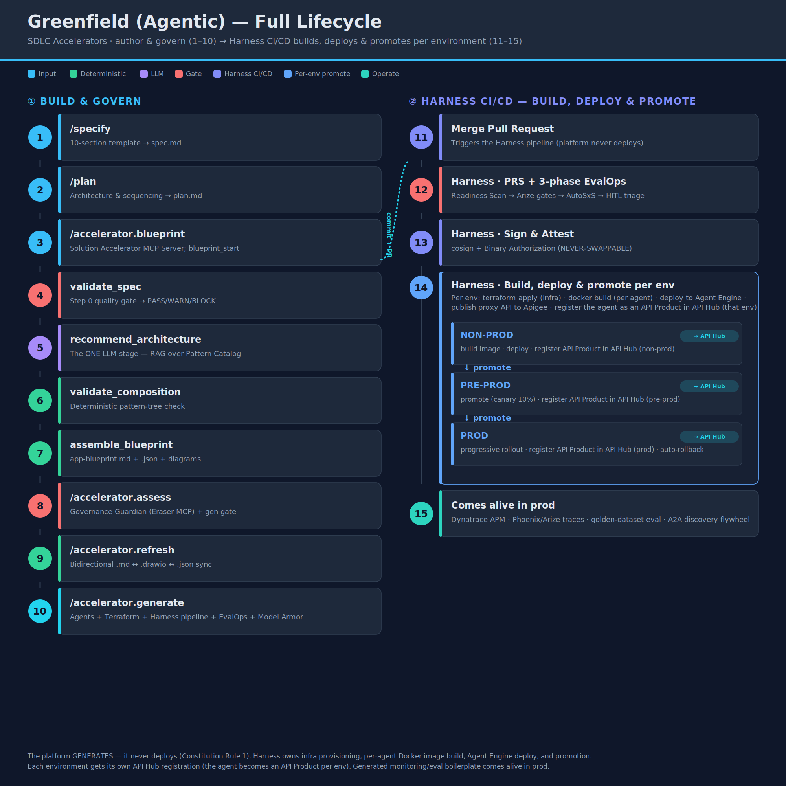

# SDLC Accelerators Platform

Employer-internal, spec-driven multi-agent development platform on GCP.

`spec.md` + `plan.md` → **Solution Accelerator** → `app-blueprint` → **Governance Guardian** → skill-guided code → production.

## Repo map

| Path | Contents |
|---|---|
| `services/solution-accelerator/` | Solution Accelerator MCP Server (the spine) |
| `services/governance-guardian/` | Governance Guardian MCP Server (EA assessment) |
| `services/accelerator-cli/` | Deterministic scaffold + governance gate |
| `skills/` | Domain skills (per-archetype) + overlay skills (NO meta-skills — that's AgentForge IP) |
| `templates/` | Jinja2 templates for spec, plan, blueprint |
| `iac/` | Terraform modules + environments |
| `schemas/` | JSON Schemas — the contract layer (Phase 1) |
| `commands/` | /accelerator.* command definitions |
| `docs/` | Architecture doc, developer guide, operations runbook |

## Getting started

Read `CLAUDE.md` first — it frames every Claude Code session. Then the nearest per-service `CLAUDE.md`.

## Installing spec-kit + the SDLC Accelerators preset in VS Code

The `/specify`, `/plan`, `/tasks`, and `/accelerator.*` commands are delivered by GitHub's
**spec-kit** (`specify` CLI). The platform ships an SDLC Accelerators preset on top of it.
The install differs slightly by coding agent because spec-kit writes the command files into a
**different folder per agent**. Both paths below are supported.

### Common prerequisites (both agents)

```bash
# 1. Authenticate
gcloud auth login && gcloud config set project YOUR_PROJECT_ID
gh auth login

# 2. ADK + spec-kit CLI
pip install google-adk
uv tool install specify-cli --from git+https://github.com/github/spec-kit.git
specify check        # verify

# 3. Install company skills (domain + overlay)
gemini skills install github.com/company/sdlc-accelerators-skills --scope user
# verify in your agent with /skills list (adk-agents, adk-tools, model-armor, company-terraform, ...)

# 4. Register the SDLC Accelerators preset (once)
specify preset add sdlc-accelerators-agentic        # AI agents
# (also available: sdlc-accelerators-microservice, -pipeline, -api)
```

### Path A — VS Code + GitHub Copilot

```bash
mkdir my-app && cd my-app
specify init --preset sdlc-accelerators-agentic --integration copilot
code .
```

- Spec-kit writes command prompt files to **`.github/prompts/`**.
- Open the **Copilot Chat** panel (Ctrl/Cmd+Shift+I).
- The `.specify/` folder (preset.yml, templates, commands, `memory/constitution.md`) is created in the repo.
- Type `/specify` → `/plan` → `/accelerator.blueprint` → `/accelerator.assess` → `/accelerator.generate`.




### Path B — VS Code + Claude Code extension

```bash
mkdir my-app && cd my-app
specify init --preset sdlc-accelerators-agentic --integration claude
code .
```

Differences from the Copilot path:

| | Copilot | Claude Code |
|---|---|---|
| Command files land in | `.github/prompts/` | **`.claude/commands/`** |
| Chat surface | Copilot Chat panel | Claude Code panel / integrated terminal (`claude`) |
| Constitution | `.specify/memory/constitution.md` (read as context) | same file — Claude Code treats `.specify/memory/constitution.md` as the **foundational rules it must adhere to** |
| Model selection | n/a | `claude --model claude-opus-4-8` (or `/model opus`) — recommended for this preset |

After `specify init --integration claude`:
- Confirm the commands installed: `ls -la .claude/commands/` (you should see the `/accelerator.*` files).
- **Fully restart VS Code** (not just reload the window) so Claude Code picks up the new commands.
- In the Claude Code panel, type `/` — `/specify`, `/plan`, `/tasks`, and the `/accelerator.*` commands should appear.
- If they don't: verify you're in the directory where you ran `specify init`, that `.claude/commands/` exists with readable files, and that you restarted the IDE.

> **Note:** spec-kit's default workflow commands are namespaced `/speckit.*` (e.g. `/speckit.specify`).
> The SDLC Accelerators preset adds the `/accelerator.*` commands on top. Use whichever your preset's
> `preset.yml` registers — this preset uses `/accelerator.blueprint|assess|generate|refresh`.

### Cloning the repo — mixed-agent teams (Claude Code + Copilot)

Only the slash-command files differ between agents. Everything that matters is shared:

| Layer | Where | Committed? |
|---|---|---|
| Preset, templates, **constitution.md** | `.specify/` | ✅ yes — shared, agent-agnostic |
| Platform code, schemas, skills, docs | repo root | ✅ yes |
| Generated project files (app/, terraform/, eval/...) | per project | ✅ yes — **identical regardless of agent** (deterministic from the blueprint) |
| Slash-command triggers | `.claude/commands/` or `.github/prompts/` | ❌ no — gitignored, regenerated locally |

The generated application code is the same byte-for-byte whether produced via Claude Code or Copilot —
it comes from `app-blueprint.json` + skills + constitution, not from the chat surface. So a mixed team
stays perfectly consistent.

**After cloning, each developer runs ONE command to regenerate their own agent's command triggers:**

```bash
git clone <repo> && cd <repo>

# Claude Code users:
specify init --here --integration claude     # writes .claude/commands/

# GitHub Copilot users:
specify init --here --integration copilot    # writes .github/prompts/
```

`specify init --here` reads the committed `.specify/` preset and writes only the agent-specific command
files into the right folder for *your* agent. It does not touch `.specify/`, the code, or generated files.
Both `.claude/commands/` and `.github/prompts/` are gitignored so the two agents never collide.

> **Pin the spec-kit version** so everyone regenerates identically — add it to this README or a
> `.specify/version` file. Note: older spec-kit used `--ai` instead of `--integration`, and `--here`
> re-init behavior changed across versions; confirm with `specify --version` and `specify check`.

### What both paths require to actually execute

Installing the preset makes the commands **appear and run their instructions**. For a command to
**complete**, the live backend must be reachable:
- `/accelerator.blueprint` and `/accelerator.refresh` call the **Solution Accelerator MCP Server**
- `/accelerator.assess` calls the **Governance Guardian MCP Server**

Both must be deployed on Cloud Run (OAuth 2.1 + Entra ID) and reachable from your machine. Until then,
the commands resolve and load their prompt instructions but the MCP calls will fail — see
`docs/reference/SDLC-Accelerators-Definition-of-Done.md` for the live-wiring items.

## Commit-time checks (linting + inner-loop eval in VS Code)

Every generated project includes a `.pre-commit-config.yaml` (emitted by `/accelerator.generate`,
required by the constitution) that runs **linting and the inner-loop evaluation on every commit** —
from the VS Code Source Control panel or the terminal, either way.

**Set it up once per clone:**
```bash
pip install pre-commit
pre-commit install        # registers the hook into .git/hooks (this is the step that makes it fire)
```

After that, each `git commit` runs the hooks and **blocks the commit if any fail**:
- **Ruff** — lint (`--fix`) + format
- **Inner-loop eval** (`tests/eval_inner_loop.py`) — runs 5–10 evalsets via the Vertex AI Evaluation
  SDK in <60s; blocks if any metric regresses >10% or the golden-dataset quality gate fails
  (≥10 entries/agent, ≥3 edge cases, ≥1 negative test, 100% agent coverage)

Without `pre-commit install`, the config sits in the repo but nothing triggers it — that one command
is what wires it into git. For the golden-dataset gate detail see Developer Guide §4b; for the full
EvalOps inner/outer loop see the Architecture doc (Layer 4).

> Note: the inner-loop eval's Vertex AI Evaluation SDK call is a live seam (see Implementation status).
> The lint hook and the golden-dataset quality gate run fully today; the eval SDK scoring needs wiring.

## Brownfield archetype (CSA → TSA migration)

The `brownfield/` folder implements the brownfield archetype: converting a Current-State Architecture
(CSA) into a Target-State Architecture (TSA), wholly or selectively, driven by per-integration **scope**
(`spec.md`) and **R-factor** (`plan.md`). It reuses the platform spine (async front door, OAuth, stores,
generation gate) and adds the four migration tools.

- **Generation context:** `docs/brownfield/CLAUDE.brownfield.md`
- **Plan:** `docs/brownfield/BROWNFIELD-IMPLEMENTATION-PLAN.md`
- **Code:** `brownfield/src/brownfield/` — spec/plan parsers, the 8-signal `validate_spec` gate, the four
  tools (`map_current_to_target`, `recommend_architecture` seam, `adr_compliance_check` + no-`eval()`
  predicate DSL, `assemble_blueprint` + design contract v2.0), the pipeline, and the migration generator.
- **Reference case:** `brownfield/examples/vsphere-mpa-aws-spa/` (the brownfield FNOL).
- **Status:** 26 brownfield tests passing (118 platform-wide). Tool 2 + live calls are seams; the
  decision-table rows and ADR predicates are human-authored content.

## Spec-kit framework (`.specify/`)

The installable preset that makes `/accelerator.*` commands execute in Claude Code:
- `preset.yml` — manifest registering archetype, templates, commands, MCP servers, memory
- `templates/` — spec-template, plan-template, tasks-template
- `commands/` — executable bodies for /accelerator.blueprint, .assess, .generate, .refresh
- `memory/` — **constitution.md (20 ABSOLUTE rules)**, adk-reference, company-patterns, approved-tools, infra-standards

Install into a project: `specify init --preset sdlc-accelerators` (copies `.specify/` into the repo).

## Documentation

`docs/` now bundles the full doc set: architecture, developer guide, operations runbook, the CSA-TSA brownfield trio, all referenced diagrams (at docs/ root), and `docs/reference/` (Definition-of-Done, patent, IP analyses, ARB audit).

## Implementation status

**161 tests passing, clean lint.** The platform is built in three tiers: logic that is fully
implemented and tested, seams that are deliberately built-around (real interface, live call
marked `TODO`), and a few items not yet built. This section is exhaustive and honest — it is
the single source of truth for what remains to complete the platform.

Legend: ✅ implemented & tested · ⚙️ logic built, live call is a marked seam · 🔴 not built

### ✅ Fully implemented and tested

| Area | What works | Where |
|---|---|---|
| Spec capture | 10-section spec + plan templates, `.specify` preset, constitution (20 rules) | `templates/`, `.specify/` |
| Signal extraction / `validate_spec` | Deterministic §2/§5/§10 markdown parsing → quality score, PASS/WARN/BLOCK | `reasoning/validate_spec.py` |
| `recommend_architecture` pipeline | validate → retrieve → LLM harness → parse → selections (all but the model call) | `reasoning/` |
| LlmAgent harness | Loads authored 8-step prompt, assembles context (spec/plan stay markdown), parses output | `reasoning/llm_harness.py` |
| `assemble_blueprint` | Deterministic: §1–§9 markdown + schema-valid JSON + Eraser DSL | `assembly/` |
| `validate_composition` | Named tool; pattern-tree adjacency rules | `assembly/validate_composition.py` |
| `refresh` (bidirectional sync) | Detect (Case A/B/C/NONE), drawio parser, reconcile/conflict-surface, validate | `refresh/` |
| Code generation | accelerator-cli generates 16 files incl. Terraform, byte-identical; governance gate | `services/accelerator-cli/` |
| Domain skill + templates | agentic-ai-adk skill, 13 j2 templates, 3 overlay skills | `skills/`, `templates/code/` |
| PRS scanner | Constitution enforcement (rules 1/4/5/7/15 + required artifacts), AST-level checks | `services/prs-scanner/` |
| Catalog ingestion (logic) | patterns/skills → Vertex AI Search, agent cards → API Hub; PDF/frontmatter parsing | `services/catalog-ingestion/` |
| Governance Guardian extractor | 9-section extraction, round-trip tested | `governance-guardian/extraction/` |
| MCP tool surface | SA: blueprint_start/status/result, assemble_blueprint, validate_composition, refresh. GG: assess_start/status/result, recordTechDebt, verify_generation_gate | `*/server/app.py` |
| OAuth 2.1 + Entra ID auth | JWT validation (signature/issuer/audience/scope) + **Solution Architect group gating**, 401/403 + redirect challenge, owner_id tenant isolation, both servers share one token — tested with real RS256 tokens | `services/mcp-auth/` |
| PDF round-trip | app-blueprint.md → PDF (sections + embedded PNGs); Eraser findings PDF → MD (Critical/High/Medium/Low) | `governance-guardian/pdf/` |
| Generation governance gate | Server-side: findings.md → GCS + AlloyDB pointer; block on Critical/High with resolve+refresh message; write tech-debt JSON per Medium/Low | `governance-guardian/findings_store/` |
| Blueprint artifact store | All blueprint artifacts (md, json, .drawio.xml, .png) → GCS; one AlloyDB pointer per task; `blueprint_result` reads back combined, owner_id-isolated | `solution-accelerator/artifact_store/` |
| **OPT-IN** ADK orchestrators | `greenfield_blueprint_orchestrator` / `brownfield_migration_orchestrator` (SequentialAgent) wrap the tested pipeline; one reasoning LlmAgent each (`*_architecture_recommender` / `*_pattern_recommender`) with a pattern-search FunctionTool; deterministic steps run the real tools. Off by default — the direct pipeline is the default path | `solution-accelerator/reasoning/blueprint_orchestrator.py`, `brownfield/.../orchestrator/` |

### ⚙️ Logic built — live call is a marked seam (the "wiring" work)

Each is real, tested code with a clearly-marked injection point. Wiring = supply credentials/SDK
and replace the seam. None require new design.

| Seam | What's needed to wire it | Where |
|---|---|---|
| **Live LLM reasoning** (Gemini) | **WIRED** (active code) via `reasoning/llm_provider.py` — calls Gemini (google-genai), binds the authored prompt verbatim, requests JSON, wraps in with_retry. Needs credentials (Vertex `GOOGLE_CLOUD_PROJECT`+ADC or `GEMINI_API_KEY`); degrades to a clear error when unconfigured. Tests inject `model_fn` | `reasoning/llm_harness.py`, `reasoning/llm_provider.py` |
| **RAG retrieval** | Discovery Engine call **written + commented out** in `_live_search` + checklist; query/result shaping real; inject `_search` in tests | `clients/vertex_search.py` |
| **API Hub discovery** | `discover_integrations` filters + shaping + A2A>MCP>Build priority (real + tested); `list_apis` **written + commented out** in `_live_search` + checklist | `clients/apigee_hub.py`, `reasoning/discover_integrations.py` |
| **Catalog ingestion external calls** | GCS upload, Discovery Engine import, GitHub fetch, API Hub create_api | `services/catalog-ingestion/` |
| **Eraser MCP server (diagram render)** | Synchronous render; MCP `call_tool` **written + commented out** in `_live_render` + checklist; inject `_render` in tests | `clients/eraser_mcp.py` |
| **Eraser MCP assessment** | Eraser MCP client (`assess_pdf`) — per-section findings (placeholder per design) | `governance-guardian/assessment/eraser_assess.py` |
| **EvalOps SDK** | Vertex AI Evaluation SDK scoring call (gate logic ready) | `services/evalops/eval_runner.py` |
| **MCP transport** | Bind both servers' `TOOLS` to the MCP SDK on Cloud Run; pass Authorization header in | `*/server/app.py` (`serve()`) |
| **Entra JWKS fetch** | PyJWKClient live fetch (tests inject decode) | `mcp-auth/token_validator.py` |
| **AlloyDB (tasks + pointers)** | Connection/query **written + commented out** in `_live_execute` + `SCHEMA_DDL` (3 tables) + RLS + checklist; inject `_execute` in tests | `clients/alloydb_taskstore.py` |
| **GCS (artifacts/findings/tech-debt)** | google-cloud-storage put/get **written + commented out** in `_live_put`/`_live_get` + checklist; reference backing until wired; inject `_put`/`_get` | `clients/gcs_client.py` (+ GG copy) |
| **refresh prose↔structure** | LLM seams `md_to_topology` / `topology_to_md` (design requires LLM; injected) | `refresh/orchestrator.py` |

### 🔴 Not built yet — these need authoring or new code

| Item | Type | Note |
|---|---|---|
| **RAG corpus content** | Authoring | The 70 patterns + 100+ skills must be authored/ingested. **Highest priority — reasoning returns nothing end-to-end without it.** |
| **Golden dataset** | Authoring | Curated spec→blueprint pairs for the reasoning eval (FNOL is the first). |
| **Governance Guardian rubric** | Authoring | EA scoring policy per §1–§9; `assess_sections()` raises until authored (EA office owns it). |
| **3 non-agentic archetypes** | Authoring + code | microservice, pipeline, api-first — only agentic-ai exists. Each needs a domain skill + templates + fixture. |
| **Per-app FunctionTool predicates** | Authoring | IF/THEN bodies verified against spec §7 (shells generate; bodies are TODO). |
| **Required-artifact templates** | Templates | `.pre-commit-config.yaml` + `tests/eval_inner_loop.py` are now emitted by generate ✅. Still to author: `eval/golden-dataset.json`, `app/health.py`, Dynatrace dashboard (PRS flags their absence today). |
| **Cloud Tasks / Cloud Run Jobs** | Infra | Async pipeline runs inline today, not via the documented queue + jobs infra. |
| **Live Harness pipeline binding** | Wiring | Wire `.harness/pipeline.yaml` placeholders to real connectors, KMS key, attestor, AgentEngine. |
| **End-to-end live test** | Test | One full run: spec.md → blueprint → assess → gate → generate → PR on live infra. |

### What "done" looks like

The deterministic/structural engine and the full MCP + auth + governance-gate spine are built
and tested. To reach a live production platform: (1) author the RAG corpus, golden dataset, and
EA rubric; (2) wire the seams above (LLM, Vertex AI Search, API Hub, Eraser, EvalOps, MCP
transport, AlloyDB, GCS); (3) deploy on Cloud Run + Cloud Tasks; (4) run one end-to-end live
test. None of the ⚙️ seams require new design — they are credential/SDK wiring against real interfaces.
