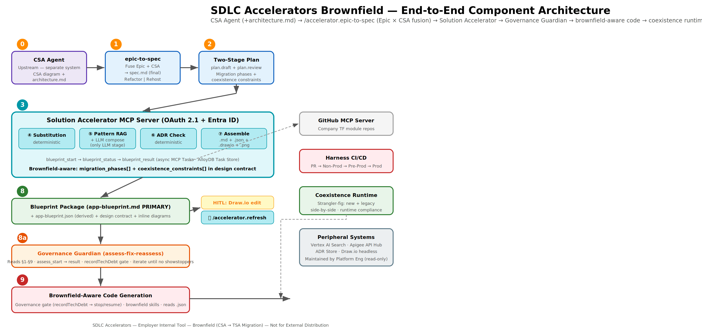
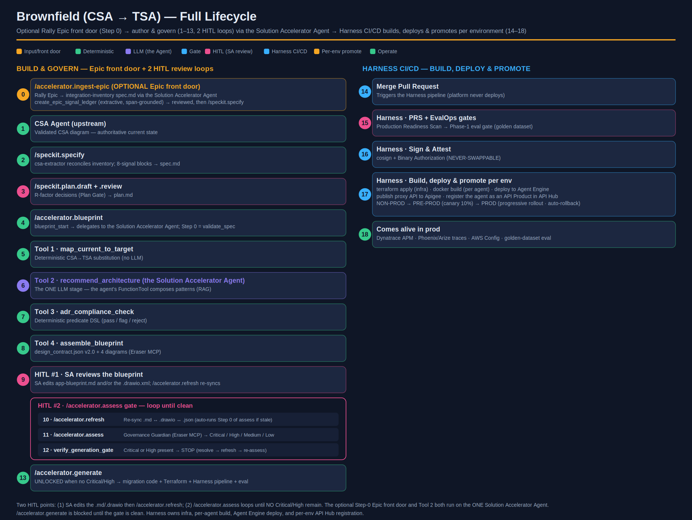
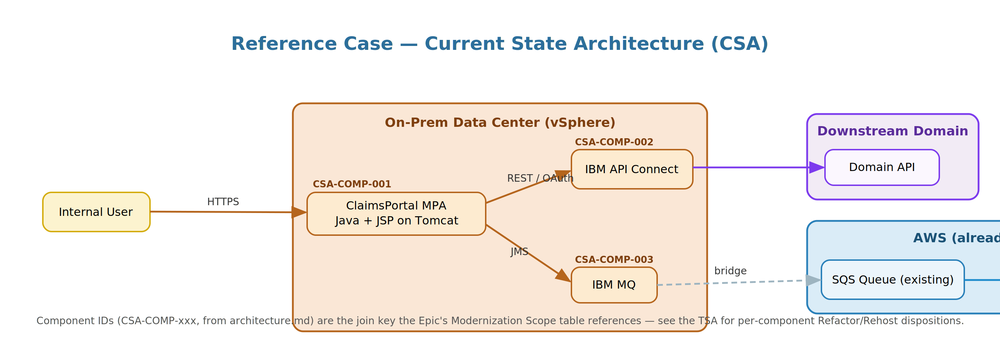
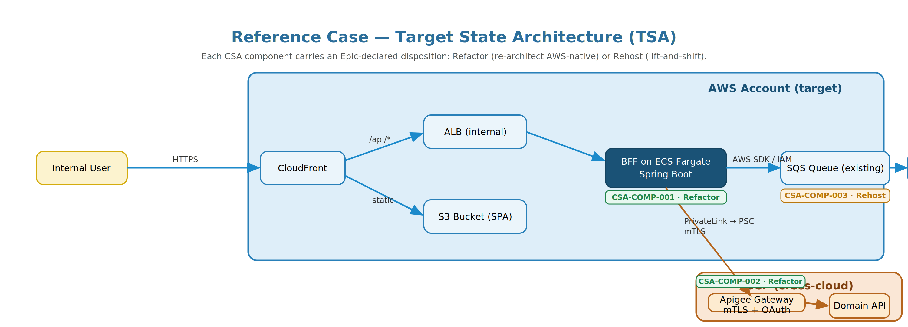
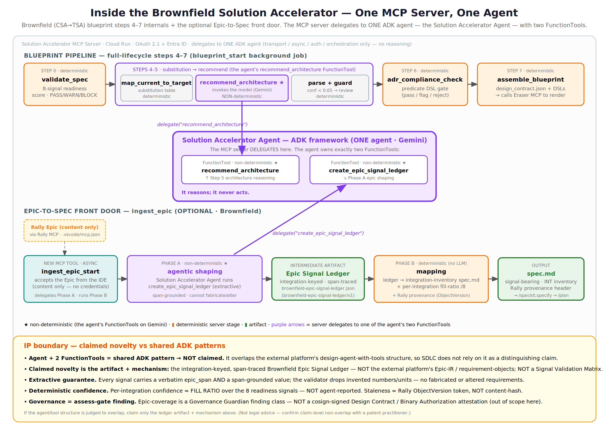
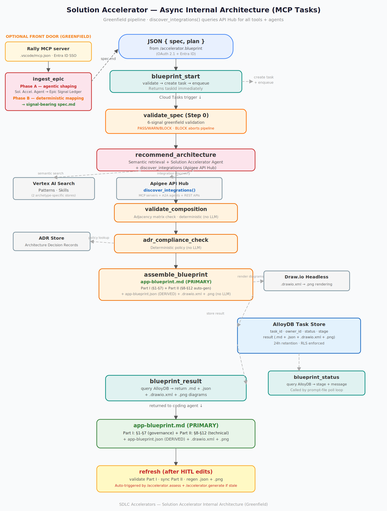
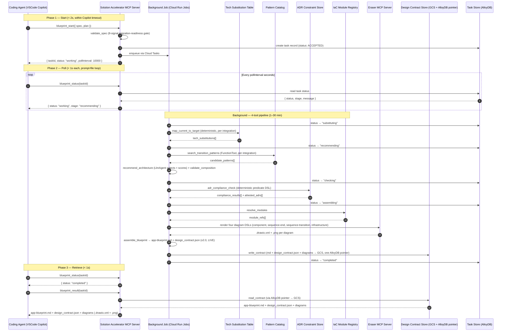
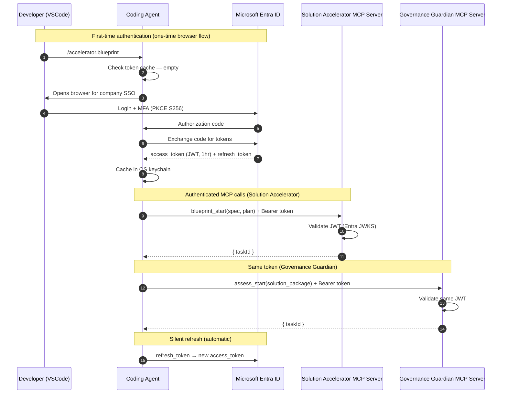

# SDLC Accelerators Brownfield — Architecture Document

*Scope: extending SDLC Accelerators from greenfield app generation to **brownfield current-state-to-target-state transformation** for AWS modernization, delivered as a Spec Kit preset.*

*Canonical name for all references: **SDLC Accelerators Brownfield**. Repository: `sdlc-accelerators-brownfield-preset`. Spec Kit preset name: `sdlc-accelerators-brownfield`.*

---

### Document set

| Document | Filename | Audience | Covers |
|---|---|---|---|
| **This document** | `csa-tsa-speckit-architecture.md` | Architects, tech leads | **WHY** — design decisions, internal designs, peripheral systems |
| Developer Guide | `csa-tsa-speckit-developerguide.md` | Developers | **HOW** — step-by-step workflow, templates, worked examples |
| Operating Playbook | `csa-tsa-speckit-operating-playbook.md` | Platform engineering, EA office | **PROCEDURES** — operate, maintain, govern, onboard |
| Governance Guardian | `governance-guardian-architecture.md` | Architects, EA office | **GOVERNANCE** — `/accelerator.assess` design, EA assessment flow, `recordTechDebt` gate, tech debt registry |

### Related core SDLC Accelerators documents

The brownfield document set extends (does not replace) the core SDLC Accelerators platform documentation:

| Core document | Filename | Consult for |
|---|---|---|
| Core Architecture | `sdlc-accelerators-architecture-archetype-agnostic.md` | Solution Accelerator MCP wire format (Layer 2), MCP Tasks async protocol design, base overlay skill architecture (Layer 3), EvalOps three-layer lifecycle (Layer 4) |
| Core Developer Guide | `sdlc-accelerators-archetype-agnostic-developer-guide.md` | Greenfield agentic/microservice workflows (§2–§3), spec signal words (§4), app-blueprint.md schema (§5), confidence scores (§8) |
| Core Operations Runbook | `csa-tsa-speckit-operating-playbook.md` | Vertex AI Search wire-level API calls (§1), MCP tool wire format (§1a), search quality regression suite (§2), acceptance telemetry (§3), catalog backup/DR (§4a), shared MCP Server operations (§9) |

---

## Table of Contents

1. [Document Purpose & Audience](#1-document-purpose--audience)
2. [Relationship to the Spec Kit Framework](#2-relationship-to-the-spec-kit-framework)
3. [Problem Statement](#3-problem-statement)
4. [Design Principles](#4-design-principles)
5. [High-Level Component Architecture](#5-high-level-component-architecture)
6. [Flow Walkthrough — The Ten Stages](#6-flow-walkthrough--the-ten-stages)
7. [CSA Agent — Upstream Dependency and Handoff Boundary](#7-csa-agent--upstream-dependency-and-handoff-boundary)
8. [Reference Case Architecture](#8-reference-case-architecture-vsphere-mpa--aws-spa)
9. [Solution Accelerator — Internal Design](#9-solution-accelerator--internal-design)
10. [Peripheral Systems](#10-peripheral-systems)
11. [Design Contract Lifecycle](#11-design-contract-lifecycle)
12. [Runtime Compliance Verification](#12-runtime-compliance-verification)
13. [Constitution Versioning Model](#13-constitution-versioning-model)
14. [Brownfield-Specific Changes to Greenfield Assets](#14-brownfield-specific-changes-to-greenfield-assets)
15. [Cross-Cloud Egress Pattern](#15-cross-cloud-egress-pattern-privatelink--psc)
16. [Framework Dependency Risk](#16-framework-dependency-risk)
17. [Cross-Cutting Concerns](#17-cross-cutting-concerns)
18. [Architectural Failure Modes](#18-architectural-failure-modes)

---

## 1. Document Purpose & Audience

This document is the architectural specification for SDLC Accelerators Brownfield. Its audience is enterprise architects, platform engineers, and senior developers who need to understand *why* the design is shaped the way it is before they implement, extend, or operate it.

SDLC Accelerators Brownfield is an additive extension on top of the existing SDLC Accelerators platform. The existing platform (greenfield archetypes, skill mechanism, constitution, EvalOps three-layer architecture, GitHub→Harness CI/CD path) remains in place with specific brownfield adaptations documented inline in Part I §5 (Patterns & Agent Topology) and Part II §11 (CI/CD & EvalOps). The brownfield extension adds: a CSA diagram-based integration extractor, a new spec template oriented around integration inventory, a new plan template with async review, a four-tool Solution Accelerator, a design-contract lifecycle with refresh, runtime compliance verification, and five peripheral data stores.

---

## 2. Relationship to the Spec Kit Framework

→ *Operating Playbook §2 covers framework dependency management and version-pinning.*

Spec Kit is GitHub's open-source toolkit for Spec-Driven Development. It owns the workflow concept (constitution → spec → plan → tasks → implement), the `/speckit.*` command namespace, the `specify` CLI, the preset mechanism, and helper scripts. Spec Kit adapts the same workflow to 30+ coding agents by rendering commands into each agent's native format.

### Spec Kit version governance

SDLC Accelerators Brownfield pins to a specific Spec Kit version. The pinned version is declared in `preset.yml` under `speckit_version`. Upgrades are gated through the preset release pipeline (Operating Playbook §2.2) — a Spec Kit upgrade is treated identically to a major-version preset change, requiring full CI/CD validation and manual platform-engineering approval before rollout.

**Contingency:** If Spec Kit introduces a breaking change that cannot be accommodated, the preset can operate in "pinned-fork" mode, referencing an internal fork of the Spec Kit CLI for up to 6 months while the platform team resolves the incompatibility. This fork is maintained in `github.company.com/platform/speckit-fork` and is a designated technical-debt item reviewed at every quarterly governance cycle (Operating Playbook troubleshooting section).

→ *§16 details the framework dependency risk assessment and contingency plan.*

### Architecture picture

```
Spec Kit (framework, pinned version)
├── owns: workflow shape (constitution → spec → plan → tasks → implement)
├── owns: /speckit.* command namespace
├── owns: specify CLI, preset mechanism, helper scripts
└── adapts to: 30+ coding agents (Copilot, Claude Code, Gemini, ...)

SDLC Accelerators-Greenfield (Spec Kit preset)
├── overrides: /speckit.specify with archetype-specific template
├── overrides: /speckit.plan with archetype-specific template
├── adds: /accelerator.blueprint, /accelerator.generate
├── adds: Solution Accelerator MCP Server (3-tool, greenfield-focused)
└── adds: domain skills + overlay skills

SDLC Accelerators Brownfield (Spec Kit preset — this document)
├── overrides: /speckit.specify with diagram extraction (csa-extractor agent) + CSA-inventory template
├── overrides: /speckit.plan with /speckit.plan.draft + /speckit.plan.review
├── adds: /accelerator.blueprint (4-tool brownfield Solution Accelerator)
├── adds: /accelerator.assess (Governance Guardian assessment — see Governance Guardian Architecture Extension)
├── adds: /accelerator.generate (brownfield-aware, updated skills + governance gate — see Part II §11)
├── adds: /accelerator.refresh (design-contract lifecycle refresh — see §11)
└── reuses: Spec Kit CLI, helper scripts, constitution mechanism (versioned — see Part II §10 Security & Identity)
```

### Command-namespace mapping

| Command | Source | Brownfield behavior |
|---|---|---|
| `/speckit.constitution` | Spec Kit built-in | Preset ships versioned dual constitution (Part II §10 Security & Identity) |
| `/speckit.specify` | Spec Kit built-in, preset override | csa-extractor agent parses CSA diagram + CSA-inventory template |
| `/speckit.plan.draft` | SDLC Accelerators Brownfield custom | Developer's first-pass r-factor + cutover decisions |
| `/speckit.plan.review` | SDLC Accelerators Brownfield custom | Async EA/architect review with structured comments |
| `/accelerator.blueprint` | SDLC Accelerators custom | 4-tool brownfield Solution Accelerator (§9) |
| `/accelerator.assess` | SDLC Accelerators custom | Governance Guardian assessment — extracts artifacts from app-blueprint.md, returns scorecard + findings (see Governance Guardian Architecture Extension) |
| `/accelerator.generate` | SDLC Accelerators custom, brownfield-updated | Governance gate (recordTechDebt → stop/resume) + skill-guided generation with migration-phase awareness (Part II §11 CI/CD & EvalOps) |
| `/accelerator.refresh` | SDLC Accelerators Brownfield custom | Re-runs Solution Accelerator, diffs design contract (§11) |
| `/speckit.clarify` | Spec Kit built-in | Reused unchanged |
| `/speckit.analyze` | Spec Kit built-in | Reused unchanged |
| `/speckit.checklist` | Spec Kit built-in | Brownfield quality checklist swapped in |

---

## 3. Problem Statement

The transformation problem — moving an existing on-prem application onto AWS — is structurally harder than greenfield generation along six axes.

**CSA discovery is a prerequisite, not an inline step.** Producing an accurate current-state architecture diagram is hard — most brownfield apps lack one. A separate **CSA Agent** handles this upstream: scanning source code, dependency manifests, infrastructure configs, and conducting structured interviews to produce a validated CSA diagram (drawio XML or Mermaid). SDLC Accelerators Brownfield begins *after* that diagram exists in the workspace. The coding agent's job is to extract integration points from the diagram and pre-fill the spec template — not to discover them from scratch. → *§7 covers the CSA Agent handoff boundary.*

**Integrations, not applications, are the unit of work.** An application is rarely lifted in one motion. A brownfield MPA on vSphere typically consists of a UI layer, a server-side rendering layer, three or four outbound integrations, and zero-to-many inbound integrations. Each gets a different r-factor verdict, a different target pattern, and potentially a different sequencing window.

**R-factor is a business decision, not a derivation.** The same IBM MQ-fronted integration legitimately maps to Amazon MQ (rehost), SQS (refactor), or EventBridge (event mesh). R-factor decisions are contested between dev, EA, and finance; they require async review, not a 30-minute solo pass. → *Developer Guide §9 covers the two-stage plan process.*

**ADRs are constraints, not retrieval candidates.** ADRs encode what the target state is forbidden to look like. If ADRs sit in the same semantic search index as patterns, compliance is enforced probabilistically. In a regulated enterprise, probabilistic compliance is non-compliance.

**High-stakes tech substitutions belong on deterministic rails, but the real world is multi-dimensional.** Mapping IBM MQ to SQS is not just `(source_tech, r_factor) → target_tech`. It's also conditional on data volume, criticality, compliance, region, partner constraints, and operational capability. The substitution mechanism must be designed for multi-dimensional decision logic from the start.

**Cross-cloud topology is first-class.** An AWS-resident SPA consuming a domain API through Apigee on GCP via PrivateLink+PSC is a recurring enterprise pattern with enough implementation complexity to warrant its own first-class architectural pattern. → *§15 covers this.*

**Design contracts go stale.** A 6-month modernization will see ADRs supersede, IaC modules version up, SLAs renegotiate, and org structures change. The design contract must be a living artifact with explicit lifecycle states and a refresh mechanism. → *§11 covers this.*

---

## 4. Design Principles

**P1 — Integration-level decomposition.** The unit of analysis is the integration, not the application. `spec.md` enumerates each integration point with its current and target state. `plan.md` carries the r-factor and sequencing decision for each one. The Solution Accelerator returns a `csa_to_tsa_mappings[]` array with one entry per integration. → *Developer Guide §7 (spec template) and §8 (worked example) show the integration-level structure.*

**P2 — Patterns retrieved, constraints enforced.** Patterns live in Vertex AI Search (semantic retrieval). ADRs live in a structured policy store (deterministic enforcement). The two are never co-indexed. → *§10.1 and §10.2 detail the separate stores. Operating Playbook §3 and §4 cover their operations.*

**P3 — Deterministic substitution before probabilistic composition.** Every CSA technology with an enterprise-approved AWS substitute is resolved by context-filtered table lookup before any LLM reasoning. The LlmAgent composes patterns around fixed choices. → *§10.3 details the context-filtered substitution mechanism.*

**P4 — Multi-label functional categorization.** The spec captures `functional_category[]` as a multi-label tag set plus a capability vector.

**P5 — Transition is a first-class artifact.** The Solution Accelerator emits both an end-state and a transition sequence diagram. Migration phases are explicit in the design contract. → *§9.5 details `assemble_blueprint` diagram generation: DSLs rendered by the Eraser MCP server to `.drawio.xml` + `.png`.*

**P6 — Audit attestation is generated, not added later.** Every `csa_to_tsa_mappings[]` entry carries `adr_attestations[]`. Verified at design time (§9.4), at commit time (§11), and at runtime (§12).

**P7 — CSA Agent as upstream dependency.** A validated CSA diagram is a prerequisite. The CSA Agent (a separate system) handles source scanning, infra-config analysis, and human interviews. SDLC Accelerators Brownfield starts when the diagram is in the workspace. The coding agent extracts integrations from the diagram and pre-fills the spec. → *§7 details the handoff boundary.*

**P8 — Design contracts are living artifacts.** The design contract has explicit lifecycle states (live/stale/expired) and a refresh mechanism. Long-lived projects must refresh before deploy. → *§11 details the lifecycle.*

---

## 5. High-Level Component Architecture




The diagram above shows the complete flow from CSA Agent through Solution Accelerator (OAuth 2.1 + Entra ID), Governance Guardian (assess-fix-reassess loop), governance gate (recordTechDebt → stop/resume), to brownfield-aware code generation via GitHub MCP Server, Harness CI/CD, and runtime compliance.

**Read this diagram top-down.** The CSA Agent (⓪, upstream, separate system) produces a validated CSA diagram and places it in the workspace. The coding agent's `csa-extractor` parses the diagram and pre-fills `spec.md` (①). The developer completes a two-stage plan (②), then invokes the Solution Accelerator (③). Inside the MCP server, four tools run in a fixed order: ④ deterministic context-filtered substitution, ⑤ semantic pattern retrieval and LLM composition (the only LLM stage), ⑥ deterministic ADR compliance enforcement, and ⑦ deterministic blueprint assembly (markdown + `app-blueprint.json` + Draw.io diagrams: `.drawio.xml` (editable) + `.png` (rendered) ). The output (⑧) is an `app-blueprint.md` (PRIMARY) plus `app-blueprint.json` (DERIVED, machine-readable) plus a design contract with attestations and inline diagrams. The developer reviews (⑧) using Draw.io VSCode extension for diagram editing, runs `/accelerator.assess` for governance assessment (⑧a — reads Part I (§1-§7) only, NOT .json, NOT Part II, iterative until no showstoppers), then generates brownfield-aware code with a governance gate (⑨ — recordTechDebt → stop/resume, auto-regenerates `.json` from `.md` if changed, reads `.json` for code generation), and can refresh the contract (🔄) at any time if peripherals have changed. The IaC generation reads company Terraform module repos via the GitHub MCP Server. Runtime compliance closes the loop between deployment and attestation. The peripheral systems band is maintained by Platform Engineering and consumed read-only at runtime.

---

## 6. Flow Walkthrough — The Ten Stages




### ⓪ CSA Agent (upstream) — Produce a validated CSA diagram

→ *§7 covers the handoff boundary. The CSA Agent is a separate system with its own documentation.*

The CSA Agent is an upstream prerequisite, not part of SDLC Accelerators Brownfield. It scans source code, dependency manifests, infrastructure configs, and conducts structured interviews to produce a validated CSA diagram (drawio XML or Mermaid). The CSA Agent places the diagram file in the developer's workspace. SDLC Accelerators Brownfield begins when that diagram is present.

### ① /speckit.specify — Extract integrations from the diagram and formalize the spec

The developer invokes `/speckit.specify`. The preset's `csa-extractor` agent parses the CSA diagram in the workspace, extracts integration points (nodes as components, edges as integrations, group containers as cloud/on-prem boundaries, edge labels as protocol hints), and pre-fills the integration blocks of `spec-template.md`. Fields the diagram cannot reveal — auth specifics, SLAs, payload schemas, criticality, compliance, target intent, hard rejections — are elicited from the developer. The deliverable is `spec.md`.

### ② /speckit.plan.draft + /speckit.plan.review — Two-stage r-factor decisions

→ *Developer Guide §9 covers the two-stage plan process in detail.*

The developer runs `/speckit.plan.draft` to produce a first-pass `plan.md` with r-factor, cutover, and sequencing decisions per integration. Then `/speckit.plan.review` publishes the draft for async review by an EA architect or LOB lead, who adds structured comments. The developer resolves comments and the plan enters `reviewed` state. Acceptance telemetry tracks solo-drafted vs. reviewed plans and correlates with downstream quality.

### ③ /accelerator.blueprint — Package and invoke (async)

The developer invokes `/accelerator.blueprint`. The command packages `spec.md` and `plan.md` into a single JSON envelope conforming to a versioned schema (`blueprint_request.schema.json`), then invokes the Solution Accelerator MCP server using the **MCP Tasks** async protocol.

VS Code Copilot enforces a hard 10–15 second timeout on MCP tool calls. A synchronous call that blocks for the full blueprint generation (1–30 minutes depending on integration count) would be killed immediately. The Solution Accelerator therefore exposes three MCP tools — `blueprint_start`, `blueprint_status`, `blueprint_result` — instead of one blocking call. The prompt file orchestrates the polling loop: start the task, poll for status at the server-recommended interval, report progress to the developer in the Chat pane, and retrieve the result when complete. Each individual MCP call completes in under 2 seconds. The coding agent never touches Vertex AI Search, the ADR store, or the LlmAgent directly. The MCP server remains the single point of governance. → *§9 details the three-tool async interface and the internal 4-stage pipeline.*

### ③a validate_spec — 8-Signal Brownfield Migration Readiness Gate

Before the RAG pipeline runs, the Solution Accelerator validates that the spec contains the signals needed for a SAFE migration. Brownfield validation is fundamentally different from greenfield — the core question is not "do we have enough signals to compose the right architecture?" but "do we have enough signals to plan a safe migration with rollback at every stage?"

**Brownfield Signal Validation Matrix:**

| Signal | What is checked | Why it matters | Pass | Warn | Block |
|---|---|---|---|---|---|
| **CSA Completeness** | All integration points identified with specific technology + version (e.g., "IBM MQ 9.3", "Oracle 19c") | Tech Substitution Table needs specific tech to map CSA→TSA. "Legacy system" can't be mapped. | Every integration has name + tech + version | Some vague ("messaging system") | CSA diagram missing or <3 integrations |
| **Integration Type** | Each integration classified: sync API, async messaging, batch, DB link, file transfer | Determines migration approach per integration. Sync → Strangler-Fig proxy. Async → message bridge. Batch → scheduled job. | All integrations typed | >50% typed | <50% typed |
| **Data Flow Direction** | Each integration marked: read-only, write-only, or bidirectional | Determines phase assignment. Read → Phase 1. Write → Phase 2. Bidirectional → Phase 2 with dual-write (hardest). | All integrations have direction | >50% have direction | <50% have direction |
| **Criticality Rating** | Each integration rated: critical / high / medium / low | Determines migration ORDER. Low-risk first, critical last. Critical integrations need <5 min rollback SLA. | All integrations rated | >50% rated | <50% rated or no "critical" |
| **Coexistence Constraints** | Each integration flagged: dual-read, dual-write, hard-cutover, or N/A | Missing flags → data inconsistency during migration. This is the #1 brownfield risk. | All integrations flagged | >50% flagged | 0 flags (migration will lose data) |
| **API Surface** | External-facing APIs with contracts (OpenAPI/WSDL/endpoint URLs) | Strangler-Fig proxy needs contracts to route correctly. Undocumented APIs → broken consumers. | All external APIs have contracts | Some documented | External APIs exist, zero contracts |
| **State Management** | Stateful components identified: session (sticky), transaction (2PC/XA), cache (shared) | Stateful components can't be proxy-switched — need session migration or saga pattern. | Each component identified with type | "Some state" but not specific | Stateful components undocumented |
| **Data Volume + SLA** | Volume per integration, latency SLAs, throughput | Determines batch window, proxy overhead budget, dual-running infra sizing. | Volume + SLA per integration | Rough estimates only | No volume or SLA data |

**Why brownfield validation is MORE critical than greenfield:** Greenfield validation prevents bad architecture (redesignable). Brownfield validation prevents data loss and broken production systems with real users and real data (much harder to recover from).

**Validation output:** A `migration_readiness_score` (0-100) with per-signal status. If any signal is BLOCK, `blueprint_start` returns immediately with specific guidance. If WARN, the pipeline continues but flags affected integrations as higher-risk in the phase assignment. The output includes a `phase_assignment_preview` showing which integrations go in Phase 1 (read-path), Phase 2 (write-path), and Phase 3 (decommission) based on the data flow direction and criticality signals.

**Two-layer validation architecture (local + server-side):**

Brownfield validation runs at TWO layers. This is even more critical than greenfield because brownfield errors affect a RUNNING production system.

```
Layer 1: LOCAL (SpecKit Preset — during /speckit.specify capture)
  ┌──────────────────────────────────────────────────────────┐
  │ The /speckit.specify preset's csa-extractor parses the    │
  │ CSA diagram and pre-fills integration blocks. The preset  │
  │ template then validates EACH integration as the developer │
  │ provides details:                                         │
  │                                                           │
  │ Per integration:                                          │
  │   Technology + version? → ✅ "Oracle 19c" / ❌ "legacy db"│
  │   Integration type? → ✅ sync/async/batch/DB/file         │
  │   Data flow direction? → ✅ read/write/bidirectional      │
  │   Criticality? → ✅ critical/high/medium/low              │
  │   Coexistence? → ✅ dual-read/dual-write/hard-cutover/N/A │
  │   API contract? → ✅ OpenAPI/WSDL documented              │
  │                                                           │
  │ Summary: migration readiness score → write spec.md        │
  └──────────────────────────────────────────────────────────┘
                          ↓ spec.md
Layer 2: SERVER-SIDE (Solution Accelerator — Step 0 of blueprint_start)
  ┌──────────────────────────────────────────────────────────┐
  │ validate_spec (8-signal migration readiness matrix) runs inside MCP Server with access to:      │
  │ - Tech Substitution Table (verify EVERY tech has approved │
  │   TSA mapping with confidence score)                      │
  │ - Apigee API Hub (verify A2A agents for partners)         │
  │ - ADR Store (verify migration decisions comply with ADRs, │
  │   coexistence policies, rollback requirements)            │
  │ - Cross-integration graph analysis (circular deps,        │
  │   conflicting coexistence constraints, phase ordering)    │
  │                                                           │
  │ Returns: migration_readiness_score + per-signal status    │
  │ + phase_assignment_preview                                │
  │ BLOCK → return immediately. WARN → continue with flags.   │
  └──────────────────────────────────────────────────────────┘
                          ↓
  RAG pipeline (map_current_to_target → recommend_architecture → adr_compliance → assemble)
```

**What server-side catches that local can't:**

| Check | Why local can't do it | Server-side mechanism |
|---|---|---|
| Tech Substitution confidence | Requires the confidence score database | Server queries AlloyDB — flags low-confidence mappings (< 0.85) for EA review |
| A2A agent availability | Requires Apigee API Hub | Server verifies external partners flagged as A2A actually have deployed, active agents |
| ADR compliance pre-check | Requires ADR Store | Server catches spec decisions that violate existing architecture decisions (e.g., "no dual-write for financial systems" ADR) |
| Cross-integration consistency | Complex graph analysis | Server checks: circular dependencies, conflicting coexistence (dual-write on one end, hard-cutover on the other), phase ordering conflicts |
| Phase assignment preview | Requires all signals + graph analysis | Server generates preview: Phase 1 (read-path), Phase 2 (write-path), Phase 3 (decommission) based on data flow + criticality |

**SpecKit preset template — per-integration validation:**

The `/speckit.specify` brownfield preset validates each integration during capture:

| Signal | SpecKit preset validates | Mechanism |
|---|---|---|
| Technology + version | Specific tech name with version (not "legacy system") | Preset: "The CSA extractor found [component]. What technology and version? Example: 'Oracle 19c'" |
| Integration type | Classified as sync API / async messaging / batch / DB link / file transfer | Preset: "Is this synchronous, asynchronous, batch, database link, or file transfer?" |
| Data flow direction | Marked read-only / write-only / bidirectional | Preset: "Does data flow in (read), out (write), or both ways (bidirectional)?" |
| Criticality | Rated critical / high / medium / low | Preset: "If this integration goes down during migration, what's the business impact?" |
| Coexistence | Flagged dual-read / dual-write / hard-cutover / N/A | Preset: "During migration, must this work on BOTH old and new systems?" If bidirectional → recommend dual-write. |
| API surface | External APIs have documented contracts | Preset: "Do you have an API contract (OpenAPI, WSDL, or endpoint documentation)?" |

**Brownfield RAG pipeline with both layers:**
```
/speckit.specify (SpecKit preset — Layer 1 local validation per integration)
  → csa-extractor parses CSA diagram → pre-fills §4
  → Developer completes each integration with validated signals
  → spec.md written with migration readiness signals

/speckit.plan (two-stage async plan)
  → plan.md

/accelerator.blueprint
  → blueprint_start(spec, plan)
    → validate_spec (Layer 2 server-side — Tech Sub Table, API Hub, ADR Store, graph analysis)
      → BLOCK: return with guidance. WARN: continue with risk flags.
    → map_current_to_target (per integration, using validated tech+version)
    → recommend_architecture (pattern retrieval filtered by r-factor + target tech)
    → adr_compliance_check (+ migration ADRs: rollback, coexistence, checkpoints)
    → assemble_blueprint (+ migration_phases[] + csa_to_tsa_mappings[] + rollback_procedures[])
```

**Greenfield vs Brownfield validation — side by side:**

| Dimension | Greenfield | Brownfield |
|---|---|---|
| Core question | "Enough signals to compose the RIGHT architecture?" | "Enough signals to plan a SAFE migration?" |
| Input artifact | spec.md (blank slate) | CSA diagram + spec.md (§4 pre-filled from CSA) |
| Pattern signals | Ordering words (first, then, parallel) | Integration type classification |
| Platform signals | Named data systems | Named technologies with versions |
| Partnership signals | External partners (A2A vs MCP) | API surface (backward compatibility) |
| Logic signals | IF/THEN business rules | Coexistence constraints (dual-read/write) |
| Risk signals | PII/PHI classification | Criticality rating |
| Quality signals | Measurable acceptance criteria | Data volume + SLA |
| Unique signals | — | Data flow direction, state management |
| Block consequence | Bad architecture (redesignable) | Data loss (production impact) |

### ④ map_current_to_target — Context-filtered technology substitution

The first tool the MCP server runs takes the CSA inventory and r-factor intent per integration and produces a `tech_substitutions[]` list by context-filtered lookup against the Tech Substitution Decision Table. The table is keyed by `(source_tech, r_factor)` plus up to 12 context dimensions (criticality, data_size_class, compliance, etc.) and returns `target_tech`, the ADR reference that authorizes the substitution, and any transition-pattern reference. No LLM runs at this stage. If a substitution is missing from the table, the tool returns a `requires_review: true` flag — never an LLM-invented substitute. → *§9.3 details the context-filtered mechanism.*

### ⑤ recommend_architecture — Semantic pattern retrieval + composition

With substitutions locked in, the LlmAgent inside the Solution Accelerator uses hybrid semantic and keyword search against the Pattern Catalog in Vertex AI Search. The retrieval is filtered by `functional_category[]`, `r_factor_supports[]`, and the resolved `target_tech` set. For each integration, the LlmAgent picks a target-state pattern and composes them into a coherent multi-integration target architecture. A `validate_composition` sub-step runs before return to catch incompatible compositions (strangler-fig wrapping big-bang, dual-publish without downstream idempotency, etc.). This is the only stage where probabilistic LLM reasoning is permitted. → *§9.3 details the full tool logic.*

### ⑥ adr_compliance_check — Deterministic policy enforcement

The composed pattern tree from ⑤ is checked against the ADR Constraint Store. Each ADR is a structured rule with a machine-readable predicate; the check is a query, not an LLM judgment. Output per integration: `pass` (with attested ADRs), `flag` (requires developer review), or `reject` (violated ADR, blocks pipeline). → *§9.4 details the predicate evaluation.*

### ⑦ assemble_blueprint — Deterministic blueprint and diagram generation

The final tool takes the substitutions, composed patterns, compliance attestations, and matched IaC modules, and assembles two artifacts: **`app-blueprint.md`** (PRIMARY — structured markdown with inline PNG references for governance diagrams) and **`app-blueprint.json`** (DERIVED — machine-readable JSON generated from the `.md` sections, consumed by `/accelerator.generate`). It also produces base64-encoded component and HA/DR diagram PNGs, Draw.io source files (`.drawio.xml`, editable in the Draw.io VSCode extension), and `design_contract.json` with full provenance. Component and HA/DR diagrams are rendered by the **Eraser MCP server** (Solution Accelerator sends the diagram DSL, receives `.drawio.xml` + `.png` synchronously).  When cross-cloud topology is selected, it injects a Phase-0 entry with an external-team coordination checklist. All assembly is deterministic — no LLM. → *§9.5 details the assembly logic and diagram generation. See `app-blueprint-md-template-and-fnol-example.md` for the complete 12-section template structure and FNOL reference example.*

### ⑧ Developer reviews `app-blueprint.md` + `design_contract.json`

The developer reviews the blueprint and the design contract in VSCode. Draw.io diagrams render inline in VSCode markdown preview. Component diagrams are inline PNGs with editable source files alongside — `.drawio.xml` (editable in the Draw.io VSCode extension). The developer edits whichever format they prefer. Confidence scores, alternatives, and `requires_review` flags are visible per integration. The developer edits the blueprint `.md` if needed (the `.json` is auto-regenerated from `.md` by `assemble_blueprint` — never edit `.json` directly). The developer may re-invoke `/accelerator.blueprint` to regenerate after spec or plan edits. The design contract is emitted with `lifecycle: "LIVE"`. → *Developer Guide covers the review checklist in the blueprint review section.*

### ⑧a /accelerator.assess — Governance assessment (iterative)

After reviewing the blueprint, the developer runs `/accelerator.assess`. The coding agent reads `app-blueprint.md` (NOT `app-blueprint.json` — the Governance Guardian assesses the human-readable architecture, not the machine-readable JSON) and extracts the 7 governance sections from Part I (§1-§7) — the 7 governance sections: §1 Executive Summary, §2 Tech Stack, §3 Architecture Decision Log, §4 NFRs, §5 Patterns & Agent Topology, §6 Component Architecture (PNG diagram), §7 HA/DR Views (PNG diagrams) — packages them as an ephemeral **solution_package** (transport JSON sent over MCP — not the same as the persisted `app-blueprint.json` file), and sends to the **Governance Guardian MCP Server** via the same async MCP Tasks pattern as the Solution Accelerator (`assess_start` → poll `assess_status` → `assess_result`). The `app-blueprint.json` file in the workspace is not read, not sent, and not modified during governance assessment — it exists solely for `/accelerator.generate` to consume later. The EA assessment engine evaluates the solution against enterprise standards (black box to SDLC Accelerators). The developer sees progress in the Chat pane and receives a scorecard (7 categories) + findings (showstopper / high / medium / low).

If showstoppers exist, the developer fixes them (e.g., adds cross-region DR for Aurora PostgreSQL per ADR-205) and re-runs `/accelerator.assess`. This assess-fix-reassess loop continues until no showstoppers remain. Non-showstopper findings are acceptable and will be recorded as tech debt at the next step.

→ *Governance Guardian Architecture Extension covers the full assessment flow, solution package schema, scorecard format, and MCP tool definitions.*

### ⑨ /accelerator.generate — Brownfield-aware skill-guided generation (with governance gate)

→ *Part II §11 documents every brownfield-specific CI/CD and migration phase configuration.*

**Governance gate (Step 0):** Before the generation pipeline runs, the coding agent calls `recordTechDebt` on the Governance Guardian MCP Server. This tool looks up the latest assessment findings and classifies each as showstopper or tech_debt. If any showstoppers remain → `{ signal: "stop" }` — generation is blocked, the developer must fix and re-assess. If no showstoppers → `{ signal: "resume", tech_debt_id: "TD-2026-0142" }` — remaining findings are recorded as tech debt and generation proceeds. If no assessment exists, the developer is warned but can skip.

**Auto-regeneration (Step 0a):** After the governance gate passes, the coding agent checks whether `app-blueprint.md` was modified since the last `assemble_blueprint` call (by comparing the `.md` file's hash against `blueprint_hash` stored in `app-blueprint.json`). If the hashes differ, the coding agent calls `assemble_blueprint` first to regenerate `app-blueprint.json` from the edited `.md` + re-render diagrams via the Eraser MCP server. This ensures the JSON always reflects the latest `.md` edits.

**Generation (Steps 1–18):** Skills read `app-blueprint.json` (machine-readable) and consume `migration_phases[]` and `coexistence_constraints[]` from the design contract. Generated code includes feature-flag scaffolding for strangler-fig and dual-publish patterns, Phase-0 cross-cloud plumbing checklists when PrivateLink+PSC is selected, and AWS Config rules derived from ADR attestations for runtime compliance verification. The IaC generation skill reads company Terraform module interfaces from GitHub repos via the **GitHub MCP Server**, maps blueprint fields to module variables deterministically, and generates compliant Terraform that references company modules (never raw `aws_*` resources). → *See greenfield Architecture Document, Layer 3 for the full IaC generation flow via GitHub MCP Server.*

### 🔄 /accelerator.refresh — Keep the contract alive

→ *§11 covers the full lifecycle. Developer Guide §15 covers usage.*

Re-runs the Solution Accelerator against the existing spec/plan, diffs the design contract, and surfaces changes. Required at every PR if the contract is stale. The pre-commit hook blocks commit on an expired contract.

### ⑩–⑮ Merge → Harness CI/CD → deploy & promote per environment

→ *Operating Playbook §8 covers deployment, scaling, and observability in operational detail.*

The platform GENERATES — it never deploys (Constitution Rule 1). After the developer commits the generated migration code, Terraform, `.harness/pipeline.yaml`, and eval assets and the PR is merged, the **Harness pipeline** takes over and runs end to end:

1. **PRS + EvalOps gate** — Production Readiness Scan, then the brownfield Phase-1 eval gate against the golden dataset.
2. **Sign & Attest** — cosign + Binary Authorization (never-swappable).
3. **Build, deploy & promote per environment** — for each environment in turn (non-prod → pre-prod → prod), Harness runs `terraform apply` (infra, approval-gated), builds a Docker image per migration agent, deploys to **Agent Engine**, publishes the proxy API to the **Apigee Gateway**, and registers the agent as an **API Product in API Hub for that environment**. Promotion uses canary (10%) into pre-prod and progressive rollout into prod, with automatic rollback on regression.
4. **Comes alive in prod** — the generated boilerplate (Dynatrace APM, Phoenix/Arize tracing, golden-dataset eval hooks, AWS Config compliance rules derived from ADR attestations) activates in production, closing the runtime-compliance loop (§12).

Each environment gets its own API Hub registration, so the agent is discoverable as an API Product per environment. `/accelerator.refresh` is required before deploy — the Harness pipeline gate enforces a LIVE contract.

---

## 7. CSA Agent — Upstream Dependency and Handoff Boundary

→ *Developer Guide §6 covers the developer-facing `/speckit.specify` workflow. The CSA Agent is a separate system with its own architecture documentation.*

### 7.1 Separation of concerns

The CSA Agent and SDLC Accelerators Brownfield are separate systems with a clean handoff:

| Responsibility | Owner | Deliverable |
|---|---|---|
| Produce an accurate CSA diagram from source code, infra configs, manifests, and human interviews | **CSA Agent** (separate system) | `.drawio.xml` file in the workspace |
| Extract integration points from the diagram and pre-fill `spec.md` | **SDLC Accelerators Brownfield** (`csa-extractor` agent via `/speckit.specify`) | `spec.md` |

SDLC Accelerators Brownfield does NOT perform source-code scanning, infra-config analysis, or structured interviews. Those are CSA Agent responsibilities. If the CSA Agent has not yet run, or has produced a diagram the developer considers incomplete, the developer must return to the CSA Agent workflow before running `/speckit.specify`.

### 7.2 What the diagram must contain

For the `csa-extractor` agent to produce a useful spec, the CSA diagram should contain:

- **Component nodes** — each system or service the application interacts with (including itself)
- **Integration edges** — labeled with protocol/transport hints where known (e.g. `HTTPS`, `JMS`, `SFTP`)
- **Boundary groups** — containers marking cloud or on-prem boundaries (e.g. a subgraph labeled "On-Prem" or "AWS")
- **Vendor stencils** (optional, drawio only) — e.g. `shape=mscae/aws-sqs` enables tech-token inference

### 7.3 What the diagram typically does NOT contain

The following fields are elicited from the developer by `/speckit.specify` because diagrams rarely carry them:

- Auth flow specifics (OAuth grant type, mTLS cert source, SAML configuration)
- SLA / throughput numbers (p95 latency, peak TPS, message volume)
- Payload schemas (path to OpenAPI / JSON schema files)
- Criticality tier, data classification, compliance regimes
- Target intent (preserve invariants, acceptable downtime, hard rejections)
- Cross-cloud latency budgets and transit method (PrivateLink / VPN / Internet)

Real enterprise diagrams also frequently have unlabeled edges — the extractor will leave `TODO:` markers for protocol and transport details it cannot infer. This is by design: leaving a gap is better than guessing wrong.

### 7.4 Diagram format parsing rules

**drawio XML:**
- `<mxCell vertex="1">` with no `edge` attribute → component node
- `<mxCell edge="1" source="X" target="Y">` → integration edge
- `style` attribute containing `shape=mscae/*` → vendor-tech inference
- Parent-child `<mxCell>` with `style="...container"` → boundary group

**Mermaid:**
- `A -->|label| B` — node declarations and edge labels
- `subgraph Name` blocks → boundary groups
- `class X aws` assignments → cloud/region inference

---

## 8. Reference Case Architecture — vSphere MPA → AWS SPA

→ *Developer Guide §8 has the filled `spec.md` and Developer Guide §11 has the filled `plan.md` for this case.*

### 8.1 Scenario

A legacy multi-page application runs on vSphere (Java + JSP on Tomcat), with two outbound integrations: a synchronous domain API via IBM API Connect on-prem, and an asynchronous IBM MQ producer to a queue consumed by a downstream app already in AWS (fronted by SQS). Target: SPA on S3/CloudFront, BFF on ECS Fargate, domain API via Apigee on GCP, direct SQS publish.

### 8.2 Current State Architecture



### 8.3 Target State Architecture



### 8.4 Transformation per integration

| ID | Integration | CSA → TSA | R-Factor | Transition |
|---|---|---|---|---|
| INT-001 | UI rendering | JSP → SPA on CloudFront + S3 | Refactor | Big-bang (paired with INT-002) |
| INT-002 | Server logic | Tomcat → Spring Boot on Fargate | Refactor | Strangler-fig via feature flag |
| INT-003 | Domain API | APIC client → Apigee client | Replatform | Blue-green at gateway, 14-day soak |
| INT-004 | Async messaging | MQ producer → SQS producer | Refactor | 48h dual-publish |

**Coupling constraints:** INT-001 + INT-002 cut over together. INT-003 lags by 14 days (soak). INT-004 has 48h dual-publish driven by downstream idempotency SLA. `migration_phases[]` models this explicitly.

**Cross-cloud:** INT-003 requires a Phase-0 cross-cloud plumbing step (PrivateLink+PSC provisioning) before the BFF can reach Apigee. → *§15 covers this pattern.*

⚠️ **Decisions in this reference case that should NOT be copied without evaluation for your context:** SAML SSO via Ping Federate (may not be your IDP), Oracle 19c retained on-prem (may not be your DB strategy), 48h dual-publish window (depends on your downstream's idempotency contract), Pilot Light DR (Tier 1 apps may need Warm Standby).

---

## 9. Solution Accelerator — Internal Design

→ *Operating Playbook §8 covers deployment, scaling, and observability. Developer Guide §12 covers the developer-facing invocation.*

### 9.1 Overview

The Solution Accelerator is an ADK-based agent exposed as an MCP Server, deployed on Cloud Run in the company's GCP project. It is OAuth 2.1 protected and does not persist the inbound spec or plan beyond the task boundary. Audit logs (caller, timestamp, integrations summary, output blueprint hash) are written to Splunk.

The MCP interface exposes **six async tools** using the MCP Tasks primitive (spec revision 2025-11-25): the three blueprint tools below, plus the optional Epic-to-Spec front door `ingest_epic_start` / `ingest_epic_status` / `ingest_epic_result` (§ "Epic-to-Spec Ingestion"). This is necessary because VS Code Copilot enforces a hard 10–15 second timeout on synchronous MCP tool calls, while the internal 4-stage pipeline (map → recommend → check → assemble) can take 1–30 minutes depending on integration count and pattern-catalog query volume.

| MCP tool | What it does | Latency |
|---|---|---|
| `blueprint_start` | Validates input, creates a background task, returns `taskId` | < 2 seconds |
| `blueprint_status` | Returns current pipeline stage and progress message | < 1 second |
| `blueprint_result` | Returns JSON: `markdown` (app-blueprint.md), `blueprint_json` (app-blueprint.json — derived, machine-readable), `diagrams` (base64 PNGs + `.drawio.xml` source), `design_contract`, hashes | < 1 second |
| `ingest_epic_start(epic)` | **Epic front door.** Receives a Rally Epic (content only); delegates Phase A to the Solution Accelerator Agent's `create_epic_signal_ledger` tool, then Phase B maps deterministically → integration-inventory `spec.md` + ledger | < 2 seconds |
| `ingest_epic_status` / `ingest_epic_result` | Poll phase (`shaping`/`mapping`); return `spec.md` + `epic-signal-ledger.json` + per-integration confidence + the readiness-gate verdict | < 1 second |

Internally, the background task runs the 4-stage pipeline described in §9.4–§9.7. The background work executes on **Cloud Run Jobs** (no request-timeout constraint), triggered by `blueprint_start` via Cloud Tasks. Task state (taskId, status, progress, result) is stored in AlloyDB with a 24-hour retention enforced by a scheduled Cloud Scheduler cleanup job (hourly: `DELETE FROM blueprint_tasks WHERE created_at < NOW() - INTERVAL '24 hours'`).

Rate limiting applies to `blueprint_start` (10 starts/hour per user, 200/hour per org) but not to `blueprint_status` or `blueprint_result` (polling is lightweight).

#### One MCP Server, one Agent — how the four tools are distributed (steps 4–7 internals)

The Solution Accelerator MCP Server **delegates to exactly one ADK agent — the `solution_accelerator_agent` (the "Solution Accelerator Agent"), built with the ADK framework** — there is no fleet of agents behind the server. The MCP server itself does no reasoning (transport, async MCP Tasks, OAuth, orchestration); it hands each task to the agent via **direct capability dispatch** (the server names the capability — there is no LLM tool-router, so no extra model call is spent choosing a tool). The agent owns **two FunctionTools**: `recommend_architecture` (Tool 2 below, the per-integration pattern composition) and `create_epic_signal_ledger` (Phase A of the optional Epic front door, § "Epic-to-Spec Ingestion"). The four tools that the full-lifecycle diagram labels steps 4–7 (Tools 1–4) run in a **fixed order** inside the background job, and only one of them — Tool 2, the agent's `recommend_architecture` — invokes the model. The fixed order is itself a governance control: substitution and ADR compliance must run deterministically and in sequence, never at an LLM's discretion.



- **`validate_spec` (Step 0)** — deterministic 8-signal migration-readiness gate (readiness score + PASS/WARN/BLOCK + phase preview).
- **Tool 1 · `map_current_to_target`** — deterministic context-filtered decision table. Unresolved substitutions raise an error with **no LLM fallback** — a wrong CSA→TSA substitution would lose production data, so the LLM is never allowed to guess here.
- **Tool 2 · `recommend_architecture`** (the Solution Accelerator Agent's FunctionTool) — the only stage that touches the LLM, and even it is `retrieve()` (deterministic RAG) → **the agent** picks a transition pattern with a confidence → deterministic parse + guard (confidence `< 0.65` → `requires_review`, never a fabricated selection).
- **Tool 3 · `adr_compliance_check`** — deterministic no-`eval()` predicate DSL (pass / flag / reject + attested ADRs), preserved as a **separate gate** rather than folded into the LLM.
- **Tool 4 · `assemble_blueprint`** — deterministic: `design_contract.json` v2.0 + four diagram DSLs + cross-cloud Phase-0 injection; *calls* the Eraser MCP server to render diagrams.

As in greenfield, **the agent reasons but never acts** — substitution, ADR enforcement, and assembly are deterministic server stages. (No meta-skills, no signed Design Contracts — that is the external platform IP.)

> **No new skills/tools are synthesized in brownfield (by design).** The no-match → create-new path — emitting a new SKILL.md or a new FunctionTool definition when semantic search misses — is a **greenfield-only** capability, because greenfield composes a *new agentic application* whose agents own skills and tools. **Brownfield is modernization, not agentic-app creation**: it maps each existing integration to a target via deterministic CSA→TSA transition patterns and substitutions, and binds to existing target services — it does not build an agent topology, so there are no agent skills/tools to create. The brownfield design contract therefore carries no `to_create` block.

> **IP note (Solution Accelerator Agent + two FunctionTools).** The *structure* "an MCP server delegates to one ADK agent holding FunctionTools, one of which builds an epic-derived artifact" is a **shared ADK pattern** (it overlaps the external platform's design-agent-with-tools structure) and is **not** claimed for brownfield. The distinctive, claimed mechanism is the artifact: the **integration-keyed, span-grounded Brownfield Epic Signal Ledger** (every signal verbatim-traced to an Epic span, values grounded in their span — no fabricated/altered quantities), deterministic **fill-ratio** confidence (filled / 8 readiness signals), the Rally **ObjectVersion** staleness token, and the **readiness-gate reconciliation**. *(Not legal advice — confirm claim-level non-overlap with a practitioner.)*

#### Epic-to-Spec Ingestion (Brownfield) — optional front door


Before `/speckit.specify`, a developer can seed the integration-inventory `spec.md` from a **Rally Epic** via `/accelerator.ingest-epic`. The coding agent fetches the Epic **client-side** through the Rally MCP server (`.vscode/mcp.json`, Entra ID SSO — credentials stay in the IDE) and calls `ingest_epic_start` with the Epic **content only**. Two phases run server-side:

- **Phase A — agentic shaping (the Solution Accelerator Agent).** The MCP server delegates to the agent's `create_epic_signal_ledger` FunctionTool — one bounded, **extractive** pass that normalizes the Epic into an **integration-keyed Brownfield Epic Signal Ledger**: one entry per integration with up to eight span-traced readiness signals (technology+version, type, direction, criticality, coexistence, API surface, state, volume+SLA), plus Application Summary, Modernization Scope, and NFRs. Every signal carries a verbatim `epic_span` and a span-grounded value; a deterministic validator drops the rest, so the agent cannot fabricate or alter requirements (invented volumes/SLAs are dropped).
- **Phase B — deterministic mapping (no LLM).** The ledger renders to a brownfield `spec.md` that parses via `spec_parser` and is scored by the same 8-signal `validate_spec` gate the blueprint uses. Output carries a Rally provenance header (FormattedID + ObjectVersion), per-integration fill-ratio confidence, `[NEEDS CLARIFICATION]` markers, and a `blueprint_gate` verdict so the developer sees real migration-readiness (not fill-ratio alone).

**Format contract (M-1).** Ingestion emits the **canonical 8-signal migration-readiness template** (`### Integration: INT-XXX` with the eight signal fields) — the shape `spec_parser` parses and `validate_spec` scores. This is intentionally *not* the richer Current-State inventory the samples show: `/speckit.specify`'s `csa-extractor` **up-converts** the readiness template into the full Current-State block (Protocol/Transport/Auth/Stack…) and reconciles it against the authoritative CSA diagram. The two shapes are a pipeline contract, not a divergence.

The **CSA diagram remains authoritative** for current state (the CSA Agent handoff, §7): ingestion pre-fills the inventory; `/speckit.specify`'s `csa-extractor` then reconciles it against the diagram. Staleness uses the Rally **ObjectVersion** token (read from the durable `epic-signal-ledger.json` sidecar by `/accelerator.refresh`), not a content hash.

#### Tool payload note (L-3)

The greenfield and brownfield Solution Accelerator Agents expose a same-named `recommend_architecture` FunctionTool, but their payloads differ by archetype (this is expected — they are separate services): greenfield takes `{spec, plan}` (compose an agent topology for the whole app), while brownfield takes `{substitution, candidates}` (select a transition pattern for one integration). The `create_epic_signal_ledger` tool takes an Epic payload in both. Consumers branch on archetype; there is no shared payload contract for `recommend_architecture` across archetypes.

### 9.2 Component view



The Solution Accelerator Agent's `recommend_architecture` FunctionTool is guided by a company-curated system prompt that encodes brownfield-specific reasoning: CSA→TSA tech substitution priority, Strangler-Fig composition rules, migration phase sequencing, and ADR compliance enforcement. → *See Developer Guide "System Prompt Template — Brownfield Solution Accelerator" for the full system prompt.*

### 9.3 Call sequence (async MCP Tasks)

→ *Standalone Mermaid file: [`solution-accelerator-sequence.mmd`](solution-accelerator-sequence.mmd)*



### 9.3.1 Prompt-file orchestration

The `/accelerator.blueprint` prompt file drives the three-phase loop:

```markdown
---
model: ['Claude Opus 4.6', 'Claude Opus 4.7', 'Claude Sonnet 4.6']
tools: ['blueprint_start', 'blueprint_status', 'blueprint_result']
---
Step 1: Package spec.md and plan.md into JSON. Call blueprint_start.
        Capture taskId. Tell user: "Blueprint generation started."

Step 2: Wait pollInterval. Call blueprint_status(taskId).

Step 3: If "working", report stage + message to user. Wait. Repeat Step 2.
        If "failed", report error with reason. Stop.

Step 4: When "completed", call blueprint_result(taskId).
        Write app-blueprint.md + base64-decode diagrams to workspace.
```

Each tool call completes in under 2 seconds. The LLM naturally handles the polling loop. The user sees progress in the Chat pane ("Stage ⑤: pattern retrieval for INT-003...").

### 9.3.2 Task lifecycle

| Status | Meaning | Transitions to |
|---|---|---|
| `accepted` | Queued for execution | → `working` |
| `working` | Pipeline executing (substage: substituting / recommending / checking / assembling) | → `completed` or `failed` |
| `completed` | Result available | Terminal |
| `failed` | Structured error (unresolved substitution, ADR rejection, composition failure) | Terminal |
| `cancelled` | Developer cancelled | Terminal |

Task records are retained in AlloyDB for 24 hours (enforced by scheduled cleanup job), then deleted. This allows retrieval even after closing and reopening VSCode.

### 9.3.3 Task Store tenant isolation

Every task record carries an `owner_id` column set to the authenticated user's identity (from the OAuth token) at `blueprint_start` time. Access control is enforced at two layers:

- **Application layer:** `blueprint_status` and `blueprint_result` verify `owner_id == caller_id` before returning data. A developer cannot read another developer's task — this prevents leakage of CSA-to-TSA mappings, ADR attestations, and migration-phase sequencing.
- **Database layer:** AlloyDB PostgreSQL **Row-Level Security (RLS)** policies enforce the `owner_id` check as defense-in-depth. Even if the application-layer check is bypassed, the database rejects cross-user queries.
- **TaskId unpredictability:** `taskId` is a **cryptographically random UUID** (`uuid4`, 128-bit), not sequential — preventing enumeration attacks.

The `blueprint_tasks` table schema includes:

```sql
CREATE TABLE blueprint_tasks (
  task_id      UUID PRIMARY KEY DEFAULT gen_random_uuid(),
  owner_id     TEXT NOT NULL,
  status       TEXT NOT NULL DEFAULT 'accepted',
  stage        TEXT,
  progress_msg TEXT,
  spec_hash    TEXT,
  plan_hash    TEXT,
  result_yaml  TEXT,
  result_contract JSONB,
  created_at   TIMESTAMPTZ NOT NULL DEFAULT NOW(),
  updated_at   TIMESTAMPTZ NOT NULL DEFAULT NOW()
);

-- Row-Level Security
ALTER TABLE blueprint_tasks ENABLE ROW LEVEL SECURITY;
CREATE POLICY task_owner_policy ON blueprint_tasks
  USING (owner_id = current_setting('app.current_user'));
```

### 9.4 Tool 1 — `map_current_to_target` (context-filtered decision table)

The substitution mechanism is a **context-filtered decision table** that accepts context dimensions beyond `(source_tech, r_factor)`:

```
lookup(source_tech, r_factor, {
  criticality,
  data_size_class,       // small (<1TB) / medium / large (>10TB)
  compliance_regime,
  messaging_pattern,     // point-to-point / pub-sub / stream
  region_constraints,
  partner_constraints
})
```

The decision table is implemented as a rules engine with bounded dimensions (ceiling: 12 context dimensions). Each row has a priority field; the most specific matching row wins. Ties are flagged as `requires_review`. → *Operating Playbook §5 covers table authoring UI and governance. The identifier ceiling of 12 is enforced by CI.*

**Output schema:**
```json
{
  "tech_substitutions": [
    {
      "integration_id": "INT-004",
      "source_tokens": ["ibm-mq-9.1", "spring-jms"],
      "r_factor": "refactor",
      "context_matched": { "messaging_pattern": "point-to-point", "criticality": "tier2" },
      "target_tokens": ["aws-sqs", "aws-sdk-v2"],
      "adr_ref": "ADR-205",
      "transition_pattern_ref": "PAT-T-007-dual-publish-mq-sqs",
      "confidence": 1.0
    }
  ],
  "unresolved": []
}
```

**Failure mode:** If a `(source_token, r_factor, context)` tuple has no matching entry, the integration goes into `unresolved[]` and the MCP server returns an error. No LLM fallback. This forces unknown substitutions through the platform-engineering review queue.

### 9.5 Tool 2 — `recommend_architecture`

**Inputs:** `spec`, `plan`, `tech_substitutions[]` from Tool 1.

**Logic:** The only LLM-driven stage. For each integration:

1. Build a query vector from the integration's intent paragraph + `functional_category[]` tags + `target_tech` tokens.
2. Hybrid-search the Pattern Catalog in Vertex AI Search (semantic + keyword on `signals[]`).
3. Filter candidates by `r_factor_supports[]` and `functional_category[]` overlap.
4. LlmAgent picks a winner from top-K candidates; confidence based on score gap to runner-up.
5. Discover applicable tools from the Tool Registry.

After per-integration selection, run `validate_composition(pattern_tree)` — a deterministic check (not LLM) catching:
- Strangler-fig wrapping big-bang cutover (invalid)
- LoopAgent containing HITL sub-agent (existing rule, preserved)
- Dual-publish without downstream idempotency confirmation (cross-checked against plan)

If confidence < 0.65 on a pattern selection, the integration is marked `requires_review: true`. The coding agent's constitution blocks generation against any blueprint with unresolved review flags.

### 9.6 Tool 3 — `adr_compliance_check` (with authoring-UI-backed rules)

→ *Operating Playbook §4 covers the rule authoring UI, predicate DSL governance, identifier ceiling, and mandatory unit tests.*

For each (integration, target_tech, pattern) triple, query the ADR Constraint Store with the key `(source_tech, target_tech, functional_category, r_factor)`. The store returns all applicable ADRs with structured rule predicates. Each predicate is a small expression in a constrained DSL:

- `target_tech == 'aurora-mysql' AND data_size_gb > 10000 → REJECT (ADR-118)`
- `cross_cloud_egress AND target_gateway != 'apigee' → REJECT (ADR-101)`
- `target_tech == 'ecs-fargate' AND criticality == 'tier1' AND dr_strategy != 'warm-standby' → FLAG (ADR-403)`

Predicates are evaluated deterministically by a small interpreter (~200 lines, parser-combinator, no `eval()`). The DSL is governed by three constraints:
1. **Identifier ceiling:** maximum 25 identifiers. New identifiers require documented justification and platform-engineering review.
2. **Mandatory unit tests:** every rule ships with ≥3 positive and ≥3 negative test cases, run by CI.
3. **Authoring UI:** EA office uses a browser-based editor with autocomplete, test sandbox, and conflict detection.

Output per integration: `pass` (with `attested_adrs[]`), `flag` (with `requires_review`), or `reject` (with violated ADR). The `attested_adrs[]` output becomes part of the design contract — this is the audit trail.

### 9.7 Tool 4 — `assemble_blueprint`

**Inputs:** all prior outputs plus IaC Module Registry query.

**Logic:** Deterministically construct `app-blueprint.md` with one block per integration containing the target pattern, tech substitution, IaC module references, and attested ADRs. Generate four diagrams:

| Diagram | What it shows | Generated from |
|---|---|---|
| **Component (end-state)** | TSA boxes and arrows | `pattern_selections[]` + `tech_substitutions[]` |
| **Sequence (end-state)** | Runtime message flow | Patterns' built-in sequence templates, parameterized |
| **Sequence (transition)** | Dual-write windows, strangler routes, cutover gates | `plan.cutover_strategy` + `migration_phases[]` |
| **Infrastructure** | AWS account, VPC, region, cross-cloud links | IaC modules referenced |

When `recommend_architecture` selects a pattern involving cross-cloud topology (PrivateLink, PSC, Direct Connect), `assemble_blueprint` injects a **Phase-0 entry** in `migration_phases[]` with an external-team coordination checklist. → *§15 details the cross-cloud pattern.*

The design contract is emitted with `lifecycle: "LIVE"` and version stamps for all peripheral stores (ADR store, substitution table, IaC manifest) as `staleness_triggers`. → *§11 covers the lifecycle.*

### 9.8 Design contract schema

```json
{
  "schema_version": "2.0",
  "lifecycle": "LIVE",
  "generated_at": "2026-05-17T19:42:11Z",
  "last_refreshed_at": "2026-05-17T19:42:11Z",
  "staleness_triggers": {
    "adr_store_version": "2026-05-17-001",
    "substitution_table_version": "2026-05-15-003",
    "iac_manifest_version": "2026-05-10-002"
  },
  "spec_hash": "sha256:...",
  "plan_hash": "sha256:...",
  "plan_review_status": "reviewed",
  "advisor_version": "2.0.0",
  "speckit_version": "1.5.2",
  "constitution_enterprise_version": "v2026Q2",
  "diagram_source": "claims-portal-csa.drawio.xml",
  "csa_to_tsa_mappings": [
    {
      "integration_id": "INT-004",
      "current_state_summary": "...",
      "target_state_summary": "...",
      "tech_substitution": {
        "source_tokens": ["ibm-mq-9.1", "spring-jms"],
        "target_tokens": ["aws-sqs", "aws-sdk-v2"],
        "context_matched": { "messaging_pattern": "point-to-point" }
      },
      "pattern_selected": { "id": "PAT-020", "confidence": 0.91 },
      "alternatives": [...],
      "iac_modules": [
        { "path": "tf-modules/sqs-producer", "version": "v3.2.0" },
        { "path": "tf-modules/ecs-fargate-task", "version": "v5.1.0" }
      ],
      "adr_attestations": ["ADR-205", "ADR-501", "ADR-722"],
      "applicable_tools": [...],
      "requires_review": false
    }
  ],
  "migration_phases": [
    {
      "phase": 0,
      "name": "Cross-cloud plumbing (PrivateLink → PSC)",
      "integrations": ["INT-003"],
      "external_teams": ["gcp-networking", "apigee-platform"],
      "checklist_ref": "checklists/privatelink-psc-v2.md",
      "estimated_duration_days": 14,
      "exit_criteria": "mTLS handshake verified in non-prod"
    },
    {
      "phase": 1,
      "name": "BFF parity (pre-cutover)",
      "integrations": ["INT-002"],
      "duration_days": 14,
      "exit_criteria": "API replay parity > 99.9%"
    },
    {
      "phase": 2,
      "name": "UI + BFF cutover (paired)",
      "integrations": ["INT-001", "INT-002"],
      "duration_minutes": 15,
      "rollback_trigger": "p95 > 5s for 5 min OR P1 in 30 min"
    },
    {
      "phase": 3,
      "name": "Apigee cutover (14-day soak)",
      "integrations": ["INT-003"],
      "duration_days": 30,
      "exit_criteria": "30 days at 100% Apigee"
    },
    {
      "phase": 4,
      "name": "SQS dual-publish window",
      "integrations": ["INT-004"],
      "duration_hours": 48,
      "exit_criteria": "Zero downstream duplicate complaints"
    }
  ],
  "coexistence_constraints": [...],
  "global_governance": {
    "dr_strategy": "pilot-light",
    "rto_hours": 4,
    "rpo_hours": 1,
    "compliance_regimes": ["SOX", "internal-data-protection-v3"]
  },
  "diagrams": {
    "component_diagram": "diagrams/component-architecture.png",
    "hadr_diagrams": ["diagrams/hadr-provision.png", "diagrams/hadr-ha.png"],
    "migration_phases_diagram": "diagrams/migration-phases.png",
    "coexistence_diagram": "diagrams/coexistence-topology.png"
  }
}
```

### 9.9 Confidence semantics

`tech_substitution.confidence` is always `1.0` for exact matches and `0.0` for unresolved entries — deterministic lookup is binary. Pattern selection retains the 0–1 fuzzy range from semantic search. ADR compliance is ternary (pass/flag/reject). If the LlmAgent returns < 0.65 confidence on a pattern, the integration is marked `requires_review: true` and generation is blocked downstream.

---

## 10. Peripheral Systems

→ *Operating Playbook §3–§7 covers operational procedures for each.*

### 10.1 Pattern Catalog (Vertex AI Search)

The Pattern Catalog is the semantic retrieval surface for target-state patterns. Each pattern is a structured document with embeddings on `description` and `signals` fields. Hosted in Vertex AI Search datastore `pattern-catalog-brownfield`.

**Pattern schema:**
```yaml
pattern_id: PAT-020
name: AWS Queue Publisher (SQS)
description: >
  Application publishes durable messages to an SQS queue using IAM role-based
  auth and SQS VPC interface endpoint. Includes DLQ wiring, exponential backoff,
  and CloudWatch metric publishing for queue depth.
functional_categories:
  - app_to_app_internal
  - event_driven_async
r_factor_supports: [refactor, rewrite]
signals:
  - "SQS publisher"
  - "queue producer AWS"
  - "async message AWS native"
  - "at-least-once delivery"
standard_refs: [STD-MSG-014, STD-IAM-008]
components:
  - { name: SQS Queue, type: aws-sqs }
  - { name: DLQ, type: aws-sqs }
  - { name: VPC Interface Endpoint, type: aws-vpc-endpoint }
iac_modules:
  - { path: tf-modules/sqs-producer, version: ">=v3.0.0" }
skill_references:
  - sqs-producer-skill
  - ecs-task-iam-role-skill
sequence_template_endstate: |
  sequenceDiagram
    BFF->>SQS: SendMessage(payload)
    SQS-->>BFF: MessageId
    DownstreamApp->>SQS: ReceiveMessage
    SQS-->>DownstreamApp: payload
```

New patterns require ADR-approval before publication. Retrieval API: `hybrid_search(query, filters)` filtered by `functional_categories`, `r_factor_supports`, and `target_tech_compatibility`. → *Operating Playbook §3 covers add/update/retire lifecycle and quality regression suite.*

### 10.2 ADR Constraint Store (AlloyDB + Rule Authoring UI)

→ *Operating Playbook §4 covers full operational procedures including the authoring UI, identifier governance, unit-test requirements, and exception handling.*

A structured policy store, separate from the Pattern Catalog, implementing deterministic constraint enforcement. AlloyDB table `adr_constraints` in the `enterprise-ea-prod` AlloyDB cluster. Schema:

| Column | Type | Purpose |
|---|---|---|
| `adr_id` | `VARCHAR(20)` PRIMARY KEY | e.g. `ADR-205` |
| `title` | `TEXT` | Human-readable title |
| `status` | `VARCHAR(20)` | `active` / `deprecated` / `superseded` |
| `effective_date` | `DATE` | When the rule took effect |
| `supersedes` | `VARCHAR(20)` | FK to replaced ADR, nullable |
| `scope` | `JSONB` | `{ "source_techs": [...], "target_techs": [...], "functional_categories": [...] }` |
| `rules` | `JSONB` | Array of `{ "type": "REQUIRE/FORBID/PREFER", "predicate": "...", "human_readable": "..." }` |
| `created_at` | `TIMESTAMPTZ` | Row creation timestamp |
| `updated_at` | `TIMESTAMPTZ` | Last modification timestamp |

The JSONB columns for `scope` and `rules` preserve the flexible nested structure from the original document model while gaining PostgreSQL query performance, indexing (GIN indexes on JSONB), and Row-Level Security support.

**ADR schema:**
```yaml
adr_id: ADR-205
title: Use SQS or SNS for queue-based messaging in AWS
status: active
effective_date: 2024-09-01
supersedes: ADR-180
scope:
  source_techs: [ibm-mq, activemq, rabbitmq-onprem]
  target_techs: [aws-sqs, aws-sns, aws-eventbridge]
  functional_categories: [event_driven_async, app_to_app_internal]
rules:
  - type: REQUIRE
    predicate: "r_factor IN ['refactor', 'rewrite'] AND target_tech IN ['aws-sqs', 'aws-sns']"
    human_readable: "Refactor/rewrite of MQ producers must target SQS or SNS, not Amazon MQ"
  - type: FORBID
    predicate: "target_tech == 'amazon-mq' AND r_factor != 'rehost'"
    human_readable: "Amazon MQ is only approved for true lift-and-shift; not for refactor"
  - type: PREFER
    predicate: "messaging_pattern == 'point-to-point' → target_tech = 'aws-sqs'"
    human_readable: "Point-to-point messaging prefers SQS over SNS"
```

The EA office authors and maintains rules through a browser-based **Rule Authoring UI** with grammar autocomplete, a "test this rule" sandbox against 50 curated fixtures, conflict detection, and version history with diff view.

### 10.3 Tech Substitution Decision Table

→ *Operating Playbook §5 covers the authoring UI, quarterly review, and dimension-ceiling governance.*

A context-filtered decision table backing `map_current_to_target`. Implemented as a Postgres table in AlloyDB `tech-substitution-prod` with 12 bounded context columns plus a priority field.

**Representative entries:**

| source_tech | r_factor | criticality | messaging | target_tech | adr_ref | transition_ref | priority | notes |
|---|---|---|---|---|---|---|---|---|
| `ibm-mq-9.x` | rehost | * | * | `amazon-mq-rabbitmq` | ADR-205 | PAT-T-001 | 10 | Strict lift only |
| `ibm-mq-9.x` | refactor | * | point-to-point | `aws-sqs` | ADR-205 | PAT-T-007 | 100 | Default |
| `ibm-mq-9.x` | refactor | * | pub-sub | `aws-sns + aws-sqs` | ADR-205 | PAT-T-008 | 100 | Fan-out |
| `ibm-apic` | replatform | * | * | `gcp-apigee` | ADR-101 | PAT-T-012 | 100 | Cross-cloud |
| `tomcat-on-vsphere` | refactor | * | * | `ecs-fargate + spring-boot` | ADR-401 | PAT-T-020 | 100 | Default container |
| `jsp` | refactor | * | * | `spa-on-s3-cloudfront` | ADR-310 | PAT-T-025 | 100 | Static frontend |
| `oracle-19c-onprem` | retain | * | * | `oracle-19c-onprem` | ADR-602 | — | 100 | DB migration separate |
| `oracle-19c-onprem` | replatform | * | * | `aurora-postgres + ora2pg` | ADR-602 | PAT-T-040 | 100 | Heterogeneous |

The table is the enterprise's single source of truth for what-replaces-what. Reviewed quarterly by the EA office. Adding a row requires an ADR. The **Decision Table Authoring UI** provides decision-tree visualization, a "what would this spec match?" simulator, and conflict detection.

### 10.4 Tool Registry (Apigee API Hub)

MCP servers and A2A agents indexed in Apigee API Hub with enrichment metadata. The Solution Accelerator's `recommend_architecture` queries the registry filtered by `target_tech` to discover tools that match the integration intent and the resolved target-tech set.

Each tool entry carries:
- `name`, `purpose`, `mcp_endpoint`
- `target_tech_compatibility[]` — which target technologies this tool supports
- `r_factor_relevance[]` — which r-factors this tool is relevant for (e.g. `[refactor, rewrite]` for SQS MCP; suppresses noise in rehost-only scenarios)
- `lifecycle_state` — preview / active / deprecated / retired

→ *Operating Playbook §6 covers registration, enrichment, deprecation, and lifecycle.*

### 10.5 IaC Module Registry (GitHub)

A GitHub repository (`github.company.com/platform/tf-modules`) plus a `manifest.yaml` at the repo root indexed by module path and version. The Solution Accelerator reads the manifest during `assemble_blueprint` to resolve `iac_modules[]` references from patterns into specific module paths and versions.

**Manifest schema:**
```yaml
modules:
  - path: tf-modules/sqs-producer
    versions: [v3.0.0, v3.1.0, v3.2.0]
    current: v3.2.0
    supported_resources: [aws_sqs_queue, aws_sqs_queue_redrive_policy, aws_iam_role_policy_attachment]
    dr_strategies: [backup-restore, pilot-light, warm-standby]
    regions: [us-east-1, us-west-2, eu-west-1]
    tags_required: [cost-center, data-classification, owner]
    standard_refs: [STD-IAC-001]
```

Modules follow semver. The design contract pins module versions at generation time; module updates don't retroactively affect produced blueprints. → *Operating Playbook §7 covers add/update/drift-detection.*

---

## 11. Design Contract Lifecycle

→ *Developer Guide §15 covers the `/accelerator.refresh` command. Operating Playbook §8.7 covers drift-detection operations.*

### 11.1 Lifecycle states

| State | Meaning | Permitted actions |
|---|---|---|
| **LIVE** | Contract matches current peripherals (ADR store, substitution table, IaC manifest) | `/accelerator.generate`, commit, PR, deploy |
| **STALE** | One or more peripheral stores have changed since `last_refreshed_at` | Commit allowed (with warning); deploy blocked; must run `/accelerator.refresh` |
| **EXPIRED** | Stale for >30 days OR spec/plan modified without refresh | All actions blocked until refresh |

### 11.2 Staleness detection

The design contract records `staleness_triggers` — version stamps of the ADR store, substitution table, and IaC manifest at generation time. The pre-commit hook compares these against current versions. If any differ, the contract transitions to `STALE`.

### 11.3 `/accelerator.refresh`

Re-runs the Solution Accelerator against the existing spec/plan. Produces a diff showing: substitutions changed, patterns re-scored, ADR attestations changed, IaC module versions bumped, new `requires_review` flags. The developer reviews the diff, accepts or rejects changes, and the contract returns to `LIVE`.

### 11.4 Long-lived project handling

Projects that take 6+ months between blueprint and prod:
- `/accelerator.refresh` required before every PR (pre-commit hook enforces)
- `/accelerator.refresh` required before every deploy (Harness pipeline gate enforces)
- Contracts refreshed >3 times are flagged in quarterly governance review for possible re-scoping

---

## 12. Runtime Compliance Verification

→ *Operating Playbook §8.8 covers deployment of AWS Config rules and Custodian policies.*

### 12.1 The gap

Pre-commit hooks verify that the design contract's attestations are consistent with the ADR store. But nothing verifies that the *deployed artifact* matches the attestations. Risk: the attestation says "uses SQS, not Amazon MQ" (ADR-205), but the IAM role is over-permissioned and allows MQ calls.

### 12.2 Design

The deployment pipeline (Harness) deploys an **attestation-derived rule set** alongside the application:

1. At `/accelerator.generate` time, the `company-security` skill translates `adr_attestations[]` into AWS Config rules and Cloud Custodian policies.
2. These rules are generated Terraform resources, versioned alongside the application.
3. Post-deploy, AWS Config evaluates continuously. Non-compliant resources trigger CloudWatch alarm → Splunk → platform-engineering pager.

### 12.3 Example

ADR-205 attestation for INT-004: "target uses SQS, not Amazon MQ."

Generated AWS Config rule:
```json
{
  "ConfigRuleName": "sdlc-accelerators-INT004-no-amazonmq",
  "Source": { "Owner": "CUSTOM_LAMBDA", "SourceIdentifier": "arn:aws:lambda:...check-no-mq" },
  "Scope": { "ComplianceResourceTypes": ["AWS::IAM::Role"], "TagFilters": [{ "Key": "sdlc-accelerators:integration", "Value": "INT-004" }] },
  "Description": "Verifies IAM role for INT-004 BFF task does not include AmazonMQ permissions (ADR-205)"
}
```

This closes the loop: design → generation → deployment → runtime-verification → attestation.

---

## 13. Constitution Versioning Model

→ *Developer Guide §5 covers developer-facing usage. Operating Playbook §2.6 covers enterprise constitution governance.*

### 13.1 The problem

A single `constitution.md` file drifts per project and can silently contradict enterprise policy.

### 13.2 Dual-file model

| File | Location | Mutability | Version |
|---|---|---|---|
| `constitution-enterprise.md` | Shipped by preset, read-only in project repos | Updated only via preset upgrade | Semantic version (e.g. `v2026Q2`) |
| `constitution-project.md` | Project repo, editable by developer | Developer-authored additions | Git-versioned |

### 13.3 Consistency enforcement

A pre-commit hook validates that `constitution-project.md` does not contradict `constitution-enterprise.md`. Contradiction detection: each enterprise rule is tagged with an ID; if a project rule references the same ID with a conflicting directive, the commit is blocked.

### 13.4 Audit trail

The design contract records `constitution_enterprise_version` and includes a hash of the project constitution at generation time. PR reviewers can verify which enterprise version the project was built against.

---

## 14. Brownfield-Specific Changes to Greenfield Assets

The following greenfield assets require modification for brownfield. This is an exhaustive list — anything not listed here is genuinely unchanged.

### 14.1 Skills updated

| Skill | Brownfield change |
|---|---|
| `ecs-fargate-task` | Reads `migration_phases[]` to generate feature-flag config for strangler-fig routing |
| `sqs-producer` | Reads `coexistence_constraints[]` to generate dual-publish scaffolding with config-flag toggle |
| `apigee-client` | Reads `migration_phases[phase:0]` to generate PrivateLink+PSC verification tests |
| `company-terraform` | Reads `iac_modules[]` with version pinning from design contract. Accesses company Terraform module repos via **GitHub MCP Server** — reads `variables.tf` and `outputs.tf` to understand module interfaces, maps blueprint fields to variables deterministically, generates compliant Terraform referencing company modules (never raw `aws_*` resources). Pattern repos (e.g., `tf-microservice-pilot-cold`) provide the scaffold; service modules (e.g., `tf-aurora-postgresql`) provide building blocks. See greenfield Architecture Document, Layer 3 for the full 5-step IaC generation flow. |
| `company-cicd` | Harness pipeline template extended with `/accelerator.refresh` gate before deploy |
| `company-observability` | OTel Collector config extended with transition-phase metric labels |
| `company-security` | Generates AWS Config rules from `adr_attestations[]` for runtime compliance (§12) |

### 14.2 Constitution updated

`constitution-enterprise.md` adds five brownfield-specific non-negotiables (listed in Developer Guide §5).

### 14.3 Pre-commit hooks updated

| Hook | Brownfield addition |
|---|---|
| Attestation check | Checks design-contract lifecycle state; blocks on EXPIRED |
| IaC version check | Checks design-contract IaC module versions |
| Feature-flag check | NEW: confirms transition feature flags are present in code for active `migration_phases[]` |
| Constitution consistency | NEW: validates project constitution does not contradict enterprise constitution |

### 14.4 EvalOps

Golden dataset generation is unchanged. Brownfield projects must include parity-test fixtures (API replay harness inputs) as part of the golden dataset. The `company-cicd` skill generates a parity-eval phase in the Harness pipeline.

---

## 15. Cross-Cloud Egress Pattern — PrivateLink + PSC

→ *Developer Guide §18 FM-6 covers developer-facing troubleshooting. Operating Playbook §3.6 covers catalog operations for this pattern.*

### 15.1 Why this is first-class

AWS PrivateLink → GCP Private Service Connect for Apigee is a multi-team, multi-cloud, multi-week coordination exercise. Treating it as a spec line-item leads to last-minute plumbing failures that block the entire modernization.

### 15.2 Pattern Catalog entry

```yaml
pattern_id: PAT-XCLOUD-001
name: Cross-Cloud Egress (AWS PrivateLink → GCP PSC → Apigee)
functional_categories: [app_to_app_cross_cloud, sync_request_response]
r_factor_supports: [replatform, refactor]
components:
  - { name: VPC Interface Endpoint, type: aws-vpce }
  - { name: NLB (endpoint service), type: aws-nlb }
  - { name: PSC Consumer Endpoint, type: gcp-psc }
  - { name: Apigee Instance Attachment, type: gcp-apigee }
iac_modules:
  - { path: tf-modules/aws-privatelink-egress, version: ">=v2.0.0" }
  - { path: tf-modules/gcp-psc-consumer, version: ">=v1.0.0", note: "provisioned by GCP networking team" }
phase_0_checklist:
  - "Request IP range allocation from cloud-networking team"
  - "Provision PSC consumer endpoint on GCP side (GCP networking team)"
  - "Provision PrivateLink endpoint on AWS side (AWS platform team)"
  - "Exchange mTLS certificates (security team)"
  - "Verify DNS resolution across boundary"
  - "Run mTLS handshake test from AWS VPC to Apigee non-prod"
  - "Measure latency baseline (target: <100ms added)"
external_teams_required: [gcp-networking, aws-platform, security-certs, apigee-platform]
estimated_lead_time_days: 14
```

### 15.3 Solution Accelerator behavior

When `recommend_architecture` selects PAT-XCLOUD-001, `assemble_blueprint` automatically:
1. Injects Phase-0 in `migration_phases[]` with checklist and external-team contacts
2. Sets the dependent integration to `blocked_until: phase_0_complete`
3. Generates infrastructure diagram showing the cross-cloud boundary with PrivateLink/PSC components

---

## 15a. Production Readiness Checklist

| # | Item | Status |
|---|---|---|
| 1 | CSA Agent producing validated diagrams for at least 2 reference cases | ⬜ |
| 2 | Solution Accelerator MCP Server deployed on Cloud Run with OAuth 2.1 + Entra ID | ⬜ |
| 3 | AlloyDB Task Store provisioned with RLS policies | ⬜ |
| 4 | All 5 peripheral systems connected (ADR Store, Tech Substitution Table, Pattern Catalog, Tool Registry, IaC Module Registry) | ⬜ |
| 5 | Governance Guardian MCP Server deployed with OAuth 2.1 (same Entra ID app registration) | ⬜ |
| 6 | EA assessment engine connected and returning valid findings for reference case | ⬜ |
| 7 | Tech Debt Registry table created in AlloyDB | ⬜ |
| 8 | `/accelerator.assess` → `/accelerator.generate` flow tested end-to-end (showstopper block + tech debt resume) | ⬜ |
| 9 | Reference case (vSphere MPA → AWS SPA) generating compliant IaC via GitHub MCP Server | ⬜ |
| 10 | Cross-cloud egress pattern (PrivateLink + PSC) tested with Phase-0 checklist | ⬜ |
| 11 | Runtime compliance (AWS Config rules from ADR attestations) verified | ⬜ |
| 12 | `/accelerator.refresh` lifecycle tested (LIVE → STALE → refresh → LIVE) | ⬜ |
| 13 | Harness CI/CD pipeline generating and deploying successfully | ⬜ |
| 14 | Developer documentation (dev guide) published | ⬜ |
| 15 | Operations playbook published | ⬜ |

---

## 16. Framework Dependency Risk

→ *Operating Playbook §2.3 covers Spec Kit version pinning and upgrade governance.*

### 16.1 Risk assessment

| Risk | Likelihood | Impact | Mitigation |
|---|---|---|---|
| Spec Kit breaking change | Medium (rapid OSS evolution) | High | Pin version, gate upgrades through full CI, maintain internal fork contingency |
| Spec Kit sunset | Low | Critical | Fork supports 6-month transition; preset files are vanilla Markdown, portable |
| VS Code Copilot drops prompt-file support | Very low | High | `.agent.md` files are the successor format |
| Claude Opus 4.6 removed from Copilot | Medium (observed in 2026) | Low | Model array fallback chain |

### 16.2 Containment strategy

Spec Kit-specific code is isolated to two layers: the `specify` CLI (used only for `preset add` and `init`) and the `.github/prompts/` + `.github/agents/` files (vanilla Markdown with YAML frontmatter). If Spec Kit disappears, the CLI wrapper is replaced in a week; the Markdown files are portable to any agent that reads prompt files.

---

## 17. Cross-Cutting Concerns

### 17.1 Observability

Every MCP call emits structured logs to Splunk with: caller identity, spec hash, plan hash, integration count, per-tool latency, per-integration confidence scores, ADR attestations, and final blueprint hash. Dynatrace APM instruments the Cloud Run service. OpenTelemetry traces are emitted through the OTel Collector. Additional brownfield signals: runtime compliance alerts (§12), contract lifecycle state changes.

**Solution Accelerator pipeline tracing scope:** The Solution Accelerator background pipeline (4-stage: map → recommend → check → assemble) is traced via **Cloud Logging** (structured logs per pipeline stage) and **Dynatrace APM** (OTel spans for RAG query latency, LLM reasoning time, and end-to-end pipeline duration). Arize Phoenix tracing is for **generated agents at runtime** only — it does not trace the Solution Accelerator pipeline. Platform engineers troubleshooting pipeline performance use Dynatrace, not Phoenix.

### 17.2 Security

**Authentication — OAuth 2.1 with Entra ID:**

Both the Solution Accelerator and Governance Guardian MCP Servers require OAuth 2.1 authentication via Microsoft Entra ID. The coding agent authenticates the developer once (browser-based SSO + MFA), caches tokens in the OS keychain, and attaches the access token to every MCP tool call. Both MCP Servers share the same `sdlc-accelerators.mcp` audience scope — one authentication for both servers. Tokens last 1 hour with automatic silent refresh.



→ *See greenfield Architecture Document, Layer 2 Security for the full 4-phase sequence diagram with PKCE details and design decision rationale.*

**Transport:** All MCP protocol connections use TLS 1.3 (Cloud Run default). Specs and plans are not persisted past the call. Blueprint task state stored in AlloyDB (encrypted at rest, 24-hour retention). All peripheral stores are read-only from the Solution Accelerator's perspective. Service-account-to-service-account auth uses Workload Identity Federation. All data stores are inside the GCP VPC-SC perimeter; the only egress is the MCP response.

### 17.3 Governance and feedback loop

The acceptance telemetry pipeline tracks whether developers accept generated blueprints unchanged, modify specific fields, or rewrite substantially. A structured "modification reason" dropdown in the PR template (advisor wrong / new info / scope change / mistake / preference) separates advisor errors from developer-side noise. For brownfield, additional signals: which `adr_attestations[]` were challenged at PR review and overridden, and solo vs. reviewed plan outcome comparison. → *Operating Playbook §11 covers the telemetry pipeline.*

### 17.4 Total Cost of Ownership

The per-call compute cost (~$0.11/blueprint) represents ~2% of total platform TCO. The full annual cost at 210-use-case enterprise scale is ~$669K, including EA office curation time, platform engineering operations, authoring UIs, developer training, and Governance Guardian operations (Cloud Run + AlloyDB tables + Cloud Tasks queue, ~$10–25/month — EA assessment engine operated by EA office, not SDLC Accelerators cost). The revised ROI is ~11.2× (vs. 48× based on compute-only cost). → *Operating Playbook §9 provides the full TCO model.*

---

## 18. Architectural Failure Modes

| Failure | Detection | Recovery | Cross-ref |
|---|---|---|---|
| No CSA diagram in workspace | `/speckit.specify` reports no diagram found | Developer returns to CSA Agent workflow upstream | Dev Guide §6 |
| Tech substitution unresolved | Tool ④ `unresolved[]` non-empty | Platform-engineering ticket; no LLM fallback | Dev Guide §18 FM-2 |
| Substitution dimension missing | Tool ④ multiple matches at same priority | `requires_review: true`; EA reviews | Playbook §5 |
| Pattern low confidence | Tool ⑤ confidence < 0.65 | `requires_review: true`; generation blocked | Dev Guide §18 FM-4 |
| ADR rejection | Tool ⑥ returns `reject` | Revise plan or request waiver | Dev Guide §18 FM-3 |
| Composition validation fails | Tool ⑤ sub-step | Re-architect plan | Dev Guide §18 FM-5 |
| Design contract stale | Pre-commit hook detects peripheral version drift | `/accelerator.refresh` | Dev Guide §15 |
| Design contract expired | Pre-commit hook blocks; Harness gate blocks | Mandatory refresh | Dev Guide §15 |
| Runtime compliance violation | AWS Config rule fires | Pager → investigation | Playbook troubleshooting section |
| Cross-cloud plumbing incomplete | Phase-0 exit criteria not met | Integration blocked until verified | Dev Guide §18 FM-6 |
| Spec Kit breaking change | Preset CI fails after upgrade | Pin to previous version; activate fork | Playbook §2.3 |
| Blueprint task timeout | `blueprint_status` returns `working` for >30 min | Developer cancels and re-runs with simplified spec; investigate slow pipeline stage | Dev Guide §18 FM-9 |
| Task store unavailable | `blueprint_start` fails with AlloyDB connection error | Failover to DR region; AlloyDB cross-region replica auto-promotes | Playbook troubleshooting section |
| Constitution drift | Pre-commit hook detects contradiction | Developer resolves project rule | Dev Guide §5 |

---

*End of architecture document.*

---

## Appendix — Brownfield CSA→TSA SpecKit Preset: Complete Template Files

This appendix contains every template file in the `sdlc-accelerators-brownfield` preset. MPA→SPA samples (filled examples) are in the Developer Guide Appendix.

```
.specify/
├── preset.yml                              ← G1: Manifest
├── templates/
│   ├── spec-template.md                    ← T1: 10-section spec (with current_state + integrations[])
│   ├── plan-template.md                    ← T2: Technical plan (with r_factor + cutover + sequencing)
│   └── tasks-template.md                   ← T3: Generated vs manual (migration-aware)
├── commands/
│   ├── speckit.specify.md                  ← P1: CSA diagram parsing
│   ├── speckit.plan.draft.md               ← P2: Plan draft generation
│   ├── speckit.plan.review.md              ← P3: Async EA review
│   ├── accelerator.blueprint.md               ← P4: Solution Accelerator call
│   ├── accelerator.assess.md                  ← P5: Governance Guardian call
│   ├── accelerator.generate.md                ← P6: Code generation + gov gate
│   └── accelerator.refresh.md                 ← P7: Design contract refresh
├── skills/
│   ├── brownfield-migration/SKILL.md       ← S1: Migration patterns (Strangler-Fig, BFF, coexistence)
│   ├── spa-frontend/SKILL.md               ← S2: Angular/React SPA generation
│   ├── bff-backend/SKILL.md                ← S3: Spring Boot BFF generation
│   ├── company-terraform/SKILL.md          ← S4: IaC overlay (AWS modules for brownfield)
│   ├── company-observability/SKILL.md      ← S5: Monitoring overlay (Dynatrace + Splunk)
│   ├── company-cicd/SKILL.md               ← S6: CI/CD overlay (Harness pipeline)
│   └── company-security/SKILL.md           ← S7: Security overlay (Model Armor + VPC-SC)
├── memory/
│   ├── csa-patterns.md                     ← M1: CSA diagram parsing patterns
│   ├── company-patterns.md                 ← M2: Company coding standards
│   ├── approved-tools.md                   ← M3: Approved integrations (API Hub)
│   ├── infra-standards.md                  ← M4: Infrastructure standards (AWS + GCP)
│   └── tech-substitution-reference.md      ← M5: Common CSA→TSA tech substitutions
├── schemas/
│   └── app-blueprint.schema.json           ← F2: JSON schema (extends greenfield with migration fields)
└── constitution.md                         ← C1: Non-negotiable rules (brownfield-specific additions)
```

→ *`app-blueprint.md` template (F1) is shared with the greenfield preset — see `app-blueprint-md-template-and-fnol-example.md`. Brownfield blueprints use the same 12 sections (Part I: §1-§7 governance + Part II: §8-§12 technical) with brownfield-specific content (migration_phases[], coexistence_constraints[], Strangler-Fig patterns).*

---

### G1 — preset.yml (brownfield)

```yaml
name: sdlc-accelerators-brownfield
version: "1.0.0"
description: >
  SDLC Accelerators brownfield CSA→TSA transformation preset.
  Parses CSA diagrams, maps current-state to target-state via tech substitution,
  generates opinionated TSA blueprints with migration phases.

archetype: brownfield-migration

templates:
  spec: templates/spec-template.md
  plan: templates/plan-template.md
  tasks: templates/tasks-template.md

commands:
  - commands/speckit.specify.md
  - commands/speckit.plan.draft.md
  - commands/speckit.plan.review.md
  - commands/accelerator.blueprint.md
  - commands/accelerator.assess.md
  - commands/accelerator.generate.md
  - commands/accelerator.refresh.md

memory:
  - memory/csa-patterns.md
  - memory/company-patterns.md
  - memory/approved-tools.md
  - memory/infra-standards.md
  - memory/tech-substitution-reference.md

skills:
  domain:
    - name: brownfield-migration
      version: "1.0.0"
      source: github.com/[company]/skills/brownfield-migration
    - name: spa-frontend
      version: "1.1.0"
      source: github.com/[company]/skills/spa-frontend
    - name: bff-backend
      version: "1.2.0"
      source: github.com/[company]/skills/bff-backend
  overlay:
    - name: company-terraform
      version: "2.0.0"
      source: github.com/[company]/skills/company-terraform
    - name: company-observability
      version: "1.3.0"
      source: github.com/[company]/skills/company-observability
    - name: company-cicd
      version: "1.5.0"
      source: github.com/[company]/skills/company-cicd
    - name: company-security
      version: "1.2.0"
      source: github.com/[company]/skills/company-security

settings:
  coding_agents: [copilot, claude-code, gemini-cli, cursor, windsurf]
  output_format: markdown
  save_location: workspace_root
```

---

### T1 — templates/spec-template.md (brownfield)

```markdown
---
template: sdlc-accelerators-brownfield-spec
version: "2.0"
archetype: brownfield-migration
---

# Application Specification — CSA→TSA Transformation

## 1. Business Context
<!-- What business problem does this application solve? Who are the users? What's the current MPA/monolith doing? -->

## 2. Current State — What Exists Today
<!-- Describe the current architecture: MPA framework (JSP/Struts/ASP.NET), application server (WebSphere/Tomcat/IIS), database (Oracle/SQL Server/DB2), infrastructure (vSphere/bare-metal/on-prem cloud) -->
<!-- The CSA Agent diagram will be parsed to pre-fill integrations[] -->

## 3. Target Intent — What We Want
<!-- High-level target: SPA + BFF, microservices, cloud-native. Don't specify tech — the Solution Accelerator will recommend based on ADRs and pattern catalog. -->
<!-- Use phrases like "modernize to SPA" or "decompose into microservices" — the tech substitution table handles the rest. -->

## 4. Integrations — Current State (pre-filled from CSA diagram)
<!-- This section is auto-populated by /speckit.specify from the CSA diagram. -->
<!-- Format: CURRENT: <system> | TYPE: <sync/async/batch> | PROTOCOL: <SOAP/REST/MQ/file> | OWNER: <team> -->

## 5. External Partners & Integrations
<!-- Same as greenfield — external APIs, partner systems, third-party services -->
<!-- Use "they operate their own" for A2A boundaries -->

## 6. What We Own vs What We Connect To
<!-- Clarify ownership for migration scoping -->

## 7. Business Rules
<!-- IF/THEN conditions — these generate working code. Same format as greenfield. -->

## 8. Transformation Rules
<!-- Data migration, schema evolution, format changes -->
<!-- MIGRATE <source_table> TO <target_table> USING <strategy: big-bang | trickle | dual-write> -->

## 9. Error Handling
<!-- Include: coexistence error handling (what if old system and new system both try to update?) -->
<!-- Include: rollback strategy if migration phase fails -->

## 10. Acceptance Criteria
<!-- Same GIVEN/WHEN/THEN format as greenfield, plus migration-specific criteria -->
<!-- GIVEN old system processing requests WHEN new system takes over THEN zero data loss and < 5 min downtime -->
```

---

### T2 — templates/plan-template.md (brownfield)

```markdown
---
template: sdlc-accelerators-brownfield-plan
version: "2.0"
archetype: brownfield-migration
---

# Technical Plan — CSA→TSA Transformation

## Infrastructure
- **Current platform:** <!-- e.g., vSphere 7.x, on-prem datacenter, US-East -->
- **Target cloud:** <!-- e.g., AWS us-east-1 -->
- **Target DR region:** <!-- e.g., AWS us-west-2 -->
- **DR strategy:** <!-- active-active | hot-standby | pilot-cold -->

## Migration Strategy
- **R-factor:** <!-- Rehost | Replatform | Refactor | Rebuild | Replace -->
- **Cutover strategy:** <!-- big-bang | phased | strangler-fig -->
- **Coexistence period:** <!-- e.g., 6 months — old and new run in parallel -->
- **Data migration approach:** <!-- dual-write | trickle-migration | big-bang ETL -->

## Sequencing
- **Phase 1 scope:** <!-- Which integrations migrate first? Lowest risk, highest value -->
- **Phase 2 scope:** <!-- Next batch of integrations -->
- **Phase 3+ scope:** <!-- Remaining integrations + decommission old system -->
- **Cross-cloud egress:** <!-- PrivateLink + PSC | VPN | Direct Connect -->

## Model Selection
- **Primary LLM:** <!-- e.g., gemini-2.0-flash (for BFF logic generation) -->
- **Fallback LLM:** <!-- e.g., gemini-2.0-flash-lite -->

## CI/CD
- **Infrastructure pipeline:** <!-- Harness -->
- **Application pipeline:** <!-- Harness | Cloud Deploy -->
- **IaC module source:** <!-- e.g., github.com/[company]/terraform-modules -->

## Observability
- **APM:** <!-- Dynatrace | Cloud Monitoring -->
- **Logging:** <!-- Splunk | Cloud Logging -->
- **Tracing:** <!-- Arize Phoenix | Cloud Trace -->
```

---

### T3 — templates/tasks-template.md (brownfield)

```markdown
---
template: sdlc-accelerators-brownfield-tasks
version: "2.0"
archetype: brownfield-migration
---

# Work Breakdown — Generated vs Manual (Brownfield)

## Auto-Generated by /accelerator.generate (75-90%)

| Category | Files | Source |
|---|---|---|
| SPA frontend scaffold | `frontend/src/**` | Blueprint §3 + spa-frontend skill |
| BFF backend services | `backend/src/**` | Blueprint §3 + bff-backend skill |
| Migration phase configs | `migration/*.yaml` | Design contract migration_phases[] |
| Coexistence proxies | `coexistence/*.py` | Design contract coexistence_constraints[] |
| Terraform (multi-region) | `deployment/terraform/*.tf` | Blueprint §8 infra modules |
| Apigee proxy routes | `deployment/terraform/gateway/*.tf` | Blueprint §5 tool bindings |
| Per-agent Workload Identity | `deployment/terraform/identity/*.tf` | Blueprint §3+§5 topology+bindings |
| API Hub registration | `deployment/terraform/registry/*.tf` | Blueprint §1+§3 metadata+topology |
| Dynatrace config | `config/dynatrace/*.json` | Plan observability settings |
| CI/CD pipelines | `ci-cd/*.yaml` | Plan CI/CD settings |
| Data migration scripts | `migration/data/*.sql` | Spec §8 transformation rules |
| Rollback procedures | `migration/rollback/*.yaml` | Design contract rollback_strategy |

## Developer Implements (10-25%)

| Task | Priority | Effort | Why |
|---|---|---|---|
| Review SPA component logic | P0 | 4-8 hrs | Verify UI behavior matches current MPA |
| Review BFF service logic | P0 | 4-8 hrs | Verify API contracts match existing consumers |
| Data migration validation | P0 | 4-8 hrs | Verify schema mapping correctness |
| System prompts (if agentic components) | P1 | 2-4 hrs | Domain expertise |
| Coexistence testing | P1 | 4-8 hrs | Test old+new running in parallel |
| Cutover runbook | P1 | 2-4 hrs | Step-by-step cutover for each phase |
```

---

### P1 — commands/speckit.specify.md

```markdown
---
command: speckit.specify
description: Parse CSA diagram and extract current-state integrations into spec.md
---

# /speckit.specify

## What this command does
Reads a CSA diagram (.drawio.xml) from the workspace, parses it to extract current-state integrations, and pre-fills spec.md §4 with the integration inventory.

## Steps
1. Find the CSA diagram in the workspace (`.drawio.xml` file).
2. Parse the diagram to extract: system names, connection types (sync/async/batch), protocols (SOAP/REST/MQ/file), owning teams.
3. Read `spec-template.md` and create `spec.md` with §4 pre-filled:
   ```
   ## 4. Integrations — Current State (pre-filled from CSA diagram)
   CURRENT: PolicyDB | TYPE: sync | PROTOCOL: JDBC | OWNER: policy-team
   CURRENT: ClaimsQueue | TYPE: async | PROTOCOL: MQ | OWNER: claims-team
   CURRENT: ReportingDW | TYPE: batch | PROTOCOL: SFTP/CSV | OWNER: analytics-team
   ```
4. Prompt the developer to fill in remaining sections (§1-§3, §5-§10).
5. Report: "spec.md created with [N] integrations pre-filled from CSA diagram. Fill in remaining sections."

## Rules
- Extract ALL connections from the CSA diagram — do not filter.
- Mark each with `requires_review: true` for developer verification.
- If the diagram format is unrecognized, ask the developer to provide a .drawio.xml version.
```

---

### P2 — commands/speckit.plan.draft.md

```markdown
---
command: speckit.plan.draft
description: Generate a draft technical plan from spec.md integrations
---

# /speckit.plan.draft

## What this command does
Reads spec.md and generates a draft plan.md with r_factor, cutover strategy, migration sequencing, and cross-cloud egress recommendations.

## Steps
1. Read `spec.md` — extract integrations[], current_state, target_intent.
2. For each integration, recommend an r_factor (Rehost/Replatform/Refactor/Rebuild/Replace) based on complexity and risk.
3. Recommend cutover strategy (big-bang/phased/strangler-fig) based on integration count and coexistence constraints.
4. Sequence integrations into phases (lowest risk + highest value first).
5. Generate `plan.md` with all recommendations marked as `draft: true`.
6. Report: "Draft plan.md generated. Run /speckit.plan.review for async EA review."
```

---

### P3 — commands/speckit.plan.review.md

```markdown
---
command: speckit.plan.review
description: Submit draft plan for async EA review
---

# /speckit.plan.review

## What this command does
Submits the draft plan.md to the EA review workflow (async). The EA office reviews sequencing, risk assessment, and cross-cloud egress decisions.

## Steps
1. Read `plan.md` from workspace.
2. Validate all required fields are present.
3. Submit to EA review queue (async — typically 1-2 business days).
4. Report: "Plan submitted for EA review. You'll be notified when review is complete."
5. When review returns: update `plan.md` with EA feedback, mark `draft: false`.
```

---

### P4–P6 — Blueprint, Assess, Generate commands

These are identical to the greenfield commands (P1–P3 in the greenfield preset) with one addition:

**P4 (accelerator.blueprint)** — Same as greenfield P1. Output includes `migration_phases[]` and `coexistence_constraints[]` in the design contract alongside the standard `app-blueprint.md` + `app-blueprint.json` + diagrams.

**P5 (accelerator.assess)** — Same as greenfield P2. Reads `app-blueprint.md` (NOT `.json`). Extracts 7 artifacts. Packages as ephemeral solution_package.

**P6 (accelerator.generate)** — Same as greenfield P3 but loads brownfield-specific skills (`brownfield-migration`, `spa-frontend`, `bff-backend`) alongside overlays. Auto-regenerates `.json` from `.md`.

---

### P7 — commands/accelerator.refresh.md

```markdown
---
command: accelerator.refresh
description: Refresh the design contract when peripheral systems have changed
---

# /accelerator.refresh

## What this command does
Re-runs the Solution Accelerator to detect changes in peripheral systems (API versions, schema changes, deprecated endpoints) and updates the design contract.

## Steps
1. Read current `app-blueprint.md`, `app-blueprint.json`, and `design_contract.json`.
2. Call `blueprint_start` with the current spec + plan + a `refresh: true` flag.
3. The Solution Accelerator re-queries Vertex AI Search and API Hub for updated tool versions, A2A agent statuses, and pattern changes.
4. Diff the new result against the existing design contract.
5. If changes detected: write updated `.md` + `.json` + contract. Report changes.
6. If no changes: report "Design contract is current. No updates needed."

## When to use
- Before a new migration phase begins (re-check peripheral readiness).
- After a peripheral system upgrade (API version change, schema migration).
- Periodically (monthly) as a hygiene check.
```

---

### S1 — skills/brownfield-migration/SKILL.md

```markdown
---
skill: brownfield-migration
version: "1.0.0"
archetype: brownfield-migration
---

# Brownfield Migration Patterns

## Strangler-Fig pattern
```python
# coexistence/strangler_proxy.py
class StranglerProxy:
    """Routes requests to old or new system based on migration phase."""
    
    def __init__(self, old_endpoint: str, new_endpoint: str, phase_config: dict):
        self.old = old_endpoint
        self.new = new_endpoint
        self.phase = phase_config
    
    async def route(self, request):
        if self._should_route_to_new(request):
            return await self._call_new(request)
        return await self._call_old(request)
    
    def _should_route_to_new(self, request) -> bool:
        """Check if this request type is migrated in the current phase."""
        return request.type in self.phase.get("migrated_types", [])
```

## Migration phase configuration
```yaml
# migration/phases.yaml
phases:
  - name: phase-1-read-path
    migrated_types: [policy_lookup, vehicle_lookup]
    coexistence: dual-read  # both systems serve reads
    rollback: switch_proxy_back_to_old
  - name: phase-2-write-path
    migrated_types: [claim_create, claim_update]
    coexistence: dual-write  # writes go to both, new is primary
    rollback: stop_dual_write_revert_to_old
  - name: phase-3-decommission
    migrated_types: [all]
    coexistence: none  # old system decommissioned
    rollback: not_applicable
```

## Rules
- ALWAYS generate a Strangler-Fig proxy when `cutover_strategy = "strangler-fig"`.
- ALWAYS generate migration phase configs from `design_contract.migration_phases[]`.
- ALWAYS generate rollback procedures for each phase.
- NEVER assume big-bang cutover unless explicitly specified in plan.md.
- File naming: `coexistence/{pattern_name}.py`, `migration/phases.yaml`.
```

---

### S2 — skills/spa-frontend/SKILL.md

```markdown
---
skill: spa-frontend
version: "1.1.0"
archetype: brownfield-migration
---

# SPA Frontend Generation

## Angular scaffold (when blueprint specifies Angular)
```typescript
// frontend/src/app/app.component.ts
@Component({
  selector: 'app-root',
  template: '<router-outlet></router-outlet>',
})
export class AppComponent {}
```

## React scaffold (when blueprint specifies React)
```tsx
// frontend/src/App.tsx
const App: React.FC = () => <RouterProvider router={router} />;
export default App;
```

## Rules
- Generate SPA scaffold based on `tech_stack.frontend` in blueprint.
- ALWAYS generate lazy-loaded route modules (code splitting).
- ALWAYS generate an API service layer that calls the BFF (not backend directly).
- ALWAYS generate environment-specific config (dev/staging/prod).
- NEVER embed business logic in the frontend — it belongs in the BFF.
- File structure: `frontend/src/app/` (Angular) or `frontend/src/` (React).
```

---

### S3 — skills/bff-backend/SKILL.md

```markdown
---
skill: bff-backend
version: "1.2.0"
archetype: brownfield-migration
---

# BFF Backend Generation (Spring Boot)

## Controller pattern
```java
// backend/src/main/java/com/company/bff/controller/PolicyController.java
@RestController
@RequestMapping("/api/v1/policies")
public class PolicyController {
    
    private final PolicyService policyService;
    
    @GetMapping("/{policyNumber}")
    public ResponseEntity<PolicyResponse> getPolicy(@PathVariable String policyNumber) {
        return ResponseEntity.ok(policyService.lookupPolicy(policyNumber));
    }
}
```

## Service pattern (wraps existing downstream API)
```java
// backend/src/main/java/com/company/bff/service/PolicyService.java
@Service
public class PolicyService {
    
    private final WebClient policyApiClient;  // configured from blueprint tool_bindings
    
    public PolicyResponse lookupPolicy(String policyNumber) {
        return policyApiClient.get()
            .uri("/policies/{id}", policyNumber)
            .retrieve()
            .bodyToMono(PolicyResponse.class)
            .block();
    }
}
```

## Rules
- ALWAYS generate a BFF service for each downstream integration in tool_bindings[].
- ALWAYS use Spring WebClient (reactive) — NEVER RestTemplate.
- ALWAYS generate health check endpoint at `/actuator/health`.
- ALWAYS generate OpenAPI spec (`/v3/api-docs`).
- NEVER expose downstream endpoints directly — always proxy through BFF.
- File structure: `backend/src/main/java/com/company/bff/{controller,service,model,config}/`.
```

---

### S4–S7 — Overlay skills

The overlay skills (`company-terraform`, `company-observability`, `company-cicd`, `company-security`) are shared with the greenfield preset (see greenfield Architecture Appendix S3–S6). The only difference for brownfield:

- **company-terraform** additionally generates AWS modules (ECS Fargate, Aurora, ALB) alongside GCP modules when `target_cloud = "aws"`.
- **company-cicd** additionally generates migration phase gates in the Harness pipeline (phase-1 → validate → phase-2 → validate → phase-3).
- **company-security** additionally generates AWS Config Rules for runtime compliance attestation verification.

---

### M1 — memory/csa-patterns.md

```markdown
# CSA Diagram Parsing Patterns

## Supported formats
- `.drawio.xml` — parse XML for `<mxCell>` elements with `style="shape=..."` and `source`/`target` edges
- `.drawio.xml` — parse Draw.io XML nodes and edges

## Common CSA element types
| Element | Drawio style | Mermaid syntax | Maps to |
|---|---|---|---|
| Application server | `shape=process` | `[AppServer]` | compute target |
| Database | `shape=cylinder` | `[(Database)]` | data store |
| Queue | `shape=parallelogram` | `[/Queue/]` | async integration |
| External system | `shape=cloud` | `((External))` | integration point |
| User | `shape=actor` | `actor User` | frontend target |

## Extraction rules
- Each edge → one integration entry in spec §4
- Edge label → protocol (REST, SOAP, MQ, JDBC, SFTP)
- Source/target node labels → system names
```

---

### M5 — memory/tech-substitution-reference.md

```markdown
# Common CSA→TSA Tech Substitutions

| Current (CSA) | Target (TSA) | Confidence | Notes |
|---|---|---|---|
| WebSphere | Spring Boot on ECS Fargate | 0.95 | Standard modernization path |
| Tomcat + JSP | Angular SPA + Spring Boot BFF | 0.92 | MPA→SPA transformation |
| Oracle DB | Aurora PostgreSQL | 0.90 | Schema migration required |
| SQL Server | Aurora PostgreSQL | 0.88 | Schema + stored proc migration |
| IBM MQ | Amazon SQS/SNS | 0.90 | Message format mapping needed |
| SFTP batch | S3 + EventBridge | 0.85 | Trigger-based processing |
| vSphere VMs | ECS Fargate (containers) | 0.92 | Dockerfile generation |
| F5 load balancer | ALB + WAF | 0.95 | Rule migration |
| On-prem LDAP | Cognito + Entra ID | 0.80 | Identity federation |
```

---

### C1 — constitution.md (Brownfield CSA→TSA Preset)

```markdown
# SDLC Accelerators Constitution — Brownfield CSA→TSA Preset
# Version: 2.0 | Effective: 2026-01-01 | Owner: Platform Engineering
# Review cadence: Quarterly with EA office
#
# This constitution EXTENDS the greenfield constitution (Rules 1–21).
# All greenfield rules apply. The rules below ADD migration-specific constraints.
# Rule numbering continues from the greenfield constitution.

# ═══════════════════════════════════════════════════════════════
# GREENFIELD RULES 1–21: ALL APPLY (see greenfield constitution.md)
# ═══════════════════════════════════════════════════════════════
# Rules 1–3:   Deployment (never deploy, never push to protected branches, never modify existing)
# Rules 4–6:   Infrastructure (company modules, no hardcoded secrets, Workload Identity)
# Rules 7–10:  Security (Model Armor, VPC-SC, CMEK, Apigee proxy, per-agent Workload Identity)
# Rules 11–13: Quality (pre-commit eval, golden dataset, health checks)
# Rules 14–16: Observability (OTel spans, structured logging, Dynatrace dashboard)
# Rules 17–21: Code generation (read JSON, follow skills, API Hub registration, README)

# ═══════════════════════════════════════════════════════════════
# SECTION 7: MIGRATION — Brownfield-specific constraints
# ═══════════════════════════════════════════════════════════════

## Rule 22: Always generate migration phase configurations
For EVERY phase in `app-blueprint.json` → `migration_phases[]`, generate a migration config file
in `migration/phases.yaml` with: phase name, scope (which integrations migrate), coexistence mode
(dual-read / dual-write / none), rollback procedure, and sequence order.
- Rationale: Migration without phased config is a big-bang risk.
- Enforcement: PRS file-existence check for `migration/phases.yaml`. Entry count matches `migration_phases[]`.
- Violation example: Generating code that assumes all integrations migrate simultaneously.

## Rule 23: Always generate Strangler-Fig proxy when specified
When `plan.md` specifies `cutover_strategy: strangler-fig`, ALWAYS generate a Strangler-Fig proxy
in `coexistence/strangler_proxy.py` that routes requests to old or new system based on migration phase.
The proxy MUST include: automatic fallback to old system if new system fails, dual-write support
for write-path phases, and logging of all routing decisions.
- Rationale: Strangler-Fig is the company-standard migration pattern. Manual routing is error-prone.
- Enforcement: PRS file-existence check when cutover_strategy = "strangler-fig".
- Violation example: Generating a simple redirect instead of a phase-aware proxy with fallback.

## Rule 24: Always generate rollback procedures
For EACH migration phase, generate a rollback procedure in `migration/rollback/{phase-name}.yaml`.
Each rollback MUST include: trigger condition, rollback steps, data reconciliation procedure,
verification checks, and estimated rollback time.
- Rationale: Phases without rollback are irreversible — unacceptable for production migrations.
- Enforcement: PRS checks that `migration/rollback/` has one file per phase in `migration_phases[]`.
- Violation example: Phase 2 (write-path) without a dual-write reversal procedure.

## Rule 25: Never generate big-bang cutover unless explicit
NEVER generate code that assumes all integrations migrate at once.
ALWAYS respect the phasing in `plan.md` → sequencing.
The only exception: `plan.md` explicitly says `cutover_strategy: big-bang`.
- Rationale: Big-bang migrations have the highest failure rate. Phased is the default.
- Enforcement: Code review. PRS checks that coexistence patterns exist unless big-bang is specified.

## Rule 26: Always generate coexistence constraints
For EVERY constraint in `app-blueprint.json` → `coexistence_constraints[]`, generate enforcement logic.
Examples: "Oracle read-only after Phase 2" → generate a database connection wrapper that rejects writes
after phase flag is set. "MQ message format mapping" → generate a transformer.
- Rationale: Coexistence violations corrupt data across old and new systems.
- Enforcement: PRS checks that coexistence constraint count matches generated enforcement logic count.

## Rule 27: Always generate data migration scripts with validation
For EVERY `MIGRATE` rule in spec §8, generate a migration script in `migration/data/{table}.sql`
with: schema mapping, data transformation, validation queries (row count, checksum, null checks),
and a dry-run mode that reports differences without applying changes.
- Rationale: Data migration without validation is the #1 cause of post-migration defects.
- Enforcement: PRS checks for validation queries in every migration script.
- Violation example: `INSERT INTO aurora_claims SELECT * FROM oracle_claims` without row count check.

## Rule 28: Always preserve existing API contracts
NEVER modify, rename, or remove existing API endpoints during migration.
ALWAYS generate new endpoints ALONGSIDE existing ones. Old consumers continue using old endpoints
until they are migrated in a later phase.
- Rationale: Breaking existing API contracts causes cascading failures in downstream systems.
- Enforcement: Code review. Generated BFF services must have versioned endpoints (`/api/v2/...`).
- Violation example: Changing `/api/v1/policies` response format instead of creating `/api/v2/policies`.

## Rule 29: Always generate cross-cloud connectivity config
When source (on-prem/vSphere) and target (AWS/GCP) are on different networks, ALWAYS generate
network connectivity configuration: AWS PrivateLink, GCP Private Service Connect (PSC), or VPN tunnel.
NEVER assume direct internet routing between environments.
- Rationale: Cross-cloud traffic must traverse private links for security and latency.
- Enforcement: PRS checks for PrivateLink/PSC resources when source and target clouds differ.

## Rule 30: Always tag resources with migration phase
ALL generated Terraform resources MUST include a `migration_phase` tag indicating which phase
the resource belongs to. This enables phase-by-phase cost tracking and cleanup.
- Rationale: After Phase 3 (decommission), Phase 1 resources should be identifiable for cleanup.
- Enforcement: PRS HCL scan checks for `migration_phase` tag on all resources.
```

---

### F2 — schemas/app-blueprint.schema.json (brownfield extensions)

The brownfield JSON schema extends the greenfield schema (see greenfield Architecture Appendix F2) with these additional fields:

```json
{
  "migration_phases": {
    "type": "array",
    "description": "Migration phase plan from design contract",
    "items": {
      "type": "object",
      "required": ["name", "scope", "coexistence", "rollback"],
      "properties": {
        "name": { "type": "string" },
        "scope": { "type": "array", "items": { "type": "string" } },
        "coexistence": { "type": "string", "enum": ["dual-read", "dual-write", "none"] },
        "rollback": { "type": "string" },
        "sequence_order": { "type": "integer" }
      }
    }
  },
  "coexistence_constraints": {
    "type": "array",
    "description": "Constraints for old+new system parallel operation",
    "items": {
      "type": "object",
      "properties": {
        "system": { "type": "string" },
        "constraint": { "type": "string" },
        "duration": { "type": "string" }
      }
    }
  },
  "csa_to_tsa_mappings": {
    "type": "array",
    "description": "Tech substitution mappings from CSA→TSA",
    "items": {
      "type": "object",
      "properties": {
        "current": { "type": "string" },
        "target": { "type": "string" },
        "confidence": { "type": "number" },
        "migration_strategy": { "type": "string" }
      }
    }
  }
}
```

*End of Appendix — Brownfield Architecture Document*

*→ Developer Guide: `csa-tsa-speckit-developerguide.md`*
*→ Operating Playbook: `csa-tsa-speckit-operating-playbook.md`*


---

## Implementation Status (brownfield code)

The brownfield archetype is implemented under `brownfield/` (self-contained module), built
following `docs/brownfield/CLAUDE.brownfield.md` and `docs/brownfield/BROWNFIELD-IMPLEMENTATION-PLAN.md`.
**26 brownfield tests passing (118 platform-wide), clean lint.** The vSphere MPA → AWS SPA reference
case runs end-to-end.

### ✅ Built and tested
| Component | Where | Notes |
|---|---|---|
| Spec parser (8-signal integration blocks) | `brownfield/src/brownfield/spec_parser.py` | Parses the brownfield spec template |
| `validate_spec` — 8-signal migration-readiness gate | `validate_spec.py` | PASS/WARN/BLOCK per signal; readiness score; phase-assignment preview |
| Plan parser (R-factor + cutover + context) | `plan_parser.py` | Fixed R-factor vocabulary; rejects synonyms |
| Tool 1 — `map_current_to_target` | `map_current_to_target.py` | Deterministic context-filtered decision table; most-specific-wins; priority tie-break; ties → review; unresolved → error (no LLM fallback); 12-dim ceiling |
| Tool 3 — `adr_compliance_check` + predicate DSL | `adr_compliance_check.py`, `adr_predicate.py` | No-`eval()` parser-combinator interpreter; 25-identifier ceiling; ≥3/≥3 rule-test guard; pass/flag/reject |
| Tool 4 — `assemble_blueprint` + design contract v2.0 | `assemble_blueprint.py` | One block per integration; four diagram DSLs; cross-cloud Phase-0 injection; contract validates against `schemas/design-contract.schema.json` |
| Brownfield pipeline (chains all four tools) | `pipeline.py` | Readiness gate → substitution → recommend → ADR → assemble (the default execution path) |
| MCP server (`blueprint_start/status/result`) | `server/app.py`, `server/task_store.py` | OAuth 2.1 + Solution Architect group gating; owner-id isolation; runs the pipeline server-side |
| Design Contract Store | `artifact_store/store.py` | Contract + blueprint + diagram DSLs → GCS + one AlloyDB pointer; `blueprint_result` reads it back |
| **OPT-IN** ADK orchestrator | `orchestrator/` | `brownfield_migration_orchestrator` (SequentialAgent) wraps the tested tools; `brownfield_pattern_recommender` (LlmAgent) + a pattern-search FunctionTool; deterministic steps run the real tools. Off by default (`_USE_ADK_ORCHESTRATOR = False`) — the pipeline is the default path |
| Migration code generator + skill + templates | `generator.py`, `skills/`, `templates/code/brownfield-migration/` | Strangler proxy / dual-write / cutover gate per strategy; every artifact has a rollback path + coexistence telemetry |
| PRS rollback-path rule | `generator.check_rollback_paths` | Flags any migration artifact missing a rollback path |
| Schemas | `brownfield/schemas/` | design-contract v2.0, tech-substitution-row, adr-rule |
| Reference case | `brownfield/examples/vsphere-mpa-aws-spa/` | CSA→TSA inputs + generated outputs (blueprint, contract, diagram DSLs) |

### ⚙️ Seams (logic built; live call wired separately — same pattern as greenfield)
- **Tool 2 `recommend_architecture`** — the one LLM stage. Pipeline accepts an injected `recommend_fn`;
  without it, pattern selection degrades to `requires_review` (live RAG + LlmAgent is the seam).
- The CSA-diagram **parser** (csa-extractor) and the **Eraser MCP render** of the four diagram DSLs
  reuse the platform's existing seams.

### 🔴 Human-authored content (not code)
- **Decision-table rows** and **ADR rule predicates** are authored by platform engineering / the EA
  office (Operating Playbook §4–§5). The engines, schemas, and ≥3/≥3 test guards are built; the row/rule
  CONTENT is the brownfield analogue of the greenfield "RAG corpus not built" gap and gates end-to-end runs.
