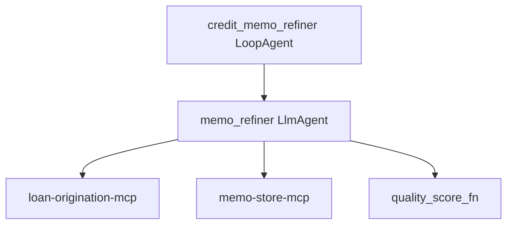

# App Blueprint — Credit Memo Iterative Drafting

> PRIMARY governance artifact (§1–§9). Technical config is derived into `app-blueprint.json`
> by `assemble_blueprint`. Never edit `app-blueprint.json` directly.

## §1 Application Overview
An iterative credit-memo drafting agent. A single refinement agent drafts a memo, then progressively improves that same stored memo over multiple passes until it meets a quality bar or hits a pass cap. Line of business: Commercial Lending.

## §2 Component Topology Diagram

A root `credit_memo_refiner` (LoopAgent) runs a single `memo_refiner` (LlmAgent) each pass. The refiner drafts on pass 1, improves the stored memo on later passes, self-scores via `quality_score_fn`, and the loop exits on `quality_score >= 0.90` or `pass_count >= 4`.

| Agent | Type | Role | Parent | Tools |
|---|---|---|---|---|
| credit_memo_refiner | LoopAgent | Root — refinement loop; exit score≥0.90 OR 4 passes | (root) | — |
| memo_refiner | LlmAgent | Draft then progressively refine the SAME stored memo; self-score | credit_memo_refiner | loan-origination-mcp, memo-store-mcp, quality_score_fn |

## §3 Architecture Patterns
Pattern catalog match (Solution Accelerator RAG): "refine... until [quality bar]" over one stored artifact → **Loop** (`credit_memo_refiner`, LoopAgent). One refinement agent self-scores and rewrites the same memo each pass (no separate reviewer agent, no fixed step count). The loop carries an explicit exit (`quality_score >= 0.90 OR pass_count >= 4`) plus a stall guard. `validate_composition` confirmed the LoopAgent has a single well-formed body with a termination predicate.

## §4 Tech Stack
| Component | Technology | Version |
|---|---|---|
| LLM | Gemini 2.0 Flash | latest |
| Agent runtime | Cloud Run + Agent Engine | GA |
| Source data | AlloyDB (read) | GA |
| Artifact store | Firestore (memo versions) | GA |
| Diagrams | Draw.io → Eraser MCP render | — |

## §5 DevSecOps Stack
| Concern | Choice |
|---|---|
| Proxy | Apigee (one route per tool binding) |
| Per-agent identity | Workload Identity |
| CI/CD | Harness (no direct deploy) |
| Observability | Dynatrace + Splunk + OTel (per-pass score + latency spans) |
| Secrets / perimeter | Secret Manager + VPC-SC + CMEK |
| Content screening | Model Armor (input/output callbacks) |
| Auth | OAuth 2.1 + Microsoft Entra ID |

## §6 HA/DR Guidance
DR strategy hot-standby. Primary us-east4, DR us-central1. The dual exit (quality bar OR 4-pass cap) plus the stall guard guarantee termination. A loan-origination read failure stops before drafting (data_unavailable) rather than producing an empty memo.

## §7 HA/DR Diagrams

## §8 Architecture Decision Log
| ID | Decision | Rationale |
|---|---|---|
| ADR-001 | LoopAgent over a single stored memo | One agent progressively improves the same artifact to a quality bar |
| ADR-002 | Explicit dual exit (score≥0.90 OR 4 passes) | The loop must terminate (SR 11-7 + availability) |
| ADR-003 | Stall guard (no improvement ×2 → stop) | Avoid wasted passes / infinite polish |
| ADR-004 | No separate reviewer agent | The refiner self-scores; a second agent would add cost without changing the outcome |

## §9 NFRs
| Category | Requirement | Target |
|---|---|---|
| Quality | Exit quality bar | quality_score ≥ 0.90 |
| Termination | Hard pass cap | ≤ 4 passes (guaranteed exit) |
| Latency | Full refinement (≤ 4 passes) | < 4 min (p95) |
| Auditability | Every version + score retained | 7 years |
| Security | Financials | CMEK at rest, masked in logs, TLS 1.3 |
