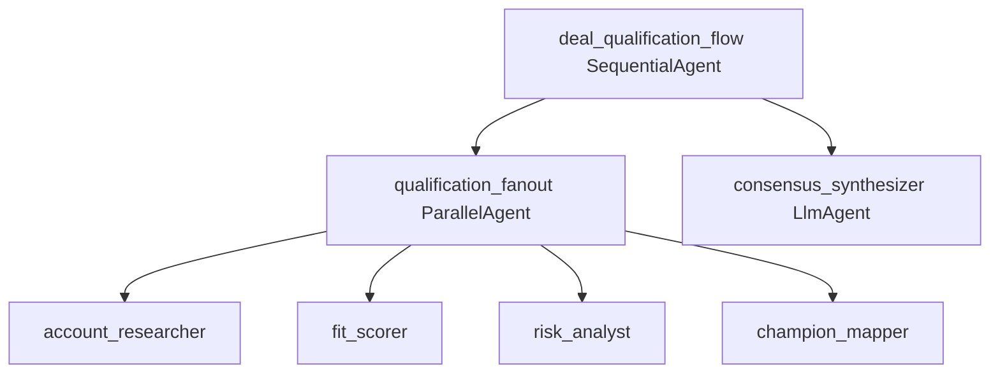

# App Blueprint — Enterprise Deal Qualification

> PRIMARY governance artifact (§1–§9). Technical config is derived into `app-blueprint.json`
> by `assemble_blueprint`. Never edit `app-blueprint.json` directly.

## §1 Application Overview
A multi-perspective deal-qualification agent. Four independent assessments run concurrently, then a synthesizer combines them into a single consensus recommendation (qualify/disqualify) with confidence and dissent, written back to the CRM. Line of business: Sales / Revenue Operations.

## §2 Component Topology Diagram

A root `deal_qualification_flow` (SequentialAgent) runs a `qualification_fanout` (ParallelAgent) over four assessment agents, then a `consensus_synthesizer` (LlmAgent) that combines the four results via a `consensus_fn` and writes to the CRM.

| Agent | Type | Role | Parent | Tools |
|---|---|---|---|---|
| deal_qualification_flow | SequentialAgent | Root — fan-out then synthesize | (root) | — |
| qualification_fanout | ParallelAgent | Four concurrent independent assessments | deal_qualification_flow | — |
| account_researcher | LlmAgent | Company research | qualification_fanout | firmographics-mcp, data-enrichment-a2a, pipeline-db-mcp |
| fit_scorer | LlmAgent | ICP fit scoring | qualification_fanout | firmographics-mcp, intent-data-mcp |
| risk_analyst | LlmAgent | Deal risk analysis | qualification_fanout | pipeline-db-mcp |
| champion_mapper | LlmAgent | Champion / stakeholder mapping | qualification_fanout | intent-data-mcp |
| consensus_synthesizer | LlmAgent | Combine 4 results into a consensus recommendation; write CRM | deal_qualification_flow | pipeline-db-mcp, crm-writeback-mcp, consensus_fn |

## §3 Architecture Patterns
Pattern catalog matches (Solution Accelerator RAG): "simultaneously / concurrently" over four independent assessments → **Parallel** (`qualification_fanout`); "then combine into a single recommendation" → a synthesizer fan-in (LlmAgent). The four assessments are independent (none consumes another's output) and are dispatched together, so the catalog selects Parallel (not a routed dispatch). `validate_composition` confirmed the synthesizer is a sibling step after the ParallelAgent (not nested inside it).

## §4 Tech Stack
| Component | Technology | Version |
|---|---|---|
| LLM | Gemini 2.0 Flash | latest |
| Agent runtime | Cloud Run + Agent Engine | GA |
| Database | AlloyDB (dual-region EU+US) | GA |
| Diagrams | Draw.io → Eraser MCP render | — |

## §5 DevSecOps Stack
| Concern | Choice |
|---|---|
| Proxy | Apigee (one route per tool binding; A2A route from API Hub) |
| Per-agent identity | Workload Identity |
| CI/CD | Harness (no direct deploy) |
| Observability | Dynatrace + Splunk + OTel |
| Secrets / perimeter | Secret Manager + VPC-SC + CMEK |
| Content screening | Model Armor (input/output callbacks) |
| Auth | OAuth 2.1 + Microsoft Entra ID |

## §6 HA/DR Guidance
DR strategy hot-standby. Primary us-east4, DR us-central1, EU+US residency. A single assessment failure is non-blocking — the synthesizer combines available results with lowered confidence. CRM write failures retry then queue for manual write-back.

## §7 HA/DR Diagrams

## §8 Architecture Decision Log
| ID | Decision | Rationale |
|---|---|---|
| ADR-001 | ParallelAgent for the four assessments | Independent, concurrent — Parallel gives speedup and isolation |
| ADR-002 | Synthesizer combines results (consensus_fn) | A fan-out needs a fan-in to produce one recommendation |
| ADR-003 | Single-assessment failure is non-blocking | Don't lose three good assessments to one failure |
| ADR-004 | Data enrichment via A2A | Partner runs their own enrichment system |

## §9 NFRs
| Category | Requirement | Target |
|---|---|---|
| Latency | Full qualification (4 concurrent) | < 90s (p95) |
| Latency | Speedup vs serial | ≥ 3x |
| Resilience | Single assessment failure | non-blocking (lower confidence) |
| Availability | Service uptime | 99.9% |
| Data retention | Prospect data | 2 years or until opt-out |
