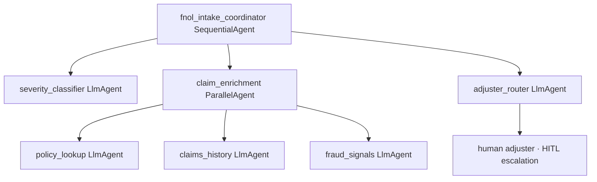

# App Blueprint — Automated FNOL Claims Intake

> PRIMARY governance artifact (§1–§9). Technical config is derived into `app-blueprint.json`
> by `assemble_blueprint`. Never edit `app-blueprint.json` directly.
> This blueprint was produced by the Solution Accelerator Agent's `recommend_architecture` FunctionTool
> from the Epic-ingested `spec.md`, demonstrating the full Epic → spec → blueprint path.

## §1 Application Overview
An automated First-Notice-Of-Loss (FNOL) intake agent. When a claim is filed it first classifies severity, then enriches the claim from three sources concurrently, and routes high-severity claims to a human adjuster. Line of business: Claims.

## §2 Component Topology Diagram
A root `fnol_intake_coordinator` (SequentialAgent) runs three stages: `severity_classifier` (LlmAgent), then `claim_enrichment` (ParallelAgent fanning out to three enrichment agents), then `adjuster_router` (LlmAgent) which escalates high-severity claims to a human adjuster (HITL).

*(Rendered to `diagrams/component-topology.png` by `assemble_blueprint` via the Eraser MCP at generation time.)*

| Agent | Type | Role | Parent | Tools |
|---|---|---|---|---|
| fnol_intake_coordinator | SequentialAgent | Root — classify → enrich → route | (root) | — |
| severity_classifier | LlmAgent | Classify claim severity | fnol_intake_coordinator | policy-db-mcp |
| claim_enrichment | ParallelAgent | Enrich from three sources concurrently | fnol_intake_coordinator | — |
| policy_lookup | LlmAgent | Read/update the policy database | claim_enrichment | policy-db-mcp |
| claims_history | LlmAgent | Pull prior claims history | claim_enrichment | claims-history-mcp |
| fraud_signals | LlmAgent | Pull fraud signals | claim_enrichment | fraud-signals-mcp |
| adjuster_router | LlmAgent | Route high-severity claims to a human adjuster | fnol_intake_coordinator | hitl_escalation_fn |

## §3 Architecture Patterns
Pattern catalog match (Solution Accelerator Agent RAG over the ingested spec §2 ordering signals): "first classify … then enrich … in parallel" → **Sequential** root (`fnol_intake_coordinator`) wrapping a **Parallel** enrichment stage (`claim_enrichment`, three independent reads), with a **Router + HITL** escalation (`adjuster_router` → human adjuster) for the "route high-severity claims to a human adjuster" signal. `validate_composition` confirmed the ParallelAgent has independent branches (no shared write) and is not nested directly inside a LoopAgent.

## §4 Tech Stack
| Component | Technology | Version |
|---|---|---|
| LLM | Gemini 2.0 Flash | latest |
| Agent runtime | Cloud Run + Agent Engine | GA |
| Policy data | AlloyDB (read/write) | GA |
| Intake store | Firestore | GA |
| Diagrams | Draw.io → Eraser MCP render | — |

## §5 DevSecOps Stack
| Concern | Choice |
|---|---|
| Proxy | Apigee (one route per tool binding) |
| Per-agent identity | Workload Identity |
| CI/CD | Harness (no direct deploy) |
| Observability | Dynatrace + Splunk + OTel (per-stage latency + classification-accuracy spans) |
| Secrets / perimeter | Secret Manager + VPC-SC + CMEK |
| Content screening | Model Armor (input/output callbacks) |
| Auth | OAuth 2.1 + Microsoft Entra ID |

## §6 HA/DR Guidance
DR strategy hot-standby. Primary us-east4, DR us-central1. The ParallelAgent applies a per-branch timeout so a single slow enrichment source cannot blow the 5-minute p95; a policy-DB read failure degrades to a partial-enrichment path flagged for the adjuster rather than failing the intake.

## §7 HA/DR Diagrams
*(Rendered to `diagrams/hadr-lifecycle.png` by `assemble_blueprint` via the Eraser MCP at generation time.)*

## §8 Architecture Decision Log
| ID | Decision | Rationale |
|---|---|---|
| ADR-001 | Sequential root (classify → enrich → route) | The §2 ordering signal requires classification before enrichment |
| ADR-002 | Parallel enrichment (3 branches) | Three independent reads → concurrency to meet the 5-minute p95 |
| ADR-003 | HITL escalation for high-severity | The Epic mandates routing high-severity claims to a human adjuster |
| ADR-004 | Per-branch timeout + partial-enrichment fallback | Protect the latency SLO and availability NFR |

## §9 NFRs
| Category | Requirement | Target |
|---|---|---|
| Latency | End-to-end intake | < 5 min (p95) |
| Quality | Severity classification accuracy | > 95% |
| Availability | Service uptime | 99.9% |
| Security | Claimant + policy PII | CMEK at rest, masked in logs, TLS 1.3 |
