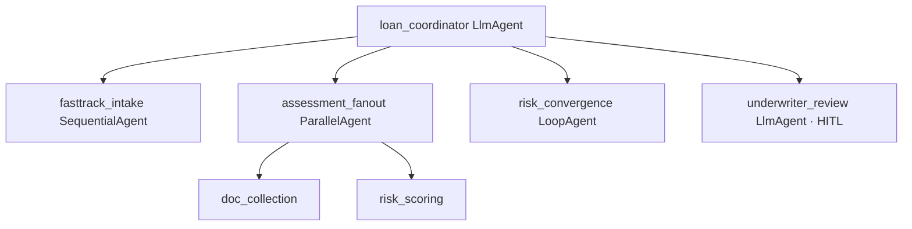

# App Blueprint — Tiered Loan Underwriting

> PRIMARY governance artifact (§1–§9). Technical config (agent topology, tool bindings,
> business rules, infra modules, screening, eval) is derived into `app-blueprint.json`
> by `assemble_blueprint`. Never edit `app-blueprint.json` directly.

## §1 Application Overview
A tiered loan-underwriting agent. A coordinator agent reads the loan request, determines the tier, and orchestrates a tier-specific flow: a fast-track sequence for small loans, a concurrent assessment for mid/large loans, a risk-refinement loop for large loans, and human review (underwriter or credit committee) where required. Line of business: Consumer & Small-Business Lending. Returns a decision package written to core banking.

## §2 Component Topology Diagram

A root `loan_coordinator` (LlmAgent) orchestrates four sub-flows. It uses a `tier_router` FunctionTool to determine tier, then delegates to the matching sub-flow. `fasttrack_intake` (SequentialAgent) runs credit-pull → auto-decision. `assessment_fanout` (ParallelAgent) runs document collection and risk scoring concurrently (plus multi-bureau + collateral for large loans). `risk_convergence` (LoopAgent) refines the risk model until stable for large loans. `underwriter_review` (LlmAgent, human-in-the-loop) handles underwriter or credit-committee sign-off.

| Agent | Type | Role | Parent | Tools |
|---|---|---|---|---|
| loan_coordinator | LlmAgent | Root — determine tier, orchestrate sub-flows | (root) | core-banking-mcp, kyc-aml-a2a, tier_router, decision_fn |
| fasttrack_intake | SequentialAgent | Small loans: credit pull → auto-decision | loan_coordinator | — |
| assessment_fanout | ParallelAgent | Mid/large: concurrent document + risk (+ multi-bureau/collateral) | loan_coordinator | — |
| risk_convergence | LoopAgent | Large loans: refine risk until stable (delta<0.02 OR 5 passes) | loan_coordinator | — |
| underwriter_review | LlmAgent | Human review (underwriter or credit committee) | loan_coordinator | core-banking-mcp |
| credit_pull | LlmAgent | Pull credit | fasttrack_intake | credit-bureau-mcp |
| auto_decision | LlmAgent | Automated decision for small loans | fasttrack_intake | decision_fn |
| doc_collection | LlmAgent | Collect supporting documents | assessment_fanout | core-banking-mcp |
| risk_scoring | LlmAgent | Score risk (+ multi-bureau/collateral for large) | assessment_fanout | credit-bureau-mcp, collateral-valuation-mcp |

## §3 Architecture Patterns
Pattern catalog matches (Solution Accelerator RAG over the Workflow ordering words):
- "first... then" within the small-loan tier → **Sequential** (`fasttrack_intake`).
- "simultaneously" within mid/large tiers → **Parallel** (`assessment_fanout`).
- "refine... until [stable]" within the large tier → **Loop** (`risk_convergence`, explicit exit: delta < 0.02 OR 5 passes).
- "route to a single underwriter / credit committee for human review" → **HITL** (`underwriter_review`).

The tier-dependent branching is handled by the `loan_coordinator` LlmAgent's reasoning plus the `tier_router` FunctionTool — the coordinator selects which composed sub-flow to run per request. `validate_composition` confirmed the pattern tree is well-formed (no LoopAgent nested inside a ParallelAgent).

## §4 Tech Stack
| Component | Technology | Version |
|---|---|---|
| LLM | Gemini 2.0 Flash | latest |
| Agent runtime | Cloud Run + Agent Engine | GA |
| Database | AlloyDB (PostgreSQL-compatible) | GA |
| Diagrams | Draw.io (hediet.vscode-drawio) → Eraser MCP render | — |

## §5 DevSecOps Stack
| Concern | Choice |
|---|---|
| Proxy | Apigee (one route per tool binding; A2A routes from API Hub) |
| Per-agent identity | Workload Identity (least-privilege from tool bindings) |
| CI/CD | Harness (no direct deploy) |
| Observability | Dynatrace + Splunk + OTel |
| Secrets / perimeter | Secret Manager + VPC-SC + CMEK |
| Content screening | Model Armor (input/output callbacks) |
| Auth | OAuth 2.1 + Microsoft Entra ID |

## §6 HA/DR Guidance
DR strategy hot-standby. Primary us-east4, DR us-central1. Credit-pull failures hold the request rather than auto-deciding. Large-loan collateral failures route to committee with a pending flag. The risk loop always terminates (delta or pass cap), so the agent never hangs.

## §7 HA/DR Diagrams

## §8 Architecture Decision Log
| ID | Decision | Rationale |
|---|---|---|
| ADR-001 | LlmAgent coordinator composing Sequential/Parallel/Loop/HITL | Tier-dependent flows need a reasoning orchestrator, not one fixed pipeline |
| ADR-002 | Loop exit delta<0.02 OR 5 passes | Risk refinement must terminate (SR 11-7 + availability) |
| ADR-003 | KYC/AML via A2A | Partner operates their own screening system |
| ADR-004 | Credit-pull failure holds the request | ECOA — never decide without required inputs |

## §9 NFRs
| Category | Requirement | Target |
|---|---|---|
| Latency | Small-loan fast-track | < 3 min (p95) |
| Latency | Large-loan full assessment | < 12 min (p95) |
| Availability | Service uptime | 99.9% |
| Termination | Risk loop | guaranteed exit (delta or 5 passes) |
| Data retention | Decision + inputs | 7 years |
| Security | PII/financials | AES-256 + CMEK at rest, TLS 1.3 in transit |
