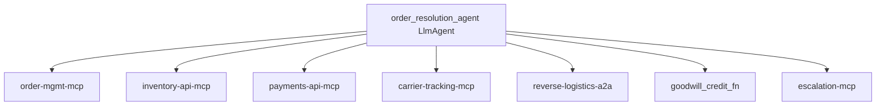

# App Blueprint — Order Issue Resolution

> PRIMARY governance artifact (§1–§9). Technical config is derived into `app-blueprint.json`
> by `assemble_blueprint`. Never edit `app-blueprint.json` directly.

## §1 Application Overview
A single-agent order-issue resolver. One LlmAgent reasons over the customer's message and its bound tools, choosing each next action dynamically from the previous result, until the issue is resolved or escalated. Line of business: Retail Customer Support.

## §2 Component Topology Diagram

A single root `order_resolution_agent` (LlmAgent) owns the entire interaction. It has no sub-agents; it selects among its tools at runtime based on what it observes. An explicit cap (8 reasoning steps) and an escalation path bound the interaction.

| Agent | Type | Role | Parent | Tools |
|---|---|---|---|---|
| order_resolution_agent | LlmAgent | Single agent — reason over tools, act, observe, adapt | (root) | order-mgmt-mcp, inventory-api-mcp, payments-api-mcp, carrier-tracking-mcp, reverse-logistics-a2a, goodwill_credit_fn, escalation-mcp |

## §3 Architecture Patterns
Pattern catalog match (Solution Accelerator RAG): the Workflow has no fan-out ordering words ("simultaneously") and no fixed sequence ("first... then... finally") — it describes one agent choosing tools dynamically. The catalog therefore matches a **single LlmAgent with dynamic tool use** (no SequentialAgent/ParallelAgent/LoopAgent wrapper). Bounded by an 8-step cap + escalation. `validate_composition` confirmed a valid single-node tree.

## §4 Tech Stack
| Component | Technology | Version |
|---|---|---|
| LLM | Gemini 2.0 Flash | latest |
| Agent runtime | Cloud Run + Agent Engine | GA |
| Database | AlloyDB | GA |
| Diagrams | Draw.io → Eraser MCP render | — |

## §5 DevSecOps Stack
| Concern | Choice |
|---|---|
| Proxy | Apigee (one route per tool binding; A2A route from API Hub) |
| Per-agent identity | Workload Identity |
| CI/CD | Harness (no direct deploy) |
| Observability | Dynatrace + Splunk + OTel |
| Secrets / perimeter | Secret Manager + VPC-SC + CMEK |
| Content screening | Model Armor (input/output callbacks) |
| Auth | OAuth 2.1 + Microsoft Entra ID |

## §6 HA/DR Guidance
DR strategy hot-standby. Primary us-east4, DR us-central1. The 8-step cap guarantees termination. Payment failures degrade to a manual-refund task; carrier-tracking gaps degrade to order-system status. No single tool failure hangs the agent.

## §7 HA/DR Diagrams

## §8 Architecture Decision Log
| ID | Decision | Rationale |
|---|---|---|
| ADR-001 | Single LlmAgent, no sub-agents | Issue path is dynamic; a fixed pipeline would mishandle branching cases |
| ADR-002 | 8-step cap + escalation | Bound the reasoning loop; guarantee a human fallback |
| ADR-003 | Reverse logistics via A2A | Partner runs their own returns system |
| ADR-004 | PAN never logged | PCI-DSS |

## §9 NFRs
| Category | Requirement | Target |
|---|---|---|
| Latency | Typical resolution | < 30s (p95) |
| Termination | Reasoning loop | ≤ 8 steps then escalate |
| Availability | Service uptime | 99.9% |
| Security | PII/PAN | CMEK at rest, masked in logs, TLS 1.3 |
| Data retention | Interactions | 3 years |
