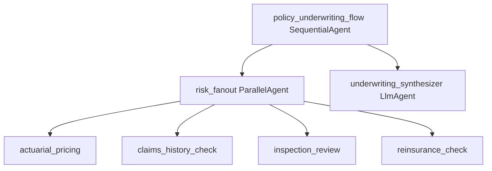

# App Blueprint — New-Policy Underwriting Risk Assessment

> PRIMARY governance artifact (§1–§9). Technical config is derived into `app-blueprint.json`
> by `assemble_blueprint`. Never edit `app-blueprint.json` directly.

## §1 Application Overview
A concurrent multi-assessment underwriting agent. Four independent risk assessments run at the same time, then a synthesizer combines them into one underwriting decision package written to policy admin. Line of business: P&C Underwriting.

## §2 Component Topology Diagram

A root `policy_underwriting_flow` (SequentialAgent) runs `risk_fanout` (ParallelAgent) over four assessment agents, then `underwriting_synthesizer` (LlmAgent) reconciles the four results via `synthesis_fn` and writes the decision.

| Agent | Type | Role | Parent | Tools |
|---|---|---|---|---|
| policy_underwriting_flow | SequentialAgent | Root — fan-out then synthesize | (root) | — |
| risk_fanout | ParallelAgent | Four concurrent independent assessments | policy_underwriting_flow | — |
| actuarial_pricing | LlmAgent | Compute price from rating tables | risk_fanout | pricing-engine-mcp |
| claims_history_check | LlmAgent | Prior loss + fraud-signal check | risk_fanout | claims-db-mcp, fraud-signals-a2a |
| inspection_review | LlmAgent | Review property inspection | risk_fanout | inspection-store-mcp |
| reinsurance_check | LlmAgent | Treaty eligibility | risk_fanout | reinsurance-api-mcp |
| underwriting_synthesizer | LlmAgent | Reconcile 4 results into one package; write policy admin | policy_underwriting_flow | policy-admin-mcp, synthesis_fn |

## §3 Architecture Patterns
Pattern catalog match (Solution Accelerator RAG): "simultaneously / concurrently" over four independent assessments → **Parallel** (`risk_fanout`); "then combine into one decision" → synthesizer fan-in. Assessments are independent and dispatched together (every application runs all four), so the catalog selects Parallel, not a routed dispatch. `validate_composition` confirmed the synthesizer is a sibling step after the ParallelAgent.

## §4 Tech Stack
| Component | Technology | Version |
|---|---|---|
| LLM | Gemini 2.0 Flash | latest |
| Agent runtime | Cloud Run + Agent Engine | GA |
| Database | AlloyDB | GA |
| Diagrams | Draw.io → Eraser MCP render | — |

## §5 DevSecOps Stack
| Concern | Choice |
|---|---|
| Proxy | Apigee (one route per tool binding; A2A route from API Hub) |
| Per-agent identity | Workload Identity |
| CI/CD | Harness (no direct deploy) |
| Observability | Dynatrace + Splunk + OTel |
| Secrets / perimeter | Secret Manager + VPC-SC + CMEK |
| Content screening | Model Armor (input/output callbacks) |
| Auth | OAuth 2.1 + Microsoft Entra ID |

## §6 HA/DR Guidance
DR strategy hot-standby. Primary us-east4, DR us-central1. A single-branch failure is non-blocking — the synthesizer reconciles available results and adds the matching pending flag. Policy-admin write failures retry then queue for manual write.

## §7 HA/DR Diagrams

## §8 Architecture Decision Log
| ID | Decision | Rationale |
|---|---|---|
| ADR-001 | ParallelAgent for the four assessments | Independent, concurrent — ~3.5x faster than serial |
| ADR-002 | Synthesizer fan-in (synthesis_fn) | A fan-out needs an aggregator to produce one decision |
| ADR-003 | Non-blocking branch failures | Don't lose three good assessments to one failure |
| ADR-004 | Fraud consortium via A2A | Partner runs their own scoring system |

## §9 NFRs
| Category | Requirement | Target |
|---|---|---|
| Latency | Full assessment (4 concurrent) | < 5 min (p95) |
| Latency | Speedup vs serial | ≥ 3.5x |
| Resilience | Single-branch failure | non-blocking (partial synthesis) |
| Availability | Service uptime | 99.9% |
| Data retention | Application + decision | 10 years |
